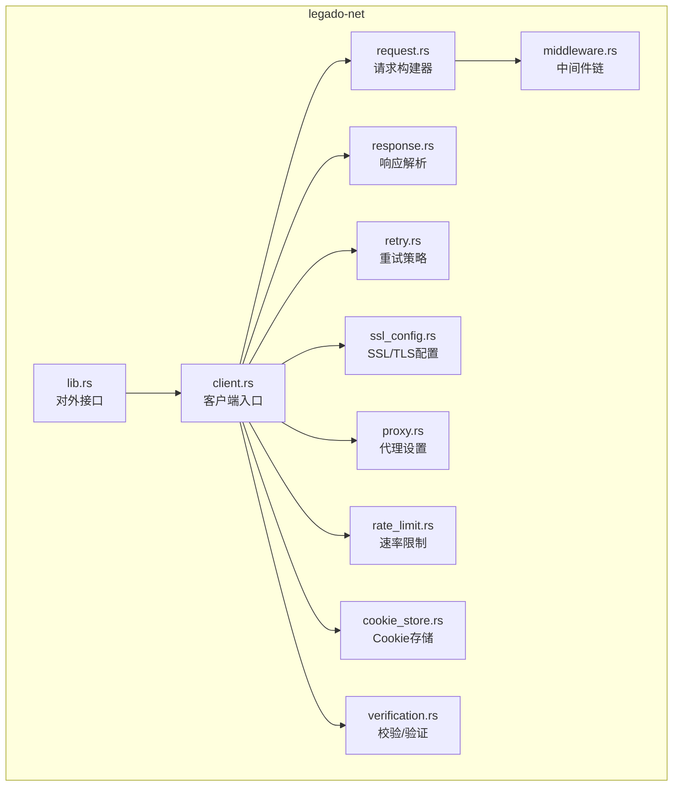
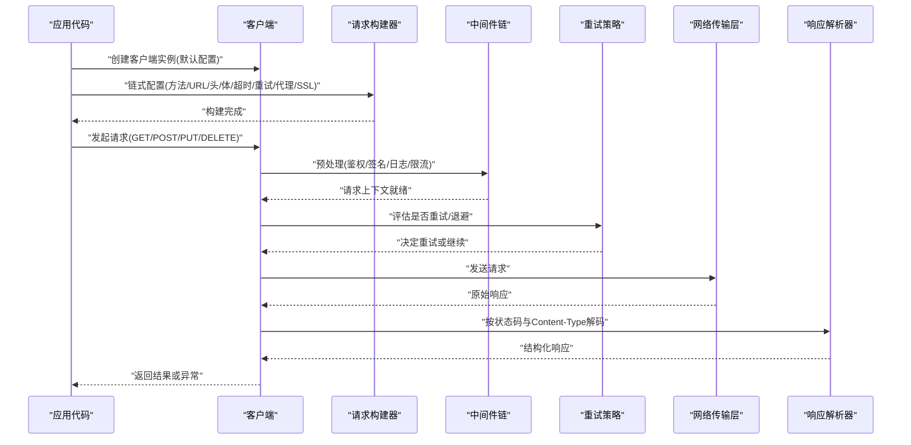
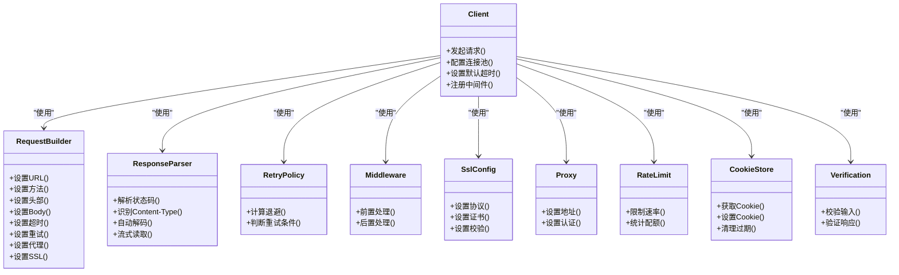

# HTTP客户端

<cite>
**本文档引用的文件**
- [client.rs](file://rust/legado-net/src/client.rs)
- [request.rs](file://rust/legado-net/src/request.rs)
- [response.rs](file://rust/legado-net/src/response.rs)
- [retry.rs](file://rust/legado-net/src/retry.rs)
- [ssl_config.rs](file://rust/legado-net/src/ssl_config.rs)
- [middleware.rs](file://rust/legado-net/src/middleware.rs)
- [proxy.rs](file://rust/legado-net/src/proxy.rs)
- [rate_limit.rs](file://rust/legado-net/src/rate_limit.rs)
- [cookie_store.rs](file://rust/legado-net/src/cookie_store.rs)
- [verification.rs](file://rust/legado-net/src/verification.rs)
- [lib.rs](file://rust/legado-net/src/lib.rs)
</cite>

## 目录
1. [简介](#简介)
2. [项目结构](#项目结构)
3. [核心组件](#核心组件)
4. [架构总览](#架构总览)
5. [详细组件分析](#详细组件分析)
6. [依赖关系分析](#依赖关系分析)
7. [性能考量](#性能考量)
8. [故障排查指南](#故障排查指南)
9. [结论](#结论)
10. [附录](#附录)

## 简介
本文件面向Legado项目的HTTP客户端实现，聚焦于请求构建器模式、响应解析与错误处理机制。文档覆盖请求配置（超时、重试、连接池、SSL/TLS）、响应处理流程（状态码、内容类型识别、自动解码），并提供GET/POST/PUT/DELETE等常见请求的示例路径，以及异步与流式响应的处理方式。同时给出网络调试技巧与常见问题解决方案，帮助开发者快速定位并解决问题。

## 项目结构
HTTP客户端位于Rust模块legado-net中，采用分层设计：
- 客户端入口与调度：client.rs
- 请求构建与中间件链：request.rs、middleware.rs
- 响应解析与数据模型：response.rs
- 重试策略：retry.rs
- SSL/TLS配置：ssl_config.rs
- 代理与限速：proxy.rs、rate_limit.rs
- Cookie管理：cookie_store.rs
- 校验与验证：verification.rs
- 模块对外暴露：lib.rs

图表来源
- [client.rs:1-200](file://rust/legado-net/src/client.rs#L1-L200)
- [request.rs:1-200](file://rust/legado-net/src/request.rs#L1-L200)
- [response.rs:1-200](file://rust/legado-net/src/response.rs#L1-L200)
- [retry.rs:1-200](file://rust/legado-net/src/retry.rs#L1-L200)
- [ssl_config.rs:1-200](file://rust/legado-net/src/ssl_config.rs#L1-L200)
- [middleware.rs:1-200](file://rust/legado-net/src/middleware.rs#L1-L200)
- [proxy.rs:1-200](file://rust/legado-net/src/proxy.rs#L1-L200)
- [rate_limit.rs:1-200](file://rust/legado-net/src/rate_limit.rs#L1-L200)
- [cookie_store.rs:1-200](file://rust/legado-net/src/cookie_store.rs#L1-L200)
- [verification.rs:1-200](file://rust/legado-net/src/verification.rs#L1-L200)
- [lib.rs:1-200](file://rust/legado-net/src/lib.rs#L1-L200)

章节来源
- [lib.rs:1-200](file://rust/legado-net/src/lib.rs#L1-L200)

## 核心组件
- 客户端（Client）：负责生命周期管理、默认配置、连接池、并发控制与调度。提供统一的API以发起同步/异步请求，支持流式响应。
- 请求构建器（RequestBuilder）：通过链式调用设置URL、方法、头部、查询参数、Body、超时、重试策略、代理、SSL/TLS选项等。
- 响应解析器（ResponseParser）：根据状态码与Content-Type进行自动解码（JSON、文本、二进制），并提供便捷访问字段。
- 重试策略（RetryPolicy）：基于指数退避、抖动、最大重试次数与条件判断（如特定状态码或网络错误）进行重试。
- 中间件（Middleware）：在请求发送前与响应返回后执行横切逻辑，如日志、鉴权、签名、压缩、限流等。
- SSL/TLS配置（SslConfig）：自定义证书、协议版本、加密套件、主机名校验等。
- 代理（Proxy）：HTTP/SOCKS代理设置与认证。
- 速率限制（RateLimit）：令牌桶或滑动窗口限流，避免对远端造成压力。
- Cookie存储（CookieStore）：持久化与共享Cookie，支持域名隔离与过期清理。
- 校验与验证（Verification）：请求参数校验、响应完整性校验、签名验证等。

章节来源
- [client.rs:1-200](file://rust/legado-net/src/client.rs#L1-L200)
- [request.rs:1-200](file://rust/legado-net/src/request.rs#L1-L200)
- [response.rs:1-200](file://rust/legado-net/src/response.rs#L1-L200)
- [retry.rs:1-200](file://rust/legado-net/src/retry.rs#L1-L200)
- [middleware.rs:1-200](file://rust/legado-net/src/middleware.rs#L1-L200)
- [ssl_config.rs:1-200](file://rust/legado-net/src/ssl_config.rs#L1-L200)
- [proxy.rs:1-200](file://rust/legado-net/src/proxy.rs#L1-L200)
- [rate_limit.rs:1-200](file://rust/legado-net/src/rate_limit.rs#L1-L200)
- [cookie_store.rs:1-200](file://rust/legado-net/src/cookie_store.rs#L1-L200)
- [verification.rs:1-200](file://rust/legado-net/src/verification.rs#L1-L200)

## 架构总览
HTTP客户端采用“构建器+中间件+策略”的架构：
- 构建器负责组装请求上下文与配置；
- 中间件链对请求/响应进行横切处理；
- 策略（重试、限速、SSL/TLS）可插拔组合；
- 客户端统一调度底层传输层（如Tokio/reqwest/Cronet等）。

图表来源
- [client.rs:1-200](file://rust/legado-net/src/client.rs#L1-L200)
- [request.rs:1-200](file://rust/legado-net/src/request.rs#L1-L200)
- [middleware.rs:1-200](file://rust/legado-net/src/middleware.rs#L1-L200)
- [retry.rs:1-200](file://rust/legado-net/src/retry.rs#L1-L200)
- [response.rs:1-200](file://rust/legado-net/src/response.rs#L1-L200)

## 详细组件分析

### 客户端（Client）
- 职责：维护全局配置（连接池大小、默认超时、UA、Cookie存储）、并发控制、调度重试与中间件链。
- 关键能力：
  - 同步/异步请求入口
  - 流式响应支持（分块读取、背压）
  - 连接池管理与复用
  - 错误分类与包装（网络、超时、SSL、业务错误）
- 典型用法：
  - GET/POST/PUT/DELETE快捷方法
  - 自定义传输层替换（便于测试或平台适配）

章节来源
- [client.rs:1-200](file://rust/legado-net/src/client.rs#L1-L200)

### 请求构建器（RequestBuilder）
- 职责：将用户意图转换为标准化请求上下文。
- 配置项：
  - URL与方法
  - 头部与查询参数
  - Body（字符串、字节、表单、JSON、Multipart）
  - 超时（连接、读、写）
  - 重试策略（次数、退避、抖动、条件）
  - 代理（HTTP/SOCKS）
  - SSL/TLS（证书、协议、校验开关）
  - 中间件注入点
- 设计要点：
  - 不可变构建过程，最终生成一次性请求对象
  - 参数校验与默认值合并
  - 与中间件链集成

章节来源
- [request.rs:1-200](file://rust/legado-net/src/request.rs#L1-L200)

### 响应解析器（ResponseParser）
- 职责：将原始响应转换为结构化数据。
- 功能：
  - 状态码处理（成功、重定向、客户端/服务端错误）
  - Content-Type识别与自动解码（JSON、HTML、纯文本、二进制）
  - 编码检测与转码（UTF-8、GBK等）
  - 流式响应封装（ReadableStream/AsyncIterator）
- 错误处理：
  - 解码失败时抛出明确错误类型
  - 大响应时的内存保护（分块处理）

章节来源
- [response.rs:1-200](file://rust/legado-net/src/response.rs#L1-L200)

### 重试策略（RetryPolicy）
- 职责：定义何时以及如何重试。
- 策略要素：
  - 最大重试次数
  - 指数退避与随机抖动
  - 条件判断（状态码、错误类型、响应头）
  - 幂等性检查（仅对GET/HEAD等安全方法重试）
- 扩展点：
  - 自定义重试决策函数
  - 与中间件联动（如鉴权失败触发刷新Token）

章节来源
- [retry.rs:1-200](file://rust/legado-net/src/retry.rs#L1-L200)

### 中间件（Middleware）
- 职责：横切关注点解耦。
- 内置能力：
  - 日志记录（请求/响应摘要）
  - 鉴权与签名（HMAC、OAuth、JWT）
  - 压缩与解压（gzip/br）
  - 速率限制（令牌桶/滑动窗口）
  - 缓存（可选）
- 执行顺序：
  - 请求阶段：从外到内
  - 响应阶段：从内到外

章节来源
- [middleware.rs:1-200](file://rust/legado-net/src/middleware.rs#L1-L200)

### SSL/TLS配置（SslConfig）
- 职责：定制TLS握手行为。
- 配置项：
  - 协议版本（TLS1.2/1.3）
  - 加密套件优先级
  - 自定义CA证书与客户端证书
  - 主机名校验开关
  - OCSP Stapling与CRL
- 安全建议：
  - 生产环境启用严格校验
  - 谨慎使用自签证书

章节来源
- [ssl_config.rs:1-200](file://rust/legado-net/src/ssl_config.rs#L1-L200)

### 代理（Proxy）
- 职责：通过代理转发请求。
- 支持：
  - HTTP/HTTPS代理
  - SOCKS5代理
  - 代理认证（用户名/密码）
  - 直连例外列表（NoProxy）

章节来源
- [proxy.rs:1-200](file://rust/legado-net/src/proxy.rs#L1-L200)

### 速率限制（RateLimit）
- 职责：控制请求频率，避免被限流或封禁。
- 算法：
  - 令牌桶（平滑突发）
  - 滑动窗口（精确限流）
- 粒度：
  - 全局/按域名/按接口

章节来源
- [rate_limit.rs:1-200](file://rust/legado-net/src/rate_limit.rs#L1-L200)

### Cookie存储（CookieStore）
- 职责：持久化与管理Cookie。
- 特性：
  - 域名隔离与路径匹配
  - 过期清理与容量上限
  - 跨会话共享

章节来源
- [cookie_store.rs:1-200](file://rust/legado-net/src/cookie_store.rs#L1-L200)

### 校验与验证（Verification）
- 职责：确保请求与响应的正确性与安全性。
- 能力：
  - 输入参数校验（必填、格式、范围）
  - 响应完整性校验（签名、哈希）
  - 白名单/黑名单过滤

章节来源
- [verification.rs:1-200](file://rust/legado-net/src/verification.rs#L1-L200)

## 依赖关系分析

图表来源
- [client.rs:1-200](file://rust/legado-net/src/client.rs#L1-L200)
- [request.rs:1-200](file://rust/legado-net/src/request.rs#L1-L200)
- [response.rs:1-200](file://rust/legado-net/src/response.rs#L1-L200)
- [retry.rs:1-200](file://rust/legado-net/src/retry.rs#L1-L200)
- [middleware.rs:1-200](file://rust/legado-net/src/middleware.rs#L1-L200)
- [ssl_config.rs:1-200](file://rust/legado-net/src/ssl_config.rs#L1-L200)
- [proxy.rs:1-200](file://rust/legado-net/src/proxy.rs#L1-L200)
- [rate_limit.rs:1-200](file://rust/legado-net/src/rate_limit.rs#L1-L200)
- [cookie_store.rs:1-200](file://rust/legado-net/src/cookie_store.rs#L1-L200)
- [verification.rs:1-200](file://rust/legado-net/src/verification.rs#L1-L200)

章节来源
- [lib.rs:1-200](file://rust/legado-net/src/lib.rs#L1-L200)

## 性能考量
- 连接池：合理设置最大连接数与空闲超时，避免连接泄漏。
- 超时配置：区分连接、读、写超时，防止阻塞线程。
- 重试策略：仅在幂等请求上启用，避免重复副作用。
- 流式响应：大文件下载与实时数据流优先使用流式API，减少内存占用。
- 压缩：启用gzip/br以减少带宽，但注意CPU开销。
- 中间件：避免在热路径上进行重型操作（如序列化/反序列化）。
- 代理与限速：在高并发场景下评估代理延迟与限流阈值。

[本节为通用指导，不直接分析具体文件]

## 故障排查指南
- 连接失败：
  - 检查代理与SSL配置是否正确
  - 确认防火墙与DNS解析
  - 查看连接超时与重试策略
- 超时问题：
  - 调整读/写超时时间
  - 检查服务器响应时间与带宽
  - 启用慢请求日志
- 解码错误：
  - 确认Content-Type与字符集
  - 检查响应是否为压缩或未预期格式
- 权限与签名：
  - 验证鉴权中间件与签名算法
  - 检查Cookie与Token有效期
- 限流与封禁：
  - 降低请求频率
  - 增加退避与抖动
  - 监控状态码429/5xx比例

章节来源
- [retry.rs:1-200](file://rust/legado-net/src/retry.rs#L1-L200)
- [ssl_config.rs:1-200](file://rust/legado-net/src/ssl_config.rs#L1-L200)
- [proxy.rs:1-200](file://rust/legado-net/src/proxy.rs#L1-L200)
- [rate_limit.rs:1-200](file://rust/legado-net/src/rate_limit.rs#L1-L200)
- [response.rs:1-200](file://rust/legado-net/src/response.rs#L1-L200)

## 结论
Legado的HTTP客户端通过构建器模式与中间件链实现了高内聚、低耦合的网络请求能力。其重试策略、SSL/TLS配置、代理与限速等功能满足复杂场景需求。结合流式响应与完善的错误处理，开发者可以高效、稳定地实现各类HTTP交互。建议在项目中遵循最佳实践，合理配置超时、重试与连接池，以获得更优的性能与稳定性。

[本节为总结，不直接分析具体文件]

## 附录

### 常用请求示例（路径指引）
- GET请求：参考请求构建器的GET方法与响应解析流程
- POST请求：参考Body设置与JSON编码
- PUT请求：参考幂等性与重试策略
- DELETE请求：参考安全方法与错误处理

章节来源
- [request.rs:1-200](file://rust/legado-net/src/request.rs#L1-L200)
- [response.rs:1-200](file://rust/legado-net/src/response.rs#L1-L200)

### 异步与流式响应
- 异步请求：使用异步API以避免阻塞主线程
- 流式响应：适用于大文件下载与实时数据流，注意背压与错误恢复

章节来源
- [client.rs:1-200](file://rust/legado-net/src/client.rs#L1-L200)
- [response.rs:1-200](file://rust/legado-net/src/response.rs#L1-L200)

### 网络调试技巧
- 启用详细日志（请求/响应头与摘要）
- 抓包工具（Wireshark/Fiddler）配合代理
- 模拟不同网络条件（延迟、丢包）
- 单元测试与Mock服务

章节来源
- [middleware.rs:1-200](file://rust/legado-net/src/middleware.rs#L1-L200)
- [proxy.rs:1-200](file://rust/legado-net/src/proxy.rs#L1-L200)