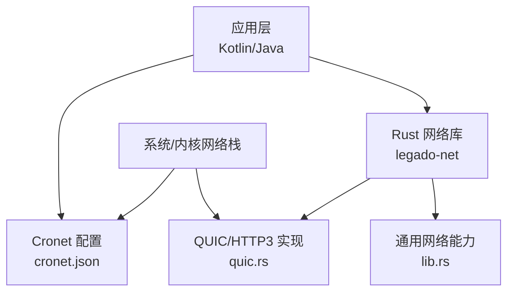
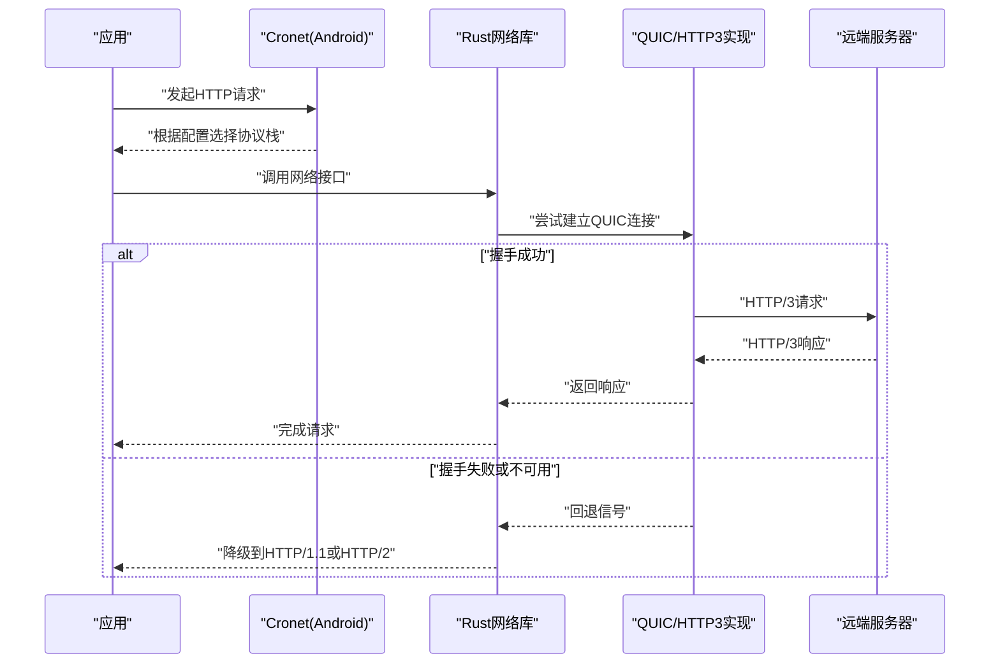
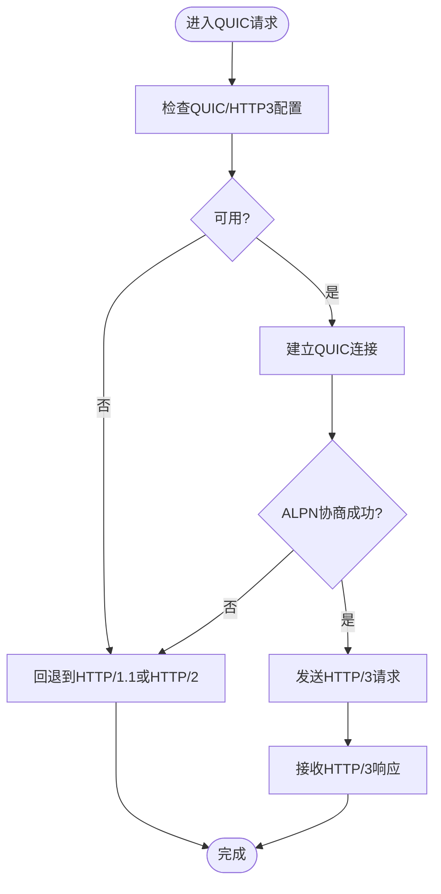
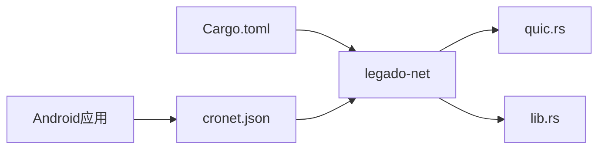

# QUIC/HTTP3协议支持

<cite>
**本文引用的文件**   
- [rust/legado-net/src/quic.rs](file://rust/legado-net/src/quic.rs)
- [rust/legado-net/src/lib.rs](file://rust/legado-net/src/lib.rs)
- [rust/legado-net/Cargo.toml](file://rust/legado-net/Cargo.toml)
- [app/src/main/assets/cronet.json](file://app/src/main/assets/cronet.json)
</cite>

## 目录
1. [简介](#简介)
2. [项目结构](#项目结构)
3. [核心组件](#核心组件)
4. [架构总览](#架构总览)
5. [详细组件分析](#详细组件分析)
6. [依赖关系分析](#依赖关系分析)
7. [性能考量](#性能考量)
8. [故障排查指南](#故障排查指南)
9. [结论](#结论)
10. [附录](#附录)

## 简介
本文件聚焦于Legado项目中QUIC与HTTP/3协议的支持情况，梳理相关代码位置、模块职责、数据流与控制流，并给出可操作的配置与排障建议。文档面向不同技术背景的读者，既提供高层概览，也包含代码级细节与图示说明。

## 项目结构
与QUIC/HTTP/3相关的实现主要集中在Rust层的网络模块中，Android端通过Cronet进行网络加速与协议选择。关键目录与文件：
- Rust网络层：位于 rust/legado-net，其中 quic.rs 为QUIC/HTTP3能力入口，lib.rs 暴露模块接口，Cargo.toml 声明依赖。
- Android端：assets/cronet.json 用于Cronet配置，影响底层网络栈行为（如是否启用HTTP/3）。

图表来源
- [app/src/main/assets/cronet.json](file://app/src/main/assets/cronet.json)
- [rust/legado-net/src/quic.rs](file://rust/legado-net/src/quic.rs)
- [rust/legado-net/src/lib.rs](file://rust/legado-net/src/lib.rs)

章节来源
- [rust/legado-net/src/quic.rs](file://rust/legado-net/src/quic.rs)
- [rust/legado-net/src/lib.rs](file://rust/legado-net/src/lib.rs)
- [rust/legado-net/Cargo.toml](file://rust/legado-net/Cargo.toml)
- [app/src/main/assets/cronet.json](file://app/src/main/assets/cronet.json)

## 核心组件
- QUIC/HTTP3 客户端能力：由 Rust 网络模块中的 quic.rs 提供，负责建立连接、协商协议、处理流式传输等。
- 网络模块对外接口：lib.rs 将网络能力（含QUIC）以统一API暴露给上层调用者。
- Cronet 配置：Android端的 cronet.json 控制Cronet的行为，包括对HTTP/3的启用与否及参数调优。

章节来源
- [rust/legado-net/src/quic.rs](file://rust/legado-net/src/quic.rs)
- [rust/legado-net/src/lib.rs](file://rust/legado-net/src/lib.rs)
- [app/src/main/assets/cronet.json](file://app/src/main/assets/cronet.json)

## 架构总览
下图展示从应用发起请求到QUIC/HTTP3路径的关键交互。若服务器支持且客户端配置允许，则优先走QUIC/HTTP3；否则回退至传统TCP+TLS。

图表来源
- [rust/legado-net/src/quic.rs](file://rust/legado-net/src/quic.rs)
- [rust/legado-net/src/lib.rs](file://rust/legado-net/src/lib.rs)
- [app/src/main/assets/cronet.json](file://app/src/main/assets/cronet.json)

## 详细组件分析

### QUIC/HTTP3 客户端（quic.rs）
- 职责：封装QUIC连接建立、ALPN协商、流管理、超时与重试策略，以及与上层网络库的适配。
- 关键点：
  - 连接建立：解析目标地址、选择端口、初始化QUIC上下文。
  - 协议协商：通过ALPN标识HTTP/3能力，协商失败时触发回退逻辑。
  - 流式IO：多路复用请求，减少握手开销，提升并发吞吐。
  - 错误处理：区分网络不可达、证书校验失败、超时等场景，向上抛出明确错误类型。
- 复杂度与性能：
  - 握手阶段O(1)次往返（在良好网络条件下），相比TCP+TLS可减少RTT。
  - 多路复用降低队头阻塞，提高带宽利用率。
- 优化机会：
  - 连接池与复用：避免频繁建连。
  - 自适应超时：依据网络质量动态调整。
  - 缓存密钥与会话票据：缩短后续握手时间。

图表来源
- [rust/legado-net/src/quic.rs](file://rust/legado-net/src/quic.rs)

章节来源
- [rust/legado-net/src/quic.rs](file://rust/legado-net/src/quic.rs)

### 网络模块对外接口（lib.rs）
- 职责：统一导出网络能力，包括HTTP客户端、QUIC能力开关、错误类型定义等。
- 关键点：
  - API设计：抽象出统一的请求/响应模型，屏蔽底层协议差异。
  - 能力探测：根据平台与编译选项决定是否启用QUIC。
  - 配置注入：接受来自上层（如Cronet或应用设置）的参数。

章节来源
- [rust/legado-net/src/lib.rs](file://rust/legado-net/src/lib.rs)

### Cronet 配置（cronet.json）
- 职责：控制Android端Cronet的网络栈行为，包括是否启用HTTP/3、超时、代理等。
- 关键点：
  - HTTP/3开关：开启后Cronet会尝试使用HTTP/3，并在不可用时回退。
  - 性能参数：如最大并发、缓冲大小、超时阈值等。
  - 兼容性：在不同Android版本与设备上表现可能不同。

章节来源
- [app/src/main/assets/cronet.json](file://app/src/main/assets/cronet.json)

## 依赖关系分析
Rust网络模块通过Cargo.toml声明依赖，确保QUIC/HTTP3所需的库被正确引入。Android端通过Cronet集成系统网络栈，二者共同决定最终使用的协议。

图表来源
- [rust/legado-net/Cargo.toml](file://rust/legado-net/Cargo.toml)
- [rust/legado-net/src/quic.rs](file://rust/legado-net/src/quic.rs)
- [rust/legado-net/src/lib.rs](file://rust/legado-net/src/lib.rs)
- [app/src/main/assets/cronet.json](file://app/src/main/assets/cronet.json)

章节来源
- [rust/legado-net/Cargo.toml](file://rust/legado-net/Cargo.toml)
- [rust/legado-net/src/quic.rs](file://rust/legado-net/src/quic.rs)
- [rust/legado-net/src/lib.rs](file://rust/legado-net/src/lib.rs)
- [app/src/main/assets/cronet.json](file://app/src/main/assets/cronet.json)

## 性能考量
- RTT优化：QUIC减少握手次数，适合高延迟网络。
- 多路复用：避免队头阻塞，提升并发效率。
- 连接复用：合理设置连接池，减少建连开销。
- 自适应策略：根据网络状况动态调整超时与重传。
- 资源占用：注意内存与CPU使用，避免过度缓冲。

## 故障排查指南
- 现象：无法启用HTTP/3
  - 检查cronet.json中HTTP/3开关是否启用。
  - 确认服务器是否支持HTTP/3与ALPN。
  - 查看日志中是否有ALPN协商失败或握手超时。
- 现象：频繁回退到HTTP/1.1或HTTP/2
  - 检查网络质量与丢包率。
  - 调整超时与重试参数。
  - 验证防火墙或代理是否阻断UDP（QUIC基于UDP）。
- 现象：性能未提升
  - 评估请求规模与并发度。
  - 检查是否存在服务端限制或瓶颈。
  - 对比不同设备与Android版本的差异。

章节来源
- [app/src/main/assets/cronet.json](file://app/src/main/assets/cronet.json)
- [rust/legado-net/src/quic.rs](file://rust/legado-net/src/quic.rs)

## 结论
Legado项目在Rust网络层提供了QUIC/HTTP3的实现能力，并通过Android端Cronet配置协同工作。合理配置与调优可在高延迟或不稳定网络下显著提升性能。建议在部署前进行充分的兼容性测试与性能基准测试，确保在不同环境与服务器上均能稳定运行。

## 附录
- 术语解释：
  - QUIC：快速UDP互联网连接，提供低延迟、多路复用与内置加密。
  - HTTP/3：基于QUIC的HTTP版本，改进性能与可靠性。
  - Cronet：Google提供的网络栈，支持HTTP/3与多种优化。
- 参考路径：
  - QUIC实现：rust/legado-net/src/quic.rs
  - 网络模块接口：rust/legado-net/src/lib.rs
  - Cronet配置：app/src/main/assets/cronet.json
  - 依赖声明：rust/legado-net/Cargo.toml