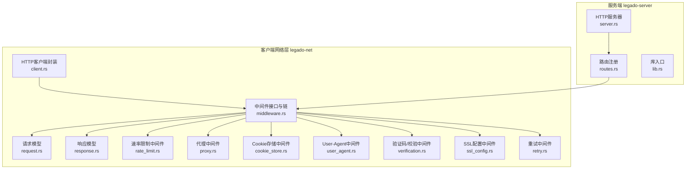
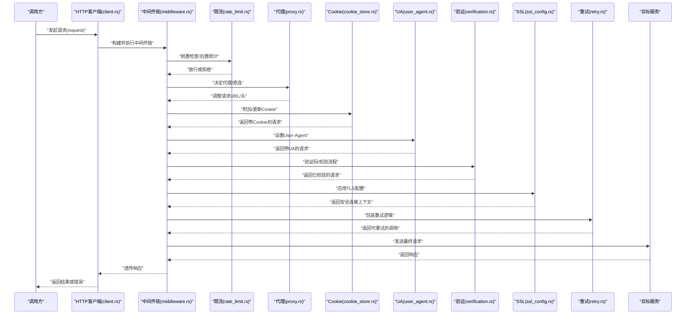
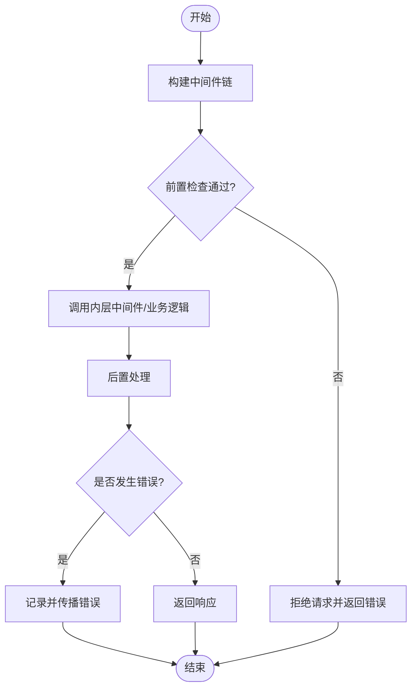
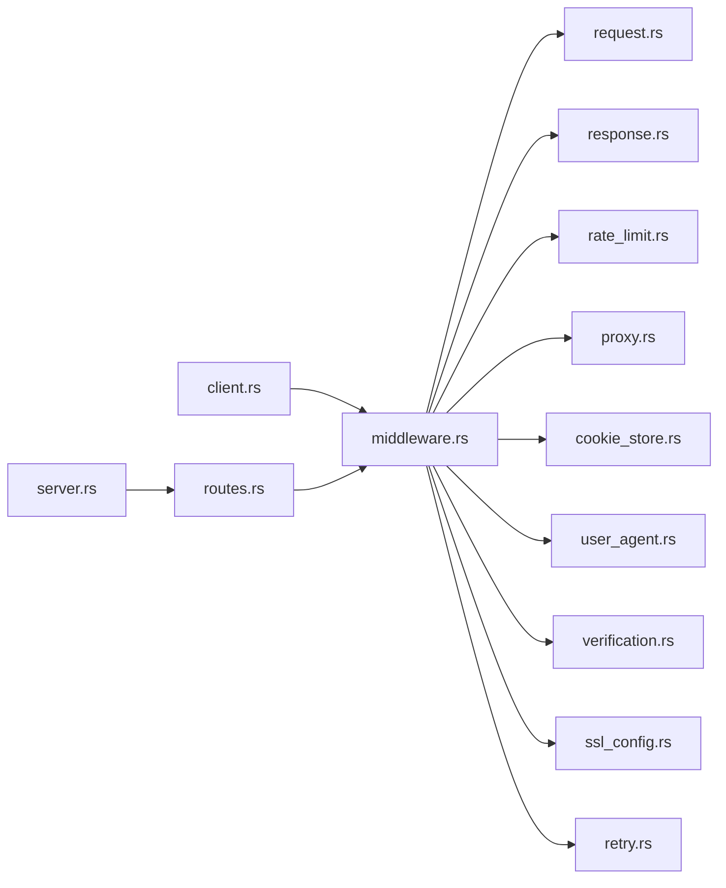

# 中间件架构设计

<cite>
**本文引用的文件**   
- [middleware.rs](file://rust/legado-net/src/middleware.rs)
- [client.rs](file://rust/legado-net/src/client.rs)
- [request.rs](file://rust/legado-net/src/request.rs)
- [response.rs](file://rust/legado-net/src/response.rs)
- [rate_limit.rs](file://rust/legado-net/src/rate_limit.rs)
- [proxy.rs](file://rust/legado-net/src/proxy.rs)
- [cookie_store.rs](file://rust/legado-net/src/cookie_store.rs)
- [user_agent.rs](file://rust/legado-net/src/user_agent.rs)
- [verification.rs](file://rust/legado-net/src/verification.rs)
- [ssl_config.rs](file://rust/legado-net/src/ssl_config.rs)
- [retry.rs](file://rust/legado-net/src/retry.rs)
- [server.rs](file://rust/legado-server/src/server.rs)
- [routes.rs](file://rust/legado-server/src/routes.rs)
- [lib.rs](file://rust/legado-server/src/lib.rs)
</cite>

## 目录
1. [简介](#简介)
2. [项目结构](#项目结构)
3. [核心组件](#核心组件)
4. [架构总览](#架构总览)
5. [详细组件分析](#详细组件分析)
6. [依赖关系分析](#依赖关系分析)
7. [性能考虑](#性能考虑)
8. [故障排查指南](#故障排查指南)
9. [结论](#结论)
10. [附录](#附录)

## 简介
本文件面向Legado项目的中间件架构设计与实现，聚焦于网络请求与HTTP服务两条主线：
- 客户端侧（legado-net）的中间件链：构建、执行顺序、生命周期管理、上下文传递与错误传播。
- 服务端侧（legado-server）的请求处理集成：路由注册、拦截、响应处理与异常捕获。

文档同时给出最佳实践与性能优化建议，并通过图示帮助理解关键流程。

## 项目结构
本项目采用多模块组织，中间件相关能力主要分布在以下位置：
- 客户端网络层（legado-net）：定义中间件接口、通用中间件实现、请求/响应模型、重试策略、代理、Cookie存储、用户代理、SSL配置等。
- 服务端（legado-server）：提供HTTP服务器、路由注册与处理器，作为中间件在服务端侧的集成点。

图表来源
- [middleware.rs:1-200](file://rust/legado-net/src/middleware.rs#L1-L200)
- [client.rs:1-200](file://rust/legado-net/src/client.rs#L1-L200)
- [request.rs:1-200](file://rust/legado-net/src/request.rs#L1-L200)
- [response.rs:1-200](file://rust/legado-net/src/response.rs#L1-L200)
- [rate_limit.rs:1-200](file://rust/legado-net/src/rate_limit.rs#L1-L200)
- [proxy.rs:1-200](file://rust/legado-net/src/proxy.rs#L1-L200)
- [cookie_store.rs:1-200](file://rust/legado-net/src/cookie_store.rs#L1-L200)
- [user_agent.rs:1-200](file://rust/legado-net/src/user_agent.rs#L1-L200)
- [verification.rs:1-200](file://rust/legado-net/src/verification.rs#L1-L200)
- [ssl_config.rs:1-200](file://rust/legado-net/src/ssl_config.rs#L1-L200)
- [retry.rs:1-200](file://rust/legado-net/src/retry.rs#L1-L200)
- [server.rs:1-200](file://rust/legado-server/src/server.rs#L1-L200)
- [routes.rs:1-200](file://rust/legado-server/src/routes.rs#L1-L200)
- [lib.rs:1-200](file://rust/legado-server/src/lib.rs#L1-L200)

章节来源
- [middleware.rs:1-200](file://rust/legado-net/src/middleware.rs#L1-L200)
- [client.rs:1-200](file://rust/legado-net/src/client.rs#L1-L200)
- [server.rs:1-200](file://rust/legado-server/src/server.rs#L1-L200)

## 核心组件
- 中间件接口与链
  - 定义统一的中间件函数签名，支持在请求进入业务逻辑前/后执行横切关注点。
  - 通过组合方式构建中间件链，形成“洋葱模型”的执行顺序。
- 请求与响应模型
  - request.rs 与 response.rs 定义了可被中间件读取和修改的数据结构，用于上下文传递。
- HTTP客户端封装
  - client.rs 负责将中间件链应用到实际的网络请求中，统一发起调用并收集结果。
- 通用中间件实现
  - rate_limit.rs：限流控制，防止突发流量导致下游过载。
  - proxy.rs：代理转发，支持按规则选择代理或直连。
  - cookie_store.rs：Cookie持久化与自动附加。
  - user_agent.rs：设置或覆盖User-Agent头。
  - verification.rs：验证码识别或校验流程。
  - ssl_config.rs：TLS参数配置与证书校验策略。
  - retry.rs：失败重试与退避策略。

章节来源
- [middleware.rs:1-200](file://rust/legado-net/src/middleware.rs#L1-L200)
- [request.rs:1-200](file://rust/legado-net/src/request.rs#L1-L200)
- [response.rs:1-200](file://rust/legado-net/src/response.rs#L1-L200)
- [client.rs:1-200](file://rust/legado-net/src/client.rs#L1-L200)
- [rate_limit.rs:1-200](file://rust/legado-net/src/rate_limit.rs#L1-L200)
- [proxy.rs:1-200](file://rust/legado-net/src/proxy.rs#L1-L200)
- [cookie_store.rs:1-200](file://rust/legado-net/src/cookie_store.rs#L1-L200)
- [user_agent.rs:1-200](file://rust/legado-net/src/user_agent.rs#L1-L200)
- [verification.rs:1-200](file://rust/legado-net/src/verification.rs#L1-L200)
- [ssl_config.rs:1-200](file://rust/legado-net/src/ssl_config.rs#L1-L200)
- [retry.rs:1-200](file://rust/legado-net/src/retry.rs#L1-L200)

## 架构总览
下图展示了客户端侧中间件链与服务端侧请求处理的整体交互。

图表来源
- [client.rs:1-200](file://rust/legado-net/src/client.rs#L1-L200)
- [middleware.rs:1-200](file://rust/legado-net/src/middleware.rs#L1-L200)
- [rate_limit.rs:1-200](file://rust/legado-net/src/rate_limit.rs#L1-L200)
- [proxy.rs:1-200](file://rust/legado-net/src/proxy.rs#L1-L200)
- [cookie_store.rs:1-200](file://rust/legado-net/src/cookie_store.rs#L1-L200)
- [user_agent.rs:1-200](file://rust/legado-net/src/user_agent.rs#L1-L200)
- [verification.rs:1-200](file://rust/legado-net/src/verification.rs#L1-L200)
- [ssl_config.rs:1-200](file://rust/legado-net/src/ssl_config.rs#L1-L200)
- [retry.rs:1-200](file://rust/legado-net/src/retry.rs#L1-L200)

## 详细组件分析

### 中间件接口与链（middleware.rs）
- 职责
  - 定义中间件函数签名，包含对请求上下文与响应上下文的读写能力。
  - 提供链式组合工具，支持顺序执行与短路退出。
- 执行顺序
  - 遵循“洋葱模型”：外层中间件先执行前置逻辑，再进入内层，最后在外层执行后置逻辑。
- 上下文传递
  - 通过请求/响应对象携带状态，如鉴权信息、追踪ID、缓存键等。
- 错误传播
  - 中间件可选择提前返回错误，或在后置阶段汇总错误信息。

图表来源
- [middleware.rs:1-200](file://rust/legado-net/src/middleware.rs#L1-L200)

章节来源
- [middleware.rs:1-200](file://rust/legado-net/src/middleware.rs#L1-L200)

### 请求与响应模型（request.rs, response.rs）
- 请求模型
  - 包含URL、方法、头部、体、超时、重试策略等字段。
  - 中间件可修改头部、注入认证信息、替换URL等。
- 响应模型
  - 包含状态码、头部、体、耗时、错误信息等。
  - 中间件可在后置阶段记录日志、压缩响应、转换格式等。

章节来源
- [request.rs:1-200](file://rust/legado-net/src/request.rs#L1-L200)
- [response.rs:1-200](file://rust/legado-net/src/response.rs#L1-L200)

### HTTP客户端封装（client.rs）
- 职责
  - 接收上层调用，组装请求，执行中间件链，处理响应与错误。
- 集成点
  - 作为中间件链的入口，确保所有请求都经过一致的横切处理。

章节来源
- [client.rs:1-200](file://rust/legado-net/src/client.rs#L1-L200)

### 通用中间件实现

#### 限流中间件（rate_limit.rs）
- 功能
  - 基于令牌桶或滑动窗口算法限制并发与频率。
- 适用场景
  - 保护下游服务、避免触发第三方API限制。

章节来源
- [rate_limit.rs:1-200](file://rust/legado-net/src/rate_limit.rs#L1-L200)

#### 代理中间件（proxy.rs）
- 功能
  - 根据规则选择代理或直连，支持按域名或路径匹配。
- 注意事项
  - 需正确处理代理认证与证书校验。

章节来源
- [proxy.rs:1-200](file://rust/legado-net/src/proxy.rs#L1-L200)

#### Cookie存储中间件（cookie_store.rs）
- 功能
  - 自动附加与更新Cookie，支持持久化与过期清理。
- 适用场景
  - 会话保持、跨请求状态共享。

章节来源
- [cookie_store.rs:1-200](file://rust/legado-net/src/cookie_store.rs#L1-L200)

#### User-Agent中间件（user_agent.rs）
- 功能
  - 设置或覆盖User-Agent，便于兼容不同服务端策略。

章节来源
- [user_agent.rs:1-200](file://rust/legado-net/src/user_agent.rs#L1-L200)

#### 验证中间件（verification.rs）
- 功能
  - 处理验证码识别、人机校验、反爬策略绕过等。
- 注意
  - 应保证幂等性与可重试性。

章节来源
- [verification.rs:1-200](file://rust/legado-net/src/verification.rs#L1-L200)

#### SSL配置中间件（ssl_config.rs）
- 功能
  - 配置TLS版本、加密套件、证书信任策略。
- 适用场景
  - 企业内网、自定义CA环境。

章节来源
- [ssl_config.rs:1-200](file://rust/legado-net/src/ssl_config.rs#L1-L200)

#### 重试中间件（retry.rs）
- 功能
  - 基于指数退避与抖动策略进行重试，支持条件重试（如特定状态码）。
- 注意
  - 仅对幂等请求启用重试，避免副作用。

章节来源
- [retry.rs:1-200](file://rust/legado-net/src/retry.rs#L1-L200)

### 服务端集成（server.rs, routes.rs, lib.rs）
- 服务器启动
  - server.rs 初始化HTTP服务器，绑定端口与监听器。
- 路由注册
  - routes.rs 定义路由映射，将URL模式与处理器关联。
- 中间件集成
  - 在服务端侧，可将中间件应用于全局路由或特定路由组，实现请求拦截、响应处理与异常捕获。

章节来源
- [server.rs:1-200](file://rust/legado-server/src/server.rs#L1-L200)
- [routes.rs:1-200](file://rust/legado-server/src/routes.rs#L1-L200)
- [lib.rs:1-200](file://rust/legado-server/src/lib.rs#L1-L200)

## 依赖关系分析
中间件之间应保持低耦合，通过清晰的接口契约协作。下图展示关键模块间的依赖关系。

图表来源
- [client.rs:1-200](file://rust/legado-net/src/client.rs#L1-L200)
- [middleware.rs:1-200](file://rust/legado-net/src/middleware.rs#L1-L200)
- [request.rs:1-200](file://rust/legado-net/src/request.rs#L1-L200)
- [response.rs:1-200](file://rust/legado-net/src/response.rs#L1-L200)
- [rate_limit.rs:1-200](file://rust/legado-net/src/rate_limit.rs#L1-L200)
- [proxy.rs:1-200](file://rust/legado-net/src/proxy.rs#L1-L200)
- [cookie_store.rs:1-200](file://rust/legado-net/src/cookie_store.rs#L1-L200)
- [user_agent.rs:1-200](file://rust/legado-net/src/user_agent.rs#L1-L200)
- [verification.rs:1-200](file://rust/legado-net/src/verification.rs#L1-L200)
- [ssl_config.rs:1-200](file://rust/legado-net/src/ssl_config.rs#L1-L200)
- [retry.rs:1-200](file://rust/legado-net/src/retry.rs#L1-L200)
- [server.rs:1-200](file://rust/legado-server/src/server.rs#L1-L200)
- [routes.rs:1-200](file://rust/legado-server/src/routes.rs#L1-L200)

章节来源
- [middleware.rs:1-200](file://rust/legado-net/src/middleware.rs#L1-L200)
- [client.rs:1-200](file://rust/legado-net/src/client.rs#L1-L200)
- [server.rs:1-200](file://rust/legado-server/src/server.rs#L1-L200)

## 性能考虑
- 中间件顺序优化
  - 将快速失败的中间件（如限流、鉴权）放在外层，尽早拒绝无效请求。
  - 将IO密集型中间件（如Cookie、UA、SSL）尽量并行或异步执行。
- 上下文传递开销
  - 避免在中间件中频繁拷贝大对象，使用引用或池化对象。
- 重试与退避
  - 合理设置最大重试次数与退避时间，避免雪崩效应。
- 资源复用
  - 复用连接池、线程池与缓冲区，减少分配与GC压力。
- 监控与度量
  - 在每个中间件埋点，统计耗时、错误率与吞吐，指导调优。

[本节为通用指导，不直接分析具体文件]

## 故障排查指南
- 常见问题定位
  - 中间件顺序错误：检查链式组合顺序是否符合预期。
  - 上下文未传递：确认请求/响应对象是否正确传递与修改。
  - 错误未捕获：确保每个中间件的后置逻辑能正确捕获并上报错误。
- 调试建议
  - 增加日志级别，输出关键中间件的输入输出。
  - 使用追踪ID贯穿整个请求链路，便于问题回溯。
- 恢复策略
  - 对可重试错误启用重试中间件，对不可重试错误快速失败。
  - 对依赖外部服务的中间件（如Cookie、SSL）增加降级开关。

章节来源
- [middleware.rs:1-200](file://rust/legado-net/src/middleware.rs#L1-L200)
- [client.rs:1-200](file://rust/legado-net/src/client.rs#L1-L200)

## 结论
Legado的中间件架构以清晰的接口与链式组合为核心，实现了高内聚、低耦合的横切能力。通过合理的中间件顺序、上下文传递与错误传播策略，系统能够在保证灵活性的同时具备良好的可维护性与性能表现。服务端侧的路由与处理器与中间件无缝集成，进一步增强了请求处理的可扩展性。

[本节为总结，不直接分析具体文件]

## 附录
- 最佳实践
  - 单一职责：每个中间件只做一件事，便于测试与复用。
  - 幂等性：确保中间件可重复执行而不产生副作用。
  - 可配置性：通过配置项控制中间件行为，支持动态切换。
- 示例参考
  - 参考各中间件文件的实现，学习如何编写高效、健壮的中间件。

[本节为补充说明，不直接分析具体文件]