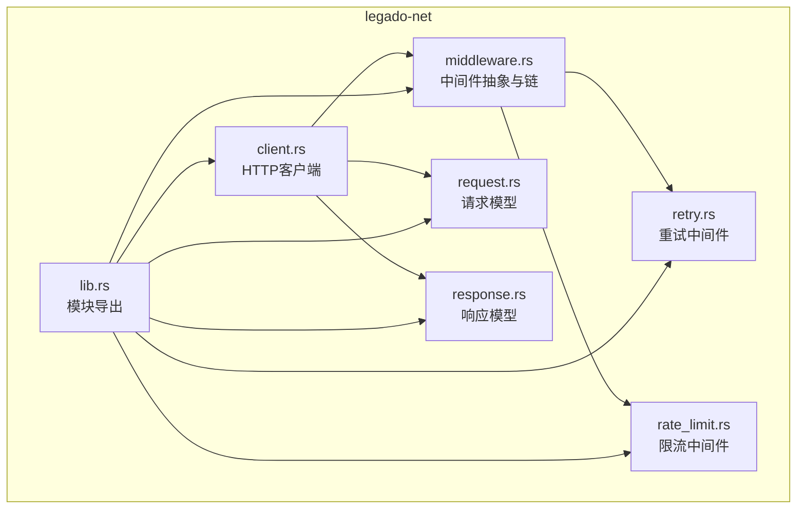
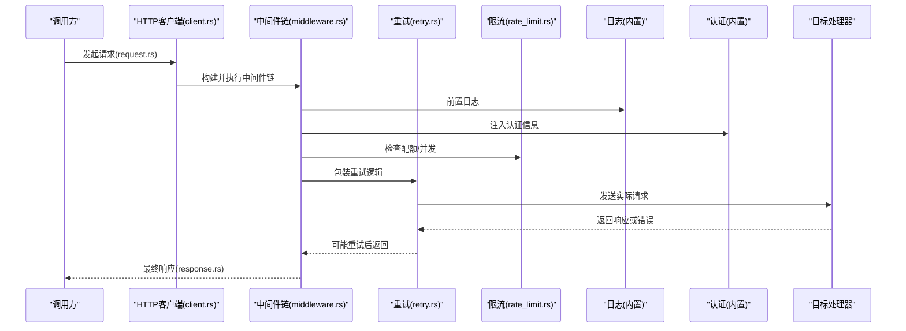
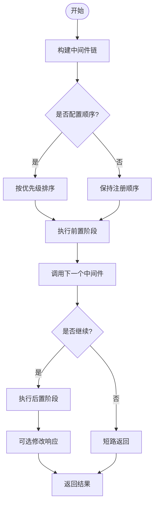
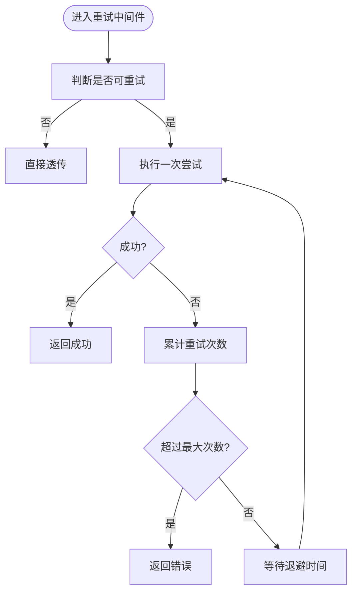
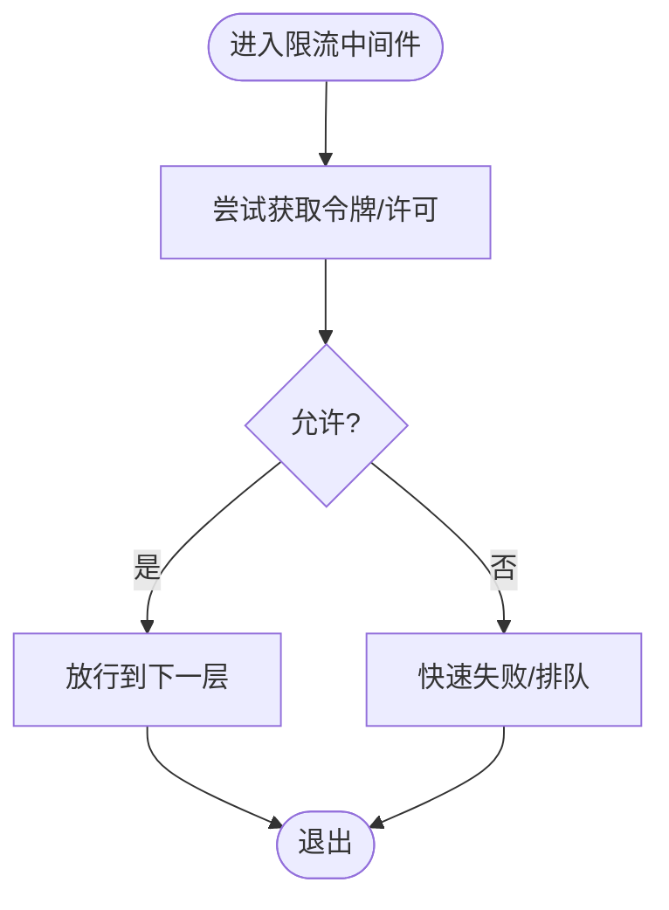
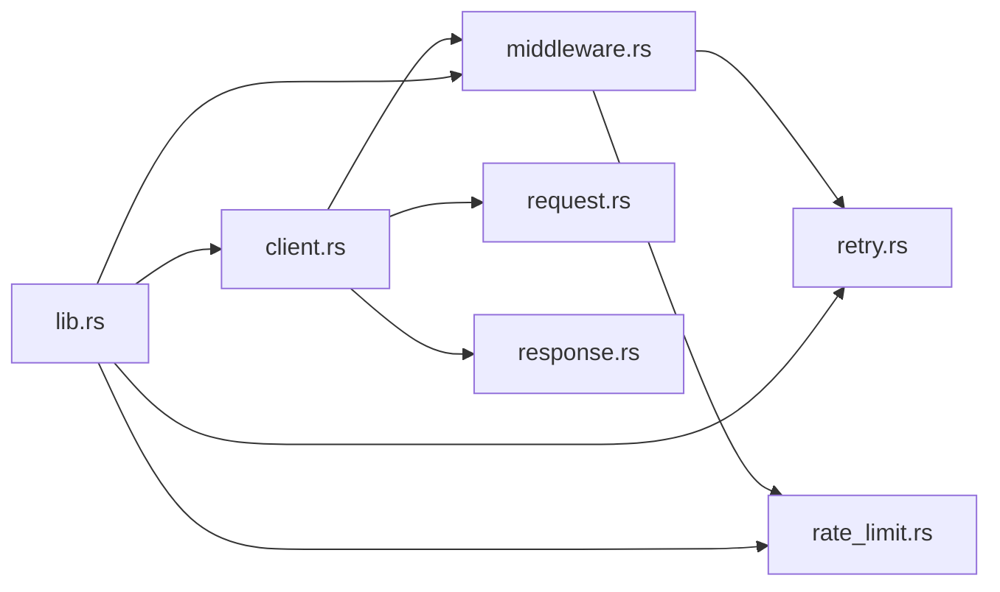

# 中间件系统

<cite>
**本文引用的文件**   
- [middleware.rs](file://rust/legado-net/src/middleware.rs)
- [retry.rs](file://rust/legado-net/src/retry.rs)
- [rate_limit.rs](file://rust/legado-net/src/rate_limit.rs)
- [client.rs](file://rust/legado-net/src/client.rs)
- [request.rs](file://rust/legado-net/src/request.rs)
- [response.rs](file://rust/legado-net/src/response.rs)
- [lib.rs](file://rust/legado-net/src/lib.rs)
</cite>

## 目录
1. [简介](#简介)
2. [项目结构](#项目结构)
3. [核心组件](#核心组件)
4. [架构总览](#架构总览)
5. [详细组件分析](#详细组件分析)
6. [依赖关系分析](#依赖关系分析)
7. [性能考量](#性能考量)
8. [故障排查指南](#故障排查指南)
9. [结论](#结论)
10. [附录](#附录)

## 简介
本文件面向Legado项目的网络中间件子系统，系统性阐述其架构设计、执行流程与扩展方式。重点覆盖：
- 中间件链的构建与执行顺序
- 内置中间件（重试、限流、日志、认证）的职责与行为
- 自定义中间件的接口约定、上下文传递与错误传播
- 组合最佳实践与性能优化建议
- 使用示例与调试技巧

## 项目结构
中间件系统位于 Rust 模块 legado-net 中，围绕 HTTP 请求/响应生命周期组织代码：
- 中间件抽象与链式调度：middleware.rs
- 具体中间件实现：retry.rs、rate_limit.rs
- 客户端与请求/响应模型：client.rs、request.rs、response.rs
- 模块入口与导出：lib.rs

图表来源
- [middleware.rs](file://rust/legado-net/src/middleware.rs)
- [retry.rs](file://rust/legado-net/src/retry.rs)
- [rate_limit.rs](file://rust/legado-net/src/rate_limit.rs)
- [client.rs](file://rust/legado-net/src/client.rs)
- [request.rs](file://rust/legado-net/src/request.rs)
- [response.rs](file://rust/legado-net/src/response.rs)
- [lib.rs](file://rust/legado-net/src/lib.rs)

章节来源
- [middleware.rs](file://rust/legado-net/src/middleware.rs)
- [client.rs](file://rust/legado-net/src/client.rs)
- [request.rs](file://rust/legado-net/src/request.rs)
- [response.rs](file://rust/legado-net/src/response.rs)
- [lib.rs](file://rust/legado-net/src/lib.rs)

## 核心组件
- 中间件抽象与链
  - 定义统一的中间件接口，支持在请求进入业务逻辑前后进行横切处理
  - 提供链式组合能力，按注册顺序依次执行
- 重试中间件
  - 对可重试的错误或状态码进行自动重试，支持退避策略与最大重试次数
- 限流中间件
  - 基于令牌桶或滑动窗口等算法限制并发与速率，避免过载
- 日志中间件
  - 记录请求/响应关键信息，便于追踪与审计
- 认证中间件
  - 注入鉴权头、签名或会话信息，统一处理认证失败场景

章节来源
- [middleware.rs](file://rust/legado-net/src/middleware.rs)
- [retry.rs](file://rust/legado-net/src/retry.rs)
- [rate_limit.rs](file://rust/legado-net/src/rate_limit.rs)

## 架构总览
中间件以“洋葱模型”组织，请求从外层进入，逐层向下到达目标处理器；响应则反向逐层返回，允许每层修改响应或拦截异常。

图表来源
- [client.rs](file://rust/legado-net/src/client.rs)
- [middleware.rs](file://rust/legado-net/src/middleware.rs)
- [retry.rs](file://rust/legado-net/src/retry.rs)
- [rate_limit.rs](file://rust/legado-net/src/rate_limit.rs)
- [request.rs](file://rust/legado-net/src/request.rs)
- [response.rs](file://rust/legado-net/src/response.rs)

## 详细组件分析

### 中间件抽象与链
- 职责
  - 定义中间件函数/闭包的统一签名
  - 维护中间件列表，提供添加、排序与执行方法
  - 在请求前/后插入横切逻辑，支持短路返回
- 执行顺序
  - 按注册顺序进入，按逆序退出
  - 可通过优先级或条件开关控制顺序与启用状态
- 上下文与错误
  - 通过请求上下文传递共享数据（如用户ID、追踪ID）
  - 错误向上抛出，由上层决定重试、降级或返回

图表来源
- [middleware.rs](file://rust/legado-net/src/middleware.rs)

章节来源
- [middleware.rs](file://rust/legado-net/src/middleware.rs)

### 重试中间件
- 功能要点
  - 识别可重试错误（如网络抖动、超时、特定HTTP状态码）
  - 支持指数退避、固定间隔、抖动等策略
  - 限制最大重试次数，防止雪崩
- 适用场景
  - 外部服务不稳定、临时性错误频发
- 注意事项
  - 幂等性：仅对幂等操作启用重试
  - 资源占用：避免过多并发重试导致放大效应

图表来源
- [retry.rs](file://rust/legado-net/src/retry.rs)

章节来源
- [retry.rs](file://rust/legado-net/src/retry.rs)

### 限流中间件
- 功能要点
  - 基于令牌桶或滑动窗口控制请求速率与并发度
  - 支持全局与按维度（如用户、IP、源）限流
  - 拒绝策略：丢弃、排队或快速失败
- 适用场景
  - 保护后端服务、遵守第三方API配额
- 注意事项
  - 内存占用：高并发下注意计数器与队列大小
  - 公平性：避免热点键独占资源

图表来源
- [rate_limit.rs](file://rust/legado-net/src/rate_limit.rs)

章节来源
- [rate_limit.rs](file://rust/legado-net/src/rate_limit.rs)

### 日志中间件（内置）
- 功能要点
  - 记录请求方法、URL、耗时、状态码、错误信息等
  - 支持采样与脱敏，避免敏感信息泄露
- 适用场景
  - 问题定位、性能监控、合规审计

章节来源
- [middleware.rs](file://rust/legado-net/src/middleware.rs)

### 认证中间件（内置）
- 功能要点
  - 注入Token、签名、Cookie等认证信息
  - 统一处理401/403等认证失败，触发刷新或降级
- 适用场景
  - 需要鉴权的API访问、多租户隔离

章节来源
- [middleware.rs](file://rust/legado-net/src/middleware.rs)

### 客户端与请求/响应模型
- 客户端
  - 负责组装中间件链、管理连接池、超时与重试边界
- 请求/响应
  - 标准化请求体、头部、查询参数与路径模板
  - 标准化响应体、状态码、错误码与元数据

章节来源
- [client.rs](file://rust/legado-net/src/client.rs)
- [request.rs](file://rust/legado-net/src/request.rs)
- [response.rs](file://rust/legado-net/src/response.rs)

## 依赖关系分析
中间件系统内部耦合清晰，职责单一，主要依赖如下：
- client.rs 依赖 middleware.rs 构建执行链
- retry.rs、rate_limit.rs 作为独立中间件被链式装配
- request.rs、response.rs 为通用数据结构，贯穿全链路
- lib.rs 统一导出公共类型与构造器

图表来源
- [client.rs](file://rust/legado-net/src/client.rs)
- [middleware.rs](file://rust/legado-net/src/middleware.rs)
- [retry.rs](file://rust/legado-net/src/retry.rs)
- [rate_limit.rs](file://rust/legado-net/src/rate_limit.rs)
- [request.rs](file://rust/legado-net/src/request.rs)
- [response.rs](file://rust/legado-net/src/response.rs)
- [lib.rs](file://rust/legado-net/src/lib.rs)

章节来源
- [lib.rs](file://rust/legado-net/src/lib.rs)

## 性能考量
- 中间件顺序
  - 将轻量级、无IO的中间件置于外层，减少不必要的开销
  - 将昂贵操作（如加密、序列化）尽量延迟到必要时
- 重试策略
  - 合理设置最大重试次数与退避上限，避免放大风暴
  - 对非幂等操作禁用自动重试
- 限流策略
  - 选择合适的数据结构与算法，降低锁竞争与内存峰值
  - 针对热点键做分片或本地缓存
- 日志与监控
  - 采用采样与异步落盘，避免阻塞主流程
  - 关键指标上报至监控系统，便于容量规划

[本节为通用指导，不直接分析具体文件]

## 故障排查指南
- 常见问题
  - 中间件顺序不当导致认证未生效或限流失效
  - 重试过度造成下游雪崩
  - 限流阈值过低导致大量拒绝
  - 日志缺失或过于冗长影响性能
- 排查步骤
  - 开启详细日志，确认请求在各中间件中的流转
  - 逐步关闭中间件定位问题源头
  - 调整重试与限流参数观察效果
  - 使用压测工具验证极端场景下的稳定性

章节来源
- [middleware.rs](file://rust/legado-net/src/middleware.rs)
- [retry.rs](file://rust/legado-net/src/retry.rs)
- [rate_limit.rs](file://rust/legado-net/src/rate_limit.rs)

## 结论
Legado 的中间件系统以清晰的抽象与灵活的组合机制，为网络请求提供了可扩展的横切能力。通过合理的中间件编排与参数调优，可在稳定性、性能与可观测性之间取得良好平衡。建议在业务场景中按需启用日志、认证、限流与重试，并结合监控持续优化。

[本节为总结性内容，不直接分析具体文件]

## 附录
- 自定义中间件开发要点
  - 遵循统一接口签名，确保可被链式装配
  - 合理使用上下文传递共享数据，避免全局状态
  - 明确错误传播策略，区分可恢复与不可恢复错误
  - 编写单元测试覆盖正常路径与异常路径
- 常用组合模式
  - 认证 + 限流 + 重试 + 日志
  - 仅在受控路由上启用重试与限流
  - 根据环境动态启用/禁用中间件

[本节为概念性内容，不直接分析具体文件]