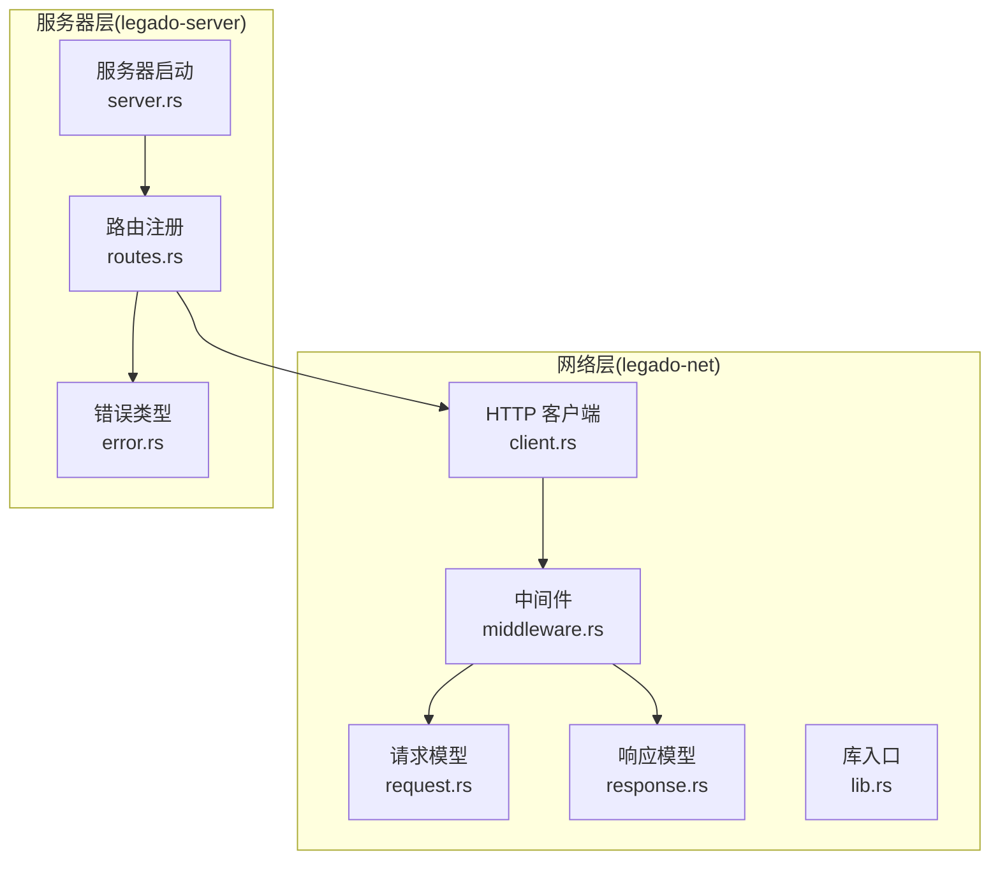
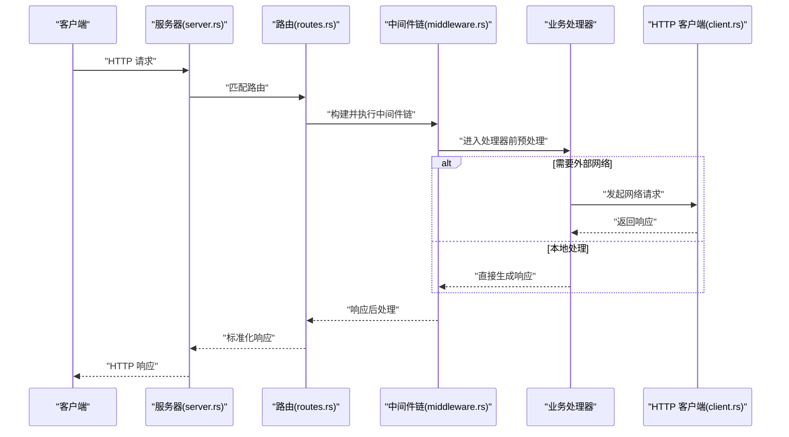
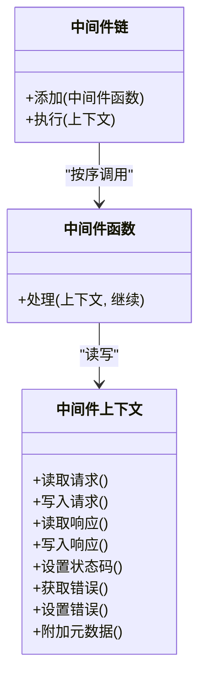
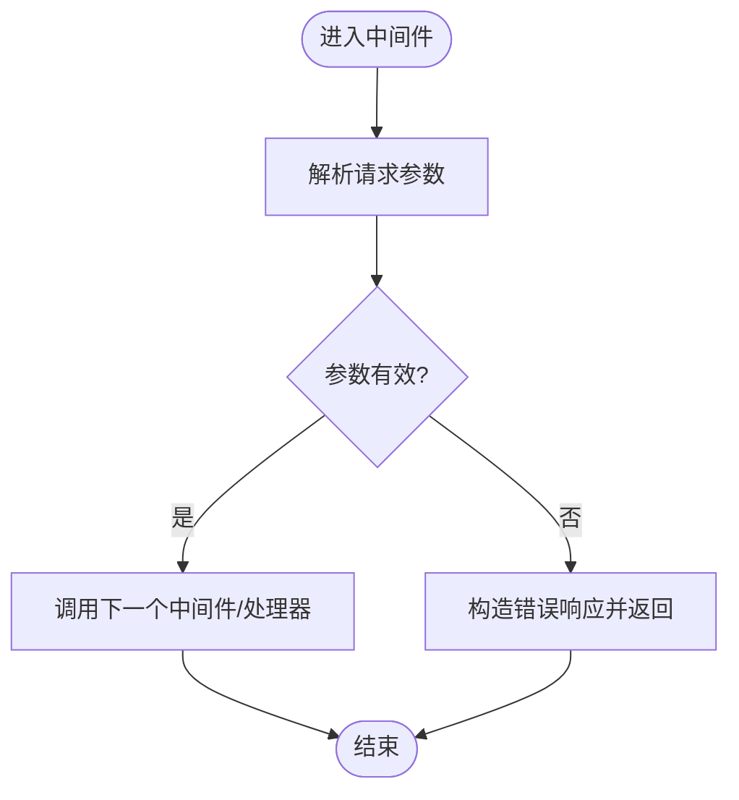
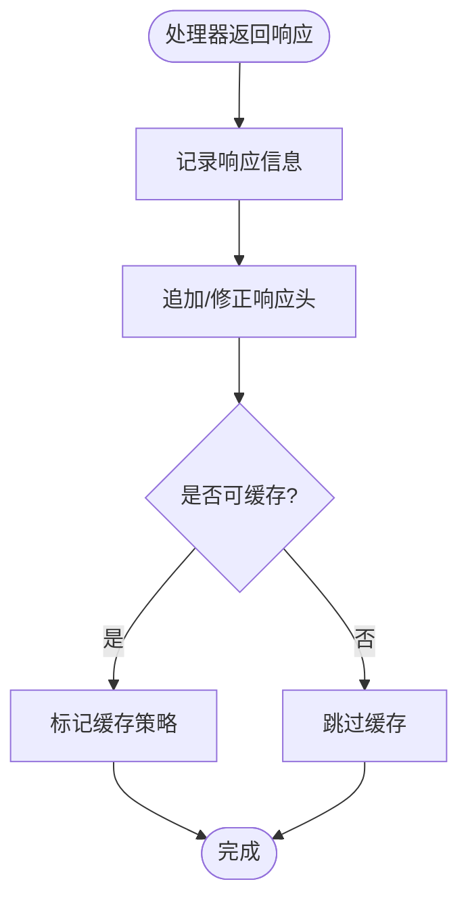
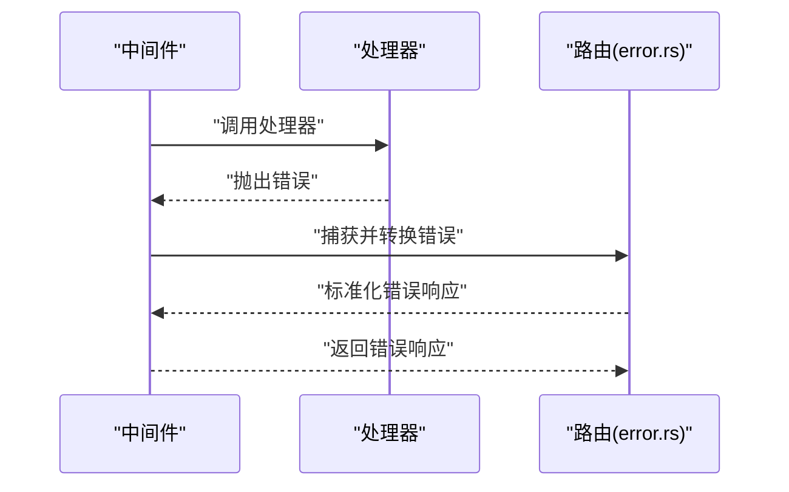
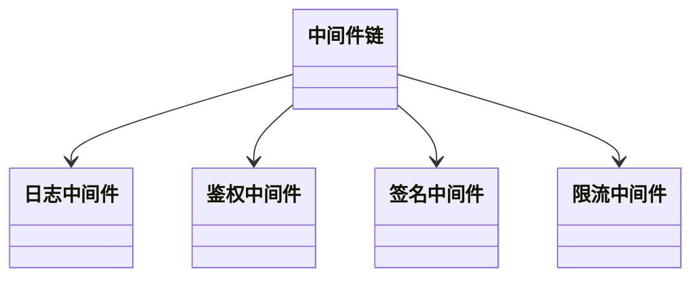
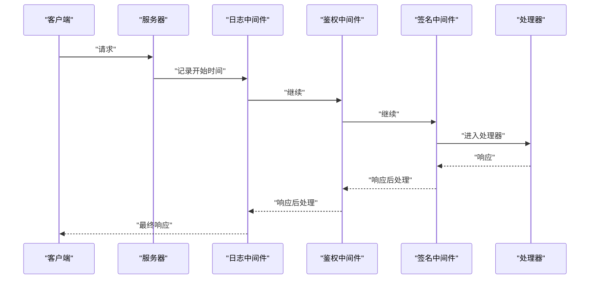
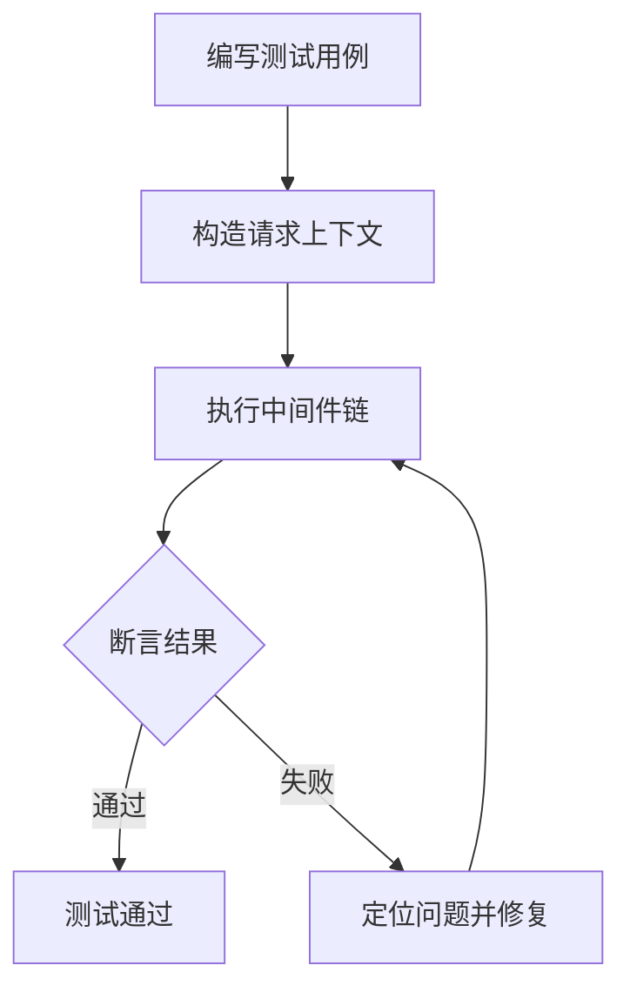
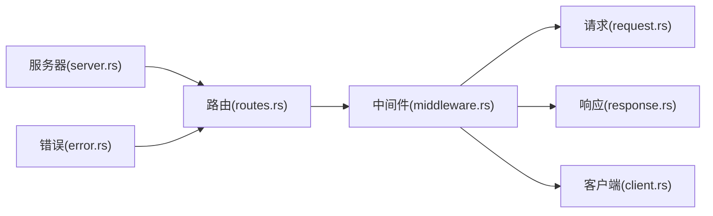

# 自定义中间件开发

<cite>
**本文引用的文件**   
- [middleware.rs](file://rust/legado-net/src/middleware.rs)
- [request.rs](file://rust/legado-net/src/request.rs)
- [response.rs](file://rust/legado-net/src/response.rs)
- [client.rs](file://rust/legado-net/src/client.rs)
- [lib.rs](file://rust/legado-net/src/lib.rs)
- [server.rs](file://rust/legado-server/src/server.rs)
- [routes.rs](file://rust/legado-server/src/routes.rs)
- [error.rs](file://rust/legado-server/src/error.rs)
</cite>

## 目录
1. [简介](#简介)
2. [项目结构](#项目结构)
3. [核心组件](#核心组件)
4. [架构总览](#架构总览)
5. [详细组件分析](#详细组件分析)
6. [依赖关系分析](#依赖关系分析)
7. [性能考虑](#性能考虑)
8. [故障排查指南](#故障排查指南)
9. [结论](#结论)
10. [附录](#附录)

## 简介
本指南面向希望在 Legado 的 HTTP 网络层与服务器端实现“自定义中间件”的开发者。内容覆盖：
- 中间件接口设计与实现要点（请求预处理、响应后处理、错误处理）
- 中间件上下文创建与使用（数据传递、状态共享、生命周期管理）
- 中间件组合模式（链式调用与协同工作）
- 常见场景示例（日志记录、认证验证、请求签名）
- 测试方法与调试技巧
- 性能优化最佳实践
- 错误处理与异常恢复策略

本指南基于仓库中 Rust 实现的网络层与服务器模块，确保所有说明均可追溯到具体源码位置。

## 项目结构
Legado 的网络能力集中在 rust/legado-net 模块，HTTP 服务在 rust/legado-server 模块。中间件相关的关键文件包括：
- 网络层中间件定义与执行器：middleware.rs
- 请求与响应模型：request.rs、response.rs
- HTTP 客户端封装：client.rs
- 服务器路由与启动：routes.rs、server.rs
- 错误类型定义：error.rs

**图示来源** 
- [middleware.rs](file://rust/legado-net/src/middleware.rs)
- [request.rs](file://rust/legado-net/src/request.rs)
- [response.rs](file://rust/legado-net/src/response.rs)
- [client.rs](file://rust/legado-net/src/client.rs)
- [lib.rs](file://rust/legado-net/src/lib.rs)
- [server.rs](file://rust/legado-server/src/server.rs)
- [routes.rs](file://rust/legado-server/src/routes.rs)
- [error.rs](file://rust/legado-server/src/error.rs)

**章节来源**
- [middleware.rs](file://rust/legado-net/src/middleware.rs)
- [request.rs](file://rust/legado-net/src/request.rs)
- [response.rs](file://rust/legado-net/src/response.rs)
- [client.rs](file://rust/legado-net/src/client.rs)
- [lib.rs](file://rust/legado-net/src/lib.rs)
- [server.rs](file://rust/legado-server/src/server.rs)
- [routes.rs](file://rust/legado-server/src/routes.rs)
- [error.rs](file://rust/legado-server/src/error.rs)

## 核心组件
- 中间件接口与执行器：定义统一的中间件函数签名、上下文对象以及链式执行逻辑。
- 请求/响应模型：承载 HTTP 请求与响应的结构化数据，供中间件读取与修改。
- HTTP 客户端：负责实际发送请求并接收响应，通常作为中间件链的终端。
- 服务器与路由：将中间件链挂载到路由上，统一处理入站请求。
- 错误类型：为中间件与处理器提供一致的错误表示与传播方式。

**章节来源**
- [middleware.rs](file://rust/legado-net/src/middleware.rs)
- [request.rs](file://rust/legado-net/src/request.rs)
- [response.rs](file://rust/legado-net/src/response.rs)
- [client.rs](file://rust/legado-net/src/client.rs)
- [server.rs](file://rust/legado-server/src/server.rs)
- [routes.rs](file://rust/legado-server/src/routes.rs)
- [error.rs](file://rust/legado-server/src/error.rs)

## 架构总览
下图展示了从服务器接收到请求到返回响应的完整流程，以及中间件链在其中扮演的角色。

**图示来源** 
- [server.rs](file://rust/legado-server/src/server.rs)
- [routes.rs](file://rust/legado-server/src/routes.rs)
- [middleware.rs](file://rust/legado-net/src/middleware.rs)
- [client.rs](file://rust/legado-net/src/client.rs)

## 详细组件分析

### 中间件接口与上下文
- 中间件函数签名：通常包含对请求上下文的引用与一个“继续执行”的回调，用于进入下一个中间件或处理器。
- 上下文对象：提供读写请求属性、响应头、状态码、错误信息的能力；支持跨中间件的数据传递与状态共享。
- 生命周期管理：在进入处理器之前进行预处理（如鉴权、签名校验），在处理器之后进行后处理（如日志、计时、缓存）。

**图示来源** 
- [middleware.rs](file://rust/legado-net/src/middleware.rs)

**章节来源**
- [middleware.rs](file://rust/legado-net/src/middleware.rs)

### 请求预处理
- 典型步骤：解析与校验请求参数、注入安全头、计算签名、限流检查、权限校验等。
- 失败路径：若校验失败，应快速返回错误响应，避免进入后续中间件或处理器。

**图示来源** 
- [middleware.rs](file://rust/legado-net/src/middleware.rs)
- [request.rs](file://rust/legado-net/src/request.rs)

**章节来源**
- [middleware.rs](file://rust/legado-net/src/middleware.rs)
- [request.rs](file://rust/legado-net/src/request.rs)

### 响应后处理
- 典型步骤：记录耗时、追加响应头、压缩/转码、缓存标记、审计日志等。
- 异常保护：在后处理阶段捕获异常，保证不会中断主流程且能输出可观测信息。

**图示来源** 
- [middleware.rs](file://rust/legado-net/src/middleware.rs)
- [response.rs](file://rust/legado-net/src/response.rs)

**章节来源**
- [middleware.rs](file://rust/legado-net/src/middleware.rs)
- [response.rs](file://rust/legado-net/src/response.rs)

### 错误处理与异常恢复
- 错误类型：使用统一的错误类型，便于上层路由与中间件识别与处理。
- 恢复策略：对可恢复错误进行重试或降级，对不可恢复错误进行快速失败与告警。
- 传播机制：通过上下文或返回值向上层传递错误，由路由层统一格式化响应。

**图示来源** 
- [middleware.rs](file://rust/legado-net/src/middleware.rs)
- [error.rs](file://rust/legado-server/src/error.rs)

**章节来源**
- [middleware.rs](file://rust/legado-net/src/middleware.rs)
- [error.rs](file://rust/legado-server/src/error.rs)

### 中间件的组合模式
- 链式调用：多个中间件按顺序执行，每个中间件可选择提前返回或继续调用下一个。
- 责任分离：每个中间件专注于单一职责（如日志、鉴权、签名），易于测试与维护。
- 动态装配：根据路由或配置动态组装中间件链，满足不同场景需求。

**图示来源** 
- [middleware.rs](file://rust/legado-net/src/middleware.rs)

**章节来源**
- [middleware.rs](file://rust/legado-net/src/middleware.rs)

### 常见场景示例
- 日志记录：记录请求方法、URL、耗时、状态码；注意脱敏敏感字段。
- 认证验证：校验 Token/Session，必要时刷新或续期；失败时返回未授权。
- 请求签名：计算签名并校验防重放；失败时拒绝请求并记录审计日志。

**图示来源** 
- [middleware.rs](file://rust/legado-net/src/middleware.rs)
- [request.rs](file://rust/legado-net/src/request.rs)
- [response.rs](file://rust/legado-net/src/response.rs)

**章节来源**
- [middleware.rs](file://rust/legado-net/src/middleware.rs)
- [request.rs](file://rust/legado-net/src/request.rs)
- [response.rs](file://rust/legado-net/src/response.rs)

### 测试方法与调试技巧
- 单元测试：构造最小化的请求上下文，断言中间件行为（如头注入、状态码设置）。
- 集成测试：使用内存服务器或测试夹具模拟下游依赖，端到端验证中间件链。
- 调试技巧：开启详细日志、打印关键上下文字段、使用断点观察调用栈。

**图示来源** 
- [middleware.rs](file://rust/legado-net/src/middleware.rs)

**章节来源**
- [middleware.rs](file://rust/legado-net/src/middleware.rs)

### 性能优化最佳实践
- 避免阻塞：I/O 操作异步化，减少同步等待。
- 减少分配：复用缓冲区与对象，避免频繁 GC。
- 早退策略：尽早判断无效请求，降低后续开销。
- 缓存热点：对读多写少的数据进行短期缓存。
- 监控指标：暴露关键指标（QPS、延迟分布、错误率）以便调优。

[本节为通用指导，不直接分析具体文件]

## 依赖关系分析
中间件与请求/响应模型、HTTP 客户端、服务器路由之间存在清晰的依赖关系。中间件依赖请求/响应模型以读写数据，依赖客户端以发起网络请求，依赖服务器路由以挂载与执行。

**图示来源** 
- [middleware.rs](file://rust/legado-net/src/middleware.rs)
- [request.rs](file://rust/legado-net/src/request.rs)
- [response.rs](file://rust/legado-net/src/response.rs)
- [client.rs](file://rust/legado-net/src/client.rs)
- [routes.rs](file://rust/legado-server/src/routes.rs)
- [server.rs](file://rust/legado-server/src/server.rs)
- [error.rs](file://rust/legado-server/src/error.rs)

**章节来源**
- [middleware.rs](file://rust/legado-net/src/middleware.rs)
- [request.rs](file://rust/legado-net/src/request.rs)
- [response.rs](file://rust/legado-net/src/response.rs)
- [client.rs](file://rust/legado-net/src/client.rs)
- [routes.rs](file://rust/legado-server/src/routes.rs)
- [server.rs](file://rust/legado-server/src/server.rs)
- [error.rs](file://rust/legado-server/src/error.rs)

## 性能考虑
- 中间件链长度控制：避免过深的嵌套导致调用栈过长与上下文切换开销。
- 日志级别与采样：生产环境按需降低日志量，采用采样策略。
- 资源清理：确保中间件在异常路径也能正确释放资源（如连接、锁）。
- 并发安全：共享状态需线程安全，避免竞态条件。

[本节为通用指导，不直接分析具体文件]

## 故障排查指南
- 常见问题：
  - 中间件顺序错误导致鉴权失效或签名校验过早。
  - 上下文数据未正确传递导致下游无法读取必要信息。
  - 错误类型不一致导致路由层无法统一处理。
- 排查步骤：
  - 启用详细日志，定位失败中间件。
  - 检查请求/响应模型字段是否正确赋值。
  - 使用最小化测试用例复现问题。
- 恢复策略：
  - 对可重试错误实施指数退避。
  - 对不可恢复错误快速失败并告警。

**章节来源**
- [middleware.rs](file://rust/legado-net/src/middleware.rs)
- [error.rs](file://rust/legado-server/src/error.rs)

## 结论
通过统一的中间件接口与上下文设计，Legado 实现了灵活、可扩展的请求/响应处理管线。结合组合模式与错误处理策略，开发者可以高效地实现日志、鉴权、签名等横切关注点，并通过测试与性能优化保障系统的稳定性与效率。

[本节为总结性内容，不直接分析具体文件]

## 附录
- 参考文件清单：
  - 中间件与上下文：middleware.rs
  - 请求与响应模型：request.rs、response.rs
  - HTTP 客户端：client.rs
  - 服务器与路由：server.rs、routes.rs
  - 错误类型：error.rs

[本节为索引性内容，不直接分析具体文件]