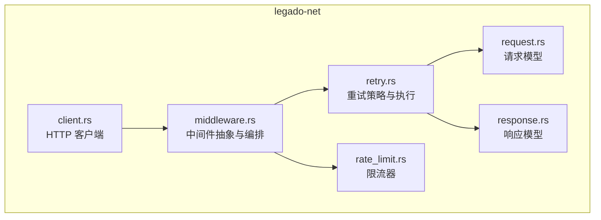
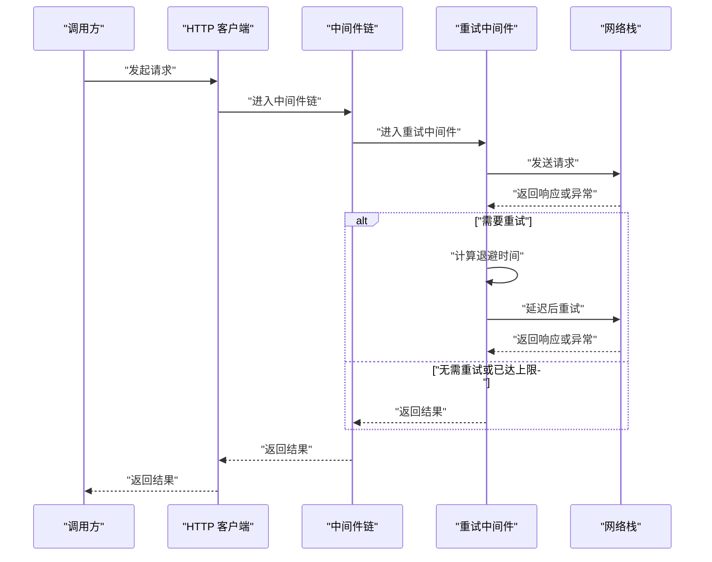
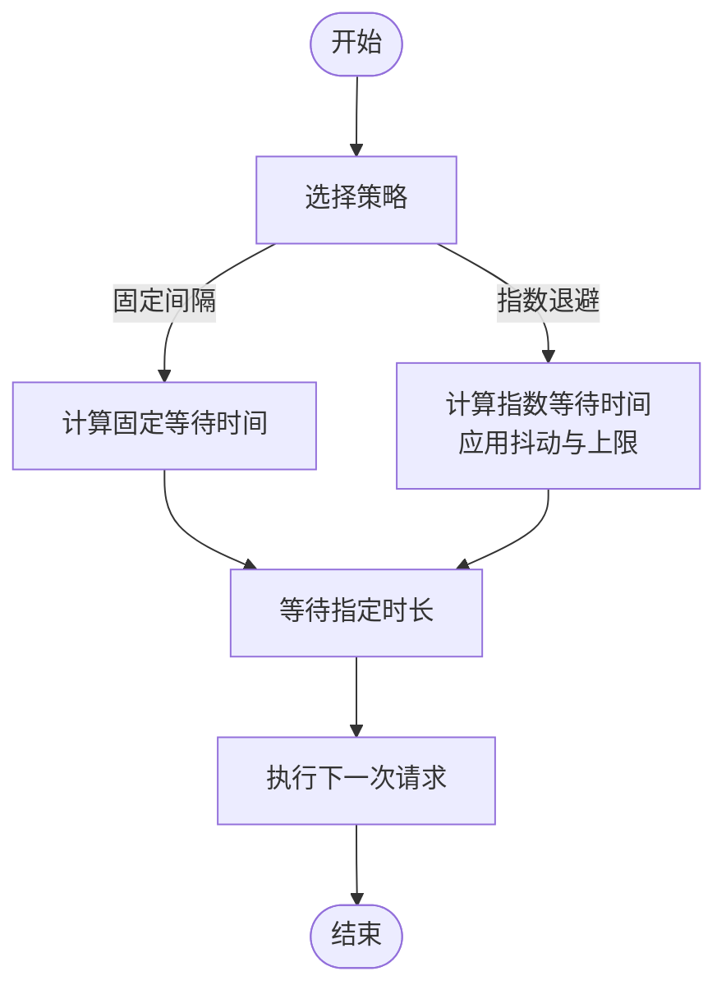
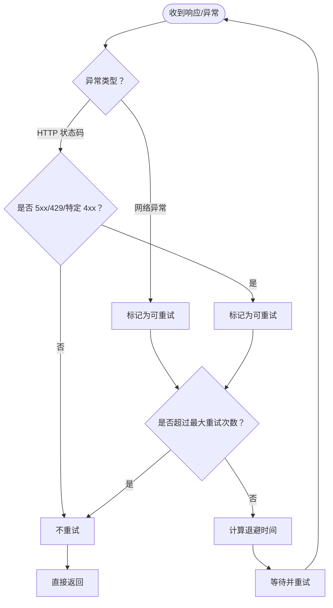
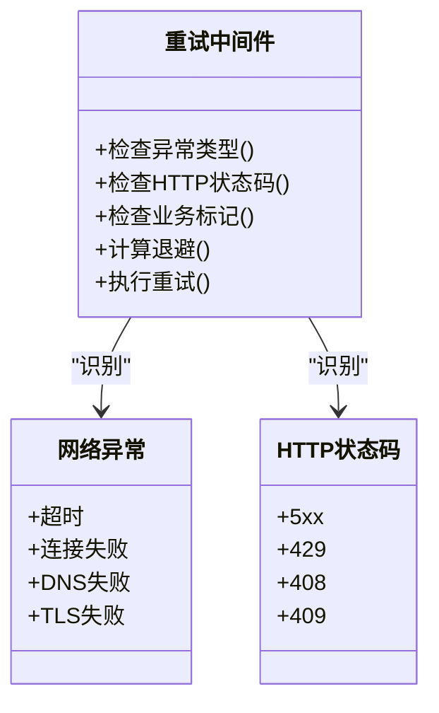
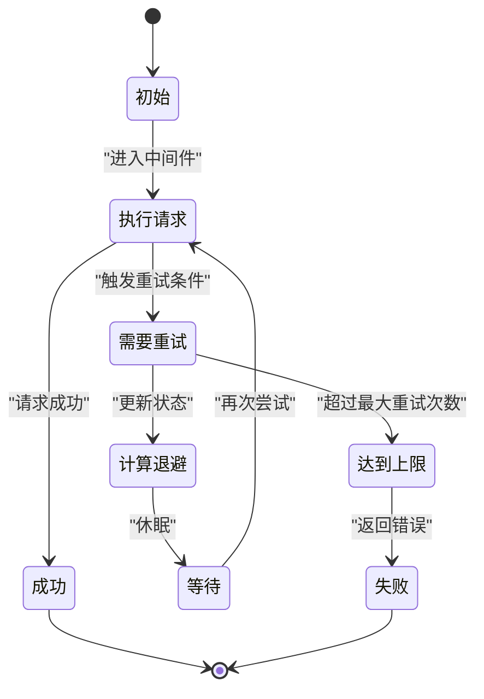
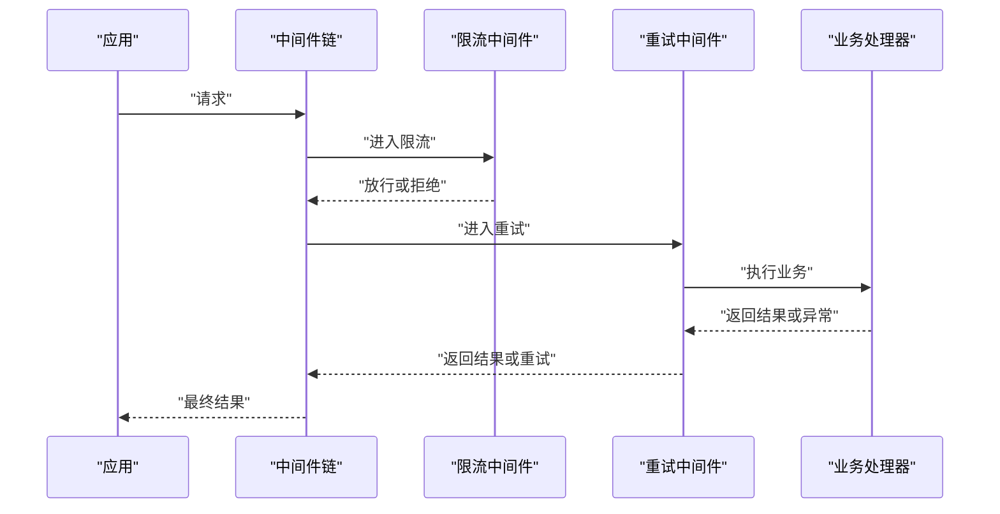
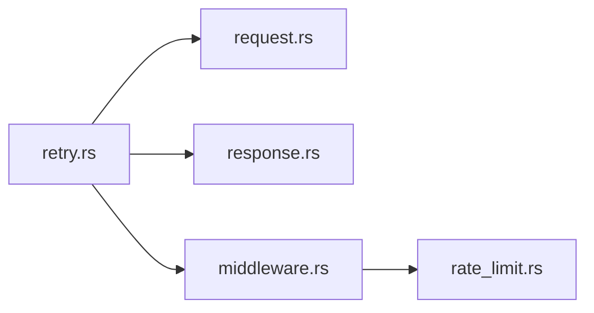

# 重试中间件

<cite>
**本文引用的文件**   
- [retry.rs](file://rust/legado-net/src/retry.rs)
- [middleware.rs](file://rust/legado-net/src/middleware.rs)
- [client.rs](file://rust/legado-net/src/client.rs)
- [request.rs](file://rust/legado-net/src/request.rs)
- [response.rs](file://rust/legado-net/src/response.rs)
- [rate_limit.rs](file://rust/legado-net/src/rate_limit.rs)
</cite>

## 目录
1. [简介](#简介)
2. [项目结构](#项目结构)
3. [核心组件](#核心组件)
4. [架构总览](#架构总览)
5. [详细组件分析](#详细组件分析)
6. [依赖关系分析](#依赖关系分析)
7. [性能考量](#性能考量)
8. [故障排查指南](#故障排查指南)
9. [结论](#结论)
10. [附录](#附录)

## 简介
本文件面向 Legado 网络层中的“重试中间件”，系统性阐述其实现原理与使用方式，覆盖以下主题：
- 重试策略配置（指数退避、固定间隔等）
- 重试条件判断与最大重试次数控制
- 网络异常检测逻辑（超时、连接失败、HTTP 状态码错误等）
- 重试过程中的状态管理与资源清理
- 不同场景下的最佳实践与调试技巧

该中间件位于 Rust 模块 legado-net 中，通过组合式中间件机制对请求进行统一包装，确保在网络不稳定或目标服务瞬时不可用时具备更强的鲁棒性。

## 项目结构
Legado 的网络能力集中在 Rust 的 legado-net 模块内，其中与重试相关的关键文件包括：
- retry.rs：重试策略定义、退避算法、重试判定与执行循环
- middleware.rs：中间件抽象与链式编排
- client.rs：HTTP 客户端封装，暴露带中间件的调用入口
- request.rs / response.rs：请求与响应模型，用于中间件上下文传递
- rate_limit.rs：限流器（常与重试配合，避免雪崩）

**图表来源** 
- [client.rs](file://rust/legado-net/src/client.rs)
- [middleware.rs](file://rust/legado-net/src/middleware.rs)
- [retry.rs](file://rust/legado-net/src/retry.rs)
- [request.rs](file://rust/legado-net/src/request.rs)
- [response.rs](file://rust/legado-net/src/response.rs)
- [rate_limit.rs](file://rust/legado-net/src/rate_limit.rs)

**章节来源**
- [client.rs](file://rust/legado-net/src/client.rs)
- [middleware.rs](file://rust/legado-net/src/middleware.rs)
- [retry.rs](file://rust/legado-net/src/retry.rs)
- [request.rs](file://rust/legado-net/src/request.rs)
- [response.rs](file://rust/legado-net/src/response.rs)
- [rate_limit.rs](file://rust/legado-net/src/rate_limit.rs)

## 核心组件
- 重试策略接口与实现
  - 固定间隔：每次重试等待相同时长
  - 指数退避：等待时间按指数增长，可设置上限与抖动
  - 自定义策略：允许根据业务需求扩展
- 重试条件判断
  - 基于异常类型（如超时、连接失败、DNS 解析失败）
  - 基于 HTTP 状态码（如 5xx、429、部分 4xx）
  - 基于响应内容或业务标记（可扩展）
- 执行控制
  - 最大重试次数
  - 单次请求超时
  - 整体重试窗口（可选）
- 状态与资源管理
  - 记录重试次数、当前退避时间、最后一次错误原因
  - 在退出时释放请求体、取消挂起的异步任务
- 与中间件链集成
  - 作为独立中间件插入到请求处理链路中
  - 与其他中间件（如限流、鉴权、日志）协同工作

**章节来源**
- [retry.rs](file://rust/legado-net/src/retry.rs)
- [middleware.rs](file://rust/legado-net/src/middleware.rs)

## 架构总览
重试中间件以“中间件”形态嵌入 HTTP 客户端的请求处理管线。典型流程如下：
- 上层调用发起请求
- 进入中间件链，重试中间件拦截
- 若满足重试条件，则计算退避并再次尝试
- 成功或达到最大重试次数后返回结果或错误

**图表来源** 
- [client.rs](file://rust/legado-net/src/client.rs)
- [middleware.rs](file://rust/legado-net/src/middleware.rs)
- [retry.rs](file://rust/legado-net/src/retry.rs)

## 详细组件分析

### 重试策略与退避算法
- 固定间隔策略
  - 适用场景：服务端稳定但偶发瞬时错误
  - 特点：实现简单，可控性强
- 指数退避策略
  - 适用场景：高负载、限流、临时拥塞
  - 特点：自动缓解压力，支持抖动避免同步风暴
- 策略选择建议
  - 读多写少、幂等接口优先使用指数退避
  - 强实时性要求且错误率极低可使用固定间隔

**图表来源** 
- [retry.rs](file://rust/legado-net/src/retry.rs)

**章节来源**
- [retry.rs](file://rust/legado-net/src/retry.rs)

### 重试条件判断与最大重试次数控制
- 条件判断维度
  - 网络异常：超时、连接失败、DNS 解析失败、TLS 握手失败
  - HTTP 状态码：5xx、429、部分 4xx（如 408、409）
  - 业务标记：由上层在响应中标注需重试的信号
- 控制参数
  - 最大重试次数：防止无限重试
  - 单次请求超时：避免长时间阻塞
  - 整体重试窗口：限制重试总耗时（可选）

**图表来源** 
- [retry.rs](file://rust/legado-net/src/retry.rs)

**章节来源**
- [retry.rs](file://rust/legado-net/src/retry.rs)

### 网络异常检测逻辑
- 超时检测
  - 连接超时、读取超时、写入超时
  - 可通过单次请求超时与整体重试窗口共同约束
- 连接失败
  - DNS 解析失败、TCP 连接失败、TLS 握手失败
- HTTP 状态码错误
  - 服务端错误（5xx）、限流（429）、请求超时（408）、冲突（409）等
- 业务级重试信号
  - 由上层在响应体或头部注入的可重试标记

**图表来源** 
- [retry.rs](file://rust/legado-net/src/retry.rs)

**章节来源**
- [retry.rs](file://rust/legado-net/src/retry.rs)

### 状态管理与资源清理
- 状态跟踪
  - 记录已重试次数、当前退避时间、最近一次错误原因
  - 便于调试与监控
- 资源清理
  - 及时释放请求体、关闭连接
  - 取消未完成的异步任务，避免泄漏
- 与中间件协作
  - 在进入重试前保存必要上下文
  - 在退出时恢复或清理上下文

**图表来源** 
- [retry.rs](file://rust/legado-net/src/retry.rs)

**章节来源**
- [retry.rs](file://rust/legado-net/src/retry.rs)

### 与中间件链集成
- 中间件抽象
  - 统一的请求/响应上下文
  - 链式调用顺序可控
- 重试中间件位置
  - 通常置于限流之后、具体业务逻辑之前
  - 与日志、鉴权、缓存等中间件协同

**图表来源** 
- [middleware.rs](file://rust/legado-net/src/middleware.rs)
- [rate_limit.rs](file://rust/legado-net/src/rate_limit.rs)
- [retry.rs](file://rust/legado-net/src/retry.rs)

**章节来源**
- [middleware.rs](file://rust/legado-net/src/middleware.rs)
- [rate_limit.rs](file://rust/legado-net/src/rate_limit.rs)
- [retry.rs](file://rust/legado-net/src/retry.rs)

## 依赖关系分析
- 内部依赖
  - 重试中间件依赖请求/响应模型用于上下文传递
  - 与限流中间件配合，避免并发放大导致的服务端压力
- 外部依赖
  - 底层网络栈（Tokio/reqwest 等）提供超时、连接、TLS 等能力
- 耦合与内聚
  - 重试策略与执行逻辑内聚于 retry.rs
  - 中间件抽象解耦了重试与其他横切关注点

**图表来源** 
- [retry.rs](file://rust/legado-net/src/retry.rs)
- [request.rs](file://rust/legado-net/src/request.rs)
- [response.rs](file://rust/legado-net/src/response.rs)
- [middleware.rs](file://rust/legado-net/src/middleware.rs)
- [rate_limit.rs](file://rust/legado-net/src/rate_limit.rs)

**章节来源**
- [retry.rs](file://rust/legado-net/src/retry.rs)
- [middleware.rs](file://rust/legado-net/src/middleware.rs)
- [rate_limit.rs](file://rust/legado-net/src/rate_limit.rs)

## 性能考量
- 退避策略选择
  - 指数退避在高负载下更稳健，但会增加平均延迟
  - 固定间隔适合低延迟、低错误率的场景
- 并发与限流
  - 与限流中间件配合，避免重试风暴
  - 合理设置最大并发与队列长度
- 超时与窗口
  - 单次请求超时不宜过长，避免占用线程池
  - 整体重试窗口应与服务端 SLA 匹配
- 资源释放
  - 及时释放请求体与连接，避免内存泄漏
  - 取消未完成任务，减少 CPU 浪费

[本节为通用指导，不直接分析具体文件]

## 故障排查指南
- 常见问题定位
  - 观察重试次数与退避曲线，确认策略是否合理
  - 检查网络异常类型分布，区分超时与连接失败
  - 核对 HTTP 状态码分布，确认服务端限流或错误
- 调试技巧
  - 启用详细日志，记录每次重试的原因与时间戳
  - 使用最小化用例复现问题，逐步缩小范围
  - 结合限流器统计，评估是否因并发过高触发重试
- 优化建议
  - 调整最大重试次数与退避上限
  - 针对特定状态码增加快速失败路径
  - 在服务端侧增加健康检查与优雅降级

**章节来源**
- [retry.rs](file://rust/legado-net/src/retry.rs)
- [middleware.rs](file://rust/legado-net/src/middleware.rs)

## 结论
重试中间件通过可配置的退避策略与严格的条件判断，显著提升了网络调用的鲁棒性与可用性。在实际使用中，应结合业务特性选择合适的策略，并与限流、超时、资源清理等机制协同，以达到稳定与性能的平衡。

[本节为总结性内容，不直接分析具体文件]

## 附录
- 配置要点
  - 固定间隔：适用于低错误率、强实时性场景
  - 指数退避：适用于高负载、限流、瞬时拥塞场景
  - 最大重试次数：根据业务容忍度设定，避免无限重试
  - 超时设置：单次请求超时与整体重试窗口需与服务端 SLA 匹配
- 使用示例（概念性）
  - 初始化重试策略（固定间隔/指数退避）
  - 将重试中间件插入中间件链
  - 配置最大重试次数与超时
  - 运行并观察日志与指标
- 最佳实践
  - 幂等接口优先使用指数退避
  - 非幂等接口谨慎重试，必要时增加去重与补偿
  - 与限流中间件配合，避免雪崩效应
  - 定期复盘重试指标，持续优化策略

[本节为通用指导，不直接分析具体文件]