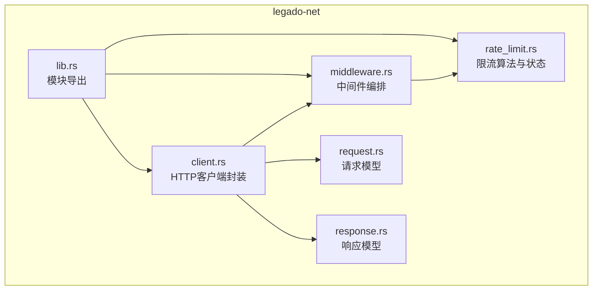
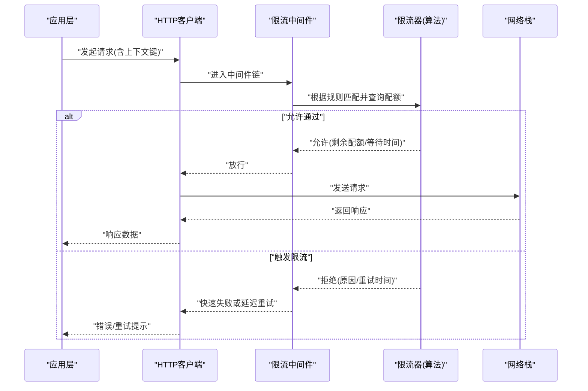
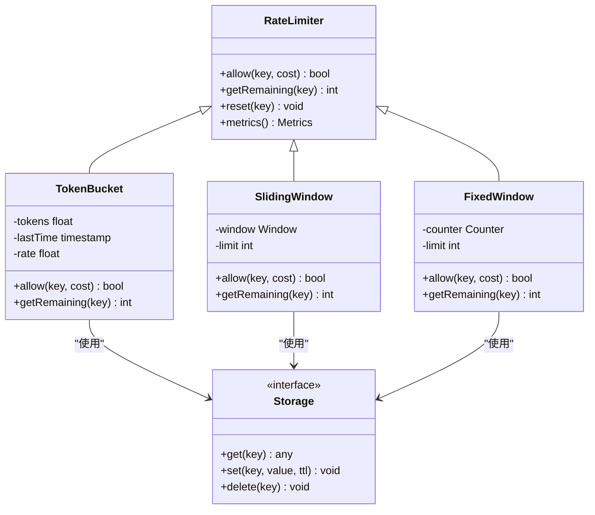
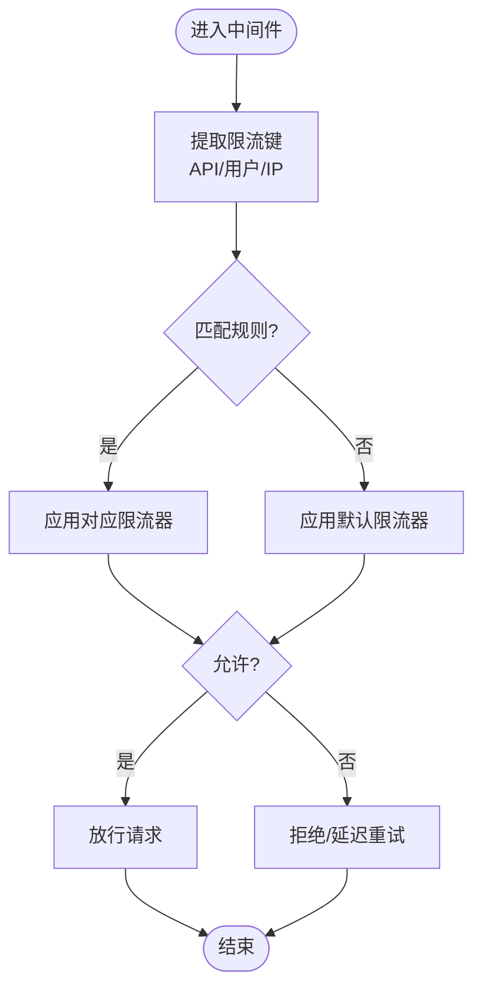
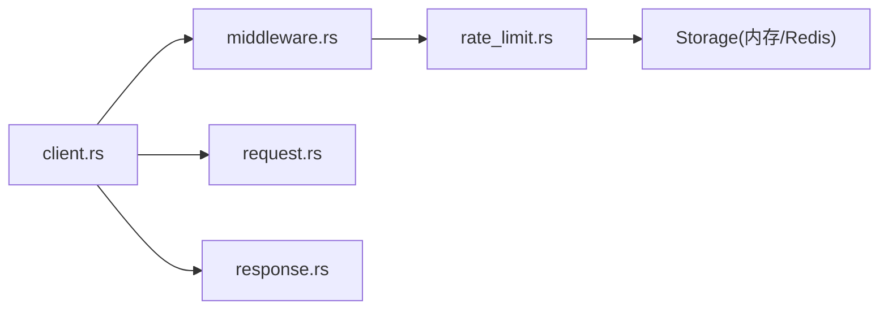

# 限流中间件

<cite>
**本文引用的文件**   
- [rate_limit.rs](file://rust/legado-net/src/rate_limit.rs)
- [middleware.rs](file://rust/legado-net/src/middleware.rs)
- [client.rs](file://rust/legado-net/src/client.rs)
- [request.rs](file://rust/legado-net/src/request.rs)
- [response.rs](file://rust/legado-net/src/response.rs)
- [lib.rs](file://rust/legado-net/src/lib.rs)
</cite>

## 目录
1. [简介](#简介)
2. [项目结构](#项目结构)
3. [核心组件](#核心组件)
4. [架构总览](#架构总览)
5. [详细组件分析](#详细组件分析)
6. [依赖关系分析](#依赖关系分析)
7. [性能考量](#性能考量)
8. [故障排查指南](#故障排查指南)
9. [结论](#结论)
10. [附录](#附录)

## 简介
本文件面向“限流中间件”的设计与实现，围绕以下目标展开：
- 深入解释限流算法的实现选择与应用：令牌桶、滑动窗口、固定窗口。
- 说明限流策略的配置项：请求频率限制、并发数控制、带宽限制。
- 详述限流状态的存储与管理：内存存储与分布式存储支持。
- 解释限流规则的匹配机制与优先级处理。
- 提供不同业务场景下的配置示例：API调用限制、用户级别限流、IP地址限流。
- 给出限流监控与告警的实现建议。

本项目在 Rust 网络层（legado-net）中实现了限流能力，并通过中间件机制集成到 HTTP 客户端链路中，便于对上游请求进行统一管控。

## 项目结构
与限流相关的代码主要位于 Rust 的 legado-net 模块中，关键文件包括：
- 限流算法与状态管理：rate_limit.rs
- 中间件编排与执行：middleware.rs
- 客户端封装与拦截点：client.rs
- 请求/响应模型：request.rs, response.rs
- 模块入口与导出：lib.rs

图表来源
- [rate_limit.rs](file://rust/legado-net/src/rate_limit.rs)
- [middleware.rs](file://rust/legado-net/src/middleware.rs)
- [client.rs](file://rust/legado-net/src/client.rs)
- [request.rs](file://rust/legado-net/src/request.rs)
- [response.rs](file://rust/legado-net/src/response.rs)
- [lib.rs](file://rust/legado-net/src/lib.rs)

章节来源
- [rate_limit.rs](file://rust/legado-net/src/rate_limit.rs)
- [middleware.rs](file://rust/legado-net/src/middleware.rs)
- [client.rs](file://rust/legado-net/src/client.rs)
- [request.rs](file://rust/legado-net/src/request.rs)
- [response.rs](file://rust/legado-net/src/response.rs)
- [lib.rs](file://rust/legado-net/src/lib.rs)

## 核心组件
- 限流器抽象与实现
  - 定义统一的限流接口，支持按维度（如 API、用户、IP）进行计数与配额检查。
  - 典型实现包括令牌桶、滑动窗口、固定窗口等算法。
- 中间件
  - 在请求进入实际发送前进行规则匹配与限流判定；若被限流则快速失败或延迟重试。
- 客户端集成
  - 将限流中间件注入到 HTTP 客户端的请求链中，确保所有出站请求受控。
- 请求/响应模型
  - 为限流上下文携带键值（如 API 标识、用户ID、IP），以及限流结果（是否允许、剩余配额、重试时间）。

章节来源
- [rate_limit.rs](file://rust/legado-net/src/rate_limit.rs)
- [middleware.rs](file://rust/legado-net/src/middleware.rs)
- [client.rs](file://rust/legado-net/src/client.rs)
- [request.rs](file://rust/legado-net/src/request.rs)
- [response.rs](file://rust/legado-net/src/response.rs)

## 架构总览
下图展示了请求从客户端发起，经中间件进行限流判定，再到实际网络发送的整体流程。

图表来源
- [middleware.rs](file://rust/legado-net/src/middleware.rs)
- [rate_limit.rs](file://rust/legado-net/src/rate_limit.rs)
- [client.rs](file://rust/legado-net/src/client.rs)

## 详细组件分析

### 限流算法与状态管理（rate_limit.rs）
- 设计要点
  - 统一接口：定义获取配额、扣减配额、重置配额等方法，屏蔽具体算法差异。
  - 多算法支持：令牌桶（平滑突发）、滑动窗口（精确统计）、固定窗口（简单高效）。
  - 多维度键：支持以 API、用户、IP 等为键组合，形成独立配额空间。
  - 状态存储：默认内存存储；可扩展为分布式存储（如 Redis）以实现跨进程/节点一致性。
- 复杂度与特性
  - 令牌桶：O(1) 扣减，适合突发流量；需维护令牌数量与时间戳。
  - 滑动窗口：O(N) 或 O(logN) 取决于实现（队列/跳表）；更精确但开销更高。
  - 固定窗口：O(1) 计数；实现简单，边界处可能瞬时超量。
- 扩展点
  - 可插拔存储后端：内存 HashMap、Redis 等。
  - 可插拔指标上报：计数器、延迟、拒绝率等。

图表来源
- [rate_limit.rs](file://rust/legado-net/src/rate_limit.rs)

章节来源
- [rate_limit.rs](file://rust/legado-net/src/rate_limit.rs)

### 中间件编排（middleware.rs）
- 职责
  - 解析请求上下文，提取限流键（如 API、用户、IP）。
  - 匹配限流规则（优先级排序），调用对应限流器进行判定。
  - 根据结果决定放行、快速失败或延迟重试。
- 规则匹配与优先级
  - 规则按优先级从高到低匹配，命中即生效；未命中可回退到默认规则。
  - 支持通配符或正则匹配路径/域名，结合用户/IP 维度形成复合键。
- 错误与重试
  - 限流拒绝时返回明确错误码与重试时间，客户端可按指数退避重试。

图表来源
- [middleware.rs](file://rust/legado-net/src/middleware.rs)

章节来源
- [middleware.rs](file://rust/legado-net/src/middleware.rs)

### 客户端集成（client.rs）
- 作用
  - 将限流中间件注册到请求链，确保所有出站请求经过限流。
  - 提供便捷方法设置全局限流策略与局部覆盖。
- 与请求/响应的协作
  - 在请求对象中附加限流上下文键；在响应中携带限流元信息（如剩余配额、重试时间）。

章节来源
- [client.rs](file://rust/legado-net/src/client.rs)
- [request.rs](file://rust/legado-net/src/request.rs)
- [response.rs](file://rust/legado-net/src/response.rs)

### 模块入口（lib.rs）
- 作用
  - 对外暴露限流相关类型与函数，供上层模块导入使用。
  - 统一管理中间件注册与初始化逻辑。

章节来源
- [lib.rs](file://rust/legado-net/src/lib.rs)

## 依赖关系分析
- 内部依赖
  - middleware.rs 依赖 rate_limit.rs 提供的限流器接口与实现。
  - client.rs 依赖 middleware.rs 完成请求拦截，同时依赖 request.rs/response.rs 传递上下文与结果。
- 外部依赖
  - 可选分布式存储（如 Redis）用于跨进程/节点的一致性限流状态。
  - 指标采集库用于上报限流事件与性能指标。

图表来源
- [client.rs](file://rust/legado-net/src/client.rs)
- [middleware.rs](file://rust/legado-net/src/middleware.rs)
- [rate_limit.rs](file://rust/legado-net/src/rate_limit.rs)
- [request.rs](file://rust/legado-net/src/request.rs)
- [response.rs](file://rust/legado-net/src/response.rs)

章节来源
- [client.rs](file://rust/legado-net/src/client.rs)
- [middleware.rs](file://rust/legado-net/src/middleware.rs)
- [rate_limit.rs](file://rust/legado-net/src/rate_limit.rs)
- [request.rs](file://rust/legado-net/src/request.rs)
- [response.rs](file://rust/legado-net/src/response.rs)

## 性能考量
- 算法选择
  - 高吞吐、低延迟场景优先令牌桶；需要严格统计时使用滑动窗口；资源受限环境可用固定窗口。
- 存储后端
  - 单机内存存储具备最低延迟；分布式存储带来额外网络开销，应配合缓存与批量操作优化。
- 并发控制
  - 在高并发下避免热点键竞争，可采用分片或本地聚合再同步的策略。
- 指标与观测
  - 记录 QPS、拒绝率、平均延迟、P99 延迟等，辅助容量规划与阈值调优。

## 故障排查指南
- 常见问题
  - 误判限流：检查限流键是否正确（API/用户/IP 维度），确认规则优先级与匹配条件。
  - 状态不一致：分布式存储下检查时钟漂移、TTL 过期与写入失败重试。
  - 性能抖动：评估滑动窗口实现的内存占用与 GC 压力，必要时切换为令牌桶或固定窗口。
- 诊断手段
  - 开启详细日志，输出每次匹配的键、规则、结果与耗时。
  - 暴露指标端点，实时观察限流曲线与拒绝峰值。
  - 压测验证：模拟真实流量模式，验证阈值与恢复行为是否符合预期。

章节来源
- [middleware.rs](file://rust/legado-net/src/middleware.rs)
- [rate_limit.rs](file://rust/legado-net/src/rate_limit.rs)

## 结论
本限流中间件通过统一的限流器抽象与灵活的中间件机制，为 HTTP 客户端提供了可扩展、高性能的流量治理能力。通过选择合适的算法、合理的规则匹配与可靠的存储后端，可在多种业务场景下实现稳定可控的限流策略。配合完善的监控与告警体系，可有效保障系统在高负载下的稳定性与可用性。

## 附录

### 限流算法对比与选型建议
- 令牌桶
  - 优点：平滑突发、实现简洁、O(1) 扣减。
  - 适用：API 网关、外部服务调用限速。
- 滑动窗口
  - 优点：统计精确、无边界突刺。
  - 适用：严格合规场景、审计要求高的系统。
- 固定窗口
  - 优点：极简、低开销。
  - 适用：轻量级保护、边缘节点。

### 配置选项说明
- 请求频率限制
  - 参数：周期内最大请求数、窗口大小、速率（令牌桶）。
- 并发数控制
  - 参数：最大并发、排队长度、超时时间。
- 带宽限制
  - 参数：上行/下行带宽上限、突发大小、整形策略。

### 规则匹配与优先级
- 匹配维度：API 路径、域名、用户ID、IP、租户ID。
- 优先级：精确匹配 > 前缀匹配 > 通配/正则匹配 > 默认规则。
- 复合键：多个维度组合形成唯一键，隔离不同业务线。

### 存储与管理
- 内存存储：进程内 HashMap，低延迟，重启丢失。
- 分布式存储：Redis/ZK，跨节点一致，需考虑网络与序列化开销。
- 数据清理：TTL 过期、定期压缩、冷热分离。

### 监控与告警
- 指标：QPS、拒绝率、延迟分布、配额使用率、存储命中率。
- 告警：拒绝率突增、延迟飙升、配额耗尽、存储异常。
- 可视化：仪表盘展示各维度限流趋势与热点键。

### 业务场景示例
- API 调用限制
  - 规则：按 API 路径分组，限制每秒请求数与突发上限。
  - 存储：内存（单机）或 Redis（集群）。
- 用户级别限流
  - 规则：按用户ID维度，区分免费/付费用户配额。
  - 存储：分布式存储保证跨实例一致性。
- IP 地址限流
  - 规则：按 IP 或网段限制，防止恶意刷接口。
  - 存储：内存+布隆过滤器防抖，热点 IP 单独加速。

章节来源
- [rate_limit.rs](file://rust/legado-net/src/rate_limit.rs)
- [middleware.rs](file://rust/legado-net/src/middleware.rs)
- [client.rs](file://rust/legado-net/src/client.rs)
- [request.rs](file://rust/legado-net/src/request.rs)
- [response.rs](file://rust/legado-net/src/response.rs)
- [lib.rs](file://rust/legado-net/src/lib.rs)