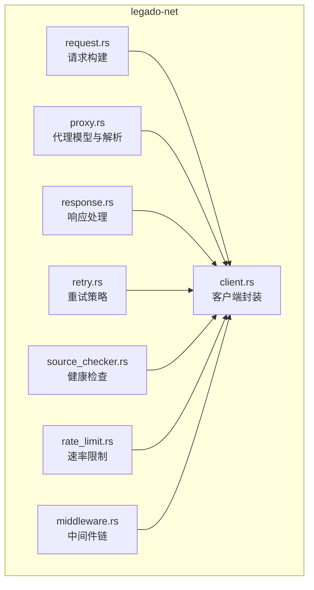
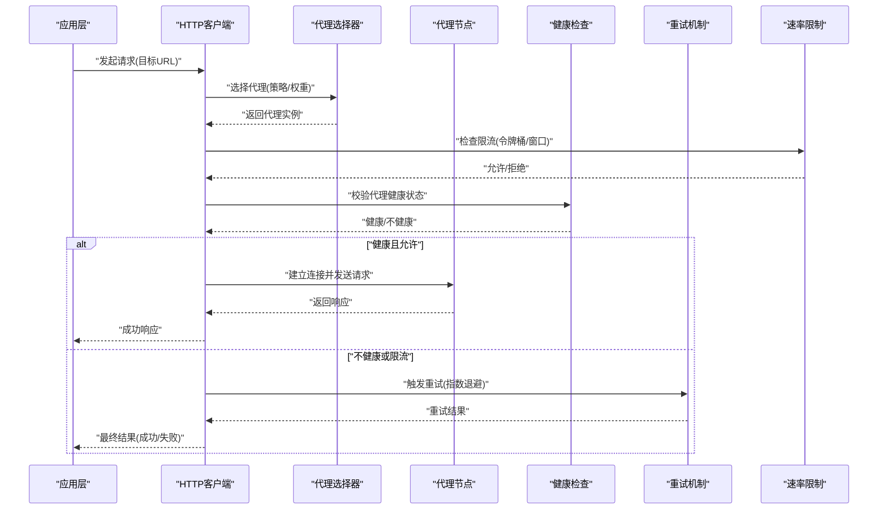
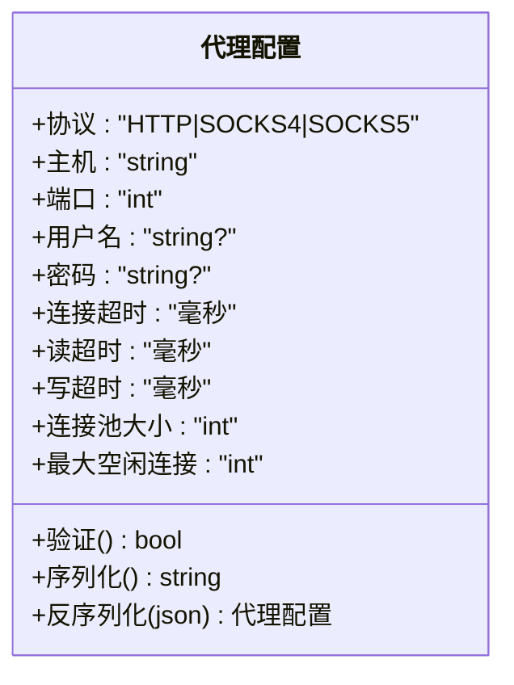
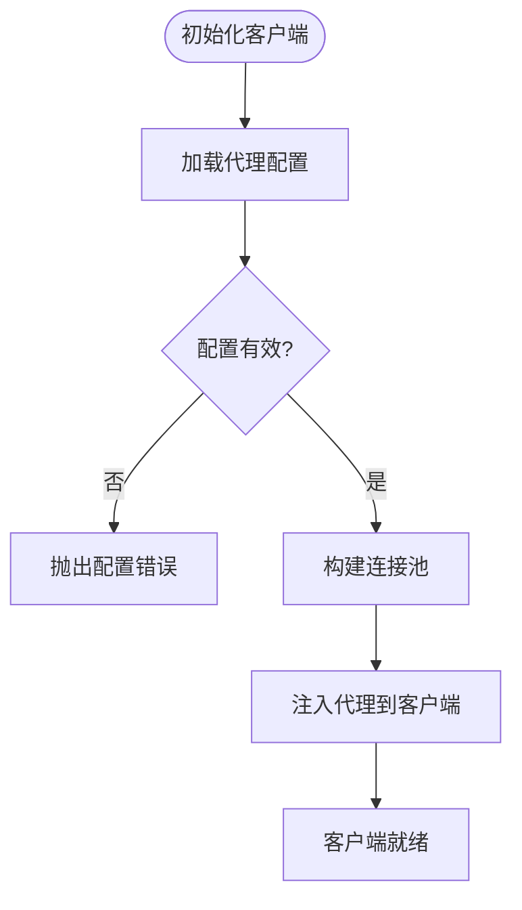
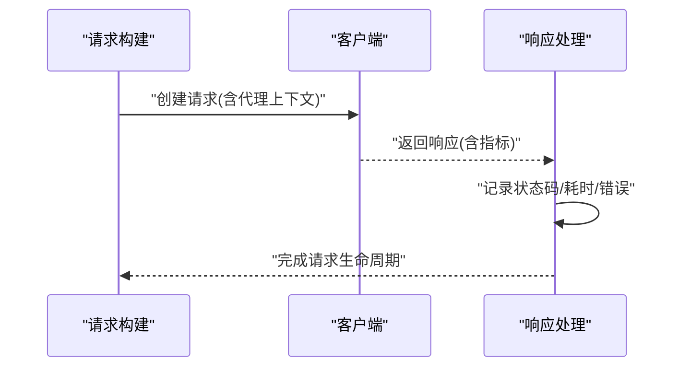
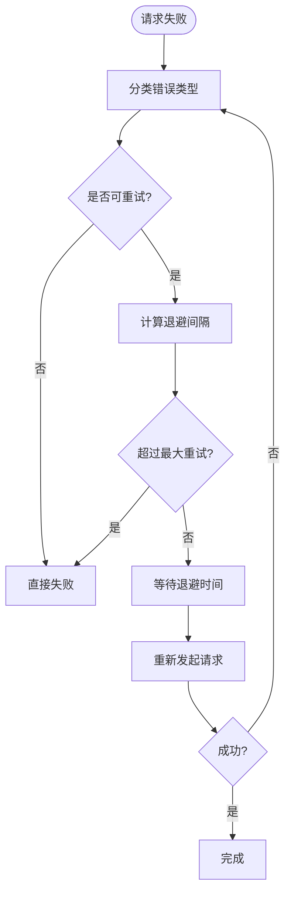
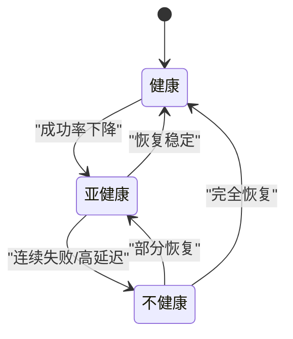
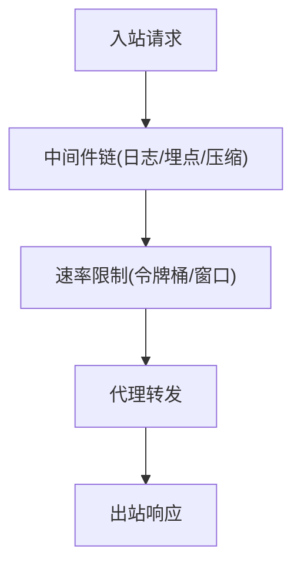
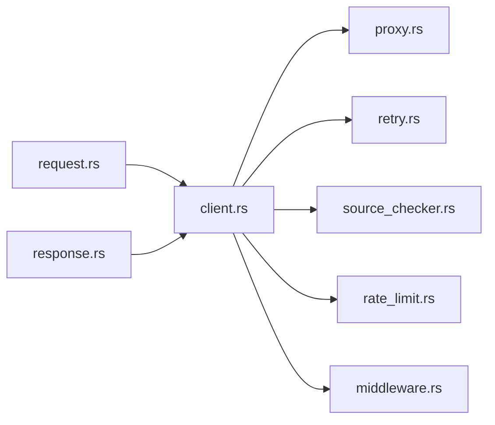

# 代理管理

<cite>
**本文引用的文件**   
- [proxy.rs](file://rust/legado-net/src/proxy.rs)
- [client.rs](file://rust/legado-net/src/client.rs)
- [request.rs](file://rust/legado-net/src/request.rs)
- [response.rs](file://rust/legado-net/src/response.rs)
- [retry.rs](file://rust/legado-net/src/retry.rs)
- [source_checker.rs](file://rust/legado-net/src/source_checker.rs)
- [rate_limit.rs](file://rust/legado-net/src/rate_limit.rs)
- [middleware.rs](file://rust/legado-net/src/middleware.rs)
- [lib.rs](file://rust/legado-net/src/lib.rs)
</cite>

## 目录
1. [简介](#简介)
2. [项目结构](#项目结构)
3. [核心组件](#核心组件)
4. [架构总览](#架构总览)
5. [详细组件分析](#详细组件分析)
6. [依赖关系分析](#依赖关系分析)
7. [性能考量](#性能考量)
8. [故障排除指南](#故障排除指南)
9. [结论](#结论)
10. [附录](#附录)

## 简介
本文件面向Legado网络子系统的代理管理能力，系统性说明支持的代理类型（HTTP、SOCKS4/5）、代理配置语法与选项（认证、超时、连接池）、代理选择策略（轮询、随机、基于性能的动态选择）、健康检查与故障转移（连接测试、错误重试、自动切换），以及代理池的扩展性设计（动态增删、负载均衡）。文档同时提供可操作的配置示例与排错建议，帮助开发者与高级用户高效使用并优化代理能力。

## 项目结构
代理相关代码集中在 Rust 模块 legado-net 中，围绕请求构建、客户端封装、代理配置、重试与健康检查等职责进行分层组织：
- 代理模型与解析：定义代理协议、地址、认证信息、超时与连接池参数，并提供序列化/反序列化能力。
- 客户端集成：将代理配置注入到底层 HTTP 客户端，确保所有出站请求按策略走代理。
- 请求/响应：在请求阶段注入代理上下文，在响应阶段记录代理使用指标以便后续选择与评估。
- 重试与健康检查：对失败请求进行指数退避重试；周期性探测代理可用性，维护健康状态。
- 速率限制与中间件：为代理通道提供限流与通用中间件能力，避免突发流量打垮代理节点。

**图表来源** 
- [proxy.rs](file://rust/legado-net/src/proxy.rs)
- [client.rs](file://rust/legado-net/src/client.rs)
- [request.rs](file://rust/legado-net/src/request.rs)
- [response.rs](file://rust/legado-net/src/response.rs)
- [retry.rs](file://rust/legado-net/src/retry.rs)
- [source_checker.rs](file://rust/legado-net/src/source_checker.rs)
- [rate_limit.rs](file://rust/legado-net/src/rate_limit.rs)
- [middleware.rs](file://rust/legado-net/src/middleware.rs)

**章节来源**
- [lib.rs](file://rust/legado-net/src/lib.rs)

## 核心组件
- 代理模型与配置
  - 支持协议：HTTP、SOCKS4、SOCKS5。
  - 关键属性：主机、端口、用户名/密码、超时（连接、读取、写入）、连接池大小、最大空闲连接数、是否启用TLS（针对HTTPS代理）。
  - 校验与默认值：非法地址或端口会触发配置校验失败；未设置超时时采用安全默认值。
- 客户端集成
  - 将代理配置注入到HTTP客户端实例，保证请求统一经代理发出。
  - 支持多代理实例并存，由上层选择器决定具体代理。
- 请求/响应增强
  - 请求阶段：附加代理标识、追踪首字节时间、连接复用情况。
  - 响应阶段：记录状态码、耗时、错误类型，用于健康评分与动态选择。
- 重试与健康检查
  - 重试：指数退避+抖动，区分可重试错误（网络抖动、超时）与不可重试错误（认证失败、4xx）。
  - 健康检查：定时探测连通性与延迟，标记不健康节点并参与故障转移。
- 速率限制与中间件
  - 每代理独立令牌桶或滑动窗口限流，防止单点拥塞。
  - 中间件链支持日志、埋点、压缩、缓存等横切关注点。

**章节来源**
- [proxy.rs](file://rust/legado-net/src/proxy.rs)
- [client.rs](file://rust/legado-net/src/client.rs)
- [request.rs](file://rust/legado-net/src/request.rs)
- [response.rs](file://rust/legado-net/src/response.rs)
- [retry.rs](file://rust/legado-net/src/retry.rs)
- [source_checker.rs](file://rust/legado-net/src/source_checker.rs)
- [rate_limit.rs](file://rust/legado-net/src/rate_limit.rs)
- [middleware.rs](file://rust/legado-net/src/middleware.rs)

## 架构总览
下图展示从应用发起请求到通过代理返回响应的整体流程，包括代理选择、健康检查、重试与限流等环节。

**图表来源** 
- [client.rs](file://rust/legado-net/src/client.rs)
- [proxy.rs](file://rust/legado-net/src/proxy.rs)
- [retry.rs](file://rust/legado-net/src/retry.rs)
- [source_checker.rs](file://rust/legado-net/src/source_checker.rs)
- [rate_limit.rs](file://rust/legado-net/src/rate_limit.rs)

## 详细组件分析

### 代理模型与配置（proxy.rs）
- 数据结构
  - 协议枚举：HTTP、SOCKS4、SOCKS5。
  - 地址对象：主机名/IP、端口、可选用户名/密码。
  - 超时与连接池：连接超时、读超时、写超时、连接池大小、最大空闲连接。
- 配置解析
  - 支持字符串格式与结构化配置两种输入方式。
  - 校验规则：端口范围、主机合法性、认证字段匹配、超时非负。
- 序列化/反序列化
  - 提供JSON/YAML友好格式，便于外部配置导入导出。

**图表来源** 
- [proxy.rs](file://rust/legado-net/src/proxy.rs)

**章节来源**
- [proxy.rs](file://rust/legado-net/src/proxy.rs)

### 客户端集成（client.rs）
- 代理注入
  - 将代理配置绑定到HTTP客户端实例，确保所有出站请求经代理转发。
  - 支持多客户端实例，分别对应不同代理集合。
- 连接复用
  - 基于连接池复用TCP/TLS连接，减少握手开销。
- 上下文传递
  - 在请求上下文中携带代理标识与指标采集钩子。

**图表来源** 
- [client.rs](file://rust/legado-net/src/client.rs)

**章节来源**
- [client.rs](file://rust/legado-net/src/client.rs)

### 请求与响应增强（request.rs, response.rs）
- 请求阶段
  - 附加代理ID、追踪开始时间、是否走代理、是否重试。
  - 根据目标URL与代理能力决定是否强制走代理。
- 响应阶段
  - 记录状态码、耗时、错误类型、代理负载指标。
  - 将指标上报给选择器与健康检查模块。

**图表来源** 
- [request.rs](file://rust/legado-net/src/request.rs)
- [response.rs](file://rust/legado-net/src/response.rs)

**章节来源**
- [request.rs](file://rust/legado-net/src/request.rs)
- [response.rs](file://rust/legado-net/src/response.rs)

### 重试策略（retry.rs）
- 错误分类
  - 可重试：网络超时、连接中断、5xx服务端错误。
  - 不可重试：认证失败、4xx客户端错误、参数非法。
- 退避策略
  - 指数退避+随机抖动，避免雪崩。
  - 最大重试次数与间隔上限保护系统资源。
- 幂等性控制
  - 仅对GET/HEAD等幂等方法进行自动重试，POST/PUT需显式声明。

**图表来源** 
- [retry.rs](file://rust/legado-net/src/retry.rs)

**章节来源**
- [retry.rs](file://rust/legado-net/src/retry.rs)

### 健康检查与故障转移（source_checker.rs）
- 探测策略
  - 定期向代理发送轻量请求（如HEAD或短连接测试）。
  - 统计成功率、平均延迟、错误分布。
- 健康状态
  - 健康：连续成功达到阈值。
  - 亚健康：成功率下降但仍在容忍范围内。
  - 不健康：连续失败或延迟过高。
- 故障转移
  - 选择不健康代理时自动切换到健康代理。
  - 恢复后逐步回切，避免频繁震荡。

**图表来源** 
- [source_checker.rs](file://rust/legado-net/src/source_checker.rs)

**章节来源**
- [source_checker.rs](file://rust/legado-net/src/source_checker.rs)

### 速率限制与中间件（rate_limit.rs, middleware.rs）
- 速率限制
  - 每代理独立限流，支持令牌桶或滑动窗口。
  - 超限请求进入队列或直接拒绝，避免代理过载。
- 中间件链
  - 日志、埋点、压缩、缓存、鉴权等横切逻辑。
  - 可插拔组合，按需启用。

**图表来源** 
- [rate_limit.rs](file://rust/legado-net/src/rate_limit.rs)
- [middleware.rs](file://rust/legado-net/src/middleware.rs)

**章节来源**
- [rate_limit.rs](file://rust/legado-net/src/rate_limit.rs)
- [middleware.rs](file://rust/legado-net/src/middleware.rs)

## 依赖关系分析
- 组件耦合
  - client.rs 依赖 proxy.rs 提供代理配置，依赖 retry.rs 与 source_checker.rs 实现容错与健康治理。
  - request.rs 与 response.rs 作为横切数据载体，贯穿整个调用链路。
  - rate_limit.rs 与 middleware.rs 提供通用能力，被 client.rs 编排。
- 外部依赖
  - 底层HTTP库（如reqwest/ureq）负责实际网络IO。
  - 序列化库（serde）用于配置读写。
  - 计时与并发原语（tokio）用于异步与调度。

**图表来源** 
- [client.rs](file://rust/legado-net/src/client.rs)
- [proxy.rs](file://rust/legado-net/src/proxy.rs)
- [retry.rs](file://rust/legado-net/src/retry.rs)
- [source_checker.rs](file://rust/legado-net/src/source_checker.rs)
- [rate_limit.rs](file://rust/legado-net/src/rate_limit.rs)
- [middleware.rs](file://rust/legado-net/src/middleware.rs)
- [request.rs](file://rust/legado-net/src/request.rs)
- [response.rs](file://rust/legado-net/src/response.rs)

**章节来源**
- [client.rs](file://rust/legado-net/src/client.rs)
- [proxy.rs](file://rust/legado-net/src/proxy.rs)
- [retry.rs](file://rust/legado-net/src/retry.rs)
- [source_checker.rs](file://rust/legado-net/src/source_checker.rs)
- [rate_limit.rs](file://rust/legado-net/src/rate_limit.rs)
- [middleware.rs](file://rust/legado-net/src/middleware.rs)
- [request.rs](file://rust/legado-net/src/request.rs)
- [response.rs](file://rust/legado-net/src/response.rs)

## 性能考量
- 连接池调优
  - 合理设置连接池大小与最大空闲连接，避免过多连接导致内存压力。
  - 针对不同代理节点按带宽与延迟差异化配置。
- 超时与重试
  - 读/写超时根据业务SLA设定，避免长尾阻塞。
  - 重试次数与退避策略需结合代理稳定性调整。
- 指标与观测
  - 收集各代理的成功率、延迟、错误分布，用于动态选择与容量规划。
  - 监控连接池命中率与复用率，优化吞吐。

[本节为通用指导，不直接分析具体文件]

## 故障排除指南
- 常见问题
  - 认证失败：检查用户名/密码是否正确，确认代理是否需要认证。
  - 连接超时：核对主机/端口、防火墙规则、DNS解析。
  - 高延迟/丢包：评估代理负载与网络质量，考虑切换至更优节点。
  - 限流触发：降低并发或提升代理配额，检查令牌桶参数。
- 诊断步骤
  - 查看健康检查日志，确认代理状态变化。
  - 检查重试计数与退避间隔，判断是否陷入重试风暴。
  - 观察连接池利用率，避免连接耗尽。
- 修复建议
  - 更新代理配置，修正认证信息与超时参数。
  - 增加健康检查频率与阈值灵敏度。
  - 调整限流策略与中间件顺序，优先放行关键请求。

**章节来源**
- [source_checker.rs](file://rust/legado-net/src/source_checker.rs)
- [retry.rs](file://rust/legado-net/src/retry.rs)
- [rate_limit.rs](file://rust/legado-net/src/rate_limit.rs)
- [client.rs](file://rust/legado-net/src/client.rs)

## 结论
Legado的代理管理以清晰的模块化设计实现了HTTP/SOCKS4/5代理的统一接入，配合健康检查、重试与限流机制，提供了高可用与可扩展的代理池能力。通过合理的配置与监控，可在复杂网络环境下保持稳定的请求转发与良好的用户体验。

[本节为总结性内容，不直接分析具体文件]

## 附录
- 配置示例（文本描述）
  - HTTP代理：主机、端口、用户名、密码、连接超时、读超时、写超时、连接池大小。
  - SOCKS5代理：主机、端口、用户名、密码、连接超时、连接池大小。
  - 代理池：多个代理条目，每个条目包含上述字段，并可选择启用/禁用。
- 选择策略
  - 轮询：按顺序依次选择代理，适合均匀负载。
  - 随机：随机选择，避免热点集中。
  - 基于性能：根据历史成功率与延迟动态加权，优先选择优质代理。
- 扩展性设计
  - 动态添加/移除：运行时更新代理列表，无需重启服务。
  - 负载均衡：结合健康状态与实时指标进行自适应分配。
  - 插件化中间件：按需插入日志、压缩、缓存等能力。

[本节为概念性内容，不直接分析具体文件]