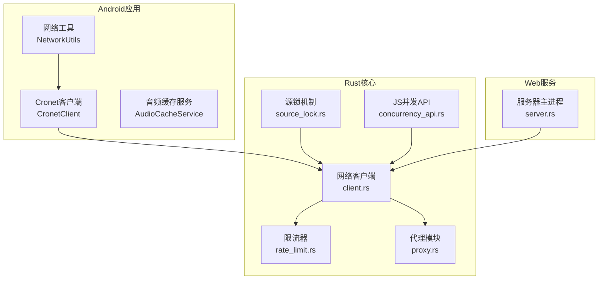
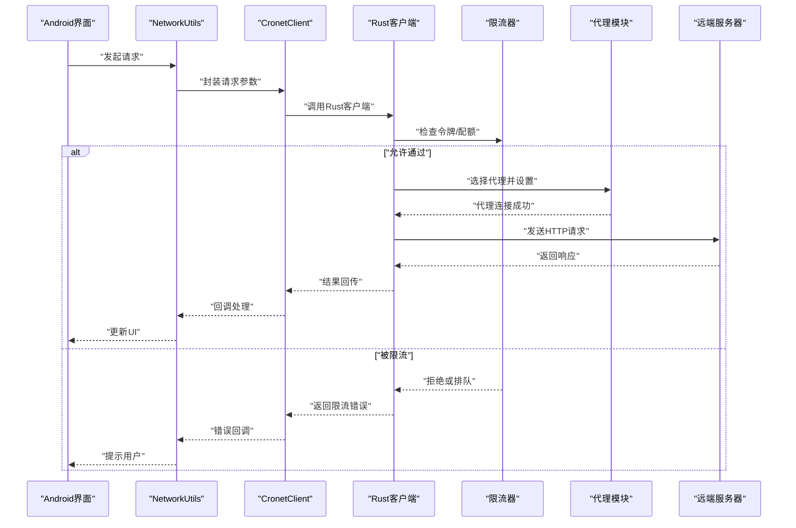
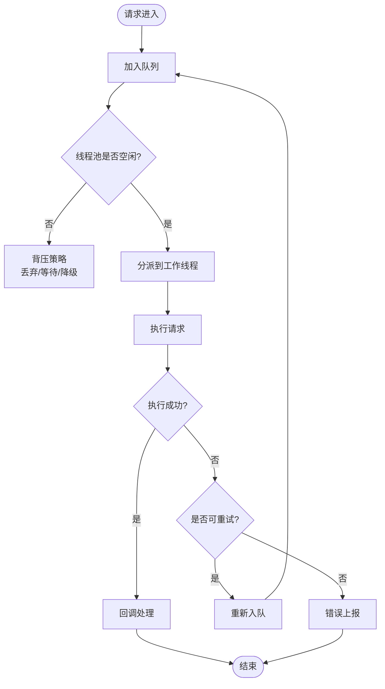
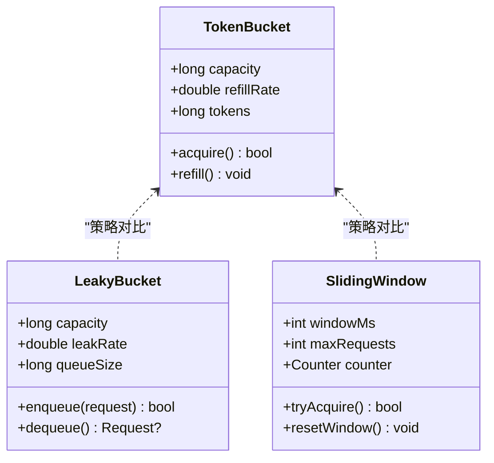
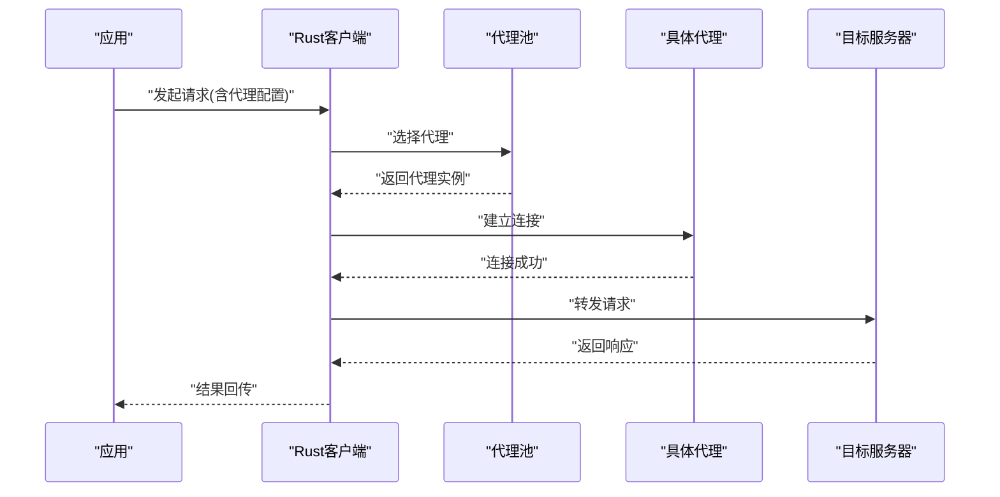
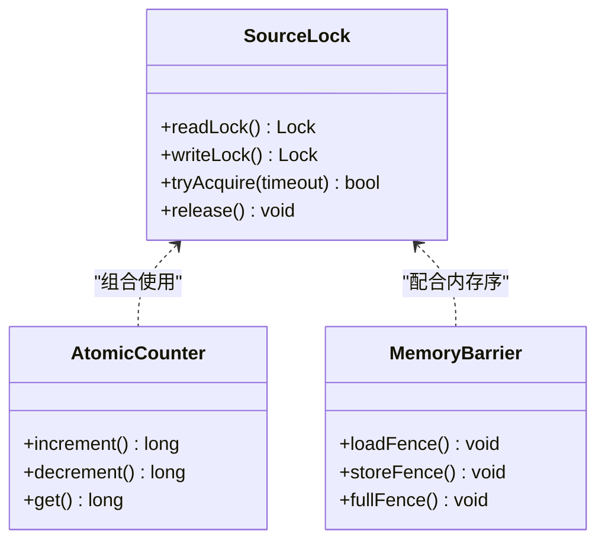
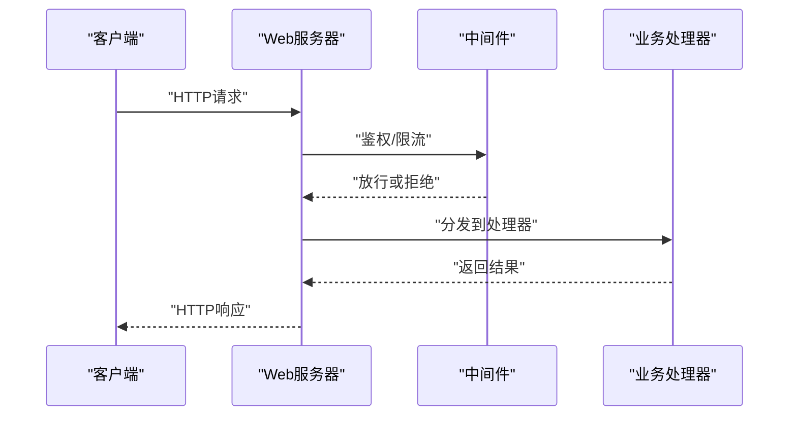
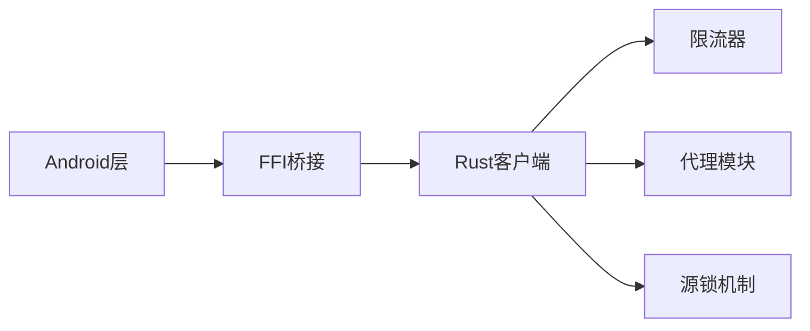

# 并发控制

<cite>
**本文引用的文件**   
- [app/src/main/java/io/legado/app/utils/NetworkUtils.kt](file://app/src/main/java/io/legado/app/utils/NetworkUtils.kt)
- [app/src/main/java/io/legado/app/lib/cronet/CronetClient.kt](file://app/src/main/java/io/legado/app/lib/cronet/CronetClient.kt)
- [rust/legado-net/src/rate_limit.rs](file://rust/legado-net/src/rate_limit.rs)
- [rust/legado-net/src/proxy.rs](file://rust/legado-net/src/proxy.rs)
- [rust/legado-net/src/client.rs](file://rust/legado-net/src/client.rs)
- [rust/legado-core/src/source_lock.rs](file://rust/legado-core/src/source_lock.rs)
- [rust/legado-js/src/js_source/concurrency_api.rs](file://rust/legado-js/src/js_source/concurrency_api.rs)
- [rust/legado-server/src/server.rs](file://rust/legado-server/src/server.rs)
- [app/src/main/java/io/legado/app/service/AudioCacheService.kt](file://app/src/main/java/io/legado/app/service/AudioCacheService.kt)
</cite>

## 目录
1. [简介](#简介)
2. [项目结构](#项目结构)
3. [核心组件](#核心组件)
4. [架构总览](#架构总览)
5. [详细组件分析](#详细组件分析)
6. [依赖关系分析](#依赖关系分析)
7. [性能考量与调优](#性能考量与调优)
8. [故障排除指南](#故障排除指南)
9. [结论](#结论)
10. [附录：配置示例与监控指标](#附录配置示例与监控指标)

## 简介
本文件面向Legado项目的并发控制体系，系统性阐述并发请求处理、队列管理、线程池配置与资源调度；限流算法（令牌桶、漏桶、滑动窗口）的实现要点；代理支持（HTTP/SOCKS及代理池）的配置与使用；并发安全保证（锁策略、原子操作、内存屏障）；以及性能调优建议与监控指标（QPS、延迟、错误率）。文档同时提供可操作的配置示例与常见问题的排查方法。

## 项目结构
本项目在Android端与Rust后端共同实现网络并发能力：
- Android层负责UI交互、任务编排与Cronet客户端封装，提供线程池与队列的入口。
- Rust层提供高性能的网络客户端、限流器、代理与并发原语，并通过FFI暴露给上层。
- Web服务层提供并发安全的API路由与状态管理。

图表来源
- [app/src/main/java/io/legado/app/utils/NetworkUtils.kt](file://app/src/main/java/io/legado/app/utils/NetworkUtils.kt)
- [app/src/main/java/io/legado/app/lib/cronet/CronetClient.kt](file://app/src/main/java/io/legado/app/lib/cronet/CronetClient.kt)
- [rust/legado-net/src/client.rs](file://rust/legado-net/src/client.rs)
- [rust/legado-net/src/rate_limit.rs](file://rust/legado-net/src/rate_limit.rs)
- [rust/legado-net/src/proxy.rs](file://rust/legado-net/src/proxy.rs)
- [rust/legado-core/src/source_lock.rs](file://rust/legado-core/src/source_lock.rs)
- [rust/legado-js/src/js_source/concurrency_api.rs](file://rust/legado-js/src/js_source/concurrency_api.rs)
- [rust/legado-server/src/server.rs](file://rust/legado-server/src/server.rs)

章节来源
- [app/src/main/java/io/legado/app/utils/NetworkUtils.kt](file://app/src/main/java/io/legado/app/utils/NetworkUtils.kt)
- [app/src/main/java/io/legado/app/lib/cronet/CronetClient.kt](file://app/src/main/java/io/legado/app/lib/cronet/CronetClient.kt)
- [rust/legado-net/src/client.rs](file://rust/legado-net/src/client.rs)
- [rust/legado-net/src/rate_limit.rs](file://rust/legado-net/src/rate_limit.rs)
- [rust/legado-net/src/proxy.rs](file://rust/legado-net/src/proxy.rs)
- [rust/legado-core/src/source_lock.rs](file://rust/legado-core/src/source_lock.rs)
- [rust/legado-js/src/js_source/concurrency_api.rs](file://rust/legado-js/src/js_source/concurrency_api.rs)
- [rust/legado-server/src/server.rs](file://rust/legado-server/src/server.rs)

## 核心组件
- 并发请求处理与队列管理
  - Android侧通过Cronet客户端统一发起网络请求，结合线程池与任务队列进行调度。
  - Rust侧在网络客户端中集成限流器与重试逻辑，确保高并发下的稳定性。
- 限流算法
  - 令牌桶：以固定速率生成令牌，请求需获取令牌方可执行，适合突发流量平滑。
  - 漏桶：以固定速率消费请求，超出容量则排队或拒绝，适合削峰填谷。
  - 滑动窗口：基于时间窗口的计数统计，限制单位时间内的最大请求数。
- 代理支持
  - HTTP代理：通过目标地址与认证信息转发请求。
  - SOCKS代理：支持SOCKS4/SOCKS5协议，适用于匿名转发。
  - 代理池：多代理轮换与健康检查，提升可用性与容错性。
- 并发安全
  - 锁策略：读写锁与细粒度锁保护共享状态，避免竞态条件。
  - 原子操作：无锁计数器与CAS更新，提高吞吐。
  - 内存屏障：确保跨线程可见性与顺序性。

章节来源
- [app/src/main/java/io/legado/app/lib/cronet/CronetClient.kt](file://app/src/main/java/io/legado/app/lib/cronet/CronetClient.kt)
- [rust/legado-net/src/client.rs](file://rust/legado-net/src/client.rs)
- [rust/legado-net/src/rate_limit.rs](file://rust/legado-net/src/rate_limit.rs)
- [rust/legado-net/src/proxy.rs](file://rust/legado-net/src/proxy.rs)
- [rust/legado-core/src/source_lock.rs](file://rust/legado-core/src/source_lock.rs)
- [rust/legado-js/src/js_source/concurrency_api.rs](file://rust/legado-js/src/js_source/concurrency_api.rs)

## 架构总览
下图展示从Android到Rust的并发请求处理链路，包括限流、代理与重试等关键路径。

图表来源
- [app/src/main/java/io/legado/app/utils/NetworkUtils.kt](file://app/src/main/java/io/legado/app/utils/NetworkUtils.kt)
- [app/src/main/java/io/legado/app/lib/cronet/CronetClient.kt](file://app/src/main/java/io/legado/app/lib/cronet/CronetClient.kt)
- [rust/legado-net/src/client.rs](file://rust/legado-net/src/client.rs)
- [rust/legado-net/src/rate_limit.rs](file://rust/legado-net/src/rate_limit.rs)
- [rust/legado-net/src/proxy.rs](file://rust/legado-net/src/proxy.rs)

## 详细组件分析

### 组件A：并发请求与队列管理
- 功能概述
  - 将请求放入队列，按优先级与资源可用性调度执行。
  - 支持取消与超时控制，避免资源泄漏。
- 关键设计
  - 线程池隔离：IO密集型与CPU密集型任务分离。
  - 队列背压：当队列满时，采用丢弃策略或阻塞等待。
  - 监控埋点：记录入队、出队、执行时长与失败次数。

图表来源
- [app/src/main/java/io/legado/app/lib/cronet/CronetClient.kt](file://app/src/main/java/io/legado/app/lib/cronet/CronetClient.kt)
- [app/src/main/java/io/legado/app/service/AudioCacheService.kt](file://app/src/main/java/io/legado/app/service/AudioCacheService.kt)

章节来源
- [app/src/main/java/io/legado/app/lib/cronet/CronetClient.kt](file://app/src/main/java/io/legado/app/lib/cronet/CronetClient.kt)
- [app/src/main/java/io/legado/app/service/AudioCacheService.kt](file://app/src/main/java/io/legado/app/service/AudioCacheService.kt)

### 组件B：限流算法实现
- 令牌桶
  - 初始化令牌容量与填充速率，每次请求消耗一个令牌。
  - 适用场景：突发流量平滑，避免瞬时过载。
- 漏桶
  - 固定速率输出，超出容量则排队或拒绝。
  - 适用场景：削峰填谷，保护下游服务。
- 滑动窗口
  - 维护时间窗口内请求计数，超过阈值则拒绝。
  - 适用场景：精确限制单位时间内的请求量。

图表来源
- [rust/legado-net/src/rate_limit.rs](file://rust/legado-net/src/rate_limit.rs)

章节来源
- [rust/legado-net/src/rate_limit.rs](file://rust/legado-net/src/rate_limit.rs)

### 组件C：代理支持与代理池管理
- HTTP代理
  - 配置目标地址、端口与认证信息，支持HTTPS隧道。
- SOCKS代理
  - 支持SOCKS4/SOCKS5，适用于匿名转发与复杂网络环境。
- 代理池
  - 多代理轮换策略（轮询、随机、权重）。
  - 健康检查与自动剔除失效代理。

图表来源
- [rust/legado-net/src/proxy.rs](file://rust/legado-net/src/proxy.rs)
- [rust/legado-net/src/client.rs](file://rust/legado-net/src/client.rs)

章节来源
- [rust/legado-net/src/proxy.rs](file://rust/legado-net/src/proxy.rs)
- [rust/legado-net/src/client.rs](file://rust/legado-net/src/client.rs)

### 组件D：并发安全保证机制
- 锁策略
  - 读写锁：读多写少场景下提升并发度。
  - 细粒度锁：最小化临界区范围，减少竞争。
- 原子操作
  - 无锁计数器与CAS更新，避免锁开销。
- 内存屏障
  - 确保跨线程变量可见性与执行顺序。

图表来源
- [rust/legado-core/src/source_lock.rs](file://rust/legado-core/src/source_lock.rs)
- [rust/legado-js/src/js_source/concurrency_api.rs](file://rust/legado-js/src/js_source/concurrency_api.rs)

章节来源
- [rust/legado-core/src/source_lock.rs](file://rust/legado-core/src/source_lock.rs)
- [rust/legado-js/src/js_source/concurrency_api.rs](file://rust/legado-js/src/js_source/concurrency_api.rs)

### 组件E：Web服务并发处理
- 路由与中间件
  - 请求预处理（鉴权、限流、日志）。
  - 异步处理与错误恢复。
- 状态管理
  - 全局状态加锁保护，避免数据竞争。

图表来源
- [rust/legado-server/src/server.rs](file://rust/legado-server/src/server.rs)

章节来源
- [rust/legado-server/src/server.rs](file://rust/legado-server/src/server.rs)

## 依赖关系分析
- Android与Rust通过FFI桥接，网络请求由Cronet客户端统一封装。
- 限流器与代理模块作为独立组件，被客户端按需调用。
- 源锁机制为跨语言共享资源提供并发安全保障。

图表来源
- [app/src/main/java/io/legado/app/lib/cronet/CronetClient.kt](file://app/src/main/java/io/legado/app/lib/cronet/CronetClient.kt)
- [rust/legado-net/src/client.rs](file://rust/legado-net/src/client.rs)
- [rust/legado-net/src/rate_limit.rs](file://rust/legado-net/src/rate_limit.rs)
- [rust/legado-net/src/proxy.rs](file://rust/legado-net/src/proxy.rs)
- [rust/legado-core/src/source_lock.rs](file://rust/legado-core/src/source_lock.rs)

章节来源
- [app/src/main/java/io/legado/app/lib/cronet/CronetClient.kt](file://app/src/main/java/io/legado/app/lib/cronet/CronetClient.kt)
- [rust/legado-net/src/client.rs](file://rust/legado-net/src/client.rs)
- [rust/legado-net/src/rate_limit.rs](file://rust/legado-net/src/rate_limit.rs)
- [rust/legado-net/src/proxy.rs](file://rust/legado-net/src/proxy.rs)
- [rust/legado-core/src/source_lock.rs](file://rust/legado-core/src/source_lock.rs)

## 性能考量与调优
- 线程池配置
  - IO密集型：线程数=CPU核数×(1+平均等待时间/平均处理时间)。
  - CPU密集型：线程数=CPU核数。
- 队列管理
  - 合理设置队列容量，避免OOM与过度背压。
  - 使用有界队列配合丢弃策略，保障系统稳定。
- 限流参数
  - 令牌桶容量与填充速率根据下游服务能力动态调整。
  - 滑动窗口大小与阈值需结合业务峰值设定。
- 代理池优化
  - 健康检查间隔与失败阈值影响切换频率。
  - 权重分配考虑代理延迟与带宽。
- 监控指标
  - QPS：每秒查询数，反映系统吞吐。
  - 延迟：P50/P95/P99分位延迟，评估用户体验。
  - 错误率：失败请求占比，定位异常热点。

[本节为通用指导，不直接分析具体文件]

## 故障排除指南
- 常见问题
  - 请求超时：检查网络连通性与代理配置。
  - 限流过严：调整令牌桶容量或滑动窗口阈值。
  - 代理失效：启用健康检查并自动切换代理。
  - 内存泄漏：确认请求取消与资源释放。
- 调试步骤
  - 开启详细日志，记录请求生命周期。
  - 使用性能分析工具定位瓶颈。
  - 逐步缩小问题范围，复现并修复。

章节来源
- [app/src/main/java/io/legado/app/utils/NetworkUtils.kt](file://app/src/main/java/io/legado/app/utils/NetworkUtils.kt)
- [rust/legado-net/src/client.rs](file://rust/legado-net/src/client.rs)

## 结论
Legado项目的并发控制体系通过Android与Rust协同实现，涵盖请求队列、线程池、限流算法、代理支持与并发安全等关键方面。合理的配置与监控是保障系统稳定与高性能的基础。建议根据实际业务场景动态调整参数，并持续优化监控与告警机制。

[本节为总结性内容，不直接分析具体文件]

## 附录：配置示例与监控指标
- 线程池配置示例
  - 核心线程数、最大线程数、队列容量与拒绝策略。
- 限流器配置示例
  - 令牌桶容量与填充速率、滑动窗口大小与阈值。
- 代理配置示例
  - HTTP代理地址、端口、认证信息。
  - SOCKS代理类型与服务器地址。
- 监控指标示例
  - QPS、延迟分位、错误率、代理健康状态。

[本节为概念性内容，不直接分析具体文件]