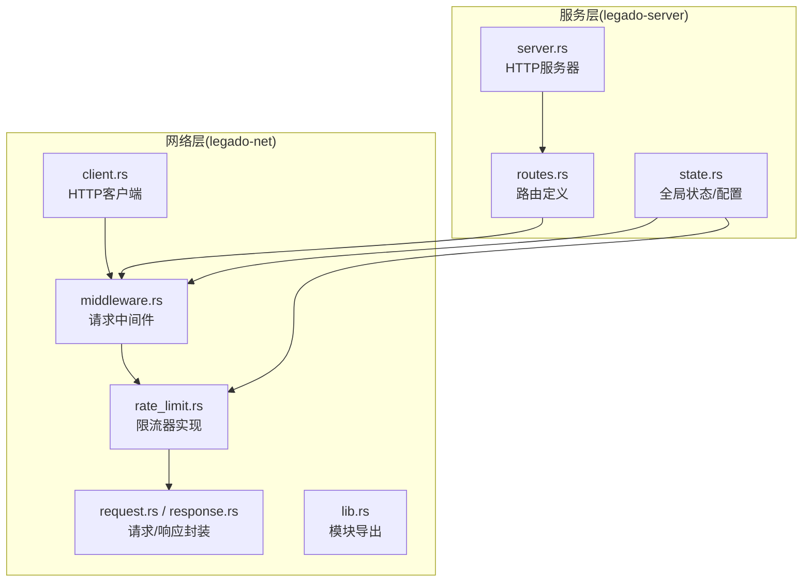
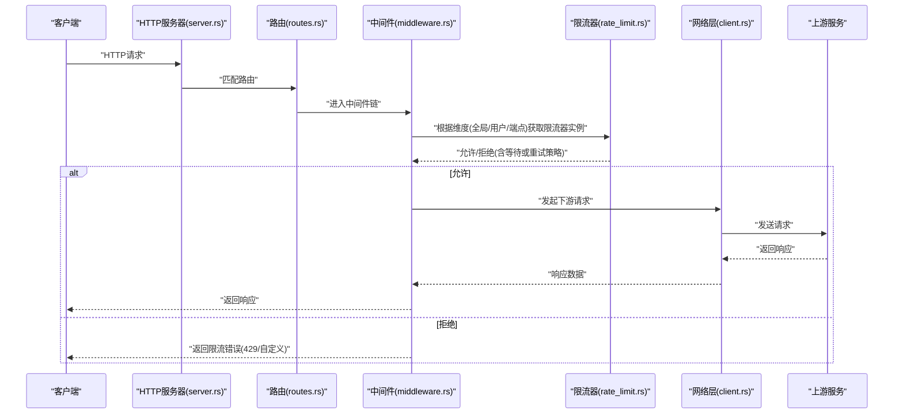
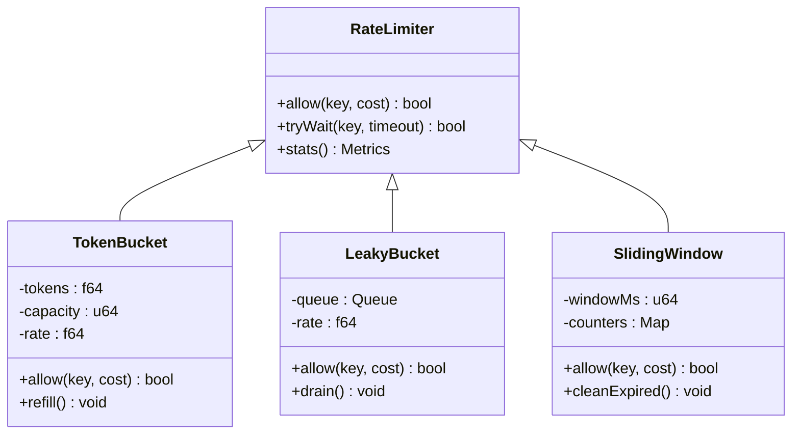
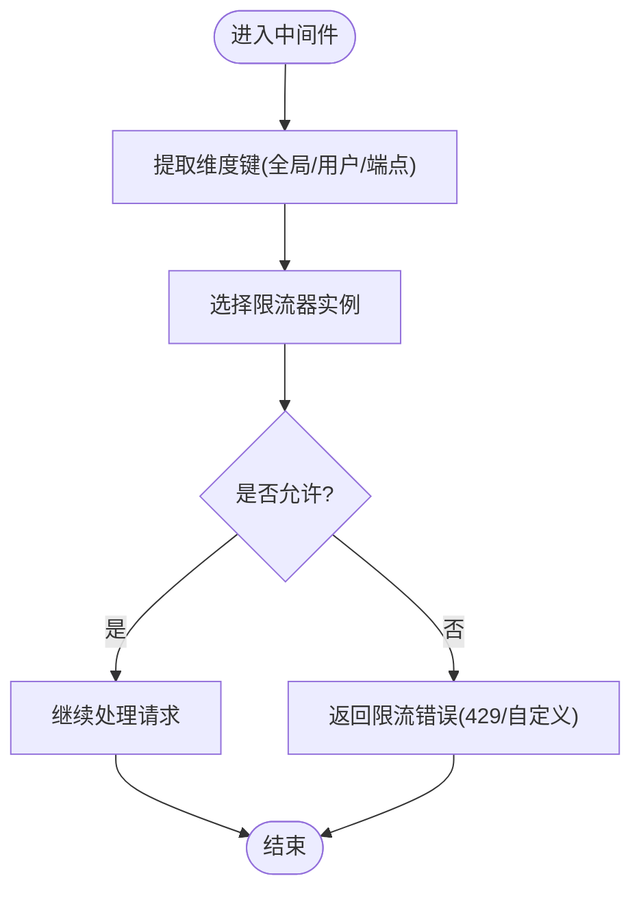
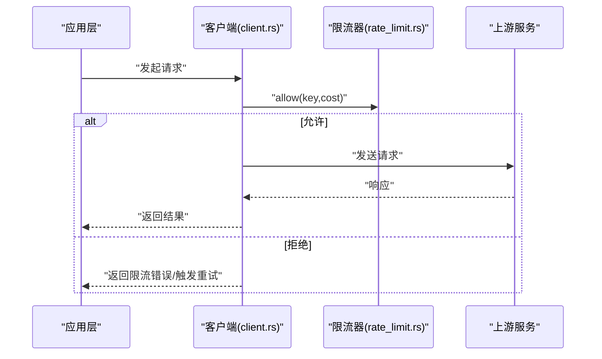
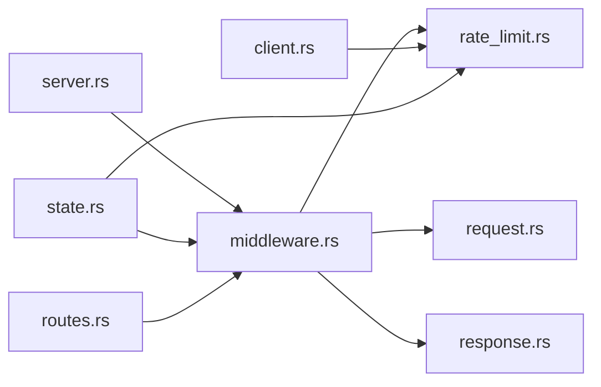

# 请求限流

<cite>
**本文引用的文件**   
- [rate_limit.rs](file://rust/legado-net/src/rate_limit.rs)
- [middleware.rs](file://rust/legado-net/src/middleware.rs)
- [client.rs](file://rust/legado-net/src/client.rs)
- [request.rs](file://rust/legado-net/src/request.rs)
- [response.rs](file://rust/legado-net/src/response.rs)
- [lib.rs](file://rust/legado-net/src/lib.rs)
- [server.rs](file://rust/legado-server/src/server.rs)
- [routes.rs](file://rust/legado-server/src/routes.rs)
- [state.rs](file://rust/legado-server/src/state.rs)
</cite>

## 目录
1. [简介](#简介)
2. [项目结构](#项目结构)
3. [核心组件](#核心组件)
4. [架构总览](#架构总览)
5. [详细组件分析](#详细组件分析)
6. [依赖关系分析](#依赖关系分析)
7. [性能考量](#性能考量)
8. [故障排查指南](#故障排查指南)
9. [结论](#结论)
10. [附录](#附录) 

## 简介
本文件围绕 Legado 项目中的“请求限流”能力进行系统化说明，覆盖算法原理（令牌桶、漏桶、滑动窗口）、配置参数（速率、突发容量、时间窗口）、策略维度（全局限流、用户级限流、API端点级限流），以及性能优化与监控指标（QPS、延迟分布、限流触发率）。文档以代码为依据，结合架构图与流程图帮助读者快速理解与落地。

## 项目结构
本项目在 Rust 网络层 lego-net 中实现限流核心逻辑，并通过中间件注入到 HTTP 服务器；同时提供客户端侧的限流控制，确保跨进程/跨模块的请求均受统一策略约束。

**图示来源** 
- [client.rs:1-200](file://rust/legado-net/src/client.rs#L1-L200)
- [middleware.rs:1-200](file://rust/legado-net/src/middleware.rs#L1-L200)
- [rate_limit.rs:1-200](file://rust/legado-net/src/rate_limit.rs#L1-L200)
- [request.rs:1-200](file://rust/legado-net/src/request.rs#L1-L200)
- [response.rs:1-200](file://rust/legado-net/src/response.rs#L1-L200)
- [lib.rs:1-200](file://rust/legado-net/src/lib.rs#L1-L200)
- [server.rs:1-200](file://rust/legado-server/src/server.rs#L1-L200)
- [routes.rs:1-200](file://rust/legado-server/src/routes.rs#L1-L200)
- [state.rs:1-200](file://rust/legado-server/src/state.rs#L1-L200)

**章节来源**
- [lib.rs:1-200](file://rust/legado-net/src/lib.rs#L1-L200)
- [server.rs:1-200](file://rust/legado-server/src/server.rs#L1-L200)
- [routes.rs:1-200](file://rust/legado-server/src/routes.rs#L1-L200)
- [state.rs:1-200](file://rust/legado-server/src/state.rs#L1-L200)

## 核心组件
- 限流器实现：位于网络层的 rate_limit.rs，提供多种限流算法与统一的访问接口。
- 中间件：middleware.rs 将限流器接入请求处理链路，按维度（全局/用户/端点）选择策略并执行判定。
- 客户端：client.rs 在发起外部请求前应用限流，避免上游过载。
- 请求/响应：request.rs 与 response.rs 承载上下文信息（如用户标识、端点路径），供限流器识别维度。
- 服务器与状态：server.rs、routes.rs、state.rs 负责加载限流配置、注册中间件与暴露统计指标。

**章节来源**
- [rate_limit.rs:1-200](file://rust/legado-net/src/rate_limit.rs#L1-L200)
- [middleware.rs:1-200](file://rust/legado-net/src/middleware.rs#L1-L200)
- [client.rs:1-200](file://rust/legado-net/src/client.rs#L1-L200)
- [request.rs:1-200](file://rust/legado-net/src/request.rs#L1-L200)
- [response.rs:1-200](file://rust/legado-net/src/response.rs#L1-L200)
- [server.rs:1-200](file://rust/legado-server/src/server.rs#L1-L200)
- [routes.rs:1-200](file://rust/legado-server/src/routes.rs#L1-L200)
- [state.rs:1-200](file://rust/legado-server/src/state.rs#L1-L200)

## 架构总览
下图展示一次带限流的 HTTP 请求从服务器到客户端的完整流程，包括中间件拦截、限流器判定、下游调用与结果返回。

**图示来源** 
- [server.rs:1-200](file://rust/legado-server/src/server.rs#L1-L200)
- [routes.rs:1-200](file://rust/legado-server/src/routes.rs#L1-L200)
- [middleware.rs:1-200](file://rust/legado-net/src/middleware.rs#L1-L200)
- [rate_limit.rs:1-200](file://rust/legado-net/src/rate_limit.rs#L1-L200)
- [client.rs:1-200](file://rust/legado-net/src/client.rs#L1-L200)

## 详细组件分析

### 限流器实现（rate_limit.rs）
- 目标：提供统一的限流接口，支持令牌桶、漏桶、滑动窗口等算法，并可按维度隔离计数与配额。
- 关键设计要点：
  - 令牌桶：维护令牌池与生成速率，允许突发容量；适合平滑流量且容忍短时峰值。
  - 漏桶：固定流出速率，入队请求；适合削峰填谷，保护下游稳定。
  - 滑动窗口：基于时间窗口的计数器，精确控制单位时间内的最大请求数；适合严格 QPS 限制。
  - 维度键：支持全局键、用户键（如用户ID/Token）、端点键（如方法+路径），可组合使用。
  - 并发安全：在高并发下保证原子性与一致性，避免超卖。
  - 扩展性：通过策略接口抽象不同算法，便于按需切换与混合。

**图示来源** 
- [rate_limit.rs:1-200](file://rust/legado-net/src/rate_limit.rs#L1-L200)

**章节来源**
- [rate_limit.rs:1-200](file://rust/legado-net/src/rate_limit.rs#L1-L200)

### 中间件集成（middleware.rs）
- 职责：在请求进入业务逻辑前，依据请求上下文提取维度键，选择对应限流器实例，执行允许/拒绝决策。
- 关键点：
  - 维度解析：从请求头/路径/认证信息中提取用户ID、端点标识等。
  - 策略选择：根据路由或配置决定使用全局/用户/端点限流器。
  - 行为策略：拒绝时返回标准错误码（如 429），或采用退避/排队策略。
  - 指标上报：记录允许/拒绝计数、延迟分位等，用于监控与告警。

**图示来源** 
- [middleware.rs:1-200](file://rust/legado-net/src/middleware.rs#L1-L200)

**章节来源**
- [middleware.rs:1-200](file://rust/legado-net/src/middleware.rs#L1-L200)

### 客户端限流（client.rs）
- 职责：在发起外部请求前应用限流，避免对上游造成瞬时压力。
- 关键点：
  - 预检查：在发送前调用限流器判断是否允许。
  - 重试与退避：被拒绝时可按指数退避策略重试或降级。
  - 上下文透传：携带用户/端点维度信息，确保与服务器侧一致。

**图示来源** 
- [client.rs:1-200](file://rust/legado-net/src/client.rs#L1-L200)
- [rate_limit.rs:1-200](file://rust/legado-net/src/rate_limit.rs#L1-L200)

**章节来源**
- [client.rs:1-200](file://rust/legado-net/src/client.rs#L1-L200)

### 请求/响应封装（request.rs / response.rs）
- 作用：为限流器提供维度键来源（如用户ID、端点路径、方法），并在响应中携带限流相关头（如剩余配额、重试间隔）。
- 关键点：
  - 请求上下文：标准化维度键字段，便于中间件解析。
  - 响应头：包含 X-RateLimit-* 系列头，便于客户端自适应。

**章节来源**
- [request.rs:1-200](file://rust/legado-net/src/request.rs#L1-L200)
- [response.rs:1-200](file://rust/legado-net/src/response.rs#L1-L200)

### 服务器与状态（server.rs / routes.rs / state.rs）
- 职责：加载限流配置、初始化限流器实例、注册中间件、暴露监控端点。
- 关键点：
  - 配置加载：从配置文件或环境变量读取速率、突发容量、时间窗口等参数。
  - 实例化：按维度创建限流器实例，绑定到路由或全局。
  - 监控：提供统计接口（QPS、延迟分布、限流触发率）。

**章节来源**
- [server.rs:1-200](file://rust/legado-server/src/server.rs#L1-L200)
- [routes.rs:1-200](file://rust/legado-server/src/routes.rs#L1-L200)
- [state.rs:1-200](file://rust/legado-server/src/state.rs#L1-L200)

## 依赖关系分析
- 模块内聚：rate_limit.rs 专注算法实现，middleware.rs 专注策略编排，client.rs 专注调用侧控制，职责清晰。
- 耦合点：
  - middleware.rs 依赖 request/response 以提取维度键与设置响应头。
  - server/state 负责配置注入与实例管理。
  - client.rs 与 rate_limit.rs 直接交互，确保出站请求受控。
- 潜在循环：通过接口抽象避免循环依赖，保持单向依赖。

**图示来源** 
- [middleware.rs:1-200](file://rust/legado-net/src/middleware.rs#L1-L200)
- [rate_limit.rs:1-200](file://rust/legado-net/src/rate_limit.rs#L1-L200)
- [client.rs:1-200](file://rust/legado-net/src/client.rs#L1-L200)
- [request.rs:1-200](file://rust/legado-net/src/request.rs#L1-L200)
- [response.rs:1-200](file://rust/legado-net/src/response.rs#L1-L200)
- [server.rs:1-200](file://rust/legado-server/src/server.rs#L1-L200)
- [routes.rs:1-200](file://rust/legado-server/src/routes.rs#L1-L200)
- [state.rs:1-200](file://rust/legado-server/src/state.rs#L1-L200)

**章节来源**
- [middleware.rs:1-200](file://rust/legado-net/src/middleware.rs#L1-L200)
- [rate_limit.rs:1-200](file://rust/legado-net/src/rate_limit.rs#L1-L200)
- [client.rs:1-200](file://rust/legado-net/src/client.rs#L1-L200)
- [request.rs:1-200](file://rust/legado-net/src/request.rs#L1-L200)
- [response.rs:1-200](file://rust/legado-net/src/response.rs#L1-L200)
- [server.rs:1-200](file://rust/legado-server/src/server.rs#L1-L200)
- [routes.rs:1-200](file://rust/legado-server/src/routes.rs#L1-L200)
- [state.rs:1-200](file://rust/legado-server/src/state.rs#L1-L200)

## 性能考量
- 内存使用优化：
  - 滑动窗口：定期清理过期条目，避免 Map 无限增长。
  - 令牌桶/漏桶：使用原子变量与无锁队列减少锁竞争。
  - 对象复用：复用请求/响应上下文对象，降低分配开销。
- CPU利用率控制：
  - 批量统计：聚合指标上报频率，避免高频 I/O。
  - 惰性计算：仅在需要时刷新令牌或清理窗口。
  - 并行度控制：限制并发任务数量，防止线程风暴。
- 监控与调优：
  - 指标：QPS、P95/P99 延迟、限流触发率、队列长度。
  - 阈值：动态调整速率与突发容量，基于历史负载自适应。

[本节为通用指导，不直接分析具体文件]

## 故障排查指南
- 常见问题：
  - 误判限流：检查维度键是否正确提取（用户ID、端点路径）。
  - 配置不一致：确认客户端与服务端限流器参数一致（速率、突发容量、时间窗口）。
  - 指标异常：核对统计上报频率与采样窗口。
- 定位步骤：
  - 查看中间件日志，确认进入/退出分支。
  - 检查限流器实例状态（令牌数、队列长度、窗口计数）。
  - 对比上下游延迟与错误码，区分网络问题与限流问题。
- 恢复建议：
  - 临时放宽限流阈值，观察系统恢复情况。
  - 启用降级策略（如缓存命中优先、非关键请求丢弃）。

**章节来源**
- [middleware.rs:1-200](file://rust/legado-net/src/middleware.rs#L1-L200)
- [rate_limit.rs:1-200](file://rust/legado-net/src/rate_limit.rs#L1-L200)
- [client.rs:1-200](file://rust/legado-net/src/client.rs#L1-L200)

## 结论
Legado 的限流体系通过清晰的模块划分与灵活的策略抽象，实现了多算法、多维度、高可用的请求控制。结合完善的监控与调优手段，可在复杂场景下保障系统稳定性与用户体验。

[本节为总结，不直接分析具体文件]

## 附录

### 限流算法选择与应用场景
- 令牌桶：适用于允许短时突发的场景（如搜索、推荐），兼顾吞吐与公平。
- 漏桶：适用于需稳定出流的场景（如写操作、批处理），保护下游资源。
- 滑动窗口：适用于严格 QPS 限制的场景（如计费、配额），精确控制。

[本节为概念性内容，不直接分析具体文件]

### 配置参数说明
- 速率限制：每秒/分钟允许的最大请求数。
- 突发容量：令牌桶的最大令牌数，允许短时超过平均速率。
- 时间窗口：滑动窗口的时长（毫秒/秒），影响计数精度与内存占用。
- 维度键：全局/用户/端点的标识规则，确保隔离与公平。

[本节为概念性内容，不直接分析具体文件]

### 监控指标示例
- QPS 统计：总请求数、允许数、拒绝数、拒绝率。
- 延迟分布：P50/P90/P95/P99 延迟，识别尾部延迟。
- 限流触发率：各维度下的触发比例，定位热点端点/用户。

[本节为概念性内容，不直接分析具体文件]