# 网络层

<cite>
**本文引用的文件**   
- [lib.rs](file://rust/legado-net/src/lib.rs)
- [client.rs](file://rust/legado-net/src/client.rs)
- [request.rs](file://rust/legado-net/src/request.rs)
- [response.rs](file://rust/legado-net/src/response.rs)
- [middleware.rs](file://rust/legado-net/src/middleware.rs)
- [retry.rs](file://rust/legado-net/src/retry.rs)
- [proxy.rs](file://rust/legado-net/src/proxy.rs)
- [ssl_config.rs](file://rust/legado-net/src/ssl_config.rs)
- [cookie_store.rs](file://rust/legado-net/src/cookie_store.rs)
- [rate_limit.rs](file://rust/legado-net/src/rate_limit.rs)
- [verification.rs](file://rust/legado-net/src/verification.rs)
- [user_agent.rs](file://rust/legado-net/src/user_agent.rs)
- [url_template.rs](file://rust/legado-net/src/url_template.rs)
- [cover.rs](file://rust/legado-net/src/cover.rs)
- [remote_book.rs](file://rust/legado-net/src/remote_book.rs)
- [rss.rs](file://rust/legado-net/src/rss.rs)
- [direct_link_upload.rs](file://rust/legado-net/src/direct_link_upload.rs)
- [rule_update_client.rs](file://rust/legado-net/src/rule_update_client.rs)
- [source_checker.rs](file://rust/legado-net/src/source_checker.rs)
- [webdav.rs](file://rust/legado-net/src/webdav.rs)
- [quic.rs](file://rust/legado-net/src/quic.rs)
- [custom_hosts.rs](file://rust/legado-net/src/custom_hosts.rs)
- [net_api.rs](file://rust/legado-ffi/src/api/net_api.rs)
- [quic_api.rs](file://rust/legado-ffi/src/api/quic_api.rs)
- [tts_speak_api.rs](file://rust/legado-ffi/src/api/tts_speak_api.rs)
- [tts_speak.rs](file://rust/legado-core/src/tts_speak.rs)
- [book_api.dart](file://flutter_legado/lib/src/services/book_api.dart)
- [rust_api.dart](file://flutter_legado/lib/src/services/rust_api.dart)
- [ffi.dart](file://flutter_legado/lib/src/bridge/ffi/ffi.dart)
- [other_settings_screen.dart](file://flutter_legado/lib/src/screens/other_settings_screen.dart)
</cite>

## 更新摘要
**所做更改**   
- 新增自定义 hosts 映射功能，支持域名到 IP 地址的覆盖解析
- 实现 JSON 配置系统，支持单 IP 字符串和 IP 数组格式
- 集成 FFI 桥接层，通过 setCustomHosts 方法暴露给上层应用
- 添加 Flutter UI 界面，提供可视化编辑和验证功能
- 实现即时生效机制，全局映射实时读取，无需重启客户端

## 目录
1. [简介](#简介)
2. [项目结构](#项目结构)
3. [核心组件](#核心组件)
4. [架构总览](#架构总览)
5. [详细组件分析](#详细组件分析)
6. [QUIC/HTTP3协议支持](#quichttp3协议支持)
7. [自定义 Hosts 映射](#自定义-hosts-映射)
8. [BookApi接口与UI集成](#bookapi接口与ui集成)
9. [依赖关系分析](#依赖关系分析)
10. [性能考量](#性能考量)
11. [故障排除指南](#故障排除指南)
12. [结论](#结论)
13. [附录](#附录)

## 简介
本文件面向Legado项目的网络层，系统性梳理HTTP客户端实现、请求构建与响应解析、错误处理机制；详解中间件体系（重试、超时、代理、SSL配置）；阐述Cookie管理与会话保持（自动登录、状态同步）；说明并发请求处理（队列、限流、资源管理）；并提供调试工具与使用示例（日志、抓包、性能监控），以及优化建议与排障指南。文档力求兼顾技术深度与可读性，帮助开发者快速理解并高效扩展网络能力。

**最新更新**：网络层新增了get_raw()方法，专门用于原始二进制数据获取，避免了UTF-8转换带来的有损问题，特别适用于TTS音频下载等二进制内容处理场景。同时增强了QUIC/HTTP3协议支持，并通过BookApi接口向UI层暴露了netIsQuicEnabled()和netSetQuicEnabled(bool)方法，允许用户动态控制QUIC传输开关。**新增自定义 hosts 映射功能**，支持域名到IP地址的覆盖解析，为网络调试和特殊网络环境提供了强大的DNS覆盖能力。

## 项目结构
网络层位于Rust模块legado-net中，采用模块化设计：以client为核心入口，围绕request/response数据模型，通过middleware链式组装能力（重试、代理、SSL、UA、验证等），配合cookie_store进行会话持久化，rate_limit控制并发与速率，verification与user_agent提供通用增强，url_template支持动态URL生成，cover/rss/direct_link_upload/webdav等子模块封装特定业务场景的HTTP交互。新增的quic.rs模块提供QUIC/HTTP3协议支持，custom_hosts.rs模块提供自定义DNS解析覆盖，并通过legado-ffi模块暴露给Flutter层。

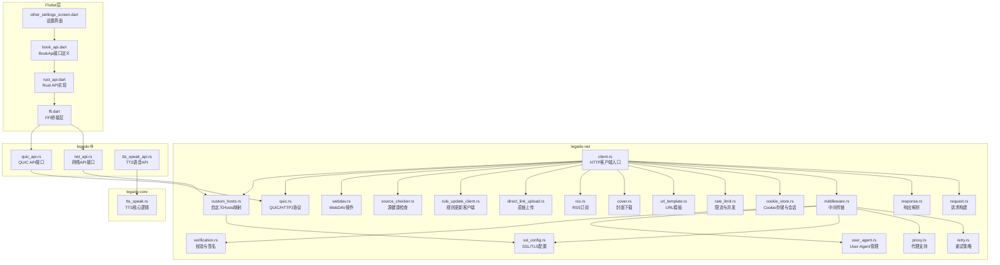

**图表来源** 
- [client.rs:1-100](file://rust/legado-net/src/client.rs#L1-L100)
- [middleware.rs:1-100](file://rust/legado-net/src/middleware.rs#L1-L100)
- [retry.rs:1-100](file://rust/legado-net/src/retry.rs#L1-L100)
- [proxy.rs:1-100](file://rust/legado-net/src/proxy.rs#L1-L100)
- [ssl_config.rs:1-100](file://rust/legado-net/src/ssl_config.rs#L1-L100)
- [cookie_store.rs:1-100](file://rust/legado-net/src/cookie_store.rs#L1-L100)
- [rate_limit.rs:1-100](file://rust/legado-net/src/rate_limit.rs#L1-L100)
- [verification.rs:1-100](file://rust/legado-net/src/verification.rs#L1-L100)
- [user_agent.rs:1-100](file://rust/legado-net/src/user_agent.rs#L1-L100)
- [url_template.rs:1-100](file://rust/legado-net/src/url_template.rs#L1-L100)
- [cover.rs:1-100](file://rust/legado-net/src/cover.rs#L1-L100)
- [rss.rs:1-100](file://rust/legado-net/src/rss.rs#L1-L100)
- [direct_link_upload.rs:1-100](file://rust/legado-net/src/direct_link_upload.rs#L1-L100)
- [rule_update_client.rs:1-100](file://rust/legado-net/src/rule_update_client.rs#L1-L100)
- [source_checker.rs:1-100](file://rust/legado-net/src/source_checker.rs#L1-L100)
- [webdav.rs:1-100](file://rust/legado-net/src/webdav.rs#L1-L100)
- [quic.rs:1-100](file://rust/legado-net/src/quic.rs#L1-L100)
- [custom_hosts.rs:1-100](file://rust/legado-net/src/custom_hosts.rs#L1-L100)
- [net_api.rs:1-100](file://rust/legado-ffi/src/api/net_api.rs#L1-L100)
- [quic_api.rs:1-100](file://rust/legado-ffi/src/api/quic_api.rs#L1-L100)
- [tts_speak_api.rs:1-100](file://rust/legado-ffi/src/api/tts_speak_api.rs#L1-L100)
- [tts_speak.rs:1-100](file://rust/legado-core/src/tts_speak.rs#L1-L100)
- [book_api.dart:410-420](file://flutter_legado/lib/src/services/book_api.dart#L410-L420)
- [rust_api.dart:960-970](file://flutter_legado/lib/src/services/rust_api.dart#L960-L970)
- [ffi.dart:985-995](file://flutter_legado/lib/src/bridge/ffi/ffi.dart#L985-L995)
- [other_settings_screen.dart:70-80](file://flutter_legado/lib/src/screens/other_settings_screen.dart#L70-L80)

**章节来源**
- [lib.rs:1-100](file://rust/legado-net/src/lib.rs#L1-L100)

## 核心组件
- HTTP客户端（client.rs）：统一发起请求的入口，负责组合中间件、管理连接池、超时与重试、Cookie注入与持久化、限流与并发控制。新增get_raw()方法专门处理原始二进制数据。
- 请求构建（request.rs）：抽象HTTP请求对象，支持方法、URL、头部、Body、查询参数、模板变量填充。
- 响应解析（response.rs）：统一响应体与元数据，提供JSON、文本、二进制、分块读取与错误映射。新增LegadoRawResponse结构体支持原始字节数据。
- 中间件链（middleware.rs）：可插拔的请求/响应处理管线，按序执行拦截逻辑，支持短路返回与异常透传。
- 重试策略（retry.rs）：基于指数退避、抖动、条件判断的重试控制器，支持最大次数与间隔上限。
- 代理支持（proxy.rs）：HTTP/HTTPS/SOCKS代理配置与应用，支持认证与域名绕过。
- SSL配置（ssl_config.rs）：TLS版本、证书信任、自定义CA、加密套件选择。
- Cookie管理（cookie_store.rs）：跨请求会话保持、自动登录、域路径匹配、过期清理。
- 限流与并发（rate_limit.rs）：令牌桶或滑动窗口限流，限制QPS与并发度，避免服务端过载。
- 校验与签名（verification.rs）：请求签名、HMAC、时间戳防重放、内容摘要。
- User-Agent（user_agent.rs）：设备指纹、版本信息、随机化策略。
- URL模板（url_template.rs）：变量替换、路径拼接、编码处理。
- QUIC/HTTP3支持（quic.rs）：现代网络协议支持，提供更优的连接复用和延迟性能。
- **自定义Hosts映射（custom_hosts.rs）**：域名到IP地址的覆盖解析，支持JSON配置、即时生效、系统DNS回退。
- TTS语音合成（tts_speak_api.rs, tts_speak.rs）：完整的TTS语音合成管线，使用get_raw()方法获取音频二进制数据。
- 网络API接口（net_api.rs）：通过FFI暴露自定义hosts映射功能给上层应用。
- QUIC API接口（quic_api.rs）：通过FFI暴露QUIC功能给上层应用。
- BookApi接口（book_api.dart）：Flutter层统一的API定义，包含QUIC开关控制和自定义hosts设置方法。
- Rust API实现（rust_api.dart）：BookApi接口的具体实现，调用FFI层。
- FFI桥接层（ffi.dart）：Dart与Rust之间的桥接，提供setCustomHosts等方法。
- 业务子模块：cover/rss/direct_link_upload/rule_update_client/source_checker/webdav分别封装对应场景的HTTP调用流程。

**章节来源**
- [client.rs:1-200](file://rust/legado-net/src/client.rs#L1-L200)
- [request.rs:1-200](file://rust/legado-net/src/request.rs#L1-L200)
- [response.rs:1-200](file://rust/legado-net/src/response.rs#L1-L200)
- [middleware.rs:1-200](file://rust/legado-net/src/middleware.rs#L1-L200)
- [retry.rs:1-200](file://rust/legado-net/src/retry.rs#L1-L200)
- [proxy.rs:1-200](file://rust/legado-net/src/proxy.rs#L1-L200)
- [ssl_config.rs:1-200](file://rust/legado-net/src/ssl_config.rs#L1-L200)
- [cookie_store.rs:1-200](file://rust/legado-net/src/cookie_store.rs#L1-L200)
- [rate_limit.rs:1-200](file://rust/legado-net/src/rate_limit.rs#L1-L200)
- [verification.rs:1-200](file://rust/legado-net/src/verification.rs#L1-L200)
- [user_agent.rs:1-200](file://rust/legado-net/src/user_agent.rs#L1-L200)
- [url_template.rs:1-200](file://rust/legado-net/src/url_template.rs#L1-L200)
- [quic.rs:1-200](file://rust/legado-net/src/quic.rs#L1-L200)
- [custom_hosts.rs:1-200](file://rust/legado-net/src/custom_hosts.rs#L1-L200)
- [net_api.rs:1-114](file://rust/legado-ffi/src/api/net_api.rs#L1-L114)
- [quic_api.rs:1-200](file://rust/legado-ffi/src/api/quic_api.rs#L1-L200)
- [tts_speak_api.rs:1-142](file://rust/legado-ffi/src/api/tts_speak_api.rs#L1-L142)
- [tts_speak.rs:1-498](file://rust/legado-core/src/tts_speak.rs#L1-L498)
- [book_api.dart:640-660](file://flutter_legado/lib/src/services/book_api.dart#L640-L660)
- [rust_api.dart:1496-1497](file://flutter_legado/lib/src/services/rust_api.dart#L1496-L1497)
- [ffi.dart:1058-1059](file://flutter_legado/lib/src/bridge/ffi/ffi.dart#L1058-L1059)
- [cover.rs:1-200](file://rust/legado-net/src/cover.rs#L1-L200)
- [rss.rs:1-200](file://rust/legado-net/src/rss.rs#L1-L200)
- [direct_link_upload.rs:1-200](file://rust/legado-net/src/direct_link_upload.rs#L1-L200)
- [rule_update_client.rs:1-200](file://rust/legado-net/src/rule_update_client.rs#L1-L200)
- [source_checker.rs:1-200](file://rust/legado-net/src/source_checker.rs#L1-L200)
- [webdav.rs:1-200](file://rust/legado-net/src/webdav.rs#L1-L200)

## 架构总览
下图展示一次典型HTTP请求从应用层到网络层的完整流转，包括中间件链的执行顺序、重试与代理的应用、Cookie注入与响应解析，以及QUIC/HTTP3协议的可选路径。同时展示了QUIC开关控制的完整调用链路、自定义hosts映射的工作流程和TTS语音合成的二进制数据处理流程。

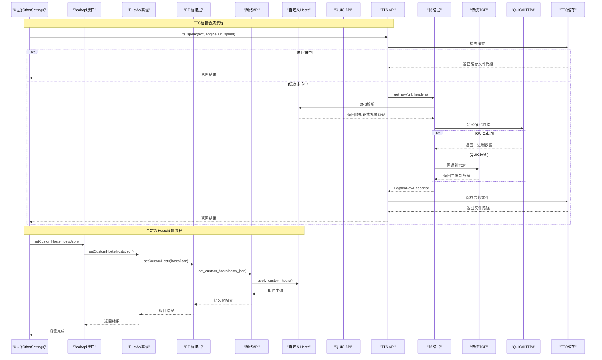

**图表来源**
- [other_settings_screen.dart:880-918](file://flutter_legado/lib/src/screens/other_settings_screen.dart#L880-L918)
- [other_settings_screen.dart:1733-1793](file://flutter_legado/lib/src/screens/other_settings_screen.dart#L1733-L1793)
- [book_api.dart:648-648](file://flutter_legado/lib/src/services/book_api.dart#L648-L648)
- [rust_api.dart:1496-1497](file://flutter_legado/lib/src/services/rust_api.dart#L1496-L1497)
- [ffi.dart:1058-1059](file://flutter_legado/lib/src/bridge/ffi/ffi.dart#L1058-L1059)
- [net_api.rs:22-37](file://rust/legado-ffi/src/api/net_api.rs#L22-L37)
- [custom_hosts.rs:41-80](file://rust/legado-net/src/custom_hosts.rs#L41-L80)
- [quic_api.rs:190-212](file://rust/legado-ffi/src/api/quic_api.rs#L190-L212)
- [tts_speak_api.rs:55-75](file://rust/legado-ffi/src/api/tts_speak_api.rs#L55-L75)
- [tts_speak.rs:202-277](file://rust/legado-core/src/tts_speak.rs#L202-L277)

## 详细组件分析

### HTTP客户端与请求构建
- 客户端职责：组装中间件、管理连接池、超时控制、重试调度、Cookie注入、限流与并发控制、错误分类与上报。
- 请求构建：支持GET/POST/PUT/DELETE等方法，Header键值对、Body字节流或字符串、Query参数、URL模板变量替换。
- 响应解析：统一返回结构，包含状态码、Headers、Body（文本/JSON/二进制）、错误原因、耗时统计。
- **新增get_raw()方法**：专门用于获取原始二进制数据，避免UTF-8转换开销，适用于TTS音频下载等场景。

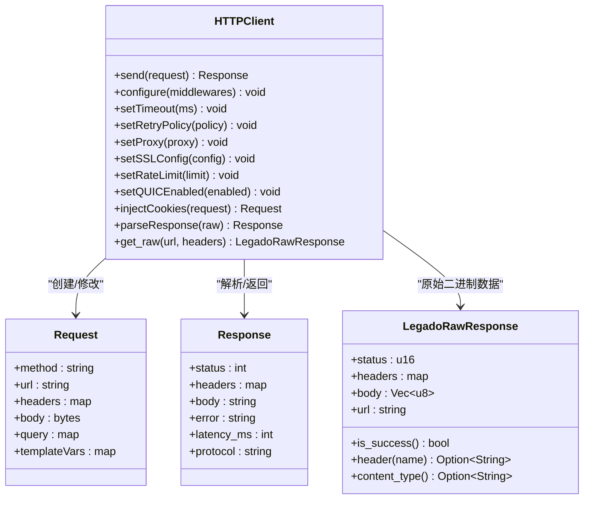

**图表来源**
- [client.rs:363-406](file://rust/legado-net/src/client.rs#L363-L406)
- [response.rs:40-72](file://rust/legado-net/src/response.rs#L40-L72)

**章节来源**
- [client.rs:1-200](file://rust/legado-net/src/client.rs#L1-L200)
- [request.rs:1-200](file://rust/legado-net/src/request.rs#L1-L200)
- [response.rs:1-200](file://rust/legado-net/src/response.rs#L1-L200)

### 中间件机制与重试策略
- 中间件链：按注册顺序执行，支持前置拦截（如UA注入、签名计算）与后置处理（如响应缓存、错误转换）。
- 重试策略：指数退避+抖动，支持条件重试（如网络错误、5xx状态码），最大重试次数与间隔上限保护。


**图表来源**
- [middleware.rs:1-200](file://rust/legado-net/src/middleware.rs#L1-L200)
- [retry.rs:1-200](file://rust/legado-net/src/retry.rs#L1-L200)

**章节来源**
- [middleware.rs:1-200](file://rust/legado-net/src/middleware.rs#L1-L200)
- [retry.rs:1-200](file://rust/legado-net/src/retry.rs#L1-L200)

### 代理支持与SSL配置
- 代理：支持HTTP/HTTPS/SOCKS，可配置认证、域名白名单、直连跳过列表。
- SSL：支持TLS版本选择、自定义CA证书、证书校验开关、加密套件优先级。

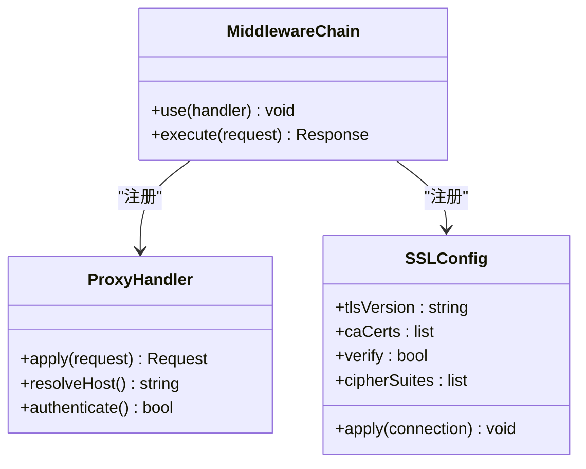

**图表来源**
- [proxy.rs:1-200](file://rust/legado-net/src/proxy.rs#L1-L200)
- [ssl_config.rs:1-200](file://rust/legado-net/src/ssl_config.rs#L1-L200)
- [middleware.rs:1-200](file://rust/legado-net/src/middleware.rs#L1-L200)

**章节来源**
- [proxy.rs:1-200](file://rust/legado-net/src/proxy.rs#L1-L200)
- [ssl_config.rs:1-200](file://rust/legado-net/src/ssl_config.rs#L1-L200)

### Cookie管理与会话保持
- 自动登录：在鉴权成功后持久化Token/Cookie，后续请求自动注入。
- 状态同步：跨请求共享CookieJar，支持域/路径匹配、过期清理、安全标志。
- 生命周期：会话初始化、刷新、失效回收，支持多账户隔离。

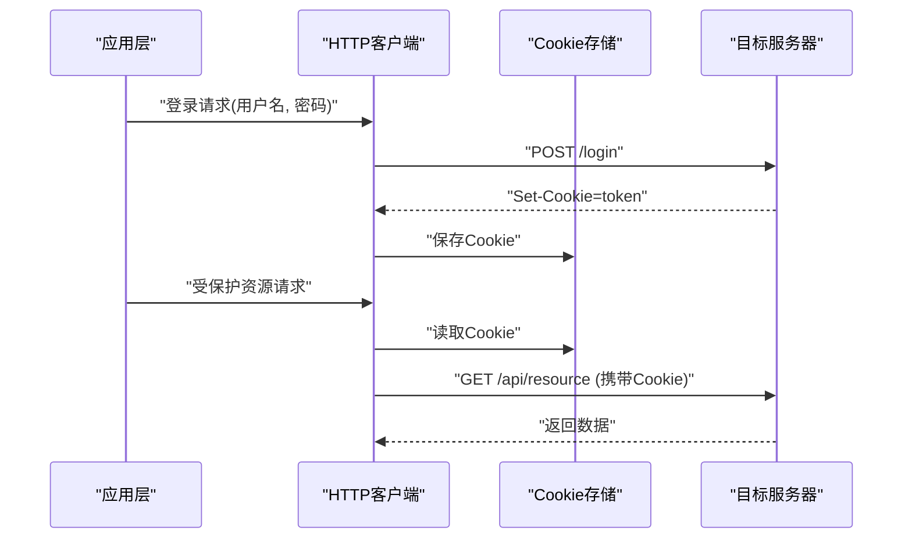

**图表来源**
- [cookie_store.rs:1-200](file://rust/legado-net/src/cookie_store.rs#L1-L200)
- [client.rs:1-200](file://rust/legado-net/src/client.rs#L1-L200)

**章节来源**
- [cookie_store.rs:1-200](file://rust/legado-net/src/cookie_store.rs#L1-L200)

### 并发请求处理：队列、限流与资源管理
- 请求队列：异步任务入队，按优先级调度，支持取消与超时。
- 限流控制：令牌桶/滑动窗口，限制每秒请求数与并发度，避免触发服务端限制。
- 资源管理：连接池复用、内存缓冲、错误回退与熔断。

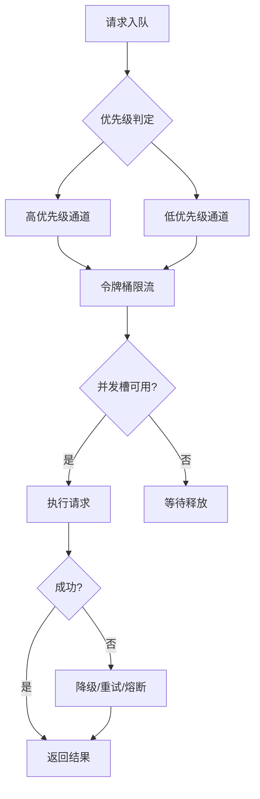

**图表来源**
- [rate_limit.rs:1-200](file://rust/legado-net/src/rate_limit.rs#L1-L200)
- [client.rs:1-200](file://rust/legado-net/src/client.rs#L1-L200)

**章节来源**
- [rate_limit.rs:1-200](file://rust/legado-net/src/rate_limit.rs#L1-L200)

### 二进制数据处理与TTS语音合成
- **get_raw()方法**：直接读取resp.bytes()，不经过UTF-8文本解码，避免二进制音频被有损转换。
- **LegadoRawResponse结构体**：专门处理原始字节数据，包含status、headers、body(Vec<u8>)、url字段。
- **collect_raw_response方法**：收集二进制响应数据并保存Cookie，确保Cookie持久化正常工作。
- **TTS语音合成管线**：完整的TTS语音合成流程，包括URL模板替换、HTTP拉取音频二进制、Content-Type校验、MD5命名本地缓存。

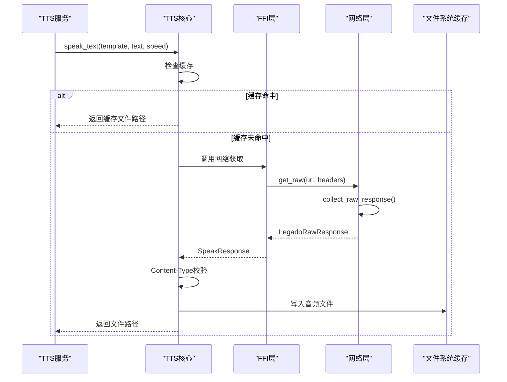

**图表来源**
- [client.rs:363-406](file://rust/legado-net/src/client.rs#L363-L406)
- [client.rs:654-686](file://rust/legado-net/src/client.rs#L654-L686)
- [response.rs:40-72](file://rust/legado-net/src/response.rs#L40-L72)
- [tts_speak_api.rs:55-75](file://rust/legado-ffi/src/api/tts_speak_api.rs#L55-L75)
- [tts_speak.rs:202-277](file://rust/legado-core/src/tts_speak.rs#L202-L277)

**章节来源**
- [client.rs:363-406](file://rust/legado-net/src/client.rs#L363-L406)
- [client.rs:654-686](file://rust/legado-net/src/client.rs#L654-L686)
- [response.rs:40-72](file://rust/legado-net/src/response.rs#L40-L72)
- [tts_speak_api.rs:1-142](file://rust/legado-ffi/src/api/tts_speak_api.rs#L1-L142)
- [tts_speak.rs:1-498](file://rust/legado-core/src/tts_speak.rs#L1-L498)

### 业务子模块概览
- 封面下载（cover.rs）：批量获取书籍封面，支持缩略图尺寸、缓存策略。
- RSS订阅（rss.rs）：拉取RSS源、解析条目、增量更新。
- 直链上传（direct_link_upload.rs）：文件上传至第三方服务，断点续传与进度回调。
- 规则更新客户端（rule_update_client.rs）：远程规则包下载与校验。
- 源健康检查（source_checker.rs）：定时探测源可用性，记录延迟与错误率。
- WebDAV（webdav.rs）：远程文件浏览、上传、删除等操作。

**章节来源**
- [cover.rs:1-200](file://rust/legado-net/src/cover.rs#L1-L200)
- [rss.rs:1-200](file://rust/legado-net/src/rss.rs#L1-L200)
- [direct_link_upload.rs:1-200](file://rust/legado-net/src/direct_link_upload.rs#L1-L200)
- [rule_update_client.rs:1-200](file://rust/legado-net/src/rule_update_client.rs#L1-L200)
- [source_checker.rs:1-200](file://rust/legado-net/src/source_checker.rs#L1-L200)
- [webdav.rs:1-200](file://rust/legado-net/src/webdav.rs#L1-L200)

## QUIC/HTTP3协议支持

### 协议特性与优势
QUIC（Quick UDP Internet Connections）是基于UDP的现代传输协议，为HTTP/3提供底层支持。相比传统TCP HTTP，QUIC具有以下优势：

- **更快的连接建立**：0-RTT连接恢复，减少握手延迟
- **更好的连接复用**：多路复用避免队头阻塞
- **改进的移动网络支持**：连接迁移无需重新握手
- **增强的安全性**：内置TLS 1.3加密
- **更好的拥塞控制**：更智能的网络拥塞避免算法

### 配置与启用
QUIC/HTTP3支持可通过客户端配置启用，现在通过BookApi接口向UI层暴露：

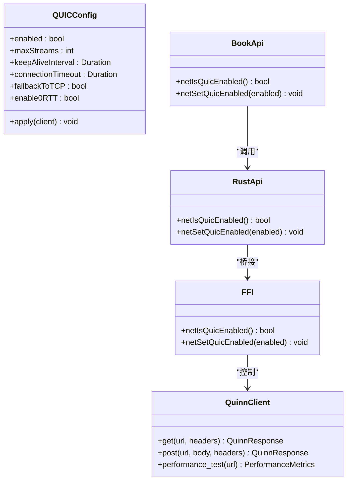

**图表来源**
- [quic.rs:1-200](file://rust/legado-net/src/quic.rs#L1-L200)
- [book_api.dart:415-420](file://flutter_legado/lib/src/services/book_api.dart#L415-L420)
- [rust_api.dart:960-970](file://flutter_legado/lib/src/services/rust_api.dart#L960-L970)
- [ffi.dart:985-995](file://flutter_legado/lib/src/bridge/ffi/ffi.dart#L985-L995)

### 连接协商与回退机制
系统支持智能协议协商，优先尝试QUIC连接，失败时自动回退到传统TCP：

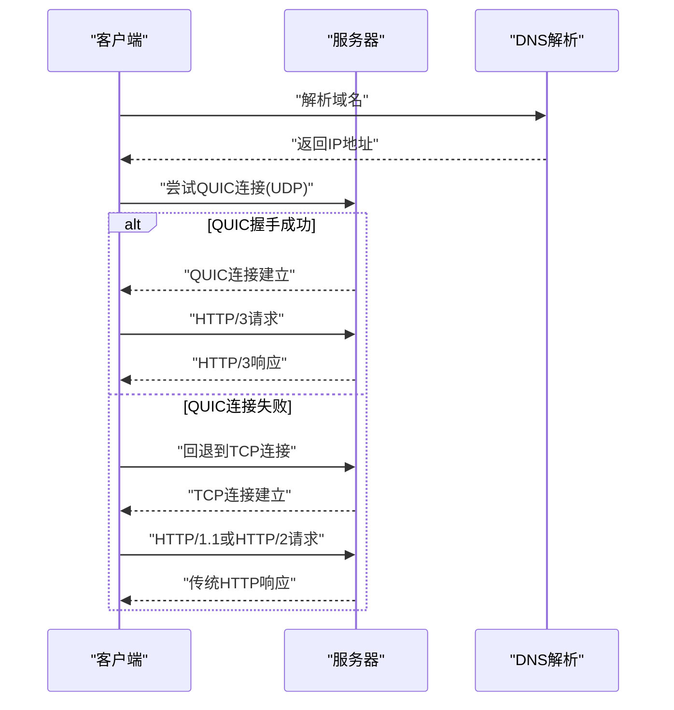

**图表来源**
- [quic.rs:1-200](file://rust/legado-net/src/quic.rs#L1-L200)

### 性能优化配置
针对QUIC协议的性能优化建议：

- **连接池大小**：根据并发需求调整，建议设置为CPU核心数的2倍
- **流数量限制**：合理设置最大并发流数，避免过多流导致资源竞争
- **保活间隔**：配置合适的Keep-Alive间隔，平衡连接复用与资源占用
- **超时设置**：区分连接超时、读写超时，适应不同网络环境
- **0-RTT启用**：在安全允许的情况下启用0-RTT，提升重复请求性能

**章节来源**
- [quic.rs:1-200](file://rust/legado-net/src/quic.rs#L1-L200)

## 自定义 Hosts 映射

### 功能概述
自定义 hosts 映射功能允许应用程序将特定域名映射到指定的IP地址，从而覆盖系统的DNS解析。这一功能对于网络调试、开发环境配置、企业内网访问等场景非常有用。

### 核心特性
- **JSON配置格式**：支持`{"域名":"IP"}`和`{"域名":["IP1","IP2"]}`两种格式
- **即时生效**：配置变更后立即应用到所有网络连接，无需重启应用
- **系统DNS回退**：未匹配的域名继续使用系统DNS解析
- **持久化存储**：配置保存到数据库，应用启动时自动恢复
- **类型安全**：严格的JSON格式验证和IP地址格式检查

### 架构设计
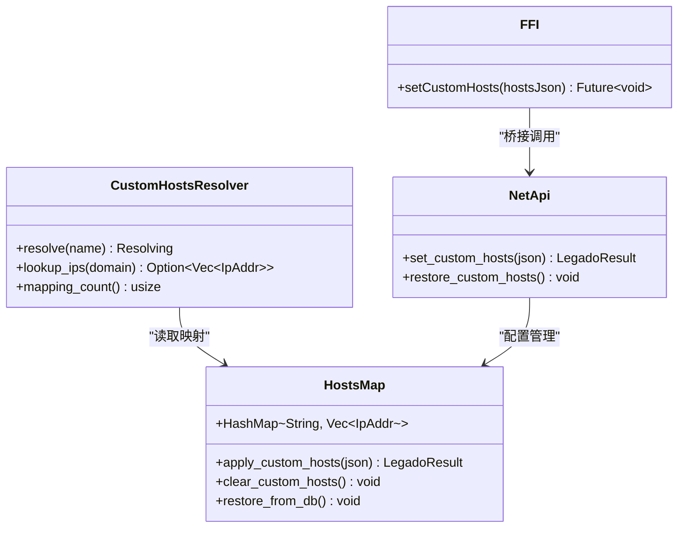

**图表来源**
- [custom_hosts.rs:137-175](file://rust/legado-net/src/custom_hosts.rs#L137-L175)
- [net_api.rs:22-60](file://rust/legado-ffi/src/api/net_api.rs#L22-L60)
- [ffi.dart:1058-1059](file://flutter_legado/lib/src/bridge/ffi/ffi.dart#L1058-L1059)

### 配置格式与示例
支持的JSON配置格式：

```json
{
  "example.com": "192.168.1.1",
  "api.example.com": ["10.0.0.1", "10.0.0.2"],
  "dev.example.com": "127.0.0.1, 127.0.0.2"
}
```

- 单IP字符串：`"域名": "IP地址"`
- IP数组：`"域名": ["IP1", "IP2"]`
- 逗号分隔：`"域名": "IP1, IP2"`

### 工作流程
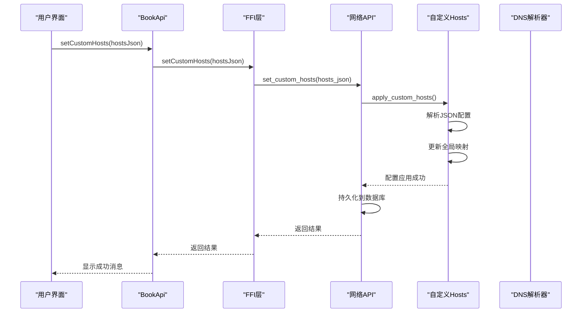

**图表来源**
- [other_settings_screen.dart:880-918](file://flutter_legado/lib/src/screens/other_settings_screen.dart#L880-L918)
- [net_api.rs:22-37](file://rust/legado-ffi/src/api/net_api.rs#L22-L37)
- [custom_hosts.rs:41-80](file://rust/legado-net/src/custom_hosts.rs#L41-L80)

### 即时生效机制
自定义 hosts 映射采用全局共享的`OnceLock<RwLock<HashMap>>`存储，确保：
- **线程安全**：读写操作通过RwLock保护
- **惰性初始化**：首次使用时才分配内存
- **实时读取**：每次DNS解析都读取最新配置
- **无锁读**：多个解析器可同时读取映射

### 错误处理与验证
- **JSON格式验证**：必须为JSON对象，不支持数组或基本类型
- **IP地址验证**：单个IP或IP数组中的每个IP都必须有效
- **域名规范化**：域名自动转换为小写，大小写不敏感
- **容错处理**：非法IP会被跳过，不影响其他有效映射

**章节来源**
- [custom_hosts.rs:1-343](file://rust/legado-net/src/custom_hosts.rs#L1-L343)
- [net_api.rs:1-114](file://rust/legado-ffi/src/api/net_api.rs#L1-L114)
- [ffi.dart:1058-1059](file://flutter_legado/lib/src/bridge/ffi/ffi.dart#L1058-L1059)
- [other_settings_screen.dart:880-918](file://flutter_legado/lib/src/screens/other_settings_screen.dart#L880-L918)
- [other_settings_screen.dart:1733-1793](file://flutter_legado/lib/src/screens/other_settings_screen.dart#L1733-L1793)

## BookApi接口与UI集成

### BookApi接口定义
BookApi接口提供了统一的网络配置管理，包括QUIC开关控制和自定义hosts设置方法：

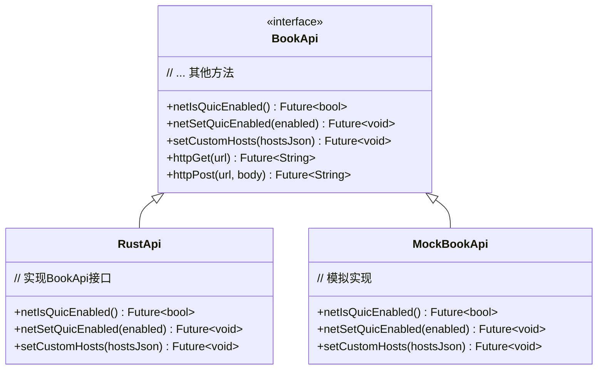

**图表来源**
- [book_api.dart:640-660](file://flutter_legado/lib/src/services/book_api.dart#L640-L660)
- [rust_api.dart:1496-1497](file://flutter_legado/lib/src/services/rust_api.dart#L1496-L1497)

### UI层集成实现
OtherSettingsScreen集成了自定义hosts设置功能，提供用户友好的界面：

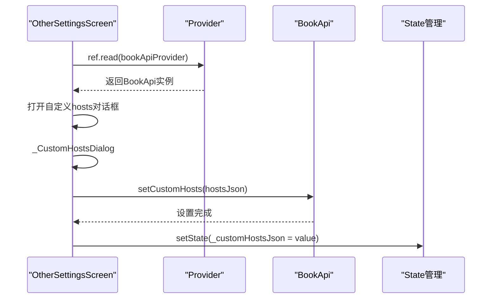

**图表来源**
- [other_settings_screen.dart:880-918](file://flutter_legado/lib/src/screens/other_settings_screen.dart#L880-L918)
- [other_settings_screen.dart:1733-1793](file://flutter_legado/lib/src/screens/other_settings_screen.dart#L1733-L1793)

### FFI桥接层实现
FFI层提供了Dart与Rust之间的安全桥接：

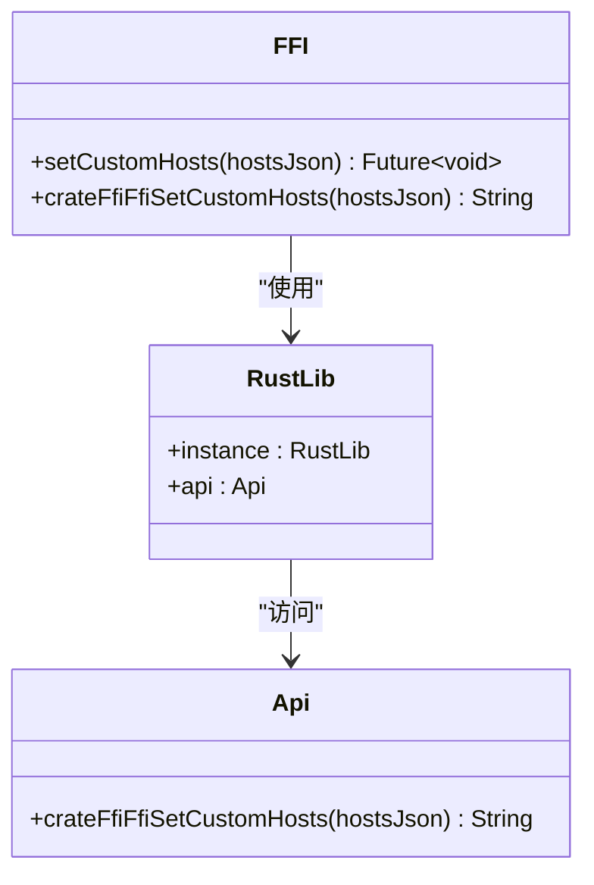

**图表来源**
- [ffi.dart:1058-1059](file://flutter_legado/lib/src/bridge/ffi/ffi.dart#L1058-L1059)

**章节来源**
- [book_api.dart:640-660](file://flutter_legado/lib/src/services/book_api.dart#L640-L660)
- [rust_api.dart:1496-1497](file://flutter_legado/lib/src/services/rust_api.dart#L1496-L1497)
- [ffi.dart:1058-1059](file://flutter_legado/lib/src/bridge/ffi/ffi.dart#L1058-L1059)
- [other_settings_screen.dart:880-918](file://flutter_legado/lib/src/screens/other_settings_screen.dart#L880-L918)
- [other_settings_screen.dart:1733-1793](file://flutter_legado/lib/src/screens/other_settings_screen.dart#L1733-L1793)

## 依赖关系分析
网络层内部模块间耦合清晰：client作为聚合器依赖request/response模型，通过middleware编排各能力模块；cookie_store与rate_limit为横向支撑；verification与user_agent提供通用增强；url_template服务于请求构建；quic模块提供现代协议支持；custom_hosts模块提供DNS覆盖能力；业务子模块复用client能力完成特定场景。新增的BookApi接口和FFI桥接层为Flutter层提供了统一的网络配置接口。

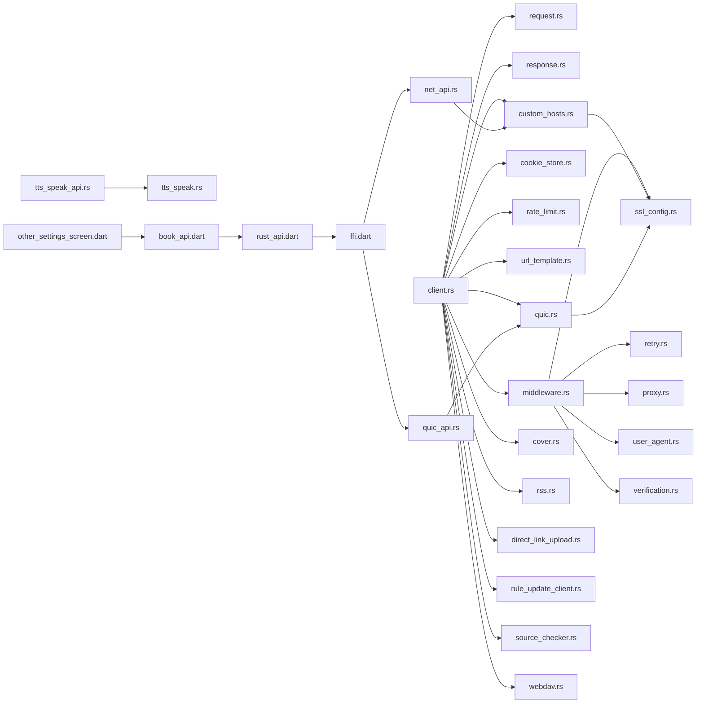

**图表来源**
- [client.rs:1-200](file://rust/legado-net/src/client.rs#L1-L200)
- [middleware.rs:1-200](file://rust/legado-net/src/middleware.rs#L1-L200)
- [retry.rs:1-200](file://rust/legado-net/src/retry.rs#L1-L200)
- [proxy.rs:1-200](file://rust/legado-net/src/proxy.rs#L1-L200)
- [ssl_config.rs:1-200](file://rust/legado-net/src/ssl_config.rs#L1-L200)
- [user_agent.rs:1-200](file://rust/legado-net/src/user_agent.rs#L1-L200)
- [verification.rs:1-200](file://rust/legado-net/src/verification.rs#L1-L200)
- [cookie_store.rs:1-200](file://rust/legado-net/src/cookie_store.rs#L1-L200)
- [rate_limit.rs:1-200](file://rust/legado-net/src/rate_limit.rs#L1-L200)
- [url_template.rs:1-200](file://rust/legado-net/src/url_template.rs#L1-L200)
- [quic.rs:1-200](file://rust/legado-net/src/quic.rs#L1-L200)
- [custom_hosts.rs:1-200](file://rust/legado-net/src/custom_hosts.rs#L1-L200)
- [net_api.rs:1-114](file://rust/legado-ffi/src/api/net_api.rs#L1-L114)
- [quic_api.rs:1-200](file://rust/legado-ffi/src/api/quic_api.rs#L1-L200)
- [tts_speak_api.rs:1-142](file://rust/legado-ffi/src/api/tts_speak_api.rs#L1-L142)
- [tts_speak.rs:1-498](file://rust/legado-core/src/tts_speak.rs#L1-L498)
- [book_api.dart:640-660](file://flutter_legado/lib/src/services/book_api.dart#L640-L660)
- [rust_api.dart:1496-1497](file://flutter_legado/lib/src/services/rust_api.dart#L1496-L1497)
- [ffi.dart:1058-1059](file://flutter_legado/lib/src/bridge/ffi/ffi.dart#L1058-L1059)
- [other_settings_screen.dart:880-918](file://flutter_legado/lib/src/screens/other_settings_screen.dart#L880-L918)

**章节来源**
- [lib.rs:1-100](file://rust/legado-net/src/lib.rs#L1-L100)

## 性能考量
- 连接复用：启用HTTP/2或Keep-Alive，减少握手开销。
- 压缩传输：优先启用Gzip/Brotli，降低带宽占用。
- 缓存策略：对静态资源实施强缓存，对动态内容使用ETag/Last-Modified。
- 并发控制：合理设置线程池大小与令牌桶速率，避免雪崩。
- 超时与重试：细粒度设置连接/读/写超时，重试仅针对幂等请求。
- 内存管理：流式处理大响应，避免一次性加载至内存。
- 监控指标：收集成功率、P95/P99延迟、错误分布、重试率。
- **QUIC优化**：启用QUIC协议以获得更好的连接性能和移动网络支持，合理配置连接池大小和流数量限制。
- **二进制数据处理优化**：使用get_raw()方法避免UTF-8转换开销，特别适合TTS音频等二进制内容处理。
- **自定义Hosts优化**：全局映射采用读写分离设计，支持高并发DNS解析；JSON配置解析在设置时完成，运行时只进行哈希查找。
- **UI响应性**：QUIC开关和自定义hosts操作应异步执行，避免阻塞UI线程。

**更新**：新增自定义hosts映射的性能优化考虑，包括全局映射的线程安全设计和配置解析的性能优化。

[本节为通用指导，不直接分析具体文件]

## 故障排除指南
- 连接失败：检查代理配置、DNS解析、防火墙规则、SSL证书有效性。
- 鉴权失败：确认Cookie/Token是否过期，检查Set-Cookie与请求头注入。
- 限流触发：调整QPS与并发阈值，观察服务端返回的429/503。
- 超时问题：区分连接超时与读取超时，评估网络质量与服务端负载。
- 响应解析错误：核对Content-Type与字符集，检查JSON结构与字段名。
- 日志定位：开启请求/响应日志，记录URL、状态码、耗时、错误堆栈。
- **QUIC相关问题**：检查UDP端口是否被防火墙阻止，确认服务器是否支持HTTP/3，查看QUIC连接协商日志。
- **二进制数据处理问题**：检查get_raw()方法是否正确返回原始字节数据，确认LegadoRawResponse结构体字段完整性。
- **自定义Hosts问题**：检查JSON格式是否正确，确认域名大小写，验证IP地址格式，查看DNS解析日志。
- **TTS语音合成问题**：验证Content-Type校验逻辑，检查音频文件格式和缓存写入权限。
- **UI层问题**：检查BookApi依赖是否正确注入，确认FFI调用是否成功，验证状态更新是否及时。
- **配置同步问题**：确保QUIC状态和自定义hosts变更后正确重置共享客户端，避免单例冻结旧状态。
- **持久化问题**：检查数据库连接状态，确认配置写入是否成功，验证应用启动时的配置恢复逻辑。

**更新**：新增自定义hosts映射相关的故障排除指南，包括JSON格式验证、域名匹配、IP地址格式检查等问题诊断。

**章节来源**
- [client.rs:1-200](file://rust/legado-net/src/client.rs#L1-L200)
- [response.rs:1-200](file://rust/legado-net/src/response.rs#L1-L200)
- [cookie_store.rs:1-200](file://rust/legado-net/src/cookie_store.rs#L1-L200)
- [rate_limit.rs:1-200](file://rust/legado-net/src/rate_limit.rs#L1-L200)
- [quic.rs:1-200](file://rust/legado-net/src/quic.rs#L1-L200)
- [custom_hosts.rs:1-343](file://rust/legado-net/src/custom_hosts.rs#L1-L343)
- [net_api.rs:1-114](file://rust/legado-ffi/src/api/net_api.rs#L1-L114)
- [quic_api.rs:190-212](file://rust/legado-ffi/src/api/quic_api.rs#L190-L212)
- [tts_speak_api.rs:1-142](file://rust/legado-ffi/src/api/tts_speak_api.rs#L1-L142)
- [tts_speak.rs:1-498](file://rust/legado-core/src/tts_speak.rs#L1-L498)
- [other_settings_screen.dart:880-918](file://flutter_legado/lib/src/screens/other_settings_screen.dart#L880-L918)

## 结论
Legado的网络层以client为核心，通过middleware灵活组合重试、代理、SSL、UA、校验等能力，配合cookie_store与rate_limit实现会话保持与并发控制。新增的get_raw()方法显著增强了二进制数据处理能力，特别适用于TTS音频下载等场景，避免了UTF-8转换带来的有损问题。**新增的自定义hosts映射功能**为网络调试和特殊网络环境提供了强大的DNS覆盖能力，支持JSON配置、即时生效和系统DNS回退。QUIC/HTTP3协议支持进一步提升了网络性能，特别是在移动网络和弱网环境下表现更佳。通过BookApi接口向UI层暴露的网络配置功能，使得用户能够动态调整网络传输协议和DNS解析策略，获得更好的用户体验。模块化设计使业务子模块可复用统一能力，提升开发效率与系统稳定性。建议在复杂场景下结合监控与日志持续优化性能与可靠性。

**更新**：强调了自定义hosts映射功能带来的网络调试能力提升、即时生效机制的技术优势、完整的UI集成体验，以及与现有网络能力的无缝整合。

[本节为总结性内容，不直接分析具体文件]

## 附录
- 使用示例：参考各业务子模块中的调用方式，如cover/rss/direct_link_upload等，学习如何构建请求、配置中间件、处理响应与错误。
- 调试工具：启用详细日志、抓包分析（Wireshark/Fiddler）、性能剖析（火焰图、APM）。
- 最佳实践：幂等请求可重试，非幂等需谨慎；敏感信息加密传输；定期轮换密钥与证书。
- **get_raw()使用方法**：直接使用client.get_raw(url, headers)获取原始二进制数据，返回LegadoRawResponse结构体。
- **LegadoRawResponse使用**：通过status、headers、body(Vec<u8>)、url字段访问响应数据，使用is_success()、header()、content_type()方法处理响应。
- **TTS语音合成使用**：通过tts_speak_api.tts_speak()方法调用，内部自动使用get_raw()获取音频数据。
- **QUIC配置示例**：参考quic.rs中的配置选项，了解如何启用和优化QUIC连接。
- **BookApi使用示例**：通过ref.read(bookApiProvider).netIsQuicEnabled()查询状态，通过netSetQuicEnabled(value)设置开关。
- **FFI调用示例**：使用RustLib.instance.api.crateFfiFfiNetSetQuicEnabled()进行底层调用。
- **自定义Hosts配置示例**：
  ```json
  {
    "example.com": "192.168.1.1",
    "api.example.com": ["10.0.0.1", "10.0.0.2"],
    "dev.example.com": "127.0.0.1, 127.0.0.2"
  }
  ```
- **自定义Hosts使用方法**：通过BookApi.setCustomHosts(hostsJson)设置映射，空字符串清除所有映射恢复系统DNS。
- **调试技巧**：使用mapping_count()检查当前映射数量，通过lookup_ips()验证域名解析结果。

**更新**：新增自定义hosts映射的使用示例、配置格式说明和调试技巧。

[本节为补充信息，不直接分析具体文件]