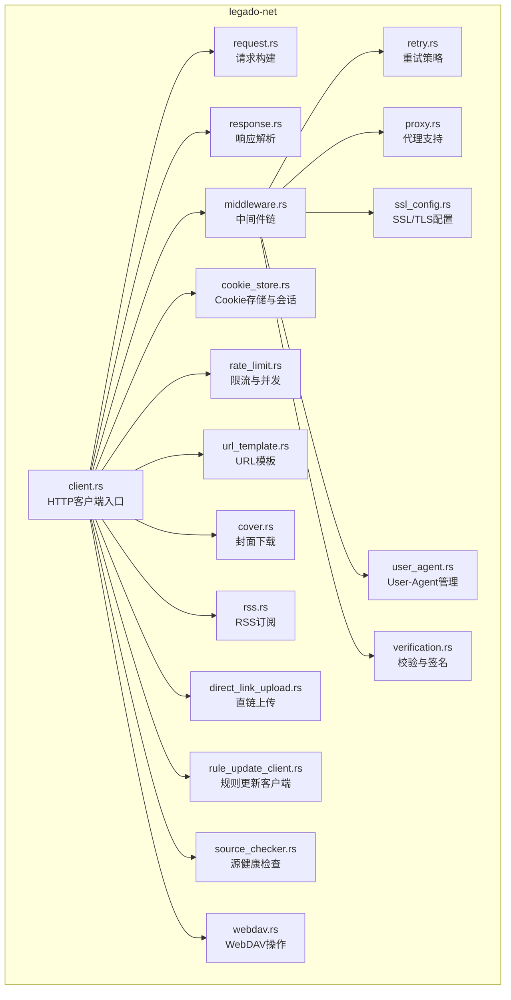
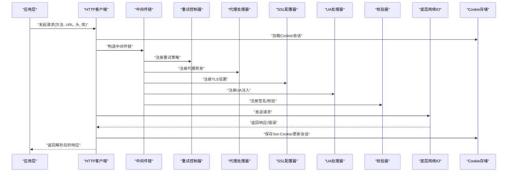
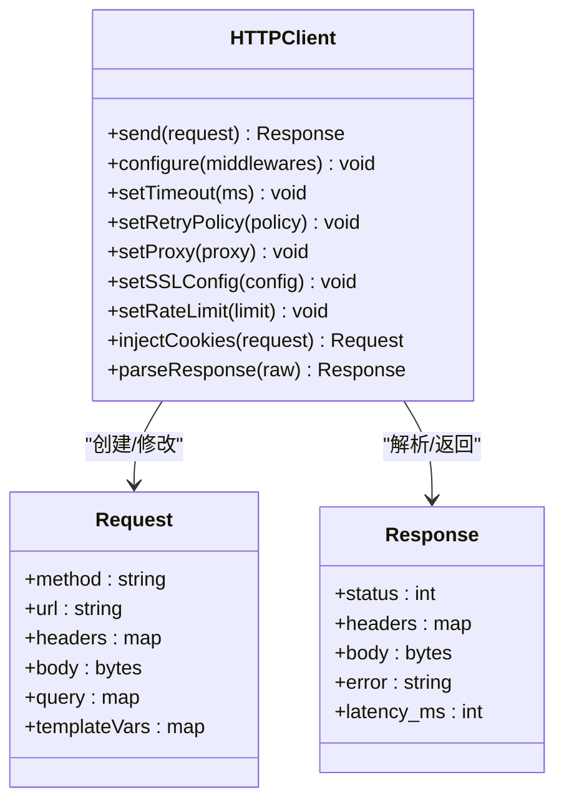
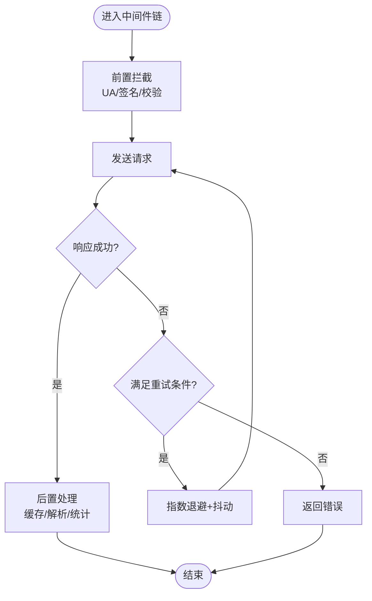
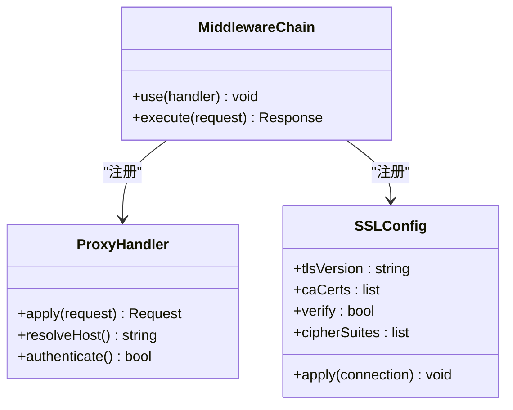
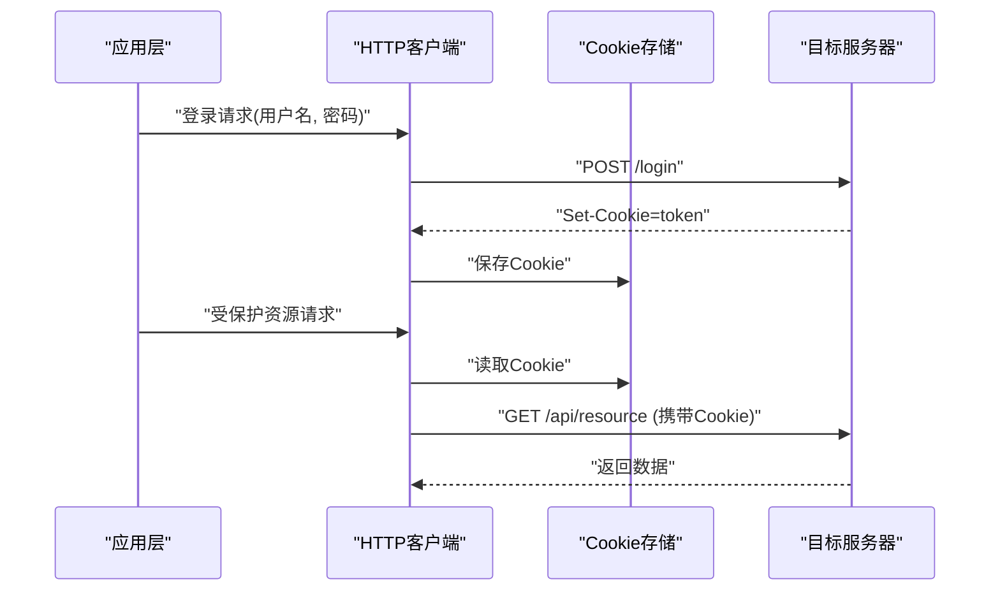
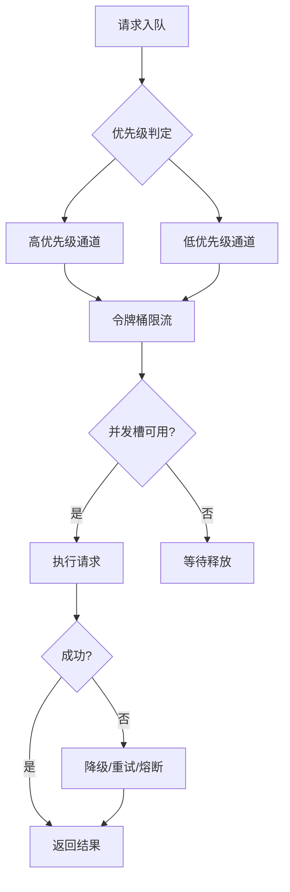
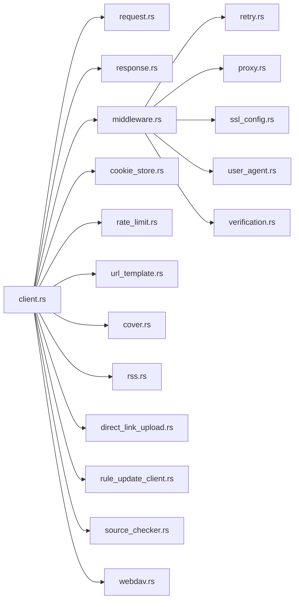

# 网络层

<cite>
**本文引用的文件**   
- [lib.rs](file://rust/legado-net/src/lib.rs)
- [client.rs](file://rust/legado-net/src/client.rs)
- [request.rs](file://rust/legado-net/src/request.rs)
- [response.rs](file://rust/legado-net/src/response.rs)
- [middleware.rs](file://rust/legado-net/src/middleware.rs)
- [retry.rs](file://rust/legado-net/src/retry.rs)
- [proxy.rs](file://rust/legado-net/src/proxy.rs)
- [ssl_config.rs](file://rust/legado-net/src/ssl_config.rs)
- [cookie_store.rs](file://rust/legado-net/src/cookie_store.rs)
- [rate_limit.rs](file://rust/legado-net/src/rate_limit.rs)
- [verification.rs](file://rust/legado-net/src/verification.rs)
- [user_agent.rs](file://rust/legado-net/src/user_agent.rs)
- [url_template.rs](file://rust/legado-net/src/url_template.rs)
- [cover.rs](file://rust/legado-net/src/cover.rs)
- [remote_book.rs](file://rust/legado-net/src/remote_book.rs)
- [rss.rs](file://rust/legado-net/src/rss.rs)
- [direct_link_upload.rs](file://rust/legado-net/src/direct_link_upload.rs)
- [rule_update_client.rs](file://rust/legado-net/src/rule_update_client.rs)
- [source_checker.rs](file://rust/legado-net/src/source_checker.rs)
- [webdav.rs](file://rust/legado-net/src/webdav.rs)
</cite>

## 目录
1. [简介](#简介)
2. [项目结构](#项目结构)
3. [核心组件](#核心组件)
4. [架构总览](#架构总览)
5. [详细组件分析](#详细组件分析)
6. [依赖关系分析](#依赖关系分析)
7. [性能考量](#性能考量)
8. [故障排除指南](#故障排除指南)
9. [结论](#结论)
10. [附录](#附录)

## 简介
本文件面向Legado项目的网络层，系统性梳理HTTP客户端实现、请求构建与响应解析、错误处理机制；详解中间件体系（重试、超时、代理、SSL配置）；阐述Cookie管理与会话保持（自动登录、状态同步）；说明并发请求处理（队列、限流、资源管理）；并提供调试工具与使用示例（日志、抓包、性能监控），以及优化建议与排障指南。文档力求兼顾技术深度与可读性，帮助开发者快速理解并高效扩展网络能力。

## 项目结构
网络层位于Rust模块legado-net中，采用模块化设计：以client为核心入口，围绕request/response数据模型，通过middleware链式组装能力（重试、代理、SSL、UA、验证等），配合cookie_store进行会话持久化，rate_limit控制并发与速率，verification与user_agent提供通用增强，url_template支持动态URL生成，cover/rss/direct_link_upload/webdav等子模块封装特定业务场景的HTTP交互。

**图表来源** 
- [client.rs:1-100](file://rust/legado-net/src/client.rs#L1-L100)
- [middleware.rs:1-100](file://rust/legado-net/src/middleware.rs#L1-L100)
- [retry.rs:1-100](file://rust/legado-net/src/retry.rs#L1-L100)
- [proxy.rs:1-100](file://rust/legado-net/src/proxy.rs#L1-L100)
- [ssl_config.rs:1-100](file://rust/legado-net/src/ssl_config.rs#L1-L100)
- [cookie_store.rs:1-100](file://rust/legado-net/src/cookie_store.rs#L1-L100)
- [rate_limit.rs:1-100](file://rust/legado-net/src/rate_limit.rs#L1-L100)
- [verification.rs:1-100](file://rust/legado-net/src/verification.rs#L1-L100)
- [user_agent.rs:1-100](file://rust/legado-net/src/user_agent.rs#L1-L100)
- [url_template.rs:1-100](file://rust/legado-net/src/url_template.rs#L1-L100)
- [cover.rs:1-100](file://rust/legado-net/src/cover.rs#L1-L100)
- [rss.rs:1-100](file://rust/legado-net/src/rss.rs#L1-L100)
- [direct_link_upload.rs:1-100](file://rust/legado-net/src/direct_link_upload.rs#L1-L100)
- [rule_update_client.rs:1-100](file://rust/legado-net/src/rule_update_client.rs#L1-L100)
- [source_checker.rs:1-100](file://rust/legado-net/src/source_checker.rs#L1-L100)
- [webdav.rs:1-100](file://rust/legado-net/src/webdav.rs#L1-L100)

**章节来源**
- [lib.rs:1-100](file://rust/legado-net/src/lib.rs#L1-L100)

## 核心组件
- HTTP客户端（client.rs）：统一发起请求的入口，负责组合中间件、管理连接池、超时与重试、Cookie注入与持久化、限流与并发控制。
- 请求构建（request.rs）：抽象HTTP请求对象，支持方法、URL、头部、Body、查询参数、模板变量填充。
- 响应解析（response.rs）：统一响应体与元数据，提供JSON、文本、二进制、分块读取与错误映射。
- 中间件链（middleware.rs）：可插拔的请求/响应处理管线，按序执行拦截逻辑，支持短路返回与异常透传。
- 重试策略（retry.rs）：基于指数退避、抖动、条件判断的重试控制器，支持最大次数与间隔上限。
- 代理支持（proxy.rs）：HTTP/HTTPS/SOCKS代理配置与应用，支持认证与域名绕过。
- SSL配置（ssl_config.rs）：TLS版本、证书信任、自定义CA、加密套件选择。
- Cookie管理（cookie_store.rs）：跨请求会话保持、自动登录、域路径匹配、过期清理。
- 限流与并发（rate_limit.rs）：令牌桶或滑动窗口限流，限制QPS与并发度，避免服务端过载。
- 校验与签名（verification.rs）：请求签名、HMAC、时间戳防重放、内容摘要。
- User-Agent（user_agent.rs）：设备指纹、版本信息、随机化策略。
- URL模板（url_template.rs）：变量替换、路径拼接、编码处理。
- 业务子模块：cover/rss/direct_link_upload/rule_update_client/source_checker/webdav分别封装对应场景的HTTP调用流程。

**章节来源**
- [client.rs:1-200](file://rust/legado-net/src/client.rs#L1-L200)
- [request.rs:1-200](file://rust/legado-net/src/request.rs#L1-L200)
- [response.rs:1-200](file://rust/legado-net/src/response.rs#L1-L200)
- [middleware.rs:1-200](file://rust/legado-net/src/middleware.rs#L1-L200)
- [retry.rs:1-200](file://rust/legado-net/src/retry.rs#L1-L200)
- [proxy.rs:1-200](file://rust/legado-net/src/proxy.rs#L1-L200)
- [ssl_config.rs:1-200](file://rust/legado-net/src/ssl_config.rs#L1-L200)
- [cookie_store.rs:1-200](file://rust/legado-net/src/cookie_store.rs#L1-L200)
- [rate_limit.rs:1-200](file://rust/legado-net/src/rate_limit.rs#L1-L200)
- [verification.rs:1-200](file://rust/legado-net/src/verification.rs#L1-L200)
- [user_agent.rs:1-200](file://rust/legado-net/src/user_agent.rs#L1-L200)
- [url_template.rs:1-200](file://rust/legado-net/src/url_template.rs#L1-L200)
- [cover.rs:1-200](file://rust/legado-net/src/cover.rs#L1-L200)
- [rss.rs:1-200](file://rust/legado-net/src/rss.rs#L1-L200)
- [direct_link_upload.rs:1-200](file://rust/legado-net/src/direct_link_upload.rs#L1-L200)
- [rule_update_client.rs:1-200](file://rust/legado-net/src/rule_update_client.rs#L1-L200)
- [source_checker.rs:1-200](file://rust/legado-net/src/source_checker.rs#L1-L200)
- [webdav.rs:1-200](file://rust/legado-net/src/webdav.rs#L1-L200)

## 架构总览
下图展示一次典型HTTP请求从应用层到网络层的完整流转，包括中间件链的执行顺序、重试与代理的应用、Cookie注入与响应解析。

**图表来源**
- [client.rs:1-200](file://rust/legado-net/src/client.rs#L1-L200)
- [middleware.rs:1-200](file://rust/legado-net/src/middleware.rs#L1-L200)
- [retry.rs:1-200](file://rust/legado-net/src/retry.rs#L1-L200)
- [proxy.rs:1-200](file://rust/legado-net/src/proxy.rs#L1-L200)
- [ssl_config.rs:1-200](file://rust/legado-net/src/ssl_config.rs#L1-L200)
- [user_agent.rs:1-200](file://rust/legado-net/src/user_agent.rs#L1-L200)
- [verification.rs:1-200](file://rust/legado-net/src/verification.rs#L1-L200)
- [cookie_store.rs:1-200](file://rust/legado-net/src/cookie_store.rs#L1-L200)

## 详细组件分析

### HTTP客户端与请求构建
- 客户端职责：组装中间件、管理连接池、超时控制、重试调度、Cookie注入、限流与并发控制、错误分类与上报。
- 请求构建：支持GET/POST/PUT/DELETE等方法，Header键值对、Body字节流或字符串、Query参数、URL模板变量替换。
- 响应解析：统一返回结构，包含状态码、Headers、Body（文本/JSON/二进制）、错误原因、耗时统计。

**图表来源**
- [client.rs:1-200](file://rust/legado-net/src/client.rs#L1-L200)
- [request.rs:1-200](file://rust/legado-net/src/request.rs#L1-L200)
- [response.rs:1-200](file://rust/legado-net/src/response.rs#L1-L200)

**章节来源**
- [client.rs:1-200](file://rust/legado-net/src/client.rs#L1-L200)
- [request.rs:1-200](file://rust/legado-net/src/request.rs#L1-L200)
- [response.rs:1-200](file://rust/legado-net/src/response.rs#L1-L200)

### 中间件机制与重试策略
- 中间件链：按注册顺序执行，支持前置拦截（如UA注入、签名计算）与后置处理（如响应缓存、错误转换）。
- 重试策略：指数退避+抖动，支持条件重试（如网络错误、5xx状态码），最大重试次数与间隔上限保护。

**图表来源**
- [middleware.rs:1-200](file://rust/legado-net/src/middleware.rs#L1-L200)
- [retry.rs:1-200](file://rust/legado-net/src/retry.rs#L1-L200)

**章节来源**
- [middleware.rs:1-200](file://rust/legado-net/src/middleware.rs#L1-L200)
- [retry.rs:1-200](file://rust/legado-net/src/retry.rs#L1-L200)

### 代理支持与SSL配置
- 代理：支持HTTP/HTTPS/SOCKS，可配置认证、域名白名单、直连跳过列表。
- SSL：支持TLS版本选择、自定义CA证书、证书校验开关、加密套件优先级。

**图表来源**
- [proxy.rs:1-200](file://rust/legado-net/src/proxy.rs#L1-L200)
- [ssl_config.rs:1-200](file://rust/legado-net/src/ssl_config.rs#L1-L200)
- [middleware.rs:1-200](file://rust/legado-net/src/middleware.rs#L1-L200)

**章节来源**
- [proxy.rs:1-200](file://rust/legado-net/src/proxy.rs#L1-L200)
- [ssl_config.rs:1-200](file://rust/legado-net/src/ssl_config.rs#L1-L200)

### Cookie管理与会话保持
- 自动登录：在鉴权成功后持久化Token/Cookie，后续请求自动注入。
- 状态同步：跨请求共享CookieJar，支持域/路径匹配、过期清理、安全标志。
- 生命周期：会话初始化、刷新、失效回收，支持多账户隔离。

**图表来源**
- [cookie_store.rs:1-200](file://rust/legado-net/src/cookie_store.rs#L1-L200)
- [client.rs:1-200](file://rust/legado-net/src/client.rs#L1-L200)

**章节来源**
- [cookie_store.rs:1-200](file://rust/legado-net/src/cookie_store.rs#L1-L200)

### 并发请求处理：队列、限流与资源管理
- 请求队列：异步任务入队，按优先级调度，支持取消与超时。
- 限流控制：令牌桶/滑动窗口，限制每秒请求数与并发度，避免触发服务端限制。
- 资源管理：连接池复用、内存缓冲、错误回退与熔断。

**图表来源**
- [rate_limit.rs:1-200](file://rust/legado-net/src/rate_limit.rs#L1-L200)
- [client.rs:1-200](file://rust/legado-net/src/client.rs#L1-L200)

**章节来源**
- [rate_limit.rs:1-200](file://rust/legado-net/src/rate_limit.rs#L1-L200)

### 业务子模块概览
- 封面下载（cover.rs）：批量获取书籍封面，支持缩略图尺寸、缓存策略。
- RSS订阅（rss.rs）：拉取RSS源、解析条目、增量更新。
- 直链上传（direct_link_upload.rs）：文件上传至第三方服务，断点续传与进度回调。
- 规则更新客户端（rule_update_client.rs）：远程规则包下载与校验。
- 源健康检查（source_checker.rs）：定时探测源可用性，记录延迟与错误率。
- WebDAV（webdav.rs）：远程文件浏览、上传、删除等操作。

**章节来源**
- [cover.rs:1-200](file://rust/legado-net/src/cover.rs#L1-L200)
- [rss.rs:1-200](file://rust/legado-net/src/rss.rs#L1-L200)
- [direct_link_upload.rs:1-200](file://rust/legado-net/src/direct_link_upload.rs#L1-L200)
- [rule_update_client.rs:1-200](file://rust/legado-net/src/rule_update_client.rs#L1-L200)
- [source_checker.rs:1-200](file://rust/legado-net/src/source_checker.rs#L1-L200)
- [webdav.rs:1-200](file://rust/legado-net/src/webdav.rs#L1-L200)

## 依赖关系分析
网络层内部模块间耦合清晰：client作为聚合器依赖request/response模型，通过middleware编排各能力模块；cookie_store与rate_limit为横向支撑；verification与user_agent提供通用增强；url_template服务于请求构建；业务子模块复用client能力完成特定场景。

**图表来源**
- [client.rs:1-200](file://rust/legado-net/src/client.rs#L1-L200)
- [middleware.rs:1-200](file://rust/legado-net/src/middleware.rs#L1-L200)
- [retry.rs:1-200](file://rust/legado-net/src/retry.rs#L1-L200)
- [proxy.rs:1-200](file://rust/legado-net/src/proxy.rs#L1-L200)
- [ssl_config.rs:1-200](file://rust/legado-net/src/ssl_config.rs#L1-L200)
- [user_agent.rs:1-200](file://rust/legado-net/src/user_agent.rs#L1-L200)
- [verification.rs:1-200](file://rust/legado-net/src/verification.rs#L1-L200)
- [cookie_store.rs:1-200](file://rust/legado-net/src/cookie_store.rs#L1-L200)
- [rate_limit.rs:1-200](file://rust/legado-net/src/rate_limit.rs#L1-L200)
- [url_template.rs:1-200](file://rust/legado-net/src/url_template.rs#L1-L200)
- [cover.rs:1-200](file://rust/legado-net/src/cover.rs#L1-L200)
- [rss.rs:1-200](file://rust/legado-net/src/rss.rs#L1-L200)
- [direct_link_upload.rs:1-200](file://rust/legado-net/src/direct_link_upload.rs#L1-L200)
- [rule_update_client.rs:1-200](file://rust/legado-net/src/rule_update_client.rs#L1-L200)
- [source_checker.rs:1-200](file://rust/legado-net/src/source_checker.rs#L1-L200)
- [webdav.rs:1-200](file://rust/legado-net/src/webdav.rs#L1-L200)

**章节来源**
- [lib.rs:1-100](file://rust/legado-net/src/lib.rs#L1-L100)

## 性能考量
- 连接复用：启用HTTP/2或Keep-Alive，减少握手开销。
- 压缩传输：优先启用Gzip/Brotli，降低带宽占用。
- 缓存策略：对静态资源实施强缓存，对动态内容使用ETag/Last-Modified。
- 并发控制：合理设置线程池大小与令牌桶速率，避免雪崩。
- 超时与重试：细粒度设置连接/读/写超时，重试仅针对幂等请求。
- 内存管理：流式处理大响应，避免一次性加载至内存。
- 监控指标：收集成功率、P95/P99延迟、错误分布、重试率。

[本节为通用指导，不直接分析具体文件]

## 故障排除指南
- 连接失败：检查代理配置、DNS解析、防火墙规则、SSL证书有效性。
- 鉴权失败：确认Cookie/Token是否过期，检查Set-Cookie与请求头注入。
- 限流触发：调整QPS与并发阈值，观察服务端返回的429/503。
- 超时问题：区分连接超时与读取超时，评估网络质量与服务端负载。
- 响应解析错误：核对Content-Type与字符集，检查JSON结构与字段名。
- 日志定位：开启请求/响应日志，记录URL、状态码、耗时、错误堆栈。

**章节来源**
- [client.rs:1-200](file://rust/legado-net/src/client.rs#L1-L200)
- [response.rs:1-200](file://rust/legado-net/src/response.rs#L1-L200)
- [cookie_store.rs:1-200](file://rust/legado-net/src/cookie_store.rs#L1-L200)
- [rate_limit.rs:1-200](file://rust/legado-net/src/rate_limit.rs#L1-L200)

## 结论
Legado的网络层以client为核心，通过middleware灵活组合重试、代理、SSL、UA、校验等能力，配合cookie_store与rate_limit实现会话保持与并发控制。模块化设计使业务子模块可复用统一能力，提升开发效率与系统稳定性。建议在复杂场景下结合监控与日志持续优化性能与可靠性。

[本节为总结性内容，不直接分析具体文件]

## 附录
- 使用示例：参考各业务子模块中的调用方式，如cover/rss/direct_link_upload等，学习如何构建请求、配置中间件、处理响应与错误。
- 调试工具：启用详细日志、抓包分析（Wireshark/Fiddler）、性能剖析（火焰图、APM）。
- 最佳实践：幂等请求可重试，非幂等需谨慎；敏感信息加密传输；定期轮换密钥与证书。

[本节为补充信息，不直接分析具体文件]