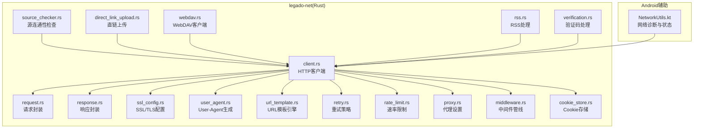
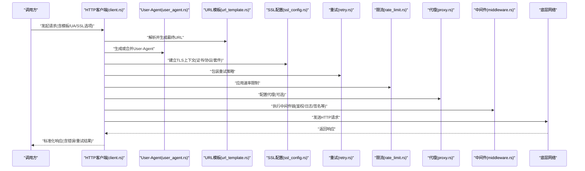
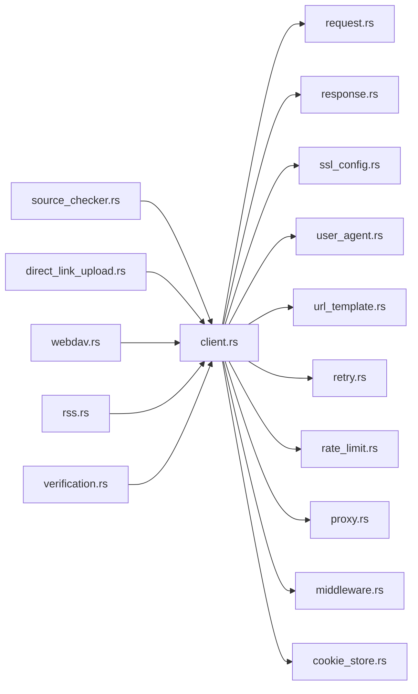

# 网络工具集

<cite>
**本文引用的文件**   
- [rust/legado-net/src/ssl_config.rs](file://rust/legado-net/src/ssl_config.rs)
- [rust/legado-net/src/user_agent.rs](file://rust/legado-net/src/user_agent.rs)
- [rust/legado-net/src/url_template.rs](file://rust/legado-net/src/url_template.rs)
- [rust/legado-net/src/client.rs](file://rust/legado-net/src/client.rs)
- [rust/legado-net/src/request.rs](file://rust/legado-net/src/request.rs)
- [rust/legado-net/src/response.rs](file://rust/legado-net/src/response.rs)
- [rust/legado-net/src/retry.rs](file://rust/legado-net/src/retry.rs)
- [rust/legado-net/src/rate_limit.rs](file://rust/legado-net/src/rate_limit.rs)
- [rust/legado-net/src/proxy.rs](file://rust/legado-net/src/proxy.rs)
- [rust/legado-net/src/middleware.rs](file://rust/legado-net/src/middleware.rs)
- [rust/legado-net/src/source_checker.rs](file://rust/legado-net/src/source_checker.rs)
- [rust/legado-net/src/cookie_store.rs](file://rust/legado-net/src/cookie_store.rs)
- [rust/legado-net/src/direct_link_upload.rs](file://rust/legado-net/src/direct_link_upload.rs)
- [rust/legado-net/src/webdav.rs](file://rust/legado-net/src/webdav.rs)
- [rust/legado-net/src/rss.rs](file://rust/legado-net/src/rss.rs)
- [rust/legado-net/src/verification.rs](file://rust/legado-net/src/verification.rs)
- [app/src/main/java/io/legado/app/utils/NetworkUtils.kt](file://app/src/main/java/io/legado/app/utils/NetworkUtils.kt)
</cite>

## 目录
1. [简介](#简介)
2. [项目结构](#项目结构)
3. [核心组件](#核心组件)
4. [架构总览](#架构总览)
5. [详细组件分析](#详细组件分析)
6. [依赖关系分析](#依赖关系分析)
7. [性能考量](#性能考量)
8. [故障排查指南](#故障排查指南)
9. [结论](#结论)
10. [附录](#附录)

## 简介
本文件面向Legado项目的“网络工具集”，聚焦以下能力：
- SSL/TLS配置与证书管理、加密套件选择、协议版本控制
- User-Agent生成与管理（设备信息收集、版本兼容、反爬虫策略）
- URL模板引擎（变量替换、路径构建、查询参数生成）
- 网络诊断工具（连接测试、DNS解析、网络质量评估）
- 实用工具函数示例（网络状态检测、带宽测量、延迟分析）
- 安全配置建议与最佳实践

该工具集以Rust模块legado-net为核心，结合Android端辅助工具类，提供稳定、可配置、可扩展的网络能力。

## 项目结构
网络相关代码主要位于rust/legado-net/src目录，涵盖客户端、请求/响应、SSL配置、User-Agent、URL模板、重试、限流、代理、中间件、源检查器、Cookie存储、直链上传、WebDAV、RSS、验证码等；Android端在app/src/main/java/io/legado/app/utils下提供网络诊断与状态检测工具。

图表来源
- [rust/legado-net/src/client.rs](file://rust/legado-net/src/client.rs)
- [rust/legado-net/src/request.rs](file://rust/legado-net/src/request.rs)
- [rust/legado-net/src/response.rs](file://rust/legado-net/src/response.rs)
- [rust/legado-net/src/ssl_config.rs](file://rust/legado-net/src/ssl_config.rs)
- [rust/legado-net/src/user_agent.rs](file://rust/legado-net/src/user_agent.rs)
- [rust/legado-net/src/url_template.rs](file://rust/legado-net/src/url_template.rs)
- [rust/legado-net/src/retry.rs](file://rust/legado-net/src/retry.rs)
- [rust/legado-net/src/rate_limit.rs](file://rust/legado-net/src/rate_limit.rs)
- [rust/legado-net/src/proxy.rs](file://rust/legado-net/src/proxy.rs)
- [rust/legado-net/src/middleware.rs](file://rust/legado-net/src/middleware.rs)
- [rust/legado-net/src/source_checker.rs](file://rust/legado-net/src/source_checker.rs)
- [rust/legado-net/src/cookie_store.rs](file://rust/legado-net/src/cookie_store.rs)
- [rust/legado-net/src/direct_link_upload.rs](file://rust/legado-net/src/direct_link_upload.rs)
- [rust/legado-net/src/webdav.rs](file://rust/legado-net/src/webdav.rs)
- [rust/legado-net/src/rss.rs](file://rust/legado-net/src/rss.rs)
- [rust/legado-net/src/verification.rs](file://rust/legado-net/src/verification.rs)
- [app/src/main/java/io/legado/app/utils/NetworkUtils.kt](file://app/src/main/java/io/legado/app/utils/NetworkUtils.kt)

章节来源
- [rust/legado-net/src/client.rs](file://rust/legado-net/src/client.rs)
- [rust/legado-net/src/ssl_config.rs](file://rust/legado-net/src/ssl_config.rs)
- [rust/legado-net/src/user_agent.rs](file://rust/legado-net/src/user_agent.rs)
- [rust/legado-net/src/url_template.rs](file://rust/legado-net/src/url_template.rs)
- [app/src/main/java/io/legado/app/utils/NetworkUtils.kt](file://app/src/main/java/io/legado/app/utils/NetworkUtils.kt)

## 核心组件
- SSL/TLS配置：集中管理证书、协议版本、加密套件与安全策略，支持自定义CA与双向认证。
- User-Agent管理：按设备/平台/应用版本动态生成UA，支持规则化拼接与反爬虫策略。
- URL模板引擎：基于模板字符串进行变量替换、路径拼接与查询参数生成，支持条件片段与默认值。
- HTTP客户端：统一封装请求/响应、重试、限流、代理、中间件、Cookie持久化。
- 诊断与工具：连接测试、DNS解析、网络质量评估、带宽与延迟测量。

章节来源
- [rust/legado-net/src/ssl_config.rs](file://rust/legado-net/src/ssl_config.rs)
- [rust/legado-net/src/user_agent.rs](file://rust/legado-net/src/user_agent.rs)
- [rust/legado-net/src/url_template.rs](file://rust/legado-net/src/url_template.rs)
- [rust/legado-net/src/client.rs](file://rust/legado-net/src/client.rs)
- [app/src/main/java/io/legado/app/utils/NetworkUtils.kt](file://app/src/main/java/io/legado/app/utils/NetworkUtils.kt)

## 架构总览
下图展示从上层调用到网络栈的完整流程，包括SSL/TLS、UA、URL模板、重试、限流、代理与中间件协同工作。

图表来源
- [rust/legado-net/src/client.rs](file://rust/legado-net/src/client.rs)
- [rust/legado-net/src/user_agent.rs](file://rust/legado-net/src/user_agent.rs)
- [rust/legado-net/src/url_template.rs](file://rust/legado-net/src/url_template.rs)
- [rust/legado-net/src/ssl_config.rs](file://rust/legado-net/src/ssl_config.rs)
- [rust/legado-net/src/retry.rs](file://rust/legado-net/src/retry.rs)
- [rust/legado-net/src/rate_limit.rs](file://rust/legado-net/src/rate_limit.rs)
- [rust/legado-net/src/proxy.rs](file://rust/legado-net/src/proxy.rs)
- [rust/legado-net/src/middleware.rs](file://rust/legado-net/src/middleware.rs)

## 详细组件分析

### SSL/TLS配置与证书管理
- 功能要点
  - 协议版本控制：限定最低/最高TLS版本，禁用不安全协议。
  - 加密套件选择：优先使用强加密套件，按安全性排序。
  - 证书管理：支持系统信任库、自定义CA、双向认证（客户端证书）。
  - 校验策略：严格主机名校验、OCSP/CRL（如可用）、证书固定（可选）。
- 典型用法
  - 初始化TLS上下文时传入证书与协议/套件策略。
  - 为不同域名或环境切换不同的证书与策略。
- 安全建议
  - 生产环境启用最小协议版本与最强套件组合。
  - 避免使用弱套件与过时协议（如TLS1.0/1.1）。
  - 对敏感站点启用证书固定以降低MITM风险。

章节来源
- [rust/legado-net/src/ssl_config.rs](file://rust/legado-net/src/ssl_config.rs)

### User-Agent生成与管理
- 功能要点
  - 设备信息收集：操作系统、设备型号、屏幕密度、语言等。
  - 版本兼容：根据目标服务端要求拼装兼容UA。
  - 反爬虫策略：随机化部分字段、周期性轮换、指纹混淆。
- 典型用法
  - 通过配置模板与运行时信息生成UA。
  - 针对特定域名覆盖UA策略。
- 注意事项
  - 避免泄露过多隐私信息。
  - 保持与服务端期望格式一致。

章节来源
- [rust/legado-net/src/user_agent.rs](file://rust/legado-net/src/user_agent.rs)

### URL模板引擎
- 功能要点
  - 变量替换：支持命名占位符与默认值。
  - 路径构建：自动拼接路径段、规范化分隔符。
  - 查询参数：键值对序列化、编码、条件包含。
- 典型用法
  - 定义模板后注入上下文变量生成最终URL。
  - 支持条件片段（如仅当参数存在时追加）。
- 扩展点
  - 自定义格式化器（日期、编码等）。
  - 缓存模板解析结果提升性能。

章节来源
- [rust/legado-net/src/url_template.rs](file://rust/legado-net/src/url_template.rs)

### HTTP客户端与请求/响应
- 功能要点
  - 统一封装请求体、头部、超时、重定向策略。
  - 标准化响应对象，包含状态码、头部、体、错误信息。
  - 与重试、限流、代理、中间件无缝集成。
- 典型用法
  - 构造请求对象，附加中间件与策略后提交。
  - 统一错误处理与重试逻辑。

章节来源
- [rust/legado-net/src/client.rs](file://rust/legado-net/src/client.rs)
- [rust/legado-net/src/request.rs](file://rust/legado-net/src/request.rs)
- [rust/legado-net/src/response.rs](file://rust/legado-net/src/response.rs)

### 重试与限流
- 重试策略
  - 指数退避、抖动、最大重试次数、可重试错误分类。
- 限流策略
  - 令牌桶/漏桶算法、全局或域名级限速、突发控制。
- 典型用法
  - 将重试与限流作为客户端装饰器或中间件链的一部分。

章节来源
- [rust/legado-net/src/retry.rs](file://rust/legado-net/src/retry.rs)
- [rust/legado-net/src/rate_limit.rs](file://rust/legado-net/src/rate_limit.rs)

### 代理与中间件
- 代理
  - 支持HTTP/SOCKS代理、按域名路由、认证。
- 中间件
  - 鉴权、签名、日志、压缩、缓存、调试钩子。
- 典型用法
  - 通过中间件链组装通用横切关注点。

章节来源
- [rust/legado-net/src/proxy.rs](file://rust/legado-net/src/proxy.rs)
- [rust/legado-net/src/middleware.rs](file://rust/legado-net/src/middleware.rs)

### Cookie存储
- 功能要点
  - 跨请求持久化Cookie、按域隔离、过期清理。
  - 支持安全标志（Secure/HttpOnly）与SameSite策略。
- 典型用法
  - 登录成功后自动保存会话Cookie，后续请求自动携带。

章节来源
- [rust/legado-net/src/cookie_store.rs](file://rust/legado-net/src/cookie_store.rs)

### 直链上传与WebDAV
- 直链上传
  - 直接上传至第三方存储服务，支持分块、断点续传（按需）。
- WebDAV
  - 标准WebDAV操作（列出、上传、下载、删除），兼容常见网盘。
- 典型用法
  - 配置目标服务凭据与端点后调用对应API。

章节来源
- [rust/legado-net/src/direct_link_upload.rs](file://rust/legado-net/src/direct_link_upload.rs)
- [rust/legado-net/src/webdav.rs](file://rust/legado-net/src/webdav.rs)

### RSS与验证码
- RSS
  - 订阅、解析、增量更新、内容过滤。
- 验证码
  - 识别流程编排、回调处理、失败重试。
- 典型用法
  - 订阅RSS源并定时拉取；在需要验证码的场景触发识别流程。

章节来源
- [rust/legado-net/src/rss.rs](file://rust/legado-net/src/rss.rs)
- [rust/legado-net/src/verification.rs](file://rust/legado-net/src/verification.rs)

### 源连通性检查
- 功能要点
  - 批量探测源可达性、延迟、证书有效性、UA兼容性。
  - 输出健康报告与问题定位线索。
- 典型用法
  - 定期巡检或用户手动触发，用于维护与排障。

章节来源
- [rust/legado-net/src/source_checker.rs](file://rust/legado-net/src/source_checker.rs)

### Android端网络诊断工具
- 功能要点
  - 网络状态检测（在线/离线、类型、信号强度）。
  - DNS解析与连通性测试。
  - 带宽测量与延迟分析（采样统计、异常阈值告警）。
- 典型用法
  - 在UI层展示网络质量，或在后台任务中做自适应策略。

章节来源
- [app/src/main/java/io/legado/app/utils/NetworkUtils.kt](file://app/src/main/java/io/legado/app/utils/NetworkUtils.kt)

## 依赖关系分析
- 组件内聚与耦合
  - client为核心聚合点，依赖request/response、ssl、ua、urltpl、retry、ratelimit、proxy、middleware、cookie。
  - source_checker、upload、webdav、rss、verification均复用client能力。
- 外部依赖
  - TLS/网络栈由底层实现提供；Android端通过Kotlin工具类补充诊断能力。
- 潜在循环依赖
  - 通过中间件与装饰器模式解耦，避免直接循环引用。

图表来源
- [rust/legado-net/src/client.rs](file://rust/legado-net/src/client.rs)
- [rust/legado-net/src/request.rs](file://rust/legado-net/src/request.rs)
- [rust/legado-net/src/response.rs](file://rust/legado-net/src/response.rs)
- [rust/legado-net/src/ssl_config.rs](file://rust/legado-net/src/ssl_config.rs)
- [rust/legado-net/src/user_agent.rs](file://rust/legado-net/src/user_agent.rs)
- [rust/legado-net/src/url_template.rs](file://rust/legado-net/src/url_template.rs)
- [rust/legado-net/src/retry.rs](file://rust/legado-net/src/retry.rs)
- [rust/legado-net/src/rate_limit.rs](file://rust/legado-net/src/rate_limit.rs)
- [rust/legado-net/src/proxy.rs](file://rust/legado-net/src/proxy.rs)
- [rust/legado-net/src/middleware.rs](file://rust/legado-net/src/middleware.rs)
- [rust/legado-net/src/cookie_store.rs](file://rust/legado-net/src/cookie_store.rs)
- [rust/legado-net/src/source_checker.rs](file://rust/legado-net/src/source_checker.rs)
- [rust/legado-net/src/direct_link_upload.rs](file://rust/legado-net/src/direct_link_upload.rs)
- [rust/legado-net/src/webdav.rs](file://rust/legado-net/src/webdav.rs)
- [rust/legado-net/src/rss.rs](file://rust/legado-net/src/rss.rs)
- [rust/legado-net/src/verification.rs](file://rust/legado-net/src/verification.rs)

## 性能考量
- 连接复用与池化：合理配置连接池大小与空闲回收，减少握手开销。
- 压缩与传输：启用Gzip/Brotli（服务端支持时），减少带宽占用。
- 并发与限流：按域名或全局限流，避免打满后端或触发风控。
- 重试与退避：指数退避+抖动降低雪崩风险，区分可重试错误。
- 模板与UA缓存：缓存模板解析结果与UA生成结果，减少CPU消耗。
- I/O与缓冲：大文件传输采用分块与流式处理，避免内存峰值过高。

[本节为通用指导，不直接分析具体文件]

## 故障排查指南
- 连接失败
  - 检查代理配置、防火墙与DNS解析结果。
  - 验证SSL证书链与主机名校验是否匹配。
- 频繁重试
  - 确认错误类型是否可重试，调整退避策略与上限。
  - 观察限流器是否触发导致被拒。
- UA被拒
  - 核对目标站点对UA的要求，必要时模拟主流浏览器。
- 模板生成异常
  - 检查变量是否存在、默认值与编码是否正确。
- 诊断步骤
  - 使用源连通性检查工具快速定位问题域。
  - 借助Android端网络诊断工具查看实时状态与指标。

章节来源
- [rust/legado-net/src/source_checker.rs](file://rust/legado-net/src/source_checker.rs)
- [app/src/main/java/io/legado/app/utils/NetworkUtils.kt](file://app/src/main/java/io/legado/app/utils/NetworkUtils.kt)

## 结论
Legado网络工具集以模块化设计提供了完善的SSL/TLS、UA、URL模板、HTTP客户端与诊断能力。通过中间件与策略组合，可在保证安全性的同时获得良好的性能与可维护性。建议在生产环境遵循最小权限与最强加密原则，并结合诊断工具持续监控与优化。

[本节为总结性内容，不直接分析具体文件]

## 附录

### 实用工具与函数示例（说明）
- 网络状态检测
  - 获取当前网络类型、在线状态、信号强度，用于UI提示与策略切换。
- 带宽测量
  - 下载已知大小的资源，统计吞吐与波动，计算平均带宽与抖动。
- 延迟分析
  - 多次Ping或轻量请求，统计RTT分布与丢包率，识别不稳定链路。
- 连接测试
  - 对目标域名进行TCP握手与TLS握手测试，输出握手耗时与证书信息。
- 诊断报告
  - 汇总DNS、连通性、延迟、带宽、证书等信息，生成可读报告。

[本节为概念性说明，不直接分析具体文件]