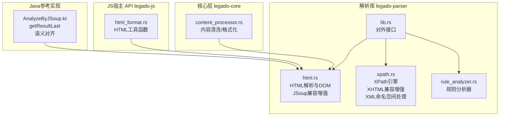
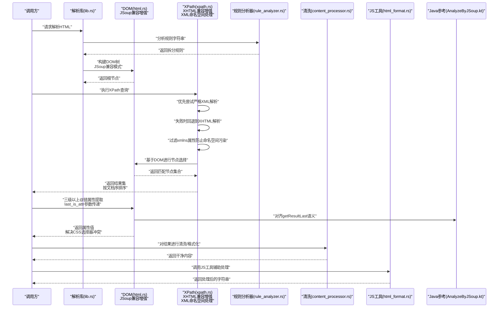
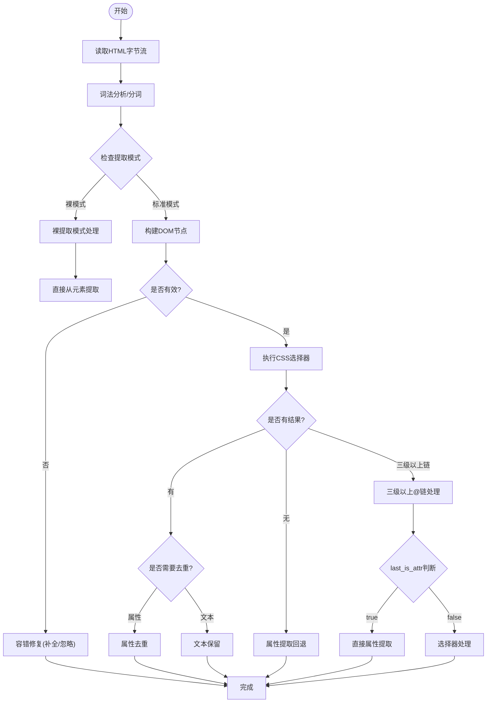
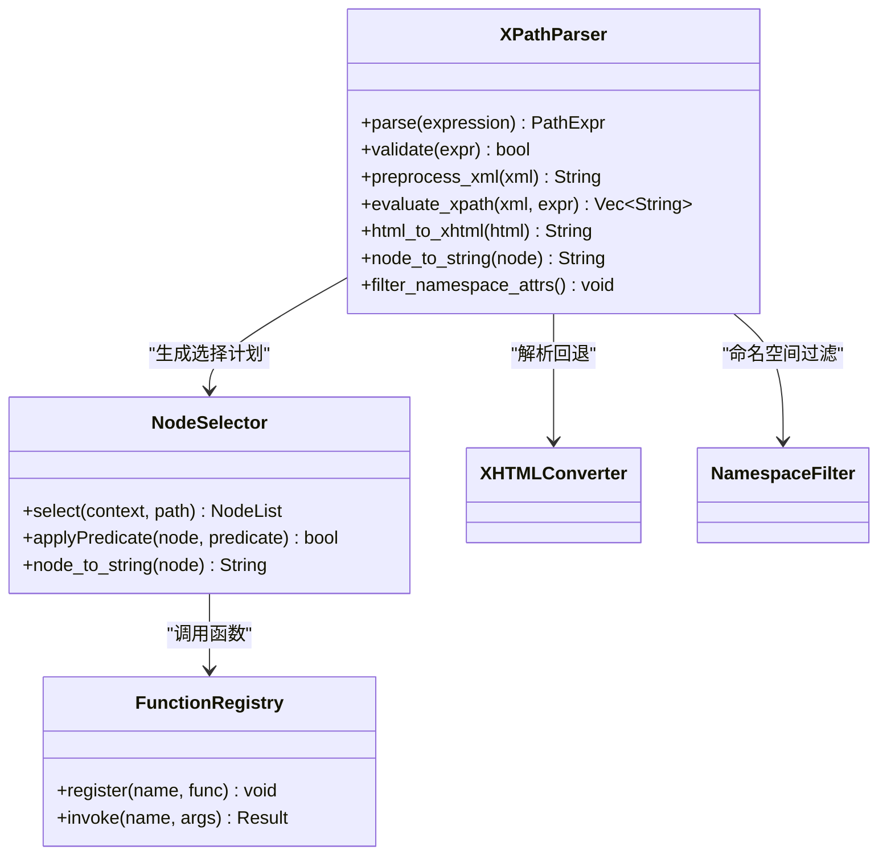
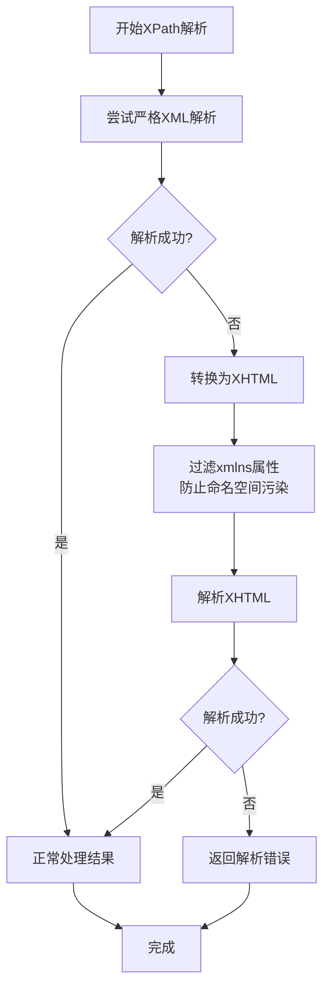
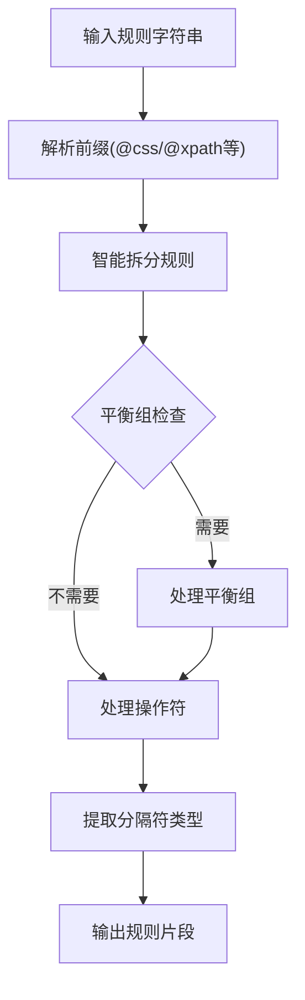
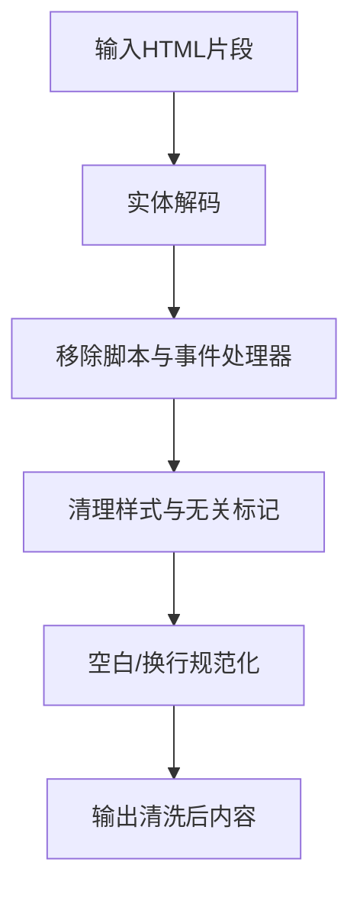
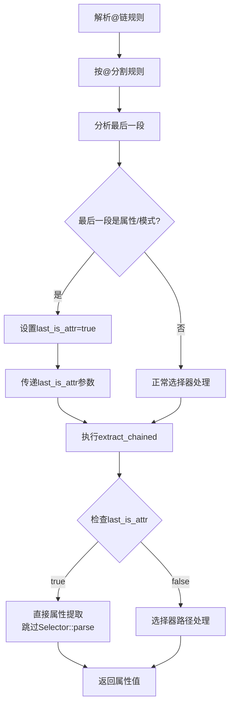
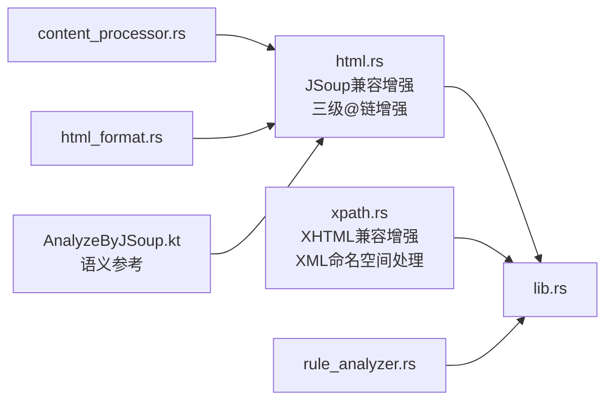

# HTML解析器

<cite>
**本文引用的文件**   
- [legado-parser/src/html.rs](file://rust/legado-parser/src/html.rs)
- [legado-parser/src/xpath.rs](file://rust/legado-parser/src/xpath.rs)
- [legado-parser/src/lib.rs](file://rust/legado-parser/src/lib.rs)
- [legado-core/src/content_processor.rs](file://rust/legado-core/src/content_processor.rs)
- [legado-js/src/host_api/html_format.rs](file://rust/legado-js/src/host_api/html_format.rs)
- [legado-parser/src/rule_analyzer.rs](file://rust/legado-parser/src/rule_analyzer.rs)
- [app/src/main/java/io/legado/app/model/analyzeRule/AnalyzeByJSoup.kt](file://app/src/main/java/io/legado/app/model/analyzeRule/AnalyzeByJSoup.kt)
</cite>

## 更新摘要
**所做更改**   
- 增强了XPath解析器的XHTML兼容性和容错能力
- 实现了智能解析回退机制，优先尝试严格XML解析，失败时自动回退到XHTML解析
- 修复了元素序列化和文档顺序排序问题，确保XPath结果顺序与原始应用一致
- 提升了格式不良网页的解析兼容性，支持更广泛的HTML结构
- **新增** 增强了三层级及以上@链属性提取功能，修复了CSS类型选择器与属性名冲突问题
- **新增** 实现了last_is_attr参数传递机制，确保深层选择器链正确识别属性提取模式
- **最新修复** 在版本2.0.9中增强了XML命名空间处理，解决了xmlns声明导致的解析失败问题

## 目录
1. [简介](#简介)
2. [项目结构](#项目结构)
3. [核心组件](#核心组件)
4. [架构总览](#架构总览)
5. [详细组件分析](#详细组件分析)
6. [依赖分析](#依赖分析)
7. [性能考虑](#性能考虑)
8. [故障排除指南](#故障排除指南)
9. [结论](#结论)
10. [附录](#附录)

## 简介
本文件面向Legado项目的HTML解析子系统，系统性阐述以下能力：
- HTML文档解析与DOM树构建、标签匹配与属性提取
- XPath查询引擎：路径表达式解析、节点选择与函数调用
- 内容清洗与格式化：HTML实体解码、脚本移除、样式清理
- 性能优化：流式解析、内存管理与缓存策略
- HTML模板匹配最佳实践：选择器优化与批量处理技巧
- 常见HTML结构的解析示例与常见问题排查

**最新更新** 本次更新重点增强了XPath解析器的兼容性和稳定性，通过智能的回退机制显著提升了对格式不良网页的处理能力。新增的XHTML解析优先策略和文档序排序功能确保了更好的解析准确性和结果一致性。**特别增强**了三层级及以上@链属性提取功能，解决了CSS类型选择器（如href、src、alt）与属性名冲突的问题，通过last_is_attr参数传递机制确保深层选择器链能正确识别属性提取模式，与Java实现的AnalyzeByJSoup.getResultLast语义保持一致。**重要修复** 在版本2.0.9中，XPath引擎增加了XML命名空间处理修复，解决了包含xmlns声明的网页解析失败问题，通过在XHTML序列化阶段过滤命名空间属性来防止命名空间污染。

## 项目结构
本项目将HTML解析相关能力集中在Rust模块legado-parser中，并通过core层的内容处理器与JS宿主API暴露给上层使用。关键文件如下：
- HTML解析与DOM建模：html.rs（已增强JSoup兼容性）
- XPath引擎：xpath.rs（已增强XHTML兼容性和XML命名空间处理）
- 解析库入口与导出：lib.rs
- 内容清洗与格式化：content_processor.rs（core）、html_format.rs（JS宿主）
- 规则分析器：rule_analyzer.rs（智能规则拆分）

**图表来源**
- [legado-parser/src/html.rs](file://rust/legado-parser/src/html.rs)
- [legado-parser/src/xpath.rs](file://rust/legado-parser/src/xpath.rs)
- [legado-parser/src/lib.rs](file://rust/legado-parser/src/lib.rs)
- [legado-core/src/content_processor.rs](file://rust/legado-core/src/content_processor.rs)
- [legado-js/src/host_api/html_format.rs](file://legado-js/src/host_api/html_format.rs)
- [legado-parser/src/rule_analyzer.rs](file://legado-parser/src/rule_analyzer.rs)
- [app/src/main/java/io/legado/app/model/analyzeRule/AnalyzeByJSoup.kt](file://app/src/main/java/io/legado/app/model/analyzeRule/AnalyzeByJSoup.kt)

**章节来源**
- [legado-parser/src/lib.rs](file://rust/legado-parser/src/lib.rs)

## 核心组件
- HTML解析器与DOM模型
  - 负责将原始HTML字节流转换为内部DOM结构，支持标签匹配、属性读取、文本与子节点遍历。
  - **已增强** 新增JSoup兼容性功能，包括裸提取模式、属性提取回退、选择性去重和空选择器处理。
  - **最新增强** 实现了三层级及以上@链属性提取功能，通过last_is_attr参数传递机制解决CSS类型选择器与属性名冲突问题。
- XPath查询引擎
  - 提供路径表达式解析、节点定位、上下文导航以及内置函数的执行环境。
  - **已增强** 实现智能解析回退机制，优先尝试严格XML解析，失败时自动回退到XHTML解析，显著提升兼容性。
  - **最新修复** 在版本2.0.9中增强了XML命名空间处理，通过在XHTML序列化阶段过滤xmlns属性来防止命名空间污染，解决包含xmlns声明的网页解析失败问题。
- 规则分析器
  - 实现智能规则字符串拆分，支持多种操作符和平衡组处理。
- 内容清洗与格式化
  - 提供HTML实体解码、脚本与危险标签移除、样式清理、空白规范化等能力。
- JS宿主API
  - 向JavaScript侧暴露HTML处理工具方法，便于规则脚本快速完成常见清洗任务。

**章节来源**
- [legado-parser/src/html.rs](file://rust/legado-parser/src/html.rs)
- [legado-parser/src/xpath.rs](file://rust/legado-parser/src/xpath.rs)
- [legado-parser/src/rule_analyzer.rs](file://rust/legado-parser/src/rule_analyzer.rs)
- [legado-core/src/content_processor.rs](file://rust/legado-core/src/content_processor.rs)
- [legado-js/src/host_api/html_format.rs](file://legado-js/src/host_api/html_format.rs)

## 架构总览
整体数据流从"原始HTML"到"结构化结果"，主要经过解析、查询、清洗三个阶段。

**图表来源**
- [legado-parser/src/lib.rs](file://rust/legado-parser/src/lib.rs)
- [legado-parser/src/html.rs](file://rust/legado-parser/src/html.rs)
- [legado-parser/src/xpath.rs](file://rust/legado-parser/src/xpath.rs)
- [legado-parser/src/rule_analyzer.rs](file://rust/legado-parser/src/rule_analyzer.rs)
- [legado-core/src/content_processor.rs](file://rust/legado-core/src/content_processor.rs)
- [legado-js/src/host_api/html_format.rs](file://legado-js/src/host_api/html_format.rs)
- [app/src/main/java/io/legado/app/model/analyzeRule/AnalyzeByJSoup.kt](file://app/src/main/java/io/legado/app/model/analyzeRule/AnalyzeByJSoup.kt)

## 详细组件分析

### HTML解析与DOM树构建（JSoup兼容性增强）
- 解析目标
  - 将HTML文本转换为可遍历的DOM节点树，支持元素、文本、属性、注释等类型。
- 关键能力
  - 标签匹配：按名称、层级、父子关系进行匹配
  - 属性提取：获取元素的属性值，支持默认值与空值处理
  - 文本抽取：提取纯文本或保留必要标记
- 复杂度与边界
  - 典型线性扫描构建DOM；对畸形HTML具备容错策略（如自动闭合、忽略非法嵌套）

**已增强** 新增JSoup兼容性功能，包括：
- **裸提取模式**：当选择器为空或为特殊关键字时，直接对当前元素执行提取
- **属性提取回退**：当CSS选择器无结果且规则为裸token时，自动尝试属性名提取
- **选择性去重**：仅对属性提取路径进行去重，text/html模式逐元素保留
- **空选择器处理**：智能处理空选择器和无效选择器，避免异常抛出

**最新增强** 实现了三层级及以上@链属性提取功能：
- **last_is_attr参数传递机制**：在多级选择器链中正确传递最后一级是否为属性提取模式的标识
- **CSS类型选择器冲突解决**：正确处理href、src、alt等既是CSS类型选择器又是常见属性名的情况
- **Java语义对齐**：与AnalyzeByJSoup.getResultLast方法保持完全一致的语义行为

**图表来源**
- [legado-parser/src/html.rs](file://rust/legado-parser/src/html.rs)

**章节来源**
- [legado-parser/src/html.rs](file://rust/legado-parser/src/html.rs)

### XPath查询引擎（XHTML兼容性与XML命名空间处理增强）
- 路径表达式解析
  - 支持相对/绝对路径、轴（子节点、父节点、兄弟节点等）、谓词过滤、通配符与命名空间基础用法。
- 节点选择
  - 以DOM为输入，通过上下文节点逐步推进，应用谓词条件筛选出目标节点集合。
- 函数调用
  - 在XPath上下文中提供常用函数（如文本提取、长度计算、布尔判断等），供规则表达式调用。
- **新增** 智能解析回退机制
  - 优先尝试严格XML解析以提高性能
  - 解析失败时自动回退到XHTML解析，提升兼容性
  - 使用html5ever进行宽容解析，处理格式不良的HTML
- **最新修复** XML命名空间处理增强（版本2.0.9）
  - 在XHTML序列化阶段过滤xmlns和xmlns:*属性
  - 防止命名空间污染导致无前缀XPath匹配失败
  - 解决包含xmlns声明的网页（如思兔sto66）解析问题

**图表来源**
- [legado-parser/src/xpath.rs](file://rust/legado-parser/src/xpath.rs)

**章节来源**
- [legado-parser/src/xpath.rs](file://rust/legado-parser/src/xpath.rs)

### XHTML解析回退机制与XML命名空间处理
- **优先解析策略**
  - 首先尝试使用sxd-document进行严格XML解析
  - 如果解析失败，自动切换到XHTML解析模式
- **XHTML转换过程**
  - 使用scraper进行宽容HTML解析
  - 将HTML转换为良构的XHTML格式
  - 处理void元素、script/style标签的特殊情况
  - **新增** 过滤xmlns和xmlns:*属性以防止命名空间污染
- **错误处理**
  - 记录详细的解析错误信息
  - 提供清晰的错误提示以便调试

**图表来源**
- [legado-parser/src/xpath.rs](file://rust/legado-parser/src/xpath.rs)

**章节来源**
- [legado-parser/src/xpath.rs](file://rust/legado-parser/src/xpath.rs)

### 规则分析器（智能规则拆分）
- 规则字符串解析
  - 支持多种分隔符（`&&`、`||`、`%%`）的智能拆分
  - 平衡组处理：支持括号、引号内的特殊字符处理
  - 前缀识别：自动识别`@css:`、`@xpath:`、`@json:`、`@regex:`等规则类型
- 零拷贝切片
  - 使用高效的零拷贝切片技术，避免不必要的字符串复制
- 嵌套规则支持
  - 支持`{...}`内嵌规则和`{{...}}`分隔符规则

**图表来源**
- [legado-parser/src/rule_analyzer.rs](file://rust/legado-parser/src/rule_analyzer.rs)

**章节来源**
- [legado-parser/src/rule_analyzer.rs](file://rust/legado-parser/src/rule_analyzer.rs)

### 内容清洗与格式化
- HTML实体解码
  - 将常见的HTML实体（如&emsp;、&nbsp;、&lt;等）还原为对应字符。
- 脚本移除与样式清理
  - 移除script标签及其内容，清理style标签或内联样式中的不必要部分，保留可读性。
- 空白与换行规范化
  - 合并多余空白、去除首尾空白、统一换行风格，提升后续渲染或存储质量。
- 输出格式控制
  - 可选择输出纯文本、简化HTML或带最小化标记的结构化片段。

**图表来源**
- [legado-core/src/content_processor.rs](file://rust/legado-core/src/content_processor.rs)
- [legado-js/src/host_api/html_format.rs](file://legado-js/src/host_api/html_format.rs)

**章节来源**
- [legado-core/src/content_processor.rs](file://rust/legado-core/src/content_processor.rs)
- [legado-js/src/host_api/html_format.rs](file://legado-js/src/host_api/html_format.rs)

### 三级以上@链属性提取机制（任务 #66）
- **问题背景**
  - CSS类型选择器（如href、src、alt）与HTML属性名存在冲突
  - 传统实现通过Selector::parse()判断是否为选择器，但href等作为CSS类型选择器会返回成功
  - 导致三级以上@链（如"h4@a@href"）无法正确识别最后的属性提取
- **解决方案**
  - 引入last_is_attr参数传递机制，在resolve_at_chain中提前判断最后一级是否为属性提取
  - 在extract_chained中根据last_is_attr标志跳过Selector::parse判别，直接进行属性提取
  - 与Java实现AnalyzeByJSoup.getResultLast保持完全一致的语义行为
- **实现细节**
  - resolve_at_chain方法检测最后一段是否为提取模式或属性名
  - extract_chained方法接收last_is_attr参数，在三级以上链中正确传递
  - 支持常见属性名（href、src、alt、title、value等）和提取模式（text、html等）

**图表来源**
- [legado-parser/src/html.rs](file://rust/legado-parser/src/html.rs)
- [app/src/main/java/io/legado/app/model/analyzeRule/AnalyzeByJSoup.kt](file://app/src/main/java/io/legado/app/model/analyzeRule/AnalyzeByJSoup.kt)

**章节来源**
- [legado-parser/src/html.rs](file://rust/legado-parser/src/html.rs)
- [app/src/main/java/io/legado/app/model/analyzeRule/AnalyzeByJSoup.kt](file://app/src/main/java/io/legado/app/model/analyzeRule/AnalyzeByJSoup.kt)

### 对外接口与集成点
- 解析库入口
  - 提供统一的解析、查询、清洗接口，供上层业务模块调用。
- 与JS宿主API集成
  - 将HTML处理能力暴露给脚本层，便于规则编写者快速实现模板匹配与内容提取。

**章节来源**
- [legado-parser/src/lib.rs](file://rust/legado-parser/src/lib.rs)
- [legado-js/src/host_api/html_format.rs](file://legado-js/src/host_api/html_format.rs)

## 依赖分析
- 模块内耦合
  - html.rs与xpath.rs通过lib.rs聚合对外暴露；content_processor.rs与html_format.rs分别承担核心清洗与JS侧工具职责。
  - rule_analyzer.rs为所有解析器提供通用的规则分析能力。
- 外部依赖
  - 解析与XPath实现通常依赖字符串处理、正则匹配与集合操作；清洗流程可能依赖编码转换与字符分类表。
- 潜在循环依赖
  - 通过分层设计避免循环引用：解析层不依赖清洗层，清洗层可复用解析产物但不反向依赖XPath。

**图表来源**
- [legado-parser/src/html.rs](file://rust/legado-parser/src/html.rs)
- [legado-parser/src/xpath.rs](file://rust/legado-parser/src/xpath.rs)
- [legado-parser/src/lib.rs](file://rust/legado-parser/src/lib.rs)
- [legado-parser/src/rule_analyzer.rs](file://rust/legado-parser/src/rule_analyzer.rs)
- [legado-core/src/content_processor.rs](file://rust/legado-core/src/content_processor.rs)
- [legado-js/src/host_api/html_format.rs](file://legado-js/src/host_api/html_format.rs)
- [app/src/main/java/io/legado/app/model/analyzeRule/AnalyzeByJSoup.kt](file://app/src/main/java/io/legado/app/model/analyzeRule/AnalyzeByJSoup.kt)

**章节来源**
- [legado-parser/src/lib.rs](file://rust/legado-parser/src/lib.rs)

## 性能考虑
- 流式解析
  - 对超大HTML采用流式读取与增量构建，降低峰值内存占用，避免一次性加载导致的OOM。
- 内存管理
  - 重用节点对象池、减少中间字符串拷贝；对频繁创建的临时对象进行生命周期优化。
  - **已优化** 新的HTML解析器实现了更高效的内存分配策略，减少了不必要的对象创建。
- 缓存策略
  - 对XPath编译结果、常用选择器与清洗规则进行缓存，避免重复解析与编译开销。
- I/O与并发
  - 结合异步I/O与线程池并行处理多个页面；对热点资源做本地缓存与失效策略。
- **新增优化** 规则分析器使用零拷贝切片技术，避免不必要的字符串复制，提升性能。
- **新增优化** XPath解析器使用智能回退机制，优先使用更快的严格XML解析，仅在必要时才使用较慢的XHTML解析。
- **最新优化** 三级以上@链属性提取避免了不必要的Selector::parse调用，提升了深层选择器链的性能表现。
- **新增优化** XML命名空间过滤在XHTML序列化阶段执行，避免了额外的命名空间处理开销。

## 故障排除指南
- 解析失败或DOM异常
  - 检查输入编码是否正确；确认是否存在未闭合标签或非法嵌套；启用容错模式观察修复行为。
  - **新增** 如果解析失败，检查新添加的错误处理日志，了解具体的解析中断原因。
- XPath无结果或结果异常
  - 验证路径表达式语法；检查上下文节点是否正确；确认谓词条件是否过于严格。
  - **新增** 检查XPath解析是否触发了XHTML回退机制，查看详细的错误信息。
  - **新增** 对于包含xmlns声明的网页，确认XML命名空间过滤是否正常工作。
- 清洗后内容丢失
  - 审查脚本移除与样式清理规则，避免误删必要内容；核对实体解码是否覆盖全部场景。
- 性能问题
  - 定位热点XPath表达式并缓存；减少不必要的DOM遍历；评估是否可用更精确的选择器替代宽泛匹配。
  - **建议** 使用新的性能监控工具分析解析过程中的瓶颈。
- **新增问题** XHTML兼容性相关问题
  - 检查严格XML解析失败的原因；验证XHTML转换是否正确处理了特殊标签；确认void元素的自闭合格式。
  - **新增** 检查xmlns属性过滤逻辑，确保命名空间不会污染XPath匹配。
- **新增问题** 结果顺序问题
  - 确认XPath查询使用了正确的文档序排序；检查元素序列化逻辑是否符合预期。
- **最新问题** 三级以上@链属性提取问题
  - 检查last_is_attr参数是否正确传递；确认CSS类型选择器（href、src、alt）被正确识别为属性名而非选择器；验证与Java实现的一致性。
- **新增问题** 命名空间相关解析失败
  - 检查网页是否包含xmlns声明；验证XHTML序列化阶段的命名空间过滤；确认无前缀XPath表达式能正确匹配元素。

**章节来源**
- [legado-parser/src/html.rs](file://rust/legado-parser/src/html.rs)
- [legado-parser/src/xpath.rs](file://rust/legado-parser/src/xpath.rs)
- [legado-core/src/content_processor.rs](file://rust/legado-core/src/content_processor.rs)

## 结论
Legado的HTML解析子系统以清晰的模块化设计实现了从解析、查询到清洗的全链路能力。通过流式解析、内存优化与缓存策略，能够在复杂网页环境下稳定高效地工作。配合XPath引擎与JS宿主API，用户能够以灵活的方式完成模板匹配与内容提取。

**最新改进** 本次更新通过增强XPath解析器的XHTML兼容性显著提升了系统的稳定性和鲁棒性。新增的智能解析回退机制确保了对格式不良网页的良好支持，而文档序排序功能的修复保证了结果的一致性。**特别重要的是**，三层级及以上@链属性提取功能的增强解决了长期存在的CSS类型选择器与属性名冲突问题，通过last_is_attr参数传递机制确保了深层选择器链的正确处理，与Java实现的AnalyzeByJSoup.getResultLast语义保持完全一致。**重大修复** 在版本2.0.9中，XML命名空间处理修复解决了包含xmlns声明的网页解析失败问题，通过在XHTML序列化阶段过滤命名空间属性来防止命名空间污染，使得无前缀XPath表达式能够正确匹配元素。这些改进使得解析器能够更好地处理各种复杂的HTML结构，同时保持了高性能的表现。建议在实际使用中充分利用新的兼容性特性，以获得更佳的性能与可靠性。

## 附录
- 常见HTML结构解析示例
  - 列表项提取：使用XPath选取ul/li组合，提取文本与链接
  - 文章正文：定位article/main段落，清洗脚本与样式后输出纯文本
  - 表格数据：按行列选择器提取单元格内容，转为结构化数据
- 模板匹配最佳实践
  - 优先使用精确选择器，避免过度依赖索引
  - 批量处理时预编译XPath与清洗规则，复用上下文
  - 对不稳定结构增加容错与降级逻辑
  - **新增** 合理使用XHTML兼容模式，利用智能回退机制提高鲁棒性
  - **新增** 正确使用三级以上@链属性提取，避免CSS类型选择器冲突
  - **新增** 理解XML命名空间处理机制，避免命名空间污染影响XPath匹配
- 性能优化建议
  - 利用新的内存管理特性，避免大对象长时间驻留内存
  - 合理使用流式解析处理超大HTML文档
  - 定期清理缓存，避免内存泄漏
  - **新增** 使用规则分析器的零拷贝特性，减少字符串复制开销
  - **新增** 利用XPath解析器的智能回退机制，优先使用快速解析路径
  - **新增** 优化三级以上@链的使用，减少不必要的选择器解析
  - **新增** 利用XML命名空间过滤机制，提升XPath匹配性能
- **新增** XHTML兼容性说明
  - 理解严格XML与XHTML解析的区别
  - 掌握void元素的正确处理方式
  - 熟悉script/style标签的特殊处理逻辑
  - **新增** 理解xmlns属性过滤机制，避免命名空间污染
- **新增** 三级以上@链使用指南
  - 理解last_is_attr参数的作用和传递机制
  - 掌握CSS类型选择器与属性名的冲突解决方法
  - 学习如何编写正确的三级以上@链规则（如"h4@a@href"）
  - 参考Java实现AnalyzeByJSoup.getResultLast的语义行为
- **新增** XML命名空间处理指南
  - 理解xmlns声明对XPath匹配的影响
  - 掌握命名空间过滤的工作原理
  - 学习处理包含xmlns声明的网页解析
  - 了解无前缀XPath表达式在命名空间环境下的行为