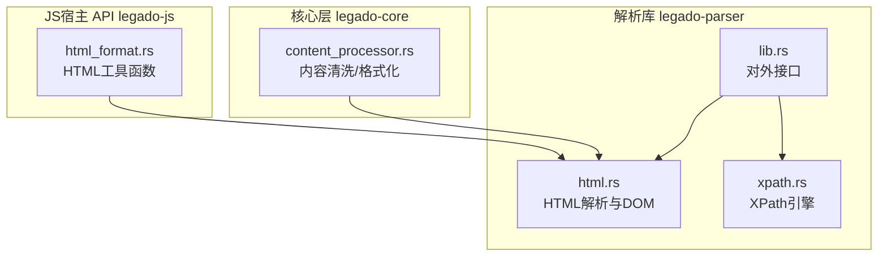
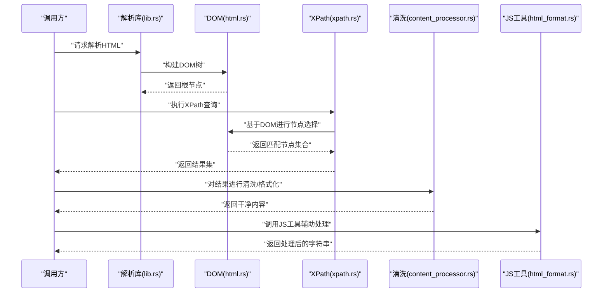
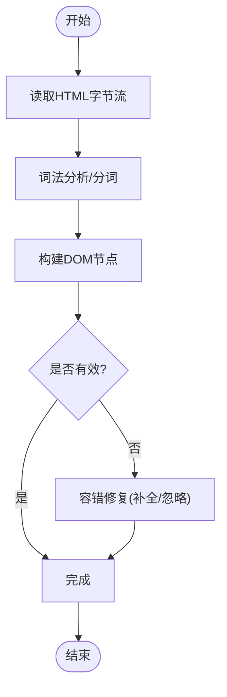
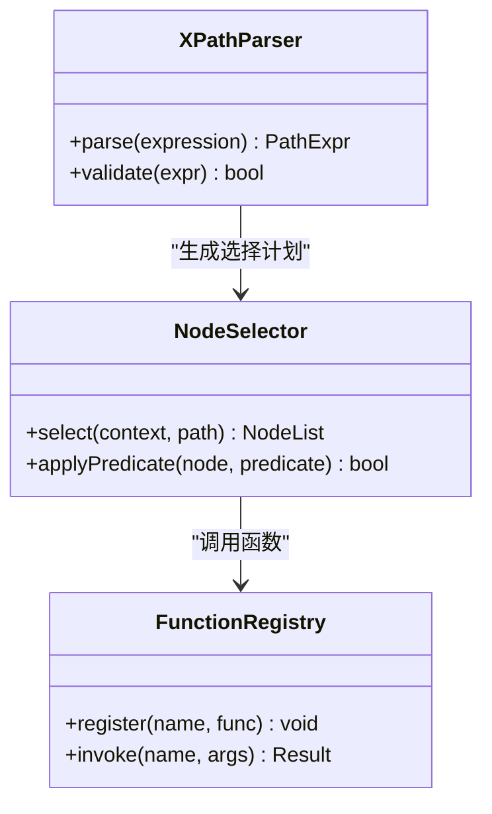
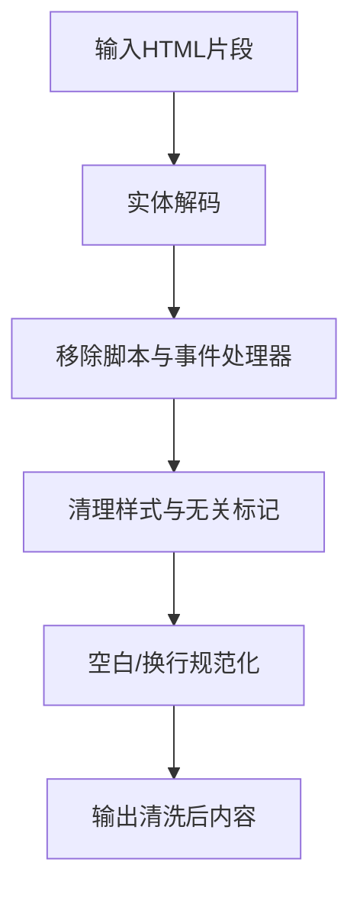
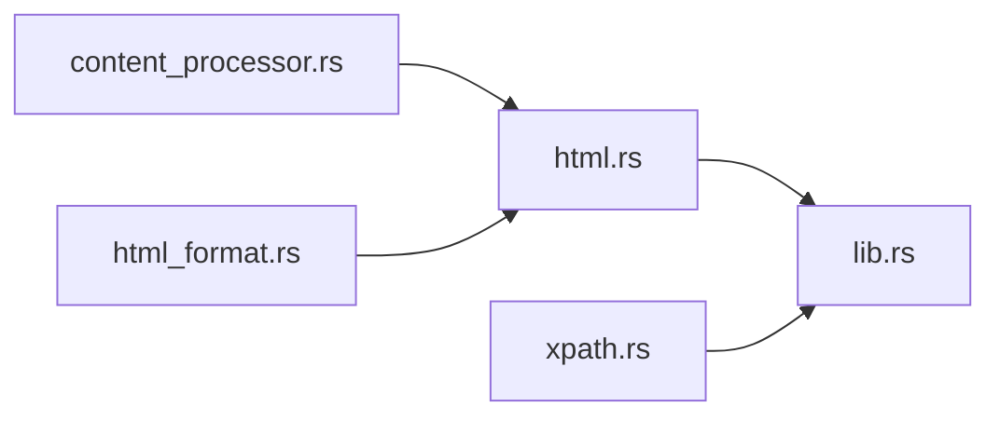

# HTML解析器

<cite>
**本文引用的文件**   
- [legado-parser/src/html.rs](file://rust/legado-parser/src/html.rs)
- [legado-parser/src/xpath.rs](file://rust/legado-parser/src/xpath.rs)
- [legado-parser/src/lib.rs](file://rust/legado-parser/src/lib.rs)
- [legado-core/src/content_processor.rs](file://rust/legado-core/src/content_processor.rs)
- [legado-js/src/host_api/html_format.rs](file://rust/legado-js/src/host_api/html_format.rs)
</cite>

## 目录
1. [简介](#简介)
2. [项目结构](#项目结构)
3. [核心组件](#核心组件)
4. [架构总览](#架构总览)
5. [详细组件分析](#详细组件分析)
6. [依赖分析](#依赖分析)
7. [性能考虑](#性能考虑)
8. [故障排除指南](#故障排除指南)
9. [结论](#结论)
10. [附录](#附录)

## 简介
本文件面向Legado项目的HTML解析子系统，系统性阐述以下能力：
- HTML文档解析与DOM树构建、标签匹配与属性提取
- XPath查询引擎：路径表达式解析、节点选择与函数调用
- 内容清洗与格式化：HTML实体解码、脚本移除、样式清理
- 性能优化：流式解析、内存管理与缓存策略
- HTML模板匹配最佳实践：选择器优化与批量处理技巧
- 常见HTML结构的解析示例与常见问题排查

## 项目结构
本项目将HTML解析相关能力集中在Rust模块legado-parser中，并通过core层的内容处理器与JS宿主API暴露给上层使用。关键文件如下：
- HTML解析与DOM建模：html.rs
- XPath引擎：xpath.rs
- 解析库入口与导出：lib.rs
- 内容清洗与格式化：content_processor.rs（core）、html_format.rs（JS宿主）

图表来源
- [legado-parser/src/html.rs](file://rust/legado-parser/src/html.rs)
- [legado-parser/src/xpath.rs](file://rust/legado-parser/src/xpath.rs)
- [legado-parser/src/lib.rs](file://rust/legado-parser/src/lib.rs)
- [legado-core/src/content_processor.rs](file://rust/legado-core/src/content_processor.rs)
- [legado-js/src/host_api/html_format.rs](file://rust/legado-js/src/host_api/html_format.rs)

章节来源
- [legado-parser/src/lib.rs](file://rust/legado-parser/src/lib.rs)

## 核心组件
- HTML解析器与DOM模型
  - 负责将原始HTML字节流转换为内部DOM结构，支持标签匹配、属性读取、文本与子节点遍历。
- XPath查询引擎
  - 提供路径表达式解析、节点定位、上下文导航以及内置函数的执行环境。
- 内容清洗与格式化
  - 提供HTML实体解码、脚本与危险标签移除、样式清理、空白规范化等能力。
- JS宿主API
  - 向JavaScript侧暴露HTML处理工具方法，便于规则脚本快速完成常见清洗任务。

章节来源
- [legado-parser/src/html.rs](file://rust/legado-parser/src/html.rs)
- [legado-parser/src/xpath.rs](file://rust/legado-parser/src/xpath.rs)
- [legado-core/src/content_processor.rs](file://rust/legado-core/src/content_processor.rs)
- [legado-js/src/host_api/html_format.rs](file://rust/legado-js/src/host_api/html_format.rs)

## 架构总览
整体数据流从“原始HTML”到“结构化结果”，主要经过解析、查询、清洗三个阶段。

图表来源
- [legado-parser/src/lib.rs](file://rust/legado-parser/src/lib.rs)
- [legado-parser/src/html.rs](file://rust/legado-parser/src/html.rs)
- [legado-parser/src/xpath.rs](file://rust/legado-parser/src/xpath.rs)
- [legado-core/src/content_processor.rs](file://rust/legado-core/src/content_processor.rs)
- [legado-js/src/host_api/html_format.rs](file://rust/legado-js/src/host_api/html_format.rs)

## 详细组件分析

### HTML解析与DOM树构建
- 解析目标
  - 将HTML文本转换为可遍历的DOM节点树，支持元素、文本、属性、注释等类型。
- 关键能力
  - 标签匹配：按名称、层级、父子关系进行匹配
  - 属性提取：获取元素的属性值，支持默认值与空值处理
  - 文本抽取：提取纯文本或保留必要标记
- 复杂度与边界
  - 典型线性扫描构建DOM；对畸形HTML具备容错策略（如自动闭合、忽略非法嵌套）

图表来源
- [legado-parser/src/html.rs](file://rust/legado-parser/src/html.rs)

章节来源
- [legado-parser/src/html.rs](file://rust/legado-parser/src/html.rs)

### XPath查询引擎
- 路径表达式解析
  - 支持相对/绝对路径、轴（子节点、父节点、兄弟节点等）、谓词过滤、通配符与命名空间基础用法。
- 节点选择
  - 以DOM为输入，通过上下文节点逐步推进，应用谓词条件筛选出目标节点集合。
- 函数调用
  - 在XPath上下文中提供常用函数（如文本提取、长度计算、布尔判断等），供规则表达式调用。

图表来源
- [legado-parser/src/xpath.rs](file://rust/legado-parser/src/xpath.rs)

章节来源
- [legado-parser/src/xpath.rs](file://rust/legado-parser/src/xpath.rs)

### 内容清洗与格式化
- HTML实体解码
  - 将常见的HTML实体（如&emsp;、&nbsp;、&lt;等）还原为对应字符。
- 脚本移除与样式清理
  - 移除script标签及其内容，清理style标签或内联样式中的不必要部分，保留可读性。
- 空白与换行规范化
  - 合并多余空白、去除首尾空白、统一换行风格，提升后续渲染或存储质量。
- 输出格式控制
  - 可选择输出纯文本、简化HTML或带最小化标记的结构化片段。

图表来源
- [legado-core/src/content_processor.rs](file://rust/legado-core/src/content_processor.rs)
- [legado-js/src/host_api/html_format.rs](file://rust/legado-js/src/host_api/html_format.rs)

章节来源
- [legado-core/src/content_processor.rs](file://rust/legado-core/src/content_processor.rs)
- [legado-js/src/host_api/html_format.rs](file://rust/legado-js/src/host_api/html_format.rs)

### 对外接口与集成点
- 解析库入口
  - 提供统一的解析、查询、清洗接口，供上层业务模块调用。
- 与JS宿主API集成
  - 将HTML处理能力暴露给脚本层，便于规则编写者快速实现模板匹配与内容提取。

章节来源
- [legado-parser/src/lib.rs](file://rust/legado-parser/src/lib.rs)
- [legado-js/src/host_api/html_format.rs](file://rust/legado-js/src/host_api/html_format.rs)

## 依赖分析
- 模块内耦合
  - html.rs与xpath.rs通过lib.rs聚合对外暴露；content_processor.rs与html_format.rs分别承担核心清洗与JS侧工具职责。
- 外部依赖
  - 解析与XPath实现通常依赖字符串处理、正则匹配与集合操作；清洗流程可能依赖编码转换与字符分类表。
- 潜在循环依赖
  - 通过分层设计避免循环引用：解析层不依赖清洗层，清洗层可复用解析产物但不反向依赖XPath。

图表来源
- [legado-parser/src/html.rs](file://rust/legado-parser/src/html.rs)
- [legado-parser/src/xpath.rs](file://rust/legado-parser/src/xpath.rs)
- [legado-parser/src/lib.rs](file://rust/legado-parser/src/lib.rs)
- [legado-core/src/content_processor.rs](file://rust/legado-core/src/content_processor.rs)
- [legado-js/src/host_api/html_format.rs](file://rust/legado-js/src/host_api/html_format.rs)

章节来源
- [legado-parser/src/lib.rs](file://rust/legado-parser/src/lib.rs)

## 性能考虑
- 流式解析
  - 对超大HTML采用流式读取与增量构建，降低峰值内存占用，避免一次性加载导致的OOM。
- 内存管理
  - 重用节点对象池、减少中间字符串拷贝；对频繁创建的临时对象进行生命周期优化。
- 缓存策略
  - 对XPath编译结果、常用选择器与清洗规则进行缓存，避免重复解析与编译开销。
- I/O与并发
  - 结合异步I/O与线程池并行处理多个页面；对热点资源做本地缓存与失效策略。

[本节为通用指导，不直接分析具体文件]

## 故障排除指南
- 解析失败或DOM异常
  - 检查输入编码是否正确；确认是否存在未闭合标签或非法嵌套；启用容错模式观察修复行为。
- XPath无结果或结果异常
  - 验证路径表达式语法；检查上下文节点是否正确；确认谓词条件是否过于严格。
- 清洗后内容丢失
  - 审查脚本移除与样式清理规则，避免误删必要内容；核对实体解码是否覆盖全部场景。
- 性能问题
  - 定位热点XPath表达式并缓存；减少不必要的DOM遍历；评估是否可用更精确的选择器替代宽泛匹配。

章节来源
- [legado-parser/src/html.rs](file://rust/legado-parser/src/html.rs)
- [legado-parser/src/xpath.rs](file://rust/legado-parser/src/xpath.rs)
- [legado-core/src/content_processor.rs](file://rust/legado-core/src/content_processor.rs)

## 结论
Legado的HTML解析子系统以清晰的模块化设计实现了从解析、查询到清洗的全链路能力。通过流式解析、内存优化与缓存策略，能够在复杂网页环境下稳定高效地工作。配合XPath引擎与JS宿主API，用户能够以灵活的方式完成模板匹配与内容提取。建议在实际使用中遵循选择器优化与批量处理的最佳实践，以获得更佳的性能与可维护性。

[本节为总结性内容，不直接分析具体文件]

## 附录
- 常见HTML结构解析示例
  - 列表项提取：使用XPath选取ul/li组合，提取文本与链接
  - 文章正文：定位article/main段落，清洗脚本与样式后输出纯文本
  - 表格数据：按行列选择器提取单元格内容，转为结构化数据
- 模板匹配最佳实践
  - 优先使用精确选择器，避免过度依赖索引
  - 批量处理时预编译XPath与清洗规则，复用上下文
  - 对不稳定结构增加容错与降级逻辑

[本节为概念性内容，不直接分析具体文件]