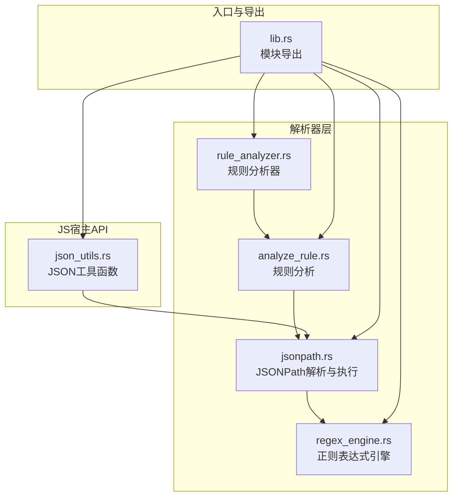
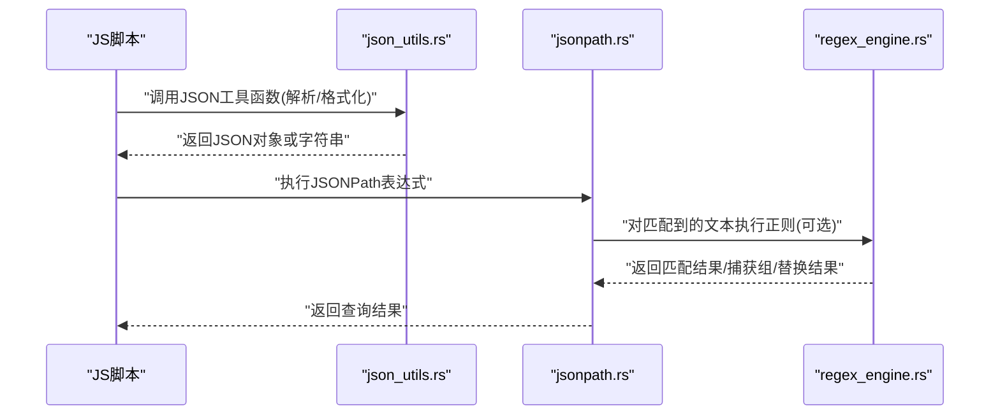
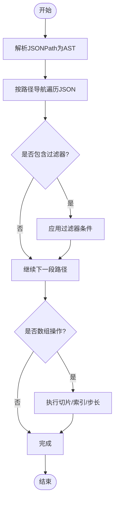
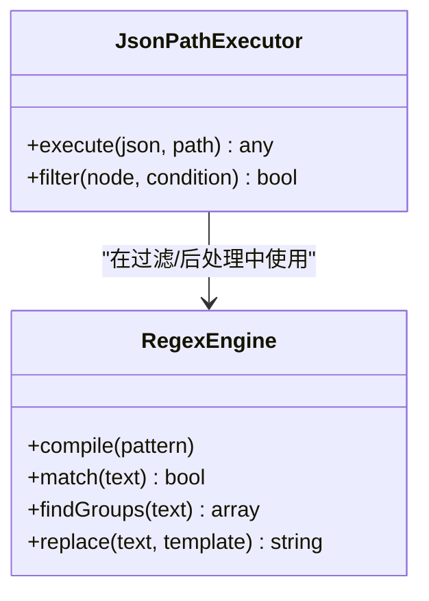
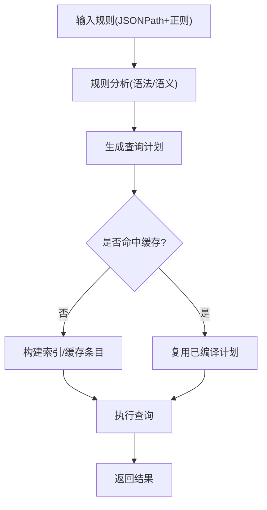
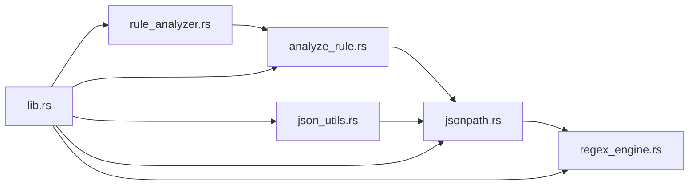

# JSON处理器

<cite>
**本文引用的文件**   
- [jsonpath.rs](file://rust/legado-parser/src/jsonpath.rs)
- [regex_engine.rs](file://rust/legado-parser/src/regex_engine.rs)
- [json_utils.rs](file://rust/legado-js/src/host_api/json_utils.rs)
- [lib.rs](file://rust/legado-parser/src/lib.rs)
- [analyze_rule.rs](file://rust/legado-parser/src/analyze_rule.rs)
- [rule_analyzer.rs](file://rust/legado-parser/src/rule_analyzer.rs)
</cite>

## 目录
1. [简介](#简介)
2. [项目结构](#项目结构)
3. [核心组件](#核心组件)
4. [架构总览](#架构总览)
5. [详细组件分析](#详细组件分析)
6. [依赖关系分析](#依赖关系分析)
7. [性能考虑](#性能考虑)
8. [故障排查指南](#故障排查指南)
9. [结论](#结论)
10. [附录](#附录)

## 简介
本文件面向JSON处理器的实现与使用，重点覆盖以下方面：
- JSONPath表达式解析与执行：路径导航、过滤器应用、数组操作。
- JSON数据转换机制：类型映射、格式化与序列化策略。
- 正则表达式引擎集成：模式匹配、捕获组提取与替换。
- 性能优化：索引构建、查询优化与结果缓存。
- 最佳实践：大文件处理与内存控制。
- 复杂JSON结构的解析示例与错误处理方案。

## 项目结构
本项目在Rust层提供JSON解析与规则分析能力，并通过JS宿主API暴露给上层脚本环境。关键模块如下：
- 解析器层（legado-parser）：包含JSONPath、XPath、正则引擎与规则分析器。
- JS宿主API（legado-js）：封装JSON工具函数，供JavaScript调用。
- 规则分析与编译（analyze_rule、rule_analyzer）：将用户定义的规则转换为可执行表达式或查询计划。

图表来源
- [jsonpath.rs:1-200](file://rust/legado-parser/src/jsonpath.rs#L1-L200)
- [regex_engine.rs:1-200](file://rust/legado-parser/src/regex_engine.rs#L1-L200)
- [analyze_rule.rs:1-200](file://rust/legado-parser/src/analyze_rule.rs#L1-L200)
- [rule_analyzer.rs:1-200](file://rust/legado-parser/src/rule_analyzer.rs#L1-L200)
- [json_utils.rs:1-200](file://rust/legado-js/src/host_api/json_utils.rs#L1-L200)
- [lib.rs:1-200](file://rust/legado-parser/src/lib.rs#L1-L200)

章节来源
- [lib.rs:1-200](file://rust/legado-parser/src/lib.rs#L1-L200)

## 核心组件
- JSONPath解析与执行：负责将JSONPath字符串解析为内部节点树，并在JSON对象上执行路径导航、过滤与数组切片等操作。
- 正则表达式引擎：提供模式匹配、捕获组提取与替换功能，常用于文本字段清洗与抽取。
- JSON工具函数：在JS侧暴露的便捷方法，用于快速进行JSON序列化、反序列化、类型转换与格式化输出。
- 规则分析器：将用户规则（如源配置中的JSONPath与正则组合）编译为可执行查询计划，提升重复查询效率。

章节来源
- [jsonpath.rs:1-200](file://rust/legado-parser/src/jsonpath.rs#L1-L200)
- [regex_engine.rs:1-200](file://rust/legado-parser/src/regex_engine.rs#L1-L200)
- [json_utils.rs:1-200](file://rust/legado-js/src/host_api/json_utils.rs#L1-L200)
- [analyze_rule.rs:1-200](file://rust/legado-parser/src/analyze_rule.rs#L1-L200)
- [rule_analyzer.rs:1-200](file://rust/legado-parser/src/rule_analyzer.rs#L1-L200)

## 架构总览
下图展示了从JS调用到解析器执行的端到端流程，包括JSONPath与正则的组合使用。

图表来源
- [json_utils.rs:1-200](file://rust/legado-js/src/host_api/json_utils.rs#L1-L200)
- [jsonpath.rs:1-200](file://rust/legado-parser/src/jsonpath.rs#L1-L200)
- [regex_engine.rs:1-200](file://rust/legado-parser/src/regex_engine.rs#L1-L200)

## 详细组件分析

### JSONPath解析与执行
- 路径导航：支持点号、方括号、通配符等常见语法，遍历对象键与数组元素。
- 过滤器应用：在路径末端通过[]内条件表达式筛选元素，支持比较、逻辑与函数调用。
- 数组操作：支持索引访问、切片、步长与反向遍历。
- 执行模型：先解析为抽象语法树（AST），再在JSON数据上递归求值，短路失败分支以减少开销。

图表来源
- [jsonpath.rs:1-200](file://rust/legado-parser/src/jsonpath.rs#L1-L200)

章节来源
- [jsonpath.rs:1-200](file://rust/legado-parser/src/jsonpath.rs#L1-L200)

### 正则表达式引擎集成
- 模式匹配：基于标准正则库，支持常用元字符与量词。
- 捕获组提取：返回分组匹配结果，便于结构化抽取。
- 替换操作：支持模板替换，可用于字段清洗与格式统一。
- 与JSONPath协作：在JSONPath过滤阶段或结果后处理中调用正则，提高灵活性。

图表来源
- [regex_engine.rs:1-200](file://rust/legado-parser/src/regex_engine.rs#L1-L200)
- [jsonpath.rs:1-200](file://rust/legado-parser/src/jsonpath.rs#L1-L200)

章节来源
- [regex_engine.rs:1-200](file://rust/legado-parser/src/regex_engine.rs#L1-L200)
- [jsonpath.rs:1-200](file://rust/legado-parser/src/jsonpath.rs#L1-L200)

### JSON数据转换机制
- 类型映射：将JSON原始类型映射为运行时类型（如数字、布尔、字符串、对象、数组），并处理空值与异常类型。
- 格式化：支持紧凑与美化输出，控制缩进与行宽。
- 序列化：将内部数据结构序列化为JSON字符串，保证稳定性与兼容性。
- 工具函数：在JS侧提供便捷接口，简化常见转换场景。

章节来源
- [json_utils.rs:1-200](file://rust/legado-js/src/host_api/json_utils.rs#L1-L200)

### 规则分析与编译
- 规则分析：对用户提供的规则进行语法检查与语义验证，生成中间表示。
- 查询计划：将JSONPath与正则组合编译为可执行计划，减少重复解析成本。
- 缓存策略：对稳定规则建立索引或缓存，加速后续查询。

图表来源
- [analyze_rule.rs:1-200](file://rust/legado-parser/src/analyze_rule.rs#L1-L200)
- [rule_analyzer.rs:1-200](file://rust/legado-parser/src/rule_analyzer.rs#L1-L200)

章节来源
- [analyze_rule.rs:1-200](file://rust/legado-parser/src/analyze_rule.rs#L1-L200)
- [rule_analyzer.rs:1-200](file://rust/legado-parser/src/rule_analyzer.rs#L1-L200)

## 依赖关系分析
- jsonpath.rs依赖regex_engine.rs以支持过滤阶段的正则匹配。
- analyze_rule.rs与rule_analyzer.rs共同完成规则的静态分析与计划生成。
- json_utils.rs作为JS侧API，调用底层解析器能力。
- lib.rs统一导出各模块，形成对外接口。

图表来源
- [jsonpath.rs:1-200](file://rust/legado-parser/src/jsonpath.rs#L1-L200)
- [regex_engine.rs:1-200](file://rust/legado-parser/src/regex_engine.rs#L1-L200)
- [analyze_rule.rs:1-200](file://rust/legado-parser/src/analyze_rule.rs#L1-L200)
- [rule_analyzer.rs:1-200](file://rust/legado-parser/src/rule_analyzer.rs#L1-L200)
- [json_utils.rs:1-200](file://rust/legado-js/src/host_api/json_utils.rs#L1-L200)
- [lib.rs:1-200](file://rust/legado-parser/src/lib.rs#L1-L200)

章节来源
- [lib.rs:1-200](file://rust/legado-parser/src/lib.rs#L1-L200)

## 性能考虑
- 索引构建：对高频访问的键或数组索引建立轻量级索引，减少全量扫描。
- 查询优化：优先选择选择性高的过滤条件，避免不必要的子树遍历。
- 结果缓存：对相同规则与输入数据的查询结果进行缓存，降低重复计算。
- 流式处理：针对大文件采用分块读取与惰性求值，控制内存峰值。
- 正则优化：预编译正则表达式，避免重复编译；限制回溯深度，防止灾难性回溯。

[本节为通用指导，不直接分析具体文件]

## 故障排查指南
- JSONPath错误：检查路径语法是否正确，确认目标节点存在性与类型匹配。
- 正则错误：验证模式合法性，避免过度贪婪与回溯；必要时启用非贪婪量词。
- 类型转换失败：确保输入数据类型符合预期，必要时增加类型校验与默认值。
- 性能问题：定位热点查询，引入索引或缓存；拆分复杂规则为多个简单步骤。
- 日志与调试：开启详细日志，记录关键步骤的输入输出，便于定位问题。

章节来源
- [jsonpath.rs:1-200](file://rust/legado-parser/src/jsonpath.rs#L1-L200)
- [regex_engine.rs:1-200](file://rust/legado-parser/src/regex_engine.rs#L1-L200)
- [json_utils.rs:1-200](file://rust/legado-js/src/host_api/json_utils.rs#L1-L200)

## 结论
本JSON处理器通过模块化设计将JSONPath、正则与规则分析解耦，既保证了功能的灵活性，又提供了良好的性能基础。结合索引、缓存与流式处理，可在复杂与大体积JSON场景下保持稳定与高效。建议在实际使用中遵循最佳实践，合理设计规则与查询计划，以获得更优的响应时间与资源占用。

[本节为总结性内容，不直接分析具体文件]

## 附录
- 复杂JSON结构解析示例：
  - 嵌套对象与数组混合：使用多级路径导航与数组切片组合。
  - 动态键名：通过通配符与过滤器匹配未知键。
  - 多条件过滤：组合比较与逻辑运算符，精确筛选目标元素。
- 错误处理方案：
  - 定义明确的错误码与消息，便于上层处理。
  - 提供回退策略与默认值，增强鲁棒性。
  - 记录上下文信息，辅助问题定位。

[本节为概念性内容，不直接分析具体文件]