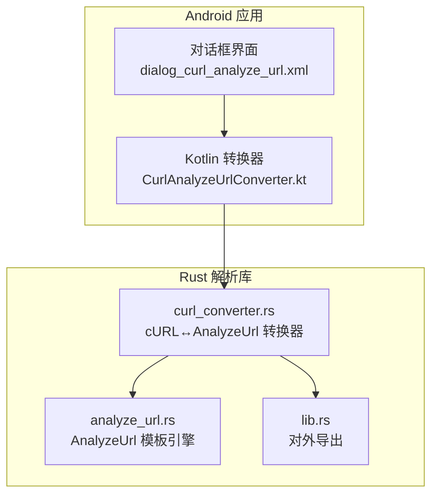
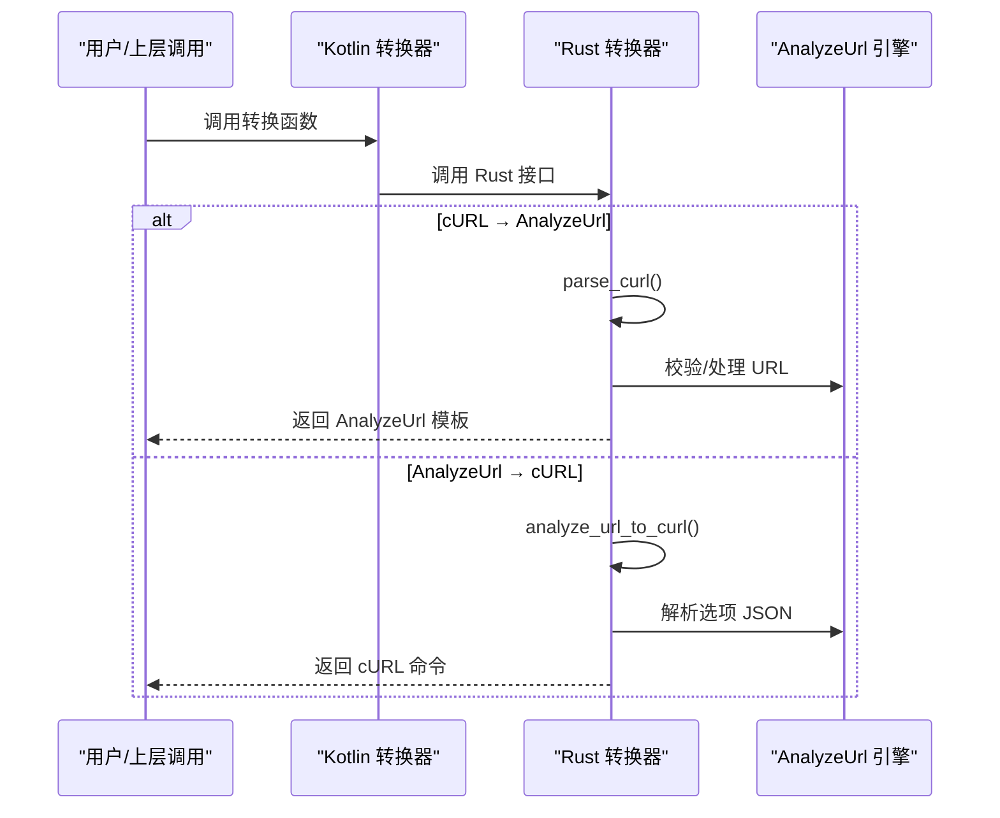
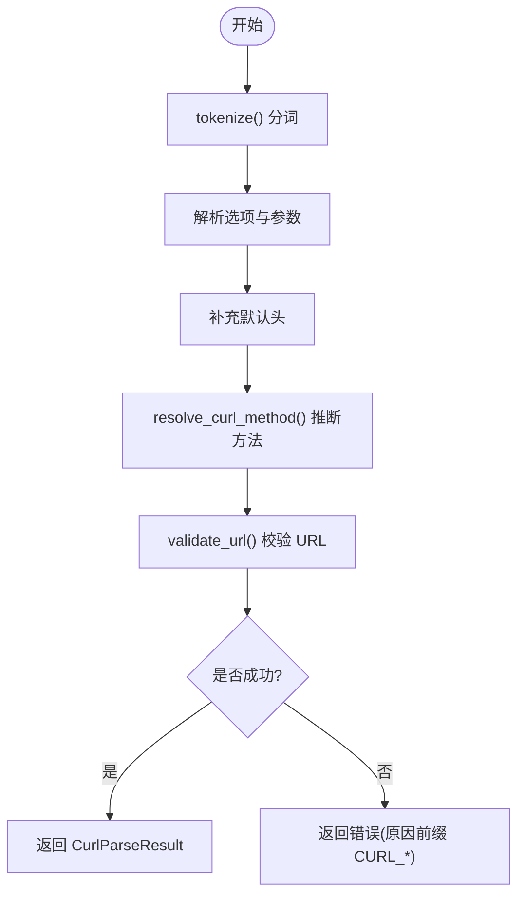
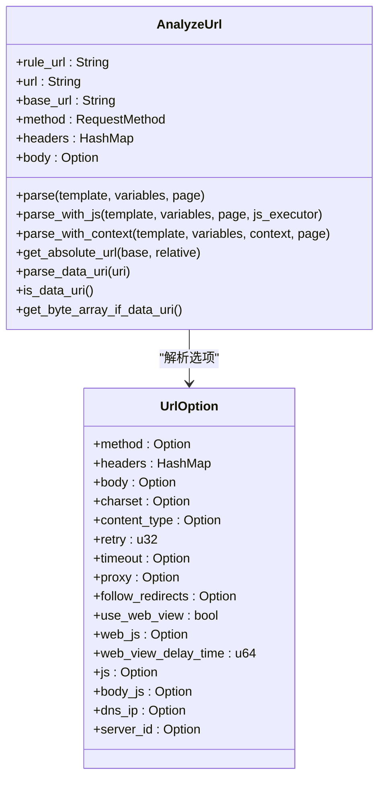
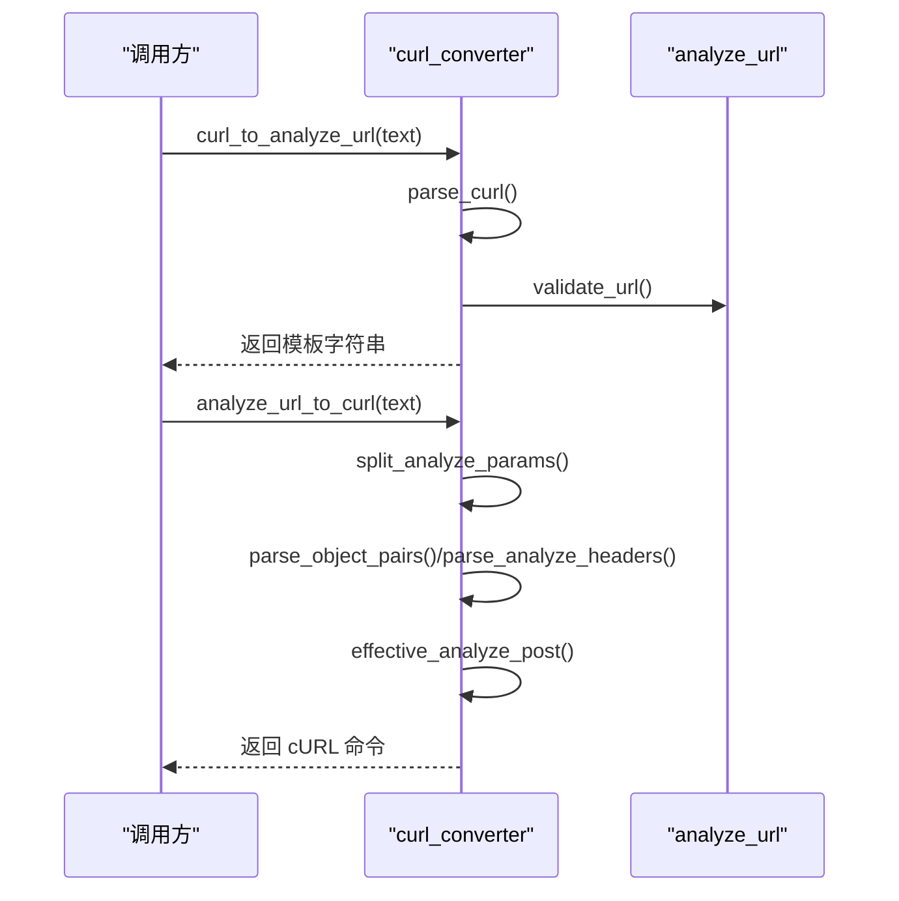
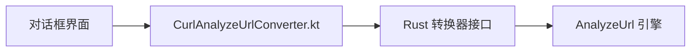
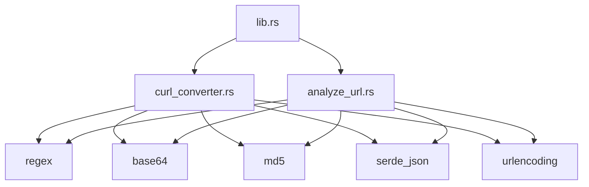

# cURL与AnalyzeUrl双向转换器

<cite>
**本文引用的文件**   
- [curl_converter.rs](file://rust/legado-parser/src/curl_converter.rs)
- [analyze_url.rs](file://rust/legado-parser/src/analyze_url.rs)
- [lib.rs](file://rust/legado-parser/src/lib.rs)
- [CurlAnalyzeUrlConverter.kt](file://app/src/main/java/io/legado/app/ui/code/CurlAnalyzeUrlConverter.kt)
- [dialog_curl_analyze_url.xml](file://app/src/main/res/layout/dialog_curl_analyze_url.xml)
</cite>

## 目录
1. [简介](#简介)
2. [项目结构](#项目结构)
3. [核心组件](#核心组件)
4. [架构总览](#架构总览)
5. [详细组件分析](#详细组件分析)
6. [依赖关系分析](#依赖关系分析)
7. [性能考量](#性能考量)
8. [故障排查指南](#故障排查指南)
9. [结论](#结论)
10. [附录](#附录)

## 简介
本仓库实现了“cURL 命令”与“AnalyzeUrl 模板字符串”之间的双向转换能力，用于在 Legado 应用中统一请求表达形式、提升可移植性与可维护性。Rust 端实现严格对齐 Kotlin 端行为，并在此基础上做了少量扩展（如支持 --data-urlencode、忽略 --compressed）。该功能同时提供 Android 侧 UI 入口，便于用户进行交互式转换。

## 项目结构
- Rust 解析库位于 rust/legado-parser，包含：
  - curl_converter.rs：cURL ↔ AnalyzeUrl 双向转换器
  - analyze_url.rs：AnalyzeUrl URL 模板引擎（变量替换、分页、编码管道、JS 执行等）
  - lib.rs：模块导出与对外 API
- Android 应用层位于 app/src/main/java/io/legado/app/ui/code/CurlAnalyzeUrlConverter.kt，提供 UI 交互与业务调用；布局文件 dialog_curl_analyze_url.xml 定义输入/输出双栏界面。

**图表来源** 
- [dialog_curl_analyze_url.xml:1-126](file://app/src/main/res/layout/dialog_curl_analyze_url.xml#L1-L126)
- [CurlAnalyzeUrlConverter.kt:1-637](file://app/src/main/java/io/legado/app/ui/code/CurlAnalyzeUrlConverter.kt#L1-L637)
- [curl_converter.rs:1-1857](file://rust/legado-parser/src/curl_converter.rs#L1-L1857)
- [analyze_url.rs:1-1846](file://rust/legado-parser/src/analyze_url.rs#L1-L1846)
- [lib.rs:1-50](file://rust/legado-parser/src/lib.rs#L1-L50)

**章节来源**
- [lib.rs:1-50](file://rust/legado-parser/src/lib.rs#L1-L50)

## 核心组件
- cURL 解析器与序列化器
  - parse_curl：将 cURL 命令解析为结构化请求（URL、方法、头、体、重定向等）
  - to_curl：将结构化请求序列化为 POSIX shell 安全的 cURL 命令
- AnalyzeUrl 模板引擎
  - 支持 {key}、<key>、${key}、{{expression}}、@js:...、<js>...</js> 等语法
  - 支持分页参数、编码管道（urlencode/base64/md5）、POST body 模板、data: URI 解析等
- 双向转换接口
  - curl_to_analyze_url：cURL → AnalyzeUrl 模板字符串
  - analyze_url_to_curl：AnalyzeUrl 模板字符串 → cURL 命令

**章节来源**
- [curl_converter.rs:1-1857](file://rust/legado-parser/src/curl_converter.rs#L1-L1857)
- [analyze_url.rs:1-1846](file://rust/legado-parser/src/analyze_url.rs#L1-L1846)

## 架构总览
整体流程分为两条路径：
- cURL → AnalyzeUrl：先解析 cURL 为中间结构，再按规则生成 AnalyzeUrl 模板
- AnalyzeUrl → cURL：先解析 AnalyzeUrl 选项 JSON，再构造 cURL 命令

**图表来源** 
- [curl_converter.rs:186-406](file://rust/legado-parser/src/curl_converter.rs#L186-L406)
- [curl_converter.rs:408-546](file://rust/legado-parser/src/curl_converter.rs#L408-L546)
- [analyze_url.rs:192-265](file://rust/legado-parser/src/analyze_url.rs#L192-L265)

## 详细组件分析

### cURL 解析与序列化（curl_converter.rs）
- 词法分析 tokenize：支持单/双引号、转义、续行、拒绝 shell 展开
- 选项处理：-X/--request、-I/--head、-H/--header、-A/--user-agent、-e/--referer、-d/--data(-raw/-binary)、--json、-b/--cookie、--url、-L/--location、-g/--globoff 等
- 默认头补充：--json 时自动添加 Content-Type/Accept；有 body 时默认 application/x-www-form-urlencoded
- 方法推断 resolve_curl_method：HEAD、POST（带 body）、GET（无 body），并校验冲突
- URL 校验 validate_url：禁止通配符、禁止 AnalyzeUrl 参数模式、必须 HTTP(S)、禁止 userinfo
- AnalyzeUrl 选项 JSON 解析：保序扫描 JsonCursor，仅允许 method/headers/body/followRedirects
- POST 生效逻辑 effective_analyze_post：空体→表单类型；显式 Content-Type→使用之；JSON/XML→JSON 类型；否则表单编码
- Shell 转义 shell_quote：POSIX 安全引用

**图表来源** 
- [curl_converter.rs:557-645](file://rust/legado-parser/src/curl_converter.rs#L557-L645)
- [curl_converter.rs:795-841](file://rust/legado-parser/src/curl_converter.rs#L795-L841)
- [curl_converter.rs:871-919](file://rust/legado-parser/src/curl_converter.rs#L871-L919)

**章节来源**
- [curl_converter.rs:186-326](file://rust/legado-parser/src/curl_converter.rs#L186-L326)
- [curl_converter.rs:328-348](file://rust/legado-parser/src/curl_converter.rs#L328-L348)
- [curl_converter.rs:557-645](file://rust/legado-parser/src/curl_converter.rs#L557-L645)
- [curl_converter.rs:795-841](file://rust/legado-parser/src/curl_converter.rs#L795-L841)
- [curl_converter.rs:871-919](file://rust/legado-parser/src/curl_converter.rs#L871-L919)
- [curl_converter.rs:1197-1288](file://rust/legado-parser/src/curl_converter.rs#L1197-L1288)
- [curl_converter.rs:1294-1327](file://rust/legado-parser/src/curl_converter.rs#L1294-L1327)

### AnalyzeUrl 模板引擎（analyze_url.rs）
- 变量替换：{key}、<key>、${key}、{{expression}}（简单变量直接替换，复杂表达式交由 JS 执行）
- 分页参数：{page}、<page,N1,N2,...>、{page,N1,N2,...}
- 编码管道：urlencode、base64、md5
- 配置提取：@Header:{key:value}、@Body:{json}
- URL 解析：分离 URL 与尾部 JSON 选项，解析 method、headers、body、charset、content_type、retry、timeout、proxy、follow_redirects、webView/webJs/webViewDelayTime、js、body_js、dnsIp、serverID 等
- data: URI 解析：支持 base64 与纯文本，返回 MIME、charset、is_base64、data
- JS 内嵌执行：@js:... 与 <js>...</js> 支持 @result 引用上一步结果

**图表来源** 
- [analyze_url.rs:94-143](file://rust/legado-parser/src/analyze_url.rs#L94-L143)
- [analyze_url.rs:39-65](file://rust/legado-parser/src/analyze_url.rs#L39-L65)

**章节来源**
- [analyze_url.rs:192-265](file://rust/legado-parser/src/analyze_url.rs#L192-L265)
- [analyze_url.rs:291-374](file://rust/legado-parser/src/analyze_url.rs#L291-L374)
- [analyze_url.rs:376-448](file://rust/legado-parser/src/analyze_url.rs#L376-L448)
- [analyze_url.rs:450-480](file://rust/legado-parser/src/analyze_url.rs#L450-L480)
- [analyze_url.rs:484-513](file://rust/legado-parser/src/analyze_url.rs#L484-L513)
- [analyze_url.rs:518-566](file://rust/legado-parser/src/analyze_url.rs#L518-L566)
- [analyze_url.rs:790-835](file://rust/legado-parser/src/analyze_url.rs#L790-L835)
- [analyze_url.rs:839-944](file://rust/legado-parser/src/analyze_url.rs#L839-L944)
- [analyze_url.rs:987-1045](file://rust/legado-parser/src/analyze_url.rs#L987-L1045)

### 双向转换接口（curl_converter.rs）
- curl_to_analyze_url：
  - 校验空输入、URL 合法性、空白 body 限制
  - 按顺序组装 method、headers、body、followRedirects
  - 无选项时仅输出 URL
- analyze_url_to_curl：
  - 按正则拆分 URL 与选项 JSON
  - 校验不支持的键、方法、头部（如 proxy/CookieJar/Content-Length/Transfer-Encoding）
  - 计算 effective_post（决定 Content-Type 与 body 编码）
  - 生成 cURL 命令（-g -L/-I、-H、--data-raw）

**图表来源** 
- [curl_converter.rs:350-406](file://rust/legado-parser/src/curl_converter.rs#L350-L406)
- [curl_converter.rs:408-546](file://rust/legado-parser/src/curl_converter.rs#L408-L546)
- [curl_converter.rs:921-1148](file://rust/legado-parser/src/curl_converter.rs#L921-L1148)
- [curl_converter.rs:1197-1288](file://rust/legado-parser/src/curl_converter.rs#L1197-L1288)

**章节来源**
- [curl_converter.rs:350-406](file://rust/legado-parser/src/curl_converter.rs#L350-L406)
- [curl_converter.rs:408-546](file://rust/legado-parser/src/curl_converter.rs#L408-L546)
- [curl_converter.rs:921-1148](file://rust/legado-parser/src/curl_converter.rs#L921-L1148)

### Android 端集成（CurlAnalyzeUrlConverter.kt 与 UI）
- Kotlin 转换器提供 looksLikeCurl、curlToAnalyzeUrl、analyzeUrlToCurl 等方法，与 Rust 语义一致
- UI 对话框提供方向选择（cURL→AnalyzeUrl / AnalyzeUrl→cURL）、输入/输出编辑区

**图表来源** 
- [CurlAnalyzeUrlConverter.kt:62-98](file://app/src/main/java/io/legado/app/ui/code/CurlAnalyzeUrlConverter.kt#L62-L98)
- [CurlAnalyzeUrlConverter.kt:100-205](file://app/src/main/java/io/legado/app/ui/code/CurlAnalyzeUrlConverter.kt#L100-L205)
- [dialog_curl_analyze_url.xml:18-54](file://app/src/main/res/layout/dialog_curl_analyze_url.xml#L18-L54)

**章节来源**
- [CurlAnalyzeUrlConverter.kt:1-637](file://app/src/main/java/io/legado/app/ui/code/CurlAnalyzeUrlConverter.kt#L1-L637)
- [dialog_curl_analyze_url.xml:1-126](file://app/src/main/res/layout/dialog_curl_analyze_url.xml#L1-L126)

## 依赖关系分析
- Rust 模块导出：lib.rs 暴露 curl_converter 与 analyze_url 的公共 API
- 外部依赖：regex、base64、md5、serde_json、urlencoding 等
- Kotlin 与 Rust 语义对齐：错误分类、选项白名单、默认头策略、POST 生效逻辑、Shell 转义等保持一致

**图表来源** 
- [lib.rs:27-50](file://rust/legado-parser/src/lib.rs#L27-L50)
- [curl_converter.rs:1-25](file://rust/legado-parser/src/curl_converter.rs#L1-L25)
- [analyze_url.rs:21-30](file://rust/legado-parser/src/analyze_url.rs#L21-L30)

**章节来源**
- [lib.rs:27-50](file://rust/legado-parser/src/lib.rs#L27-L50)

## 性能考量
- 词法分析与 JSON 游标解析采用轻量级实现，避免完整 JSON 反序列化开销
- 管道编码与表单编码按需触发，减少不必要的计算
- Shell 转义与 JSON 字符串转义均为线性时间复杂度
- 建议对高频调用场景缓存解析结果或复用上下文对象

[本节为通用指导，不直接分析具体文件]

## 故障排查指南
- 常见错误类别（Rust 端以 CURL_* 前缀标识）：
  - CURL_EMPTY_INPUT：空输入
  - CURL_INVALID_CURL：非法 cURL 命令（词法/结构错误）
  - CURL_MISSING_URL：缺少 URL
  - CURL_INVALID_ANALYZE_URL：非法 AnalyzeUrl 模板
  - CURL_UNSUPPORTED_METHOD：不支持的 HTTP 方法（仅 GET/POST/HEAD）
  - CURL_UNSUPPORTED_OPTION：不支持的选项（如 --http2、shell 展开、@file、重复 header、proxy/CookieJar/Content-Length/Transfer-Encoding 等）
- 定位方法：
  - 检查输入是否为 cURL 命令（looks_like_curl）
  - 确认 URL 是否合法（HTTP(S)、无 userinfo、无通配符）
  - 检查 AnalyzeUrl 选项 JSON 是否仅包含允许键
  - 验证 POST body 与 Content-Type 一致性
- 调试建议：
  - 使用单元测试断言 is_curl_error(err, reason) 快速识别错误类别
  - 逐步缩小输入范围，观察解析失败点

**章节来源**
- [curl_converter.rs:51-96](file://rust/legado-parser/src/curl_converter.rs#L51-L96)
- [curl_converter.rs:1524-1603](file://rust/legado-parser/src/curl_converter.rs#L1524-L1603)
- [curl_converter.rs:1729-1773](file://rust/legado-parser/src/curl_converter.rs#L1729-L1773)

## 结论
本实现提供了稳定、可移植且与 Kotlin 端完全对齐的 cURL 与 AnalyzeUrl 双向转换能力。通过严格的词法分析、选项白名单、URL 校验与 POST 生效逻辑，确保转换结果的安全性与一致性。Android 端 UI 使非技术用户也能便捷地进行转换操作。建议在后续迭代中继续完善错误提示与性能优化，并扩展更多可选参数的支持。

[本节为总结，不直接分析具体文件]

## 附录
- 示例用法（路径引用）：
  - cURL → AnalyzeUrl：参考测试用例 curl_to_analyze_url_get_plain、curl_to_analyze_url_post_with_options
  - AnalyzeUrl → cURL：参考测试用例 analyze_url_to_curl_get、analyze_url_to_curl_post_json_body
  - 往返一致性：roundtrip_curl_struct_curl、roundtrip_curl_analyze_url_curl、roundtrip_analyze_url_curl_analyze_url

**章节来源**
- [curl_converter.rs:1616-1663](file://rust/legado-parser/src/curl_converter.rs#L1616-L1663)
- [curl_converter.rs:1667-1773](file://rust/legado-parser/src/curl_converter.rs#L1667-L1773)
- [curl_converter.rs:1804-1855](file://rust/legado-parser/src/curl_converter.rs#L1804-L1855)