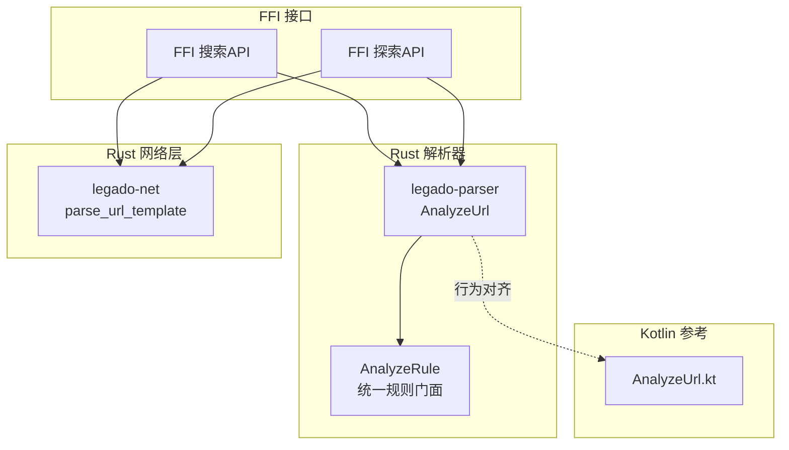
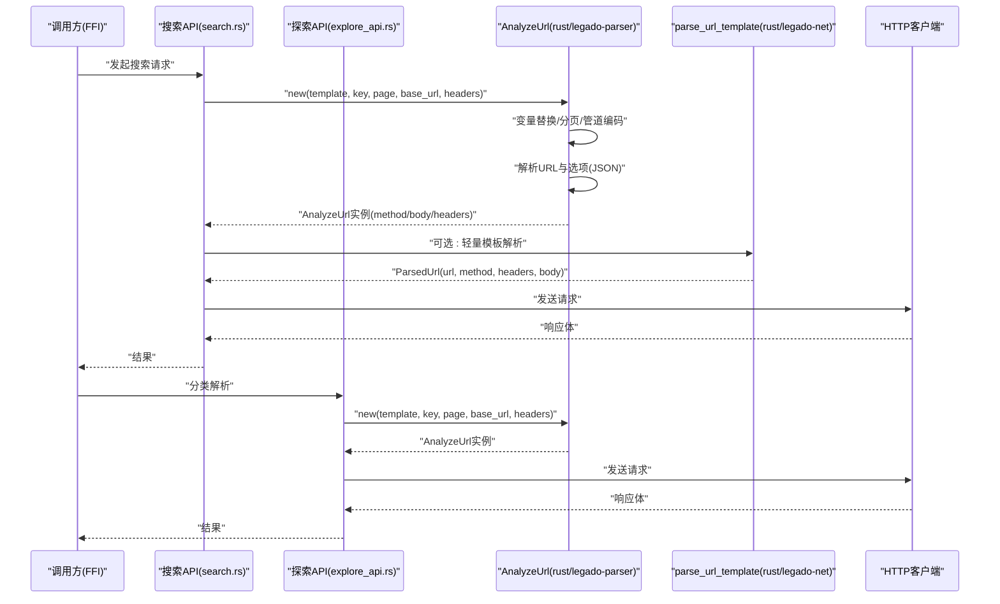
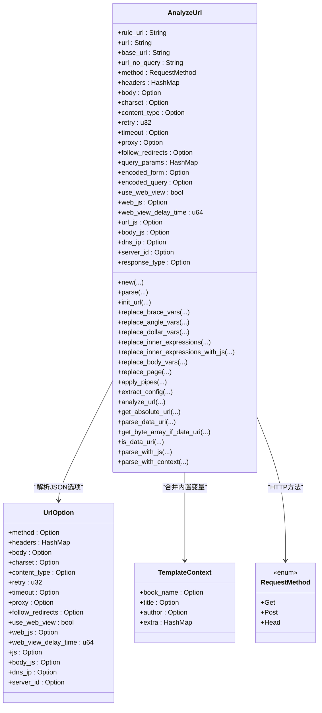
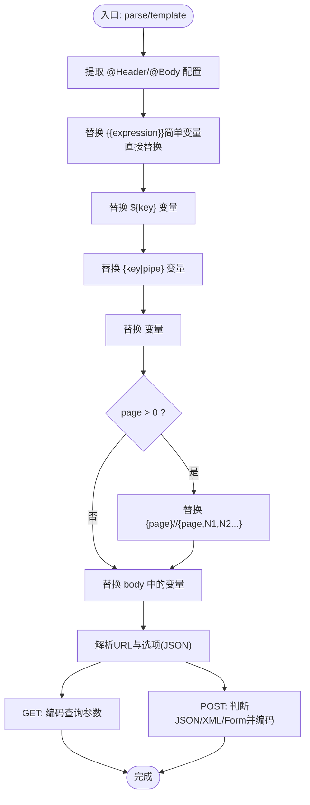
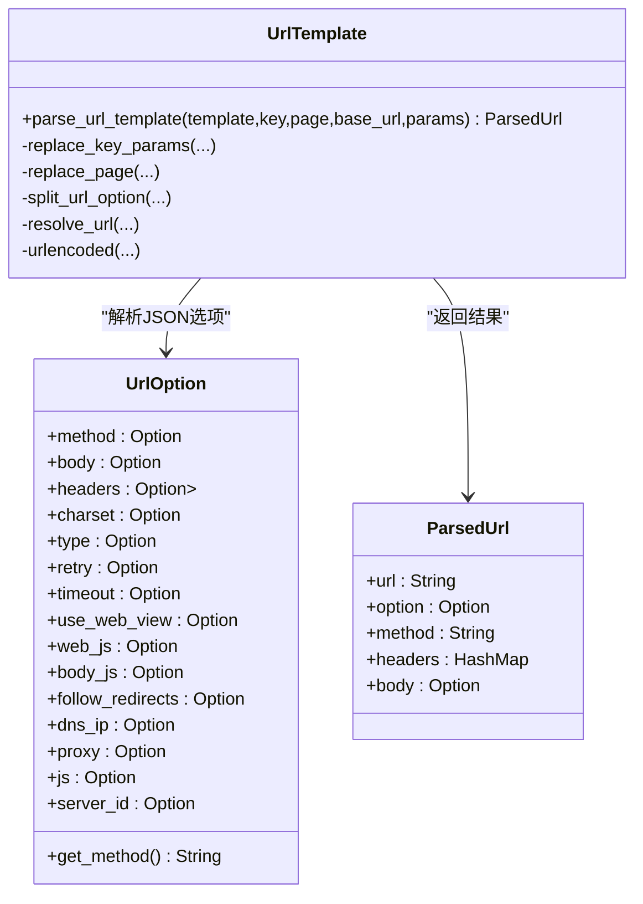
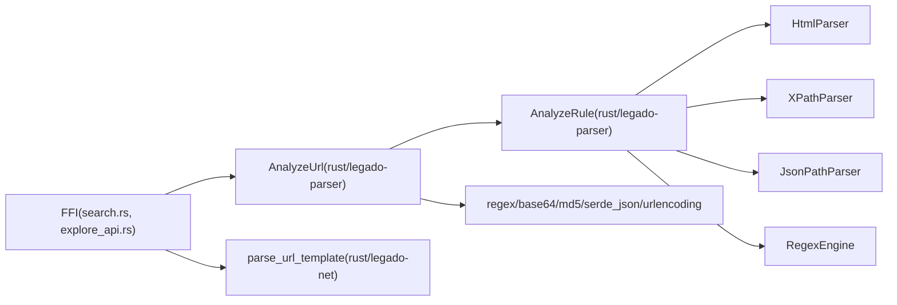

# 增强URL分析引擎

<cite>
**本文引用的文件**   
- [analyze_url.rs](file://rust/legado-parser/src/analyze_url.rs)
- [lib.rs（解析器模块）](file://rust/legado-parser/src/lib.rs)
- [url_template.rs（网络层模板）](file://rust/legado-net/src/url_template.rs)
- [AnalyzeUrl.kt（Kotlin参考实现）](file://app/src/main/java/io/legado/app/model/analyzeRule/AnalyzeUrl.kt)
- [search.rs（FFI搜索API）](file://rust/legado-ffi/src/api/search.rs)
- [explore_api.rs（FFI探索API）](file://rust/legado-ffi/src/api/explore_api.rs)
</cite>

## 更新摘要
**变更内容**   
- 增强了JavaScript表达式支持，新增数值类型变量注入处理
- 改进了页码等数值变量的数学运算能力
- 实现了JavaScript表达式求值失败的优雅降级机制
- 优化了URL生成过程中的错误处理

## 目录
1. [简介](#简介)
2. [项目结构](#项目结构)
3. [核心组件](#核心组件)
4. [架构总览](#架构总览)
5. [详细组件分析](#详细组件分析)
6. [依赖关系分析](#依赖关系分析)
7. [性能考量](#性能考量)
8. [故障排查指南](#故障排查指南)
9. [结论](#结论)
10. [附录](#附录)

## 简介
本文件系统化梳理 Legado 项目中的"增强URL分析引擎"，聚焦 Rust 侧的 legado-parser 与 legado-net 两个模块，并结合 Kotlin 参考实现进行对比说明。该引擎负责：
- URL 模板解析与变量替换（支持 {key}、<key>、${key}、{{expression}}）
- **新增** JavaScript表达式支持与数值类型变量注入
- 分页参数自动递增与列表选择
- 管道编码（urlencode、base64、md5）
- POST body 模板与表单/JSON/XML 识别
- 请求配置提取（@Header、@Body、URL 尾部 JSON 选项）
- data: URI 解析与流式读取
- WebView 模式标记与 JS 内嵌执行（通过 JsExecutor 注入）
- 基础 URL 拼接与绝对路径解析

## 项目结构
- legado-parser：提供完整的 URL 模板引擎 AnalyzeUrl，以及规则解析门面 AnalyzeRule、HTML/XPath/JsonPath/Regex 等解析能力。
- legado-net：提供轻量版 URL 模板解析 parse_url_template，用于网络层快速构建请求。
- FFI 层（legado-ffi）：在搜索与探索等 API 中组合使用 AnalyzeUrl 构建请求并调用网络层。
- Kotlin 参考实现：AnalyzeUrl.kt 定义了完整的行为规范与扩展能力（JS 执行、WebView 流程、Cookie 管理等）。



**图示来源** 
- [analyze_url.rs:1-120](file://rust/legado-parser/src/analyze_url.rs#L1-L120)
- [lib.rs（解析器模块）:1-43](file://rust/legado-parser/src/lib.rs#L1-L43)
- [url_template.rs（网络层模板）:1-120](file://rust/legado-net/src/url_template.rs#L1-L120)
- [AnalyzeUrl.kt（Kotlin参考实现）:1-120](file://app/src/main/java/io/legado/app/model/analyzeRule/AnalyzeUrl.kt#L1-L120)
- [search.rs（FFI搜索API）:370-422](file://rust/legado-ffi/src/api/search.rs#L370-L422)
- [explore_api.rs（FFI探索API）:92-109](file://rust/legado-ffi/src/api/explore_api.rs#L92-L109)

**章节来源**
- [analyze_url.rs:1-120](file://rust/legado-parser/src/analyze_url.rs#L1-L120)
- [lib.rs（解析器模块）:1-43](file://rust/legado-parser/src/lib.rs#L1-L43)
- [url_template.rs（网络层模板）:1-120](file://rust/legado-net/src/url_template.rs#L1-L120)
- [AnalyzeUrl.kt（Kotlin参考实现）:1-120](file://app/src/main/java/io/legado/app/model/analyzeRule/AnalyzeUrl.kt#L1-L120)

## 核心组件
- AnalyzeUrl（Rust）：URL 模板引擎，支持多格式变量替换、分页、管道编码、POST body、data: URI、WebView 标记、JS 内嵌执行（通过 JsExecutor）。
- UrlOption（Rust）：URL 尾部 JSON 选项的结构化表示（method、headers、body、charset、type、retry、timeout、proxy、followRedirects、webView/webJs/webViewDelayTime/js/bodyJs/dnsIp/serverID 等）。
- TemplateContext（Rust）：内置变量上下文（bookName/title/author/extra），便于模板解析时注入。
- parse_url_template（Rust 轻量版）：网络层快速模板解析，返回 ParsedUrl（url、option、method、headers、body）。
- AnalyzeRule（Rust）：统一规则解析门面，自动检测内容类型并调度 HTML/CSS、XPath、JsonPath、正则、JS 解析器。

**章节来源**
- [analyze_url.rs:31-143](file://rust/legado-parser/src/analyze_url.rs#L31-L143)
- [url_template.rs（网络层模板）:27-82](file://rust/legado-net/src/url_template.rs#L27-L82)
- [lib.rs（解析器模块）:27-43](file://rust/legado-parser/src/lib.rs#L27-L43)

## 架构总览
下图展示从 FFI 到解析器再到网络层的调用链路与数据流转。



**图示来源** 
- [search.rs（FFI搜索API）:370-422](file://rust/legado-ffi/src/api/search.rs#L370-L422)
- [explore_api.rs（FFI探索API）:92-109](file://rust/legado-ffi/src/api/explore_api.rs#L92-L109)
- [analyze_url.rs:145-265](file://rust/legado-parser/src/analyze_url.rs#L145-L265)
- [url_template.rs（网络层模板）:92-135](file://rust/legado-net/src/url_template.rs#L92-L135)

## 详细组件分析

### AnalyzeUrl（Rust）类图


**图示来源** 
- [analyze_url.rs:31-143](file://rust/legado-parser/src/analyze_url.rs#L31-L143)
- [analyze_url.rs:145-265](file://rust/legado-parser/src/analyze_url.rs#L145-L265)
- [analyze_url.rs:482-513](file://rust/legado-parser/src/analyze_url.rs#L482-L513)
- [analyze_url.rs:640-744](file://rust/legado-parser/src/analyze_url.rs#L640-L744)
- [analyze_url.rs:787-835](file://rust/legado-parser/src/analyze_url.rs#L787-L835)
- [analyze_url.rs:998-1045](file://rust/legado-parser/src/analyze_url.rs#L998-L1045)

**章节来源**
- [analyze_url.rs:31-143](file://rust/legado-parser/src/analyze_url.rs#L31-L143)
- [analyze_url.rs:145-265](file://rust/legado-parser/src/analyze_url.rs#L145-L265)
- [analyze_url.rs:482-513](file://rust/legado-parser/src/analyze_url.rs#L482-L513)
- [analyze_url.rs:640-744](file://rust/legado-parser/src/analyze_url.rs#L640-L744)
- [analyze_url.rs:787-835](file://rust/legado-parser/src/analyze_url.rs#L787-L835)
- [analyze_url.rs:998-1045](file://rust/legado-parser/src/analyze_url.rs#L998-L1045)

### 模板解析流程（含JS内嵌）


**图示来源** 
- [analyze_url.rs:192-265](file://rust/legado-parser/src/analyze_url.rs#L192-L265)
- [analyze_url.rs:294-374](file://rust/legado-parser/src/analyze_url.rs#L294-L374)
- [analyze_url.rs:379-448](file://rust/legado-parser/src/analyze_url.rs#L379-L448)
- [analyze_url.rs:518-566](file://rust/legado-parser/src/analyze_url.rs#L518-L566)

**章节来源**
- [analyze_url.rs:192-265](file://rust/legado-parser/src/analyze_url.rs#L192-L265)
- [analyze_url.rs:294-374](file://rust/legado-parser/src/analyze_url.rs#L294-L374)
- [analyze_url.rs:379-448](file://rust/legado-parser/src/analyze_url.rs#L379-L448)
- [analyze_url.rs:518-566](file://rust/legado-parser/src/analyze_url.rs#L518-L566)

### 轻量模板解析（网络层）


**图示来源** 
- [url_template.rs（网络层模板）:27-82](file://rust/legado-net/src/url_template.rs#L27-L82)
- [url_template.rs（网络层模板）:92-135](file://rust/legado-net/src/url_template.rs#L92-L135)
- [url_template.rs（网络层模板）:176-208](file://rust/legado-net/src/url_template.rs#L176-L208)

**章节来源**
- [url_template.rs（网络层模板）:27-82](file://rust/legado-net/src/url_template.rs#L27-L82)
- [url_template.rs（网络层模板）:92-135](file://rust/legado-net/src/url_template.rs#L92-L135)
- [url_template.rs（网络层模板）:176-208](file://rust/legado-net/src/url_template.rs#L176-L208)

### 与Kotlin参考实现的对应关系
- 变量替换与分页：{key}、<page,...>、${key}、{{expression}} 在 Kotlin 与 Rust 均有实现，语义一致。
- 管道编码：urlencode/base64/md5 在 Rust 中通过 apply_pipes 实现；Kotlin 侧通过编码器工具处理。
- 请求配置：@Header/@Body 与 URL 尾部 JSON 选项在两者中均被解析与应用。
- data: URI：Kotlin 的 getByteArrayIfDataUri 与 Rust 的 parse_data_uri/get_byte_array_if_data_uri 对应。
- WebView 模式：Kotlin 的 BackstageWebView 流程由上层 Flutter 处理；Rust 仅标记 use_web_view 与 web_js/webViewDelayTime。

**章节来源**
- [AnalyzeUrl.kt（Kotlin参考实现）:154-296](file://app/src/main/java/io/legado/app/model/analyzeRule/AnalyzeUrl.kt#L154-L296)
- [AnalyzeUrl.kt（Kotlin参考实现）:433-557](file://app/src/main/java/io/legado/app/model/analyzeRule/AnalyzeUrl.kt#L433-L557)
- [analyze_url.rs:998-1045](file://rust/legado-parser/src/analyze_url.rs#L998-L1045)

### JavaScript表达式支持增强

**新增功能**：Rust 版本的 `replace_inner_expressions_with_js` 方法实现了智能变量注入和优雅降级机制。

#### 数值类型变量注入
当处理 `{{expression}}` 格式的JavaScript表达式时，系统会智能识别变量类型：
- **纯整数变量**：以数字形式注入到JavaScript环境，确保数学运算正确执行
- **字符串变量**：转义后以字符串形式注入，避免语法错误
- **复杂表达式**：通过JsExecutor执行，支持条件判断、算术运算等

#### 优雅降级机制
当JavaScript表达式求值失败时，系统采用空字符串作为降级值，防止生成格式错误的URL：
- 表达式执行错误 → 返回空字符串
- 未定义的变量 → 返回空字符串  
- 语法错误 → 返回空字符串

#### 示例场景
```javascript
// 数值比较和算术运算
{{page > 1 ? '/' + page : ''}}  // page=2 → "/2", page=1 → ""
{{(page * 10).toString()}}      // page=3 → "30"
{{page + 1}}                    // page=5 → "6"
```

**章节来源**
- [analyze_url.rs:946-992](file://rust/legado-parser/src/analyze_url.rs#L946-L992)
- [analyze_url.rs:1748-1773](file://rust/legado-parser/src/analyze_url.rs#L1748-L1773)

## 依赖关系分析
- FFI 层（search.rs、explore_api.rs）依赖 legado-parser 的 AnalyzeUrl 构建请求，并可结合 legado-net 的 parse_url_template 做轻量解析。
- AnalyzeRule 作为门面，内部聚合 HtmlParser、XPathParser、JsonPathParser、RegexEngine，并通过 JsExecutor trait 注入 JS 执行能力，避免循环依赖。
- AnalyzeUrl 依赖正则库、base64、md5、serde_json、urlencoding 等标准/第三方库。



**图示来源** 
- [search.rs（FFI搜索API）:370-422](file://rust/legado-ffi/src/api/search.rs#L370-L422)
- [explore_api.rs（FFI探索API）:92-109](file://rust/legado-ffi/src/api/explore_api.rs#L92-L109)
- [lib.rs（解析器模块）:27-43](file://rust/legado-parser/src/lib.rs#L27-L43)
- [analyze_rule.rs:1-120](file://rust/legado-parser/src/analyze_rule.rs#L1-L120)

**章节来源**
- [search.rs（FFI搜索API）:370-422](file://rust/legado-ffi/src/api/search.rs#L370-L422)
- [explore_api.rs（FFI探索API）:92-109](file://rust/legado-ffi/src/api/explore_api.rs#L92-L109)
- [lib.rs（解析器模块）:27-43](file://rust/legado-parser/src/lib.rs#L27-L43)
- [analyze_rule.rs:1-120](file://rust/legado-parser/src/analyze_rule.rs#L1-L120)

## 性能考量
- 正则表达式复用：Rust 中使用 LazyLock 缓存常用正则（如 KEY_PATTERN、PAGE_PATTERN、PARAM_PATTERN），减少重复编译开销。
- 字符串处理：模板替换采用一次性 replace_all，避免多次迭代；对已编码查询参数进行预检，避免重复编码。
- 管道编码：按顺序应用管道，避免不必要的中间拷贝；MD5 计算仅在需要时触发。
- data: URI：优先本地解码，避免网络请求；对于非 data: URI 走 HTTP 层。
- 并发控制：Kotlin 参考实现包含速率限制（ConcurrentRateLimiter），Rust 侧可在上层调用处集成限流策略。
- **新增**：JavaScript表达式求值失败时的快速降级，避免昂贵的异常处理开销。

[本节为通用指导，不直接分析具体文件]

## 故障排查指南
- 模板变量未替换：检查变量名是否匹配（区分大小写）、是否遗漏传入变量映射；确认 {key}、<key>、${key}、{{expression}} 的使用场景。
- 分页异常：确认 page 从 1 开始；<page,N1,N2,...> 或 {page,N1,N2,...} 列表长度与页码范围。
- 管道编码错误：确保管道顺序正确（如先 base64 再 urlencode）；未知管道将被忽略。
- POST body 类型误判：若未显式设置 Content-Type，且 body 不以 {/[ 开头，会被视为 form；XML 需以 <?xml 或 < 开头。
- data: URI 解析失败：检查 data:[mediatype][;base64],<data> 格式是否正确；base64 解码失败将返回 None。
- WebView 模式：确认 use_web_view 标志与 web_js/webViewDelayTime 配置；上层 Flutter 需处理实际加载。
- **新增**：JavaScript表达式问题：检查表达式语法，确认变量类型是否正确（数值vs字符串），查看错误日志中的JS执行异常信息。

**章节来源**
- [analyze_url.rs:294-374](file://rust/legado-parser/src/analyze_url.rs#L294-L374)
- [analyze_url.rs:379-448](file://rust/legado-parser/src/analyze_url.rs#L379-L448)
- [analyze_url.rs:518-566](file://rust/legado-parser/src/analyze_url.rs#L518-L566)
- [analyze_url.rs:998-1045](file://rust/legado-parser/src/analyze_url.rs#L998-L1045)

## 结论
增强URL分析引擎在 Rust 侧实现了与 Kotlin 参考实现高度一致的模板解析能力，覆盖变量替换、分页、管道编码、POST body、data: URI、WebView 标记与 JS 内嵌执行等关键特性。**最新增强包括JavaScript表达式支持、数值类型变量注入和优雅降级机制**，显著提升了URL生成的准确性和鲁棒性。通过模块化设计（parser/net/ffi）与清晰的依赖边界，既保证了功能完整性，也提升了可维护性与可扩展性。建议在复杂场景中优先使用 AnalyzeUrl，并在网络层需要轻量解析时使用 parse_url_template。

[本节为总结性内容，不直接分析具体文件]

## 附录
- 使用建议：
  - 模板中尽量使用明确的变量名与管道顺序，避免歧义。
  - 对敏感信息（如 token）建议使用管道 md5 或外部注入。
  - 在需要动态生成 URL 的场景，使用 parse_with_js 配合 JsExecutor。
  - 对 data: URI 可直接获取字节内容，无需网络请求。
  - **新增**：在JavaScript表达式中合理使用数值类型，利用增强的数学运算能力。
  - **新增**：为JavaScript表达式提供适当的错误处理和降级逻辑。

[本节为补充说明，不直接分析具体文件]