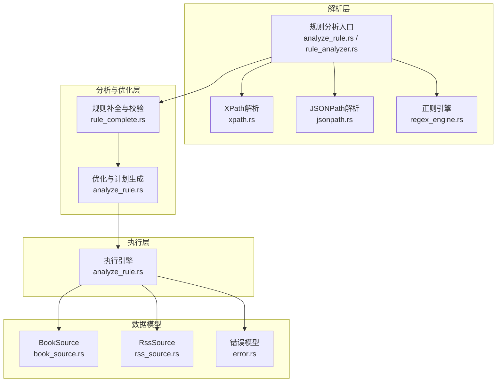
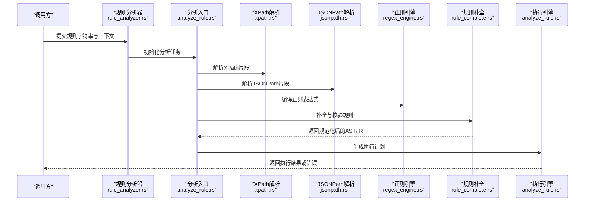
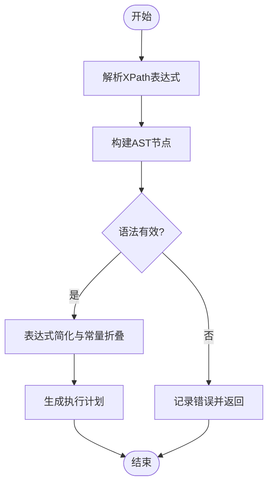
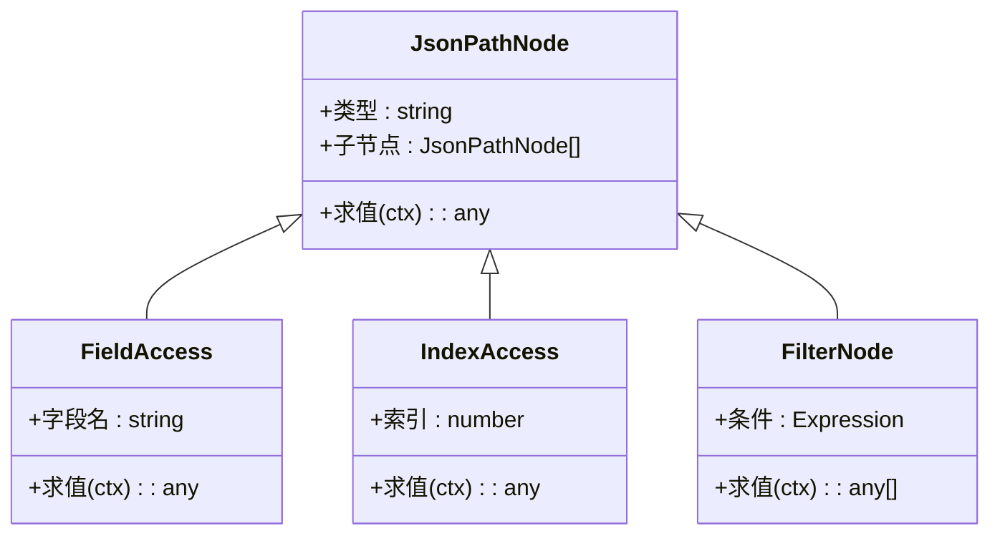
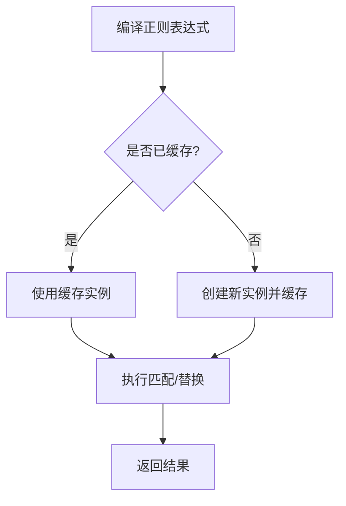
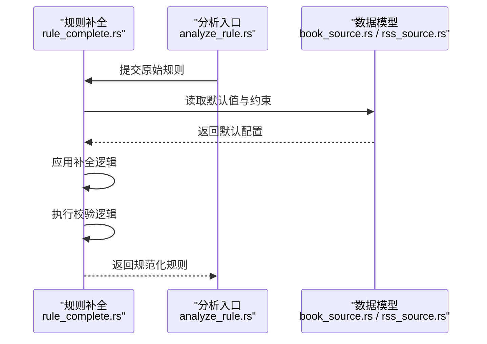
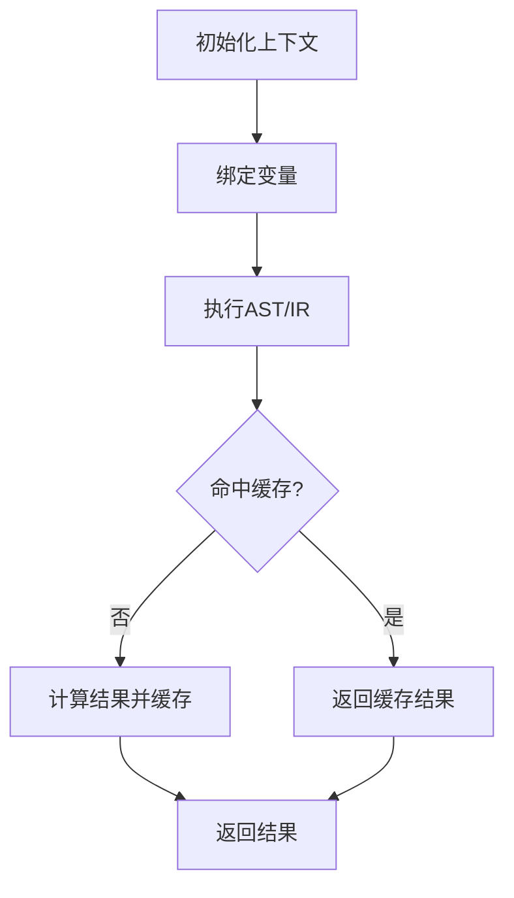
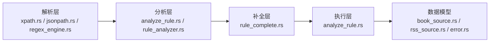

# 规则分析器

<cite>
**本文引用的文件**   
- [analyze_rule.rs](file://rust/legado-parser/src/analyze_rule.rs)
- [rule_analyzer.rs](file://rust/legado-parser/src/rule_analyzer.rs)
- [xpath.rs](file://rust/legado-parser/src/xpath.rs)
- [jsonpath.rs](file://rust/legado-parser/src/jsonpath.rs)
- [regex_engine.rs](file://rust/legado-parser/src/regex_engine.rs)
- [rule_complete.rs](file://rust/legado-parser/src/rule_complete.rs)
- [lib.rs](file://rust/legado-parser/src/lib.rs)
- [models/mod.rs](file://rust/legado-core/src/models/mod.rs)
- [book_source.rs](file://rust/legado-core/src/models/book_source.rs)
- [rss_source.rs](file://rust/legado-core/src/models/rss_source.rs)
- [error.rs](file://rust/legado-core/src/error.rs)
</cite>

## 目录
1. [简介](#简介)
2. [项目结构](#项目结构)
3. [核心组件](#核心组件)
4. [架构总览](#架构总览)
5. [详细组件分析](#详细组件分析)
6. [依赖关系分析](#依赖关系分析)
7. [性能考量](#性能考量)
8. [故障排查指南](#故障排查指南)
9. [结论](#结论)
10. [附录](#附录)

## 简介
本文件面向Legado项目的“规则分析器”子系统，系统性阐述规则语法解析机制（XPath、正则表达式、JSONPath）、AST构建过程（节点类型、语法检查与错误处理）、编译优化策略（表达式简化、常量折叠、执行计划生成）以及规则执行引擎（上下文管理、变量绑定、结果缓存）。同时提供规则编写最佳实践、调试工具与测试方法的使用指南，帮助开发者高效编写高性能、可维护的规则。

## 项目结构
规则分析器位于Rust模块legado-parser中，并与legado-core的数据模型紧密协作。整体结构如下：
- 解析层：负责将规则字符串解析为中间表示（IR/AST），包括XPath、JSONPath、正则表达式等子语言。
- 分析与优化层：对AST进行语义检查、常量折叠、表达式简化，并生成可执行的计划。
- 执行层：在运行时加载上下文、绑定变量、执行计划并返回结果。
- 数据模型：由legado-core定义，用于承载源配置、RSS源配置及规则相关实体。

**图表来源** 
- [xpath.rs](file://rust/legado-parser/src/xpath.rs)
- [jsonpath.rs](file://rust/legado-parser/src/jsonpath.rs)
- [regex_engine.rs](file://rust/legado-parser/src/regex_engine.rs)
- [analyze_rule.rs](file://rust/legado-parser/src/analyze_rule.rs)
- [rule_analyzer.rs](file://rust/legado-parser/src/rule_analyzer.rs)
- [rule_complete.rs](file://rust/legado-parser/src/rule_complete.rs)
- [book_source.rs](file://rust/legado-core/src/models/book_source.rs)
- [rss_source.rs](file://rust/legado-core/src/models/rss_source.rs)
- [error.rs](file://rust/legado-core/src/error.rs)

**章节来源**
- [lib.rs](file://rust/legado-parser/src/lib.rs)
- [book_source.rs](file://rust/legado-core/src/models/book_source.rs)
- [rss_source.rs](file://rust/legado-core/src/models/rss_source.rs)

## 核心组件
- XPath解析器：将XPath表达式转换为内部节点序列，支持路径选择、谓词过滤、函数调用等。
- JSONPath解析器：将JSONPath表达式解析为查询树，支持字段访问、数组索引、过滤器等。
- 正则表达式引擎：封装正则匹配能力，提供预编译与复用机制，提升匹配性能。
- 规则分析器：统一入口，协调各子解析器，完成AST构建、语义检查与优化。
- 规则补全与校验：对缺失字段进行默认值填充，进行一致性检查与约束验证。
- 执行引擎：基于AST/IR执行规则，管理上下文、变量绑定、缓存与错误传播。

**章节来源**
- [analyze_rule.rs](file://rust/legado-parser/src/analyze_rule.rs)
- [rule_analyzer.rs](file://rust/legado-parser/src/rule_analyzer.rs)
- [xpath.rs](file://rust/legado-parser/src/xpath.rs)
- [jsonpath.rs](file://rust/legado-parser/src/jsonpath.rs)
- [regex_engine.rs](file://rust/legado-parser/src/regex_engine.rs)
- [rule_complete.rs](file://rust/legado-parser/src/rule_complete.rs)

## 架构总览
规则分析器的整体流程从规则字符串输入开始，经过多阶段解析与优化，最终生成可执行计划并在运行时执行。下图展示了关键组件的交互关系与数据流向。

**图表来源** 
- [rule_analyzer.rs](file://rust/legado-parser/src/rule_analyzer.rs)
- [analyze_rule.rs](file://rust/legado-parser/src/analyze_rule.rs)
- [xpath.rs](file://rust/legado-parser/src/xpath.rs)
- [jsonpath.rs](file://rust/legado-parser/src/jsonpath.rs)
- [regex_engine.rs](file://rust/legado-parser/src/regex_engine.rs)
- [rule_complete.rs](file://rust/legado-parser/src/rule_complete.rs)

## 详细组件分析

### XPath解析与AST构建
- 解析目标：将XPath表达式转换为内部节点序列，包含元素选择、属性访问、文本提取、函数调用等。
- AST节点类型：路径节点、谓词节点、函数节点、字面量节点等，便于后续优化与执行。
- 语法检查：检测非法路径、未闭合括号、不支持的函数等，并返回结构化错误信息。
- 错误处理：定位错误位置并提供修复建议，便于用户快速修正规则。

**图表来源** 
- [xpath.rs](file://rust/legado-parser/src/xpath.rs)
- [analyze_rule.rs](file://rust/legado-parser/src/analyze_rule.rs)

**章节来源**
- [xpath.rs](file://rust/legado-parser/src/xpath.rs)
- [analyze_rule.rs](file://rust/legado-parser/src/analyze_rule.rs)

### JSONPath解析与AST构建
- 解析目标：将JSONPath表达式解析为查询树，支持对象字段访问、数组索引、过滤器表达式等。
- AST节点类型：字段访问节点、索引节点、过滤器节点、连接节点等。
- 语法检查：确保路径合法、过滤器表达式有效、索引范围合理。
- 错误处理：提供详细的错误消息与位置信息，辅助调试。

**图表来源** 
- [jsonpath.rs](file://rust/legado-parser/src/jsonpath.rs)
- [analyze_rule.rs](file://rust/legado-parser/src/analyze_rule.rs)

**章节来源**
- [jsonpath.rs](file://rust/legado-parser/src/jsonpath.rs)
- [analyze_rule.rs](file://rust/legado-parser/src/analyze_rule.rs)

### 正则表达式引擎
- 功能：提供正则匹配、分组捕获、替换等操作，支持预编译与缓存以提升性能。
- 优化策略：对常用模式进行缓存，避免重复编译；对复杂表达式进行简化。
- 错误处理：捕获无效正则表达式并提供清晰的错误信息。

**图表来源** 
- [regex_engine.rs](file://rust/legado-parser/src/regex_engine.rs)
- [analyze_rule.rs](file://rust/legado-parser/src/analyze_rule.rs)

**章节来源**
- [regex_engine.rs](file://rust/legado-parser/src/regex_engine.rs)
- [analyze_rule.rs](file://rust/legado-parser/src/analyze_rule.rs)

### 规则补全与校验
- 补全：对缺失的默认字段进行填充，确保规则完整性。
- 校验：检查规则之间的依赖关系、字段类型与取值范围。
- 输出：返回规范化后的AST/IR，供后续优化与执行使用。

**图表来源** 
- [rule_complete.rs](file://rust/legado-parser/src/rule_complete.rs)
- [book_source.rs](file://rust/legado-core/src/models/book_source.rs)
- [rss_source.rs](file://rust/legado-core/src/models/rss_source.rs)

**章节来源**
- [rule_complete.rs](file://rust/legado-parser/src/rule_complete.rs)
- [book_source.rs](file://rust/legado-core/src/models/book_source.rs)
- [rss_source.rs](file://rust/legado-core/src/models/rss_source.rs)

### 执行引擎与上下文管理
- 上下文：维护请求上下文、环境变量、会话状态等。
- 变量绑定：将解析结果绑定到上下文变量，供后续步骤使用。
- 结果缓存：对频繁计算的结果进行缓存，减少重复开销。
- 错误传播：在执行过程中捕获并传播错误，保证稳定性。

**图表来源** 
- [analyze_rule.rs](file://rust/legado-parser/src/analyze_rule.rs)
- [error.rs](file://rust/legado-core/src/error.rs)

**章节来源**
- [analyze_rule.rs](file://rust/legado-parser/src/analyze_rule.rs)
- [error.rs](file://rust/legado-core/src/error.rs)

## 依赖关系分析
规则分析器依赖于多个子模块与数据模型，形成清晰的层次结构。下图展示了主要依赖关系。

**图表来源** 
- [xpath.rs](file://rust/legado-parser/src/xpath.rs)
- [jsonpath.rs](file://rust/legado-parser/src/jsonpath.rs)
- [regex_engine.rs](file://rust/legado-parser/src/regex_engine.rs)
- [analyze_rule.rs](file://rust/legado-parser/src/analyze_rule.rs)
- [rule_analyzer.rs](file://rust/legado-parser/src/rule_analyzer.rs)
- [rule_complete.rs](file://rust/legado-parser/src/rule_complete.rs)
- [book_source.rs](file://rust/legado-core/src/models/book_source.rs)
- [rss_source.rs](file://rust/legado-core/src/models/rss_source.rs)
- [error.rs](file://rust/legado-core/src/error.rs)

**章节来源**
- [lib.rs](file://rust/legado-parser/src/lib.rs)
- [book_source.rs](file://rust/legado-core/src/models/book_source.rs)
- [rss_source.rs](file://rust/legado-core/src/models/rss_source.rs)

## 性能考量
- 正则表达式预编译与缓存：避免重复编译，提升匹配速度。
- 表达式简化与常量折叠：在编译期消除冗余计算，减少运行时开销。
- 结果缓存：对高频计算结果进行缓存，降低重复计算成本。
- 惰性求值：按需计算子表达式，避免不必要的开销。
- 内存管理：合理使用引用与所有权，避免不必要的拷贝与分配。

[本节为通用指导，不直接分析具体文件]

## 故障排查指南
- 常见错误类型：
  - XPath语法错误：路径不完整、函数调用不正确等。
  - JSONPath语法错误：字段访问非法、过滤器表达式无效等。
  - 正则表达式错误：模式不合法、分组不匹配等。
  - 规则校验失败：字段缺失、类型不匹配、约束违反等。
- 调试技巧：
  - 启用详细日志，查看解析与执行过程。
  - 逐步验证子表达式，定位问题所在。
  - 使用测试用例覆盖边界情况。
- 错误恢复：
  - 提供默认值或回退逻辑，保证服务可用性。
  - 记录错误上下文，便于后续分析。

**章节来源**
- [error.rs](file://rust/legado-core/src/error.rs)
- [analyze_rule.rs](file://rust/legado-parser/src/analyze_rule.rs)

## 结论
规则分析器通过分层设计与模块化实现，提供了强大的规则解析、优化与执行能力。XPath、JSONPath与正则表达式的统一抽象，使得规则编写更加灵活与高效。通过合理的优化策略与错误处理机制，系统在性能与稳定性方面达到了良好平衡。遵循最佳实践与调试方法，开发者可以编写出高性能、可维护的规则。

[本节为总结性内容，不直接分析具体文件]

## 附录
- 规则编写最佳实践：
  - 优先使用简洁明确的XPath与JSONPath表达式。
  - 合理使用正则表达式，避免过于复杂的模式。
  - 利用常量折叠与表达式简化，提升执行效率。
  - 对频繁计算的结果进行缓存，减少重复开销。
- 调试工具与测试方法：
  - 使用单元测试验证规则的正确性。
  - 通过集成测试模拟真实场景，确保端到端功能正常。
  - 利用日志与监控工具，跟踪规则执行情况。

[本节为补充性内容，不直接分析具体文件]