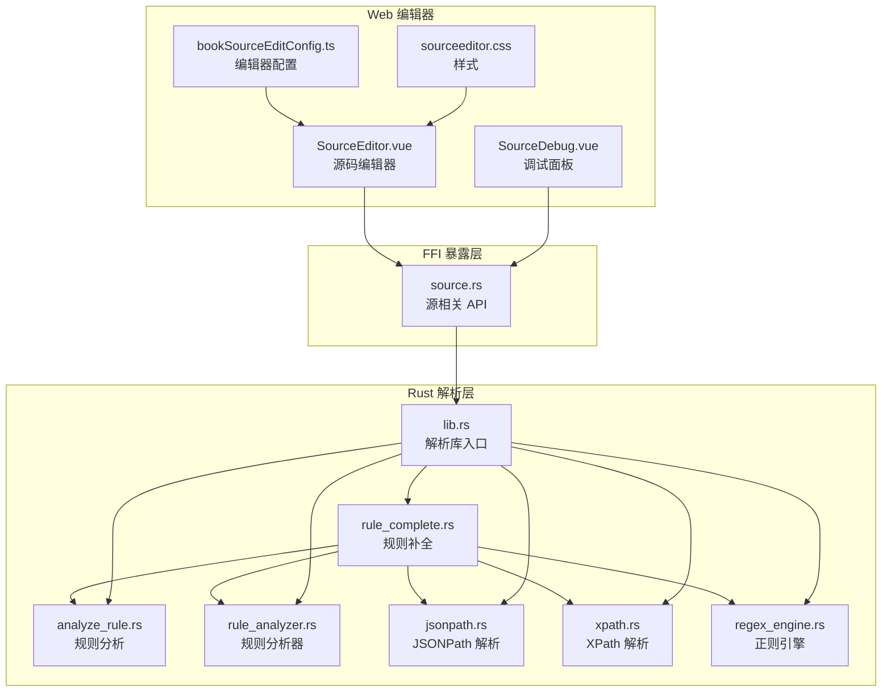
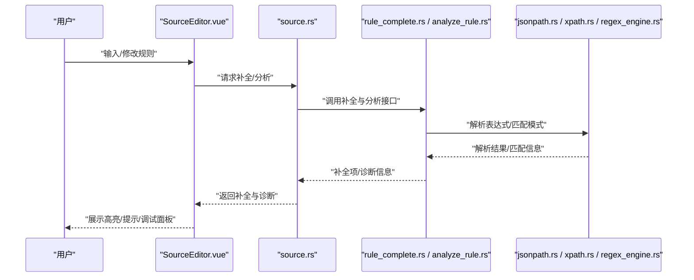
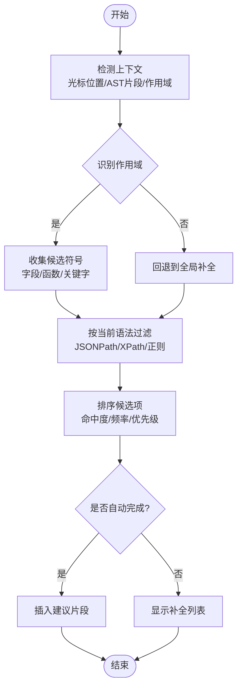
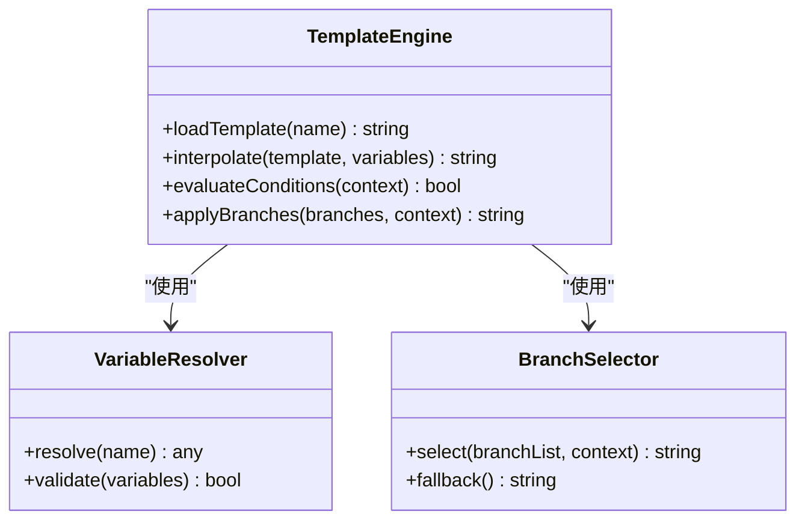
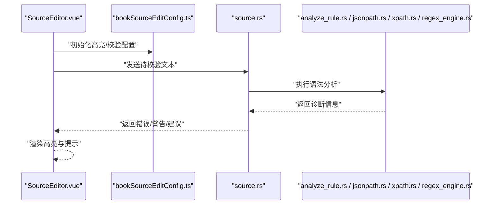
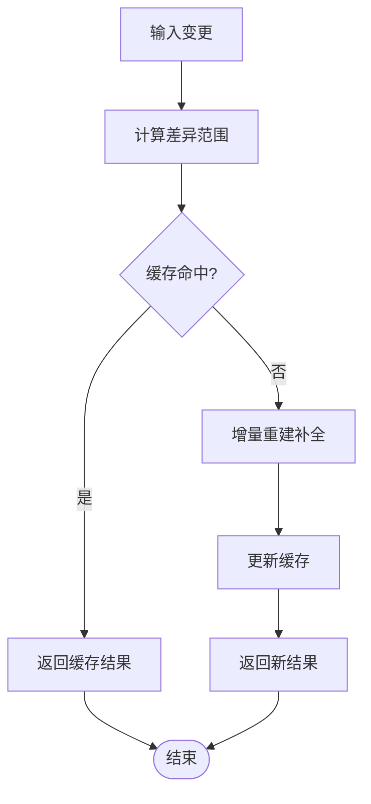
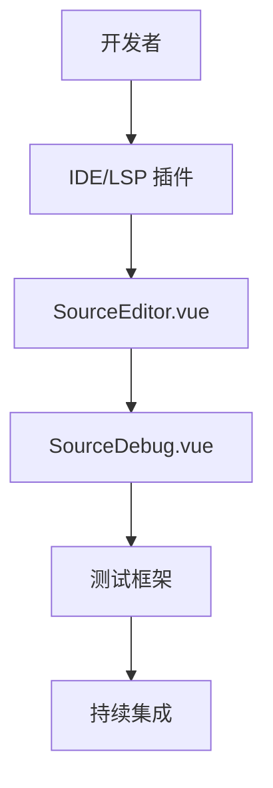
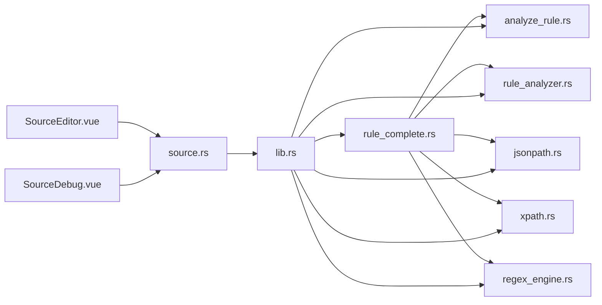

# 规则补全系统

<cite>
**本文引用的文件**   
- [rule_complete.rs](file://rust/legado-parser/src/rule_complete.rs)
- [analyze_rule.rs](file://rust/legado-parser/src/analyze_rule.rs)
- [rule_analyzer.rs](file://rust/legado-parser/src/rule_analyzer.rs)
- [jsonpath.rs](file://rust/legado-parser/src/jsonpath.rs)
- [xpath.rs](file://rust/legado-parser/src/xpath.rs)
- [regex_engine.rs](file://rust/legado-parser/src/regex_engine.rs)
- [lib.rs](file://rust/legado-parser/src/lib.rs)
- [source.rs](file://rust/legado-ffi/src/api/source.rs)
- [book_source_edit_config.ts](file://modules/web/src/config/bookSourceEditConfig.ts)
- [sourceeditor.css](file://modules/web/src/assets/sourceeditor.css)
- [SourceEditor.vue](file://modules/web/src/views/SourceEditor.vue)
- [SourceDebug.vue](file://modules/web/src/components/SourceDebug.vue)
</cite>

## 目录
1. [简介](#简介)
2. [项目结构](#项目结构)
3. [核心组件](#核心组件)
4. [架构总览](#架构总览)
5. [详细组件分析](#详细组件分析)
6. [依赖关系分析](#依赖关系分析)
7. [性能考量](#性能考量)
8. [故障排查指南](#故障排查指南)
9. [结论](#结论)
10. [附录](#附录)

## 简介
本文件面向“规则补全系统”的开发者与使用者，系统性阐述 Legado 中规则补全的实现原理与使用方式。内容覆盖：
- 智能补全算法：上下文感知、语法提示、自动完成
- 规则模板系统：预定义模板、变量插值、条件分支
- 代码高亮与语法检查：实时验证、错误定位、修复建议
- 补全引擎性能优化：增量更新、懒加载、缓存策略
- 规则开发工具链：IDE 集成、调试器、测试框架
- 常用规则模式与最佳实践

## 项目结构
Legado 的规则补全能力由 Rust 解析层（解析与补全）、FFI 暴露层（对外 API）、Web 编辑器（前端展示与交互）共同构成。关键位置如下：
- Rust 解析与补全：位于 rust/legado-parser，包含规则补全、JSONPath/XPath/正则等子模块
- FFI 接口：位于 rust/legado-ffi，将解析与补全能力暴露给上层应用
- Web 编辑器：位于 modules/web，提供源码编辑、调试与配置界面

图表来源
- [rule_complete.rs:1-200](file://rust/legado-parser/src/rule_complete.rs#L1-L200)
- [analyze_rule.rs:1-200](file://rust/legado-parser/src/analyze_rule.rs#L1-L200)
- [rule_analyzer.rs:1-200](file://rust/legado-parser/src/rule_analyzer.rs#L1-L200)
- [jsonpath.rs:1-200](file://rust/legado-parser/src/jsonpath.rs#L1-L200)
- [xpath.rs:1-200](file://rust/legado-parser/src/xpath.rs#L1-L200)
- [regex_engine.rs:1-200](file://rust/legado-parser/src/regex_engine.rs#L1-L200)
- [lib.rs:1-200](file://rust/legado-parser/src/lib.rs#L1-L200)
- [source.rs:1-200](file://rust/legado-ffi/src/api/source.rs#L1-L200)
- [bookSourceEditConfig.ts:1-200](file://modules/web/src/config/bookSourceEditConfig.ts#L1-L200)
- [sourceeditor.css:1-200](file://modules/web/src/assets/sourceeditor.css#L1-L200)
- [SourceEditor.vue:1-200](file://modules/web/src/views/SourceEditor.vue#L1-L200)
- [SourceDebug.vue:1-200](file://modules/web/src/components/SourceDebug.vue#L1-L200)

章节来源
- [lib.rs:1-200](file://rust/legado-parser/src/lib.rs#L1-L200)
- [source.rs:1-200](file://rust/legado-ffi/src/api/source.rs#L1-L200)
- [bookSourceEditConfig.ts:1-200](file://modules/web/src/config/bookSourceEditConfig.ts#L1-L200)
- [sourceeditor.css:1-200](file://modules/web/src/assets/sourceeditor.css#L1-L200)
- [SourceEditor.vue:1-200](file://modules/web/src/views/SourceEditor.vue#L1-L200)
- [SourceDebug.vue:1-200](file://modules/web/src/components/SourceDebug.vue#L1-L200)

## 核心组件
- 规则补全器（rule_complete.rs）：负责基于当前输入上下文生成补全项，包括字段名、函数名、关键字、模板片段等
- 规则分析器（analyze_rule.rs / rule_analyzer.rs）：对规则进行静态分析与语义理解，为补全提供上下文信息
- JSONPath/XPath/正则引擎（jsonpath.rs / xpath.rs / regex_engine.rs）：提供数据提取与匹配能力，辅助补全与校验
- FFI 源 API（source.rs）：向上层暴露规则补全与分析能力
- Web 编辑器（SourceEditor.vue / SourceDebug.vue / bookSourceEditConfig.ts / sourceeditor.css）：提供编辑、高亮、调试与配置

章节来源
- [rule_complete.rs:1-200](file://rust/legado-parser/src/rule_complete.rs#L1-L200)
- [analyze_rule.rs:1-200](file://rust/legado-parser/src/analyze_rule.rs#L1-L200)
- [rule_analyzer.rs:1-200](file://rust/legado-parser/src/rule_analyzer.rs#L1-L200)
- [jsonpath.rs:1-200](file://rust/legado-parser/src/jsonpath.rs#L1-L200)
- [xpath.rs:1-200](file://rust/legado-parser/src/xpath.rs#L1-L200)
- [regex_engine.rs:1-200](file://rust/legado-parser/src/regex_engine.rs#L1-L200)
- [source.rs:1-200](file://rust/legado-ffi/src/api/source.rs#L1-L200)
- [SourceEditor.vue:1-200](file://modules/web/src/views/SourceEditor.vue#L1-L200)
- [SourceDebug.vue:1-200](file://modules/web/src/components/SourceDebug.vue#L1-L200)
- [bookSourceEditConfig.ts:1-200](file://modules/web/src/config/bookSourceEditConfig.ts#L1-L200)
- [sourceeditor.css:1-200](file://modules/web/src/assets/sourceeditor.css#L1-L200)

## 架构总览
整体流程：用户在 Web 编辑器中输入或修改规则，编辑器通过 FFI 调用 Rust 解析层进行分析与补全；解析层结合 JSONPath/XPath/正则等能力返回补全结果与诊断信息；编辑器根据结果实现高亮、提示与调试反馈。

图表来源
- [SourceEditor.vue:1-200](file://modules/web/src/views/SourceEditor.vue#L1-L200)
- [source.rs:1-200](file://rust/legado-ffi/src/api/source.rs#L1-L200)
- [rule_complete.rs:1-200](file://rust/legado-parser/src/rule_complete.rs#L1-L200)
- [analyze_rule.rs:1-200](file://rust/legado-parser/src/analyze_rule.rs#L1-L200)
- [jsonpath.rs:1-200](file://rust/legado-parser/src/jsonpath.rs#L1-L200)
- [xpath.rs:1-200](file://rust/legado-parser/src/xpath.rs#L1-L200)
- [regex_engine.rs:1-200](file://rust/legado-parser/src/regex_engine.rs#L1-L200)

## 详细组件分析

### 智能补全算法（上下文感知、语法提示、自动完成）
- 上下文感知：基于当前光标位置、已解析的 AST 片段、作用域与类型推断，决定可补全的符号集合
- 语法提示：识别当前处于 JSONPath/XPath/正则表达式的哪一段，提供相应语法片段与参数提示
- 自动完成：在触发条件下（如输入点号、括号、引号）自动插入最可能的补全项，并支持二次选择

图表来源
- [rule_complete.rs:1-200](file://rust/legado-parser/src/rule_complete.rs#L1-L200)
- [analyze_rule.rs:1-200](file://rust/legado-parser/src/analyze_rule.rs#L1-L200)
- [rule_analyzer.rs:1-200](file://rust/legado-parser/src/rule_analyzer.rs#L1-L200)

章节来源
- [rule_complete.rs:1-200](file://rust/legado-parser/src/rule_complete.rs#L1-L200)
- [analyze_rule.rs:1-200](file://rust/legado-parser/src/analyze_rule.rs#L1-L200)
- [rule_analyzer.rs:1-200](file://rust/legado-parser/src/rule_analyzer.rs#L1-L200)

### 规则模板系统（预定义模板、变量插值、条件分支）
- 预定义模板：提供常见抓取/处理场景的模板片段，减少重复编写
- 变量插值：在模板中注入运行时变量（如 URL、Cookie、Header），实现动态拼接
- 条件分支：根据上下文状态（如登录态、响应码）选择不同模板路径

图表来源
- [bookSourceEditConfig.ts:1-200](file://modules/web/src/config/bookSourceEditConfig.ts#L1-L200)
- [SourceEditor.vue:1-200](file://modules/web/src/views/SourceEditor.vue#L1-L200)

章节来源
- [bookSourceEditConfig.ts:1-200](file://modules/web/src/config/bookSourceEditConfig.ts#L1-L200)
- [SourceEditor.vue:1-200](file://modules/web/src/views/SourceEditor.vue#L1-L200)

### 代码高亮与语法检查（实时验证、错误定位、修复建议）
- 实时验证：在输入过程中对 JSONPath/XPath/正则进行即时校验，标记错误位置
- 错误定位：提供行号、列号与错误描述，便于快速定位问题
- 修复建议：针对常见错误给出自动修复或替换建议

图表来源
- [SourceEditor.vue:1-200](file://modules/web/src/views/SourceEditor.vue#L1-L200)
- [bookSourceEditConfig.ts:1-200](file://modules/web/src/config/bookSourceEditConfig.ts#L1-L200)
- [source.rs:1-200](file://rust/legado-ffi/src/api/source.rs#L1-L200)
- [analyze_rule.rs:1-200](file://rust/legado-parser/src/analyze_rule.rs#L1-L200)
- [jsonpath.rs:1-200](file://rust/legado-parser/src/jsonpath.rs#L1-L200)
- [xpath.rs:1-200](file://rust/legado-parser/src/xpath.rs#L1-L200)
- [regex_engine.rs:1-200](file://rust/legado-parser/src/regex_engine.rs#L1-L200)

章节来源
- [SourceEditor.vue:1-200](file://modules/web/src/views/SourceEditor.vue#L1-L200)
- [bookSourceEditConfig.ts:1-200](file://modules/web/src/config/bookSourceEditConfig.ts#L1-L200)
- [source.rs:1-200](file://rust/legado-ffi/src/api/source.rs#L1-L200)
- [analyze_rule.rs:1-200](file://rust/legado-parser/src/analyze_rule.rs#L1-L200)
- [jsonpath.rs:1-200](file://rust/legado-parser/src/jsonpath.rs#L1-L200)
- [xpath.rs:1-200](file://rust/legado-parser/src/xpath.rs#L1-L200)
- [regex_engine.rs:1-200](file://rust/legado-parser/src/regex_engine.rs#L1-L200)

### 补全引擎性能优化（增量更新、懒加载、缓存策略）
- 增量更新：仅对变更区域重新计算补全，避免全量重算
- 懒加载：按需加载大型模板与字典，降低初始开销
- 缓存策略：对热点补全项与解析结果进行短期缓存，提升响应速度

图表来源
- [rule_complete.rs:1-200](file://rust/legado-parser/src/rule_complete.rs#L1-L200)
- [analyze_rule.rs:1-200](file://rust/legado-parser/src/analyze_rule.rs#L1-L200)

章节来源
- [rule_complete.rs:1-200](file://rust/legado-parser/src/rule_complete.rs#L1-L200)
- [analyze_rule.rs:1-200](file://rust/legado-parser/src/analyze_rule.rs#L1-L200)

### 规则开发工具链（IDE 集成、调试器、测试框架）
- IDE 集成：通过 VS Code 插件或语言服务器协议（LSP）提供补全、跳转与诊断
- 调试器：SourceDebug.vue 提供运行期调试面板，查看中间结果与日志
- 测试框架：单元测试与集成测试覆盖解析与补全逻辑，确保稳定性

图表来源
- [SourceEditor.vue:1-200](file://modules/web/src/views/SourceEditor.vue#L1-L200)
- [SourceDebug.vue:1-200](file://modules/web/src/components/SourceDebug.vue#L1-L200)

章节来源
- [SourceEditor.vue:1-200](file://modules/web/src/views/SourceEditor.vue#L1-L200)
- [SourceDebug.vue:1-200](file://modules/web/src/components/SourceDebug.vue#L1-L200)

### 常用规则模式与最佳实践
- 数据提取模式：优先使用 JSONPath 获取结构化数据，XPath 处理 HTML 片段
- 容错与重试：在网络请求失败时增加重试与降级逻辑
- 模板复用：将通用逻辑封装为模板，通过变量插值组合
- 性能优化：避免复杂正则，尽量使用精确匹配；合理使用缓存

[本节为概念性指导，不直接分析具体文件]

## 依赖关系分析
解析层内部模块之间的依赖关系清晰，补全器依赖分析器与各类引擎；FFI 层作为统一入口暴露能力；Web 编辑器通过 FFI 与解析层交互。

图表来源
- [rule_complete.rs:1-200](file://rust/legado-parser/src/rule_complete.rs#L1-L200)
- [analyze_rule.rs:1-200](file://rust/legado-parser/src/analyze_rule.rs#L1-L200)
- [rule_analyzer.rs:1-200](file://rust/legado-parser/src/rule_analyzer.rs#L1-L200)
- [jsonpath.rs:1-200](file://rust/legado-parser/src/jsonpath.rs#L1-L200)
- [xpath.rs:1-200](file://rust/legado-parser/src/xpath.rs#L1-L200)
- [regex_engine.rs:1-200](file://rust/legado-parser/src/regex_engine.rs#L1-L200)
- [lib.rs:1-200](file://rust/legado-parser/src/lib.rs#L1-L200)
- [source.rs:1-200](file://rust/legado-ffi/src/api/source.rs#L1-L200)
- [SourceEditor.vue:1-200](file://modules/web/src/views/SourceEditor.vue#L1-L200)
- [SourceDebug.vue:1-200](file://modules/web/src/components/SourceDebug.vue#L1-L200)

章节来源
- [lib.rs:1-200](file://rust/legado-parser/src/lib.rs#L1-L200)
- [source.rs:1-200](file://rust/legado-ffi/src/api/source.rs#L1-L200)

## 性能考量
- 增量更新：仅在输入变化区域重算，避免全量解析
- 懒加载：按需加载模板与字典，降低内存占用与启动时间
- 缓存策略：对热点补全项与解析结果设置 TTL，提高命中率
- 并发控制：限制并行解析任务数量，防止阻塞 UI

[本节为通用性能指导，不直接分析具体文件]

## 故障排查指南
- 常见问题：
  - 补全不生效：检查上下文识别与作用域是否正确
  - 语法错误频繁：确认 JSONPath/XPath/正则表达式是否符合规范
  - 性能下降：排查是否存在全量重算或未命中缓存
- 调试方法：
  - 使用 SourceDebug.vue 查看中间结果与日志
  - 通过 FFI 接口打印诊断信息，定位问题根因
  - 编写单元测试覆盖边界情况

章节来源
- [SourceDebug.vue:1-200](file://modules/web/src/components/SourceDebug.vue#L1-L200)
- [source.rs:1-200](file://rust/legado-ffi/src/api/source.rs#L1-L200)

## 结论
Legado 的规则补全系统以 Rust 解析层为核心，结合 FFI 与 Web 编辑器，实现了高效的上下文感知补全、语法检查与调试能力。通过增量更新、懒加载与缓存策略，系统在性能与体验之间取得平衡。开发者可借助模板系统与工具链快速构建与维护规则。

[本节为总结性内容，不直接分析具体文件]

## 附录
- 术语表：
  - JSONPath：用于从 JSON 文档中提取数据的查询语言
  - XPath：用于从 XML/HTML 文档中提取节点的路径表达式
  - 正则引擎：用于模式匹配与字符串处理的引擎
- 参考资源：
  - 编辑器配置：bookSourceEditConfig.ts
  - 编辑器样式：sourceeditor.css
  - 调试面板：SourceDebug.vue

[本节为补充信息，不直接分析具体文件]