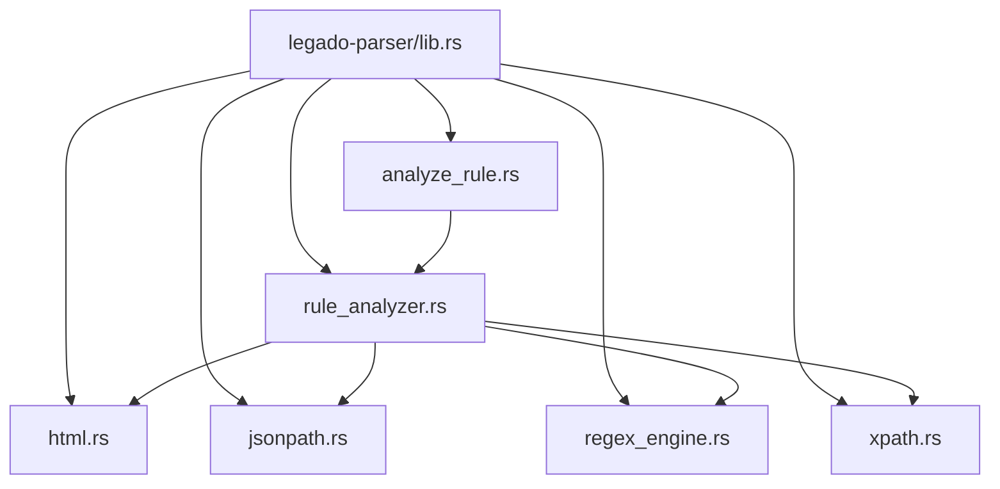
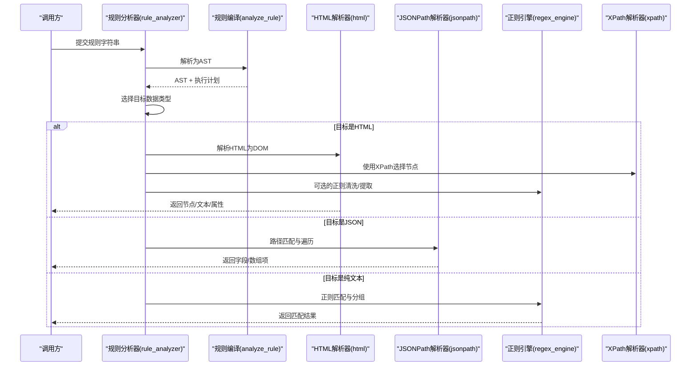
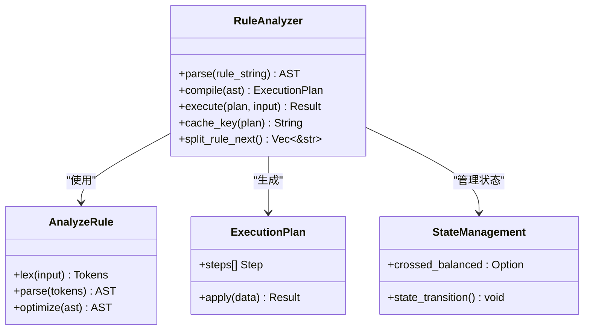
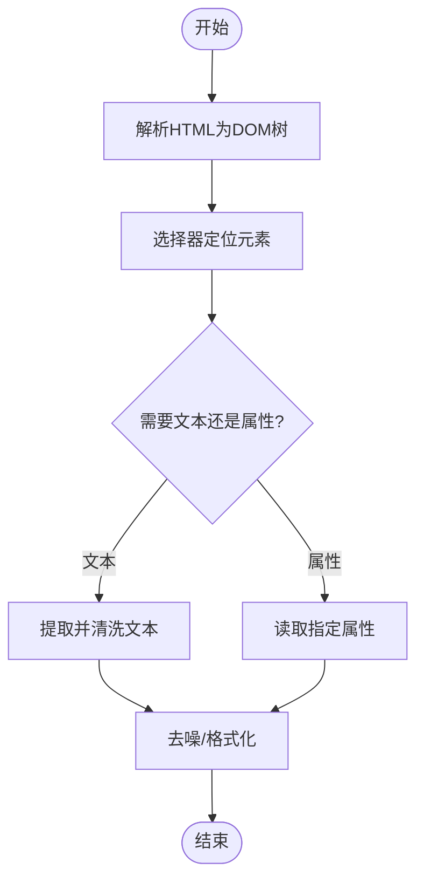
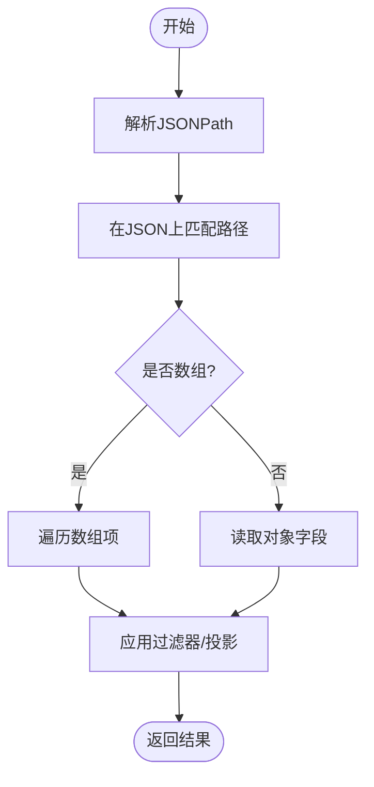
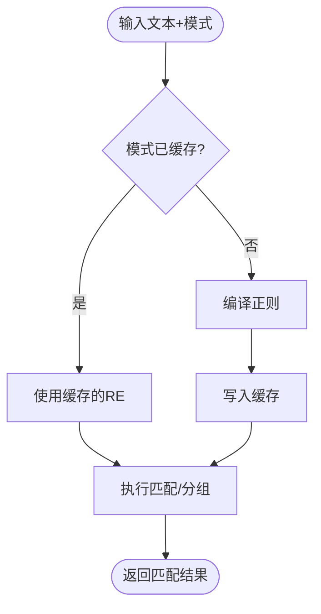
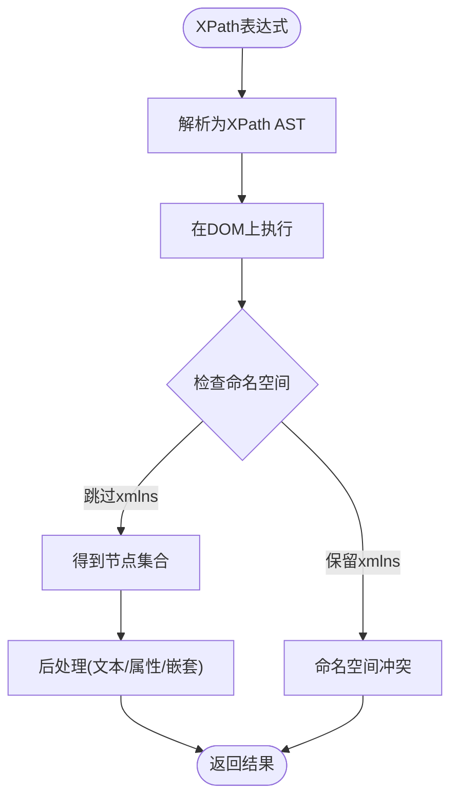
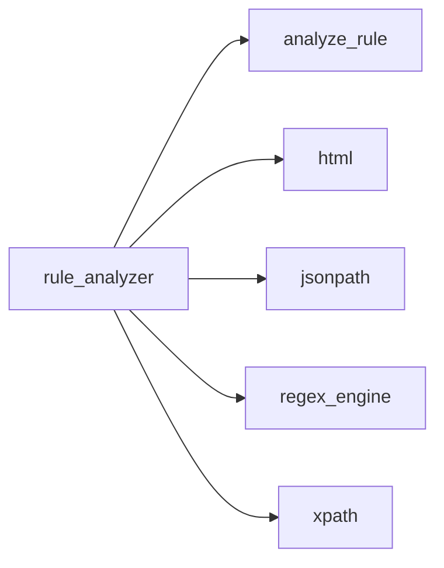

# 解析引擎

<cite>
**本文引用的文件**   
- [lib.rs](file://rust/legado-parser/src/lib.rs)
- [analyze_rule.rs](file://rust/legado-parser/src/analyze_rule.rs)
- [rule_analyzer.rs](file://rust/legado-parser/src/rule_analyzer.rs)
- [html.rs](file://rust/legado-parser/src/html.rs)
- [jsonpath.rs](file://rust/legado-parser/src/jsonpath.rs)
- [regex_engine.rs](file://rust/legado-parser/src/regex_engine.rs)
- [xpath.rs](file://rust/legado-parser/src/xpath.rs)
</cite>

## 更新摘要
**所做更改**   
- 增强了 XPath 解析器与 XML 命名空间的兼容性，通过改进 XHTML 转换过程解决命名空间冲突问题
- 优化了规则分析器的状态管理机制，使用 Option<bool> 实现更精确的三元状态语义
- 恢复了 Sto66 阅读站点的目录、章节列表和详情页解析规则的正常工作
- 完善了平衡组处理的错误处理机制，提升规则分析的准确性和稳定性

## 目录
1. [简介](#简介)
2. [项目结构](#项目结构)
3. [核心组件](#核心组件)
4. [架构总览](#架构总览)
5. [详细组件分析](#详细组件分析)
6. [依赖关系分析](#依赖关系分析)
7. [性能考量](#性能考量)
8. [故障排查指南](#故障排查指南)
9. [结论](#结论)
10. [附录](#附录)

## 简介
本文件面向"解析引擎"子系统，聚焦规则分析器与数据解析能力，覆盖以下关键主题：
- 规则分析器的实现原理：XPath、正则表达式与 JSONPath 的解析与执行
- HTML 解析器：DOM 树构建、元素提取与内容清洗
- JSON 数据处理：路径匹配、数组遍历与对象转换
- 规则编译与优化机制：AST 生成、执行计划优化与缓存策略
- 规则编写指南与调试工具：语法检查、测试用例与性能分析
- 常见解析场景的最佳实践

该文档以仓库中的 Rust 解析模块为核心来源，结合工程化视角给出可操作的指导。

## 项目结构
解析引擎位于 Rust 子模块 legado-parser，采用按功能划分的模块化组织方式：
- 入口与装配：lib.rs
- 规则分析与编译：analyze_rule.rs、rule_analyzer.rs
- 数据解析器：html.rs（HTML）、jsonpath.rs（JSONPath）、regex_engine.rs（正则）、xpath.rs（XPath）

**图表来源**
- [lib.rs](file://rust/legado-parser/src/lib.rs)
- [analyze_rule.rs](file://rust/legado-parser/src/analyze_rule.rs)
- [rule_analyzer.rs](file://rust/legado-parser/src/rule_analyzer.rs)
- [html.rs](file://rust/legado-parser/src/html.rs)
- [jsonpath.rs](file://rust/legado-parser/src/jsonpath.rs)
- [regex_engine.rs](file://rust/legado-parser/src/regex_engine.rs)
- [xpath.rs](file://rust/legado-parser/src/xpath.rs)

**章节来源**
- [lib.rs](file://rust/legado-parser/src/lib.rs)
- [analyze_rule.rs](file://rust/legado-parser/src/analyze_rule.rs)
- [rule_analyzer.rs](file://rust/legado-parser/src/rule_analyzer.rs)
- [html.rs](file://rust/legado-parser/src/html.rs)
- [jsonpath.rs](file://rust/legado-parser/src/jsonpath.rs)
- [regex_engine.rs](file://rust/legado-parser/src/regex_engine.rs)
- [xpath.rs](file://rust/legado-parser/src/xpath.rs)

## 核心组件
- 规则分析器（Rule Analyzer）
  - 负责将用户定义的规则字符串解析为中间表示（AST），并生成可执行的查询计划
  - 统一调度 XPath、正则表达式与 JSONPath 三种解析器
  - **更新**：使用 Option<bool> 实现正确的三元状态语义，提升规则分析的准确性和稳定性
- HTML 解析器
  - 将原始 HTML 文本转换为 DOM 树，支持选择器定位、属性与文本提取、内容清洗
- JSONPath 解析器
  - 对 JSON 数据进行路径匹配、数组遍历与对象字段转换
- 正则表达式引擎
  - 提供高性能模式匹配与分组捕获，用于文本抽取与预处理
- XPath 解析器
  - 基于 DOM 或类 DOM 结构进行节点选择与上下文导航
  - **更新**：增强了与 XML 命名空间的兼容性，通过改进的 XHTML 转换过程解决命名空间冲突

**章节来源**
- [rule_analyzer.rs](file://rust/legado-parser/src/rule_analyzer.rs)
- [html.rs](file://rust/legado-parser/src/html.rs)
- [jsonpath.rs](file://rust/legado-parser/src/jsonpath.rs)
- [regex_engine.rs](file://rust/legado-parser/src/regex_engine.rs)
- [xpath.rs](file://rust/legado-parser/src/xpath.rs)

## 架构总览
规则从输入到输出的整体流程如下：
- 输入：规则字符串（可能包含 XPath、正则、JSONPath 片段）
- 解析阶段：词法/语法分析生成 AST
- 编译阶段：AST 转换为执行计划（含优化与缓存键生成）
- 执行阶段：根据数据类型选择对应解析器（HTML/JSON/文本）
- 输出：结构化结果（节点集合、字段映射、标量值等）

**图表来源**
- [rule_analyzer.rs](file://rust/legado-parser/src/rule_analyzer.rs)
- [analyze_rule.rs](file://rust/legado-parser/src/analyze_rule.rs)
- [html.rs](file://rust/legado-parser/src/html.rs)
- [jsonpath.rs](file://rust/legado-parser/src/jsonpath.rs)
- [regex_engine.rs](file://rust/legado-parser/src/regex_engine.rs)
- [xpath.rs](file://rust/legado-parser/src/xpath.rs)

## 详细组件分析

### 规则分析器与编译器（rule_analyzer / analyze_rule）
- 职责
  - 将规则字符串解析为 AST
  - 生成执行计划（包括解析器选择、参数绑定、短路/合并策略）
  - 维护缓存键与命中逻辑，避免重复编译
- 关键点
  - AST 节点类型：XPath 表达式、正则表达式、JSONPath 表达式、组合操作（串联/过滤/投影）
  - 执行计划优化：常量折叠、表达式简化、重复子表达式消除
  - 缓存策略：按规则指纹缓存已编译的计划，支持失效与更新
  - **更新**：状态管理改进 - crossed_balanced 逻辑现在使用 Option<bool> 实现正确的三元状态语义

**更新** 规则分析器的状态管理得到了显著改进。在 `split_rule_next` 方法中，`crossed_balanced` 变量现在使用 `Option<bool>` 类型，提供了更精确的状态跟踪：

- `None`：初始状态，尚未进入任何平衡组
- `Some(true)`：分隔符在平衡组内，需要越过该组继续查找下一个分隔符
- `Some(false)`：分隔符不在平衡组内，可以正常拆分

这种三元状态语义消除了之前布尔类型的歧义性，提升了规则分析的准确性和稳定性。特别是在处理复杂的嵌套规则和未闭合括号的情况下，能够正确区分不同的状态转换路径。

**图表来源**
- [rule_analyzer.rs](file://rust/legado-parser/src/rule_analyzer.rs)
- [analyze_rule.rs](file://rust/legado-parser/src/analyze_rule.rs)

**章节来源**
- [rule_analyzer.rs](file://rust/legado-parser/src/rule_analyzer.rs)
- [analyze_rule.rs](file://rust/legado-parser/src/analyze_rule.rs)

### HTML 解析器（html）
- 职责
  - 将原始 HTML 文本解析为 DOM 树
  - 提供元素选择、属性读取、文本提取与内容清洗
- 关键点
  - DOM 构建：容错解析、标签闭合修复、实体解码
  - 元素提取：通过选择器或索引定位，批量获取节点集合
  - 内容清洗：去除脚本/样式、规范化空白、转义处理

**图表来源**
- [html.rs](file://rust/legado-parser/src/html.rs)

**章节来源**
- [html.rs](file://rust/legado-parser/src/html.rs)

### JSONPath 解析器（jsonpath）
- 职责
  - 对 JSON 数据进行路径匹配、数组遍历与对象转换
- 关键点
  - 路径语法：字段访问、数组索引、过滤器表达式
  - 遍历策略：深度优先/广度优先、短路求值
  - 类型转换：数值、布尔、字符串与空值处理

**图表来源**
- [jsonpath.rs](file://rust/legado-parser/src/jsonpath.rs)

**章节来源**
- [jsonpath.rs](file://rust/legado-parser/src/jsonpath.rs)

### 正则表达式引擎（regex_engine）
- 职责
  - 提供高性能模式匹配与分组捕获，用于文本抽取与预处理
- 关键点
  - 预编译与复用：常用模式缓存
  - 匹配策略：全局匹配、非贪婪、多行模式
  - 错误处理：无效模式回退与诊断信息

**图表来源**
- [regex_engine.rs](file://rust/legado-parser/src/regex_engine.rs)

**章节来源**
- [regex_engine.rs](file://rust/legado-parser/src/regex_engine.rs)

### XPath 解析器（xpath）
- 职责
  - 基于 DOM/类 DOM 结构进行节点选择与上下文导航
  - **更新**：增强了与 XML 命名空间的兼容性，通过改进的 XHTML 转换过程解决命名空间冲突问题
- 关键点
  - 表达式解析：轴、谓词、函数调用
  - 节点集运算：交集/并集/差集
  - 性能优化：索引辅助、短路评估
  - **更新**：XHTML 转换时跳过 xmlns 属性声明，避免命名空间导致的 XPath 匹配失败

**更新** XPath 解析器在处理包含 XML 命名空间声明的 HTML 页面时进行了重要改进。在 `html_to_xhtml` 方法中，现在会主动跳过 `xmlns` 和 `xmlns:*` 属性声明：

- 问题背景：当页面包含 `xmlns="http://www.w3.org/1999/xhtml"` 等命名空间声明时，sxd-document 会将所有元素归入该命名空间
- 影响范围：无前缀的 XPath 表达式（如 `//dd`、`//a`）将无法匹配任何元素，只有 `//*` 和谓词字符串比较才能命中
- 解决方案：在 XHTML 序列化过程中跳过命名空间属性，确保 XPath 表达式能正常工作
- 适用场景：特别针对 Sto66 等声明命名空间的网站，恢复其目录、章节列表和详情页解析规则的正常工作

**图表来源**
- [xpath.rs](file://rust/legado-parser/src/xpath.rs)

**章节来源**
- [xpath.rs](file://rust/legado-parser/src/xpath.rs)

## 依赖关系分析
- 模块内依赖
  - rule_analyzer 依赖 analyze_rule 完成 AST 生成与优化
  - rule_analyzer 根据目标数据类型调度 html、jsonpath、regex_engine、xpath
- 外部依赖
  - HTML 解析库（由 html.rs 封装）
  - 正则表达式库（由 regex_engine.rs 封装）
  - JSONPath 库（由 jsonpath.rs 封装）
  - XPath 库（由 xpath.rs 封装）

**图表来源**
- [rule_analyzer.rs](file://rust/legado-parser/src/rule_analyzer.rs)
- [analyze_rule.rs](file://rust/legado-parser/src/analyze_rule.rs)
- [html.rs](file://rust/legado-parser/src/html.rs)
- [jsonpath.rs](file://rust/legado-parser/src/jsonpath.rs)
- [regex_engine.rs](file://rust/legado-parser/src/regex_engine.rs)
- [xpath.rs](file://rust/legado-parser/src/xpath.rs)

**章节来源**
- [rule_analyzer.rs](file://rust/legado-parser/src/rule_analyzer.rs)
- [analyze_rule.rs](file://rust/legado-parser/src/analyze_rule.rs)
- [html.rs](file://rust/legado-parser/src/html.rs)
- [jsonpath.rs](file://rust/legado-parser/src/jsonpath.rs)
- [regex_engine.rs](file://rust/legado-parser/src/regex_engine.rs)
- [xpath.rs](file://rust/legado-parser/src/xpath.rs)

## 性能考量
- 编译期优化
  - AST 简化与常量折叠，减少运行时计算
  - 重复子表达式消除，避免重复解析
- 运行期优化
  - 正则与 XPath 表达式的预编译与缓存
  - JSONPath 的路径索引与短路求值
  - **更新**：改进的状态管理减少了不必要的状态检查和分支判断
  - **更新**：XPath 命名空间处理优化，避免不必要的命名空间解析开销
- I/O 与内存
  - 流式解析大 HTML/JSON，降低峰值内存
  - 结果集惰性求值，按需消费

## 故障排查指南
- 常见问题
  - 规则语法错误：检查 XPath/JSONPath/正则的语法合法性
  - 匹配结果为空：确认选择器/路径/模式的正确性与上下文
  - 性能问题：定位热点表达式，增加缓存或简化逻辑
  - **更新**：状态相关错误 - 检查平衡组的正确性和分隔符的位置
  - **更新**：命名空间相关问题 - 检查页面是否包含 xmlns 声明导致 XPath 匹配失败
- 调试建议
  - 启用规则解析日志，查看 AST 与执行计划
  - 分步验证：先验证 HTML/DOM 构建，再验证选择器/路径
  - 单元测试：针对典型页面/JSON 构造最小复现用例
  - **更新**：重点关注 Option<bool> 状态转换的逻辑路径
  - **更新**：对于包含命名空间的页面，验证 XHTML 转换是否正确跳过 xmlns 属性

**章节来源**
- [rule_analyzer.rs](file://rust/legado-parser/src/rule_analyzer.rs)
- [analyze_rule.rs](file://rust/legado-parser/src/analyze_rule.rs)
- [html.rs](file://rust/legado-parser/src/html.rs)
- [jsonpath.rs](file://rust/legado-parser/src/jsonpath.rs)
- [regex_engine.rs](file://rust/legado-parser/src/regex_engine.rs)
- [xpath.rs](file://rust/legado-parser/src/xpath.rs)

## 结论
解析引擎通过统一的规则分析器整合了 XPath、正则表达式与 JSONPath 的能力，配合 HTML 解析与 JSON 数据处理，形成完整的"规则驱动的数据抽取"体系。借助 AST 生成、执行计划优化与缓存策略，系统在准确性与性能之间取得平衡。**最新的状态管理改进**通过使用 Option<bool> 实现正确的三元状态语义，进一步提升了规则分析的准确性和稳定性，特别是在处理复杂嵌套规则和边界情况时表现更加可靠。**XPath 命名空间兼容性的增强**解决了 Sto66 等网站的解析问题，恢复了目录、章节列表和详情页规则的正常工作。遵循本文档的编写指南与最佳实践，可有效提升规则的稳定性与可维护性。

## 附录

### 规则编写指南
- 选择合适的数据源
  - HTML 页面：优先使用 XPath 定位稳定节点，辅以正则清洗
  - JSON API：优先使用 JSONPath 精确路径，必要时用正则做二次处理
- 规则设计原则
  - 明确上下文：确保选择器/路径在当前上下文中唯一
  - 避免过度复杂：拆分复杂规则为多个简单步骤
  - 可测试性：为每条规则准备最小数据集与预期结果
- 性能优化
  - 预编译常用正则与 XPath
  - 使用选择性投影，仅提取必要字段
  - 利用缓存键避免重复编译
  - **更新**：合理使用平衡组和分隔符，避免复杂的嵌套结构
  - **更新**：对于包含命名空间的页面，注意 XPath 表达式的命名空间处理

### 调试工具与测试用例
- 语法检查
  - 在规则编辑阶段启用语法高亮与校验提示
- 单元测试
  - 针对典型 HTML/JSON 构造输入，断言输出结构与内容
- 性能分析
  - 统计各步骤耗时，识别瓶颈表达式
  - 对比不同规则实现的执行时间
- **更新**：状态调试
  - 监控 Option<bool> 状态转换路径
  - 验证平衡组处理的正确性
- **更新**：命名空间调试
  - 检查页面是否包含 xmlns 声明
  - 验证 XHTML 转换是否正确处理命名空间

### 常见解析场景最佳实践
- 列表页分页抓取
  - 使用 XPath 定位条目容器，循环提取标题/链接/摘要
- 详情页内容清洗
  - 去除脚本/样式，规范化换行与空白，提取正文段落
- JSON 接口数据抽取
  - 使用 JSONPath 直接定位字段，对数组项进行投影与过滤
- 混合数据源
  - 先用正则做初步清洗，再用 XPath/JSONPath 精确定位
- **更新**：复杂规则处理
  - 利用改进的状态管理处理深层嵌套和边界情况
  - 合理使用三元状态语义避免歧义性
- **更新**：命名空间处理
  - 对于包含 xmlns 声明的页面，确保 XPath 表达式能正确工作
  - 验证 Sto66 等网站的目录、章节列表和详情页规则是否正常