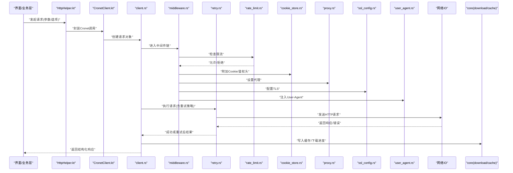
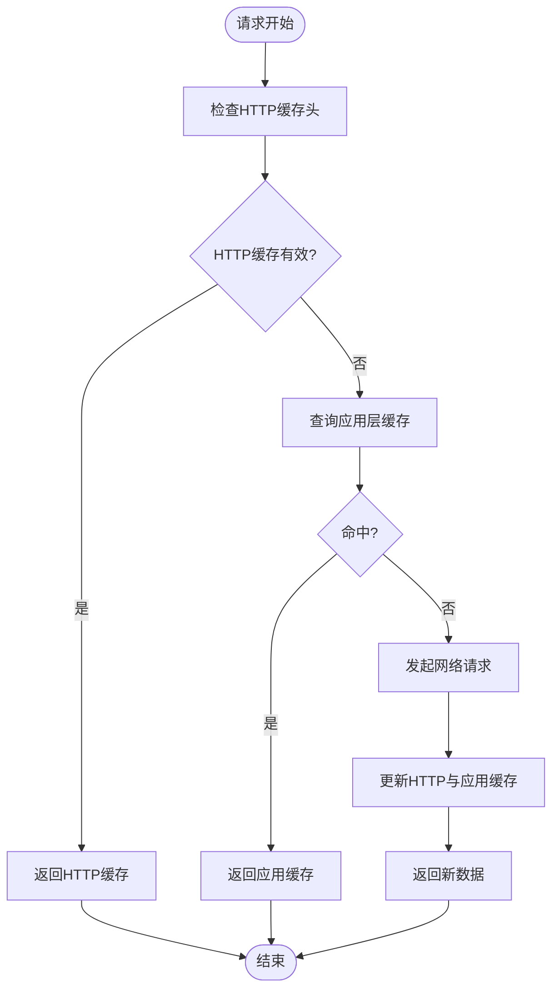
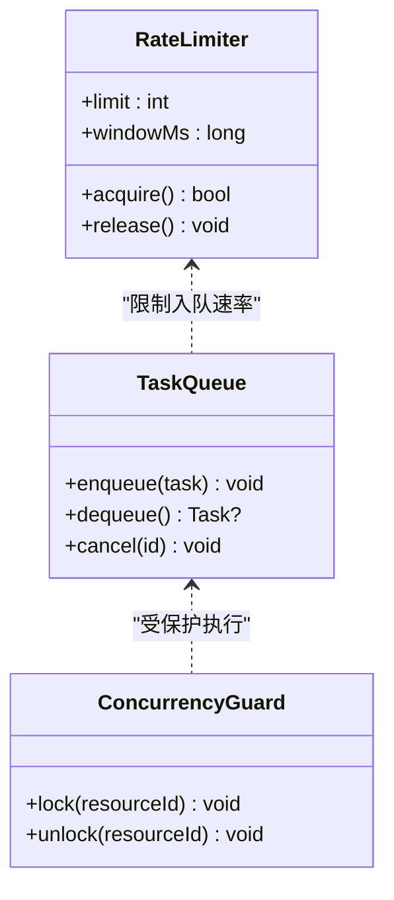
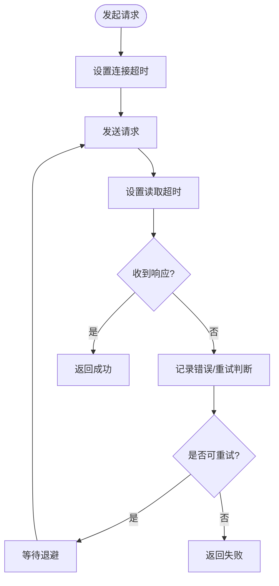
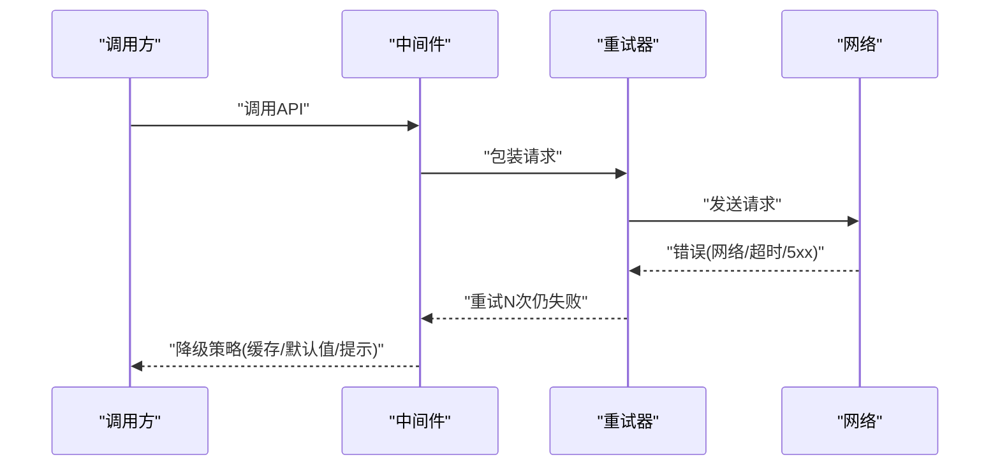
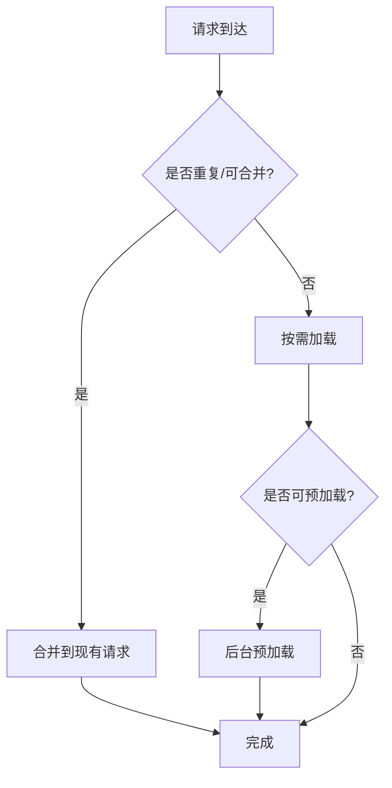
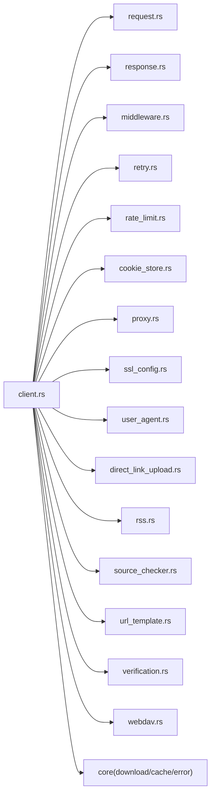

# API调用最佳实践

<cite>
**本文引用的文件**   
- [legado-net/client.rs](file://rust/legado-net/src/client.rs)
- [legado-net/request.rs](file://rust/legado-net/src/request.rs)
- [legado-net/response.rs](file://rust/legado-net/src/response.rs)
- [legado-net/retry.rs](file://rust/legado-net/src/retry.rs)
- [legado-net/rate_limit.rs](file://rust/legado-net/src/rate_limit.rs)
- [legado-net/middleware.rs](file://rust/legado-net/src/middleware.rs)
- [legado-net/cookie_store.rs](file://rust/legado-net/src/cookie_store.rs)
- [legado-net/proxy.rs](file://rust/legado-net/src/proxy.rs)
- [legado-net/ssl_config.rs](file://rust/legado-net/src/ssl_config.rs)
- [legado-net/user_agent.rs](file://rust/legado-net/src/user_agent.rs)
- [legado-net/direct_link_upload.rs](file://rust/legado-net/src/direct_link_upload.rs)
- [legado-net/rss.rs](file://rust/legado-net/src/rss.rs)
- [legado-net/source_checker.rs](file://rust/legado-net/src/source_checker.rs)
- [legado-net/url_template.rs](file://rust/legado-net/src/url_template.rs)
- [legado-net/verification.rs](file://rust/legado-net/src/verification.rs)
- [legado-net/webdav.rs](file://rust/legado-net/src/webdav.rs)
- [legado-core/download_manager.rs](file://rust/legado-core/src/download_manager.rs)
- [legado-core/cache_book.rs](file://rust/legado-core/src/cache_book.rs)
- [legado-core/read_aloud.rs](file://rust/legado-core/src/read_aloud.rs)
- [legado-core/audio_cache.rs](file://rust/legado-core/src/audio_cache.rs)
- [legado-core/audio_preload.rs](file://rust/legado-core/src/audio_preload.rs)
- [legado-core/content_processor.rs](file://rust/legado-core/src/content_processor.rs)
- [legado-core/error.rs](file://rust/legado-core/src/error.rs)
- [app/src/main/java/io/legado/app/help/http/HttpHelper.kt](file://app/src/main/java/io/legado/app/help/http/HttpHelper.kt)
- [app/src/main/java/io/legado/app/lib/cronet/CronetClient.kt](file://app/src/main/java/io/legado/app/lib/cronet/CronetClient.kt)
- [modules/web/src/api/axios.ts](file://modules/web/src/api/axios.ts)
- [modules/web/src/api/index.ts](file://modules/web/src/api/index.ts)
</cite>

## 目录
1. [简介](#简介)
2. [项目结构](#项目结构)
3. [核心组件](#核心组件)
4. [架构总览](#架构总览)
5. [详细组件分析](#详细组件分析)
6. [依赖关系分析](#依赖关系分析)
7. [性能考量](#性能考量)
8. [故障排查指南](#故障排查指南)
9. [结论](#结论)
10. [附录](#附录)

## 简介
本文件面向Legado项目中与API调用相关的实现，系统化总结并提炼“API调用最佳实践”。内容覆盖：
- 缓存策略（HTTP层与应用层缓存、失效机制）
- 并发控制（请求限流、任务队列、资源竞争处理）
- 超时处理（连接超时、读取超时、重试策略）
- 错误处理模式（异常捕获、降级处理、用户体验优化）
- 性能优化（请求合并、懒加载、预加载）
- 调试与监控（日志记录、性能分析、问题排查）

目标读者包括后端集成者、客户端开发者以及需要理解Legado网络栈行为的维护人员。

## 项目结构
Legado的网络能力由Rust侧的legado-net模块提供底层HTTP客户端、中间件、重试、限流等能力；应用层通过Android端的Cronet封装与Kotlin工具类进行调用；Web端使用Axios统一封装。核心数据持久化与缓存由legado-core中的下载管理器、缓存模型等支撑。

```mermaid
graph TB
subgraph "Android 应用层"
A_HttpHelper["HttpHelper.kt"]
A_CronetClient["CronetClient.kt"]
end
subgraph "Rust 网络层(legado-net)"
R_Client["client.rs"]
R_Request["request.rs"]
R_Response["response.rs"]
R_Middleware["middleware.rs"]
R_Retry["retry.rs"]
R_RateLimit["rate_limit.rs"]
R_Cookie["cookie_store.rs"]
R_Proxy["proxy.rs"]
R_SSL["ssl_config.rs"]
R_UA["user_agent.rs"]
R_DirectUpload["direct_link_upload.rs"]
R_RSS["rss.rs"]
R_SourceChecker["source_checker.rs"]
R_URLTemplate["url_template.rs"]
R_Verification["verification.rs"]
R_WebDAV["webdav.rs"]
end
subgraph "Rust 核心能力(legado-core)"
C_DownloadMgr["download_manager.rs"]
C_CacheBook["cache_book.rs"]
C_ReadAloud["read_aloud.rs"]
C_AudioCache["audio_cache.rs"]
C_AudioPreload["audio_preload.rs"]
C_ContentProc["content_processor.rs"]
C_Error["error.rs"]
end
subgraph "Web 前端"
W_Axios["axios.ts"]
W_Index["index.ts"]
end
A_HttpHelper --> A_CronetClient
A_CronetClient --> R_Client
R_Client --> R_Request
R_Client --> R_Response
R_Client --> R_Middleware
R_Client --> R_Retry
R_Client --> R_RateLimit
R_Client --> R_Cookie
R_Client --> R_Proxy
R_Client --> R_SSL
R_Client --> R_UA
R_Client --> R_DirectUpload
R_Client --> R_RSS
R_Client --> R_SourceChecker
R_Client --> R_URLTemplate
R_Client --> R_Verification
R_Client --> R_WebDAV
R_Client --> C_DownloadMgr
R_Client --> C_CacheBook
R_Client --> C_ReadAloud
R_Client --> C_AudioCache
R_Client --> C_AudioPreload
R_Client --> C_ContentProc
R_Client --> C_Error
W_Axios --> W_Index
```

图表来源
- [legado-net/client.rs](file://rust/legado-net/src/client.rs)
- [legado-net/request.rs](file://rust/legado-net/src/request.rs)
- [legado-net/response.rs](file://rust/legado-net/src/response.rs)
- [legado-net/middleware.rs](file://rust/legado-net/src/middleware.rs)
- [legado-net/retry.rs](file://rust/legado-net/src/retry.rs)
- [legado-net/rate_limit.rs](file://rust/legado-net/src/rate_limit.rs)
- [legado-net/cookie_store.rs](file://rust/legado-net/src/cookie_store.rs)
- [legado-net/proxy.rs](file://rust/legado-net/src/proxy.rs)
- [legado-net/ssl_config.rs](file://rust/legado-net/src/ssl_config.rs)
- [legado-net/user_agent.rs](file://rust/legado-net/src/user_agent.rs)
- [legado-net/direct_link_upload.rs](file://rust/legado-net/src/direct_link_upload.rs)
- [legado-net/rss.rs](file://rust/legado-net/src/rss.rs)
- [legado-net/source_checker.rs](file://rust/legado-net/src/source_checker.rs)
- [legado-net/url_template.rs](file://rust/legado-net/src/url_template.rs)
- [legado-net/verification.rs](file://rust/legado-net/src/verification.rs)
- [legado-net/webdav.rs](file://rust/legado-net/src/webdav.rs)
- [legado-core/download_manager.rs](file://rust/legado-core/src/download_manager.rs)
- [legado-core/cache_book.rs](file://rust/legado-core/src/cache_book.rs)
- [legado-core/read_aloud.rs](file://rust/legado-core/src/read_aloud.rs)
- [legado-core/audio_cache.rs](file://rust/legado-core/src/audio_cache.rs)
- [legado-core/audio_preload.rs](file://rust/legado-core/src/audio_preload.rs)
- [legado-core/content_processor.rs](file://rust/legado-core/src/content_processor.rs)
- [legado-core/error.rs](file://rust/legado-core/src/error.rs)
- [app/src/main/java/io/legado/app/help/http/HttpHelper.kt](file://app/src/main/java/io/legado/app/help/http/HttpHelper.kt)
- [app/src/main/java/io/legado/app/lib/cronet/CronetClient.kt](file://app/src/main/java/io/legado/app/lib/cronet/CronetClient.kt)
- [modules/web/src/api/axios.ts](file://modules/web/src/api/axios.ts)
- [modules/web/src/api/index.ts](file://modules/web/src/api/index.ts)

章节来源
- [legado-net/client.rs](file://rust/legado-net/src/client.rs)
- [app/src/main/java/io/legado/app/help/http/HttpHelper.kt](file://app/src/main/java/io/legado/app/help/http/HttpHelper.kt)
- [app/src/main/java/io/legado/app/lib/cronet/CronetClient.kt](file://app/src/main/java/io/legado/app/lib/cronet/CronetClient.kt)
- [modules/web/src/api/axios.ts](file://modules/web/src/api/axios.ts)

## 核心组件
- HTTP客户端与请求构建：负责构造请求、设置头部、代理、SSL、Cookie、User-Agent等，并驱动中间件链执行。
- 响应处理：统一解析响应体、状态码、错误映射，为上层提供一致的数据结构。
- 重试与退避：对可恢复错误进行指数退避或固定间隔重试，避免雪崩。
- 限流与并发：基于令牌桶或滑动窗口限制QPS，保护下游服务。
- Cookie与鉴权：集中管理会话Cookie与鉴权头，支持刷新与同步。
- 代理与SSL：支持系统代理、自定义证书与TLS配置。
- 业务扩展：RSS抓取、源健康检查、URL模板渲染、验证码处理、WebDAV上传等。
- 下载与缓存：断点续传、分块下载、本地缓存、音频预取与缓存。
- 错误与诊断：统一错误类型、日志埋点、性能指标上报。

章节来源
- [legado-net/request.rs](file://rust/legado-net/src/request.rs)
- [legado-net/response.rs](file://rust/legado-net/src/response.rs)
- [legado-net/retry.rs](file://rust/legado-net/src/retry.rs)
- [legado-net/rate_limit.rs](file://rust/legado-net/src/rate_limit.rs)
- [legado-net/cookie_store.rs](file://rust/legado-net/src/cookie_store.rs)
- [legado-net/proxy.rs](file://rust/legado-net/src/proxy.rs)
- [legado-net/ssl_config.rs](file://rust/legado-net/src/ssl_config.rs)
- [legado-net/user_agent.rs](file://rust/legado-net/src/user_agent.rs)
- [legado-net/direct_link_upload.rs](file://rust/legado-net/src/direct_link_upload.rs)
- [legado-net/rss.rs](file://rust/legado-net/src/rss.rs)
- [legado-net/source_checker.rs](file://rust/legado-net/src/source_checker.rs)
- [legado-net/url_template.rs](file://rust/legado-net/src/url_template.rs)
- [legado-net/verification.rs](file://rust/legado-net/src/verification.rs)
- [legado-net/webdav.rs](file://rust/legado-net/src/webdav.rs)
- [legado-core/download_manager.rs](file://rust/legado-core/src/download_manager.rs)
- [legado-core/cache_book.rs](file://rust/legado-core/src/cache_book.rs)
- [legado-core/audio_cache.rs](file://rust/legado-core/src/audio_cache.rs)
- [legado-core/audio_preload.rs](file://rust/legado-core/src/audio_preload.rs)
- [legado-core/error.rs](file://rust/legado-core/src/error.rs)

## 架构总览
下图展示一次典型API调用的端到端流程，涵盖Android到Rust网络栈、中间件、重试、限流、Cookie、代理、SSL、业务扩展及下载/缓存。

图表来源
- [app/src/main/java/io/legado/app/help/http/HttpHelper.kt](file://app/src/main/java/io/legado/app/help/http/HttpHelper.kt)
- [app/src/main/java/io/legado/app/lib/cronet/CronetClient.kt](file://app/src/main/java/io/legado/app/lib/cronet/CronetClient.kt)
- [legado-net/client.rs](file://rust/legado-net/src/client.rs)
- [legado-net/middleware.rs](file://rust/legado-net/src/middleware.rs)
- [legado-net/retry.rs](file://rust/legado-net/src/retry.rs)
- [legado-net/rate_limit.rs](file://rust/legado-net/src/rate_limit.rs)
- [legado-net/cookie_store.rs](file://rust/legado-net/src/cookie_store.rs)
- [legado-net/proxy.rs](file://rust/legado-net/src/proxy.rs)
- [legado-net/ssl_config.rs](file://rust/legado-net/src/ssl_config.rs)
- [legado-net/user_agent.rs](file://rust/legado-net/src/user_agent.rs)
- [legado-core/download_manager.rs](file://rust/legado-core/src/download_manager.rs)

## 详细组件分析

### 缓存策略（HTTP缓存与应用层缓存、失效机制）
- HTTP缓存
  - 利用标准缓存头（如ETag、Last-Modified、Cache-Control）减少重复传输。
  - 在中间件中根据响应头决定是否走缓存路径，并在请求中携带条件请求头。
- 应用层缓存
  - 以键值形式缓存热点数据（如搜索结果、目录信息），结合TTL与容量上限。
  - 针对音频与书籍内容采用专用缓存（音频缓存、书籍缓存），支持预取与懒加载。
- 失效机制
  - 基于时间过期、版本变更、用户操作触发失效。
  - 对强一致性场景采用主动失效（如更新后删除旧缓存）。

图表来源
- [legado-net/middleware.rs](file://rust/legado-net/src/middleware.rs)
- [legado-core/cache_book.rs](file://rust/legado-core/src/cache_book.rs)
- [legado-core/audio_cache.rs](file://rust/legado-core/src/audio_cache.rs)
- [legado-core/audio_preload.rs](file://rust/legado-core/src/audio_preload.rs)

章节来源
- [legado-net/middleware.rs](file://rust/legado-net/src/middleware.rs)
- [legado-core/cache_book.rs](file://rust/legado-core/src/cache_book.rs)
- [legado-core/audio_cache.rs](file://rust/legado-core/src/audio_cache.rs)
- [legado-core/audio_preload.rs](file://rust/legado-core/src/audio_preload.rs)

### 并发控制（请求限流、任务队列、资源竞争处理）
- 请求限流
  - 使用令牌桶/滑动窗口限制单位时间内的请求数，避免触发服务端限流。
  - 按域名或接口维度隔离限流策略。
- 任务队列
  - 将耗时任务入队，串行或并行执行，保证顺序与背压。
  - 支持优先级与取消机制。
- 资源竞争
  - 对共享资源加锁或使用原子操作，避免竞态条件。
  - 对下载与缓存写入采用互斥与幂等设计。

图表来源
- [legado-net/rate_limit.rs](file://rust/legado-net/src/rate_limit.rs)
- [legado-core/download_manager.rs](file://rust/legado-core/src/download_manager.rs)

章节来源
- [legado-net/rate_limit.rs](file://rust/legado-net/src/rate_limit.rs)
- [legado-core/download_manager.rs](file://rust/legado-core/src/download_manager.rs)

### 超时处理（连接超时、读取超时、重试策略）
- 连接超时：建立TCP/TLS连接的超时控制，避免长时间阻塞。
- 读取超时：响应体读取的超时控制，防止慢响应拖垮线程池。
- 重试策略：对瞬态错误（网络抖动、5xx）进行指数退避重试，区分可重试与不可重试错误。

图表来源
- [legado-net/retry.rs](file://rust/legado-net/src/retry.rs)
- [legado-net/request.rs](file://rust/legado-net/src/request.rs)
- [legado-net/response.rs](file://rust/legado-net/src/response.rs)

章节来源
- [legado-net/retry.rs](file://rust/legado-net/src/retry.rs)
- [legado-net/request.rs](file://rust/legado-net/src/request.rs)
- [legado-net/response.rs](file://rust/legado-net/src/response.rs)

### 错误处理模式（异常捕获、降级处理、用户体验优化）
- 异常捕获
  - 统一错误类型与错误码，区分网络错误、协议错误、业务错误。
  - 在中间件与重试层捕获并分类处理。
- 降级处理
  - 当主链路失败时，尝试备用源、返回缓存或友好提示。
  - 对非关键功能（如统计、日志）失败不阻断主流程。
- 用户体验优化
  - 快速反馈加载中状态，失败时提供重试入口。
  - 对长耗时任务提供进度与取消能力。

图表来源
- [legado-net/middleware.rs](file://rust/legado-net/src/middleware.rs)
- [legado-net/retry.rs](file://rust/legado-net/src/retry.rs)
- [legado-core/error.rs](file://rust/legado-core/src/error.rs)

章节来源
- [legado-net/middleware.rs](file://rust/legado-net/src/middleware.rs)
- [legado-net/retry.rs](file://rust/legado-net/src/retry.rs)
- [legado-core/error.rs](file://rust/legado-core/src/error.rs)

### 性能优化（请求合并、懒加载、预加载策略）
- 请求合并
  - 对短时间内相同或相似请求进行合并，减少重复网络开销。
  - 在中间件或上层调度器实现去重与聚合。
- 懒加载
  - 按需加载章节内容、图片等资源，首屏更快。
- 预加载
  - 预测用户行为提前拉取下一页或下一音频片段，提升流畅度。
  - 音频预取与缓存协同，降低卡顿。

图表来源
- [legado-core/audio_preload.rs](file://rust/legado-core/src/audio_preload.rs)
- [legado-core/cache_book.rs](file://rust/legado-core/src/cache_book.rs)
- [legado-net/middleware.rs](file://rust/legado-net/src/middleware.rs)

章节来源
- [legado-core/audio_preload.rs](file://rust/legado-core/src/audio_preload.rs)
- [legado-core/cache_book.rs](file://rust/legado-core/src/cache_book.rs)
- [legado-net/middleware.rs](file://rust/legado-net/src/middleware.rs)

### 调试与监控（日志记录、性能分析、问题排查）
- 日志记录
  - 在关键节点输出请求ID、URL、耗时、状态码、错误原因。
  - 分级日志（DEBUG/INFO/WARN/ERROR），避免泄露敏感信息。
- 性能分析
  - 采集关键指标（QPS、P95/P99延迟、错误率、缓存命中率）。
  - 对慢请求采样分析，定位瓶颈。
- 问题排查
  - 启用代理抓包、TLS握手日志、重试与限流统计。
  - 提供最小复现用例与上下文信息收集。

章节来源
- [legado-net/middleware.rs](file://rust/legado-net/src/middleware.rs)
- [legado-net/retry.rs](file://rust/legado-net/src/retry.rs)
- [legado-net/rate_limit.rs](file://rust/legado-net/src/rate_limit.rs)
- [legado-core/error.rs](file://rust/legado-core/src/error.rs)

## 依赖关系分析
- 组件耦合
  - client.rs作为中心协调者，依赖request/response构建与解析，依赖middleware编排横切关注点，依赖retry与rate_limit实现健壮性与稳定性。
  - cookie_store、proxy、ssl_config、user_agent等作为可插拔配置项，便于测试与替换。
- 外部依赖
  - Android端通过CronetClient桥接到Rust层；Web端通过Axios统一封装。
  - 核心能力（下载、缓存、音频）由legado-core提供。

图表来源
- [legado-net/client.rs](file://rust/legado-net/src/client.rs)
- [legado-net/request.rs](file://rust/legado-net/src/request.rs)
- [legado-net/response.rs](file://rust/legado-net/src/response.rs)
- [legado-net/middleware.rs](file://rust/legado-net/src/middleware.rs)
- [legado-net/retry.rs](file://rust/legado-net/src/retry.rs)
- [legado-net/rate_limit.rs](file://rust/legado-net/src/rate_limit.rs)
- [legado-net/cookie_store.rs](file://rust/legado-net/src/cookie_store.rs)
- [legado-net/proxy.rs](file://rust/legado-net/src/proxy.rs)
- [legado-net/ssl_config.rs](file://rust/legado-net/src/ssl_config.rs)
- [legado-net/user_agent.rs](file://rust/legado-net/src/user_agent.rs)
- [legado-net/direct_link_upload.rs](file://rust/legado-net/src/direct_link_upload.rs)
- [legado-net/rss.rs](file://rust/legado-net/src/rss.rs)
- [legado-net/source_checker.rs](file://rust/legado-net/src/source_checker.rs)
- [legado-net/url_template.rs](file://rust/legado-net/src/url_template.rs)
- [legado-net/verification.rs](file://rust/legado-net/src/verification.rs)
- [legado-net/webdav.rs](file://rust/legado-net/src/webdav.rs)
- [legado-core/download_manager.rs](file://rust/legado-core/src/download_manager.rs)
- [legado-core/cache_book.rs](file://rust/legado-core/src/cache_book.rs)
- [legado-core/error.rs](file://rust/legado-core/src/error.rs)

章节来源
- [legado-net/client.rs](file://rust/legado-net/src/client.rs)

## 性能考量
- 合理设置超时与重试，避免级联失败与雪崩。
- 使用HTTP缓存与本地缓存，提高命中率，降低带宽与CPU消耗。
- 通过限流与队列削峰填谷，保障系统稳定。
- 懒加载与预加载平衡首屏与后续体验。
- 合并重复请求，减少不必要的网络往返。
- 对大文件下载采用分块与断点续传，提升可靠性与恢复能力。

[本节为通用指导，无需引用具体文件]

## 故障排查指南
- 常见问题定位
  - 网络错误：检查代理、SSL配置、DNS解析与防火墙规则。
  - 超时问题：调整连接/读取超时，观察慢请求分布。
  - 限流触发：确认上游限流阈值与自身限流策略是否匹配。
  - 缓存不一致：核对TTL与失效策略，验证ETag/Last-Modified。
- 诊断手段
  - 开启详细日志与采样，记录请求ID与链路追踪。
  - 使用抓包工具验证报文与握手过程。
  - 对比不同环境（开发/测试/生产）的行为差异。
- 修复建议
  - 增加重试退避与熔断降级。
  - 优化缓存键设计与失效时机。
  - 拆分热点接口，独立限流与扩容。

章节来源
- [legado-net/middleware.rs](file://rust/legado-net/src/middleware.rs)
- [legado-net/retry.rs](file://rust/legado-net/src/retry.rs)
- [legado-net/rate_limit.rs](file://rust/legado-net/src/rate_limit.rs)
- [legado-core/error.rs](file://rust/legado-core/src/error.rs)

## 结论
Legado在网络层提供了完善的HTTP客户端、中间件、重试、限流、Cookie、代理、SSL、User-Agent等能力，并结合核心层的下载与缓存机制，形成高可用、高性能的API调用体系。遵循本文的最佳实践，可在复杂网络环境下获得稳定、快速且易维护的API调用体验。

[本节为总结性内容，无需引用具体文件]

## 附录
- 术语表
  - TTL：生存时间，用于控制缓存有效期。
  - ETag：实体标签，用于条件请求与缓存校验。
  - 指数退避：重试间隔随次数呈指数增长，降低重试风暴风险。
  - 令牌桶：限流算法，按固定速率生成令牌控制请求速率。
- 参考实现位置
  - Android端：HttpHelper.kt、CronetClient.kt
  - Rust网络层：legado-net下的client、request、response、middleware、retry、rate_limit等
  - 核心能力：legado-core下的download_manager、cache_book、audio_cache、audio_preload、error等
  - Web端：modules/web/src/api/axios.ts、index.ts

章节来源
- [app/src/main/java/io/legado/app/help/http/HttpHelper.kt](file://app/src/main/java/io/legado/app/help/http/HttpHelper.kt)
- [app/src/main/java/io/legado/app/lib/cronet/CronetClient.kt](file://app/src/main/java/io/legado/app/lib/cronet/CronetClient.kt)
- [legado-net/client.rs](file://rust/legado-net/src/client.rs)
- [legado-net/request.rs](file://rust/legado-net/src/request.rs)
- [legado-net/response.rs](file://rust/legado-net/src/response.rs)
- [legado-net/middleware.rs](file://rust/legado-net/src/middleware.rs)
- [legado-net/retry.rs](file://rust/legado-net/src/retry.rs)
- [legado-net/rate_limit.rs](file://rust/legado-net/src/rate_limit.rs)
- [legado-core/download_manager.rs](file://rust/legado-core/src/download_manager.rs)
- [legado-core/cache_book.rs](file://rust/legado-core/src/cache_book.rs)
- [legado-core/audio_cache.rs](file://rust/legado-core/src/audio_cache.rs)
- [legado-core/audio_preload.rs](file://rust/legado-core/src/audio_preload.rs)
- [legado-core/error.rs](file://rust/legado-core/src/error.rs)
- [modules/web/src/api/axios.ts](file://modules/web/src/api/axios.ts)
- [modules/web/src/api/index.ts](file://modules/web/src/api/index.ts)