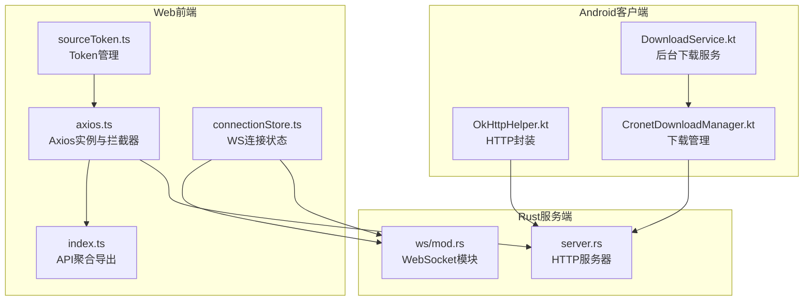
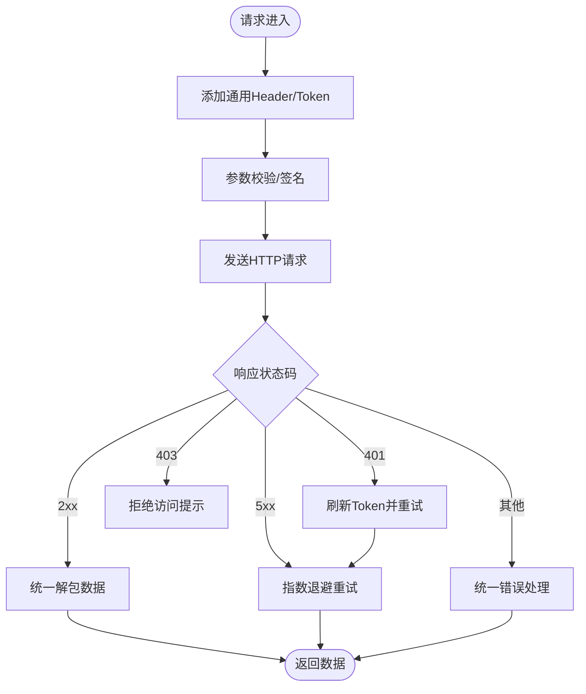
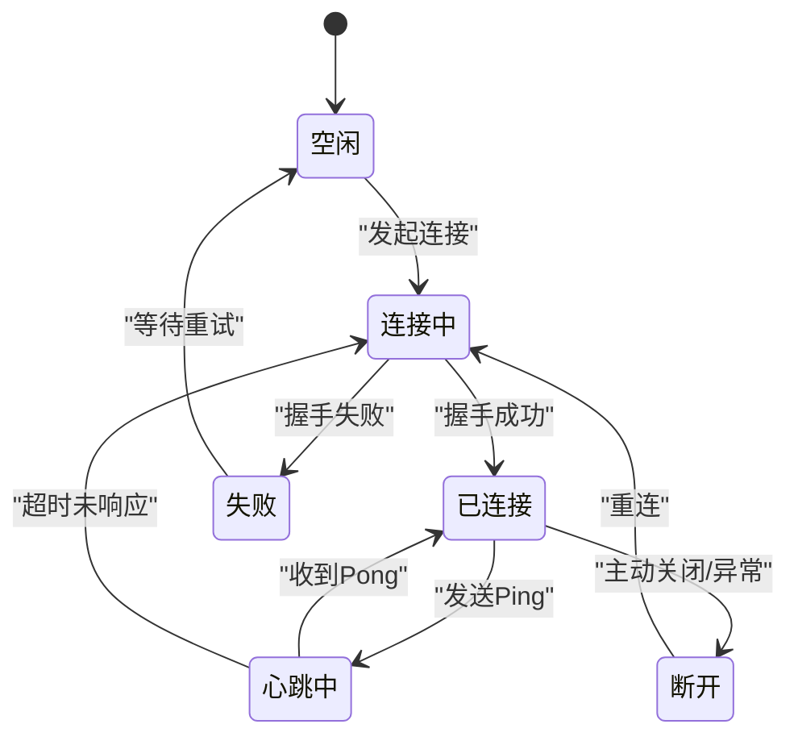
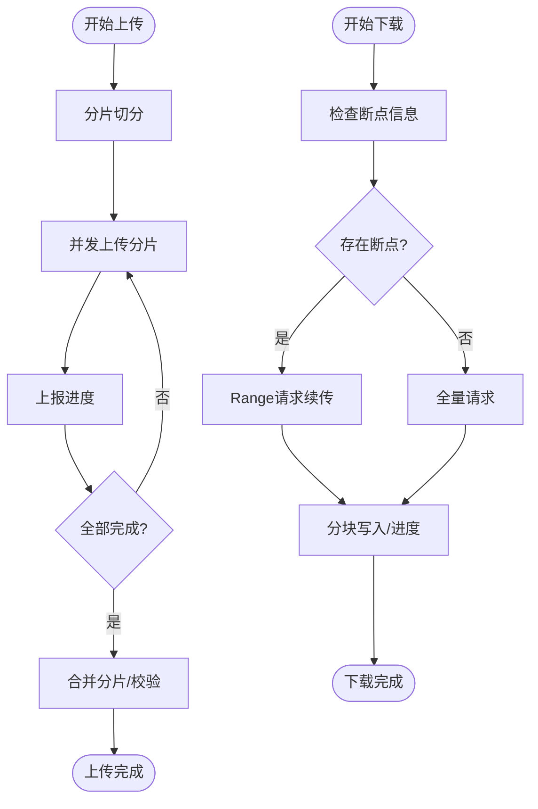
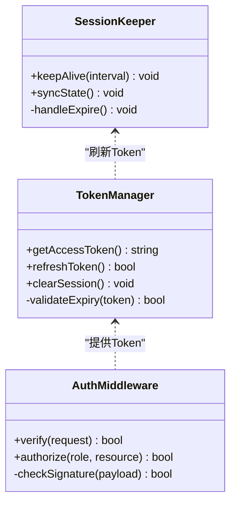
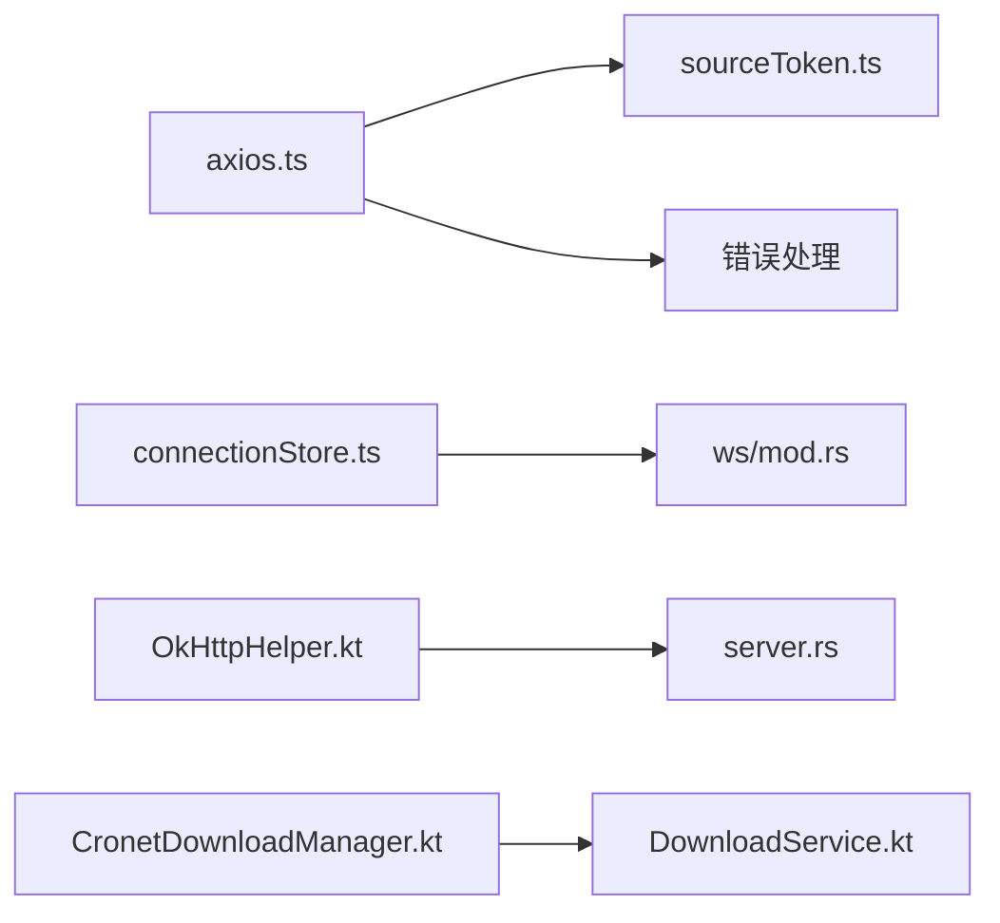

# API集成方案

<cite>
**本文引用的文件**   
- [modules/web/src/api/axios.ts](file://modules/web/src/api/axios.ts)
- [modules/web/src/api/index.ts](file://modules/web/src/api/index.ts)
- [modules/web/src/api/sourceToken.ts](file://modules/web/src/api/sourceToken.ts)
- [modules/web/src/store/connectionStore.ts](file://modules/web/src/store/connectionStore.ts)
- [rust/legado-server/src/ws/mod.rs](file://rust/legado-server/src/ws/mod.rs)
- [rust/legado-server/src/server.rs](file://rust/legado-server/src/server.rs)
- [app/src/main/java/io/legado/app/help/http/OkHttpHelper.kt](file://app/src/main/java/io/legado/app/help/http/OkHttpHelper.kt)
- [app/src/main/java/io/legado/app/lib/cronet/CronetDownloadManager.kt](file://app/src/main/java/io/legado/app/lib/cronet/CronetDownloadManager.kt)
- [app/src/main/java/io/legado/app/service/DownloadService.kt](file://app/src/main/java/io/legado/app/service/DownloadService.kt)
</cite>

## 目录
1. [简介](#简介)
2. [项目结构](#项目结构)
3. [核心组件](#核心组件)
4. [架构总览](#架构总览)
5. [详细组件分析](#详细组件分析)
6. [依赖关系分析](#依赖关系分析)
7. [性能考虑](#性能考虑)
8. [故障排查指南](#故障排查指南)
9. [结论](#结论)
10. [附录](#附录)

## 简介
本文件面向API集成与前后端通信，覆盖以下主题：
- RESTful API封装与使用（Axios实例、请求拦截器、响应处理、统一错误）
- WebSocket实时通信（连接管理、消息格式、重连机制、心跳检测）
- 文件上传下载（进度监控、断点续传、大文件处理）
- 认证授权（Token管理、权限控制、会话保持）
- API调用最佳实践（缓存策略、并发控制、超时处理）
- 具体调用示例与调试方法

## 项目结构
本项目包含Web前端（Vue/Vite）、Rust服务端（legado-server）、Android客户端（Kotlin）三大部分。API集成主要涉及：
- Web端：Axios封装、WebSocket Store、Token管理
- 服务端：HTTP路由与WS处理器
- Android端：网络库（OkHttp/Cronet）、下载服务



**图表来源** 
- [modules/web/src/api/axios.ts](file://modules/web/src/api/axios.ts)
- [modules/web/src/api/index.ts](file://modules/web/src/api/index.ts)
- [modules/web/src/api/sourceToken.ts](file://modules/web/src/api/sourceToken.ts)
- [modules/web/src/store/connectionStore.ts](file://modules/web/src/store/connectionStore.ts)
- [rust/legado-server/src/server.rs](file://rust/legado-server/src/server.rs)
- [rust/legado-server/src/ws/mod.rs](file://rust/legado-server/src/ws/mod.rs)
- [app/src/main/java/io/legado/app/help/http/OkHttpHelper.kt](file://app/src/main/java/io/legado/app/help/http/OkHttpHelper.kt)
- [app/src/main/java/io/legado/app/lib/cronet/CronetDownloadManager.kt](file://app/src/main/java/io/legado/app/lib/cronet/CronetDownloadManager.kt)
- [app/src/main/java/io/legado/app/service/DownloadService.kt](file://app/src/main/java/io/legado/app/service/DownloadService.kt)

**章节来源**
- [modules/web/src/api/axios.ts](file://modules/web/src/api/axios.ts)
- [modules/web/src/api/index.ts](file://modules/web/src/api/index.ts)
- [modules/web/src/api/sourceToken.ts](file://modules/web/src/api/sourceToken.ts)
- [modules/web/src/store/connectionStore.ts](file://modules/web/src/store/connectionStore.ts)
- [rust/legado-server/src/server.rs](file://rust/legado-server/src/server.rs)
- [rust/legado-server/src/ws/mod.rs](file://rust/legado-server/src/ws/mod.rs)
- [app/src/main/java/io/legado/app/help/http/OkHttpHelper.kt](file://app/src/main/java/io/legado/app/help/http/OkHttpHelper.kt)
- [app/src/main/java/io/legado/app/lib/cronet/CronetDownloadManager.kt](file://app/src/main/java/io/legado/app/lib/cronet/CronetDownloadManager.kt)
- [app/src/main/java/io/legado/app/service/DownloadService.kt](file://app/src/main/java/io/legado/app/service/DownloadService.kt)

## 核心组件
- Axios实例与拦截器：集中配置基础URL、超时、重试、鉴权头、错误码处理
- Token管理：登录态维护、刷新、过期处理、跨域Cookie/Storage策略
- WebSocket Store：连接生命周期、消息收发、心跳、自动重连
- 服务端HTTP/WS：路由分发、鉴权中间件、WS房间/广播
- Android下载：分块下载、断点续传、进度回调、队列管理

**章节来源**
- [modules/web/src/api/axios.ts](file://modules/web/src/api/axios.ts)
- [modules/web/src/api/sourceToken.ts](file://modules/web/src/api/sourceToken.ts)
- [modules/web/src/store/connectionStore.ts](file://modules/web/src/store/connectionStore.ts)
- [rust/legado-server/src/server.rs](file://rust/legado-server/src/server.rs)
- [rust/legado-server/src/ws/mod.rs](file://rust/legado-server/src/ws/mod.rs)
- [app/src/main/java/io/legado/app/help/http/OkHttpHelper.kt](file://app/src/main/java/io/legado/app/help/http/OkHttpHelper.kt)
- [app/src/main/java/io/legado/app/lib/cronet/CronetDownloadManager.kt](file://app/src/main/java/io/legado/app/lib/cronet/CronetDownloadManager.kt)
- [app/src/main/java/io/legado/app/service/DownloadService.kt](file://app/src/main/java/io/legado/app/service/DownloadService.kt)

## 架构总览
整体通信链路：
- Web前端通过Axios发起REST请求，携带Token；服务端校验后返回数据或错误码
- WebSocket用于实时事件推送（如下载进度、日志、任务状态），前端Store负责连接与心跳
- Android端通过OkHttp/Cronet进行HTTP与下载，支持断点续传与后台任务

```mermaid
sequenceDiagram
participant FE as "Web前端"
participant AX as "Axios实例"
participant SV as "Rust服务端"
participant WS as "WebSocket模块"
participant AND as "Android客户端"
FE->>AX : "GET /api/resource"
AX->>SV : "HTTP请求(带Token)"
SV-->>AX : "HTTP响应(成功/失败)"
AX-->>FE : "统一错误处理/数据"
FE->>WS : "建立WS连接"
WS-->>FE : "握手成功/鉴权结果"
FE->>WS : "发送心跳"
WS-->>FE : "心跳应答"
WS-->>FE : "推送事件(下载进度/日志)"
AND->>SV : "HTTP/分块下载"
SV-->>AND : "分块数据/进度回调"
```

**图表来源** 
- [modules/web/src/api/axios.ts](file://modules/web/src/api/axios.ts)
- [rust/legado-server/src/server.rs](file://rust/legado-server/src/server.rs)
- [rust/legado-server/src/ws/mod.rs](file://rust/legado-server/src/ws/mod.rs)
- [app/src/main/java/io/legado/app/help/http/OkHttpHelper.kt](file://app/src/main/java/io/legado/app/help/http/OkHttpHelper.kt)
- [app/src/main/java/io/legado/app/lib/cronet/CronetDownloadManager.kt](file://app/src/main/java/io/legado/app/lib/cronet/CronetDownloadManager.kt)

## 详细组件分析

### REST API封装（Axios）
- 实例配置：基础URL、超时、Content-Type、Accept、User-Agent等
- 请求拦截器：注入Token、请求ID、幂等键、重试计数
- 响应拦截器：统一解包数据、错误码映射、401/403处理、缓存标记
- 错误处理：网络异常、业务错误、超时重试、降级策略



**图表来源** 
- [modules/web/src/api/axios.ts](file://modules/web/src/api/axios.ts)
- [modules/web/src/api/sourceToken.ts](file://modules/web/src/api/sourceToken.ts)

**章节来源**
- [modules/web/src/api/axios.ts](file://modules/web/src/api/axios.ts)
- [modules/web/src/api/index.ts](file://modules/web/src/api/index.ts)
- [modules/web/src/api/sourceToken.ts](file://modules/web/src/api/sourceToken.ts)

### WebSocket实时通信
- 连接管理：单例连接、多路复用、房间/频道
- 消息格式：类型字段、载荷、时间戳、序列号
- 心跳检测：定时Ping/Pong、超时断开、重连
- 重连机制：指数退避、最大重试次数、去抖



**图表来源** 
- [modules/web/src/store/connectionStore.ts](file://modules/web/src/store/connectionStore.ts)
- [rust/legado-server/src/ws/mod.rs](file://rust/legado-server/src/ws/mod.rs)

**章节来源**
- [modules/web/src/store/connectionStore.ts](file://modules/web/src/store/connectionStore.ts)
- [rust/legado-server/src/ws/mod.rs](file://rust/legado-server/src/ws/mod.rs)

### 文件上传下载
- 上传：分片上传、MD5校验、并发控制、进度回调
- 下载：Range断点续传、分块写入、暂停/恢复、队列管理
- 大文件：流式处理、内存限制、磁盘缓存、压缩传输



**图表来源** 
- [app/src/main/java/io/legado/app/lib/cronet/CronetDownloadManager.kt](file://app/src/main/java/io/legado/app/lib/cronet/CronetDownloadManager.kt)
- [app/src/main/java/io/legado/app/service/DownloadService.kt](file://app/src/main/java/io/legado/app/service/DownloadService.kt)

**章节来源**
- [app/src/main/java/io/legado/app/lib/cronet/CronetDownloadManager.kt](file://app/src/main/java/io/legado/app/lib/cronet/CronetDownloadManager.kt)
- [app/src/main/java/io/legado/app/service/DownloadService.kt](file://app/src/main/java/io/legado/app/service/DownloadService.kt)

### 认证授权机制
- Token管理：登录获取、本地存储、过期刷新、安全策略
- 权限控制：角色/资源级鉴权、接口白名单、动态权限
- 会话保持：Cookie/LocalStorage、跨域策略、防CSRF



**图表来源** 
- [modules/web/src/api/sourceToken.ts](file://modules/web/src/api/sourceToken.ts)
- [rust/legado-server/src/server.rs](file://rust/legado-server/src/server.rs)

**章节来源**
- [modules/web/src/api/sourceToken.ts](file://modules/web/src/api/sourceToken.ts)
- [rust/legado-server/src/server.rs](file://rust/legado-server/src/server.rs)

### API调用最佳实践
- 缓存策略：GET缓存、ETag/Last-Modified、失效策略、版本化
- 并发控制：限流、队列、优先级、取消令牌
- 超时处理：短超时+重试、长轮询替代、熔断降级

[本节为通用指导，不直接分析具体文件]

## 依赖关系分析
- Web端Axios依赖Token管理与错误处理模块
- WebSocket Store依赖服务端WS模块与心跳逻辑
- Android下载依赖Cronet与系统服务



**图表来源** 
- [modules/web/src/api/axios.ts](file://modules/web/src/api/axios.ts)
- [modules/web/src/api/sourceToken.ts](file://modules/web/src/api/sourceToken.ts)
- [modules/web/src/store/connectionStore.ts](file://modules/web/src/store/connectionStore.ts)
- [rust/legado-server/src/ws/mod.rs](file://rust/legado-server/src/ws/mod.rs)
- [rust/legado-server/src/server.rs](file://rust/legado-server/src/server.rs)
- [app/src/main/java/io/legado/app/help/http/OkHttpHelper.kt](file://app/src/main/java/io/legado/app/help/http/OkHttpHelper.kt)
- [app/src/main/java/io/legado/app/lib/cronet/CronetDownloadManager.kt](file://app/src/main/java/io/legado/app/lib/cronet/CronetDownloadManager.kt)
- [app/src/main/java/io/legado/app/service/DownloadService.kt](file://app/src/main/java/io/legado/app/service/DownloadService.kt)

**章节来源**
- [modules/web/src/api/axios.ts](file://modules/web/src/api/axios.ts)
- [modules/web/src/api/sourceToken.ts](file://modules/web/src/api/sourceToken.ts)
- [modules/web/src/store/connectionStore.ts](file://modules/web/src/store/connectionStore.ts)
- [rust/legado-server/src/ws/mod.rs](file://rust/legado-server/src/ws/mod.rs)
- [rust/legado-server/src/server.rs](file://rust/legado-server/src/server.rs)
- [app/src/main/java/io/legado/app/help/http/OkHttpHelper.kt](file://app/src/main/java/io/legado/app/help/http/OkHttpHelper.kt)
- [app/src/main/java/io/legado/app/lib/cronet/CronetDownloadManager.kt](file://app/src/main/java/io/legado/app/lib/cronet/CronetDownloadManager.kt)
- [app/src/main/java/io/legado/app/service/DownloadService.kt](file://app/src/main/java/io/legado/app/service/DownloadService.kt)

## 性能考虑
- HTTP层：连接池、Keep-Alive、Gzip/Brotli压缩、CDN缓存
- WS层：批量消息、心跳间隔调优、背压控制
- 下载层：分块大小优化、并发度控制、I/O异步化
- 错误重试：指数退避、抖动、熔断器

[本节为通用指导，不直接分析具体文件]

## 故障排查指南
- 网络问题：抓包分析、DNS解析、代理设置、SSL证书
- 鉴权失败：Token有效期、签名校验、跨域Cookie
- WS断线：心跳超时、服务端负载、防火墙策略
- 下载失败：断点文件损坏、权限不足、磁盘空间

**章节来源**
- [modules/web/src/api/axios.ts](file://modules/web/src/api/axios.ts)
- [modules/web/src/api/sourceToken.ts](file://modules/web/src/api/sourceToken.ts)
- [modules/web/src/store/connectionStore.ts](file://modules/web/src/store/connectionStore.ts)
- [rust/legado-server/src/server.rs](file://rust/legado-server/src/server.rs)
- [rust/legado-server/src/ws/mod.rs](file://rust/legado-server/src/ws/mod.rs)
- [app/src/main/java/io/legado/app/lib/cronet/CronetDownloadManager.kt](file://app/src/main/java/io/legado/app/lib/cronet/CronetDownloadManager.kt)
- [app/src/main/java/io/legado/app/service/DownloadService.kt](file://app/src/main/java/io/legado/app/service/DownloadService.kt)

## 结论
本方案通过Axios统一封装REST、WebSocket Store管理实时通信、Android端实现高效下载，结合Token与权限控制保障安全。建议在生产环境完善监控、日志与告警，持续优化性能与稳定性。

[本节为总结性内容，不直接分析具体文件]

## 附录
- 调试方法：浏览器开发者工具、Wireshark抓包、Android Logcat、服务端日志
- 常用命令：curl测试、wsdump连接、ab压力测试
- 配置项：超时、重试、分块大小、心跳间隔

[本节为补充说明，不直接分析具体文件]