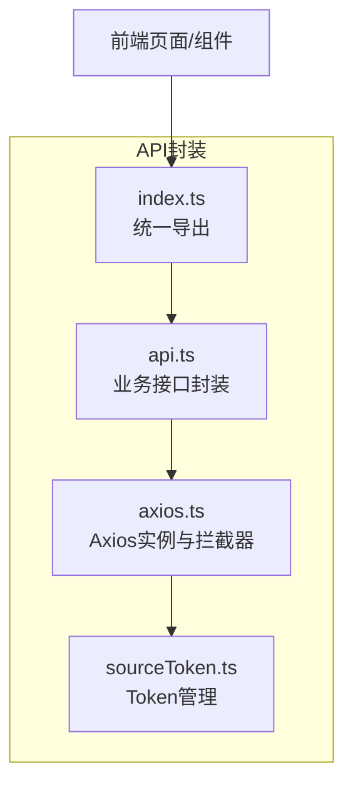
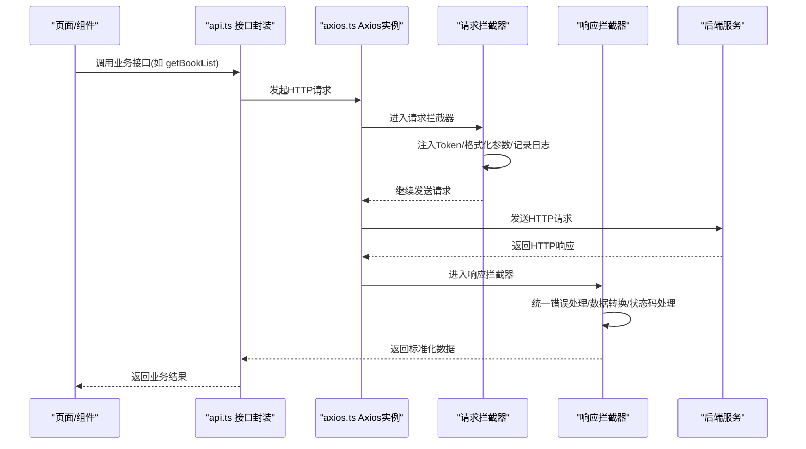
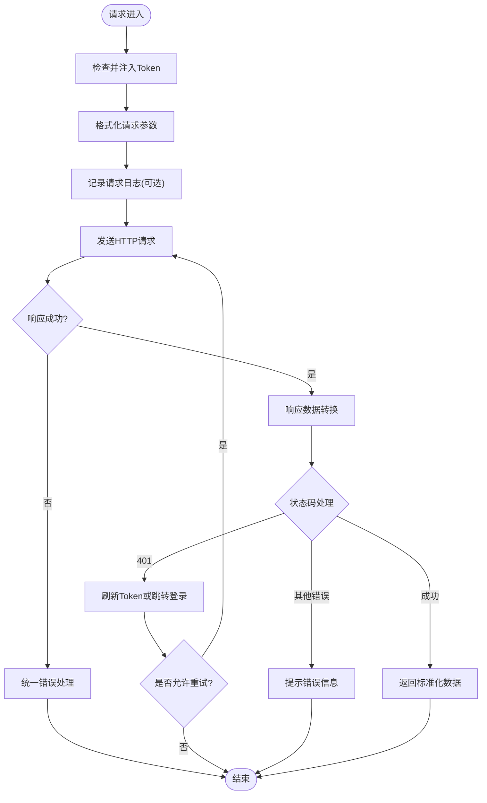
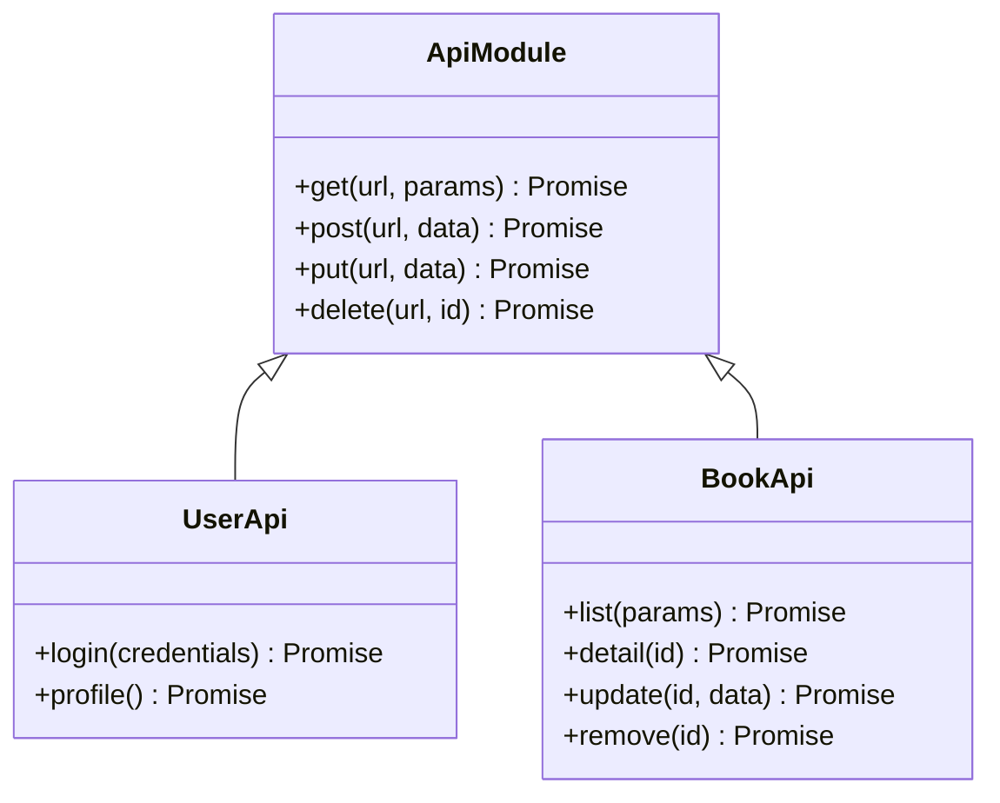
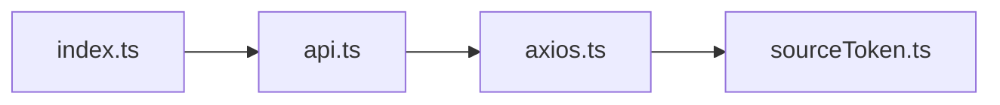

# RESTful API封装

<cite>
**本文引用的文件**   
- [modules/web/src/api/axios.ts](file://modules/web/src/api/axios.ts)
- [modules/web/src/api/api.ts](file://modules/web/src/api/api.ts)
- [modules/web/src/api/index.ts](file://modules/web/src/api/index.ts)
- [modules/web/src/api/sourceToken.ts](file://modules/web/src/api/sourceToken.ts)
</cite>

## 目录
1. [简介](#简介)
2. [项目结构](#项目结构)
3. [核心组件](#核心组件)
4. [架构总览](#架构总览)
5. [详细组件分析](#详细组件分析)
6. [依赖分析](#依赖分析)
7. [性能考虑](#性能考虑)
8. [故障排查指南](#故障排查指南)
9. [结论](#结论)
10. [附录](#附录) 

## 简介
本文件面向Legado Web模块中的RESTful API封装，系统性说明Axios实例的初始化与配置、请求拦截器（Token注入、参数格式化、调试日志）、响应拦截器（统一错误处理、数据转换、状态码处理）、API模块化组织方式（分类、版本管理），以及GET/POST/PUT/DELETE调用示例与错误处理、重试机制的实现要点。文档力求对非专业读者友好，同时为开发者提供可落地的参考路径。

## 项目结构
Web模块的API相关代码集中在 modules/web/src/api 目录下，采用“基础网络层 + 业务接口”的分层组织：
- axios.ts：Axios实例创建、全局配置、请求/响应拦截器
- api.ts：按功能域划分的接口定义与调用封装
- index.ts：对外统一导出入口
- sourceToken.ts：Token管理与注入逻辑

图表来源 
- [modules/web/src/api/axios.ts](file://modules/web/src/api/axios.ts)
- [modules/web/src/api/api.ts](file://modules/web/src/api/api.ts)
- [modules/web/src/api/index.ts](file://modules/web/src/api/index.ts)
- [modules/web/src/api/sourceToken.ts](file://modules/web/src/api/sourceToken.ts)

章节来源
- [modules/web/src/api/axios.ts](file://modules/web/src/api/axios.ts)
- [modules/web/src/api/api.ts](file://modules/web/src/api/api.ts)
- [modules/web/src/api/index.ts](file://modules/web/src/api/index.ts)
- [modules/web/src/api/sourceToken.ts](file://modules/web/src/api/sourceToken.ts)

## 核心组件
- Axios实例与全局配置
  - 基础URL设置：集中管理后端服务地址，便于环境切换与多端复用
  - 超时配置：合理设置请求超时，避免长时间阻塞
  - 请求头配置：统一Content-Type、Accept等头部；鉴权场景下注入Authorization或自定义Header
- 请求拦截器
  - Token自动注入：从本地存储或上下文获取Token并写入请求头
  - 请求参数格式化：根据方法自动序列化查询参数或请求体
  - 调试日志记录：在开发环境下打印请求信息，便于问题定位
- 响应拦截器
  - 统一错误处理：捕获网络异常、HTTP错误码、业务错误码，统一抛出或提示
  - 响应数据转换：将服务端返回的数据包装为统一结构，简化上层使用
  - 状态码处理：针对401、403、5xx等做差异化处理（如跳转登录、刷新Token）
- API模块化组织
  - 按功能域拆分接口文件，保持高内聚低耦合
  - 版本管理：通过URL前缀或Header区分API版本，支持平滑升级
- 错误处理与重试
  - 网络抖动重试：对幂等请求进行有限次重试
  - 退避策略：指数退避或固定间隔，避免雪崩
  - 失败降级：关键接口失败时提供缓存或默认值

章节来源
- [modules/web/src/api/axios.ts](file://modules/web/src/api/axios.ts)
- [modules/web/src/api/api.ts](file://modules/web/src/api/api.ts)
- [modules/web/src/api/sourceToken.ts](file://modules/web/src/api/sourceToken.ts)

## 架构总览
下图展示了从页面到Axios再到后端的完整调用链路，以及拦截器的执行顺序。

图表来源 
- [modules/web/src/api/axios.ts](file://modules/web/src/api/axios.ts)
- [modules/web/src/api/api.ts](file://modules/web/src/api/api.ts)

## 详细组件分析

### Axios实例与拦截器（axios.ts）
- 初始化与配置
  - 基础URL：集中配置后端域名或网关地址
  - 超时与重试：设置合理的超时时间；对幂等请求启用重试与退避
  - 请求头：统一设置Content-Type、Accept，必要时附加鉴权头
- 请求拦截器
  - Token注入：从本地存储或上下文读取Token并写入Authorization或其他自定义头
  - 参数格式化：GET请求将参数序列化为查询字符串；POST/PUT请求序列化JSON
  - 调试日志：在开发模式下输出请求URL、方法、参数、耗时等
- 响应拦截器
  - 统一错误：捕获网络错误、HTTP错误码、业务错误码，转换为统一错误对象
  - 数据转换：将服务端数据包装为统一结构（如data、message、code）
  - 状态码处理：401触发重新登录流程；403提示权限不足；5xx记录错误并提示用户

图表来源 
- [modules/web/src/api/axios.ts](file://modules/web/src/api/axios.ts)

章节来源
- [modules/web/src/api/axios.ts](file://modules/web/src/api/axios.ts)

### 业务接口封装（api.ts）
- 模块化设计
  - 按功能域划分接口：如用户、书籍、源管理等，每个模块一个文件或多个函数集合
  - 统一方法封装：对GET/POST/PUT/DELETE进行二次封装，减少重复代码
- 版本管理
  - URL前缀：通过/v1、/v2等区分API版本，保证向后兼容
  - Header控制：通过X-API-Version等头部控制服务端路由
- 调用示例
  - GET：用于查询列表、详情等，参数以查询字符串传递
  - POST：用于新增资源，请求体为JSON
  - PUT：用于更新资源，请求体包含需更新的字段
  - DELETE：用于删除资源，通常通过ID标识

图表来源 
- [modules/web/src/api/api.ts](file://modules/web/src/api/api.ts)

章节来源
- [modules/web/src/api/api.ts](file://modules/web/src/api/api.ts)

### 统一导出入口（index.ts）
- 职责
  - 聚合各模块接口，提供统一的导入路径
  - 隐藏内部实现细节，降低耦合度
- 使用建议
  - 在页面或组件中仅从index.ts导入所需接口
  - 避免直接依赖内部文件，便于后续重构

章节来源
- [modules/web/src/api/index.ts](file://modules/web/src/api/index.ts)

### Token管理（sourceToken.ts）
- 职责
  - 管理Token的获取、更新、失效处理
  - 与请求拦截器协作，确保每次请求携带有效Token
- 常见场景
  - 首次登录成功后保存Token
  - Token过期时自动刷新或引导重新登录
  - 多账号切换时清理旧Token

章节来源
- [modules/web/src/api/sourceToken.ts](file://modules/web/src/api/sourceToken.ts)

## 依赖分析
- 组件间依赖关系
  - api.ts依赖axios.ts提供的HTTP能力
  - axios.ts依赖sourceToken.ts获取Token
  - index.ts聚合api.ts导出的接口
- 外部依赖
  - Axios：HTTP客户端库
  - 本地存储：用于持久化Token与配置
  - 日志工具：用于调试与监控

图表来源 
- [modules/web/src/api/index.ts](file://modules/web/src/api/index.ts)
- [modules/web/src/api/api.ts](file://modules/web/src/api/api.ts)
- [modules/web/src/api/axios.ts](file://modules/web/src/api/axios.ts)
- [modules/web/src/api/sourceToken.ts](file://modules/web/src/api/sourceToken.ts)

章节来源
- [modules/web/src/api/index.ts](file://modules/web/src/api/index.ts)
- [modules/web/src/api/api.ts](file://modules/web/src/api/api.ts)
- [modules/web/src/api/axios.ts](file://modules/web/src/api/axios.ts)
- [modules/web/src/api/sourceToken.ts](file://modules/web/src/api/sourceToken.ts)

## 性能考虑
- 连接池与并发控制
  - 合理设置最大并发数，避免过多请求导致服务器压力
  - 利用Axios实例复用连接，减少握手开销
- 缓存策略
  - 对GET请求启用浏览器缓存或服务端缓存
  - 对热点数据使用内存缓存，提升响应速度
- 压缩与传输优化
  - 启用Gzip/Brotli压缩，减少数据传输量
  - 按需加载接口，避免一次性拉取大量数据
- 超时与重试
  - 根据网络环境动态调整超时时间
  - 对幂等请求启用重试，提高成功率

## 故障排查指南
- 常见问题
  - Token无效或过期：检查Token生成与刷新逻辑，确认拦截器是否正确注入
  - 跨域问题：确认后端CORS配置，必要时添加代理
  - 参数序列化错误：检查Content-Type与请求体格式是否匹配
  - 状态码异常：查看响应拦截器的错误处理逻辑，确认业务错误码映射
- 调试技巧
  - 开启请求日志，记录URL、方法、参数、响应时间与错误堆栈
  - 使用浏览器开发者工具Network面板抓包分析
  - 模拟不同网络条件（弱网、断网）验证重试与降级逻辑

章节来源
- [modules/web/src/api/axios.ts](file://modules/web/src/api/axios.ts)
- [modules/web/src/api/sourceToken.ts](file://modules/web/src/api/sourceToken.ts)

## 结论
通过对Axios实例的统一配置与拦截器的集中处理，Legado Web模块实现了稳定、可维护的RESTful API封装。模块化设计与版本管理保障了接口的可扩展性与兼容性，完善的错误处理与重试机制提升了用户体验与系统健壮性。建议在实际使用中遵循本文档的最佳实践，持续优化性能与可观测性。

## 附录
- 最佳实践清单
  - 集中管理基础URL与环境变量
  - 统一错误处理与用户提示
  - 对幂等请求启用重试与退避
  - 严格区分开发与生产环境的日志级别
  - 定期审查接口版本与废弃策略
- 参考路径
  - Axios实例与拦截器：[modules/web/src/api/axios.ts](file://modules/web/src/api/axios.ts)
  - 业务接口封装：[modules/web/src/api/api.ts](file://modules/web/src/api/api.ts)
  - 统一导出入口：[modules/web/src/api/index.ts](file://modules/web/src/api/index.ts)
  - Token管理：[modules/web/src/api/sourceToken.ts](file://modules/web/src/api/sourceToken.ts)