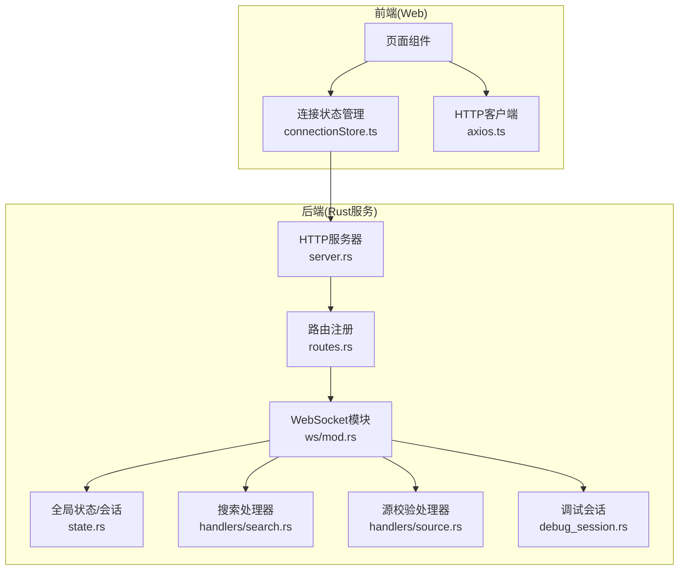
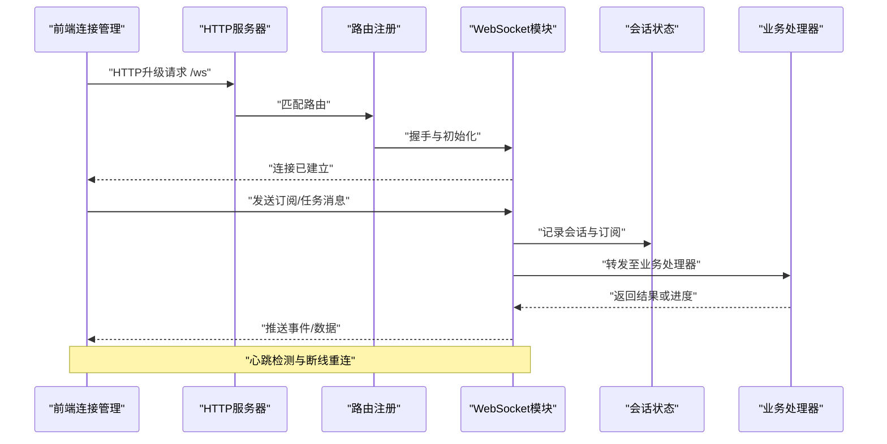
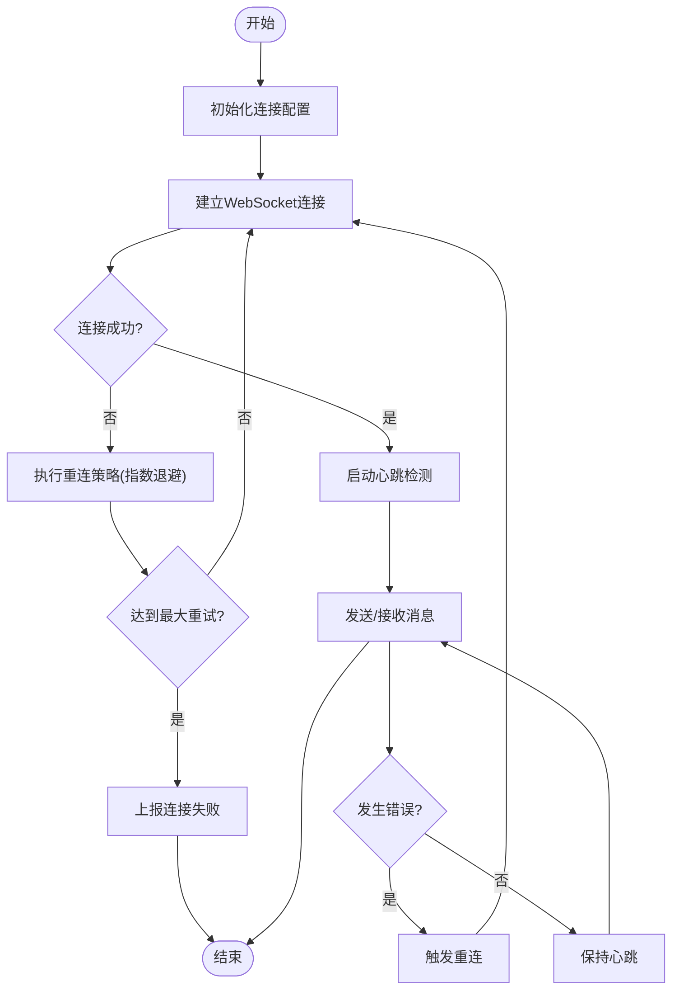
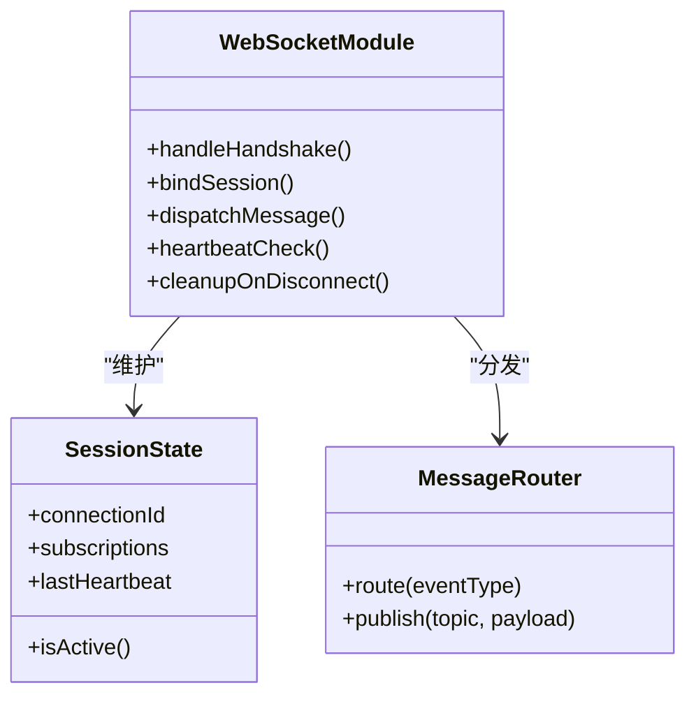
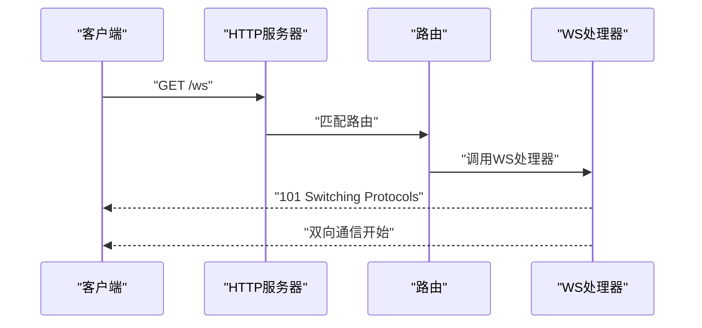
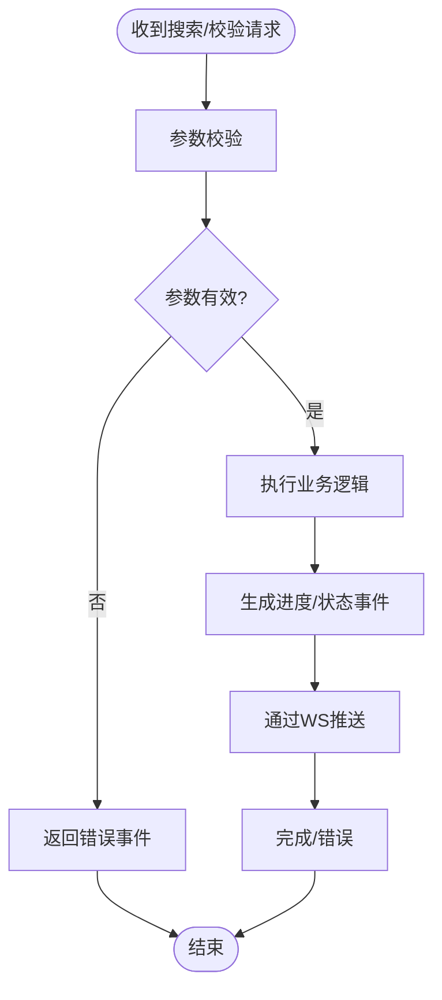
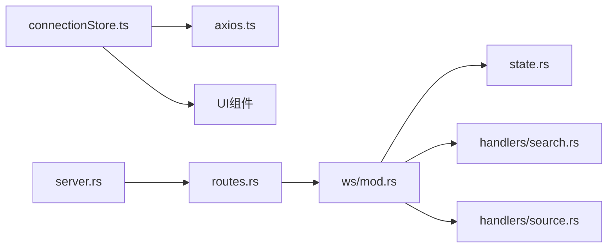

# WebSocket实时通信

<cite>
**本文引用的文件**   
- [modules/web/src/store/connectionStore.ts](file://modules/web/src/store/connectionStore.ts)
- [modules/web/src/api/axios.ts](file://modules/web/src/api/axios.ts)
- [rust/legado-server/src/ws/mod.rs](file://rust/legado-server/src/ws/mod.rs)
- [rust/legado-server/src/server.rs](file://rust/legado-server/src/server.rs)
- [rust/legado-server/src/routes.rs](file://rust/legado-server/src/routes.rs)
- [rust/legado-server/src/state.rs](file://rust/legado-server/src/state.rs)
- [rust/legado-server/src/handlers/search.rs](file://rust/legado-server/src/handlers/search.rs)
- [rust/legado-server/src/handlers/source.rs](file://rust/legado-server/src/handlers/source.rs)
- [rust/legado-core/src/debug_session.rs](file://rust/legado-core/src/debug_session.rs)
</cite>

## 目录
1. [简介](#简介)
2. [项目结构](#项目结构)
3. [核心组件](#核心组件)
4. [架构总览](#架构总览)
5. [详细组件分析](#详细组件分析)
6. [依赖关系分析](#依赖关系分析)
7. [性能考虑](#性能考虑)
8. [故障排查指南](#故障排查指南)
9. [结论](#结论)
10. [附录](#附录)

## 简介
本文件面向Legado项目的WebSocket实时通信能力，系统性阐述连接建立与管理、心跳与断线重连、消息协议定义、典型使用场景（调试信息推送、搜索进度更新、源验证状态同步）、客户端连接管理（连接池、消息队列、错误恢复），以及性能优化与故障处理最佳实践。文档同时提供可视化架构图与流程图，帮助读者快速理解并落地实现。

## 项目结构
本项目在前后端均包含WebSocket相关实现：
- 前端（Web）：通过Vue/TS模块维护连接状态、事件监听与消息队列，封装连接生命周期管理。
- 后端（Rust服务）：基于HTTP路由注册WS端点，维护会话状态、广播机制与业务处理器（搜索、源校验等）。

**图示来源** 
- [modules/web/src/store/connectionStore.ts](file://modules/web/src/store/connectionStore.ts)
- [modules/web/src/api/axios.ts](file://modules/web/src/api/axios.ts)
- [rust/legado-server/src/server.rs](file://rust/legado-server/src/server.rs)
- [rust/legado-server/src/routes.rs](file://rust/legado-server/src/routes.rs)
- [rust/legado-server/src/ws/mod.rs](file://rust/legado-server/src/ws/mod.rs)
- [rust/legado-server/src/state.rs](file://rust/legado-server/src/state.rs)
- [rust/legado-server/src/handlers/search.rs](file://rust/legado-server/src/handlers/search.rs)
- [rust/legado-server/src/handlers/source.rs](file://rust/legado-server/src/handlers/source.rs)
- [rust/legado-core/src/debug_session.rs](file://rust/legado-core/src/debug_session.rs)

**章节来源**
- [modules/web/src/store/connectionStore.ts](file://modules/web/src/store/connectionStore.ts)
- [modules/web/src/api/axios.ts](file://modules/web/src/api/axios.ts)
- [rust/legado-server/src/server.rs](file://rust/legado-server/src/server.rs)
- [rust/legado-server/src/routes.rs](file://rust/legado-server/src/routes.rs)
- [rust/legado-server/src/ws/mod.rs](file://rust/legado-server/src/ws/mod.rs)
- [rust/legado-server/src/state.rs](file://rust/legado-server/src/state.rs)
- [rust/legado-server/src/handlers/search.rs](file://rust/legado-server/src/handlers/search.rs)
- [rust/legado-server/src/handlers/source.rs](file://rust/legado-server/src/handlers/source.rs)
- [rust/legado-core/src/debug_session.rs](file://rust/legado-core/src/debug_session.rs)

## 核心组件
- 前端连接状态管理（connectionStore）：负责WebSocket实例创建、连接状态、事件订阅、消息队列与重连策略。
- 后端WebSocket模块（ws/mod.rs）：处理握手、会话绑定、消息分发、心跳检测与断线清理。
- 路由与服务器（routes.rs, server.rs）：暴露WS端点，挂载WS处理器，统一生命周期管理。
- 业务处理器（search.rs, source.rs）：将WS事件与具体业务逻辑关联（搜索进度、源验证状态）。
- 调试会话（debug_session.rs）：提供调试日志的实时推送通道。

**章节来源**
- [modules/web/src/store/connectionStore.ts](file://modules/web/src/store/connectionStore.ts)
- [rust/legado-server/src/ws/mod.rs](file://rust/legado-server/src/ws/mod.rs)
- [rust/legado-server/src/routes.rs](file://rust/legado-server/src/routes.rs)
- [rust/legado-server/src/server.rs](file://rust/legado-server/src/server.rs)
- [rust/legado-server/src/handlers/search.rs](file://rust/legado-server/src/handlers/search.rs)
- [rust/legado-server/src/handlers/source.rs](file://rust/legado-server/src/handlers/source.rs)
- [rust/legado-core/src/debug_session.rs](file://rust/legado-core/src/debug_session.rs)

## 架构总览
下图展示从前端发起WS连接到后端处理、再回推消息到前端的完整流程，包括心跳与重连的关键节点。

**图示来源** 
- [rust/legado-server/src/server.rs](file://rust/legado-server/src/server.rs)
- [rust/legado-server/src/routes.rs](file://rust/legado-server/src/routes.rs)
- [rust/legado-server/src/ws/mod.rs](file://rust/legado-server/src/ws/mod.rs)
- [rust/legado-server/src/state.rs](file://rust/legado-server/src/state.rs)
- [rust/legado-server/src/handlers/search.rs](file://rust/legado-server/src/handlers/search.rs)
- [rust/legado-server/src/handlers/source.rs](file://rust/legado-server/src/handlers/source.rs)

## 详细组件分析

### 前端连接管理（connectionStore）
- 职责：封装WebSocket连接生命周期，维护连接状态、事件监听、消息队列与重连策略。
- 关键点：
  - 连接配置：URL、超时、重试次数、退避策略。
  - 心跳检测：定时发送心跳，接收服务端心跳响应，异常时触发重连。
  - 断线重连：指数退避、最大重试限制、失败回调。
  - 消息队列：离线消息缓存，连接恢复后按序发送。
  - 错误恢复：网络异常、服务端关闭、协议错误的统一处理。

**图示来源** 
- [modules/web/src/store/connectionStore.ts](file://modules/web/src/store/connectionStore.ts)

**章节来源**
- [modules/web/src/store/connectionStore.ts](file://modules/web/src/store/connectionStore.ts)

### 后端WebSocket模块（ws/mod.rs）
- 职责：处理WS握手、会话绑定、消息分发、心跳检测与断线清理。
- 关键点：
  - 握手与鉴权：可选Token校验、用户上下文注入。
  - 会话管理：连接ID、订阅主题、在线列表。
  - 消息路由：根据事件类型分发给对应处理器。
  - 心跳与保活：Ping/Pong机制，超时断开。
  - 错误处理：捕获IO异常、协议错误，清理资源。

**图示来源** 
- [rust/legado-server/src/ws/mod.rs](file://rust/legado-server/src/ws/mod.rs)
- [rust/legado-server/src/state.rs](file://rust/legado-server/src/state.rs)

**章节来源**
- [rust/legado-server/src/ws/mod.rs](file://rust/legado-server/src/ws/mod.rs)
- [rust/legado-server/src/state.rs](file://rust/legado-server/src/state.rs)

### 路由与服务器（routes.rs, server.rs）
- 职责：注册WS端点，挂载WS处理器，统一管理HTTP与WS生命周期。
- 关键点：
  - 路由匹配：/ws路径映射到WS处理器。
  - 中间件：鉴权、限流、日志。
  - 优雅关闭：等待活跃连接完成，释放资源。

**图示来源** 
- [rust/legado-server/src/server.rs](file://rust/legado-server/src/server.rs)
- [rust/legado-server/src/routes.rs](file://rust/legado-server/src/routes.rs)

**章节来源**
- [rust/legado-server/src/server.rs](file://rust/legado-server/src/server.rs)
- [rust/legado-server/src/routes.rs](file://rust/legado-server/src/routes.rs)

### 业务处理器（search.rs, source.rs）
- 搜索处理器：将搜索任务进度通过WS推送给前端，支持分页、取消、错误提示。
- 源校验处理器：实时反馈源验证状态（成功、失败、重试），支持批量校验。

**图示来源** 
- [rust/legado-server/src/handlers/search.rs](file://rust/legado-server/src/handlers/search.rs)
- [rust/legado-server/src/handlers/source.rs](file://rust/legado-server/src/handlers/source.rs)

**章节来源**
- [rust/legado-server/src/handlers/search.rs](file://rust/legado-server/src/handlers/search.rs)
- [rust/legado-server/src/handlers/source.rs](file://rust/legado-server/src/handlers/source.rs)

### 调试会话（debug_session.rs）
- 职责：为开发者提供实时调试日志推送，支持过滤、级别控制、历史回放。
- 关键点：
  - 日志级别：DEBUG/INFO/WARN/ERROR。
  - 订阅机制：按模块或关键字订阅。
  - 持久化：可选本地存储，便于回溯。

**章节来源**
- [rust/legado-core/src/debug_session.rs](file://rust/legado-core/src/debug_session.rs)

## 依赖关系分析
- 前端依赖：
  - connectionStore.ts 依赖 axios.ts 用于HTTP辅助（如获取Token、配置）。
  - UI组件通过connectionStore订阅事件，解耦业务逻辑。
- 后端依赖：
  - ws/mod.rs 依赖 state.rs 管理会话与在线列表。
  - handlers/search.rs、handlers/source.rs 被ws模块调用，实现业务解耦。
  - routes.rs、server.rs 提供基础设施，确保WS端点可用。

**图示来源** 
- [modules/web/src/store/connectionStore.ts](file://modules/web/src/store/connectionStore.ts)
- [modules/web/src/api/axios.ts](file://modules/web/src/api/axios.ts)
- [rust/legado-server/src/ws/mod.rs](file://rust/legado-server/src/ws/mod.rs)
- [rust/legado-server/src/state.rs](file://rust/legado-server/src/state.rs)
- [rust/legado-server/src/handlers/search.rs](file://rust/legado-server/src/handlers/search.rs)
- [rust/legado-server/src/handlers/source.rs](file://rust/legado-server/src/handlers/source.rs)
- [rust/legado-server/src/server.rs](file://rust/legado-server/src/server.rs)
- [rust/legado-server/src/routes.rs](file://rust/legado-server/src/routes.rs)

**章节来源**
- [modules/web/src/store/connectionStore.ts](file://modules/web/src/store/connectionStore.ts)
- [modules/web/src/api/axios.ts](file://modules/web/src/api/axios.ts)
- [rust/legado-server/src/ws/mod.rs](file://rust/legado-server/src/ws/mod.rs)
- [rust/legado-server/src/state.rs](file://rust/legado-server/src/state.rs)
- [rust/legado-server/src/handlers/search.rs](file://rust/legado-server/src/handlers/search.rs)
- [rust/legado-server/src/handlers/source.rs](file://rust/legado-server/src/handlers/source.rs)
- [rust/legado-server/src/server.rs](file://rust/legado-server/src/server.rs)
- [rust/legado-server/src/routes.rs](file://rust/legado-server/src/routes.rs)

## 性能考虑
- 连接池：前端按场景复用连接，避免频繁握手开销；后端限制单进程并发连接数。
- 心跳间隔：动态调整心跳频率，低负载时延长间隔，高负载时缩短以快速发现断线。
- 消息批处理：合并小消息，减少网络往返；后端对高频事件进行节流。
- 背压与队列：前端消息队列设置上限，避免内存溢出；后端采用有界缓冲区。
- 压缩与编码：启用文本压缩（如gzip），JSON字段精简，避免冗余数据。
- 资源清理：断线及时释放句柄，避免僵尸连接；定期清理过期会话。

[本节为通用指导，不直接分析具体文件]

## 故障排查指南
- 连接失败：
  - 检查URL与端口、防火墙、代理配置。
  - 查看握手日志，确认鉴权是否通过。
- 心跳超时：
  - 调整心跳间隔与超时阈值。
  - 检查网络延迟与丢包率。
- 消息丢失：
  - 确认前端队列未溢出，后端缓冲未满。
  - 增加ACK机制，确保关键消息可靠送达。
- 内存泄漏：
  - 监控连接数与队列长度，及时清理无效会话。
  - 避免闭包引用大对象，防止GC压力。

**章节来源**
- [modules/web/src/store/connectionStore.ts](file://modules/web/src/store/connectionStore.ts)
- [rust/legado-server/src/ws/mod.rs](file://rust/legado-server/src/ws/mod.rs)
- [rust/legado-server/src/state.rs](file://rust/legado-server/src/state.rs)

## 结论
Legado项目的WebSocket实时通信在前端与后端均有完善实现，涵盖连接管理、心跳重连、消息协议、业务集成与调试支持。通过合理的架构设计与性能优化，能够满足调试信息推送、搜索进度更新、源验证状态同步等场景需求。建议在生产环境中结合监控与告警，持续优化连接稳定性与消息可靠性。

[本节为总结性内容，不直接分析具体文件]

## 附录
- 消息格式建议：
  - 基础结构：{type, id, timestamp, payload}
  - 事件类型：connect, heartbeat, search_progress, source_validation, debug_log
  - 数据传输：payload按事件类型定义字段，避免歧义
- 使用示例：
  - 连接建立：初始化connectionStore，传入WS URL与配置
  - 消息发送：通过send方法发送结构化消息
  - 事件监听：订阅特定事件，处理回调逻辑
- 最佳实践：
  - 前端：合理设置重连策略，避免雪崩效应
  - 后端：会话隔离，权限控制，资源回收
  - 监控：记录连接时长、消息吞吐、错误率

[本节为补充说明，不直接分析具体文件]