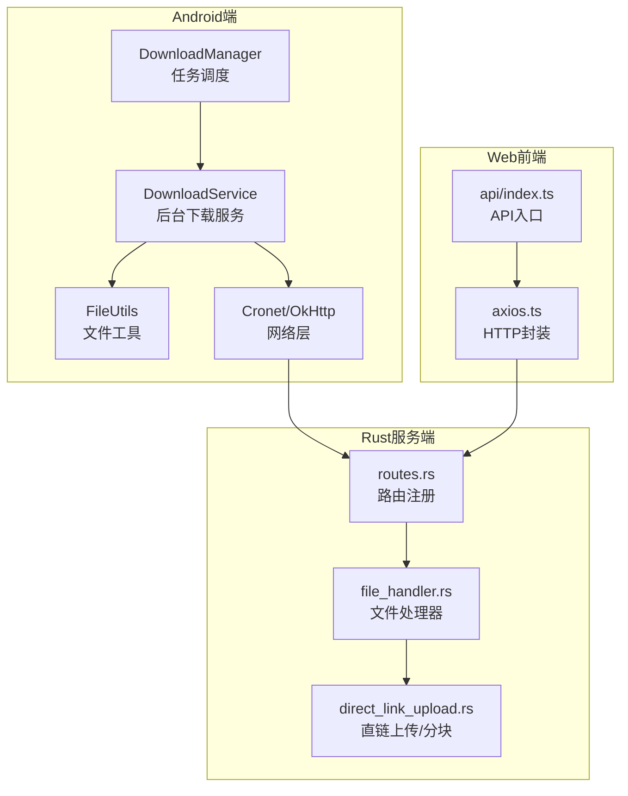
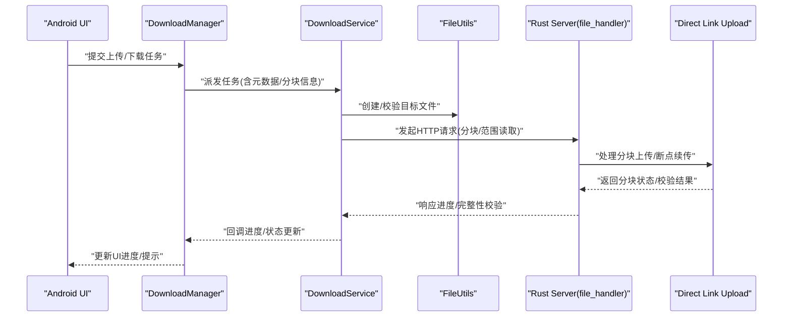
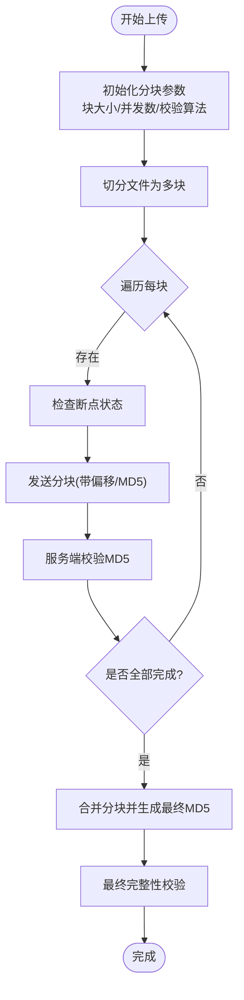
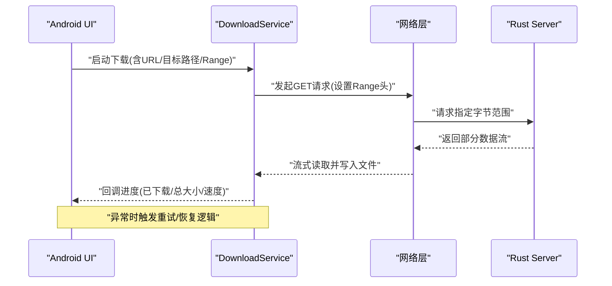
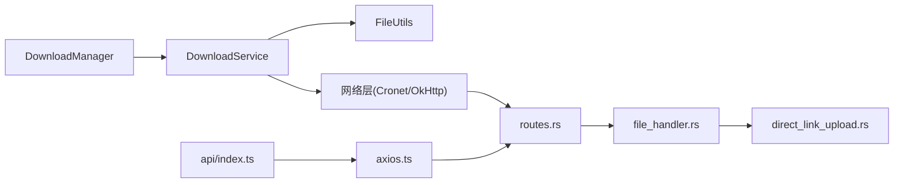

# 文件传输功能

<cite>
**本文档引用的文件**   
- [app/src/main/java/io/legado/app/help/DownloadManager.kt](file://app/src/main/java/io/legado/app/help/DownloadManager.kt)
- [app/src/main/java/io/legado/app/service/DownloadService.kt](file://app/src/main/java/io/legado/app/service/DownloadService.kt)
- [app/src/main/java/io/legado/app/utils/FileUtils.kt](file://app/src/main/java/io/legado/app/utils/FileUtils.kt)
- [rust/legado-net/src/direct_link_upload.rs](file://rust/legado-net/src/direct_link_upload.rs)
- [rust/legado-server/src/handlers/file_handler.rs](file://rust/legado-server/src/handlers/file_handler.rs)
- [rust/legado-server/src/routes.rs](file://rust/legado-server/src/routes.rs)
- [modules/web/src/api/index.ts](file://modules/web/src/api/index.ts)
- [modules/web/src/api/axios.ts](file://modules/web/src/api/axios.ts)
</cite>

## 目录
1. [简介](#简介)
2. [项目结构](#项目结构)
3. [核心组件](#核心组件)
4. [架构总览](#架构总览)
5. [详细组件分析](#详细组件分析)
6. [依赖关系分析](#依赖关系分析)
7. [性能考量](#性能考量)
8. [故障排查指南](#故障排查指南)
9. [结论](#结论)
10. [附录](#附录)

## 简介
本文件传输功能文档面向Legado项目的文件上传与下载能力，覆盖分块上传、进度监控、断点续传、大文件流式处理、内存管理、并发控制、文件校验（MD5与完整性检查）、错误恢复、以及文件预览（图片、文本、格式支持）等关键主题。同时提供批量上传、目录传输、权限控制等使用示例，并给出安全考虑与性能优化建议，帮助开发者快速理解与高效集成。

## 项目结构
Legado的文件传输能力由Android端服务与Rust服务端共同实现：
- Android端负责任务编排、UI进度展示、本地存储与权限控制，并通过网络库发起请求。
- Rust服务端提供HTTP接口，处理分块上传、断点续传、文件校验与下载分发。
- Web模块提供前端API封装，便于跨平台调用。

**图示来源** 
- [app/src/main/java/io/legado/app/help/DownloadManager.kt](file://app/src/main/java/io/legado/app/help/DownloadManager.kt)
- [app/src/main/java/io/legado/app/service/DownloadService.kt](file://app/src/main/java/io/legado/app/service/DownloadService.kt)
- [app/src/main/java/io/legado/app/utils/FileUtils.kt](file://app/src/main/java/io/legado/app/utils/FileUtils.kt)
- [rust/legado-server/src/routes.rs](file://rust/legado-server/src/routes.rs)
- [rust/legado-server/src/handlers/file_handler.rs](file://rust/legado-server/src/handlers/file_handler.rs)
- [rust/legado-net/src/direct_link_upload.rs](file://rust/legado-net/src/direct_link_upload.rs)
- [modules/web/src/api/index.ts](file://modules/web/src/api/index.ts)
- [modules/web/src/api/axios.ts](file://modules/web/src/api/axios.ts)

**章节来源**
- [app/src/main/java/io/legado/app/help/DownloadManager.kt](file://app/src/main/java/io/legado/app/help/DownloadManager.kt)
- [app/src/main/java/io/legado/app/service/DownloadService.kt](file://app/src/main/java/io/legado/app/service/DownloadService.kt)
- [app/src/main/java/io/legado/app/utils/FileUtils.kt](file://app/src/main/java/io/legado/app/utils/FileUtils.kt)
- [rust/legado-server/src/routes.rs](file://rust/legado-server/src/routes.rs)
- [rust/legado-server/src/handlers/file_handler.rs](file://rust/legado-server/src/handlers/file_handler.rs)
- [rust/legado-net/src/direct_link_upload.rs](file://rust/legado-net/src/direct_link_upload.rs)
- [modules/web/src/api/index.ts](file://modules/web/src/api/index.ts)
- [modules/web/src/api/axios.ts](file://modules/web/src/api/axios.ts)

## 核心组件
- DownloadManager：集中管理下载任务队列、优先级、重试策略与状态同步。
- DownloadService：后台执行下载任务，处理分块、断点续传、进度回调与异常恢复。
- FileUtils：文件读写、目录操作、权限检查、临时文件清理与路径规范化。
- Rust file_handler：接收上传/下载请求，协调分块合并、校验与响应。
- direct_link_upload：实现分块上传协议、断点续传、并发上传与完整性校验。
- Web API封装：统一HTTP调用、拦截器、错误处理与进度上报。

**章节来源**
- [app/src/main/java/io/legado/app/help/DownloadManager.kt](file://app/src/main/java/io/legado/app/help/DownloadManager.kt)
- [app/src/main/java/io/legado/app/service/DownloadService.kt](file://app/src/main/java/io/legado/app/service/DownloadService.kt)
- [app/src/main/java/io/legado/app/utils/FileUtils.kt](file://app/src/main/java/io/legado/app/utils/FileUtils.kt)
- [rust/legado-server/src/handlers/file_handler.rs](file://rust/legado-server/src/handlers/file_handler.rs)
- [rust/legado-net/src/direct_link_upload.rs](file://rust/legado-net/src/direct_link_upload.rs)
- [modules/web/src/api/index.ts](file://modules/web/src/api/index.ts)
- [modules/web/src/api/axios.ts](file://modules/web/src/api/axios.ts)

## 架构总览
整体流程分为“上传”和“下载”两条主线，均通过Rust服务端暴露的HTTP接口完成。Android端通过DownloadManager调度任务，DownloadService执行具体IO与网络操作；Web端通过API封装进行调用。

**图示来源** 
- [app/src/main/java/io/legado/app/help/DownloadManager.kt](file://app/src/main/java/io/legado/app/help/DownloadManager.kt)
- [app/src/main/java/io/legado/app/service/DownloadService.kt](file://app/src/main/java/io/legado/app/service/DownloadService.kt)
- [app/src/main/java/io/legado/app/utils/FileUtils.kt](file://app/src/main/java/io/legado/app/utils/FileUtils.kt)
- [rust/legado-server/src/handlers/file_handler.rs](file://rust/legado-server/src/handlers/file_handler.rs)
- [rust/legado-net/src/direct_link_upload.rs](file://rust/legado-net/src/direct_link_upload.rs)

## 详细组件分析

### 分块上传与断点续传
- 分块策略：将大文件按固定大小切分为多个块，每个块独立上传，支持并发提升吞吐。
- 断点续传：记录已上传块的索引与偏移，失败后从最近成功块继续，避免重复传输。
- 完整性校验：对每个块计算MD5，合并后再次校验整体MD5，确保数据一致。
- 并发控制：限制同时上传的块数量，防止资源耗尽；根据网络状况动态调整并发度。

**图示来源** 
- [rust/legado-net/src/direct_link_upload.rs](file://rust/legado-net/src/direct_link_upload.rs)
- [rust/legado-server/src/handlers/file_handler.rs](file://rust/legado-server/src/handlers/file_handler.rs)

**章节来源**
- [rust/legado-net/src/direct_link_upload.rs](file://rust/legado-net/src/direct_link_upload.rs)
- [rust/legado-server/src/handlers/file_handler.rs](file://rust/legado-server/src/handlers/file_handler.rs)

### 下载流程与进度监控
- 范围请求：通过HTTP Range头实现断点续传，服务端返回指定字节范围。
- 进度回调：实时统计已下载字节数，计算百分比并回调至UI。
- 流式写入：边读边写，避免一次性加载到内存，降低OOM风险。
- 错误恢复：网络异常或中断时自动重试，支持指数退避与最大重试次数。

**图示来源** 
- [app/src/main/java/io/legado/app/service/DownloadService.kt](file://app/src/main/java/io/legado/app/service/DownloadService.kt)
- [app/src/main/java/io/legado/app/help/DownloadManager.kt](file://app/src/main/java/io/legado/app/help/DownloadManager.kt)
- [rust/legado-server/src/handlers/file_handler.rs](file://rust/legado-server/src/handlers/file_handler.rs)

**章节来源**
- [app/src/main/java/io/legado/app/service/DownloadService.kt](file://app/src/main/java/io/legado/app/service/DownloadService.kt)
- [app/src/main/java/io/legado/app/help/DownloadManager.kt](file://app/src/main/java/io/legado/app/help/DownloadManager.kt)
- [rust/legado-server/src/handlers/file_handler.rs](file://rust/legado/server/src/handlers/file_handler.rs)

### 大文件处理策略
- 流式传输：采用输入输出流直接读写，避免全量缓存到内存。
- 内存管理：设置合理的缓冲区大小，及时释放引用，防止内存泄漏。
- 并发控制：限制I/O线程池大小，避免阻塞主线程；根据设备性能动态调整。
- 磁盘空间检查：在开始前检测可用空间，不足时提前失败并提示用户。

**章节来源**
- [app/src/main/java/io/legado/app/utils/FileUtils.kt](file://app/src/main/java/io/legado/app/utils/FileUtils.kt)
- [app/src/main/java/io/legado/app/service/DownloadService.kt](file://app/src/main/java/io/legado/app/service/DownloadService.kt)

### 文件校验机制
- MD5校验：对每个分块与最终文件分别计算MD5，确保一致性。
- 完整性检查：比较服务端与客户端计算的哈希值，不一致则重新下载该分块。
- 错误恢复：校验失败自动重试，超过阈值标记任务失败并通知用户。

**章节来源**
- [rust/legado-net/src/direct_link_upload.rs](file://rust/legado-net/src/direct_link_upload.rs)
- [rust/legado-server/src/handlers/file_handler.rs](file://rust/legado-server/src/handlers/file_handler.rs)

### 文件预览功能
- 图片预览：支持常见格式（JPG/PNG/GIF/WebP），按需缩放与懒加载。
- 文本预览：基于编码检测与行缓冲读取，避免大文件卡顿。
- 格式支持：扩展名映射MIME类型，限制可预览类型白名单。

**章节来源**
- [app/src/main/java/io/legado/app/utils/FileUtils.kt](file://app/src/main/java/io/legado/app/utils/FileUtils.kt)

### 文件操作示例
- 批量上传：循环调用上传接口，使用任务队列与并发控制，支持失败重试。
- 目录传输：递归扫描目录，生成文件清单，逐个上传并汇总结果。
- 权限控制：检查读写权限，必要时引导用户授权；敏感路径访问需额外验证。

**章节来源**
- [app/src/main/java/io/legado/app/help/DownloadManager.kt](file://app/src/main/java/io/legado/app/help/DownloadManager.kt)
- [app/src/main/java/io/legado/app/utils/FileUtils.kt](file://app/src/main/java/io/legado/app/utils/FileUtils.kt)

## 依赖关系分析
Android端与服务端通过HTTP交互，Web模块作为API封装层。各组件职责清晰，耦合度低，便于扩展与维护。

**图示来源** 
- [app/src/main/java/io/legado/app/help/DownloadManager.kt](file://app/src/main/java/io/legado/app/help/DownloadManager.kt)
- [app/src/main/java/io/legado/app/service/DownloadService.kt](file://app/src/main/java/io/legado/app/service/DownloadService.kt)
- [app/src/main/java/io/legado/app/utils/FileUtils.kt](file://app/src/main/java/io/legado/app/utils/FileUtils.kt)
- [rust/legado-server/src/routes.rs](file://rust/legado-server/src/routes.rs)
- [rust/legado-server/src/handlers/file_handler.rs](file://rust/legado-server/src/handlers/file_handler.rs)
- [rust/legado-net/src/direct_link_upload.rs](file://rust/legado-net/src/direct_link_upload.rs)
- [modules/web/src/api/index.ts](file://modules/web/src/api/index.ts)
- [modules/web/src/api/axios.ts](file://modules/web/src/api/axios.ts)

**章节来源**
- [app/src/main/java/io/legado/app/help/DownloadManager.kt](file://app/src/main/java/io/legado/app/help/DownloadManager.kt)
- [app/src/main/java/io/legado/app/service/DownloadService.kt](file://app/src/main/java/io/legado/app/service/DownloadService.kt)
- [app/src/main/java/io/legado/app/utils/FileUtils.kt](file://app/src/main/java/io/legado/app/utils/FileUtils.kt)
- [rust/legado-server/src/routes.rs](file://rust/legado-server/src/routes.rs)
- [rust/legado-server/src/handlers/file_handler.rs](file://rust/legado-server/src/handlers/file_handler.rs)
- [rust/legado-net/src/direct_link_upload.rs](file://rust/legado-net/src/direct_link_upload.rs)
- [modules/web/src/api/index.ts](file://modules/web/src/api/index.ts)
- [modules/web/src/api/axios.ts](file://modules/web/src/api/axios.ts)

## 性能考量
- 合理设置分块大小：过小增加请求开销，过大影响内存占用，建议根据网络带宽与设备性能调优。
- 动态并发控制：根据RTT与丢包率调整并发数，避免拥塞。
- 流式处理：始终使用流式读写，避免一次性加载大文件。
- 缓存策略：对频繁访问的小文件启用内存/磁盘缓存，减少重复传输。
- 压缩传输：对文本类内容启用GZIP/Br压缩，降低带宽消耗。

[本节为通用指导，不直接分析具体文件]

## 故障排查指南
- 上传失败：检查分块MD5与服务端日志，确认网络连通性与权限。
- 下载中断：查看Range头是否正确，服务端是否支持断点续传。
- 进度不更新：确认回调链路是否正常，检查线程池与事件总线。
- 内存溢出：调整缓冲区大小，确保及时释放资源。
- 权限问题：引导用户授予存储权限，检查路径合法性。

**章节来源**
- [app/src/main/java/io/legado/app/service/DownloadService.kt](file://app/src/main/java/io/legado/app/service/DownloadService.kt)
- [app/src/main/java/io/legado/app/utils/FileUtils.kt](file://app/src/main/java/io/legado/app/utils/FileUtils.kt)
- [rust/legado-server/src/handlers/file_handler.rs](file://rust/legado-server/src/handlers/file_handler.rs)

## 结论
Legado的文件传输功能通过Android端与Rust服务端的协同，实现了高效、稳定、可扩展的上传下载能力。分块上传、断点续传、进度监控与完整性校验确保了大文件处理的可靠性；流式传输与并发控制保障了性能与资源利用率。结合安全策略与优化建议，可在复杂网络环境下提供良好用户体验。

[本节为总结性内容，不直接分析具体文件]

## 附录
- 安全考虑：启用HTTPS、校验证书、限制文件大小与类型、防重放攻击。
- 最佳实践：统一错误码、完善日志、灰度发布、监控告警。
- 扩展方向：支持CDN加速、边缘节点缓存、增量同步。

[本节为补充说明，不直接分析具体文件]