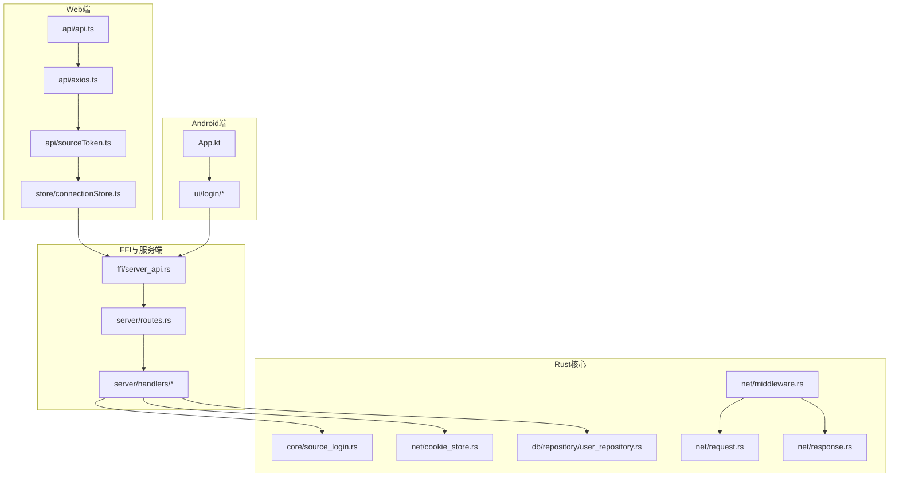
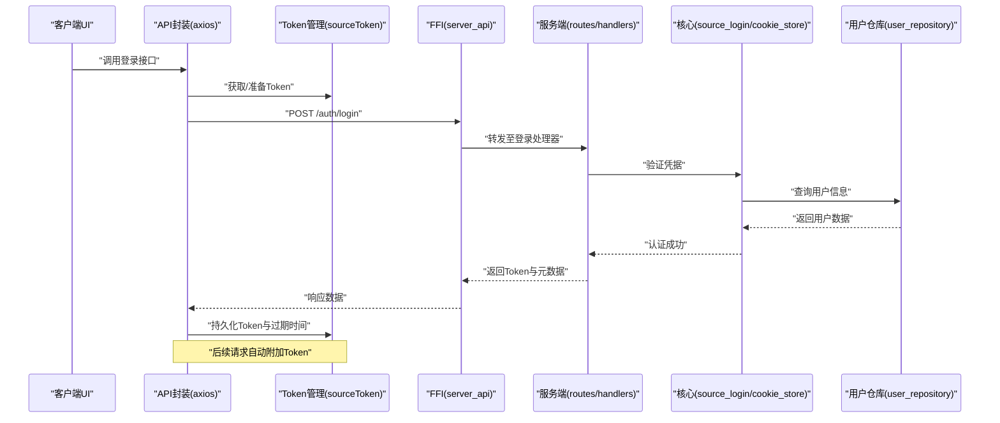
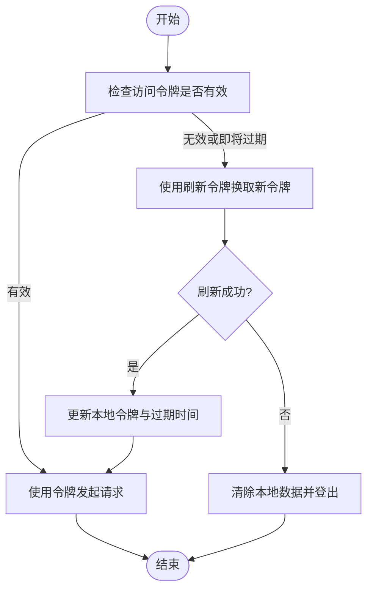
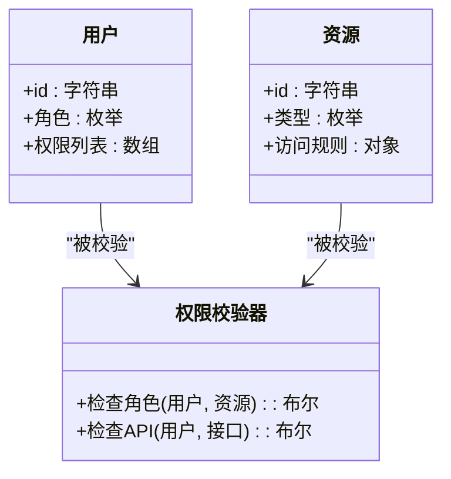
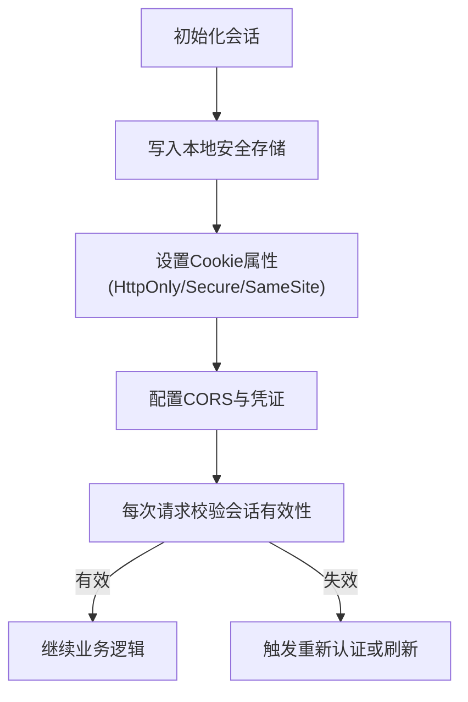
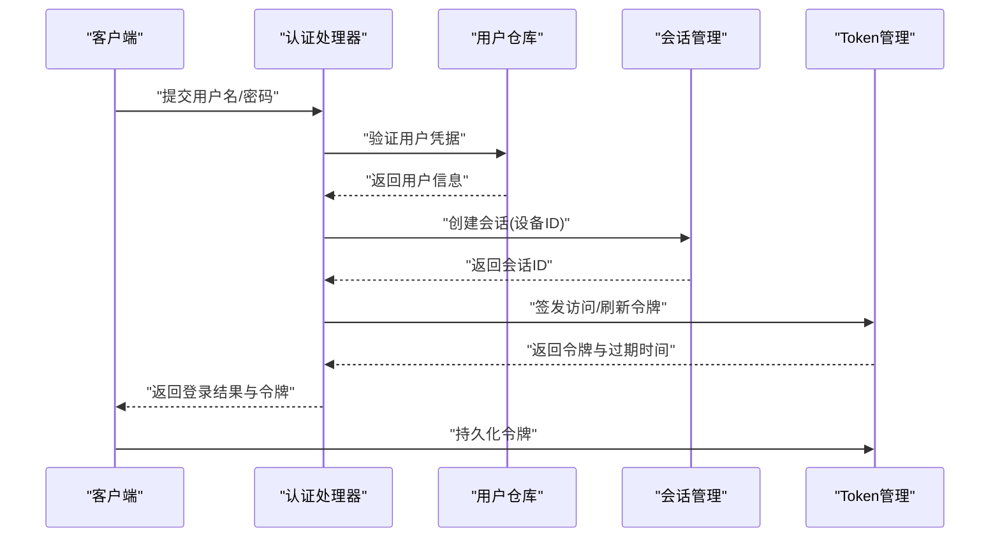
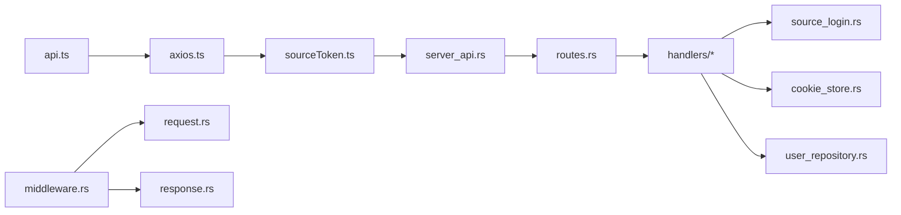

# 认证授权机制

<cite>
**本文档引用的文件**   
- [source_login.rs](file://rust/legado-core/src/source_login.rs)
- [cookie_store.rs](file://rust/legado-net/src/cookie_store.rs)
- [middleware.rs](file://rust/legado-net/src/middleware.rs)
- [request.rs](file://rust/legado-net/src/request.rs)
- [response.rs](file://rust/legado-net/src/response.rs)
- [user_repository.rs](file://rust/legado-db/src/repository/user_repository.rs)
- [server_api.rs](file://rust/legado-ffi/src/api/server_api.rs)
- [routes.rs](file://rust/legado-server/src/routes.rs)
- [handlers](file://rust/legado-server/src/handlers)
- [App.kt](file://app/src/main/java/io.legado.app/App.kt)
- [login](file://app/src/main/java/io.legado.app/ui/login)
- [api.ts](file://modules/web/src/api/api.ts)
- [axios.ts](file://modules/web/src/api/axios.ts)
- [sourceToken.ts](file://modules/web/src/api/sourceToken.ts)
- [connectionStore.ts](file://modules/web/src/store/connectionStore.ts)
</cite>

## 目录
1. [简介](#简介)
2. [项目结构](#项目结构)
3. [核心组件](#核心组件)
4. [架构总览](#架构总览)
5. [详细组件分析](#详细组件分析)
6. [依赖关系分析](#依赖关系分析)
7. [性能考量](#性能考量)
8. [故障排查指南](#故障排查指南)
9. [结论](#结论)
10. [附录](#附录)

## 简介
本文件面向Legado项目的认证与授权机制，系统性说明Token生命周期（生成、存储、刷新、过期处理）、权限控制（角色、资源、API级）、会话保持策略（本地存储、跨域、安全），以及登录流程（用户认证、多设备登录、登出）。文档同时给出可操作的示例路径与安全最佳实践，帮助开发者快速理解并正确实现。

## 项目结构
Legado采用多语言混合架构：Android端（Kotlin）负责UI与系统能力，Rust核心提供网络、数据库、FFI桥接与服务端能力，Web模块提供前端管理界面。认证授权相关的关键位置如下：
- Rust核心：源登录、Cookie存储、请求/响应中间件、用户数据仓库
- FFI层：对外暴露服务端接口
- 服务端：路由与处理器
- Android端：应用初始化与登录入口
- Web端：API封装、Token管理与连接状态

**图表来源** 
- [App.kt](file://app/src/main/java/io.legado.app/App.kt)
- [login](file://app/src/main/java/io.legado.app/ui/login)
- [api.ts](file://modules/web/src/api/api.ts)
- [axios.ts](file://modules/web/src/api/axios.ts)
- [sourceToken.ts](file://modules/web/src/api/sourceToken.ts)
- [connectionStore.ts](file://modules/web/src/store/connectionStore.ts)
- [source_login.rs](file://rust/legado-core/src/source_login.rs)
- [cookie_store.rs](file://rust/legado-net/src/cookie_store.rs)
- [middleware.rs](file://rust/legado-net/src/middleware.rs)
- [request.rs](file://rust/legado-net/src/request.rs)
- [response.rs](file://rust/legado-net/src/response.rs)
- [user_repository.rs](file://rust/legado-db/src/repository/user_repository.rs)
- [server_api.rs](file://rust/legado-ffi/src/api/server_api.rs)
- [routes.rs](file://rust/legado-server/src/routes.rs)
- [handlers](file://rust/legado-server/src/handlers)

**章节来源**
- [App.kt](file://app/src/main/java/io.legado.app/App.kt)
- [login](file://app/src/main/java/io.legado.app/ui/login)
- [api.ts](file://modules/web/src/api/api.ts)
- [axios.ts](file://modules/web/src/api/axios.ts)
- [sourceToken.ts](file://modules/web/src/api/sourceToken.ts)
- [connectionStore.ts](file://modules/web/src/store/connectionStore.ts)
- [source_login.rs](file://rust/legado-core/src/source_login.rs)
- [cookie_store.rs](file://rust/legado-net/src/cookie_store.rs)
- [middleware.rs](file://rust/legado-net/src/middleware.rs)
- [request.rs](file://rust/legado-net/src/request.rs)
- [response.rs](file://rust/legado-net/src/response.rs)
- [user_repository.rs](file://rust/legado-db/src/repository/user_repository.rs)
- [server_api.rs](file://rust/legado-ffi/src/api/server_api.rs)
- [routes.rs](file://rust/legado-server/src/routes.rs)
- [handlers](file://rust/legado-server/src/handlers)

## 核心组件
- Token管理：由Web端的Token工具与Android/Rust侧的Cookie/中间件协同完成，涵盖生成、持久化、自动刷新与过期处理。
- 权限控制：基于角色与资源的访问控制，结合API级别校验，确保最小权限原则。
- 会话保持：通过本地存储与Cookie双通道保障会话连续性，配合跨域配置与安全头增强安全性。
- 登录流程：从UI触发到后端验证、颁发Token、建立会话，支持多设备登录与会话隔离。

**章节来源**
- [source_login.rs](file://rust/legado-core/src/source_login.rs)
- [cookie_store.rs](file://rust/legado-net/src/cookie_store.rs)
- [middleware.rs](file://rust/legado-net/src/middleware.rs)
- [request.rs](file://rust/legado-net/src/request.rs)
- [response.rs](file://rust/legado-net/src/response.rs)
- [user_repository.rs](file://rust/legado-db/src/repository/user_repository.rs)
- [server_api.rs](file://rust/legado-ffi/src/api/server_api.rs)
- [routes.rs](file://rust/legado-server/src/routes.rs)
- [handlers](file://rust/legado-server/src/handlers)
- [api.ts](file://modules/web/src/api/api.ts)
- [axios.ts](file://modules/web/src/api/axios.ts)
- [sourceToken.ts](file://modules/web/src/api/sourceToken.ts)
- [connectionStore.ts](file://modules/web/src/store/connectionStore.ts)

## 架构总览
下图展示认证授权的端到端流程：客户端发起登录请求，服务端验证身份后签发Token，客户端持久化并在后续请求中携带；中间件对每个请求进行鉴权与权限检查，必要时刷新或拒绝访问。

**图表来源** 
- [api.ts](file://modules/web/src/api/api.ts)
- [axios.ts](file://modules/web/src/api/axios.ts)
- [sourceToken.ts](file://modules/web/src/api/sourceToken.ts)
- [server_api.rs](file://rust/legado-ffi/src/api/server_api.rs)
- [routes.rs](file://rust/legado-server/src/routes.rs)
- [handlers](file://rust/legado-server/src/handlers)
- [source_login.rs](file://rust/legado-core/src/source_login.rs)
- [cookie_store.rs](file://rust/legado-net/src/cookie_store.rs)
- [user_repository.rs](file://rust/legado-db/src/repository/user_repository.rs)

## 详细组件分析

### Token管理机制
- 生成：服务端在认证成功后生成短期有效的访问令牌，并附带刷新令牌与过期时间。
- 存储：客户端将Token写入本地存储（如SecureStorage/SharedPreferences）与Cookie（HttpOnly/SameSite），避免XSS与CSRF风险。
- 刷新：当访问令牌即将过期时，使用刷新令牌换取新令牌，保证无感续期。
- 过期处理：若刷新失败则强制登出并清理敏感数据，提示重新登录。

**图表来源** 
- [sourceToken.ts](file://modules/web/src/api/sourceToken.ts)
- [axios.ts](file://modules/web/src/api/axios.ts)
- [cookie_store.rs](file://rust/legado-net/src/cookie_store.rs)
- [middleware.rs](file://rust/legado-net/src/middleware.rs)

**章节来源**
- [sourceToken.ts](file://modules/web/src/api/sourceToken.ts)
- [axios.ts](file://modules/web/src/api/axios.ts)
- [cookie_store.rs](file://rust/legado-net/src/cookie_store.rs)
- [middleware.rs](file://rust/legado-net/src/middleware.rs)

### 权限控制实现
- 角色权限：用户登录后分配角色（如管理员、普通用户），不同角色具备不同操作范围。
- 资源访问控制：针对资源ID或命名空间进行细粒度校验，确保仅允许授权访问。
- API级别权限：在路由或处理器层面对接口进行鉴权拦截，未授权请求直接拒绝。

**图表来源** 
- [user_repository.rs](file://rust/legado-db/src/repository/user_repository.rs)
- [routes.rs](file://rust/legado-server/src/routes.rs)
- [handlers](file://rust/legado-server/src/handlers)

**章节来源**
- [user_repository.rs](file://rust/legado-db/src/repository/user_repository.rs)
- [routes.rs](file://rust/legado-server/src/routes.rs)
- [handlers](file://rust/legado-server/src/handlers)

### 会话保持策略
- 本地存储：优先使用安全的本地存储（如Android Keystore/SecurePreferences），避免明文泄露。
- Cookie策略：设置HttpOnly、Secure、SameSite属性，限制跨站与脚本访问。
- 跨域处理：配置CORS白名单与凭证传递，确保跨域请求安全。
- 安全考虑：定期轮换密钥、启用HTTPS、最小化敏感数据暴露。

**图表来源** 
- [cookie_store.rs](file://rust/legado-net/src/cookie_store.rs)
- [middleware.rs](file://rust/legado-net/src/middleware.rs)
- [axios.ts](file://modules/web/src/api/axios.ts)

**章节来源**
- [cookie_store.rs](file://rust/legado-net/src/cookie_store.rs)
- [middleware.rs](file://rust/legado-net/src/middleware.rs)
- [axios.ts](file://modules/web/src/api/axios.ts)

### 登录流程
- 用户认证：输入用户名与密码，客户端发送认证请求。
- 多设备登录：服务端为每个设备生成独立会话标识，支持并发登录与设备管理。
- 登出处理：服务端撤销会话与Token，客户端清理本地存储与Cookie。

**图表来源** 
- [source_login.rs](file://rust/legado-core/src/source_login.rs)
- [user_repository.rs](file://rust/legado-db/src/repository/user_repository.rs)
- [handlers](file://rust/legado-server/src/handlers)
- [sourceToken.ts](file://modules/web/src/api/sourceToken.ts)

**章节来源**
- [source_login.rs](file://rust/legado-core/src/source_login.rs)
- [user_repository.rs](file://rust/legado-db/src/repository/user_repository.rs)
- [handlers](file://rust/legado-server/src/handlers)
- [sourceToken.ts](file://modules/web/src/api/sourceToken.ts)

### 具体示例
- Token获取：通过登录接口获取访问令牌与刷新令牌，并写入本地存储。
- 权限检查：在请求前校验用户角色与资源访问规则，未授权则拒绝。
- 安全配置：启用HTTPS、设置Cookie安全属性、配置CORS白名单。

示例路径参考：
- [api.ts](file://modules/web/src/api/api.ts)
- [axios.ts](file://modules/web/src/api/axios.ts)
- [sourceToken.ts](file://modules/web/src/api/sourceToken.ts)
- [middleware.rs](file://rust/legado-net/src/middleware.rs)
- [cookie_store.rs](file://rust/legado-net/src/cookie_store.rs)

**章节来源**
- [api.ts](file://modules/web/src/api/api.ts)
- [axios.ts](file://modules/web/src/api/axios.ts)
- [sourceToken.ts](file://modules/web/src/api/sourceToken.ts)
- [middleware.rs](file://rust/legado-net/src/middleware.rs)
- [cookie_store.rs](file://rust/legado-net/src/cookie_store.rs)

## 依赖关系分析
认证授权涉及多层依赖：Web端API封装依赖Token管理，FFI层对接服务端路由与处理器，核心层提供登录与Cookie能力，数据库层维护用户信息。

**图表来源** 
- [api.ts](file://modules/web/src/api/api.ts)
- [axios.ts](file://modules/web/src/api/axios.ts)
- [sourceToken.ts](file://modules/web/src/api/sourceToken.ts)
- [server_api.rs](file://rust/legado-ffi/src/api/server_api.rs)
- [routes.rs](file://rust/legado-server/src/routes.rs)
- [handlers](file://rust/legado-server/src/handlers)
- [source_login.rs](file://rust/legado-core/src/source_login.rs)
- [cookie_store.rs](file://rust/legado-net/src/cookie_store.rs)
- [user_repository.rs](file://rust/legado-db/src/repository/user_repository.rs)
- [middleware.rs](file://rust/legado-net/src/middleware.rs)
- [request.rs](file://rust/legado-net/src/request.rs)
- [response.rs](file://rust/legado-net/src/response.rs)

**章节来源**
- [api.ts](file://modules/web/src/api/api.ts)
- [axios.ts](file://modules/web/src/api/axios.ts)
- [sourceToken.ts](file://modules/web/src/api/sourceToken.ts)
- [server_api.rs](file://rust/legado-ffi/src/api/server_api.rs)
- [routes.rs](file://rust/legado-server/src/routes.rs)
- [handlers](file://rust/legado-server/src/handlers)
- [source_login.rs](file://rust/legado-core/src/source_login.rs)
- [cookie_store.rs](file://rust/legado-net/src/cookie_store.rs)
- [user_repository.rs](file://rust/legado-db/src/repository/user_repository.rs)
- [middleware.rs](file://rust/legado-net/src/middleware.rs)
- [request.rs](file://rust/legado-net/src/request.rs)
- [response.rs](file://rust/legado-net/src/response.rs)

## 性能考量
- Token刷新策略：采用短效访问令牌+长效刷新令牌，减少频繁认证开销。
- 缓存与会话：合理设置Cookie与本地存储的过期时间，避免频繁读写。
- 并发登录：服务端为每个设备维护独立会话，避免锁竞争。
- 中间件优化：鉴权逻辑尽量轻量，避免阻塞主流程。

[本节为通用指导，不直接分析具体文件]

## 故障排查指南
- 登录失败：检查凭据是否正确、用户是否存在、密码哈希是否匹配。
- Token无效：确认本地存储是否损坏、刷新令牌是否过期、服务端会话是否被撤销。
- 权限拒绝：核对用户角色与资源访问规则、API级别权限配置。
- 跨域问题：检查CORS配置、Cookie的SameSite与Secure属性、请求是否携带凭证。

**章节来源**
- [source_login.rs](file://rust/legado-core/src/source_login.rs)
- [cookie_store.rs](file://rust/legado-net/src/cookie_store.rs)
- [middleware.rs](file://rust/legado-net/src/middleware.rs)
- [user_repository.rs](file://rust/legado-db/src/repository/user_repository.rs)

## 结论
Legado的认证授权机制以Token为核心，结合Cookie与本地存储实现会话保持，通过中间件与权限校验器保障资源与API安全。建议持续优化刷新策略、强化安全配置，并完善错误处理与日志记录，以提升用户体验与系统安全性。

[本节为总结性内容，不直接分析具体文件]

## 附录
- 安全最佳实践：
  - 使用HTTPS传输所有敏感数据
  - 设置Cookie的HttpOnly、Secure、SameSite属性
  - 实施最小权限原则，按角色与资源精细化控制
  - 定期轮换密钥与令牌，监控异常登录行为
- 常见漏洞防护：
  - 防止XSS：避免在页面中直接输出用户输入
  - 防止CSRF：使用SameSite Cookie与请求签名
  - 防止重放攻击：引入随机数与时间戳校验

[本节为通用指导，不直接分析具体文件]