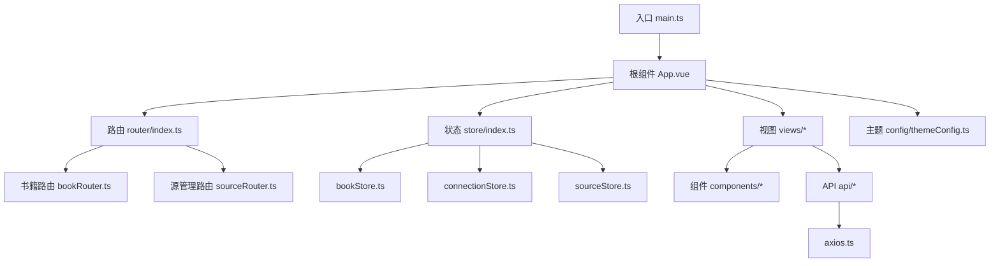
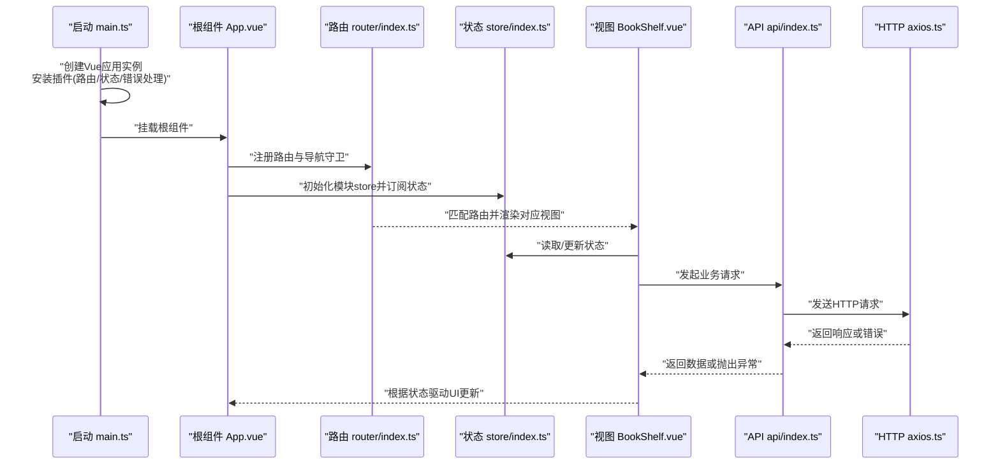
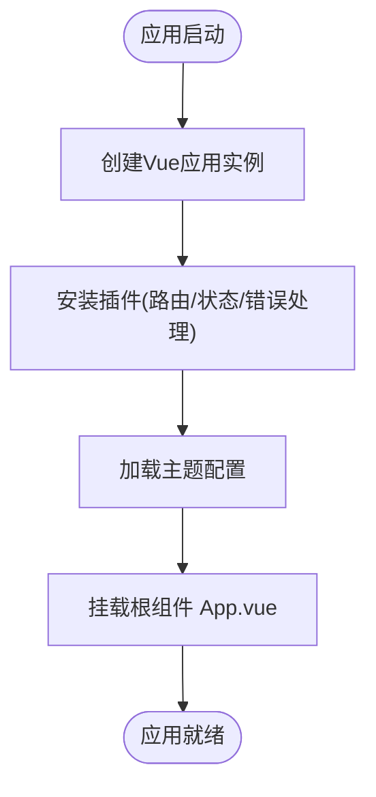
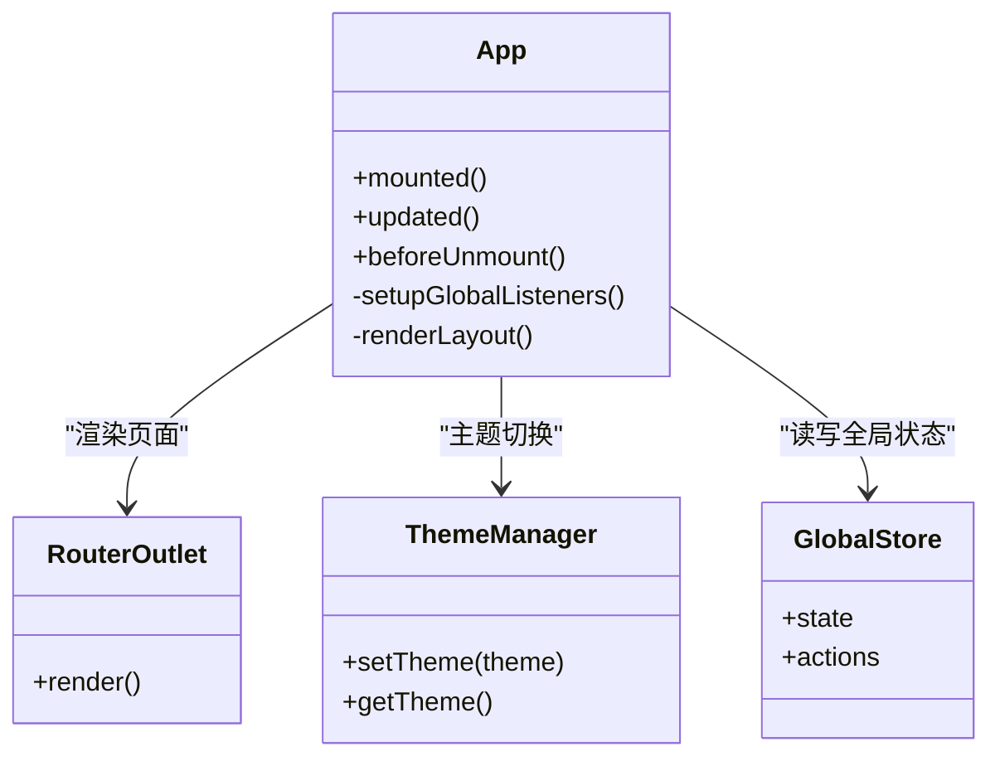
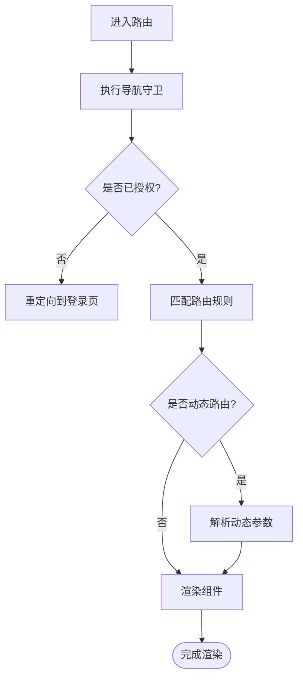
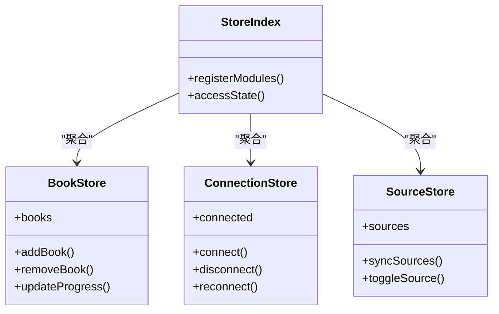
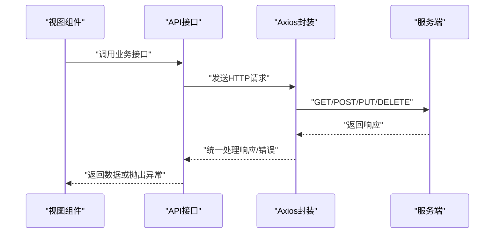
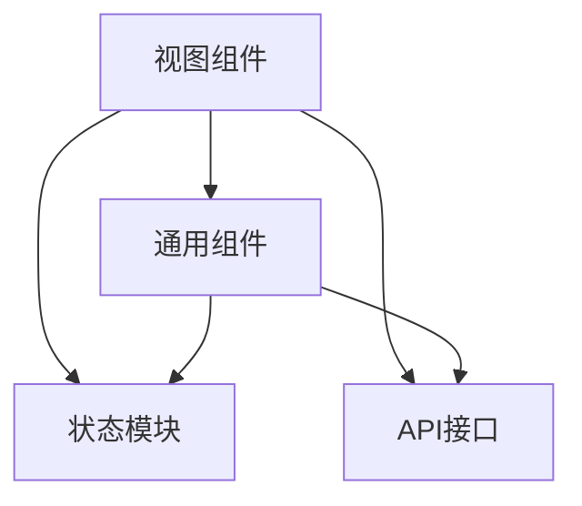
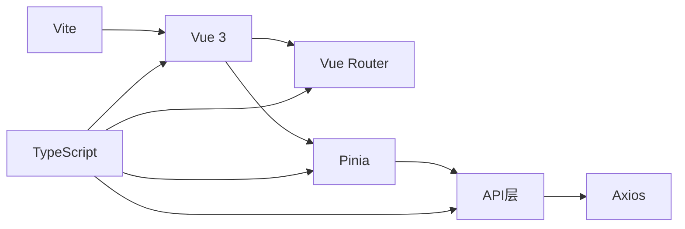

# Vue.js应用架构

<cite>
**本文引用的文件**   
- [modules/web/src/main.ts](file://modules/web/src/main.ts)
- [modules/web/src/App.vue](file://modules/web/src/App.vue)
- [modules/web/src/router/index.ts](file://modules/web/src/router/index.ts)
- [modules/web/src/router/bookRouter.ts](file://modules/web/src/router/bookRouter.ts)
- [modules/web/src/router/sourceRouter.ts](file://modules/web/src/router/sourceRouter.ts)
- [modules/web/src/store/index.ts](file://modules/web/src/store/index.ts)
- [modules/web/src/store/bookStore.ts](file://modules/web/src/store/bookStore.ts)
- [modules/web/src/store/connectionStore.ts](file://modules/web/src/store/connectionStore.ts)
- [modules/web/src/store/sourceStore.ts](file://modules/web/src/store/sourceStore.ts)
- [modules/web/src/views/BookShelf.vue](file://modules/web/src/views/BookShelf.vue)
- [modules/web/src/views/BookChapter.vue](file://modules/web/src/views/BookChapter.vue)
- [modules/web/src/views/SourceEditor.vue](file://modules/web/src/views/SourceEditor.vue)
- [modules/web/src/components/ToolBar.vue](file://modules/web/src/components/ToolBar.vue)
- [modules/web/src/components/ReadSettings.vue](file://modules/web/src/components/ReadSettings.vue)
- [modules/web/src/api/index.ts](file://modules/web/src/api/index.ts)
- [modules/web/src/api/axios.ts](file://modules/web/src/api/axios.ts)
- [modules/web/src/config/themeConfig.ts](file://modules/web/src/config/themeConfig.ts)
- [modules/web/tsconfig.json](file://modules/web/tsconfig.json)
- [modules/web/vite.config.ts](file://modules/web/vite.config.ts)
- [modules/web/package.json](file://modules/web/package.json)
</cite>

## 目录
1. [简介](#简介)
2. [项目结构](#项目结构)
3. [核心组件](#核心组件)
4. [架构总览](#架构总览)
5. [详细组件分析](#详细组件分析)
6. [依赖关系分析](#依赖关系分析)
7. [性能考虑](#性能考虑)
8. [故障排查指南](#故障排查指南)
9. [结论](#结论)
10. [附录](#附录)

## 简介
本文件面向Legado项目的Web端（Vue 3 + TypeScript + Vite）进行系统化架构说明，覆盖应用初始化流程、根组件设计、路由系统（定义、导航守卫、动态路由）、Pinia状态管理（模块化与持久化）、TypeScript集成与类型管理。文档同时提供启动流程图、组件层次结构与数据流向图，并给出最佳实践建议与常见问题排查方法。

## 项目结构
Web模块位于 modules/web，采用Vite构建，使用Vue 3单文件组件组织UI，通过Vue Router进行页面路由，使用Pinia进行全局状态管理，API层基于Axios封装，主题配置集中管理。

图表来源
- [modules/web/src/main.ts](file://modules/web/src/main.ts)
- [modules/web/src/App.vue](file://modules/web/src/App.vue)
- [modules/web/src/router/index.ts](file://modules/web/src/router/index.ts)
- [modules/web/src/router/bookRouter.ts](file://modules/web/src/router/bookRouter.ts)
- [modules/web/src/router/sourceRouter.ts](file://modules/web/src/router/sourceRouter.ts)
- [modules/web/src/store/index.ts](file://modules/web/src/store/index.ts)
- [modules/web/src/store/bookStore.ts](file://modules/web/src/store/bookStore.ts)
- [modules/web/src/store/connectionStore.ts](file://modules/web/src/store/connectionStore.ts)
- [modules/web/src/store/sourceStore.ts](file://modules/web/src/store/sourceStore.ts)
- [modules/web/src/api/index.ts](file://modules/web/src/api/index.ts)
- [modules/web/src/api/axios.ts](file://modules/web/src/api/axios.ts)
- [modules/web/src/config/themeConfig.ts](file://modules/web/src/config/themeConfig.ts)

章节来源
- [modules/web/src/main.ts](file://modules/web/src/main.ts)
- [modules/web/src/App.vue](file://modules/web/src/App.vue)
- [modules/web/src/router/index.ts](file://modules/web/src/router/index.ts)
- [modules/web/src/store/index.ts](file://modules/web/src/store/index.ts)
- [modules/web/package.json](file://modules/web/package.json)
- [modules/web/vite.config.ts](file://modules/web/vite.config.ts)

## 核心组件
- 入口初始化：main.ts负责创建Vue应用实例、挂载插件（如路由、状态管理、错误处理等），并将App根组件挂载到DOM节点。
- 根组件：App.vue作为应用外壳，通常包含全局布局、路由出口、主题切换、全局提示等。
- 路由系统：router/index.ts统一注册路由，bookRouter.ts与sourceRouter.ts按功能域拆分路由表；支持导航守卫与动态路由参数。
- 状态管理：store/index.ts聚合各模块store，bookStore.ts、connectionStore.ts、sourceStore.ts分别管理书籍、连接、源相关状态。
- API层：api/index.ts暴露业务接口，axios.ts封装请求拦截、响应处理、错误统一处理。
- 主题配置：config/themeConfig.ts集中管理主题变量与切换逻辑。

章节来源
- [modules/web/src/main.ts](file://modules/web/src/main.ts)
- [modules/web/src/App.vue](file://modules/web/src/App.vue)
- [modules/web/src/router/index.ts](file://modules/web/src/router/index.ts)
- [modules/web/src/router/bookRouter.ts](file://modules/web/src/router/bookRouter.ts)
- [modules/web/src/router/sourceRouter.ts](file://modules/web/src/router/sourceRouter.ts)
- [modules/web/src/store/index.ts](file://modules/web/src/store/index.ts)
- [modules/web/src/store/bookStore.ts](file://modules/web/src/store/bookStore.ts)
- [modules/web/src/store/connectionStore.ts](file://modules/web/src/store/connectionStore.ts)
- [modules/web/src/store/sourceStore.ts](file://modules/web/src/store/sourceStore.ts)
- [modules/web/src/api/index.ts](file://modules/web/src/api/index.ts)
- [modules/web/src/api/axios.ts](file://modules/web/src/api/axios.ts)
- [modules/web/src/config/themeConfig.ts](file://modules/web/src/config/themeConfig.ts)

## 架构总览
下图展示从应用启动到页面渲染的关键路径，包括插件初始化、路由解析、状态订阅与API调用。

图表来源
- [modules/web/src/main.ts](file://modules/web/src/main.ts)
- [modules/web/src/App.vue](file://modules/web/src/App.vue)
- [modules/web/src/router/index.ts](file://modules/web/src/router/index.ts)
- [modules/web/src/store/index.ts](file://modules/web/src/store/index.ts)
- [modules/web/src/views/BookShelf.vue](file://modules/web/src/views/BookShelf.vue)
- [modules/web/src/api/index.ts](file://modules/web/src/api/index.ts)
- [modules/web/src/api/axios.ts](file://modules/web/src/api/axios.ts)

## 详细组件分析

### 应用初始化流程（main.ts）
- 创建Vue应用实例，注入必要的插件（如路由、状态管理、错误边界等）。
- 加载全局样式与主题配置。
- 挂载根组件到目标DOM节点。
- 可选：在开发环境启用调试工具与热更新。

图表来源
- [modules/web/src/main.ts](file://modules/web/src/main.ts)
- [modules/web/src/config/themeConfig.ts](file://modules/web/src/config/themeConfig.ts)

章节来源
- [modules/web/src/main.ts](file://modules/web/src/main.ts)
- [modules/web/src/config/themeConfig.ts](file://modules/web/src/config/themeConfig.ts)

### 根组件设计（App.vue）
- 作为应用外壳，承载全局布局、导航栏、侧边栏、消息提示等。
- 通过路由出口渲染具体页面。
- 监听全局事件（如主题切换、语言切换、用户登录态变化）。
- 与状态模块交互，维护全局可见的状态（如当前主题、用户信息、连接状态）。

图表来源
- [modules/web/src/App.vue](file://modules/web/src/App.vue)
- [modules/web/src/store/index.ts](file://modules/web/src/store/index.ts)
- [modules/web/src/config/themeConfig.ts](file://modules/web/src/config/themeConfig.ts)

章节来源
- [modules/web/src/App.vue](file://modules/web/src/App.vue)
- [modules/web/src/store/index.ts](file://modules/web/src/store/index.ts)
- [modules/web/src/config/themeConfig.ts](file://modules/web/src/config/themeConfig.ts)

### 路由系统（router/index.ts, bookRouter.ts, sourceRouter.ts）
- 统一入口router/index.ts负责注册路由、设置基础路径、挂载导航守卫。
- 按功能域拆分路由表：bookRouter.ts管理书籍相关页面，sourceRouter.ts管理源编辑与管理页面。
- 支持动态路由参数（如书籍ID、章节号、源名称等）。
- 导航守卫用于权限校验、加载进度、未登录跳转等。

图表来源
- [modules/web/src/router/index.ts](file://modules/web/src/router/index.ts)
- [modules/web/src/router/bookRouter.ts](file://modules/web/src/router/bookRouter.ts)
- [modules/web/src/router/sourceRouter.ts](file://modules/web/src/router/sourceRouter.ts)

章节来源
- [modules/web/src/router/index.ts](file://modules/web/src/router/index.ts)
- [modules/web/src/router/bookRouter.ts](file://modules/web/src/router/bookRouter.ts)
- [modules/web/src/router/sourceRouter.ts](file://modules/web/src/router/sourceRouter.ts)

### 状态管理（store/index.ts, bookStore.ts, connectionStore.ts, sourceStore.ts）
- store/index.ts聚合各模块store，提供统一的访问入口。
- bookStore.ts管理书籍列表、阅读进度、收藏等。
- connectionStore.ts管理与服务端的连接状态、心跳、重连策略。
- sourceStore.ts管理源配置、同步状态、调试信息等。
- 支持状态持久化（如localStorage/sessionStorage）与按需加载。

图表来源
- [modules/web/src/store/index.ts](file://modules/web/src/store/index.ts)
- [modules/web/src/store/bookStore.ts](file://modules/web/src/store/bookStore.ts)
- [modules/web/src/store/connectionStore.ts](file://modules/web/src/store/connectionStore.ts)
- [modules/web/src/store/sourceStore.ts](file://modules/web/src/store/sourceStore.ts)

章节来源
- [modules/web/src/store/index.ts](file://modules/web/src/store/index.ts)
- [modules/web/src/store/bookStore.ts](file://modules/web/src/store/bookStore.ts)
- [modules/web/src/store/connectionStore.ts](file://modules/web/src/store/connectionStore.ts)
- [modules/web/src/store/sourceStore.ts](file://modules/web/src/store/sourceStore.ts)

### API层（api/index.ts, axios.ts）
- api/index.ts暴露业务接口，对底层HTTP请求进行抽象。
- axios.ts封装请求拦截器（添加token、超时、重试）、响应拦截器（统一错误处理、数据解包）。
- 支持请求取消、缓存、日志记录等高级特性。

图表来源
- [modules/web/src/api/index.ts](file://modules/web/src/api/index.ts)
- [modules/web/src/api/axios.ts](file://modules/web/src/api/axios.ts)

章节来源
- [modules/web/src/api/index.ts](file://modules/web/src/api/index.ts)
- [modules/web/src/api/axios.ts](file://modules/web/src/api/axios.ts)

### 视图与组件（views/*, components/*）
- 视图组件（如BookShelf.vue、BookChapter.vue、SourceEditor.vue）负责页面级逻辑与数据绑定。
- 通用组件（如ToolBar.vue、ReadSettings.vue）提供可复用的UI能力。
- 组件间通信通过props、events、状态模块进行。

图表来源
- [modules/web/src/views/BookShelf.vue](file://modules/web/src/views/BookShelf.vue)
- [modules/web/src/views/BookChapter.vue](file://modules/web/src/views/BookChapter.vue)
- [modules/web/src/views/SourceEditor.vue](file://modules/web/src/views/SourceEditor.vue)
- [modules/web/src/components/ToolBar.vue](file://modules/web/src/components/ToolBar.vue)
- [modules/web/src/components/ReadSettings.vue](file://modules/web/src/components/ReadSettings.vue)
- [modules/web/src/store/index.ts](file://modules/web/src/store/index.ts)
- [modules/web/src/api/index.ts](file://modules/web/src/api/index.ts)

章节来源
- [modules/web/src/views/BookShelf.vue](file://modules/web/src/views/BookShelf.vue)
- [modules/web/src/views/BookChapter.vue](file://modules/web/src/views/BookChapter.vue)
- [modules/web/src/views/SourceEditor.vue](file://modules/web/src/views/SourceEditor.vue)
- [modules/web/src/components/ToolBar.vue](file://modules/web/src/components/ToolBar.vue)
- [modules/web/src/components/ReadSettings.vue](file://modules/web/src/components/ReadSettings.vue)
- [modules/web/src/store/index.ts](file://modules/web/src/store/index.ts)
- [modules/web/src/api/index.ts](file://modules/web/src/api/index.ts)

## 依赖关系分析
- 构建工具：Vite负责开发与构建优化。
- 框架：Vue 3提供响应式与组件化能力。
- 路由：Vue Router管理页面导航与路由守卫。
- 状态：Pinia提供模块化状态管理。
- HTTP：Axios封装网络请求。
- 类型：TypeScript提供静态类型检查与IDE支持。

图表来源
- [modules/web/vite.config.ts](file://modules/web/vite.config.ts)
- [modules/web/package.json](file://modules/web/package.json)
- [modules/web/tsconfig.json](file://modules/web/tsconfig.json)

章节来源
- [modules/web/vite.config.ts](file://modules/web/vite.config.ts)
- [modules/web/package.json](file://modules/web/package.json)
- [modules/web/tsconfig.json](file://modules/web/tsconfig.json)

## 性能考虑
- 路由懒加载：按页面分割代码，减少首屏体积。
- 组件按需引入：避免全局注册导致打包膨胀。
- 状态持久化：合理使用localStorage/sessionStorage，避免频繁写入。
- 请求优化：合并请求、缓存响应、错误重试与超时控制。
- 主题切换：使用CSS变量或预编译样式，避免运行时计算开销。

[本节为通用指导，不直接分析具体文件]

## 故障排查指南
- 路由问题：检查路由定义是否正确、导航守卫是否阻止跳转、动态参数是否传递正确。
- 状态问题：确认store模块是否注册、状态是否被意外重置、持久化是否生效。
- API问题：检查axios拦截器配置、网络请求是否成功、错误是否被统一处理。
- 主题问题：验证主题配置文件是否加载、CSS变量是否正确应用。
- 类型问题：确保tsconfig配置正确、类型定义文件是否更新。

章节来源
- [modules/web/src/router/index.ts](file://modules/web/src/router/index.ts)
- [modules/web/src/store/index.ts](file://modules/web/src/store/index.ts)
- [modules/web/src/api/axios.ts](file://modules/web/src/api/axios.ts)
- [modules/web/src/config/themeConfig.ts](file://modules/web/src/config/themeConfig.ts)
- [modules/web/tsconfig.json](file://modules/web/tsconfig.json)

## 结论
本项目采用Vue 3 + TypeScript + Vite的现代前端架构，通过Vue Router实现灵活的路由管理，Pinia提供清晰的状态管理，API层基于Axios封装保证网络请求的健壮性。整体结构清晰、职责分离明确，便于扩展与维护。建议遵循模块化设计、类型优先、性能优化的最佳实践，持续提升代码质量与用户体验。

[本节为总结性内容，不直接分析具体文件]

## 附录
- 最佳实践建议：
  - 使用组合式API提升逻辑复用性。
  - 为所有API接口定义明确的类型。
  - 路由守卫中统一处理权限与错误。
  - 状态模块保持单一职责，避免过度耦合。
  - 使用环境变量管理不同环境的配置。
  - 编写单元测试与端到端测试保障稳定性。

[本节为补充建议，不直接分析具体文件]