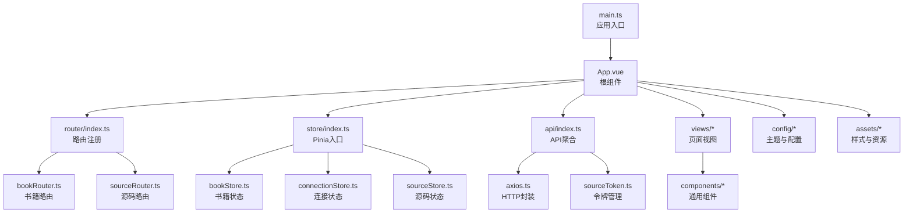
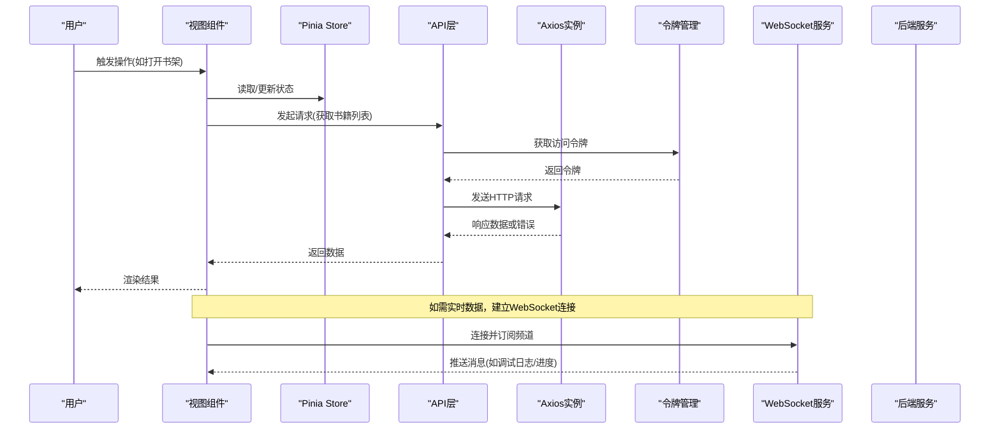
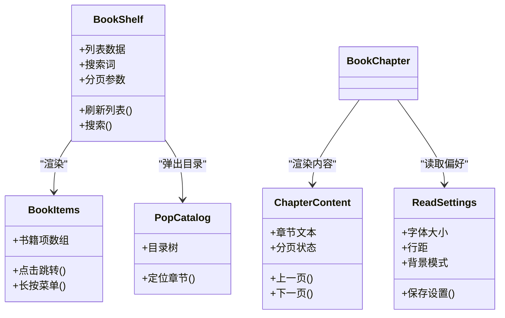
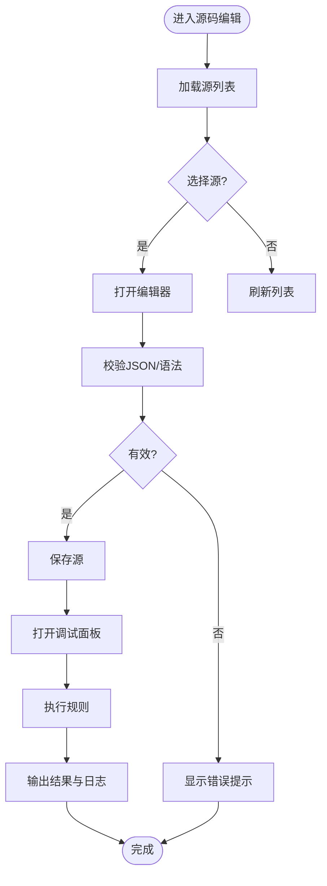
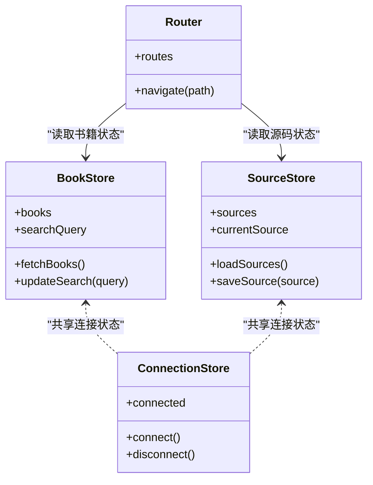
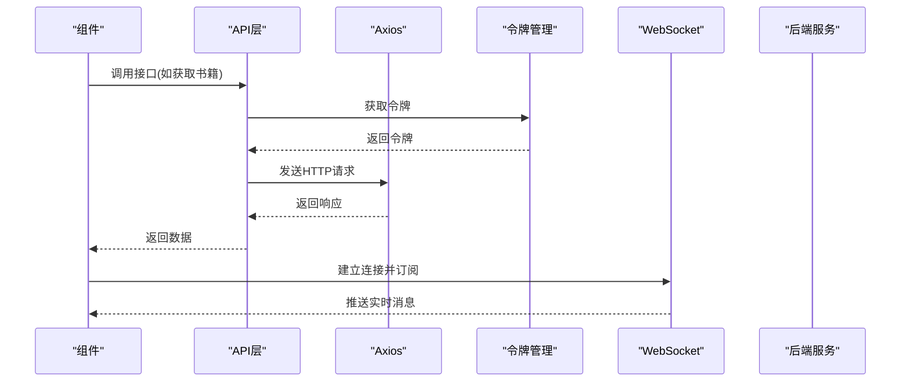
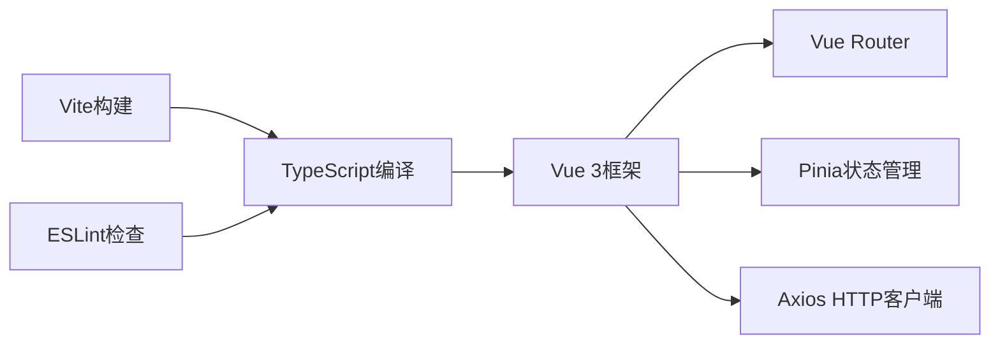

# Web管理界面

<cite>
**本文引用的文件**   
- [modules/web/package.json](file://modules/web/package.json)
- [modules/web/vite.config.ts](file://modules/web/vite.config.ts)
- [modules/web/tsconfig.app.json](file://modules/web/tsconfig.app.json)
- [modules/web/eslint.config.mjs](file://modules/web/eslint.config.mjs)
- [modules/web/src/main.ts](file://modules/web/src/main.ts)
- [modules/web/src/App.vue](file://modules/web/src/App.vue)
- [modules/web/src/router/index.ts](file://modules/web/src/router/index.ts)
- [modules/web/src/router/bookRouter.ts](file://modules/web/src/router/bookRouter.ts)
- [modules/web/src/router/sourceRouter.ts](file://modules/web/src/router/sourceRouter.ts)
- [modules/web/src/store/index.ts](file://modules/web/src/store/index.ts)
- [modules/web/src/store/bookStore.ts](file://modules/web/src/store/bookStore.ts)
- [modules/web/src/store/connectionStore.ts](file://modules/web/src/store/connectionStore.ts)
- [modules/web/src/store/sourceStore.ts](file://modules/web/src/store/sourceStore.ts)
- [modules/web/src/api/axios.ts](file://modules/web/src/api/axios.ts)
- [modules/web/src/api/api.ts](file://modules/web/src/api/api.ts)
- [modules/web/src/api/index.ts](file://modules/web/src/api/index.ts)
- [modules/web/src/api/sourceToken.ts](file://modules/web/src/api/sourceToken.ts)
- [modules/web/src/views/BookShelf.vue](file://modules/web/src/views/BookShelf.vue)
- [modules/web/src/views/BookChapter.vue](file://modules/web/src/views/BookChapter.vue)
- [modules/web/src/views/SourceEditor.vue](file://modules/web/src/views/SourceEditor.vue)
- [modules/web/src/components/BookItems.vue](file://modules/web/src/components/BookItems.vue)
- [modules/web/src/components/CatalogItem.vue](file://modules/web/src/components/CatalogItem.vue)
- [modules/web/src/components/ChapterContent.vue](file://modules/web/src/components/ChapterContent.vue)
- [modules/web/src/components/PopCatalog.vue](file://modules/web/src/components/PopCatalog.vue)
- [modules/web/src/components/ReadSettings.vue](file://modules/web/src/components/ReadSettings.vue)
- [modules/web/src/components/SourceDebug.vue](file://modules/web/src/components/SourceDebug.vue)
- [modules/web/src/components/SourceHelp.vue](file://modules/web/src/components/SourceHelp.vue)
- [modules/web/src/components/SourceItem.vue](file://modules/web/src/components/SourceItem.vue)
- [modules/web/src/components/SourceJson.vue](file://modules/web/src/components/SourceJson.vue)
- [modules/web/src/components/SourceList.vue](file://modules/web/src/components/SourceList.vue)
- [modules/web/src/components/SourceTabForm.vue](file://modules/web/src/components/SourceTabForm.vue)
- [modules/web/src/components/SourceTabTools.vue](file://modules/web/src/components/SourceTabTools.vue)
- [modules/web/src/components/ToolBar.vue](file://modules/web/src/components/ToolBar.vue)
- [modules/web/src/config/themeConfig.ts](file://modules/web/src/config/themeConfig.ts)
- [modules/web/src/config/bookSourceEditConfig.ts](file://modules/web/src/config/bookSourceEditConfig.ts)
- [modules/web/src/config/rssSourceEditConfig.ts](file://modules/web/src/config/rssSourceEditConfig.ts)
- [modules/web/src/config/sourceConfig.d.ts](file://modules/web/src/config/sourceConfig.d.ts)
- [modules/web/src/utils/utils.ts](file://modules/web/src/utils/utils.ts)
- [modules/web/src/utils/souce.ts](file://modules/web/src/utils/souce.ts)
- [modules/web/src/hooks/loading.ts](file://modules/web/src/hooks/loading.ts)
- [modules/web/src/assets/bookshelf.css](file://modules/web/src/assets/bookshelf.css)
- [modules/web/src/assets/code.css](file://modules/web/src/assets/code.css)
- [modules/web/src/assets/kbd.css](file://modules/web/src/assets/kbd.css)
- [modules/web/src/assets/sourceeditor.css](file://modules/web/src/assets/sourceeditor.css)
</cite>

## 目录
1. [简介](#简介)
2. [项目结构](#项目结构)
3. [核心组件](#核心组件)
4. [架构总览](#架构总览)
5. [详细组件分析](#详细组件分析)
6. [依赖分析](#依赖分析)
7. [性能考虑](#性能考虑)
8. [故障排查指南](#故障排查指南)
9. [结论](#结论)
10. [附录](#附录)

## 简介
本文件面向Legado项目的Web管理界面，系统性阐述基于Vue.js的架构设计与实现，包括组件化开发、状态管理（Pinia）、路由管理（Vue Router）、与后端服务的通信机制（RESTful API、WebSocket、文件上传下载），以及开发工具链（Vite、TypeScript、ESLint）。同时覆盖主题系统与国际化支持、组件开发规范与最佳实践，并提供可操作的示例与调试技巧。

## 项目结构
Web管理界面位于 modules/web 子工程，采用典型的Vue单页应用组织方式：
- 入口与根组件：main.ts 初始化应用，App.vue 作为根容器
- 路由：router 目录下按功能域划分 bookRouter.ts、sourceRouter.ts，统一在 index.ts 中注册
- 状态管理：store 目录使用Pinia进行全局状态管理，包含书籍、连接、源码等模块
- API层：api 目录封装HTTP请求、拦截器、令牌管理等
- 页面与视图：views 目录承载主要业务页面（书架、章节阅读、源码编辑）
- 通用组件：components 目录提供可复用UI组件（书架项、目录弹窗、阅读器设置、源码调试等）
- 配置与类型：config 目录存放主题、编辑器表单配置及类型声明
- 样式与资源：assets 目录集中管理CSS与静态资源
- 构建与工具：vite.config.ts、tsconfig.*、eslint.config.mjs、package.json 等

图表来源
- [modules/web/src/main.ts](file://modules/web/src/main.ts)
- [modules/web/src/App.vue](file://modules/web/src/App.vue)
- [modules/web/src/router/index.ts](file://modules/web/src/router/index.ts)
- [modules/web/src/router/bookRouter.ts](file://modules/web/src/router/bookRouter.ts)
- [modules/web/src/router/sourceRouter.ts](file://modules/web/src/router/sourceRouter.ts)
- [modules/web/src/store/index.ts](file://modules/web/src/store/index.ts)
- [modules/web/src/store/bookStore.ts](file://modules/web/src/store/bookStore.ts)
- [modules/web/src/store/connectionStore.ts](file://modules/web/src/store/connectionStore.ts)
- [modules/web/src/store/sourceStore.ts](file://modules/web/src/store/sourceStore.ts)
- [modules/web/src/api/index.ts](file://modules/web/src/api/index.ts)
- [modules/web/src/api/axios.ts](file://modules/web/src/api/axios.ts)
- [modules/web/src/api/sourceToken.ts](file://modules/web/src/api/sourceToken.ts)

章节来源
- [modules/web/package.json](file://modules/web/package.json)
- [modules/web/vite.config.ts](file://modules/web/vite.config.ts)
- [modules/web/tsconfig.app.json](file://modules/web/tsconfig.app.json)
- [modules/web/eslint.config.mjs](file://modules/web/eslint.config.mjs)
- [modules/web/src/main.ts](file://modules/web/src/main.ts)
- [modules/web/src/App.vue](file://modules/web/src/App.vue)
- [modules/web/src/router/index.ts](file://modules/web/src/router/index.ts)

## 核心组件
- 书架与书籍管理
  - BookShelf.vue：书架列表展示、搜索、排序、批量操作
  - BookItems.vue：书籍条目渲染与交互
  - CatalogItem.vue：目录项渲染与跳转
  - ChapterContent.vue：章节内容渲染与分页
  - PopCatalog.vue：弹出式目录面板
  - ReadSettings.vue：阅读器设置（字体、行距、背景等）
- 源码编辑与规则调试
  - SourceEditor.vue：源码编辑器主视图，集成代码高亮与保存
  - SourceList.vue：源列表与筛选
  - SourceItem.vue：单个源的元数据展示与操作
  - SourceJson.vue：JSON格式查看与编辑
  - SourceDebug.vue：规则调试面板，输出日志与结果预览
  - SourceTabForm.vue / SourceTabTools.vue：表单与工具栏组合
- 通用能力
  - ToolBar.vue：顶部工具栏，统一操作入口
  - hooks/loading.ts：加载状态Hook，简化异步UI反馈
  - utils/utils.ts 与 souce.ts：通用工具函数与源相关辅助逻辑

章节来源
- [modules/web/src/views/BookShelf.vue](file://modules/web/src/views/BookShelf.vue)
- [modules/web/src/views/BookChapter.vue](file://modules/web/src/views/BookChapter.vue)
- [modules/web/src/views/SourceEditor.vue](file://modules/web/src/views/SourceEditor.vue)
- [modules/web/src/components/BookItems.vue](file://modules/web/src/components/BookItems.vue)
- [modules/web/src/components/CatalogItem.vue](file://modules/web/src/components/CatalogItem.vue)
- [modules/web/src/components/ChapterContent.vue](file://modules/web/src/components/ChapterContent.vue)
- [modules/web/src/components/PopCatalog.vue](file://modules/web/src/components/PopCatalog.vue)
- [modules/web/src/components/ReadSettings.vue](file://modules/web/src/components/ReadSettings.vue)
- [modules/web/src/components/SourceDebug.vue](file://modules/web/src/components/SourceDebug.vue)
- [modules/web/src/components/SourceHelp.vue](file://modules/web/src/components/SourceHelp.vue)
- [modules/web/src/components/SourceItem.vue](file://modules/web/src/components/SourceItem.vue)
- [modules/web/src/components/SourceJson.vue](file://modules/web/src/components/SourceJson.vue)
- [modules/web/src/components/SourceList.vue](file://modules/web/src/components/SourceList.vue)
- [modules/web/src/components/SourceTabForm.vue](file://modules/web/src/components/SourceTabForm.vue)
- [modules/web/src/components/SourceTabTools.vue](file://modules/web/src/components/SourceTabTools.vue)
- [modules/web/src/components/ToolBar.vue](file://modules/web/src/components/ToolBar.vue)
- [modules/web/src/hooks/loading.ts](file://modules/web/src/hooks/loading.ts)
- [modules/web/src/utils/utils.ts](file://modules/web/src/utils/utils.ts)
- [modules/web/src/utils/souce.ts](file://modules/web/src/utils/souce.ts)

## 架构总览
Web管理界面遵循“视图-状态-API”分层设计：
- 视图层：Vue组件负责UI与用户交互
- 状态层：Pinia Store集中管理跨组件共享状态（书籍、连接、源码）
- API层：Axios封装REST调用，统一错误处理与鉴权；WebSocket用于实时通信
- 路由层：Vue Router按功能域拆分路由，便于权限控制与懒加载
- 配置层：主题系统、编辑器配置、语言包等通过配置文件注入

图表来源
- [modules/web/src/api/axios.ts](file://modules/web/src/api/axios.ts)
- [modules/web/src/api/sourceToken.ts](file://modules/web/src/api/sourceToken.ts)
- [modules/web/src/store/bookStore.ts](file://modules/web/src/store/bookStore.ts)
- [modules/web/src/store/connectionStore.ts](file://modules/web/src/store/connectionStore.ts)
- [modules/web/src/store/sourceStore.ts](file://modules/web/src/store/sourceStore.ts)

## 详细组件分析

### 书架与阅读模块
- 书架列表与搜索：BookShelf.vue 聚合 BookItems.vue 渲染条目，结合 Pinia 的 bookStore 维护列表、筛选条件与分页
- 章节阅读：BookChapter.vue 与 ChapterContent.vue 协作，实现章节内容渲染、翻页、书签与阅读进度同步
- 目录与设置：PopCatalog.vue 提供快速导航，ReadSettings.vue 管理阅读偏好（字体、行距、主题色）

图表来源
- [modules/web/src/views/BookShelf.vue](file://modules/web/src/views/BookShelf.vue)
- [modules/web/src/components/BookItems.vue](file://modules/web/src/components/BookItems.vue)
- [modules/web/src/views/BookChapter.vue](file://modules/web/src/views/BookChapter.vue)
- [modules/web/src/components/ChapterContent.vue](file://modules/web/src/components/ChapterContent.vue)
- [modules/web/src/components/PopCatalog.vue](file://modules/web/src/components/PopCatalog.vue)
- [modules/web/src/components/ReadSettings.vue](file://modules/web/src/components/ReadSettings.vue)

章节来源
- [modules/web/src/views/BookShelf.vue](file://modules/web/src/views/BookShelf.vue)
- [modules/web/src/views/BookChapter.vue](file://modules/web/src/views/BookChapter.vue)
- [modules/web/src/components/BookItems.vue](file://modules/web/src/components/BookItems.vue)
- [modules/web/src/components/ChapterContent.vue](file://modules/web/src/components/ChapterContent.vue)
- [modules/web/src/components/PopCatalog.vue](file://modules/web/src/components/PopCatalog.vue)
- [modules/web/src/components/ReadSettings.vue](file://modules/web/src/components/ReadSettings.vue)

### 源码编辑与规则调试模块
- 源码编辑：SourceEditor.vue 集成代码编辑器，支持语法高亮、保存、版本对比
- 源管理：SourceList.vue 与 SourceItem.vue 展示源列表与详情，SourceJson.vue 提供JSON编辑
- 规则调试：SourceDebug.vue 提供调试面板，执行规则并输出结果与日志，SourceTabForm.vue 与 SourceTabTools.vue 组合表单与工具按钮

图表来源
- [modules/web/src/views/SourceEditor.vue](file://modules/web/src/views/SourceEditor.vue)
- [modules/web/src/components/SourceList.vue](file://modules/web/src/components/SourceList.vue)
- [modules/web/src/components/SourceItem.vue](file://modules/web/src/components/SourceItem.vue)
- [modules/web/src/components/SourceJson.vue](file://modules/web/src/components/SourceJson.vue)
- [modules/web/src/components/SourceDebug.vue](file://modules/web/src/components/SourceDebug.vue)
- [modules/web/src/components/SourceTabForm.vue](file://modules/web/src/components/SourceTabForm.vue)
- [modules/web/src/components/SourceTabTools.vue](file://modules/web/src/components/SourceTabTools.vue)

章节来源
- [modules/web/src/views/SourceEditor.vue](file://modules/web/src/views/SourceEditor.vue)
- [modules/web/src/components/SourceList.vue](file://modules/web/src/components/SourceList.vue)
- [modules/web/src/components/SourceItem.vue](file://modules/web/src/components/SourceItem.vue)
- [modules/web/src/components/SourceJson.vue](file://modules/web/src/components/SourceJson.vue)
- [modules/web/src/components/SourceDebug.vue](file://modules/web/src/components/SourceDebug.vue)
- [modules/web/src/components/SourceTabForm.vue](file://modules/web/src/components/SourceTabForm.vue)
- [modules/web/src/components/SourceTabTools.vue](file://modules/web/src/components/SourceTabTools.vue)

### 状态管理与路由
- Pinia Store：bookStore.ts、connectionStore.ts、sourceStore.ts 分别管理书籍、连接、源码状态，提供响应式数据与Actions
- Vue Router：index.ts 统一注册路由，bookRouter.ts 与 sourceRouter.ts 按功能域拆分，便于权限控制与懒加载

图表来源
- [modules/web/src/store/bookStore.ts](file://modules/web/src/store/bookStore.ts)
- [modules/web/src/store/connectionStore.ts](file://modules/web/src/store/connectionStore.ts)
- [modules/web/src/store/sourceStore.ts](file://modules/web/src/store/sourceStore.ts)
- [modules/web/src/router/index.ts](file://modules/web/src/router/index.ts)
- [modules/web/src/router/bookRouter.ts](file://modules/web/src/router/bookRouter.ts)
- [modules/web/src/router/sourceRouter.ts](file://modules/web/src/router/sourceRouter.ts)

章节来源
- [modules/web/src/store/index.ts](file://modules/web/src/store/index.ts)
- [modules/web/src/store/bookStore.ts](file://modules/web/src/store/bookStore.ts)
- [modules/web/src/store/connectionStore.ts](file://modules/web/src/store/connectionStore.ts)
- [modules/web/src/store/sourceStore.ts](file://modules/web/src/store/sourceStore.ts)
- [modules/web/src/router/index.ts](file://modules/web/src/router/index.ts)
- [modules/web/src/router/bookRouter.ts](file://modules/web/src/router/bookRouter.ts)
- [modules/web/src/router/sourceRouter.ts](file://modules/web/src/router/sourceRouter.ts)

### API与通信机制
- RESTful API：axios.ts 封装请求实例，统一处理超时、重试、错误拦截；api.ts 与 index.ts 聚合接口定义与调用
- 令牌管理：sourceToken.ts 管理访问令牌，自动附加到请求头
- WebSocket：connectionStore.ts 维护连接状态，支持实时消息收发（如调试日志、进度推送）
- 文件上传下载：通过Axios的FormData与Blob处理，支持大文件分片与进度回调

图表来源
- [modules/web/src/api/axios.ts](file://modules/web/src/api/axios.ts)
- [modules/web/src/api/api.ts](file://modules/web/src/api/api.ts)
- [modules/web/src/api/index.ts](file://modules/web/src/api/index.ts)
- [modules/web/src/api/sourceToken.ts](file://modules/web/src/api/sourceToken.ts)
- [modules/web/src/store/connectionStore.ts](file://modules/web/src/store/connectionStore.ts)

章节来源
- [modules/web/src/api/axios.ts](file://modules/web/src/api/axios.ts)
- [modules/web/src/api/api.ts](file://modules/web/src/api/api.ts)
- [modules/web/src/api/index.ts](file://modules/web/src/api/index.ts)
- [modules/web/src/api/sourceToken.ts](file://modules/web/src/api/sourceToken.ts)
- [modules/web/src/store/connectionStore.ts](file://modules/web/src/store/connectionStore.ts)

### 主题系统与国际化
- 主题系统：themeConfig.ts 定义主题变量与切换逻辑，配合CSS变量实现动态换肤
- 国际化：通过多语言配置文件与i18n库（由构建工具与插件支持）实现语言切换，组件内通过键值引用文案

章节来源
- [modules/web/src/config/themeConfig.ts](file://modules/web/src/config/themeConfig.ts)
- [modules/web/src/assets/bookshelf.css](file://modules/web/src/assets/bookshelf.css)
- [modules/web/src/assets/sourceeditor.css](file://modules/web/src/assets/sourceeditor.css)

## 依赖分析
- 构建与工具链：Vite为构建工具，TypeScript提供类型安全，ESLint保证代码质量
- 运行时依赖：Vue 3、Vue Router、Pinia、Axios为核心依赖
- 样式与资源：CSS模块化与变量管理，图标与字体资源集中管理

图表来源
- [modules/web/package.json](file://modules/web/package.json)
- [modules/web/vite.config.ts](file://modules/web/vite.config.ts)
- [modules/web/tsconfig.app.json](file://modules/web/tsconfig.app.json)
- [modules/web/eslint.config.mjs](file://modules/web/eslint.config.mjs)

章节来源
- [modules/web/package.json](file://modules/web/package.json)
- [modules/web/vite.config.ts](file://modules/web/vite.config.ts)
- [modules/web/tsconfig.app.json](file://modules/web/tsconfig.app.json)
- [modules/web/eslint.config.mjs](file://modules/web/eslint.config.mjs)

## 性能考虑
- 组件级优化：合理使用 v-if/v-show、懒加载路由与组件、虚拟滚动长列表
- 状态管理优化：按需引入Store模块、避免过度响应式、合并频繁更新的状态
- 网络请求优化：请求去重、缓存策略、分页与增量更新、WebSocket批量消息
- 构建优化：代码分割、Tree Shaking、资源压缩与CDN加速

## 故障排查指南
- 网络连接问题：检查Axios拦截器与令牌有效性，确认WebSocket连接状态
- 状态不同步：检查Pinia Actions是否正确触发，组件是否订阅了正确的状态
- 路由跳转异常：确认路由配置与权限守卫，检查懒加载资源是否可用
- 编辑器问题：验证JSON格式与语法高亮配置，检查保存与回滚逻辑
- 调试技巧：使用浏览器开发者工具监控Network与Console，启用Vue Devtools观察组件状态

章节来源
- [modules/web/src/api/axios.ts](file://modules/web/src/api/axios.ts)
- [modules/web/src/store/connectionStore.ts](file://modules/web/src/store/connectionStore.ts)
- [modules/web/src/router/index.ts](file://modules/web/src/router/index.ts)
- [modules/web/src/components/SourceDebug.vue](file://modules/web/src/components/SourceDebug.vue)

## 结论
Legado的Web管理界面以Vue 3为核心，结合Pinia与Vue Router构建了清晰的组件化架构。通过统一的API层与WebSocket支持，实现了高效的数据交互与实时通信。完善的主题系统与国际化能力提升了用户体验。遵循组件设计规范与性能优化策略，可进一步提升可维护性与扩展性。

## 附录
- 开发环境搭建：安装Node.js与包管理器，运行Vite开发服务器
- 代码规范：遵循ESLint与Prettier配置，提交前进行代码检查
- 调试技巧：使用浏览器开发者工具与Vue Devtools，结合SourceDebug组件进行规则调试
- 部署建议：生产构建后部署至静态资源服务器，配置反向代理与HTTPS