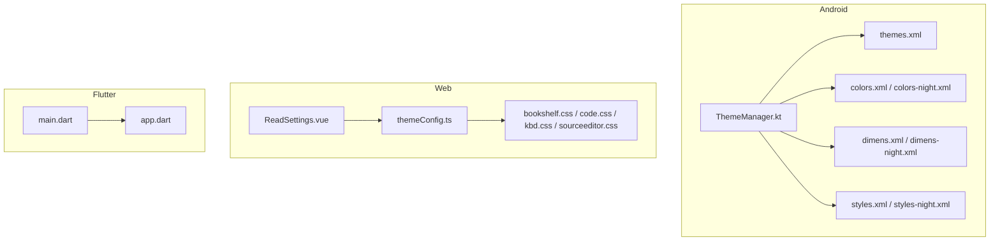
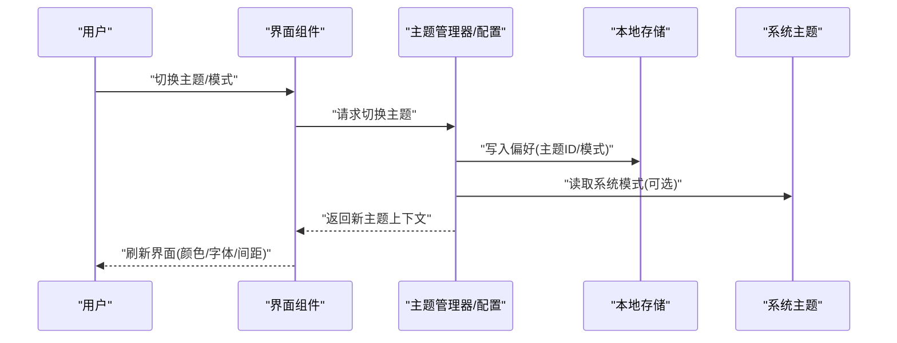
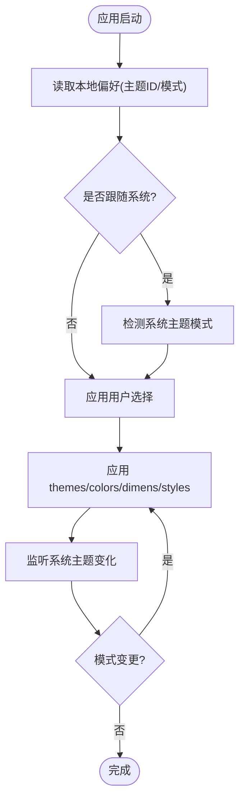
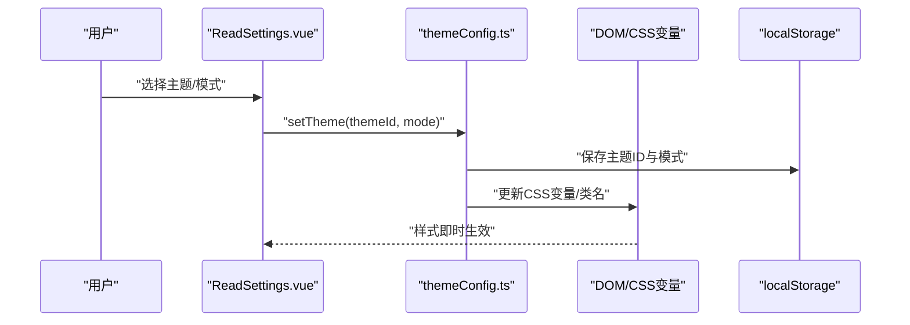
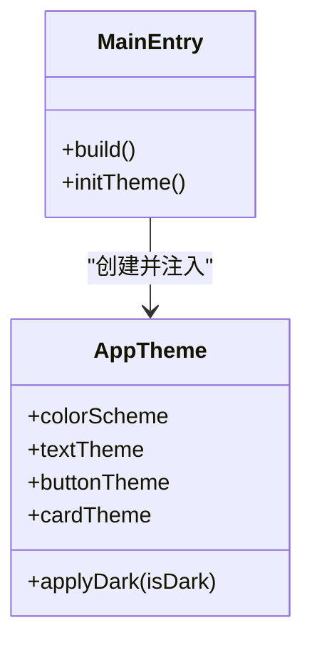
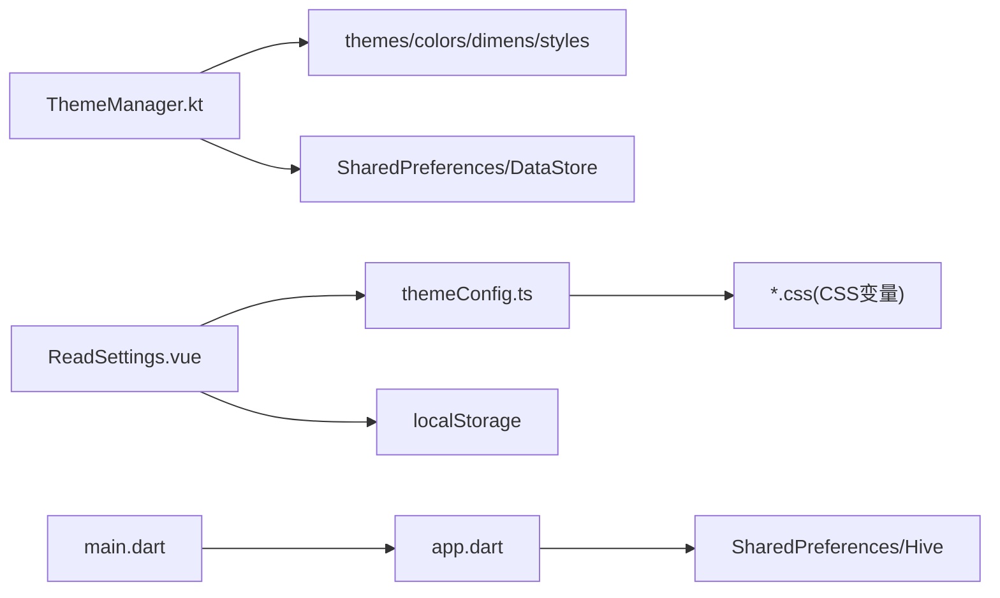

# 主题系统

<cite>
**本文引用的文件**   
- [app/src/main/java/io/legado/app/ui/theme/ThemeManager.kt](file://app/src/main/java/io/legado/app/ui/theme/ThemeManager.kt)
- [app/src/main/res/values/themes.xml](file://app/src/main/res/values/themes.xml)
- [app/src/main/res/values-night/themes.xml](file://app/src/main/res/values-night/themes.xml)
- [app/src/main/res/values/colors.xml](file://app/src/main/res/values/colors.xml)
- [app/src/main/res/values-night/colors.xml](file://app/src/main/res/values-night/colors.xml)
- [app/src/main/res/values/dimens.xml](file://app/src/main/res/values/dimens.xml)
- [app/src/main/res/values-night/dimens.xml](file://app/src/main/res/values-night/dimens.xml)
- [app/src/main/res/values/styles.xml](file://app/src/main/res/values/styles.xml)
- [app/src/main/res/values-night/styles.xml](file://app/src/main/res/values-night/styles.xml)
- [app/src/main/res/values/font_certs.xml](file://app/src/main/res/values/font_certs.xml)
- [modules/web/src/config/themeConfig.ts](file://modules/web/src/config/themeConfig.ts)
- [modules/web/src/assets/bookshelf.css](file://modules/web/src/assets/bookshelf.css)
- [modules/web/src/assets/code.css](file://modules/web/src/assets/code.css)
- [modules/web/src/assets/kbd.css](file://modules/web/src/assets/kbd.css)
- [modules/web/src/assets/sourceeditor.css](file://modules/web/src/assets/sourceeditor.css)
- [modules/web/src/components/ReadSettings.vue](file://modules/web/src/components/ReadSettings.vue)
- [flutter_legado/lib/app.dart](file://flutter_legado/lib/app.dart)
- [flutter_legado/lib/src/main.dart](file://flutter_legado/lib/src/main.dart)
</cite>

## 目录
1. [简介](#简介)
2. [项目结构](#项目结构)
3. [核心组件](#核心组件)
4. [架构总览](#架构总览)
5. [详细组件分析](#详细组件分析)
6. [依赖分析](#依赖分析)
7. [性能考虑](#性能考虑)
8. [故障排查指南](#故障排查指南)
9. [结论](#结论)
10. [附录](#附录)

## 简介
本文件系统性梳理 Legado 的主题系统，覆盖 Android、Web 与 Flutter 三端的主题配置管理、动态切换、本地持久化、CSS 变量统一、暗色/亮色模式实现原理（媒体查询、类名切换、渐变效果）、自定义主题创建方法与最佳实践。文档面向开发者与主题作者，提供从数据结构到运行流程的完整说明，并给出可操作的示例路径与排障建议。

## 项目结构
Legado 的主题体系由三部分构成：
- Android 端：基于资源目录 values/themes.xml、values/colors.xml、values/dimens.xml 等，配合夜间模式 values-night 目录与 ThemeManager 进行运行时切换与持久化。
- Web 端：通过 themeConfig.ts 集中定义主题变量与预设，CSS 文件使用 CSS 变量组织颜色、字体、间距；ReadSettings.vue 提供用户设置入口。
- Flutter 端：应用级主题在 app.dart 中声明，main.dart 负责初始化与平台适配。

图表来源
- [app/src/main/res/values/themes.xml](file://app/src/main/res/values/themes.xml)
- [app/src/main/res/values/colors.xml](file://app/src/main/res/values/colors.xml)
- [app/src/main/res/values-night/colors.xml](file://app/src/main/res/values-night/colors.xml)
- [app/src/main/res/values/dimens.xml](file://app/src/main/res/values/dimens.xml)
- [app/src/main/res/values-night/dimens.xml](file://app/src/main/res/values-night/dimens.xml)
- [app/src/main/res/values/styles.xml](file://app/src/main/res/values/styles.xml)
- [app/src/main/res/values-night/styles.xml](file://app/src/main/res/values-night/styles.xml)
- [app/src/main/java/io/legado/app/ui/theme/ThemeManager.kt](file://app/src/main/java/io/legado/app/ui/theme/ThemeManager.kt)
- [modules/web/src/config/themeConfig.ts](file://modules/web/src/config/themeConfig.ts)
- [modules/web/src/assets/bookshelf.css](file://modules/web/src/assets/bookshelf.css)
- [modules/web/src/assets/code.css](file://modules/web/src/assets/code.css)
- [modules/web/src/assets/kbd.css](file://modules/web/src/assets/kbd.css)
- [modules/web/src/assets/sourceeditor.css](file://modules/web/src/assets/sourceeditor.css)
- [modules/web/src/components/ReadSettings.vue](file://modules/web/src/components/ReadSettings.vue)
- [flutter_legado/lib/app.dart](file://flutter_legado/lib/app.dart)
- [flutter_legado/lib/src/main.dart](file://flutter_legado/lib/src/main.dart)

章节来源
- [app/src/main/res/values/themes.xml](file://app/src/main/res/values/themes.xml)
- [app/src/main/res/values-night/themes.xml](file://app/src/main/res/values-night/themes.xml)
- [app/src/main/java/io/legado/app/ui/theme/ThemeManager.kt](file://app/src/main/java/io/legado/app/ui/theme/ThemeManager.kt)
- [modules/web/src/config/themeConfig.ts](file://modules/web/src/config/themeConfig.ts)
- [flutter_legado/lib/app.dart](file://flutter_legado/lib/app.dart)

## 核心组件
- Android 主题管理器：负责加载主题资源、切换亮/暗模式、保存用户选择、监听系统主题变化。
- Web 主题配置：集中式主题变量与预设，CSS 变量驱动样式，组件层读取配置并渲染。
- Flutter 应用主题：应用级主题对象，结合平台特性与系统深色模式。

章节来源
- [app/src/main/java/io/legado/app/ui/theme/ThemeManager.kt](file://app/src/main/java/io/legado/app/ui/theme/ThemeManager.kt)
- [modules/web/src/config/themeConfig.ts](file://modules/web/src/config/themeConfig.ts)
- [flutter_legado/lib/app.dart](file://flutter_legado/lib/app.dart)

## 架构总览
主题系统在三个平台采用“配置集中 + 变量驱动”的统一思想：
- Android：以 resources 为边界，通过 themes.xml 组合 color、style、dimen，夜间模式通过 values-night 自动生效；ThemeManager 负责运行时切换与持久化。
- Web：themeConfig.ts 导出主题模型与预设，CSS 变量在根节点或模块内定义，组件按需消费；ReadSettings.vue 暴露用户设置入口。
- Flutter：app.dart 定义 ThemeData，main.dart 注入并处理系统主题同步。

图表来源
- [app/src/main/java/io/legado/app/ui/theme/ThemeManager.kt](file://app/src/main/java/io/legado/app/ui/theme/ThemeManager.kt)
- [modules/web/src/config/themeConfig.ts](file://modules/web/src/config/themeConfig.ts)
- [modules/web/src/components/ReadSettings.vue](file://modules/web/src/components/ReadSettings.vue)
- [flutter_legado/lib/app.dart](file://flutter_legado/lib/app.dart)

## 详细组件分析

### Android 主题系统
- 数据结构与资源组织
  - 主题定义：themes.xml 组合 AppCompat 主题、颜色、样式、窗口属性。
  - 颜色变量：colors.xml 与 colors-night.xml 分别定义亮/暗配色。
  - 间距变量：dimens.xml 与 dimens-night.xml 控制布局间距、字号、行高。
  - 样式变量：styles.xml 与 styles-night.xml 定义控件外观与行为。
  - 字体证书：font_certs.xml 用于安全加载自定义字体。
- 动态切换逻辑
  - ThemeManager 负责：
    - 读取用户偏好中的主题 ID 与模式（亮/暗/跟随系统）。
    - 根据系统 API 级别与设备能力应用主题。
    - 监听系统主题变化并同步应用。
    - 触发 Activity/Fragment 重建以刷新 UI。
- 本地存储持久化
  - 使用 SharedPreferences 或 DataStore 保存主题选择与模式开关。
  - 启动时优先恢复用户选择，其次回退到系统默认。
- 暗色/亮色模式实现
  - 通过 values-night 目录自动匹配系统夜间模式。
  - 支持类名切换（如 onNightModeChanged）以在非资源场景下动态更新。
  - 渐变与过渡：在 styles.xml 中定义过渡动画，避免闪烁。

图表来源
- [app/src/main/res/values/themes.xml](file://app/src/main/res/values/themes.xml)
- [app/src/main/res/values-night/themes.xml](file://app/src/main/res/values-night/themes.xml)
- [app/src/main/res/values/colors.xml](file://app/src/main/res/values/colors.xml)
- [app/src/main/res/values-night/colors.xml](file://app/src/main/res/values-night/colors.xml)
- [app/src/main/res/values/dimens.xml](file://app/src/main/res/values/dimens.xml)
- [app/src/main/res/values-night/dimens.xml](file://app/src/main/res/values-night/dimens.xml)
- [app/src/main/res/values/styles.xml](file://app/src/main/res/values/styles.xml)
- [app/src/main/res/values-night/styles.xml](file://app/src/main/res/values-night/styles.xml)
- [app/src/main/res/values/font_certs.xml](file://app/src/main/res/values/font_certs.xml)
- [app/src/main/java/io/legado/app/ui/theme/ThemeManager.kt](file://app/src/main/java/io/legado/app/ui/theme/ThemeManager.kt)

章节来源
- [app/src/main/res/values/themes.xml](file://app/src/main/res/values/themes.xml)
- [app/src/main/res/values-night/themes.xml](file://app/src/main/res/values-night/themes.xml)
- [app/src/main/res/values/colors.xml](file://app/src/main/res/values/colors.xml)
- [app/src/main/res/values-night/colors.xml](file://app/src/main/res/values-night/colors.xml)
- [app/src/main/res/values/dimens.xml](file://app/src/main/res/values/dimens.xml)
- [app/src/main/res/values-night/dimens.xml](file://app/src/main/res/values-night/dimens.xml)
- [app/src/main/res/values/styles.xml](file://app/src/main/res/values/styles.xml)
- [app/src/main/res/values-night/styles.xml](file://app/src/main/res/values-night/styles.xml)
- [app/src/main/res/values/font_certs.xml](file://app/src/main/res/values/font_certs.xml)
- [app/src/main/java/io/legado/app/ui/theme/ThemeManager.kt](file://app/src/main/java/io/legado/app/ui/theme/ThemeManager.kt)

### Web 主题系统
- 主题数据结构与配置
  - themeConfig.ts 定义主题模型（颜色、字体、间距、阴影、圆角等），并提供预设（如浅色、深色、高对比度）。
  - 通过导出函数/常量供组件与样式文件消费。
- CSS 变量统一管理
  - 在 CSS 文件中以 :root 或模块作用域定义变量，例如颜色变量、字体变量、间距变量。
  - 各模块（bookshelf.css、code.css、kbd.css、sourceeditor.css）仅引用变量，不重复定义。
- 动态切换逻辑
  - ReadSettings.vue 提供用户设置面板，修改主题后调用 themeConfig.ts 更新当前主题。
  - 通过 document.documentElement.dataset 或 CSS 变量赋值实现无刷新切换。
- 本地存储持久化
  - 将主题 ID 与模式写入 localStorage，页面初始化时读取并应用。
- 暗色/亮色模式实现
  - 媒体查询：@media (prefers-color-scheme: dark) 作为默认回退。
  - 类名切换：在根节点添加/移除 .dark 类，覆盖媒体查询结果。
  - 渐变效果：在 CSS 变量中定义渐变值，组件背景直接引用。

图表来源
- [modules/web/src/config/themeConfig.ts](file://modules/web/src/config/themeConfig.ts)
- [modules/web/src/assets/bookshelf.css](file://modules/web/src/assets/bookshelf.css)
- [modules/web/src/assets/code.css](file://modules/web/src/assets/code.css)
- [modules/web/src/assets/kbd.css](file://modules/web/src/assets/kbd.css)
- [modules/web/src/assets/sourceeditor.css](file://modules/web/src/assets/sourceeditor.css)
- [modules/web/src/components/ReadSettings.vue](file://modules/web/src/components/ReadSettings.vue)

章节来源
- [modules/web/src/config/themeConfig.ts](file://modules/web/src/config/themeConfig.ts)
- [modules/web/src/assets/bookshelf.css](file://modules/web/src/assets/bookshelf.css)
- [modules/web/src/assets/code.css](file://modules/web/src/assets/code.css)
- [modules/web/src/assets/kbd.css](file://modules/web/src/assets/kbd.css)
- [modules/web/src/assets/sourceeditor.css](file://modules/web/src/assets/sourceeditor.css)
- [modules/web/src/components/ReadSettings.vue](file://modules/web/src/components/ReadSettings.vue)

### Flutter 主题系统
- 应用级主题
  - app.dart 中定义 ThemeData，包含颜色、字体、按钮、卡片等主题项。
  - 支持系统深色模式与手动切换。
- 初始化与同步
  - main.dart 负责构建 MaterialApp，注入主题，并监听系统主题变化。
- 本地存储持久化
  - 使用 SharedPreferences 或 Hive 保存主题选择，启动时恢复。

图表来源
- [flutter_legado/lib/app.dart](file://flutter_legado/lib/app.dart)
- [flutter_legado/lib/src/main.dart](file://flutter_legado/lib/src/main.dart)

章节来源
- [flutter_legado/lib/app.dart](file://flutter_legado/lib/app.dart)
- [flutter_legado/lib/src/main.dart](file://flutter_legado/lib/src/main.dart)

## 依赖分析
- Android
  - ThemeManager 依赖 resources（themes/colors/dimens/styles）与本地存储。
  - 夜间模式依赖 values-night 资源目录与系统 API。
- Web
  - themeConfig.ts 被所有 CSS 与 Vue 组件消费。
  - ReadSettings.vue 依赖 themeConfig.ts 与 localStorage。
- Flutter
  - app.dart 被 main.dart 构建，依赖系统主题与本地存储。

图表来源
- [app/src/main/java/io/legado/app/ui/theme/ThemeManager.kt](file://app/src/main/java/io/legado/app/ui/theme/ThemeManager.kt)
- [app/src/main/res/values/themes.xml](file://app/src/main/res/values/themes.xml)
- [app/src/main/res/values/colors.xml](file://app/src/main/res/values/colors.xml)
- [app/src/main/res/values/dimens.xml](file://app/src/main/res/values/dimens.xml)
- [app/src/main/res/values/styles.xml](file://app/src/main/res/values/styles.xml)
- [modules/web/src/config/themeConfig.ts](file://modules/web/src/config/themeConfig.ts)
- [modules/web/src/assets/bookshelf.css](file://modules/web/src/assets/bookshelf.css)
- [modules/web/src/components/ReadSettings.vue](file://modules/web/src/components/ReadSettings.vue)
- [flutter_legado/lib/app.dart](file://flutter_legado/lib/app.dart)
- [flutter_legado/lib/src/main.dart](file://flutter_legado/lib/src/main.dart)

章节来源
- [app/src/main/java/io/legado/app/ui/theme/ThemeManager.kt](file://app/src/main/java/io/legado/app/ui/theme/ThemeManager.kt)
- [modules/web/src/config/themeConfig.ts](file://modules/web/src/config/themeConfig.ts)
- [flutter_legado/lib/app.dart](file://flutter_legado/lib/app.dart)

## 性能考虑
- Android
  - 避免频繁重建 Activity/Fragment，合并主题切换操作。
  - 使用 AppCompat 主题与资源复用，减少内存占用。
  - 夜间模式切换时禁用复杂动画，降低卡顿。
- Web
  - 使用 CSS 变量而非 JS 计算样式，减少重排重绘。
  - 将主题变量集中在 :root，避免重复定义。
  - 懒加载非关键样式，首屏只加载必要主题。
- Flutter
  - 使用 ThemeData 的不可变对象，避免重复构建。
  - 仅在必要时重建 MaterialApp，避免全局 rebuild。

[本节为通用指导，无需特定文件来源]

## 故障排查指南
- Android
  - 症状：切换主题无效或闪屏
    - 检查 values-night 资源是否存在对应项
    - 确认 ThemeManager 是否正确监听系统主题变化
    - 验证 SharedPreferences/DataStore 读写权限与键名一致性
- Web
  - 症状：切换后样式未更新
    - 检查 CSS 变量是否在 :root 正确定义
    - 确认 ReadSettings.vue 是否正确更新 document.documentElement.dataset
    - 查看浏览器控制台是否有 CSS 解析错误
- Flutter
  - 症状：深色模式不生效
    - 检查 app.dart 中 ThemeData 的 brightness 设置
    - 确认 main.dart 是否正确注入主题并监听系统变化

章节来源
- [app/src/main/java/io/legado/app/ui/theme/ThemeManager.kt](file://app/src/main/java/io/legado/app/ui/theme/ThemeManager.kt)
- [modules/web/src/config/themeConfig.ts](file://modules/web/src/config/themeConfig.ts)
- [modules/web/src/components/ReadSettings.vue](file://modules/web/src/components/ReadSettings.vue)
- [flutter_legado/lib/app.dart](file://flutter_legado/lib/app.dart)
- [flutter_legado/lib/src/main.dart](file://flutter_legado/lib/src/main.dart)

## 结论
Legado 的主题系统在三端实现了统一的“配置集中 + 变量驱动”架构：Android 以资源为核心，Web 以 CSS 变量为核心，Flutter 以 ThemeData 为核心。通过 ThemeManager、themeConfig.ts 与应用级主题对象，配合本地存储与系统主题监听，实现了稳定、可扩展且高性能的主题切换体验。遵循本文档的最佳实践，可快速创建与维护自定义主题。

[本节为总结性内容，无需特定文件来源]

## 附录

### 自定义主题创建方法
- Android
  - 新建 values 目录下的主题与颜色资源，或在现有基础上扩展。
  - 如需夜间模式，复制对应资源至 values-night 目录并调整颜色。
  - 在 ThemeManager 中添加新主题 ID 与切换逻辑。
- Web
  - 在 themeConfig.ts 中新增主题对象，定义颜色、字体、间距等变量。
  - 在 CSS 文件中引用新变量，确保覆盖范围与作用域正确。
  - 在 ReadSettings.vue 中添加主题选项并绑定切换逻辑。
- Flutter
  - 在 app.dart 中新增 ThemeData 实例，定义颜色与文本样式。
  - 在 main.dart 中提供主题切换入口并持久化选择。

章节来源
- [app/src/main/res/values/themes.xml](file://app/src/main/res/values/themes.xml)
- [app/src/main/res/values/colors.xml](file://app/src/main/res/values/colors.xml)
- [app/src/main/res/values-night/colors.xml](file://app/src/main/res/values-night/colors.xml)
- [app/src/main/java/io/legado/app/ui/theme/ThemeManager.kt](file://app/src/main/java/io/legado/app/ui/theme/ThemeManager.kt)
- [modules/web/src/config/themeConfig.ts](file://modules/web/src/config/themeConfig.ts)
- [modules/web/src/assets/bookshelf.css](file://modules/web/src/assets/bookshelf.css)
- [modules/web/src/components/ReadSettings.vue](file://modules/web/src/components/ReadSettings.vue)
- [flutter_legado/lib/app.dart](file://flutter_legado/lib/app.dart)
- [flutter_legado/lib/src/main.dart](file://flutter_legado/lib/src/main.dart)

### 主题开发最佳实践
- 兼容性
  - Android：确保 API 级别兼容，使用 AppCompat 主题。
  - Web：提供 prefers-color-scheme 回退，避免旧浏览器异常。
  - Flutter：使用稳定的 ThemeData API，避免破坏性变更。
- 性能优化
  - 减少不必要的重建与重绘，合并状态更新。
  - 使用资源与变量复用，避免重复定义。
- 用户体验设计
  - 提供足够的对比度与可读性，遵循无障碍标准。
  - 切换过程平滑，避免闪烁与卡顿。
  - 允许用户自定义基础变量（如字号、行距）。

[本节为通用指导，无需特定文件来源]

### 具体主题配置示例与开发指南
- Android 示例路径
  - 主题定义：[app/src/main/res/values/themes.xml](file://app/src/main/res/values/themes.xml)
  - 颜色变量：[app/src/main/res/values/colors.xml](file://app/src/main/res/values/colors.xml)、[app/src/main/res/values-night/colors.xml](file://app/src/main/res/values-night/colors.xml)
  - 间距变量：[app/src/main/res/values/dimens.xml](file://app/src/main/res/values/dimens.xml)、[app/src/main/res/values-night/dimens.xml](file://app/src/main/res/values-night/dimens.xml)
  - 样式变量：[app/src/main/res/values/styles.xml](file://app/src/main/res/values/styles.xml)、[app/src/main/res/values-night/styles.xml](file://app/src/main/res/values-night/styles.xml)
  - 字体证书：[app/src/main/res/values/font_certs.xml](file://app/src/main/res/values/font_certs.xml)
- Web 示例路径
  - 主题配置：[modules/web/src/config/themeConfig.ts](file://modules/web/src/config/themeConfig.ts)
  - 样式变量：[modules/web/src/assets/bookshelf.css](file://modules/web/src/assets/bookshelf.css)、[modules/web/src/assets/code.css](file://modules/web/src/assets/code.css)、[modules/web/src/assets/kbd.css](file://modules/web/src/assets/kbd.css)、[modules/web/src/assets/sourceeditor.css](file://modules/web/src/assets/sourceeditor.css)
  - 设置入口：[modules/web/src/components/ReadSettings.vue](file://modules/web/src/components/ReadSettings.vue)
- Flutter 示例路径
  - 应用主题：[flutter_legado/lib/app.dart](file://flutter_legado/lib/app.dart)
  - 初始化入口：[flutter_legado/lib/src/main.dart](file://flutter_legado/lib/src/main.dart)

章节来源
- [app/src/main/res/values/themes.xml](file://app/src/main/res/values/themes.xml)
- [app/src/main/res/values/colors.xml](file://app/src/main/res/values/colors.xml)
- [app/src/main/res/values-night/colors.xml](file://app/src/main/res/values-night/colors.xml)
- [app/src/main/res/values/dimens.xml](file://app/src/main/res/values/dimens.xml)
- [app/src/main/res/values-night/dimens.xml](file://app/src/main/res/values-night/dimens.xml)
- [app/src/main/res/values/styles.xml](file://app/src/main/res/values/styles.xml)
- [app/src/main/res/values-night/styles.xml](file://app/src/main/res/values-night/styles.xml)
- [app/src/main/res/values/font_certs.xml](file://app/src/main/res/values/font_certs.xml)
- [modules/web/src/config/themeConfig.ts](file://modules/web/src/config/themeConfig.ts)
- [modules/web/src/assets/bookshelf.css](file://modules/web/src/assets/bookshelf.css)
- [modules/web/src/assets/code.css](file://modules/web/src/assets/code.css)
- [modules/web/src/assets/kbd.css](file://modules/web/src/assets/kbd.css)
- [modules/web/src/assets/sourceeditor.css](file://modules/web/src/assets/sourceeditor.css)
- [modules/web/src/components/ReadSettings.vue](file://modules/web/src/components/ReadSettings.vue)
- [flutter_legado/lib/app.dart](file://flutter_legado/lib/app.dart)
- [flutter_legado/lib/src/main.dart](file://flutter_legado/lib/src/main.dart)