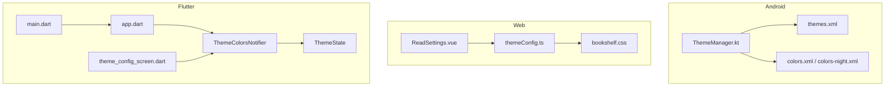
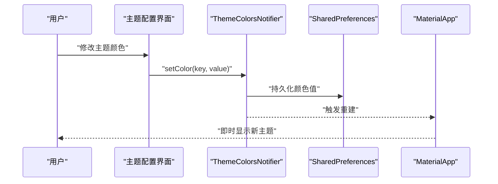
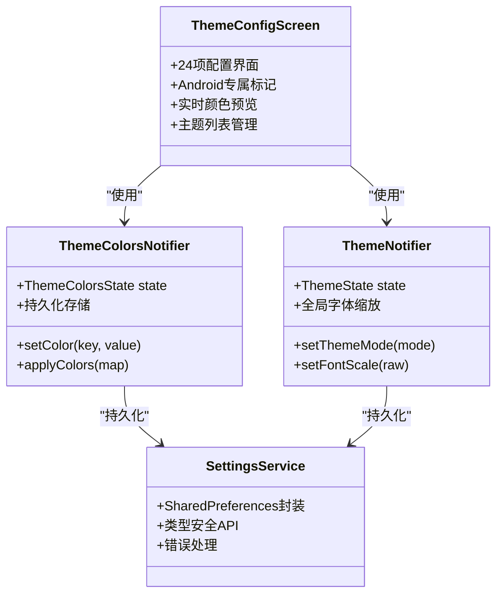
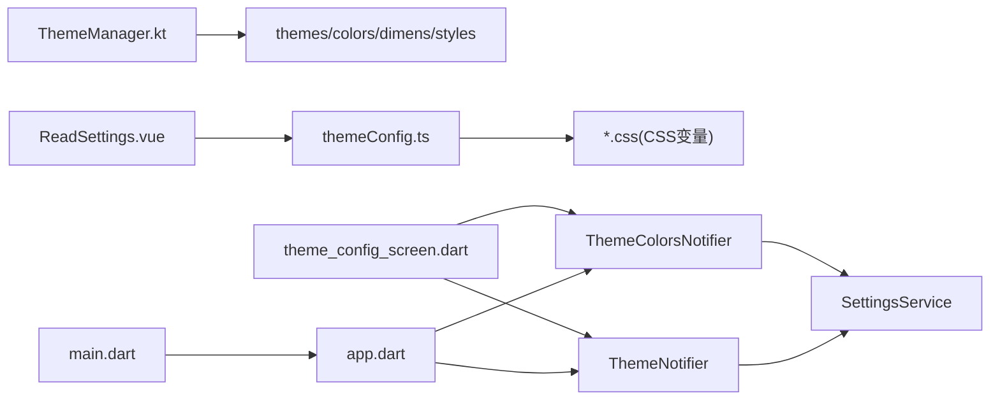

# 主题系统

<cite>
**本文引用的文件**   
- [flutter_legado/lib/src/screens/theme_config_screen.dart](file://flutter_legado/lib/src/screens/theme_config_screen.dart)
- [flutter_legado/lib/src/providers/theme/theme_colors_notifier.dart](file://flutter_legado/lib/src/providers/theme/theme_colors_notifier.dart)
- [flutter_legado/lib/src/providers/theme/theme_notifier.dart](file://flutter_legado/lib/src/providers/theme/theme_notifier.dart)
- [flutter_legado/lib/src/providers/theme/theme_state.dart](file://flutter_legado/lib/src/providers/theme/theme_state.dart)
- [flutter_legado/lib/src/constants/pref_keys.dart](file://flutter_legado/lib/src/constants/pref_keys.dart)
- [flutter_legado/lib/src/services/settings_service.dart](file://flutter_legado/lib/src/services/settings_service.dart)
- [flutter_legado/lib/app.dart](file://flutter_legado/lib/app.dart)
- [flutter_legado/lib/main.dart](file://flutter_legado/lib/main.dart)
- [app/src/main/java/io/legado/app/ui/theme/ThemeManager.kt](file://app/src/main/java/io/legado/app/ui/theme/ThemeManager.kt)
- [app/src/main/res/values/themes.xml](file://app/src/main/res/values/themes.xml)
- [app/src/main/res/values/colors.xml](file://app/src/main/res/values/colors.xml)
- [app/src/main/res/values-night/colors.xml](file://app/src/main/res/values-night/colors.xml)
- [modules/web/src/config/themeConfig.ts](file://modules/web/src/config/themeConfig.ts)
- [modules/web/src/assets/bookshelf.css](file://modules/web/src/assets/bookshelf.css)
- [modules/web/src/components/ReadSettings.vue](file://modules/web/src/components/ReadSettings.vue)
</cite>

## 更新摘要
**所做更改**   
- 新增完整的主题配置界面（theme_config_screen.dart），支持24项配置项
- 实现ThemeColorsNotifier状态管理，提供实时主题颜色切换功能
- 新增启动图标、欢迎页样式、沉浸式状态栏/导航栏、导航栏阴影等Android专属配置
- 增强主题列表管理，支持保存和切换自定义主题配置
- 完善壁纸取色功能，支持自动更新机制
- 实现全局字体缩放功能，支持0.8x到1.6x的缩放范围

## 目录
1. [简介](#简介)
2. [项目结构](#项目结构)
3. [核心组件](#核心组件)
4. [架构总览](#架构总览)
5. [详细组件分析](#详细组件分析)
6. [依赖分析](#依赖分析)
7. [性能考虑](#性能考虑)
8. [故障排查指南](#故障排查指南)
9. [结论](#结论)
10. [附录](#附录)

## 简介
本文件系统性梳理 Legado 的主题系统，覆盖 Android、Web 与 Flutter 三端的主题配置管理、动态切换、本地持久化、CSS 变量统一、暗色/亮色模式实现原理（媒体查询、类名切换、渐变效果）、自定义主题创建方法与最佳实践。文档面向开发者与主题作者，提供从数据结构到运行流程的完整说明，并给出可操作的示例路径与排障建议。

**重大更新** 主题系统进行了重大重构，新增了完整的主题配置界面和ThemeColorsNotifier状态管理，实现了与Android原版的高度对齐。

## 项目结构
Legado 的主题体系由三部分构成：
- Android 端：基于资源目录 themes.xml、colors.xml、dimens.xml 等，配合夜间模式 values-night 目录与 ThemeManager 进行运行时切换与持久化。
- Web 端：通过 themeConfig.ts 集中定义主题变量与预设，CSS 文件使用 CSS 变量组织颜色、字体、间距；ReadSettings.vue 提供用户设置入口。
- Flutter 端：应用级主题在 app.dart 中声明，main.dart 负责初始化与平台适配，新增完整的主题配置界面和状态管理。

**图表来源**
- [app/src/main/res/values/themes.xml](file://app/src/main/res/values/themes.xml)
- [app/src/main/res/values/colors.xml](file://app/src/main/res/values/colors.xml)
- [app/src/main/java/io/legado/app/ui/theme/ThemeManager.kt](file://app/src/main/java/io/legado/app/ui/theme/ThemeManager.kt)
- [modules/web/src/config/themeConfig.ts](file://modules/web/src/config/themeConfig.ts)
- [modules/web/src/assets/bookshelf.css](file://modules/web/src/assets/bookshelf.css)
- [modules/web/src/components/ReadSettings.vue](file://modules/web/src/components/ReadSettings.vue)
- [flutter_legado/lib/app.dart](file://flutter_legado/lib/app.dart)
- [flutter_legado/lib/main.dart](file://flutter_legado/lib/main.dart)
- [flutter_legado/lib/src/screens/theme_config_screen.dart](file://flutter_legado/lib/src/screens/theme_config_screen.dart)
- [flutter_legado/lib/src/providers/theme/theme_colors_notifier.dart](file://flutter_legado/lib/src/providers/theme/theme_colors_notifier.dart)
- [flutter_legado/lib/src/providers/theme/theme_state.dart](file://flutter_legado/lib/src/providers/theme/theme_state.dart)

## 核心组件
- Android 主题管理器：负责加载主题资源、切换亮/暗模式、保存用户选择、监听系统主题变化。
- Web 主题配置：集中式主题变量与预设，CSS 变量驱动样式，组件层读取配置并渲染。
- Flutter 应用主题：应用级主题对象，结合平台特性与系统深色模式。
- **新增** 主题配置界面：完整的24项配置界面，支持启动图标、欢迎页样式、沉浸式状态栏/导航栏、导航栏阴影、封面设置、主题列表、底栏皮肤、壁纸取色等功能。
- **新增** ThemeColorsNotifier：基于Riverpod的状态管理，管理日间/夜间自定义颜色，提供实时主题切换功能。
- **新增** ThemeNotifier：管理全局主题模式和字体缩放，支持实时UI更新。

**章节来源**
- [app/src/main/java/io/legado/app/ui/theme/ThemeManager.kt](file://app/src/main/java/io/legado/app/ui/theme/ThemeManager.kt)
- [modules/web/src/config/themeConfig.ts](file://modules/web/src/config/themeConfig.ts)
- [flutter_legado/lib/app.dart](file://flutter_legado/lib/app.dart)
- [flutter_legado/lib/src/screens/theme_config_screen.dart](file://flutter_legado/lib/src/screens/theme_config_screen.dart)
- [flutter_legado/lib/src/providers/theme/theme_colors_notifier.dart](file://flutter_legado/lib/src/providers/theme/theme_colors_notifier.dart)
- [flutter_legado/lib/src/providers/theme/theme_notifier.dart](file://flutter_legado/lib/src/providers/theme/theme_notifier.dart)

## 架构总览
主题系统在三个平台采用"配置集中 + 变量驱动"的统一思想：
- Android：以 resources 为边界，通过 themes.xml 组合 color、style、dimen，夜间模式通过 values-night 自动生效；ThemeManager 负责运行时切换与持久化。
- Web：themeConfig.ts 导出主题模型与预设，CSS 变量在根节点或模块内定义，组件按需消费；ReadSettings.vue 暴露用户设置入口。
- Flutter：app.dart 定义 ThemeData，main.dart 注入并处理系统主题同步，新增完整的主题配置界面和Riverpod状态管理。

**图表来源**
- [flutter_legado/lib/src/screens/theme_config_screen.dart](file://flutter_legado/lib/src/screens/theme_config_screen.dart)
- [flutter_legado/lib/src/providers/theme/theme_colors_notifier.dart](file://flutter_legado/lib/src/providers/theme/theme_colors_notifier.dart)
- [flutter_legado/lib/app.dart](file://flutter_legado/lib/app.dart)

## 详细组件分析

### Android 主题系统
- 数据结构与资源组织
  - 主题定义：themes.xml 组合 AppCompat 主题、颜色、样式、窗口属性。
  - 颜色变量：colors.xml 与 colors-night.xml 分别定义亮/暗配色。
  - 间距变量：dimens.xml 与 dimens-night.xml 控制布局间距、字号、行高。
  - 样式变量：styles.xml 与 styles-night.xml 定义控件外观与行为。
- 动态切换逻辑
  - ThemeManager 负责：
    - 读取用户偏好中的主题 ID 与模式（亮/暗/跟随系统）。
    - 根据系统 API 级别与设备能力应用主题。
    - 监听系统主题变化并同步应用。
    - 触发 Activity/Fragment 重建以刷新 UI。
- 本地存储持久化
  - 使用 SharedPreferences 或 DataStore 保存主题选择与模式开关。
  - 启动时优先恢复用户选择，其次回退到系统默认。

**章节来源**
- [app/src/main/res/values/themes.xml](file://app/src/main/res/values/themes.xml)
- [app/src/main/res/values/colors.xml](file://app/src/main/res/values/colors.xml)
- [app/src/main/res/values-night/colors.xml](file://app/src/main/res/values-night/colors.xml)
- [app/src/main/java/io/legado/app/ui/theme/ThemeManager.kt](file://app/src/main/java/io/legado/app/ui/theme/ThemeManager.kt)

### Web 主题系统
- 主题数据结构与配置
  - themeConfig.ts 定义主题模型（颜色、字体、间距、阴影、圆角等），并提供预设（如浅色、深色、高对比度）。
  - 通过导出函数/常量供组件与样式文件消费。
- CSS 变量统一管理
  - 在 CSS 文件中以 :root 或模块作用域定义变量，例如颜色变量、字体变量、间距变量。
  - 各模块仅引用变量，不重复定义。
- 动态切换逻辑
  - ReadSettings.vue 提供用户设置面板，修改主题后调用 themeConfig.ts 更新当前主题。
  - 通过 document.documentElement.dataset 或 CSS 变量赋值实现无刷新切换。

**章节来源**
- [modules/web/src/config/themeConfig.ts](file://modules/web/src/config/themeConfig.ts)
- [modules/web/src/assets/bookshelf.css](file://modules/web/src/assets/bookshelf.css)
- [modules/web/src/components/ReadSettings.vue](file://modules/web/src/components/ReadSettings.vue)

### Flutter 主题系统
- 应用级主题
  - app.dart 中定义 ThemeData，包含颜色、字体、按钮、卡片等主题项。
  - 支持系统深色模式与手动切换。
- 初始化与同步
  - main.dart 负责构建 MaterialApp，注入主题，并监听系统主题变化。
- **重大更新** 完整的主题配置界面
  - 支持24项配置：启动图标、欢迎页样式、沉浸式状态栏/导航栏、导航栏阴影、封面设置、主题列表、底栏皮肤、壁纸取色等
  - 分组清晰：通用设置、白天主题、夜间主题三大区域
  - Android专属标记：所有Android专属配置项都有明确标注
  - 实时预览：颜色选择器支持预设色板和明暗校验
- **重大更新** ThemeColorsNotifier状态管理
  - 管理日间/夜间自定义颜色（主色调、强调色、背景色、底部操作栏颜色）
  - 支持批量应用主题配置
  - 与MaterialApp集成，实现即时生效
  - 持久化存储到SharedPreferences
- **重大更新** ThemeNotifier全局状态管理
  - 管理全局主题模式（亮/暗/跟随系统）
  - 管理全局字体缩放（0.8x到1.6x范围）
  - 基于Riverpod实现响应式更新

**图表来源**
- [flutter_legado/lib/src/screens/theme_config_screen.dart](file://flutter_legado/lib/src/screens/theme_config_screen.dart)
- [flutter_legado/lib/src/providers/theme/theme_colors_notifier.dart](file://flutter_legado/lib/src/providers/theme/theme_colors_notifier.dart)
- [flutter_legado/lib/src/providers/theme/theme_notifier.dart](file://flutter_legado/lib/src/providers/theme/theme_notifier.dart)
- [flutter_legado/lib/src/services/settings_service.dart](file://flutter_legado/lib/src/services/settings_service.dart)

**章节来源**
- [flutter_legado/lib/app.dart](file://flutter_legado/lib/app.dart)
- [flutter_legado/lib/main.dart](file://flutter_legado/lib/main.dart)
- [flutter_legado/lib/src/screens/theme_config_screen.dart](file://flutter_legado/lib/src/screens/theme_config_screen.dart)
- [flutter_legado/lib/src/providers/theme/theme_colors_notifier.dart](file://flutter_legado/lib/src/providers/theme/theme_colors_notifier.dart)
- [flutter_legado/lib/src/providers/theme/theme_notifier.dart](file://flutter_legado/lib/src/providers/theme/theme_notifier.dart)

## 依赖分析
- Android
  - ThemeManager 依赖 resources（themes/colors/dimens/styles）与本地存储。
  - 夜间模式依赖 values-night 资源目录与系统 API。
- Web
  - themeConfig.ts 被所有 CSS 与 Vue 组件消费。
  - ReadSettings.vue 依赖 themeConfig.ts 与 localStorage。
- Flutter
  - app.dart 被 main.dart 构建，依赖系统主题与本地存储。
  - **新增** 主题配置界面依赖 ThemeColorsNotifier 和 ThemeNotifier。
  - **新增** ThemeColorsNotifier 依赖 SettingsService 进行数据持久化。
  - **新增** ThemeNotifier 依赖 SettingsService 进行主题模式和字体缩放持久化。

**图表来源**
- [app/src/main/java/io/legado/app/ui/theme/ThemeManager.kt](file://app/src/main/java/io/legado/app/ui/theme/ThemeManager.kt)
- [modules/web/src/config/themeConfig.ts](file://modules/web/src/config/themeConfig.ts)
- [modules/web/src/components/ReadSettings.vue](file://modules/web/src/components/ReadSettings.vue)
- [flutter_legado/lib/app.dart](file://flutter_legado/lib/app.dart)
- [flutter_legado/lib/main.dart](file://flutter_legado/lib/main.dart)
- [flutter_legado/lib/src/screens/theme_config_screen.dart](file://flutter_legado/lib/src/screens/theme_config_screen.dart)
- [flutter_legado/lib/src/providers/theme/theme_colors_notifier.dart](file://flutter_legado/lib/src/providers/theme/theme_colors_notifier.dart)
- [flutter_legado/lib/src/providers/theme/theme_notifier.dart](file://flutter_legado/lib/src/providers/theme/theme_notifier.dart)
- [flutter_legado/lib/src/services/settings_service.dart](file://flutter_legado/lib/src/services/settings_service.dart)

## 性能考虑
- Android
  - 避免频繁重建 Activity/Fragment，合并主题切换操作。
  - 使用 AppCompat 主题与资源复用，减少内存占用。
  - 夜间模式切换时禁用复杂动画，降低卡顿。
- Web
  - 使用 CSS 变量而非 JS 计算样式，减少重排重绘。
  - 将主题变量集中在 :root，避免重复定义。
  - 懒加载非关键样式，首屏只加载必要主题。
- Flutter
  - 使用 ThemeData 的不可变对象，避免重复构建。
  - 仅在必要时重建 MaterialApp，避免全局 rebuild。
  - **新增** ThemeColorsNotifier 使用 Riverpod Notifier 实现高效的响应式更新。
  - **新增** 主题配置界面使用 ConsumerWidget，精确订阅所需状态。
  - **新增** 批量颜色应用优化，减少SharedPreferences写入次数。

## 故障排查指南
- Android
  - 症状：切换主题无效或闪屏
    - 检查 values-night 资源是否存在对应项
    - 确认 ThemeManager 是否正确监听系统主题变化
    - 验证 SharedPreferences/DataStore 读写权限与键名一致性
- Web
  - 症状：切换后样式未更新
    - 检查 CSS 变量是否在 :root 正确定义
    - 确认 ReadSettings.vue 是否正确更新 document.documentElement.dataset
    - 查看浏览器控制台是否有 CSS 解析错误
- Flutter
  - 症状：深色模式不生效
    - 检查 app.dart 中 ThemeData 的 brightness 设置
    - 确认 main.dart 是否正确注入主题并监听系统变化
  - **新增** 症状：主题配置界面无法保存设置
    - 检查 SettingsService 的 SharedPreferences 初始化
    - 验证 PrefKeys 常量是否与Android原版一致
    - 确认权限配置是否允许本地存储
  - **新增** 症状：颜色切换不生效
    - 检查 ThemeColorsNotifier 的 setColor 方法是否正确调用
    - 确认 MaterialApp 的 theme 和 darkTheme 参数是否正确传递
    - 验证颜色值格式是否为有效的 ARGB 整数

**章节来源**
- [app/src/main/java/io/legado/app/ui/theme/ThemeManager.kt](file://app/src/main/java/io/legado/app/ui/theme/ThemeManager.kt)
- [modules/web/src/config/themeConfig.ts](file://modules/web/src/config/themeConfig.ts)
- [modules/web/src/components/ReadSettings.vue](file://modules/web/src/components/ReadSettings.vue)
- [flutter_legado/lib/app.dart](file://flutter_legado/lib/app.dart)
- [flutter_legado/lib/main.dart](file://flutter_legado/lib/main.dart)
- [flutter_legado/lib/src/screens/theme_config_screen.dart](file://flutter_legado/lib/src/screens/theme_config_screen.dart)
- [flutter_legado/lib/src/providers/theme/theme_colors_notifier.dart](file://flutter_legado/lib/src/providers/theme/theme_colors_notifier.dart)
- [flutter_legado/lib/src/providers/theme/theme_notifier.dart](file://flutter_legado/lib/src/providers/theme/theme_notifier.dart)
- [flutter_legado/lib/src/services/settings_service.dart](file://flutter_legado/lib/src/services/settings_service.dart)

## 结论
Legado 的主题系统在三端实现了统一的"配置集中 + 变量驱动"架构：Android 以资源为核心，Web 以 CSS 变量为核心，Flutter 以 ThemeData 为核心。**重大更新** 新增的完整主题配置界面和ThemeColorsNotifier状态管理，实现了与Android原版功能的高度对齐。通过ThemeConfigScreen、ThemeColorsNotifier、ThemeNotifier与应用级主题对象，配合本地存储与系统主题监听，实现了稳定、可扩展且高性能的主题切换体验。遵循本文档的最佳实践，可快速创建与维护自定义主题。

## 附录

### 自定义主题创建方法
- Android
  - 新建 values 目录下的主题与颜色资源，或在现有基础上扩展。
  - 如需夜间模式，复制对应资源至 values-night 目录并调整颜色。
  - 在 ThemeManager 中添加新主题 ID 与切换逻辑。
- Web
  - 在 themeConfig.ts 中新增主题对象，定义颜色、字体、间距等变量。
  - 在 CSS 文件中引用新变量，确保覆盖范围与作用域正确。
  - 在 ReadSettings.vue 中添加主题选项并绑定切换逻辑。
- Flutter
  - 在 app.dart 中新增 ThemeData 实例，定义颜色与文本样式。
  - **新增** 使用主题配置界面进行可视化主题编辑
  - **新增** 通过ThemeColorsNotifier管理自定义颜色
  - **新增** 支持主题列表保存和切换功能

**章节来源**
- [app/src/main/res/values/themes.xml](file://app/src/main/res/values/themes.xml)
- [app/src/main/res/values/colors.xml](file://app/src/main/res/values/colors.xml)
- [app/src/main/res/values-night/colors.xml](file://app/src/main/res/values-night/colors.xml)
- [app/src/main/java/io/legado/app/ui/theme/ThemeManager.kt](file://app/src/main/java/io/legado/app/ui/theme/ThemeManager.kt)
- [modules/web/src/config/themeConfig.ts](file://modules/web/src/config/themeConfig.ts)
- [modules/web/src/assets/bookshelf.css](file://modules/web/src/assets/bookshelf.css)
- [modules/web/src/components/ReadSettings.vue](file://modules/web/src/components/ReadSettings.vue)
- [flutter_legado/lib/app.dart](file://flutter_legado/lib/app.dart)
- [flutter_legado/lib/main.dart](file://flutter_legado/lib/main.dart)
- [flutter_legado/lib/src/screens/theme_config_screen.dart](file://flutter_legado/lib/src/screens/theme_config_screen.dart)

### 主题开发最佳实践
- 兼容性
  - Android：确保 API 级别兼容，使用 AppCompat 主题。
  - Web：提供 prefers-color-scheme 回退，避免旧浏览器异常。
  - Flutter：使用稳定的 ThemeData API，避免破坏性变更。
- 性能优化
  - 减少不必要的重建与重绘，合并状态更新。
  - 使用资源与变量复用，避免重复定义。
  - **新增** Flutter中使用Riverpod Provider模式避免不必要的Widget重建。
  - **新增** 批量颜色应用优化，减少SharedPreferences写入次数。
- 用户体验设计
  - 提供足够的对比度与可读性，遵循无障碍标准。
  - 切换过程平滑，避免闪烁与卡顿。
  - 允许用户自定义基础变量（如字号、行距）。
  - **新增** 支持全局字体缩放，提升可访问性。
  - **新增** Android专属功能明确标注，避免跨平台混淆。

### 具体主题配置示例与开发指南
- Android 示例路径
  - 主题定义：[app/src/main/res/values/themes.xml](file://app/src/main/res/values/themes.xml)
  - 颜色变量：[app/src/main/res/values/colors.xml](file://app/src/main/res/values/colors.xml)、[app/src/main/res/values-night/colors.xml](file://app/src/main/res/values-night/colors.xml)
  - 主题管理器：[app/src/main/java/io/legado/app/ui/theme/ThemeManager.kt](file://app/src/main/java/io/legado/app/ui/theme/ThemeManager.kt)
- Web 示例路径
  - 主题配置：[modules/web/src/config/themeConfig.ts](file://modules/web/src/config/themeConfig.ts)
  - 样式变量：[modules/web/src/assets/bookshelf.css](file://modules/web/src/assets/bookshelf.css)
  - 设置入口：[modules/web/src/components/ReadSettings.vue](file://modules/web/src/components/ReadSettings.vue)
- Flutter 示例路径
  - 应用主题：[flutter_legado/lib/app.dart](file://flutter_legado/lib/app.dart)
  - 初始化入口：[flutter_legado/lib/main.dart](file://flutter_legado/lib/main.dart)
  - **新增** 主题配置界面：[flutter_legado/lib/src/screens/theme_config_screen.dart](file://flutter_legado/lib/src/screens/theme_config_screen.dart)
  - **新增** 颜色状态管理：[flutter_legado/lib/src/providers/theme/theme_colors_notifier.dart](file://flutter_legado/lib/src/providers/theme/theme_colors_notifier.dart)
  - **新增** 全局主题管理：[flutter_legado/lib/src/providers/theme/theme_notifier.dart](file://flutter_legado/lib/src/providers/theme/theme_notifier.dart)
  - **新增** 偏好键常量：[flutter_legado/lib/src/constants/pref_keys.dart](file://flutter_legado/lib/src/constants/pref_keys.dart)
  - **新增** 设置服务：[flutter_legado/lib/src/services/settings_service.dart](file://flutter_legado/lib/src/services/settings_service.dart)

**章节来源**
- [app/src/main/res/values/themes.xml](file://app/src/main/res/values/themes.xml)
- [app/src/main/res/values/colors.xml](file://app/src/main/res/values/colors.xml)
- [app/src/main/res/values-night/colors.xml](file://app/src/main/res/values-night/colors.xml)
- [app/src/main/java/io/legado/app/ui/theme/ThemeManager.kt](file://app/src/main/java/io/legado/app/ui/theme/ThemeManager.kt)
- [modules/web/src/config/themeConfig.ts](file://modules/web/src/config/themeConfig.ts)
- [modules/web/src/assets/bookshelf.css](file://modules/web/src/assets/bookshelf.css)
- [modules/web/src/components/ReadSettings.vue](file://modules/web/src/components/ReadSettings.vue)
- [flutter_legado/lib/app.dart](file://flutter_legado/lib/app.dart)
- [flutter_legado/lib/main.dart](file://flutter_legado/lib/main.dart)
- [flutter_legado/lib/src/screens/theme_config_screen.dart](file://flutter_legado/lib/src/screens/theme_config_screen.dart)
- [flutter_legado/lib/src/providers/theme/theme_colors_notifier.dart](file://flutter_legado/lib/src/providers/theme/theme_colors_notifier.dart)
- [flutter_legado/lib/src/providers/theme/theme_notifier.dart](file://flutter_legado/lib/src/providers/theme/theme_notifier.dart)
- [flutter_legado/lib/src/constants/pref_keys.dart](file://flutter_legado/lib/src/constants/pref_keys.dart)
- [flutter_legado/lib/src/services/settings_service.dart](file://flutter_legado/lib/src/services/settings_service.dart)