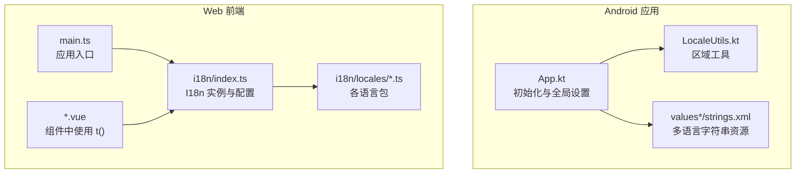
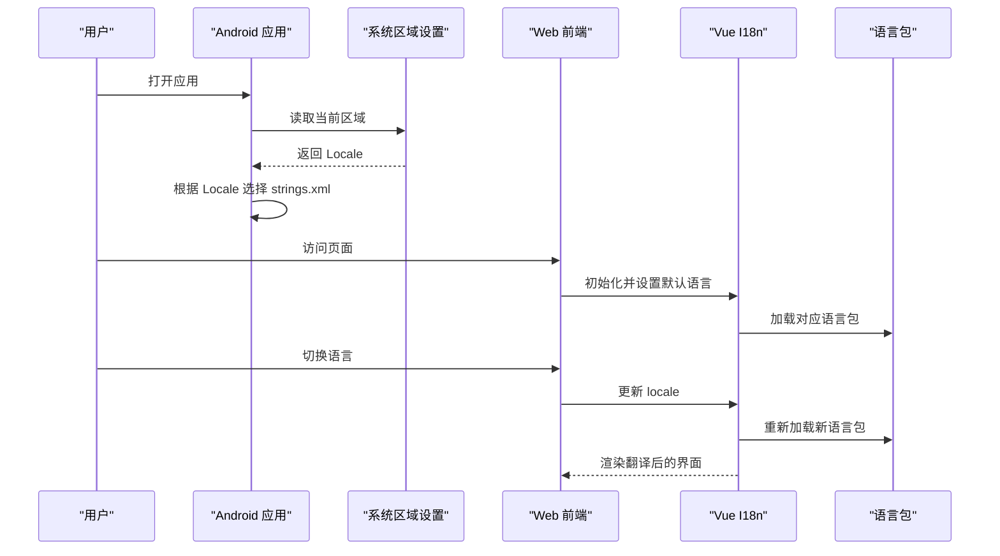
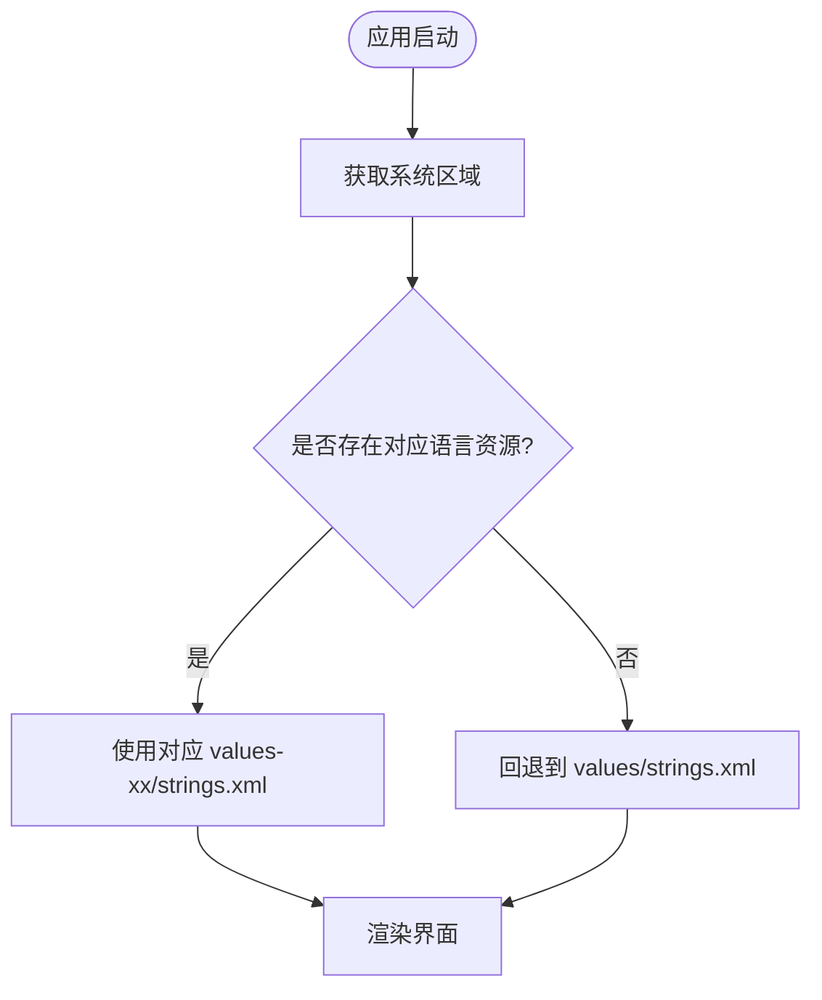
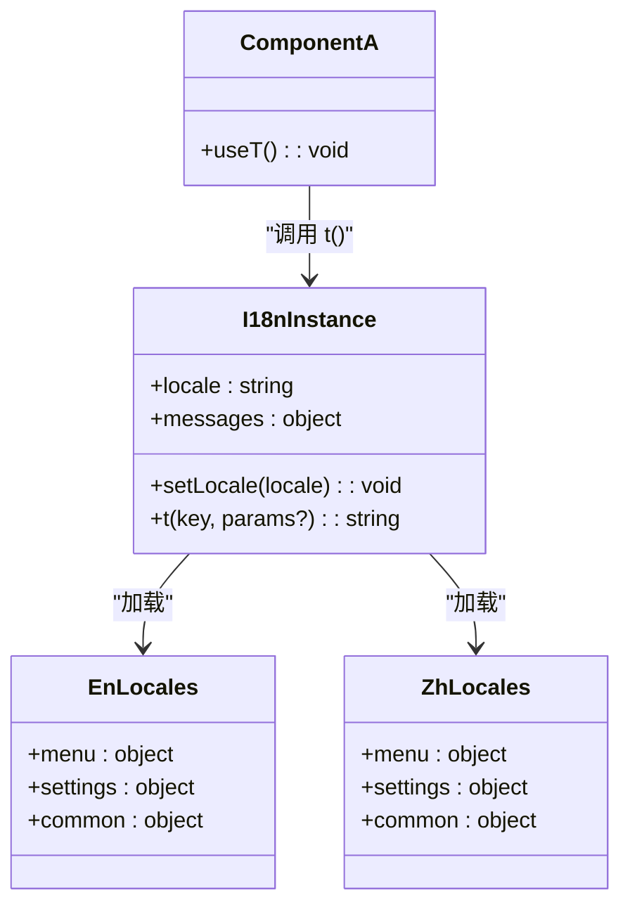
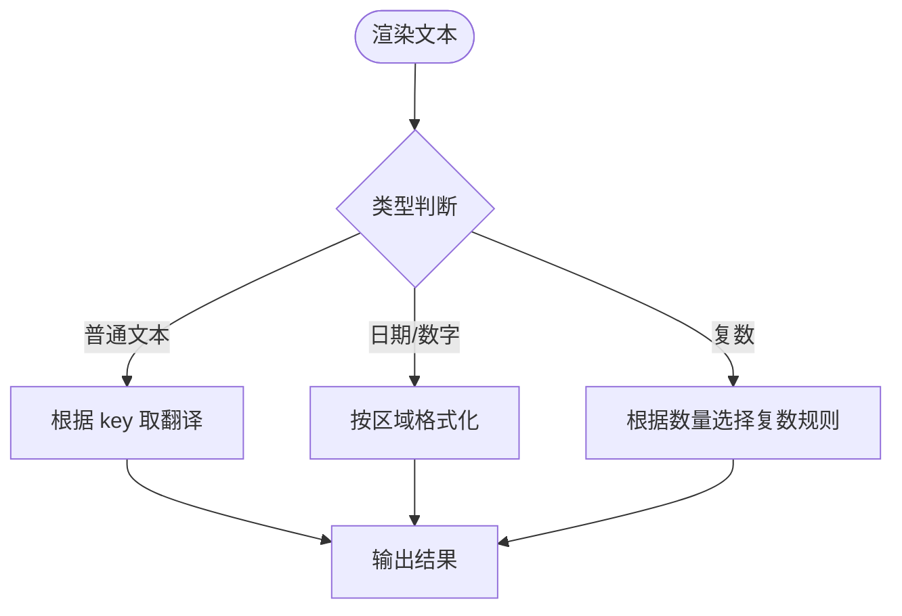
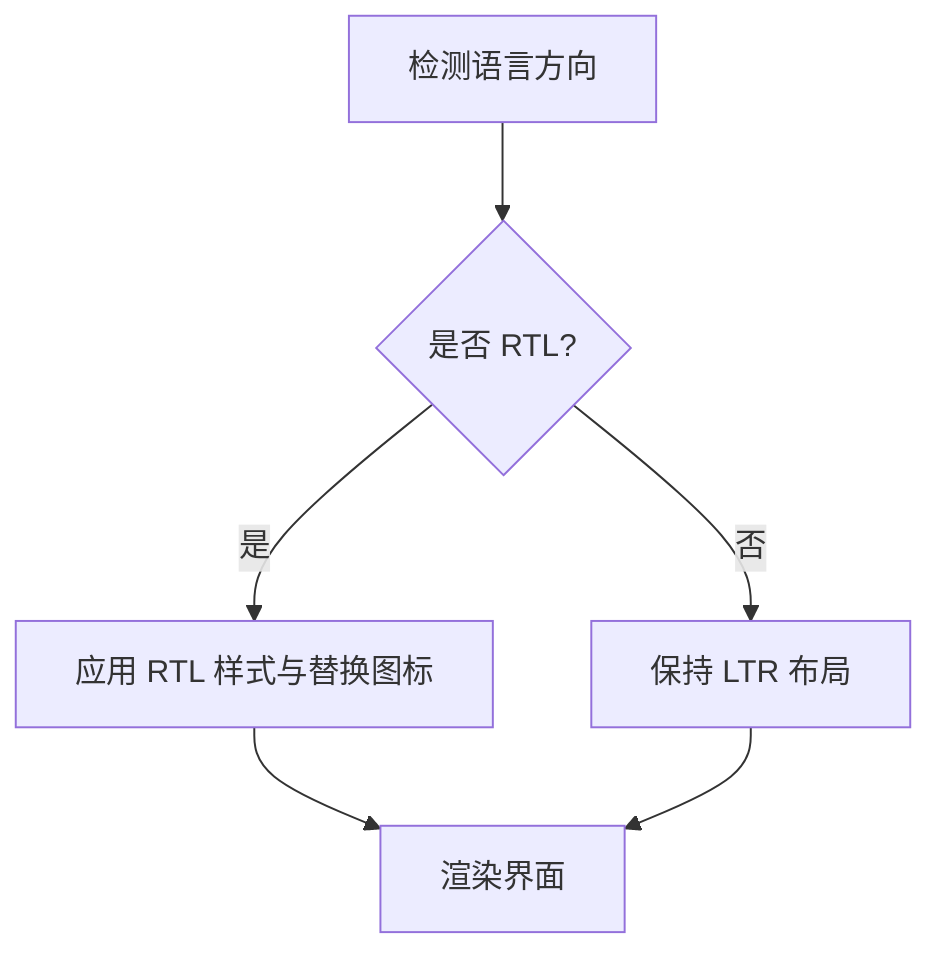
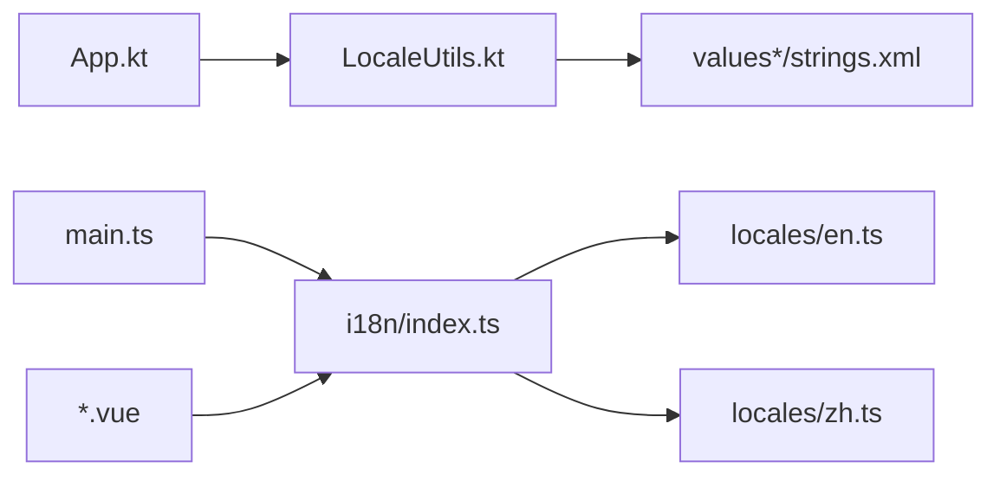

# 国际化支持

<cite>
**本文引用的文件**   
- [app/src/main/res/values/strings.xml](file://app/src/main/res/values/strings.xml)
- [app/src/main/res/values-zh/strings.xml](file://app/src/main/res/values-zh/strings.xml)
- [app/src/main/res/values-zh-rHK/strings.xml](file://app/src/main/res/values-zh-rHK/strings.xml)
- [app/src/main/res/values-zh-rTW/strings.xml](file://app/src/main/res/values-zh-rTW/strings.xml)
- [app/src/main/res/values-es-rES/strings.xml](file://app/src/main/res/values-es-rES/strings.xml)
- [app/src/main/res/values-ja-rJP/strings.xml](file://app/src/main/res/values-ja-rJP/strings.xml)
- [app/src/main/res/values-pt-rBR/strings.xml](file://app/src/main/res/values-pt-rBR/strings.xml)
- [app/src/main/res/values-vi/strings.xml](file://app/src/main/res/values-vi/strings.xml)
- [app/src/main/java/io/legado/app/App.kt](file://app/src/main/java/io/legado/app/App.kt)
- [app/src/main/java/io/legado/app/utils/LocaleUtils.kt](file://app/src/main/java/io/legado/app/utils/LocaleUtils.kt)
- [app/src/test/java/io/legado/app/config/LocaleResourceConsistencyTest.kt](file://app/src/test/java/io/legado/app/config/LocaleResourceConsistencyTest.kt)
- [modules/web/src/main.ts](file://modules/web/src/main.ts)
- [modules/web/src/i18n/index.ts](file://modules/web/src/i18n/index.ts)
- [modules/web/src/i18n/locales/en.ts](file://modules/web/src/i18n/locales/en.ts)
- [modules/web/src/i18n/locales/zh.ts](file://modules/web/src/i18n/locales/zh.ts)
- [modules/web/src/i18n/locales/ja.ts](file://modules/web/src/i18n/locales/ja.ts)
- [modules/web/src/i18n/locales/es.ts](file://modules/web/src/i18n/locales/es.ts)
- [modules/web/src/i18n/locales/pt.ts](file://modules/web/src/i18n/locales/pt.ts)
- [modules/web/src/i18n/locales/vi.ts](file://modules/web/src/i18n/locales/vi.ts)
- [modules/web/src/components/SourceList.vue](file://modules/web/src/components/SourceList.vue)
- [modules/web/src/views/BookShelf.vue](file://modules/web/src/views/BookShelf.vue)
</cite>

## 目录
1. [简介](#简介)
2. [项目结构](#项目结构)
3. [核心组件](#核心组件)
4. [架构总览](#架构总览)
5. [详细组件分析](#详细组件分析)
6. [依赖分析](#依赖分析)
7. [性能考虑](#性能考虑)
8. [故障排查指南](#故障排查指南)
9. [结论](#结论)
10. [附录](#附录)

## 简介
本文件面向Legado项目的国际化（i18n）实现，覆盖Android原生与Web前端两部分。文档重点包括：
- 多语言资源组织结构（Android资源目录、Web i18n模块）
- 翻译键值对与嵌套对象支持
- Vue I18n配置与使用（语言切换、默认语言、动态加载）
- 日期时间格式化、数字格式化、复数形式处理
- RTL（从右到左）语言支持与布局适配
- 开发最佳实践（命名规范、上下文、占位符）
- 具体配置示例与测试方法

## 项目结构
本项目在两个层面提供国际化能力：
- Android端：通过res资源目录按地区划分字符串资源，运行时由系统Locale决定显示语言。
- Web端：基于Vue I18n管理多语言文案，支持按需加载与运行时切换。

**图示来源** 
- [app/src/main/java/io/legado/app/App.kt](file://app/src/main/java/io/legado/app/App.kt)
- [app/src/main/java/io/legado/app/utils/LocaleUtils.kt](file://app/src/main/java/io/legado/app/utils/LocaleUtils.kt)
- [app/src/main/res/values/strings.xml](file://app/src/main/res/values/strings.xml)
- [modules/web/src/main.ts](file://modules/web/src/main.ts)
- [modules/web/src/i18n/index.ts](file://modules/web/src/i18n/index.ts)
- [modules/web/src/i18n/locales/en.ts](file://modules/web/src/i18n/locales/en.ts)

**章节来源**
- [app/src/main/res/values/strings.xml](file://app/src/main/res/values/strings.xml)
- [app/src/main/res/values-zh/strings.xml](file://app/src/main/res/values-zh/strings.xml)
- [app/src/main/res/values-zh-rHK/strings.xml](file://app/src/main/res/values-zh-rHK/strings.xml)
- [app/src/main/res/values-zh-rTW/strings.xml](file://app/src/main/res/values-zh-rTW/strings.xml)
- [app/src/main/res/values-es-rES/strings.xml](file://app/src/main/res/values-es-rES/strings.xml)
- [app/src/main/res/values-ja-rJP/strings.xml](file://app/src/main/res/values-ja-rJP/strings.xml)
- [app/src/main/res/values-pt-rBR/strings.xml](file://app/src/main/res/values-pt-rBR/strings.xml)
- [app/src/main/res/values-vi/strings.xml](file://app/src/main/res/values-vi/strings.xml)
- [modules/web/src/main.ts](file://modules/web/src/main.ts)
- [modules/web/src/i18n/index.ts](file://modules/web/src/i18n/index.ts)

## 核心组件
- Android 区域与资源
  - App.kt：负责应用启动时的全局配置，包含语言相关设置。
  - LocaleUtils.kt：封装区域获取、设置与兼容性处理。
  - values*/strings.xml：按地区存放字符串资源，供系统自动选择。
- Web 国际化
  - main.ts：应用入口，注册插件并初始化 i18n。
  - i18n/index.ts：创建并配置 Vue I18n 实例，设置默认语言与消息字典。
  - i18n/locales/*.ts：按语言拆分的翻译文件，支持嵌套对象与复数等高级特性。
  - *.vue：组件中通过 t() 函数调用翻译键，支持插值与复数。

**章节来源**
- [app/src/main/java/io/legado/app/App.kt](file://app/src/main/java/io/legado/app/App.kt)
- [app/src/main/java/io/legado/app/utils/LocaleUtils.kt](file://app/src/main/java/io/legado/app/utils/LocaleUtils.kt)
- [modules/web/src/main.ts](file://modules/web/src/main.ts)
- [modules/web/src/i18n/index.ts](file://modules/web/src/i18n/index.ts)
- [modules/web/src/i18n/locales/en.ts](file://modules/web/src/i18n/locales/en.ts)
- [modules/web/src/i18n/locales/zh.ts](file://modules/web/src/i18n/locales/zh.ts)
- [modules/web/src/i18n/locales/ja.ts](file://modules/web/src/i18n/locales/ja.ts)
- [modules/web/src/i18n/locales/es.ts](file://modules/web/src/i18n/locales/es.ts)
- [modules/web/src/i18n/locales/pt.ts](file://modules/web/src/i18n/locales/pt.ts)
- [modules/web/src/i18n/locales/vi.ts](file://modules/web/src/i18n/locales/vi.ts)

## 架构总览
下图展示Android与Web两端国际化数据流与交互关系。

**图示来源** 
- [app/src/main/java/io/legado/app/App.kt](file://app/src/main/java/io/legado/app/App.kt)
- [app/src/main/java/io/legado/app/utils/LocaleUtils.kt](file://app/src/main/java/io/legado/app/utils/LocaleUtils.kt)
- [modules/web/src/main.ts](file://modules/web/src/main.ts)
- [modules/web/src/i18n/index.ts](file://modules/web/src/i18n/index.ts)

## 详细组件分析

### Android 国际化（资源与区域）
- 资源组织
  - 基础资源位于 values/strings.xml，其他语言分别放在 values-zh、values-zh-rHK、values-zh-rTW、values-es-rES、values-ja-rJP、values-pt-rBR、values-vi 等目录。
  - 每个目录下的 strings.xml 包含相同键名的本地化文本，系统根据设备区域自动匹配。
- 运行时行为
  - App.kt 在应用启动时进行全局配置，可能涉及区域或主题设置。
  - LocaleUtils.kt 提供区域查询与设置能力，便于在需要时强制指定语言。

**图示来源** 
- [app/src/main/java/io/legado/app/App.kt](file://app/src/main/java/io/legado/app/App.kt)
- [app/src/main/java/io/legado/app/utils/LocaleUtils.kt](file://app/src/main/java/io/legado/app/utils/LocaleUtils.kt)
- [app/src/main/res/values/strings.xml](file://app/src/main/res/values/strings.xml)

**章节来源**
- [app/src/main/res/values/strings.xml](file://app/src/main/res/values/strings.xml)
- [app/src/main/res/values-zh/strings.xml](file://app/src/main/res/values-zh/strings.xml)
- [app/src/main/res/values-zh-rHK/strings.xml](file://app/src/main/res/values-zh-rHK/strings.xml)
- [app/src/main/res/values-zh-rTW/strings.xml](file://app/src/main/res/values-zh-rTW/strings.xml)
- [app/src/main/res/values-es-rES/strings.xml](file://app/src/main/res/values-es-rES/strings.xml)
- [app/src/main/res/values-ja-rJP/strings.xml](file://app/src/main/res/values-ja-rJP/strings.xml)
- [app/src/main/res/values-pt-rBR/strings.xml](file://app/src/main/res/values-pt-rBR/strings.xml)
- [app/src/main/res/values-vi/strings.xml](file://app/src/main/res/values-vi/strings.xml)
- [app/src/main/java/io/legado/app/App.kt](file://app/src/main/java/io/legado/app/App.kt)
- [app/src/main/java/io/legado/app/utils/LocaleUtils.kt](file://app/src/main/java/io/legado/app/utils/LocaleUtils.kt)

### Web 国际化（Vue I18n）
- 初始化与配置
  - main.ts 中引入并注册 i18n 插件，设置默认语言。
  - i18n/index.ts 创建 I18n 实例，定义默认语言、消息字典与可选的复数规则。
- 语言包结构
  - i18n/locales/*.ts 按语言拆分，通常包含嵌套对象（如 menu、settings、common），便于模块化维护。
- 组件中使用
  - 组件通过 t('key') 获取翻译文本，支持插值参数与复数形式。
  - 示例组件 SourceList.vue、BookShelf.vue 展示了如何在模板与逻辑中使用 t()。

**图示来源** 
- [modules/web/src/main.ts](file://modules/web/src/main.ts)
- [modules/web/src/i18n/index.ts](file://modules/web/src/i18n/index.ts)
- [modules/web/src/i18n/locales/en.ts](file://modules/web/src/i18n/locales/en.ts)
- [modules/web/src/i18n/locales/zh.ts](file://modules/web/src/i18n/locales/zh.ts)
- [modules/web/src/components/SourceList.vue](file://modules/web/src/components/SourceList.vue)
- [modules/web/src/views/BookShelf.vue](file://modules/web/src/views/BookShelf.vue)

**章节来源**
- [modules/web/src/main.ts](file://modules/web/src/main.ts)
- [modules/web/src/i18n/index.ts](file://modules/web/src/i18n/index.ts)
- [modules/web/src/i18n/locales/en.ts](file://modules/web/src/i18n/locales/en.ts)
- [modules/web/src/i18n/locales/zh.ts](file://modules/web/src/i18n/locales/zh.ts)
- [modules/web/src/i18n/locales/ja.ts](file://modules/web/src/i18n/locales/ja.ts)
- [modules/web/src/i18n/locales/es.ts](file://modules/web/src/i18n/locales/es.ts)
- [modules/web/src/i18n/locales/pt.ts](file://modules/web/src/i18n/locales/pt.ts)
- [modules/web/src/i18n/locales/vi.ts](file://modules/web/src/i18n/locales/vi.ts)
- [modules/web/src/components/SourceList.vue](file://modules/web/src/components/SourceList.vue)
- [modules/web/src/views/BookShelf.vue](file://modules/web/src/views/BookShelf.vue)

### 日期时间格式化、数字格式化与复数形式
- Web（Vue I18n）
  - 可通过 I18n 实例提供的格式化能力处理日期与数字；若未内置，可在 locales 文件中为每种语言定义格式化模板，并在组件中调用。
  - 复数形式：在 locales 文件中为同一键定义不同复数规则（如 one/many），组件通过 t('key', { count }) 传入数量以选择正确形式。
- Android
  - 使用 Android 的 String.format 与 Plurals 资源（plurals.xml）处理复数；日期与数字可使用 SimpleDateFormat/NumberFormat 并结合本地化格式。

[此图为概念流程，不直接映射具体代码文件]

### RTL（从右到左）语言支持
- Android
  - 在布局中使用 start/end 替代 left/right 以实现方向自适应；必要时在 values-xx 中提供 RTL 专用样式或图标。
- Web
  - 通过 CSS 的 direction: rtl 与 text-align: right 控制布局；可结合 JavaScript 检测 locale 并动态切换根节点方向。
  - 图标替换：为 RTL 语言提供镜像或独立图标资源，在组件中根据方向条件渲染。

[此图为概念流程，不直接映射具体代码文件]

## 依赖分析
- Android 依赖
  - App.kt 与 LocaleUtils.kt 共同管理区域设置，最终由系统资源解析器选择对应的 strings.xml。
- Web 依赖
  - main.ts 引入 i18n/index.ts，后者聚合各语言包；组件通过 t() 间接依赖 I18n 实例。

**图示来源** 
- [app/src/main/java/io/legado/app/App.kt](file://app/src/main/java/io/legado/app/App.kt)
- [app/src/main/java/io/legado/app/utils/LocaleUtils.kt](file://app/src/main/java/io/legado/app/utils/LocaleUtils.kt)
- [app/src/main/res/values/strings.xml](file://app/src/main/res/values/strings.xml)
- [modules/web/src/main.ts](file://modules/web/src/main.ts)
- [modules/web/src/i18n/index.ts](file://modules/web/src/i18n/index.ts)
- [modules/web/src/i18n/locales/en.ts](file://modules/web/src/i18n/locales/en.ts)
- [modules/web/src/i18n/locales/zh.ts](file://modules/web/src/i18n/locales/zh.ts)

**章节来源**
- [app/src/main/java/io/legado/app/App.kt](file://app/src/main/java/io/legado/app/App.kt)
- [app/src/main/java/io/legado/app/utils/LocaleUtils.kt](file://app/src/main/java/io/legado/app/utils/LocaleUtils.kt)
- [modules/web/src/main.ts](file://modules/web/src/main.ts)
- [modules/web/src/i18n/index.ts](file://modules/web/src/i18n/index.ts)

## 性能考虑
- Android
  - 避免在高频路径中频繁切换区域，减少不必要的资源重解析。
  - 将常用字符串预加载，避免首次渲染延迟。
- Web
  - 按需加载语言包，仅在切换语言时拉取缺失的语言文件。
  - 缓存已加载的语言包，避免重复请求。
  - 使用惰性导入（dynamic import）减少首屏体积。

[本节为通用指导，不直接分析具体文件]

## 故障排查指南
- 资源一致性检查
  - 使用 LocaleResourceConsistencyTest 验证各语言资源键的一致性，确保新增键在所有语言文件中存在。
- 常见问题
  - 翻译键缺失：检查对应语言的 strings.xml 或 locales/*.ts 是否包含该键。
  - 复数形式错误：确认传入的数量与复数规则匹配。
  - 日期/数字格式异常：检查区域设置与格式化模板是否正确。

**章节来源**
- [app/src/test/java/io/legado/app/config/LocaleResourceConsistencyTest.kt](file://app/src/test/java/io/legado/app/config/LocaleResourceConsistencyTest.kt)

## 结论
Legado 项目在 Android 与 Web 两端均实现了完善的国际化支持。Android 通过系统资源机制自动选择语言，Web 通过 Vue I18n 提供灵活的运行时切换与高级功能（复数、格式化）。遵循本文的最佳实践与测试方法，可有效提升多语言维护效率与用户体验。

[本节为总结性内容，不直接分析具体文件]

## 附录
- 多语言配置示例
  - Android：在 values-zh/strings.xml 中添加与 values/strings.xml 同键名的中文文本。
  - Web：在 i18n/locales/zh.ts 中补充对应键的中文翻译，支持嵌套对象与复数规则。
- 测试方法
  - 运行 LocaleResourceConsistencyTest 确保键一致性。
  - 在组件中通过 t() 断言关键文案是否正确渲染。

[本节为补充说明，不直接分析具体文件]