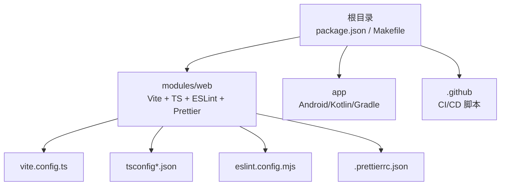
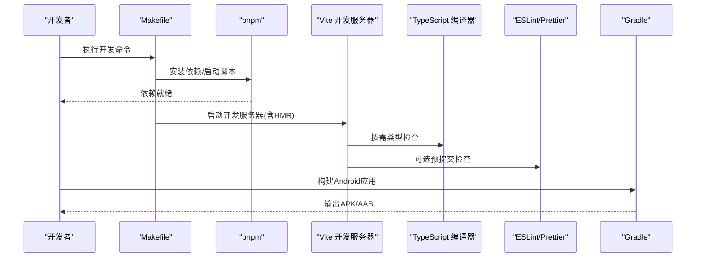
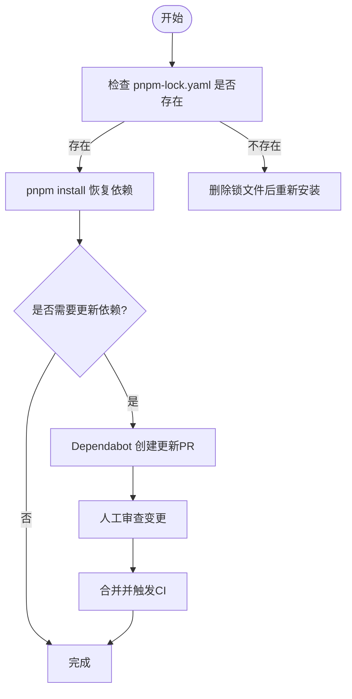
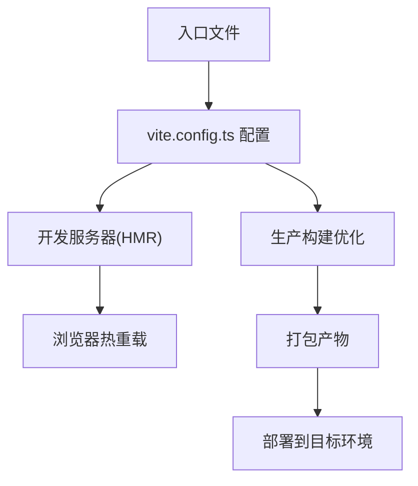
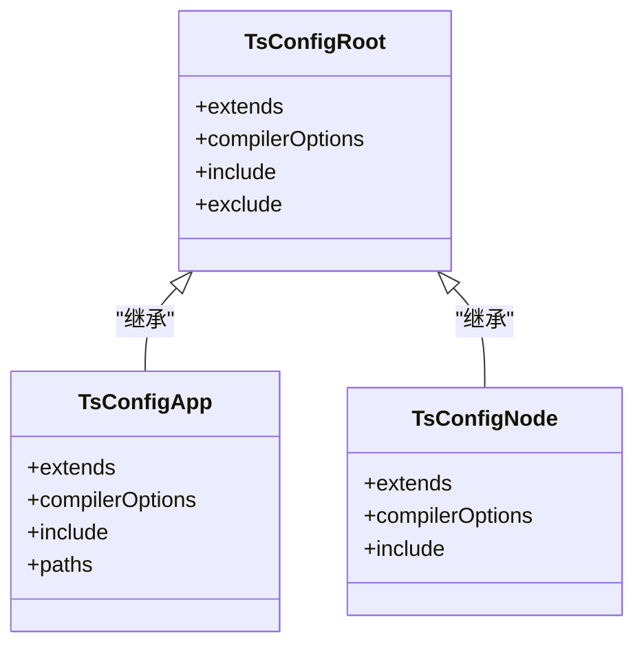
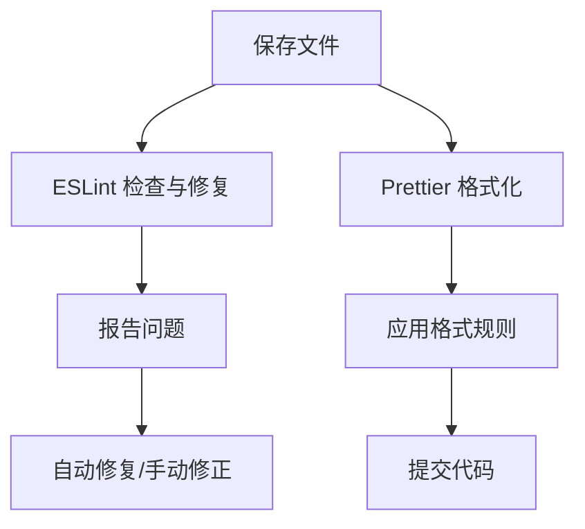
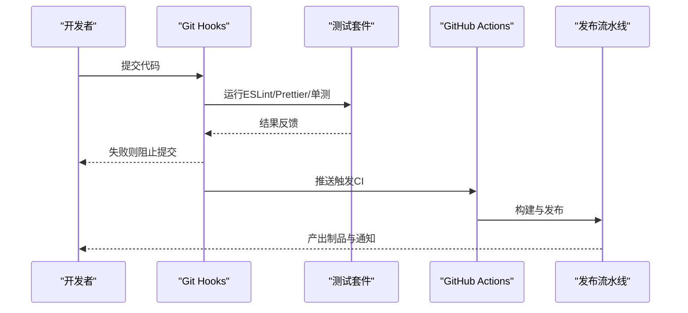
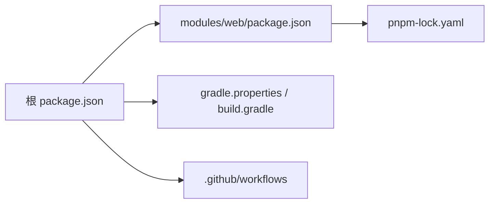

# 开发环境配置

<cite>
**本文引用的文件**   
- [package.json](file://package.json)
- [pnpm-lock.yaml](file://modules/web/pnpm-lock.yaml)
- [vite.config.ts](file://modules/web/vite.config.ts)
- [tsconfig.json](file://modules/web/tsconfig.json)
- [tsconfig.app.json](file://modules/web/tsconfig.app.json)
- [tsconfig.node.json](file://modules/web/tsconfig.node.json)
- [eslint.config.mjs](file://modules/web/eslint.config.mjs)
- [.prettierrc.json](file://modules/web/.prettierrc.json)
- [.prettierignore](file://modules/web/.prettierignore)
- [Makefile](file://Makefile)
- [gradle.properties](file://gradle.properties)
- [build.gradle](file://build.gradle)
- [settings.gradle](file://settings.gradle)
- [dependabot.yml](file://.github/dependabot.yml)
- [release.yml](file://.github/release.yml)
- [README.md](file://README.md)
</cite>

## 目录
1. [简介](#简介)
2. [项目结构](#项目结构)
3. [核心组件](#核心组件)
4. [架构总览](#架构总览)
5. [详细组件分析](#详细组件分析)
6. [依赖分析](#依赖分析)
7. [性能考虑](#性能考虑)
8. [故障排查指南](#故障排查指南)
9. [结论](#结论)
10. [附录](#附录)

## 简介
本文件面向Legado项目的开发者，系统化说明开发环境的搭建与配置，涵盖：
- 依赖管理与版本控制（package.json、pnpm、依赖更新策略）
- Vite构建工具（开发服务器、热重载、生产优化）
- TypeScript配置（编译选项、路径别名、类型检查）
- ESLint与Prettier（规则定制、自动修复、IDE集成）
- 开发工作流（Git Hooks、自动化测试、持续集成）
- 环境搭建步骤与常见问题解决方案

## 项目结构
本项目为多语言、多模块工程，前端Web部分位于 modules/web，使用Vite + TypeScript + ESLint + Prettier；Android/Gradle部分位于根目录与app模块；CI/CD脚本位于 .github。

**图示来源** 
- [package.json:1-200](file://package.json#L1-L200)
- [vite.config.ts:1-200](file://modules/web/vite.config.ts#L1-L200)
- [tsconfig.json:1-200](file://modules/web/tsconfig.json#L1-L200)
- [eslint.config.mjs:1-200](file://modules/web/eslint.config.mjs#L1-L200)
- [.prettierrc.json:1-200](file://modules/web/.prettierrc.json#L1-L200)

**章节来源**
- [README.md:1-200](file://README.md#L1-L200)

## 核心组件
- 包管理与脚本：根级 package.json 定义统一脚本入口，结合 Makefile 提供跨平台命令封装。
- Web前端：modules/web 使用 Vite 作为开发与构建工具，TypeScript 进行类型约束，ESLint/Prettier 保障代码质量与风格一致。
- Android/Gradle：通过 gradle.properties 与 build.gradle/settings.gradle 管理构建参数与模块设置。
- CI/CD：GitHub Actions 的 dependabot.yml 与 release.yml 负责依赖更新与发布流水线。

**章节来源**
- [package.json:1-200](file://package.json#L1-L200)
- [Makefile:1-200](file://Makefile#L1-L200)
- [gradle.properties:1-200](file://gradle.properties#L1-L200)
- [build.gradle:1-200](file://build.gradle#L1-L200)
- [settings.gradle:1-200](file://settings.gradle#L1-L200)

## 架构总览
下图展示开发环境与构建流程的关键交互：开发者执行脚本 → Makefile/Gradle/Vite → 生成产物并运行/部署。

**图示来源** 
- [Makefile:1-200](file://Makefile#L1-L200)
- [package.json:1-200](file://package.json#L1-L200)
- [vite.config.ts:1-200](file://modules/web/vite.config.ts#L1-L200)
- [tsconfig.json:1-200](file://modules/web/tsconfig.json#L1-L200)
- [eslint.config.mjs:1-200](file://modules/web/eslint.config.mjs#L1-L200)
- [.prettierrc.json:1-200](file://modules/web/.prettierrc.json#L1-L200)
- [build.gradle:1-200](file://build.gradle#L1-L200)

## 详细组件分析

### 依赖管理与版本控制（package.json、pnpm、依赖更新策略）
- 包管理器：项目使用 pnpm，锁定依赖版本于 pnpm-lock.yaml，确保可重复构建。
- 脚本组织：根级 package.json 集中定义常用脚本（如安装、开发、构建、校验），便于跨团队统一。
- 依赖更新策略：
  - 使用 Dependabot 定期扫描并创建PR，建议按周或双周合并安全更新与小版本升级。
  - 大版本升级需人工评审变更影响，先在本地验证后再合并。

**图示来源** 
- [package.json:1-200](file://package.json#L1-L200)
- [pnpm-lock.yaml:1-200](file://modules/web/pnpm-lock.yaml#L1-L200)
- [dependabot.yml:1-200](file://.github/dependabot.yml#L1-L200)

**章节来源**
- [package.json:1-200](file://package.json#L1-L200)
- [pnpm-lock.yaml:1-200](file://modules/web/pnpm-lock.yaml#L1-L200)
- [dependabot.yml:1-200](file://.github/dependabot.yml#L1-L200)

### Vite 构建工具（开发服务器、热重载、生产构建优化）
- 开发服务器：基于 vite.config.ts 配置端口、代理、中间件等，支持热模块替换（HMR）。
- 生产构建：启用代码分割、资源压缩、Tree-shaking、静态资源优化等。
- 插件生态：可通过插件扩展功能（如环境变量注入、路径别名解析、类型提示等）。

**图示来源** 
- [vite.config.ts:1-200](file://modules/web/vite.config.ts#L1-L200)

**章节来源**
- [vite.config.ts:1-200](file://modules/web/vite.config.ts#L1-L200)

### TypeScript 配置（编译选项、路径别名、类型检查规则）
- tsconfig.json：聚合各子配置，统一编译目标、模块系统、严格模式等。
- tsconfig.app.json：针对应用代码的类型检查与编译选项。
- tsconfig.node.json：针对Node端脚本的配置（如Vite插件、构建脚本）。
- 路径别名：通过 baseUrl 与 paths 配置缩短导入路径，提升可读性与维护性。

**图示来源** 
- [tsconfig.json:1-200](file://modules/web/tsconfig.json#L1-L200)
- [tsconfig.app.json:1-200](file://modules/web/tsconfig.app.json#L1-L200)
- [tsconfig.node.json:1-200](file://modules/web/tsconfig.node.json#L1-L200)

**章节来源**
- [tsconfig.json:1-200](file://modules/web/tsconfig.json#L1-L200)
- [tsconfig.app.json:1-200](file://modules/web/tsconfig.app.json#L1-L200)
- [tsconfig.node.json:1-200](file://modules/web/tsconfig.node.json#L1-L200)

### ESLint 与 Prettier（规则定制、自动修复、IDE集成）
- ESLint：通过 eslint.config.mjs 定义规则集、插件、忽略文件，支持自动修复与格式化联动。
- Prettier：通过 .prettierrc.json 统一代码风格，配合 .prettierignore 排除特定文件。
- IDE集成：在VS Code中启用保存时自动修复与格式化，保证团队风格一致。

**图示来源** 
- [eslint.config.mjs:1-200](file://modules/web/eslint.config.mjs#L1-L200)
- [.prettierrc.json:1-200](file://modules/web/.prettierrc.json#L1-L200)
- [.prettierignore:1-200](file://modules/web/.prettierignore#L1-L200)

**章节来源**
- [eslint.config.mjs:1-200](file://modules/web/eslint.config.mjs#L1-L200)
- [.prettierrc.json:1-200](file://modules/web/.prettierrc.json#L1-L200)
- [.prettierignore:1-200](file://modules/web/.prettierignore#L1-L200)

### 开发工作流（Git Hooks、自动化测试、持续集成）
- Git Hooks：建议在提交前运行 ESLint/Prettier 与单元测试，确保代码质量。
- 自动化测试：在CI中并行执行前端与Android测试用例，快速反馈问题。
- 持续集成：release.yml 定义发布流程，包含构建、签名、产物上传等步骤。

**图示来源** 
- [release.yml:1-200](file://.github/release.yml#L1-L200)

**章节来源**
- [release.yml:1-200](file://.github/release.yml#L1-L200)

## 依赖分析
- 直接依赖：根级 package.json 声明全局脚本与工具链；modules/web 内独立依赖用于前端构建与开发。
- 间接依赖：由 pnpm-lock.yaml 锁定具体版本，避免“依赖漂移”。
- 外部集成：Gradle 与 Android SDK/NDK 用于移动端构建；GitHub Actions 用于CI/CD。

**图示来源** 
- [package.json:1-200](file://package.json#L1-L200)
- [pnpm-lock.yaml:1-200](file://modules/web/pnpm-lock.yaml#L1-L200)
- [gradle.properties:1-200](file://gradle.properties#L1-L200)
- [build.gradle:1-200](file://build.gradle#L1-L200)
- [release.yml:1-200](file://.github/release.yml#L1-L200)

**章节来源**
- [package.json:1-200](file://package.json#L1-L200)
- [pnpm-lock.yaml:1-200](file://modules/web/pnpm-lock.yaml#L1-L200)
- [gradle.properties:1-200](file://gradle.properties#L1-L200)
- [build.gradle:1-200](file://build.gradle#L1-L200)
- [release.yml:1-200](file://.github/release.yml#L1-L200)

## 性能考虑
- 依赖安装：优先使用 pnpm 的缓存与硬链接机制，减少磁盘占用与安装时间。
- 构建优化：开启Vite的生产模式优化（代码分割、压缩、Tree-shaking），合理拆分路由与组件。
- 类型检查：仅在需要时启用严格类型检查，避免过长的冷启动时间。
- CI加速：缓存依赖与构建产物，并行执行任务，缩短流水线时长。

[本节为通用指导，不直接分析具体文件]

## 故障排查指南
- 依赖安装失败：
  - 清理缓存后重试：删除 node_modules 与 pnpm-lock.yaml，重新执行安装。
  - 网络问题：切换镜像源或使用代理。
- 类型检查报错：
  - 确认 tsconfig 的 include/exclude 正确，路径别名与实际文件路径匹配。
  - 检查第三方库是否提供类型声明。
- 构建失败：
  - 查看Vite控制台错误日志，定位具体模块与行号。
  - 临时禁用插件或优化项以缩小问题范围。
- 运行时异常：
  - 使用浏览器开发者工具与Source Map定位问题。
  - 在开发模式下逐步注释代码块定位异常来源。

**章节来源**
- [vite.config.ts:1-200](file://modules/web/vite.config.ts#L1-L200)
- [tsconfig.json:1-200](file://modules/web/tsconfig.json#L1-L200)
- [eslint.config.mjs:1-200](file://modules/web/eslint.config.mjs#L1-L200)

## 结论
通过统一的脚本入口、严格的依赖锁定、现代化的前端构建与类型系统、以及完善的代码质量与CI流程，Legado项目的开发环境具备高可维护性与可扩展性。建议团队遵循本文档的配置与实践，持续提升交付效率与产品质量。

[本节为总结性内容，不直接分析具体文件]

## 附录
- 环境搭建步骤（概览）：
  - 安装 Node.js 与 pnpm
  - 克隆仓库并安装依赖
  - 配置Android开发环境（SDK/NDK/Gradle）
  - 启动Vite开发服务器与Android模拟器
- 常见问题速查：
  - 端口冲突：修改Vite端口配置
  - 权限问题：确保脚本具有执行权限
  - 缓存污染：清理构建缓存后重试

[本节为补充信息，不直接分析具体文件]