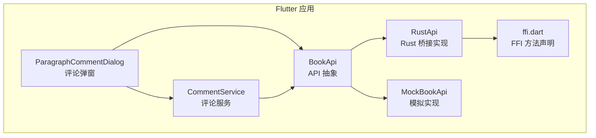
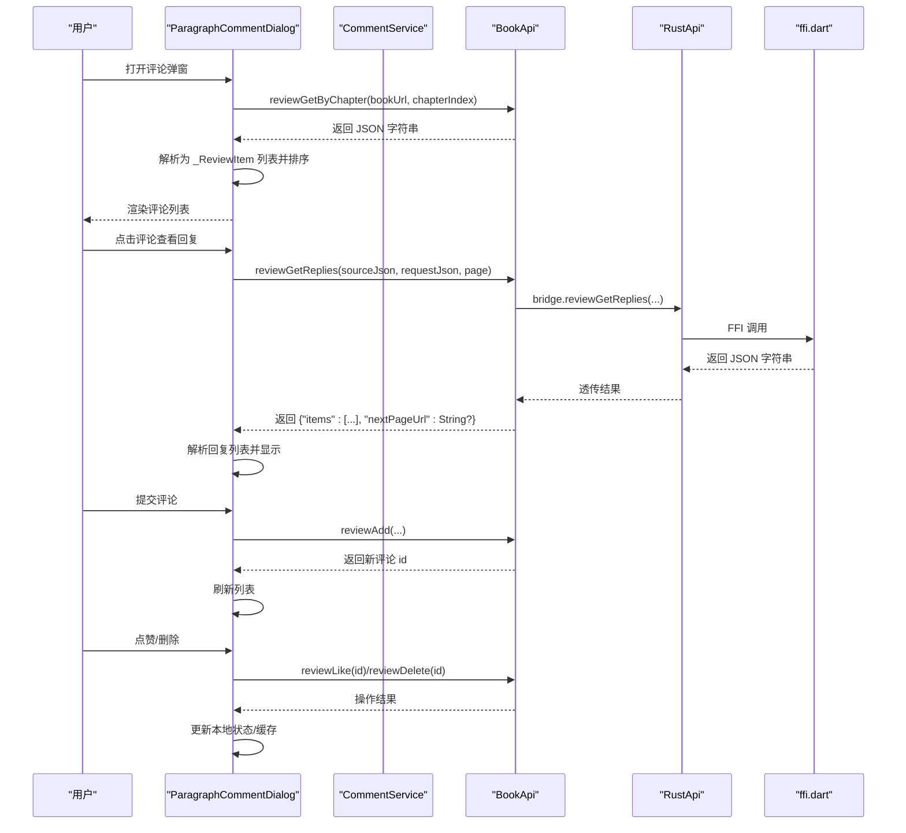
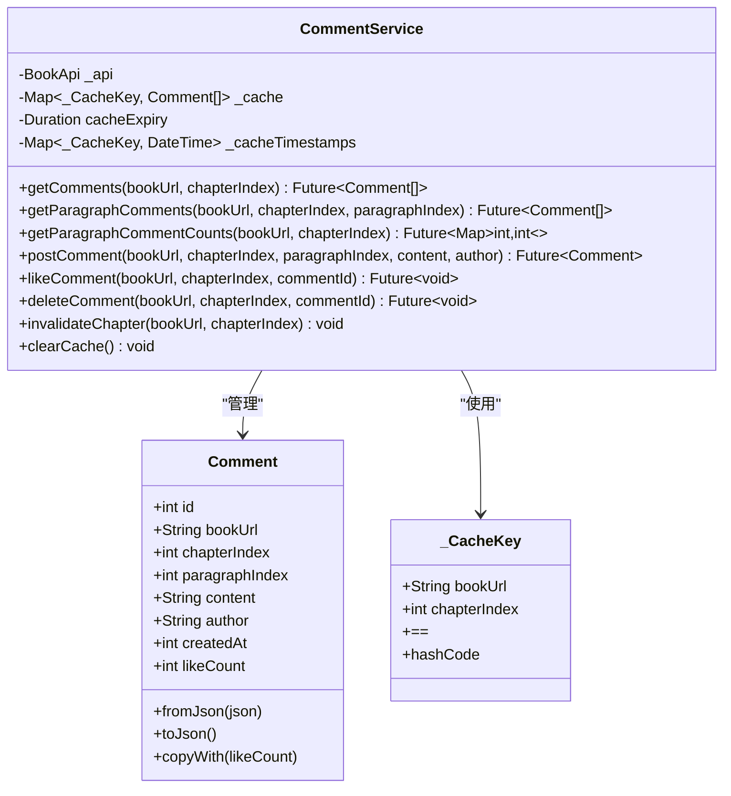
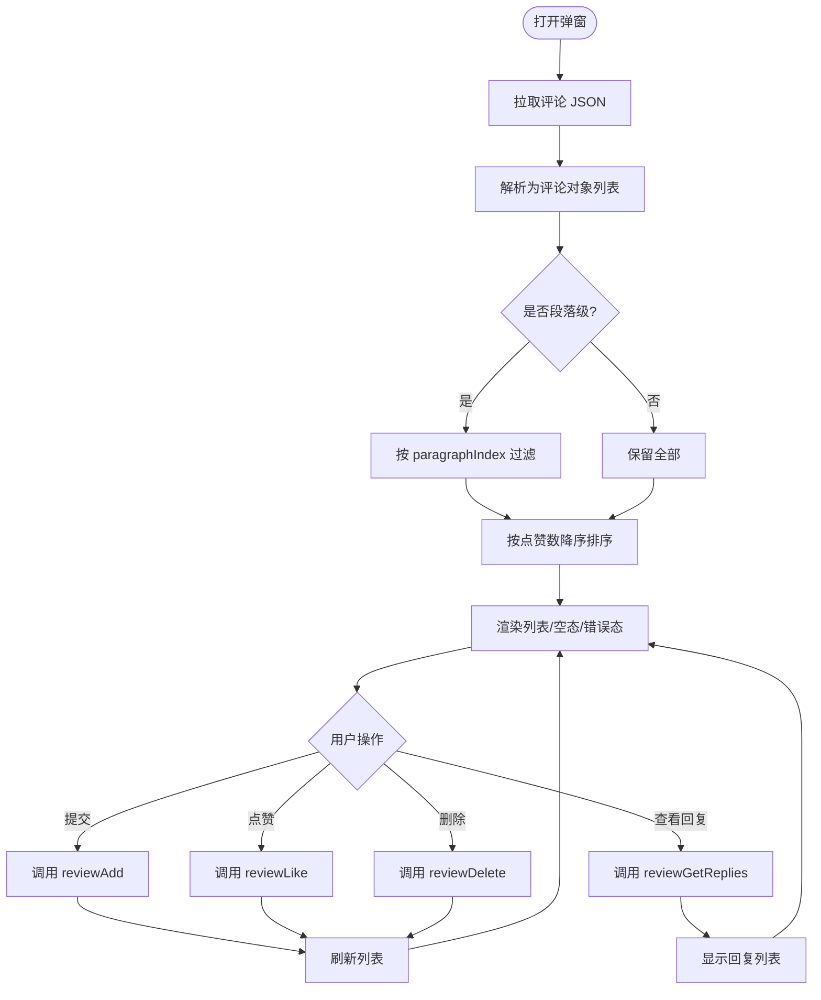
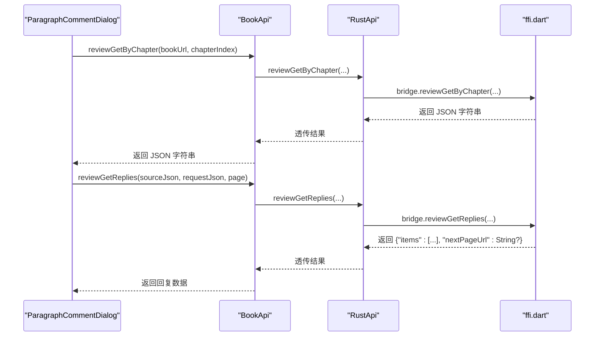
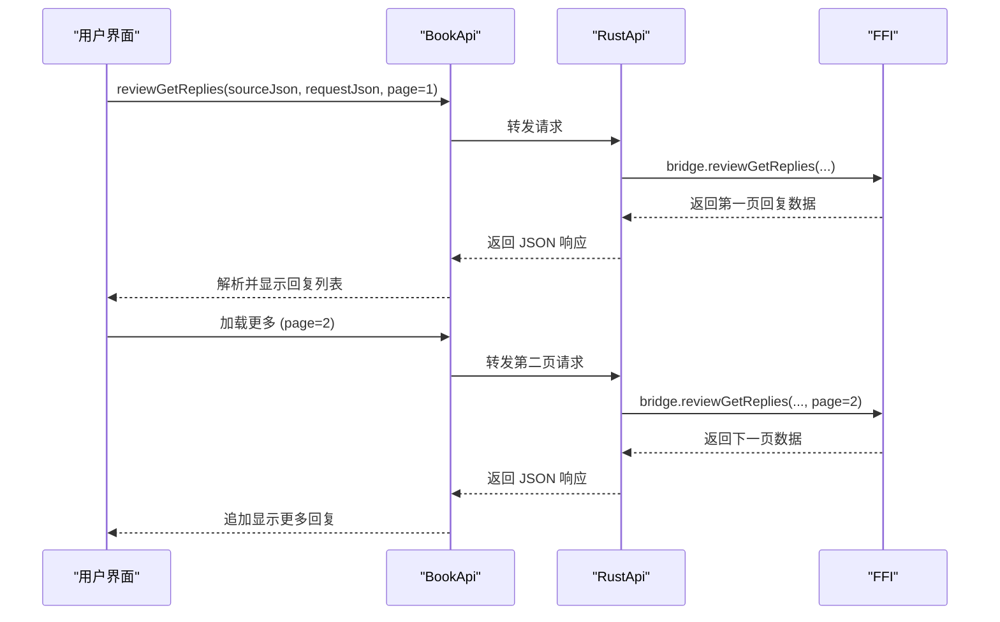
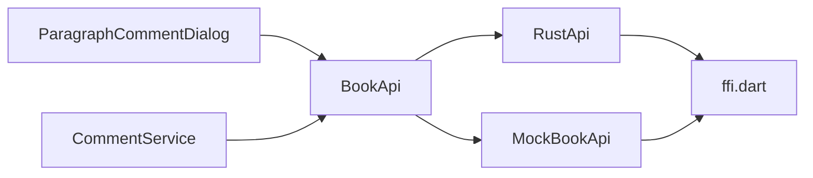

# 章节评论系统

<cite>
**本文引用的文件**   
- [comment_service.dart](file://flutter_legado/lib/src/services/comment_service.dart)
- [paragraph_comment_dialog.dart](file://flutter_legado/lib/src/widgets/paragraph_comment_dialog.dart)
- [book_api.dart](file://flutter_legado/lib/src/services/book_api.dart)
- [rust_api.dart](file://flutter_legado/lib/src/services/rust_api.dart)
- [ffi.dart](file://flutter_legado/lib/src/bridge/ffi/ffi.dart)
- [mock_book_api.dart](file://flutter_legado/lib/src/services/mock_book_api.dart)
- [source_edit_screen.dart](file://flutter_legado/lib/src/screens/source_edit_screen.dart)
- [rule.dart](file://flutter_legado/lib/src/models/rule/rule.dart)
- [paragraph_comment_test.dart](file://flutter_legado/test/widget/paragraph_comment_test.dart)
</cite>

## 更新摘要
**所做更改**   
- 新增段评回复按需加载功能（上游 #519）的完整实现说明
- 添加 reviewGetReplies API 方法的详细说明
- 补充回复解析器和数据模型的相关文档
- 更新 FFI 接口和 Flutter 绑定说明
- 扩展源编辑屏幕中的回复规则配置说明

## 目录
1. [简介](#简介)
2. [项目结构](#项目结构)
3. [核心组件](#核心组件)
4. [架构总览](#架构总览)
5. [详细组件分析](#详细组件分析)
6. [回复按需加载功能](#回复按需加载功能)
7. [依赖关系分析](#依赖关系分析)
8. [性能考量](#性能考量)
9. [故障排查指南](#故障排查指南)
10. [结论](#结论)
11. [附录](#附录)

## 简介
本文件系统化梳理 Legado 项目中"章节评论（段评）"功能的实现与使用，覆盖 Flutter 侧的数据模型、服务层、UI 弹窗、FFI 桥接以及测试用例。该功能支持：
- 按章节获取评论列表（含段落级过滤）
- 发布评论（章节级或段落级）
- 点赞与删除
- **新增：段评回复按需加载**（分页获取评论回复）
- 内存缓存与过期策略
- UI 交互（加载、错误、空态、排序、输入提交）

## 项目结构
Flutter 端围绕"评论服务 + UI 弹窗 + FFI 桥接"组织代码：
- 数据模型与服务：CommentService、Comment
- UI 弹窗：ParagraphCommentDialog
- API 接口抽象：BookApi
- FFI 桥接：RustApi -> ffi.dart
- **新增：回复解析器与规则配置**
- 单元测试：paragraph_comment_test.dart

图表来源
- [paragraph_comment_dialog.dart:1-467](file://flutter_legado/lib/src/widgets/paragraph_comment_dialog.dart#L1-L467)
- [comment_service.dart:1-243](file://flutter_legado/lib/src/services/comment_service.dart#L1-L243)
- [book_api.dart:600-620](file://flutter_legado/lib/src/services/book_api.dart#L600-L620)
- [rust_api.dart:1406-1433](file://flutter_legado/lib/src/services/rust_api.dart#L1406-L1433)
- [ffi.dart:847-875](file://flutter_legado/lib/src/bridge/ffi/ffi.dart#L847-L875)
- [mock_book_api.dart:1310-1333](file://flutter_legado/lib/src/services/mock_book_api.dart#L1310-L1333)

章节来源
- [paragraph_comment_dialog.dart:1-467](file://flutter_legado/lib/src/widgets/paragraph_comment_dialog.dart#L1-L467)
- [comment_service.dart:1-243](file://flutter_legado/lib/src/services/comment_service.dart#L1-L243)
- [book_api.dart:600-620](file://flutter_legado/lib/src/services/book_api.dart#L600-L620)
- [rust_api.dart:1406-1433](file://flutter_legado/lib/src/services/rust_api.dart#L1406-L1433)
- [ffi.dart:847-875](file://flutter_legado/lib/src/bridge/ffi/ffi.dart#L847-L875)
- [mock_book_api.dart:1310-1333](file://flutter_legado/lib/src/services/mock_book_api.dart#L1310-L1333)

## 核心组件
- Comment 数据模型：定义评论字段（id、bookUrl、chapterIndex、paragraphIndex、content、author、createdAt、likeCount），提供 JSON 序列化与 copyWith。
- CommentService：封装评论的获取、发布、点赞、删除；内置基于 bookUrl+chapterIndex 的内存缓存与过期时间控制；提供段落级统计与过滤。
- ParagraphCommentDialog：底部弹窗展示评论列表，支持刷新、新增、点赞、删除；按点赞数降序排列；支持段落级过滤显示。
- BookApi：评论相关方法的抽象接口（reviewGetByChapter、reviewAdd、reviewDelete、reviewLike、**reviewGetReplies**）。
- RustApi：BookApi 的 Rust 实现，通过 FFI 调用底层能力。
- ffi.dart：FFI 方法声明（reviewGetByChapter、reviewAdd、reviewDelete、reviewLike、**reviewGetReplies**）。
- **新增：ReviewRule 扩展**：包含回复相关的解析规则配置。

章节来源
- [comment_service.dart:1-243](file://flutter_legado/lib/src/services/comment_service.dart#L1-L243)
- [paragraph_comment_dialog.dart:1-467](file://flutter_legado/lib/src/widgets/paragraph_comment_dialog.dart#L1-L467)
- [book_api.dart:600-620](file://flutter_legado/lib/src/services/book_api.dart#L600-L620)
- [rust_api.dart:1406-1433](file://flutter_legado/lib/src/services/rust_api.dart#L1406-L1433)
- [ffi.dart:847-875](file://flutter_legado/lib/src/bridge/ffi/ffi.dart#L847-L875)
- [rule.dart:124](file://flutter_legado/lib/src/models/rule/rule.dart#L124)

## 架构总览
评论系统的调用链从 UI 到 FFI 的完整流程如下：

图表来源
- [paragraph_comment_dialog.dart:55-123](file://flutter_legado/lib/src/widgets/paragraph_comment_dialog.dart#L55-L123)
- [comment_service.dart:99-197](file://flutter_legado/lib/src/services/comment_service.dart#L99-L197)
- [book_api.dart:604-619](file://flutter_legado/lib/src/services/book_api.dart#L604-L619)
- [rust_api.dart:1406-1433](file://flutter_legado/lib/src/services/rust_api.dart#L1406-L1433)
- [ffi.dart:847-875](file://flutter_legado/lib/src/bridge/ffi/ffi.dart#L847-L875)
- [book_api.dart:631-632](file://flutter_legado/lib/src/services/book_api.dart#L631-L632)
- [rust_api.dart:1438-1444](file://flutter_legado/lib/src/services/rust_api.dart#L1438-L1444)
- [ffi.dart:885-893](file://flutter_legado/lib/src/bridge/ffi/ffi.dart#L885-L893)

## 详细组件分析

### 数据模型与缓存服务（CommentService）
- 数据结构：Comment 包含章节与段落索引，便于段落级定位与统计。
- 缓存策略：以 _CacheKey(bookUrl, chapterIndex) 为键，维护评论列表与时间戳；默认 5 分钟过期。
- 主要方法：
  - getComments：带缓存的章节评论获取
  - getParagraphComments：按段落索引过滤
  - getParagraphCommentCounts：统计每段评论数量
  - postComment：发布评论并失效对应缓存
  - likeComment/deleteComment：点赞/删除并更新缓存

图表来源
- [comment_service.dart:1-243](file://flutter_legado/lib/src/services/comment_service.dart#L1-L243)

章节来源
- [comment_service.dart:1-243](file://flutter_legado/lib/src/services/comment_service.dart#L1-L243)

### 评论弹窗（ParagraphCommentDialog）
- 功能要点：
  - 初始化时拉取评论并按点赞数降序排序
  - 支持段落级过滤（paragraphIndex >= 0）
  - 输入框支持多行与发送快捷键
  - 点赞/删除后重新拉取列表
  - 错误与空态处理
  - **新增：点击评论可展开查看回复列表**
- 交互流程：
  - 加载失败：显示错误视图并提供重试
  - 无评论：显示引导文案
  - 提交评论：清空输入并刷新列表
  - **新增：点击评论项触发回复加载**

图表来源
- [paragraph_comment_dialog.dart:55-123](file://flutter_legado/lib/src/widgets/paragraph_comment_dialog.dart#L55-L123)
- [paragraph_comment_dialog.dart:125-273](file://flutter_legado/lib/src/widgets/paragraph_comment_dialog.dart#L125-L273)

章节来源
- [paragraph_comment_dialog.dart:1-467](file://flutter_legado/lib/src/widgets/paragraph_comment_dialog.dart#L1-L467)

### API 抽象与 FFI 桥接（BookApi / RustApi / ffi.dart）
- BookApi：定义评论相关方法签名（reviewGetByChapter、reviewAdd、reviewDelete、reviewLike、**reviewGetReplies**）。
- RustApi：实现 BookApi，内部委托给 FFI 方法。
- ffi.dart：声明 FFI 方法，供 RustApi 调用。
- **新增：reviewGetReplies 方法支持分页加载回复**

图表来源
- [book_api.dart:604-619](file://flutter_legado/lib/src/services/book_api.dart#L604-L619)
- [rust_api.dart:1406-1433](file://flutter_legado/lib/src/services/rust_api.dart#L1406-L1433)
- [ffi.dart:847-875](file://flutter_legado/lib/src/bridge/ffi/ffi.dart#L847-L875)
- [book_api.dart:631-632](file://flutter_legado/lib/src/services/book_api.dart#L631-L632)
- [rust_api.dart:1438-1444](file://flutter_legado/lib/src/services/rust_api.dart#L1438-L1444)
- [ffi.dart:885-893](file://flutter_legado/lib/src/bridge/ffi/ffi.dart#L885-L893)

章节来源
- [book_api.dart:604-619](file://flutter_legado/lib/src/services/book_api.dart#L604-L619)
- [rust_api.dart:1406-1433](file://flutter_legado/lib/src/services/rust_api.dart#L1406-L1433)
- [ffi.dart:847-875](file://flutter_legado/lib/src/bridge/ffi/ffi.dart#L847-L875)
- [book_api.dart:631-632](file://flutter_legado/lib/src/services/book_api.dart#L631-L632)
- [rust_api.dart:1438-1444](file://flutter_legado/lib/src/services/rust_api.dart#L1438-L1444)
- [ffi.dart:885-893](file://flutter_legado/lib/src/bridge/ffi/ffi.dart#L885-L893)

### 单元测试（paragraph_comment_test.dart）
- 覆盖场景：
  - 基本渲染、空列表提示、输入框存在性
  - 有评论时的列表渲染与计数
  - 加载失败错误视图与重试
  - 段落级标题与过滤
  - 点赞/删除触发 API 调用
  - 提交评论携带段落索引
  - 评论按点赞数降序排列

章节来源
- [paragraph_comment_test.dart:1-344](file://flutter_legado/test/widget/paragraph_comment_test.dart#L1-L344)

## 回复按需加载功能

### 功能概述
新增的段评回复按需加载功能允许用户在查看具体评论时，动态加载该评论下的所有回复内容。该功能采用分页机制，避免一次性加载大量数据影响性能。

### API 接口规范
- **方法名称**：`reviewGetReplies`
- **参数说明**：
  - `sourceJson`: 书籍源 JSON（包含 ruleReview 配置）
  - `requestJson`: 请求上下文 JSON，支持以下字段：
    - `reviewId`: 评论 ID
    - `paraIndex`: 段落索引
    - `paraData`: 段落数据
    - `chapterUrl`: 章节 URL
    - `replyUrl`: 回复 URL
  - `page`: 回复页码（从 1 开始）
- **返回值**：JSON 对象字符串 `{"items": [回复列表], "nextPageUrl": String?}`

### 数据模型
回复数据包含以下字段：
- `id`: 回复唯一标识
- `name`: 回复者昵称
- `content`: 回复内容
- `badges`: 徽章列表（如"沙发"等）
- `time`: 发布时间描述

### 实现细节
- **FFI 接口**：在 ffi.dart 中声明了 `reviewGetReplies` 方法
- **Rust 桥接**：RustApi 实现了该方法，通过 FFI 调用底层能力
- **Mock 实现**：MockBookApi 提供了模拟数据用于开发调试
- **分页支持**：通过 `nextPageUrl` 字段支持无限滚动加载

图表来源
- [book_api.dart:631-632](file://flutter_legado/lib/src/services/book_api.dart#L631-L632)
- [rust_api.dart:1438-1444](file://flutter_legado/lib/src/services/rust_api.dart#L1438-L1444)
- [ffi.dart:885-893](file://flutter_legado/lib/src/bridge/ffi/ffi.dart#L885-L893)
- [mock_book_api.dart:1312-1333](file://flutter_legado/lib/src/services/mock_book_api.dart#L1312-L1333)

### 配置规则
在源编辑屏幕中新增了回复相关的解析规则配置：
- `r_replyListRule`: 回复列表规则
- `r_replyIdRule`: 回复 ID 规则
- `r_replyAvatarRule`: 回复头像规则
- `r_replyNameRule`: 回复昵称规则
- `r_replyBadgeRule`: 回复徽章规则
- `r_replyContentRule`: 回复内容规则

章节来源
- [book_api.dart:625-632](file://flutter_legado/lib/src/services/book_api.dart#L625-L632)
- [rust_api.dart:1435-1444](file://flutter_legado/lib/src/services/rust_api.dart#L1435-L1444)
- [ffi.dart:881-893](file://flutter_legado/lib/src/bridge/ffi/ffi.dart#L881-L893)
- [mock_book_api.dart:1312-1333](file://flutter_legado/lib/src/services/mock_book_api.dart#L1312-L1333)
- [source_edit_screen.dart:216-221](file://flutter_legado/lib/src/screens/source_edit_screen.dart#L216-L221)
- [source_edit_screen.dart:362-367](file://flutter_legado/lib/src/screens/source_edit_screen.dart#L362-L367)

## 依赖关系分析
- 组件耦合：
  - ParagraphCommentDialog 依赖 BookApi 进行数据访问，不直接感知 FFI/Rust 细节
  - CommentService 同样依赖 BookApi，并在内部维护缓存
  - RustApi 作为 BookApi 的具体实现，依赖 ffi.dart
  - **新增：MockBookApi 提供模拟实现用于测试**
- 外部依赖：
  - FFI 方法由 ffi.dart 暴露，最终由 Rust 侧实现
- 潜在循环依赖：
  - 当前设计单向依赖，未见循环引用

图表来源
- [paragraph_comment_dialog.dart:1-467](file://flutter_legado/lib/src/widgets/paragraph_comment_dialog.dart#L1-L467)
- [comment_service.dart:1-243](file://flutter_legado/lib/src/services/comment_service.dart#L1-L243)
- [book_api.dart:600-620](file://flutter_legado/lib/src/services/book_api.dart#L600-L620)
- [rust_api.dart:1406-1433](file://flutter_legado/lib/src/services/rust_api.dart#L1406-L1433)
- [ffi.dart:847-875](file://flutter_legado/lib/src/bridge/ffi/ffi.dart#L847-L875)
- [mock_book_api.dart:1310-1333](file://flutter_legado/lib/src/services/mock_book_api.dart#L1310-L1333)

章节来源
- [paragraph_comment_dialog.dart:1-467](file://flutter_legado/lib/src/widgets/paragraph_comment_dialog.dart#L1-L467)
- [comment_service.dart:1-243](file://flutter_legado/lib/src/services/comment_service.dart#L1-L243)
- [book_api.dart:600-620](file://flutter_legado/lib/src/services/book_api.dart#L600-L620)
- [rust_api.dart:1406-1433](file://flutter_legado/lib/src/services/rust_api.dart#L1406-L1433)
- [ffi.dart:847-875](file://flutter_legado/lib/src/bridge/ffi/ffi.dart#L847-L875)
- [mock_book_api.dart:1310-1333](file://flutter_legado/lib/src/services/mock_book_api.dart#L1310-L1333)

## 性能考量
- 内存缓存：
  - 以章节为单位缓存评论列表，避免重复请求
  - 默认 5 分钟过期，可按需调整
- 列表渲染：
  - 使用 ListView.separated 减少不必要的重建
  - 段落级过滤在内存中完成，复杂度 O(n)
- 网络与 I/O：
  - 所有网络请求集中在 BookApi/RustApi/FFI 层，便于统一监控与优化
  - **新增：回复加载采用分页机制，避免一次性加载大量数据**
- 建议：
  - 对大章节可考虑分页或增量更新
  - 对高频点赞/删除操作可引入乐观更新与冲突回滚
  - **新增：回复加载应实现虚拟滚动以优化大数据量场景**

[本节为通用指导，无需具体文件引用]

## 故障排查指南
- 常见问题：
  - 加载失败：检查网络与 FFI 返回值，确认 JSON 格式正确
  - 段落过滤无效：确认 paragraphIndex 是否正确传入
  - 点赞/删除未生效：检查缓存失效逻辑与列表刷新时机
  - **新增：回复加载失败：检查 reviewGetReplies 参数是否正确传递**
- 调试建议：
  - 在 RustApi/FFI 层打印关键参数与返回值
  - 使用单元测试快速验证 UI 行为与 API 调用
  - **新增：验证 mock_book_api.dart 中的模拟数据格式**

章节来源
- [paragraph_comment_test.dart:172-181](file://flutter_legado/test/widget/paragraph_comment_test.dart#L172-L181)
- [paragraph_comment_dialog.dart:78-83](file://flutter_legado/lib/src/widgets/paragraph_comment_dialog.dart#L78-83)
- [mock_book_api.dart:1312-1333](file://flutter_legado/lib/src/services/mock_book_api.dart#L1312-L1333)

## 结论
Legado 的章节评论系统在 Flutter 侧实现了清晰的分层与职责分离：UI 负责交互与展示，服务层负责数据与缓存，API 抽象屏蔽底层实现细节，FFI 桥接连接 Rust 能力。整体设计具备良好的可测试性与扩展性，适合后续增加分页、离线同步、消息推送等特性。

**新增的段评回复按需加载功能**进一步完善了用户体验，允许用户按需查看评论详情和回复内容，同时通过分页机制保证了良好的性能表现。

[本节为总结性内容，无需具体文件引用]

## 附录
- 术语说明：
  - 章节评论：针对整章的评论（paragraphIndex = -1）
  - 段落评论：针对具体段落的评论（paragraphIndex >= 0）
  - 回复：针对某条评论的二次评论内容
- 相关文件路径：
  - 服务层：flutter_legado/lib/src/services/comment_service.dart
  - UI 弹窗：flutter_legado/lib/src/widgets/paragraph_comment_dialog.dart
  - API 抽象：flutter_legado/lib/src/services/book_api.dart
  - Rust 桥接：flutter_legado/lib/src/services/rust_api.dart
  - FFI 声明：flutter_legado/lib/src/bridge/ffi/ffi.dart
  - Mock 实现：flutter_legado/lib/src/services/mock_book_api.dart
  - 源编辑：flutter_legado/lib/src/screens/source_edit_screen.dart
  - 数据模型：flutter_legado/lib/src/models/rule/rule.dart
  - 单元测试：flutter_legado/test/widget/paragraph_comment_test.dart

[本节为补充信息，无需具体文件引用]