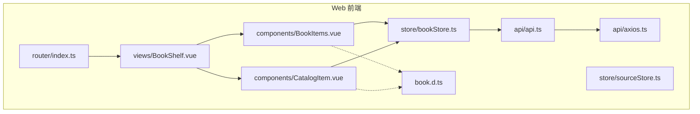
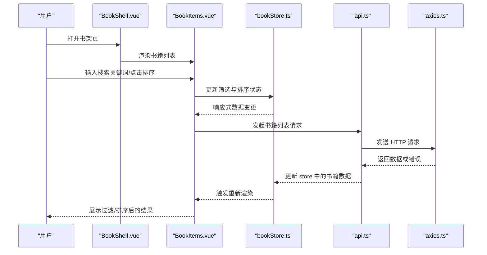
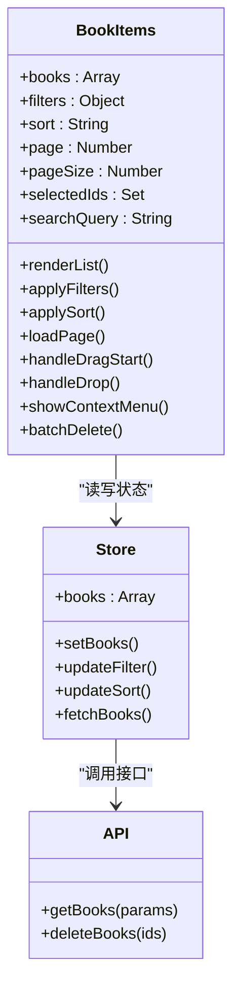
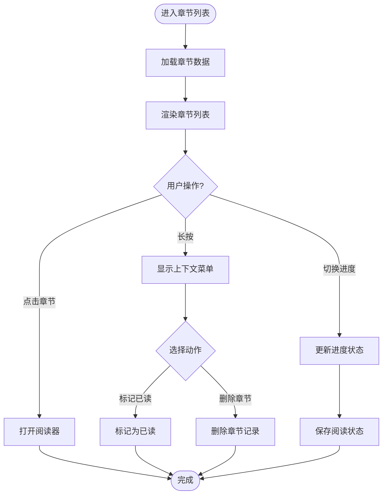
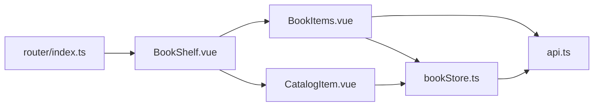

# 书籍列表组件

<cite>
**本文引用的文件**   
- [BookItems.vue](file://modules/web/src/components/BookItems.vue)
- [CatalogItem.vue](file://modules/web/src/components/CatalogItem.vue)
- [BookShelf.vue](file://modules/web/src/views/BookShelf.vue)
- [bookStore.ts](file://modules/web/src/store/bookStore.ts)
- [book.d.ts](file://modules/web/src/book.d.ts)
- [sourceStore.ts](file://modules/web/src/store/sourceStore.ts)
- [api.ts](file://modules/web/src/api/api.ts)
- [axios.ts](file://modules/web/src/api/axios.ts)
- [index.ts](file://modules/web/src/router/index.ts)
- [package.json](file://modules/web/package.json)
</cite>

## 目录
1. [简介](#简介)
2. [项目结构](#项目结构)
3. [核心组件](#核心组件)
4. [架构总览](#架构总览)
5. [详细组件分析](#详细组件分析)
6. [依赖关系分析](#依赖关系分析)
7. [性能考虑](#性能考虑)
8. [故障排查指南](#故障排查指南)
9. [结论](#结论)
10. [附录](#附录)

## 简介
本开发文档聚焦于书籍列表相关的前端组件，重点覆盖：
- BookItems 组件：书籍数据展示、搜索过滤、排序、分页加载等能力。
- CatalogItem 组件：章节列表显示、进度指示、操作按钮等交互。
- 数据绑定机制：响应式更新、虚拟滚动优化、内存管理策略。
- 交互功能：拖拽排序、批量操作、右键菜单。
- 样式定制：主题适配、布局调整、动画效果。
- 使用示例与性能优化策略。

该文档旨在帮助开发者快速理解并扩展书籍列表相关功能，同时提供可操作的优化建议与排错方法。

## 项目结构
本项目采用模块化组织方式，Web 前端位于 modules/web 目录，核心书籍列表相关代码集中在 components、store、views、router、api 等子目录中。关键文件如下：
- components：UI 组件（BookItems、CatalogItem 等）
- store：状态管理（bookStore、sourceStore 等）
- views：页面级视图（BookShelf 书架页）
- router：路由配置（index.ts）
- api：网络请求封装（api.ts、axios.ts）
- book.d.ts：类型定义（书籍、章节等）

图表来源
- [BookItems.vue](file://modules/web/src/components/BookItems.vue)
- [CatalogItem.vue](file://modules/web/src/components/CatalogItem.vue)
- [BookShelf.vue](file://modules/web/src/views/BookShelf.vue)
- [bookStore.ts](file://modules/web/src/store/bookStore.ts)
- [sourceStore.ts](file://modules/web/src/store/sourceStore.ts)
- [api.ts](file://modules/web/src/api/api.ts)
- [axios.ts](file://modules/web/src/api/axios.ts)
- [index.ts](file://modules/web/src/router/index.ts)
- [book.d.ts](file://modules/web/src/book.d.ts)

章节来源
- [BookItems.vue](file://modules/web/src/components/BookItems.vue)
- [CatalogItem.vue](file://modules/web/src/components/CatalogItem.vue)
- [BookShelf.vue](file://modules/web/src/views/BookShelf.vue)
- [bookStore.ts](file://modules/web/src/store/bookStore.ts)
- [sourceStore.ts](file://modules/web/src/store/sourceStore.ts)
- [api.ts](file://modules/web/src/api/api.ts)
- [axios.ts](file://modules/web/src/api/axios.ts)
- [index.ts](file://modules/web/src/router/index.ts)
- [book.d.ts](file://modules/web/src/book.d.ts)

## 核心组件
- BookItems 组件：负责书籍列表的渲染与交互，包括搜索过滤、排序、分页加载、选择与批量操作、拖拽排序、右键菜单等。
- CatalogItem 组件：负责单本书籍的章节列表渲染，包含进度条、阅读入口、下载或缓存控制等操作按钮。

章节来源
- [BookItems.vue](file://modules/web/src/components/BookItems.vue)
- [CatalogItem.vue](file://modules/web/src/components/CatalogItem.vue)

## 架构总览
整体架构遵循“视图层—状态层—API 层”的分层设计：
- 视图层：BookItems、CatalogItem、BookShelf 等 Vue 组件负责 UI 渲染与用户交互。
- 状态层：bookStore、sourceStore 管理书籍与源的状态，提供响应式数据更新。
- API 层：api.ts 与 axios.ts 封装网络请求，统一错误处理与重试策略。
- 类型定义：book.d.ts 提供书籍、章节等数据结构类型约束。

图表来源
- [BookShelf.vue](file://modules/web/src/views/BookShelf.vue)
- [BookItems.vue](file://modules/web/src/components/BookItems.vue)
- [bookStore.ts](file://modules/web/src/store/bookStore.ts)
- [api.ts](file://modules/web/src/api/api.ts)
- [axios.ts](file://modules/web/src/api/axios.ts)

## 详细组件分析

### BookItems 组件分析
职责与特性：
- 数据展示：以网格或列表形式展示书籍封面、标题、作者、标签等信息。
- 搜索过滤：支持按书名、作者、标签等多字段模糊匹配。
- 排序：支持按更新时间、收藏数、评分等维度排序。
- 分页加载：支持上拉加载更多或分页按钮切换。
- 交互：多选与批量删除、拖拽重排、右键菜单（收藏、移除、详情等）。
- 性能：虚拟滚动、懒加载封面、防抖搜索、节流滚动。

图表来源
- [BookItems.vue](file://modules/web/src/components/BookItems.vue)
- [bookStore.ts](file://modules/web/src/store/bookStore.ts)
- [api.ts](file://modules/web/src/api/api.ts)

章节来源
- [BookItems.vue](file://modules/web/src/components/BookItems.vue)
- [bookStore.ts](file://modules/web/src/store/bookStore.ts)
- [api.ts](file://modules/web/src/api/api.ts)

### CatalogItem 组件分析
职责与特性：
- 章节列表：按顺序渲染章节标题、字数、是否已读等元信息。
- 进度指示：显示当前阅读位置、百分比进度条。
- 操作按钮：继续阅读、跳转到指定章节、缓存/下载章节、分享等。
- 交互：点击章节进入阅读器、长按弹出上下文菜单（标记已读、删除等）。

图表来源
- [CatalogItem.vue](file://modules/web/src/components/CatalogItem.vue)
- [bookStore.ts](file://modules/web/src/store/bookStore.ts)

章节来源
- [CatalogItem.vue](file://modules/web/src/components/CatalogItem.vue)
- [bookStore.ts](file://modules/web/src/store/bookStore.ts)

### 数据绑定机制
- 响应式更新：通过 store 中的响应式变量驱动组件重新渲染，避免不必要的 DOM 操作。
- 虚拟滚动：对长列表启用虚拟滚动，仅渲染可视区域项，降低内存占用与重绘开销。
- 内存管理：及时释放未使用对象引用，清理定时器与事件监听器，避免内存泄漏。

章节来源
- [bookStore.ts](file://modules/web/src/store/bookStore.ts)
- [BookItems.vue](file://modules/web/src/components/BookItems.vue)
- [CatalogItem.vue](file://modules/web/src/components/CatalogItem.vue)

### 交互功能
- 拖拽排序：在 BookItems 中实现拖拽重排，更新本地排序状态并同步到后端。
- 批量操作：勾选多本书籍后执行批量删除、移动分组、导出等操作。
- 右键菜单：提供快捷操作入口，如收藏、移除、查看详情、分享链接等。

章节来源
- [BookItems.vue](file://modules/web/src/components/BookItems.vue)
- [CatalogItem.vue](file://modules/web/src/components/CatalogItem.vue)

### 样式定制方案
- 主题适配：通过 CSS 变量或主题配置文件统一控制颜色、字体、间距等。
- 布局调整：支持网格/列表模式切换，适配不同屏幕尺寸。
- 动画效果：为列表项增删、拖拽、展开收起添加过渡动画，提升用户体验。

章节来源
- [BookItems.vue](file://modules/web/src/components/BookItems.vue)
- [CatalogItem.vue](file://modules/web/src/components/CatalogItem.vue)

## 依赖关系分析
组件与模块之间的依赖关系清晰，便于维护与扩展：
- BookItems 依赖 bookStore 获取与更新书籍数据，依赖 api 进行网络请求。
- CatalogItem 依赖 bookStore 管理章节与阅读状态。
- BookShelf 作为容器视图，组合 BookItems 与 CatalogItem。
- 路由 index.ts 控制页面导航，确保组件正确挂载。

图表来源
- [BookItems.vue](file://modules/web/src/components/BookItems.vue)
- [CatalogItem.vue](file://modules/web/src/components/CatalogItem.vue)
- [BookShelf.vue](file://modules/web/src/views/BookShelf.vue)
- [bookStore.ts](file://modules/web/src/store/bookStore.ts)
- [api.ts](file://modules/web/src/api/api.ts)
- [index.ts](file://modules/web/src/router/index.ts)

章节来源
- [BookItems.vue](file://modules/web/src/components/BookItems.vue)
- [CatalogItem.vue](file://modules/web/src/components/CatalogItem.vue)
- [BookShelf.vue](file://modules/web/src/views/BookShelf.vue)
- [bookStore.ts](file://modules/web/src/store/bookStore.ts)
- [api.ts](file://modules/web/src/api/api.ts)
- [index.ts](file://modules/web/src/router/index.ts)

## 性能考虑
- 列表渲染优化：使用虚拟滚动减少 DOM 节点数量，结合 key 稳定标识避免重复渲染。
- 网络请求优化：合并请求、缓存热点数据、设置合理的超时与重试策略。
- 内存优化：及时清理无用引用，避免闭包持有大对象；图片懒加载与压缩。
- 交互优化：防抖搜索、节流滚动、异步加载章节内容。

[本节为通用性能指导，不直接分析具体文件]

## 故障排查指南
常见问题与解决思路：
- 列表不更新：检查 store 响应式变量是否正确更新，确认组件订阅了相应状态。
- 搜索无效：验证搜索关键词过滤逻辑，检查字段映射与大小写处理。
- 分页异常：确认页码与 pageSize 参数传递正确，后端返回数据结构一致。
- 拖拽失效：检查事件监听是否注册成功，DOM 节点是否被动态替换。
- 右键菜单不显示：确认上下文菜单定位计算与 z-index 层级设置。

章节来源
- [bookStore.ts](file://modules/web/src/store/bookStore.ts)
- [BookItems.vue](file://modules/web/src/components/BookItems.vue)
- [CatalogItem.vue](file://modules/web/src/components/CatalogItem.vue)

## 结论
BookItems 与 CatalogItem 组件构成了 Legado Web 前端书籍列表的核心能力，涵盖数据展示、搜索过滤、排序、分页、交互与样式定制等方面。通过清晰的架构设计与性能优化策略，能够为大量书籍数据提供流畅的用户体验。建议在后续迭代中持续完善错误处理、无障碍支持与国际化能力。

[本节为总结性内容，不直接分析具体文件]

## 附录
- 使用示例：在 BookShelf 中引入 BookItems 与 CatalogItem，配置初始筛选条件与默认排序。
- 类型定义：参考 book.d.ts 了解书籍与章节的数据结构，确保前后端一致性。
- 构建与运行：查看 package.json 中的脚本命令，启动开发与生产环境。

章节来源
- [BookShelf.vue](file://modules/web/src/views/BookShelf.vue)
- [book.d.ts](file://modules/web/src/book.d.ts)
- [package.json](file://modules/web/package.json)