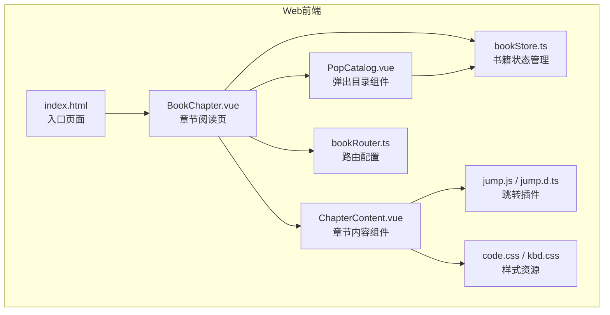
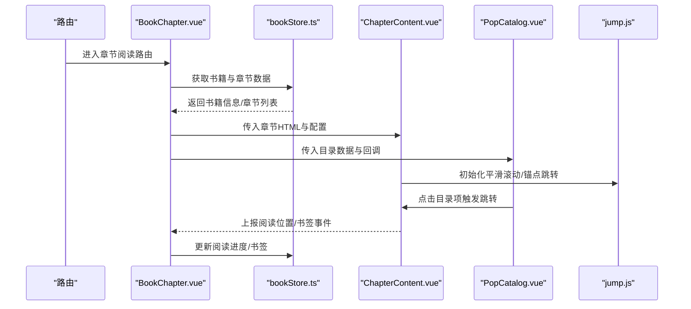
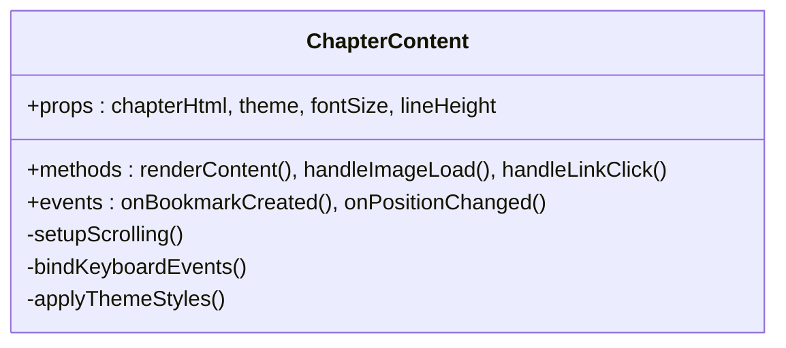
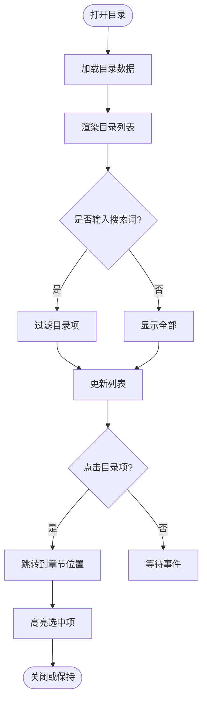
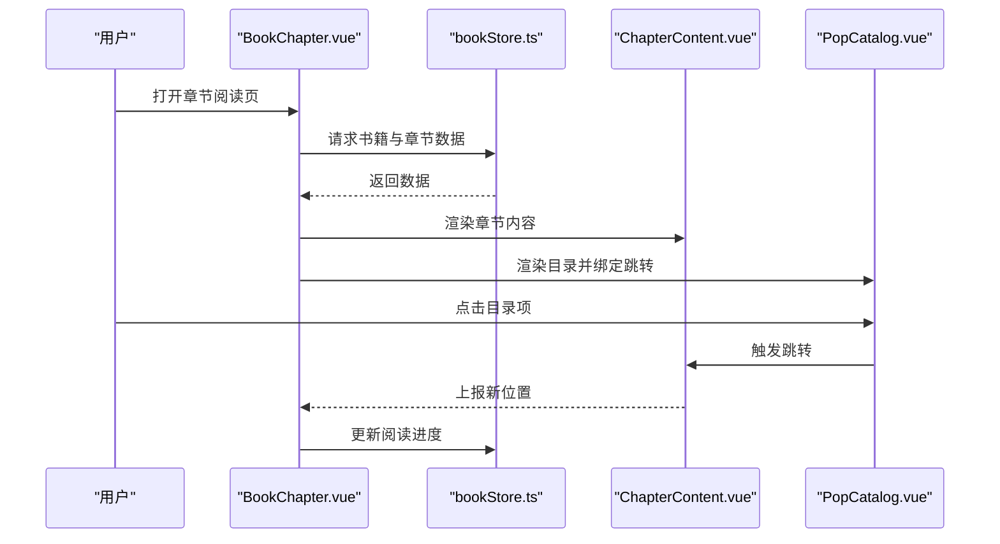
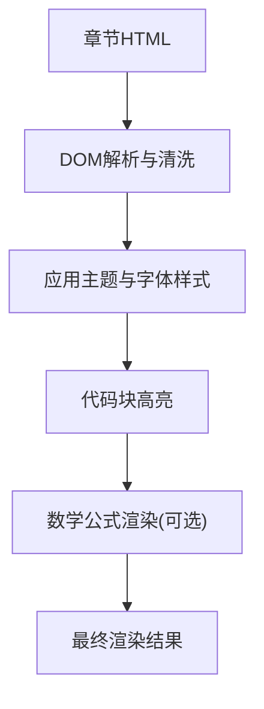
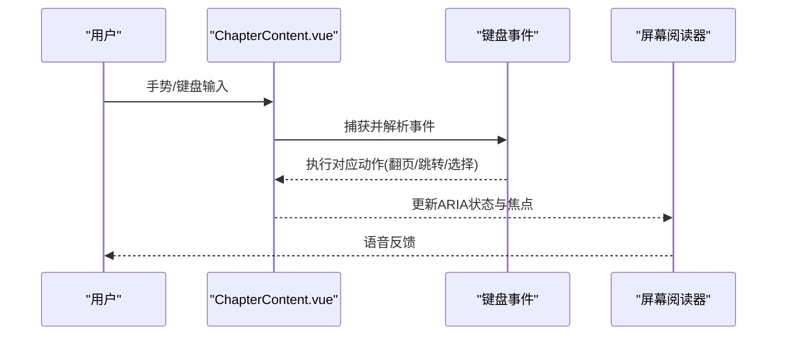
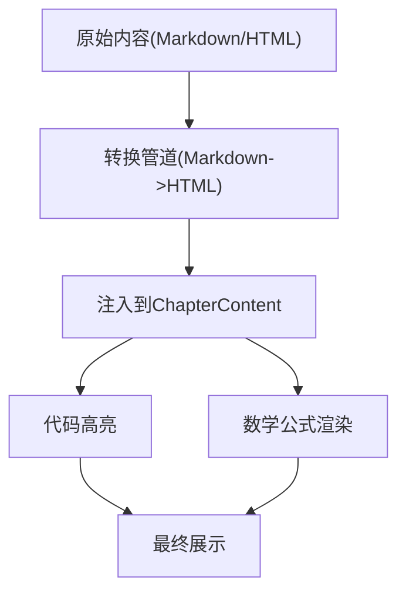
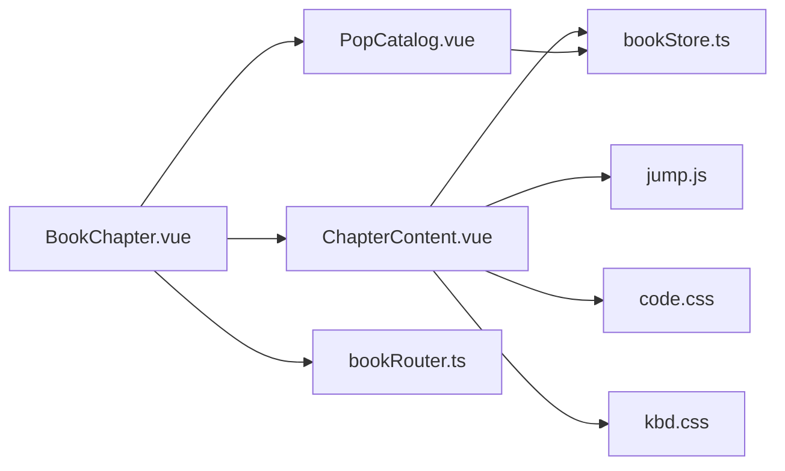

# 内容展示组件

<cite>
**本文档引用的文件**   
- [ChapterContent.vue](file://modules/web/src/components/ChapterContent.vue)
- [PopCatalog.vue](file://modules/web/src/components/PopCatalog.vue)
- [BookChapter.vue](file://modules/web/src/views/BookChapter.vue)
- [bookStore.ts](file://modules/web/src/store/bookStore.ts)
- [jump.js](file://modules/web/src/plugins/jump.js)
- [jump.d.ts](file://modules/web/src/plugins/jump.d.ts)
- [code.css](file://modules/web/src/assets/code.css)
- [kbd.css](file://modules/web/src/assets/kbd.css)
- [bookRouter.ts](file://modules/web/src/router/bookRouter.ts)
- [index.html](file://modules/web/index.html)
</cite>

## 目录
1. [简介](#简介)
2. [项目结构](#项目结构)
3. [核心组件](#核心组件)
4. [架构总览](#架构总览)
5. [详细组件分析](#详细组件分析)
6. [依赖关系分析](#依赖关系分析)
7. [性能考虑](#性能考虑)
8. [故障排查指南](#故障排查指南)
9. [结论](#结论)
10. [附录](#附录)

## 简介
本文件面向Legado Web端的内容展示相关组件，聚焦以下目标：
- ChapterContent章节内容组件：文本渲染、图片处理、链接跳转、书签功能等。
- PopCatalog弹出目录组件：目录导航、快速跳转、搜索定位。
- 内容渲染引擎：HTML解析、样式应用、字体管理。
- 交互能力：手势操作、键盘导航、屏幕阅读器支持。
- 内容格式化方案：Markdown支持、代码高亮、数学公式渲染。
- 使用示例与无障碍访问实现要点。

## 项目结构
Web端内容展示相关代码位于 modules/web 子工程，采用Vue 3 + TypeScript组织。关键目录与职责：
- components：可复用UI组件（如章节内容、弹出目录、阅读设置等）。
- views：页面级视图（如章节阅读页）。
- store：状态管理（书籍数据、阅读进度、主题等）。
- plugins：第三方插件集成（如跳转库）。
- assets：静态资源（CSS样式、字体、图标等）。
- router：路由配置（书籍阅读路由）。

图表来源
- [BookChapter.vue](file://modules/web/src/views/BookChapter.vue)
- [ChapterContent.vue](file://modules/web/src/components/ChapterContent.vue)
- [PopCatalog.vue](file://modules/web/src/components/PopCatalog.vue)
- [bookStore.ts](file://modules/web/src/store/bookStore.ts)
- [jump.js](file://modules/web/src/plugins/jump.js)
- [jump.d.ts](file://modules/web/src/plugins/jump.d.ts)
- [code.css](file://modules/web/src/assets/code.css)
- [kbd.css](file://modules/web/src/assets/kbd.css)
- [bookRouter.ts](file://modules/web/src/router/bookRouter.ts)
- [index.html](file://modules/web/index.html)

章节来源
- [BookChapter.vue](file://modules/web/src/views/BookChapter.vue)
- [ChapterContent.vue](file://modules/web/src/components/ChapterContent.vue)
- [PopCatalog.vue](file://modules/web/src/components/PopCatalog.vue)
- [bookStore.ts](file://modules/web/src/store/bookStore.ts)
- [bookRouter.ts](file://modules/web/src/router/bookRouter.ts)
- [index.html](file://modules/web/index.html)

## 核心组件
- ChapterContent：负责章节内容的渲染与交互，包括文本、图片、链接、书签、滚动定位、手势与键盘事件等。
- PopCatalog：提供目录列表、搜索过滤、点击跳转、选中态同步等功能。
- BookChapter：章节阅读页容器，协调内容组件、目录组件、状态管理与路由。
- bookStore：集中管理书籍元数据、章节列表、阅读进度、主题与字体设置等。
- jump插件：为内容区域提供平滑滚动与锚点跳转能力。

章节来源
- [ChapterContent.vue](file://modules/web/src/components/ChapterContent.vue)
- [PopCatalog.vue](file://modules/web/src/components/PopCatalog.vue)
- [BookChapter.vue](file://modules/web/src/views/BookChapter.vue)
- [bookStore.ts](file://modules/web/src/store/bookStore.ts)
- [jump.js](file://modules/web/src/plugins/jump.js)
- [jump.d.ts](file://modules/web/src/plugins/jump.d.ts)

## 架构总览
内容展示的整体流程如下：
- 路由进入章节阅读页后，BookChapter初始化并加载书籍与章节数据。
- ChapterContent接收章节HTML内容，进行渲染；同时挂载跳转插件以实现锚点定位。
- PopCatalog根据目录数据渲染列表，支持搜索过滤与点击跳转。
- 用户交互（手势、键盘）通过事件监听更新阅读位置与状态，持久化到bookStore或后端存储。

图表来源
- [BookChapter.vue](file://modules/web/src/views/BookChapter.vue)
- [bookStore.ts](file://modules/web/src/store/bookStore.ts)
- [ChapterContent.vue](file://modules/web/src/components/ChapterContent.vue)
- [PopCatalog.vue](file://modules/web/src/components/PopCatalog.vue)
- [jump.js](file://modules/web/src/plugins/jump.js)

## 详细组件分析

### ChapterContent 章节内容组件
职责与特性：
- HTML内容渲染：直接注入章节HTML，确保样式隔离与可控。
- 图片处理：自适应缩放、懒加载、占位图、错误回退。
- 链接跳转：外部链接在新窗口打开，内部锚点平滑滚动。
- 书签功能：在指定位置插入书签标记，支持查看与跳转。
- 交互能力：手势滑动翻页、长按选择、双击放大、键盘导航（上下键、Home/End）。
- 无障碍支持：语义化标签、aria属性、焦点管理、读屏器友好。

图表来源
- [ChapterContent.vue](file://modules/web/src/components/ChapterContent.vue)

章节来源
- [ChapterContent.vue](file://modules/web/src/components/ChapterContent.vue)

### PopCatalog 弹出目录组件
职责与特性：
- 目录渲染：基于章节列表渲染树形或扁平目录。
- 搜索定位：输入关键词实时过滤目录项。
- 快速跳转：点击目录项跳转到对应章节位置。
- 选中态同步：当前阅读位置高亮对应目录项。
- 响应式布局：移动端抽屉式弹出，桌面端侧边栏。

图表来源
- [PopCatalog.vue](file://modules/web/src/components/PopCatalog.vue)

章节来源
- [PopCatalog.vue](file://modules/web/src/components/PopCatalog.vue)

### BookChapter 章节阅读页
职责与特性：
- 页面容器：组合ChapterContent与PopCatalog。
- 数据协调：从bookStore获取书籍与章节数据，传递至子组件。
- 路由联动：根据URL参数切换章节，维护阅读历史。
- 主题与字体：读取用户设置，动态应用样式。

图表来源
- [BookChapter.vue](file://modules/web/src/views/BookChapter.vue)
- [bookStore.ts](file://modules/web/src/store/bookStore.ts)
- [ChapterContent.vue](file://modules/web/src/components/ChapterContent.vue)
- [PopCatalog.vue](file://modules/web/src/components/PopCatalog.vue)

章节来源
- [BookChapter.vue](file://modules/web/src/views/BookChapter.vue)
- [bookStore.ts](file://modules/web/src/store/bookStore.ts)

### 内容渲染引擎
- HTML解析：直接使用innerHTML注入，结合DOM API进行二次处理（如替换相对路径、添加data属性）。
- 样式应用：通过CSS变量与主题类名控制颜色、字号、行高、背景等。
- 字体管理：支持系统字体与自定义字体，动态加载与缓存。
- 代码高亮：引入语法高亮样式（code.css），对代码块进行着色。
- 数学公式：可通过扩展库（如KaTeX/MathJax）集成，按需加载。

图表来源
- [ChapterContent.vue](file://modules/web/src/components/ChapterContent.vue)
- [code.css](file://modules/web/src/assets/code.css)

章节来源
- [ChapterContent.vue](file://modules/web/src/components/ChapterContent.vue)
- [code.css](file://modules/web/src/assets/code.css)

### 交互功能
- 手势操作：左右滑动翻页、长按选择文本、双击放大图片。
- 键盘导航：方向键移动、Enter确认、Esc关闭弹窗、Home/End首尾跳转。
- 屏幕阅读器：语义化标签、aria-label、role属性、焦点顺序优化。

图表来源
- [ChapterContent.vue](file://modules/web/src/components/ChapterContent.vue)
- [kbd.css](file://modules/web/src/assets/kbd.css)

章节来源
- [ChapterContent.vue](file://modules/web/src/components/ChapterContent.vue)
- [kbd.css](file://modules/web/src/assets/kbd.css)

### 内容格式化方案
- Markdown支持：可在服务端或客户端将Markdown转换为HTML后再注入。
- 代码高亮：通过code.css与高亮库对代码块进行着色与行号显示。
- 数学公式：集成KaTeX或MathJax，按需加载并渲染公式。

图表来源
- [ChapterContent.vue](file://modules/web/src/components/ChapterContent.vue)
- [code.css](file://modules/web/src/assets/code.css)

章节来源
- [ChapterContent.vue](file://modules/web/src/components/ChapterContent.vue)
- [code.css](file://modules/web/src/assets/code.css)

## 依赖关系分析
- 组件耦合：BookChapter作为容器，强依赖ChapterContent与PopCatalog；两者均依赖bookStore。
- 插件依赖：ChapterContent依赖jump.js实现平滑滚动与锚点跳转。
- 样式依赖：ChapterContent与PopCatalog共享主题样式，代码高亮依赖code.css，键盘提示依赖kbd.css。
- 路由依赖：BookChapter通过bookRouter.ts管理阅读路由。

图表来源
- [BookChapter.vue](file://modules/web/src/views/BookChapter.vue)
- [ChapterContent.vue](file://modules/web/src/components/ChapterContent.vue)
- [PopCatalog.vue](file://modules/web/src/components/PopCatalog.vue)
- [bookStore.ts](file://modules/web/src/store/bookStore.ts)
- [jump.js](file://modules/web/src/plugins/jump.js)
- [code.css](file://modules/web/src/assets/code.css)
- [kbd.css](file://modules/web/src/assets/kbd.css)
- [bookRouter.ts](file://modules/web/src/router/bookRouter.ts)

章节来源
- [BookChapter.vue](file://modules/web/src/views/BookChapter.vue)
- [ChapterContent.vue](file://modules/web/src/components/ChapterContent.vue)
- [PopCatalog.vue](file://modules/web/src/components/PopCatalog.vue)
- [bookStore.ts](file://modules/web/src/store/bookStore.ts)
- [jump.js](file://modules/web/src/plugins/jump.js)
- [code.css](file://modules/web/src/assets/code.css)
- [kbd.css](file://modules/web/src/assets/kbd.css)
- [bookRouter.ts](file://modules/web/src/router/bookRouter.ts)

## 性能考虑
- 虚拟滚动：长章节内容建议使用虚拟列表或分页加载，避免一次性渲染大量DOM。
- 图片优化：启用懒加载、WebP格式、尺寸适配与CDN缓存。
- 样式与字体：预加载常用字体，减少重排重绘；使用CSS变量提升主题切换效率。
- 事件节流：手势与滚动事件使用节流/防抖，降低主线程压力。
- 内存管理：及时解绑事件监听，释放大对象引用，避免内存泄漏。

[本节为通用指导，不直接分析具体文件]

## 故障排查指南
常见问题与解决思路：
- 目录无法跳转：检查jump插件初始化是否正确，锚点ID是否匹配。
- 图片加载失败：检查网络权限、CORS策略、图片路径是否正确。
- 代码高亮失效：确认code.css已加载，代码块类名是否符合高亮库要求。
- 键盘导航异常：检查事件监听是否被覆盖，焦点管理是否正确。
- 屏幕阅读器无反馈：验证aria属性与语义化标签是否完整。

章节来源
- [ChapterContent.vue](file://modules/web/src/components/ChapterContent.vue)
- [PopCatalog.vue](file://modules/web/src/components/PopCatalog.vue)
- [jump.js](file://modules/web/src/plugins/jump.js)
- [code.css](file://modules/web/src/assets/code.css)
- [kbd.css](file://modules/web/src/assets/kbd.css)

## 结论
本章内容展示了Legado Web端内容展示组件的完整实现方案，涵盖渲染、交互、格式化与无障碍等关键能力。通过模块化设计与清晰的依赖关系，开发者可以快速扩展与维护。建议在实际项目中结合性能优化与用户体验测试，持续迭代完善。

[本节为总结性内容，不直接分析具体文件]

## 附录
- 使用示例：
  - 在BookChapter中引入ChapterContent与PopCatalog，并传入书籍与章节数据。
  - 在ChapterContent中配置主题、字体与行高，启用书签与跳转功能。
  - 在PopCatalog中绑定目录点击事件，调用跳转方法。
- 无障碍最佳实践：
  - 为所有交互元素添加aria-label与role。
  - 确保焦点顺序符合逻辑，支持Tab导航。
  - 提供替代文本与描述，便于读屏器朗读。

[本节为补充说明，不直接分析具体文件]