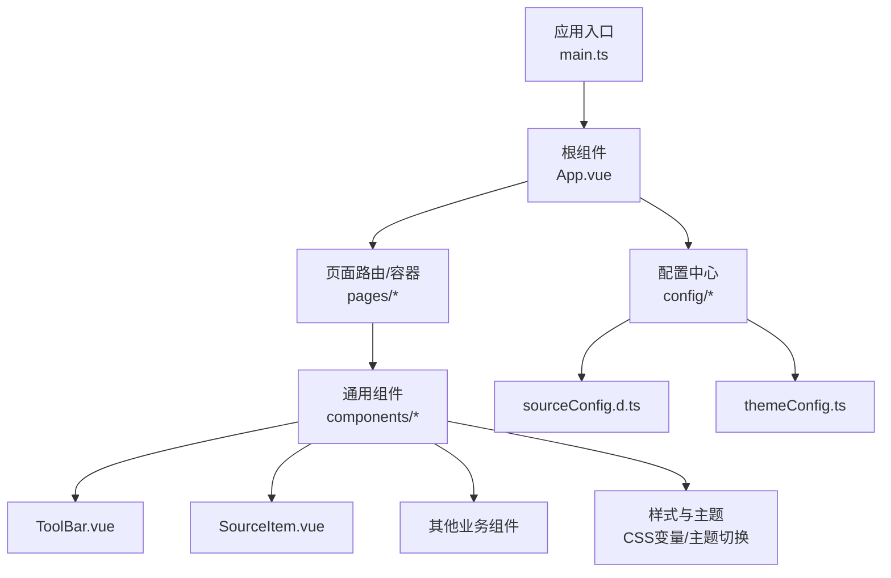
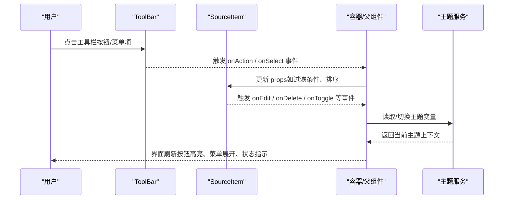
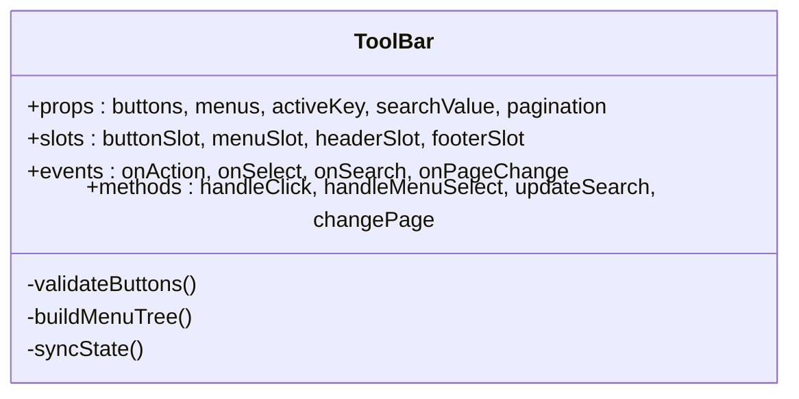
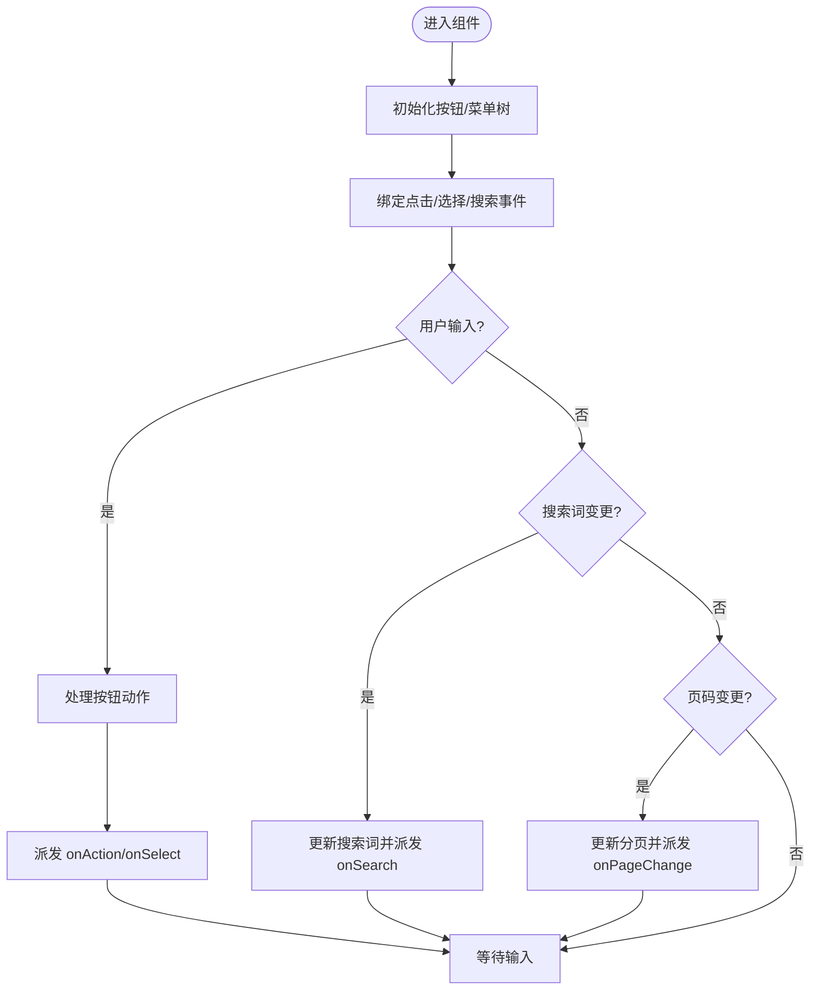
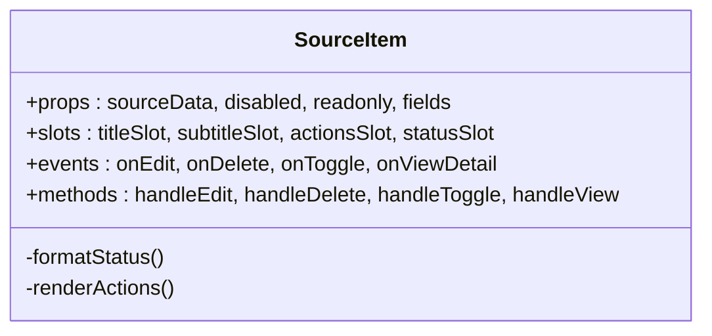
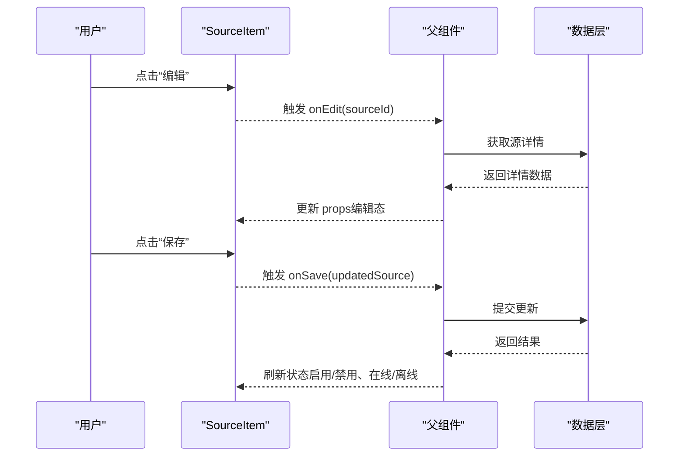
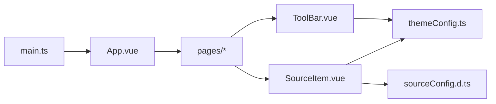

# 基础UI组件

<cite>
**本文引用的文件**   
- [ToolBar.vue](file://modules/web/src/components/ToolBar.vue)
- [SourceItem.vue](file://modules/web/src/components/SourceItem.vue)
- [sourceConfig.d.ts](file://modules/web/src/config/sourceConfig.d.ts)
- [themeConfig.ts](file://modules/web/src/config/themeConfig.ts)
- [App.vue](file://modules/web/src/App.vue)
- [main.ts](file://modules/web/src/main.ts)
- [package.json](file://modules/web/package.json)
</cite>

## 目录
1. [简介](#简介)
2. [项目结构](#项目结构)
3. [核心组件](#核心组件)
4. [架构总览](#架构总览)
5. [详细组件分析](#详细组件分析)
6. [依赖分析](#依赖分析)
7. [性能考虑](#性能考虑)
8. [故障排查指南](#故障排查指南)
9. [结论](#结论)
10. [附录](#附录)

## 简介
本文件面向Legado Web端的“基础UI组件”开发，聚焦以下目标：
- ToolBar工具栏组件：按钮管理、菜单系统、状态同步与事件派发。
- SourceItem源项目组件：信息展示、操作按钮、状态指示与交互流程。
- 通用接口设计：事件系统、属性传递、插槽机制的统一规范。
- 样式系统：CSS变量、主题切换、响应式适配策略。
- 复用策略：组合模式、继承机制、mixins使用建议。
- 提供可复用的组件模板与最佳实践，帮助快速扩展与维护。

## 项目结构
本项目Web端位于 modules/web 目录，采用Vue 3 + TypeScript技术栈，组件集中于 components 目录，配置集中于 config 目录，入口为 main.ts，根视图为 App.vue。

图表来源 
- [main.ts](file://modules/web/src/main.ts)
- [App.vue](file://modules/web/src/App.vue)
- [ToolBar.vue](file://modules/web/src/components/ToolBar.vue)
- [SourceItem.vue](file://modules/web/src/components/SourceItem.vue)
- [sourceConfig.d.ts](file://modules/web/src/config/sourceConfig.d.ts)
- [themeConfig.ts](file://modules/web/src/config/themeConfig.ts)

章节来源
- [main.ts](file://modules/web/src/main.ts)
- [App.vue](file://modules/web/src/App.vue)
- [package.json](file://modules/web/package.json)

## 核心组件
本节概述ToolBar与SourceItem的职责边界与协作关系：
- ToolBar：负责顶部或局部区域的工具栏渲染，包括按钮集合、下拉菜单、搜索框、分页控制等；对外暴露点击事件、选中态变化、菜单项选择等事件。
- SourceItem：用于展示一个“源项目”的摘要信息（名称、图标、状态、描述），并提供常用操作（编辑、删除、启用/禁用、详情）按钮及状态指示器。

章节来源
- [ToolBar.vue](file://modules/web/src/components/ToolBar.vue)
- [SourceItem.vue](file://modules/web/src/components/SourceItem.vue)

## 架构总览
ToolBar与SourceItem通过统一的props与事件契约进行通信，由上层容器（如页面或列表容器）协调数据流与状态。主题与样式通过CSS变量集中管理，支持明暗主题与响应式布局。

图表来源 
- [ToolBar.vue](file://modules/web/src/components/ToolBar.vue)
- [SourceItem.vue](file://modules/web/src/components/SourceItem.vue)
- [themeConfig.ts](file://modules/web/src/config/themeConfig.ts)

## 详细组件分析

### ToolBar 工具栏组件
职责与能力
- 按钮管理：动态渲染按钮数组，支持图标、文本、禁用态、分隔符。
- 菜单系统：支持下拉菜单、级联菜单、快捷键提示、选中态同步。
- 状态同步：与父组件保持选中态、搜索词、分页参数等同步。
- 事件系统：统一派发 action、select、search、pageChange 等事件。

关键设计要点
- 输入属性（props）：按钮定义、菜单定义、当前选中项、搜索词、分页信息等。
- 插槽机制：允许自定义按钮内容、菜单项渲染、头部/尾部区域。
- 样式系统：基于CSS变量的主题色、间距、圆角、阴影；响应式断点控制布局。
- 可访问性：键盘导航、ARIA标签、焦点管理。

图表来源 
- [ToolBar.vue](file://modules/web/src/components/ToolBar.vue)

图表来源 
- [ToolBar.vue](file://modules/web/src/components/ToolBar.vue)

章节来源
- [ToolBar.vue](file://modules/web/src/components/ToolBar.vue)

### SourceItem 源项目组件
职责与能力
- 信息展示：名称、图标、描述、状态标签（在线/离线、启用/禁用）。
- 操作按钮：编辑、删除、启用/禁用、查看详情等。
- 状态指示：加载、错误、成功、警告等状态反馈。
- 交互流程：点击操作后向父组件派发事件，由父组件决定数据更新与UI刷新。

关键设计要点
- 输入属性（props）：源数据对象、是否禁用、是否只读、显示字段开关。
- 插槽机制：允许自定义标题、副标题、操作区、状态区。
- 事件系统：onEdit、onDelete、onToggle、onViewDetail 等。
- 样式系统：卡片布局、悬停效果、状态颜色、响应式排版。

图表来源 
- [SourceItem.vue](file://modules/web/src/components/SourceItem.vue)

图表来源 
- [SourceItem.vue](file://modules/web/src/components/SourceItem.vue)

章节来源
- [SourceItem.vue](file://modules/web/src/components/SourceItem.vue)

### 通用接口设计
- 事件系统：所有组件统一使用 emit 派发命名事件，避免直接修改父组件状态。
- 属性传递：通过 props 声明必填/可选字段，配合类型定义确保一致性。
- 插槽机制：提供默认插槽与具名插槽，便于灵活定制内容。
- 表单与校验：对输入型组件提供 v-model 支持与校验回调。

章节来源
- [sourceConfig.d.ts](file://modules/web/src/config/sourceConfig.d.ts)

### 样式系统与主题
- CSS变量：集中定义颜色、字号、间距、圆角、阴影等，便于主题切换。
- 主题切换：通过 themeConfig 管理明暗主题，运行时切换变量值。
- 响应式设计：使用媒体查询与弹性布局，适配手机、平板、桌面。
- 组件样式隔离：优先使用 scoped 样式，必要时通过CSS变量全局覆盖。

章节来源
- [themeConfig.ts](file://modules/web/src/config/themeConfig.ts)

## 依赖分析
组件间依赖关系清晰，ToolBar与SourceItem无直接耦合，均通过父组件协调。主题配置独立，供多组件共享。

图表来源 
- [main.ts](file://modules/web/src/main.ts)
- [App.vue](file://modules/web/src/App.vue)
- [ToolBar.vue](file://modules/web/src/components/ToolBar.vue)
- [SourceItem.vue](file://modules/web/src/components/SourceItem.vue)
- [themeConfig.ts](file://modules/web/src/config/themeConfig.ts)
- [sourceConfig.d.ts](file://modules/web/src/config/sourceConfig.d.ts)

章节来源
- [package.json](file://modules/web/package.json)

## 性能考虑
- 虚拟滚动：长列表场景建议使用虚拟滚动优化渲染。
- 懒加载：图片与重型组件按需加载。
- 事件节流/防抖：搜索与频繁点击操作需加节流/防抖。
- 计算缓存：复杂计算使用 computed 或 useMemo 类缓存。
- 样式优化：减少重排重绘，合理使用CSS变量与硬件加速。

[本节为通用指导，不直接分析具体文件]

## 故障排查指南
常见问题与定位方法
- 事件未触发：检查组件是否正确 emit，父组件是否监听对应事件。
- 状态不同步：确认 props 单向数据流，避免在子组件直接修改。
- 主题不生效：检查CSS变量是否被正确覆盖，浏览器开发者工具查看计算样式。
- 插槽未渲染：确认插槽名称与父组件传入一致，注意作用域插槽的数据传递。
- 响应式异常：检查媒体查询断点与容器宽度，确保父容器有明确尺寸。

章节来源
- [ToolBar.vue](file://modules/web/src/components/ToolBar.vue)
- [SourceItem.vue](file://modules/web/src/components/SourceItem.vue)
- [themeConfig.ts](file://modules/web/src/config/themeConfig.ts)

## 结论
ToolBar与SourceItem作为基础UI组件，提供了稳定的交互与展示能力。通过统一的事件系统、属性传递与插槽机制，结合CSS变量与主题配置，实现了良好的可维护性与可扩展性。遵循本文档的最佳实践，可快速构建一致的界面体验。

[本节为总结，不直接分析具体文件]

## 附录
- 组件开发模板建议：
  - 组件命名：大驼峰，语义化。
  - Props定义：严格类型，默认值明确。
  - 事件命名：动词+名词，如 onAction、onSelect。
  - 插槽设计：默认插槽+具名插槽，作用域数据清晰。
  - 样式组织：scoped优先，CSS变量统一管理。
- 复用策略：
  - 组合模式：将小功能拆分为小组件，组合成复杂组件。
  - 继承机制：谨慎使用，优先组合。
  - Mixins：逐步迁移至Composition API，避免命名冲突。
- 测试建议：单元测试覆盖事件与状态，集成测试验证交互流程。

[本节为通用指导，不直接分析具体文件]