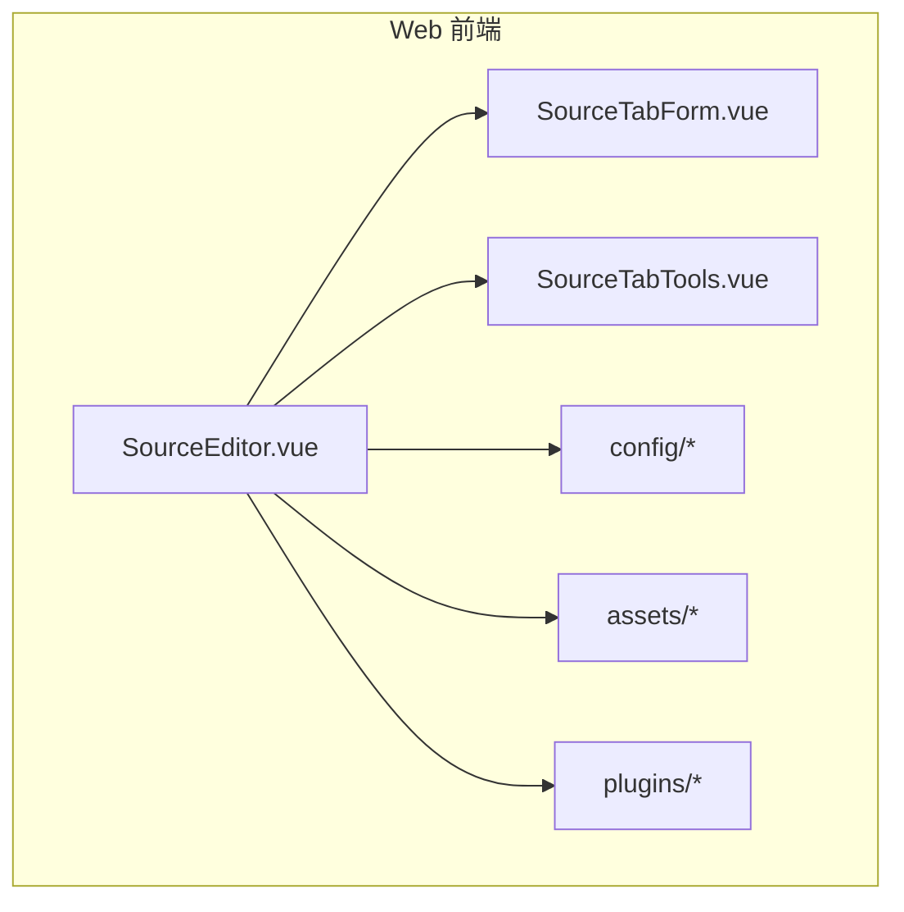
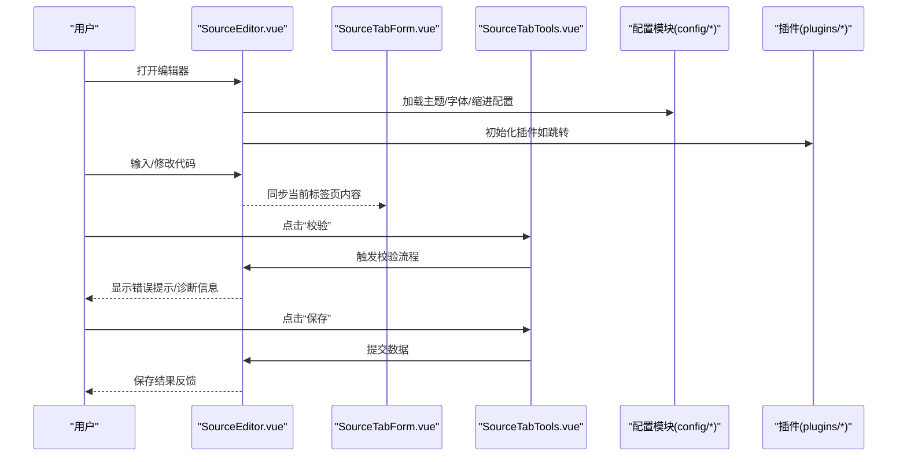
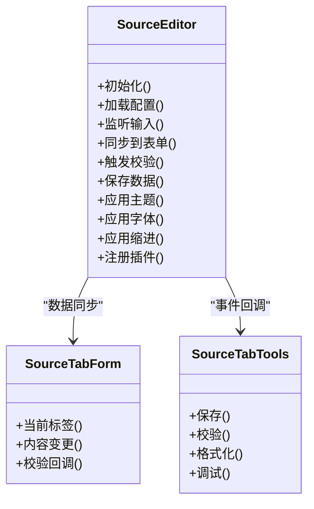
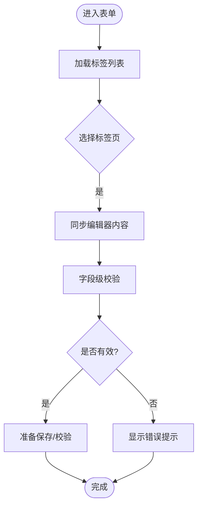
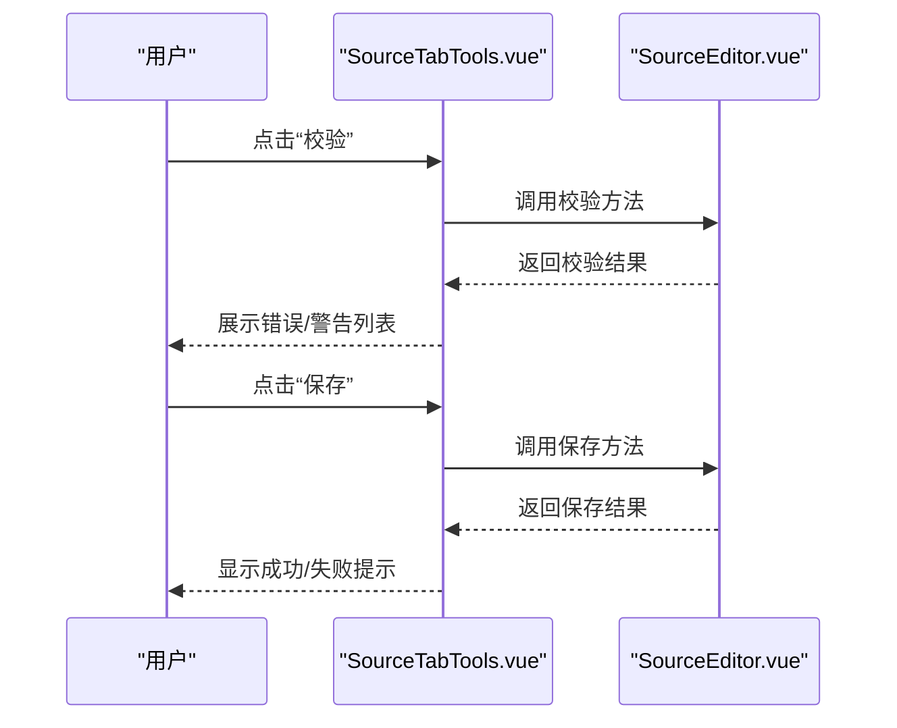
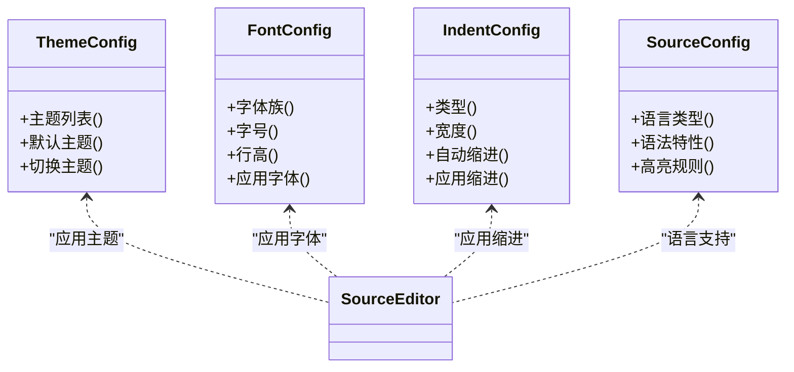
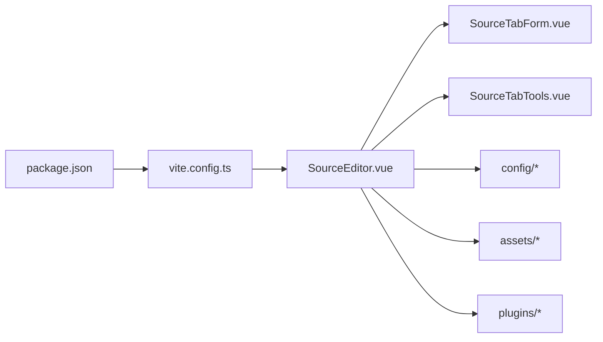

# 源码编辑器组件

<cite>
**本文引用的文件**   
- [SourceEditor.vue](file://modules/web/src/views/SourceEditor.vue)
- [SourceTabForm.vue](file://modules/web/src/components/SourceTabForm.vue)
- [SourceTabTools.vue](file://modules/web/src/components/SourceTabTools.vue)
- [sourceConfig.d.ts](file://modules/web/src/config/sourceConfig.d.ts)
- [themeConfig.ts](file://modules/web/src/config/themeConfig.ts)
- [bookSourceEditConfig.ts](file://modules/web/src/config/bookSourceEditConfig.ts)
- [rssSourceEditConfig.ts](file://modules/web/src/config/rssSourceEditConfig.ts)
- [code.css](file://modules/web/src/assets/code.css)
- [sourceeditor.css](file://modules/web/src/assets/sourceeditor.css)
- [jump.js](file://modules/web/src/plugins/jump.js)
- [jump.d.ts](file://modules/web/src/plugins/jump.d.ts)
- [package.json](file://modules/web/package.json)
- [vite.config.ts](file://modules/web/vite.config.ts)
</cite>

## 目录
1. [简介](#简介)
2. [项目结构](#项目结构)
3. [核心组件](#核心组件)
4. [架构总览](#架构总览)
5. [详细组件分析](#详细组件分析)
6. [依赖关系分析](#依赖关系分析)
7. [性能考虑](#性能考虑)
8. [故障排查指南](#故障排查指南)
9. [结论](#结论)
10. [附录](#附录)

## 简介
本文件面向开发者与使用者，系统化说明源码编辑器组件的实现与使用。重点覆盖：
- SourceEditor 组件的代码编辑能力（语法高亮、自动补全、错误提示）
- SourceTabForm 表单组件与 SourceTabTools 工具栏组件的集成方式
- 编辑器配置项（主题、字体、缩进规则等）
- 代码验证机制（实时语法检查、规则校验、调试输出）
- 扩展开发指南（自定义语言支持、快捷键绑定、插件开发）
- 使用示例与性能优化技巧

该文档基于仓库中的 Web 前端模块进行梳理，确保所有技术细节均可追溯至具体源文件。

## 项目结构
Web 端源码编辑器位于 modules/web 目录下，采用 Vue 3 + TypeScript + Vite 的工程组织方式。关键目录与职责如下：
- views/SourceEditor.vue：主视图容器，负责编排编辑器、表单与工具栏
- components/SourceTabForm.vue：以 Tab 形式组织字段表单，驱动编辑器数据双向绑定
- components/SourceTabTools.vue：提供保存、校验、格式化、调试等工具操作
- config/*：编辑器与语言相关配置（类型定义、主题、不同来源编辑器的配置）
- assets/*：编辑器样式与资源（代码高亮样式、编辑器整体样式）
- plugins/*：编辑器插件（如跳转辅助）
- package.json / vite.config.ts：构建与依赖管理

图表来源
- [SourceEditor.vue](file://modules/web/src/views/SourceEditor.vue)
- [SourceTabForm.vue](file://modules/web/src/components/SourceTabForm.vue)
- [SourceTabTools.vue](file://modules/web/src/components/SourceTabTools.vue)
- [sourceConfig.d.ts](file://modules/web/src/config/sourceConfig.d.ts)
- [themeConfig.ts](file://modules/web/src/config/themeConfig.ts)
- [bookSourceEditConfig.ts](file://modules/web/src/config/bookSourceEditConfig.ts)
- [rssSourceEditConfig.ts](file://modules/web/src/config/rssSourceEditConfig.ts)
- [code.css](file://modules/web/src/assets/code.css)
- [sourceeditor.css](file://modules/web/src/assets/sourceeditor.css)
- [jump.js](file://modules/web/src/plugins/jump.js)
- [jump.d.ts](file://modules/web/src/plugins/jump.d.ts)

章节来源
- [SourceEditor.vue](file://modules/web/src/views/SourceEditor.vue)
- [SourceTabForm.vue](file://modules/web/src/components/SourceTabForm.vue)
- [SourceTabTools.vue](file://modules/web/src/components/SourceTabTools.vue)
- [sourceConfig.d.ts](file://modules/web/src/config/sourceConfig.d.ts)
- [themeConfig.ts](file://modules/web/src/config/themeConfig.ts)
- [bookSourceEditConfig.ts](file://modules/web/src/config/bookSourceEditConfig.ts)
- [rssSourceEditConfig.ts](file://modules/web/src/config/rssSourceEditConfig.ts)
- [code.css](file://modules/web/src/assets/code.css)
- [sourceeditor.css](file://modules/web/src/assets/sourceeditor.css)
- [jump.js](file://modules/web/src/plugins/jump.js)
- [jump.d.ts](file://modules/web/src/plugins/jump.d.ts)
- [package.json](file://modules/web/package.json)
- [vite.config.ts](file://modules/web/vite.config.ts)

## 核心组件
- SourceEditor 主视图：组合编辑器实例、表单与工具栏，协调数据流与事件回调
- SourceTabForm 表单：以 Tab 分组展示字段，驱动编辑器内容更新与校验
- SourceTabTools 工具栏：提供保存、校验、格式化、调试等快捷操作

这些组件通过 props/events 或状态管理进行通信，保证编辑体验一致性与可维护性。

章节来源
- [SourceEditor.vue](file://modules/web/src/views/SourceEditor.vue)
- [SourceTabForm.vue](file://modules/web/src/components/SourceTabForm.vue)
- [SourceTabTools.vue](file://modules/web/src/components/SourceTabTools.vue)

## 架构总览
下图展示了编辑器在页面中的交互流程：用户输入触发编辑器事件，表单与工具栏响应并执行相应逻辑（校验、保存、调试），同时通过配置模块加载主题与语言支持。

图表来源
- [SourceEditor.vue](file://modules/web/src/views/SourceEditor.vue)
- [SourceTabForm.vue](file://modules/web/src/components/SourceTabForm.vue)
- [SourceTabTools.vue](file://modules/web/src/components/SourceTabTools.vue)
- [sourceConfig.d.ts](file://modules/web/src/config/sourceConfig.d.ts)
- [themeConfig.ts](file://modules/web/src/config/themeConfig.ts)
- [bookSourceEditConfig.ts](file://modules/web/src/config/bookSourceEditConfig.ts)
- [rssSourceEditConfig.ts](file://modules/web/src/config/rssSourceEditConfig.ts)
- [jump.js](file://modules/web/src/plugins/jump.js)
- [jump.d.ts](file://modules/web/src/plugins/jump.d.ts)

## 详细组件分析

### SourceEditor 组件
- 功能要点
  - 初始化编辑器实例，挂载语法高亮、自动补全、错误提示
  - 监听文本变更事件，与表单和工具栏保持数据同步
  - 根据配置动态切换主题、字体、缩进规则
  - 集成插件（如跳转），增强编辑体验
- 数据流
  - 从 SourceTabForm 获取当前标签页内容与元数据
  - 向 SourceTabTools 暴露校验、保存、格式化等方法
  - 读取配置模块的主题与语言设置，实时更新编辑器外观与行为
- 错误处理
  - 捕获语法错误与运行时异常，定位行号并展示诊断信息
  - 对无效配置进行降级处理，保障编辑器可用性

图表来源
- [SourceEditor.vue](file://modules/web/src/views/SourceEditor.vue)
- [SourceTabForm.vue](file://modules/web/src/components/SourceTabForm.vue)
- [SourceTabTools.vue](file://modules/web/src/components/SourceTabTools.vue)

章节来源
- [SourceEditor.vue](file://modules/web/src/views/SourceEditor.vue)

### SourceTabForm 表单组件
- 功能要点
  - 以 Tab 分组展示字段，支持多标签页编辑
  - 与编辑器内容双向绑定，确保输入即时反映
  - 提供字段级校验与全局校验入口
- 数据流
  - 接收来自 SourceEditor 的内容变更事件
  - 将校验结果回传给 SourceEditor 用于错误提示
- 交互设计
  - 切换标签时自动恢复对应内容
  - 保存前统一校验，失败则阻止提交

图表来源
- [SourceTabForm.vue](file://modules/web/src/components/SourceTabForm.vue)

章节来源
- [SourceTabForm.vue](file://modules/web/src/components/SourceTabForm.vue)

### SourceTabTools 工具栏组件
- 功能要点
  - 提供保存、校验、格式化、调试等常用操作
  - 与 SourceEditor 协作触发相应方法
  - 显示操作结果与状态反馈
- 数据流
  - 调用 SourceEditor 的方法执行动作
  - 接收返回结果并更新 UI 状态
- 错误处理
  - 对失败操作给出明确提示，必要时回滚状态

图表来源
- [SourceTabTools.vue](file://modules/web/src/components/SourceTabTools.vue)
- [SourceEditor.vue](file://modules/web/src/views/SourceEditor.vue)

章节来源
- [SourceTabTools.vue](file://modules/web/src/components/SourceTabTools.vue)

### 配置与主题
- 配置项
  - 主题设置：通过 themeConfig.ts 定义主题集合与默认值
  - 字体配置：支持字体族、字号、行高等选项
  - 缩进规则：空格/制表符、缩进宽度、自动缩进开关
  - 语言支持：通过 sourceConfig.d.ts 定义语言类型与语法特性
- 编辑器行为
  - 根据配置动态应用主题、字体与缩进
  - 为不同来源（书籍源、RSS 源）提供专用编辑配置

图表来源
- [themeConfig.ts](file://modules/web/src/config/themeConfig.ts)
- [sourceConfig.d.ts](file://modules/web/src/config/sourceConfig.d.ts)
- [bookSourceEditConfig.ts](file://modules/web/src/config/bookSourceEditConfig.ts)
- [rssSourceEditConfig.ts](file://modules/web/src/config/rssSourceEditConfig.ts)
- [SourceEditor.vue](file://modules/web/src/views/SourceEditor.vue)

章节来源
- [themeConfig.ts](file://modules/web/src/config/themeConfig.ts)
- [sourceConfig.d.ts](file://modules/web/src/config/sourceConfig.d.ts)
- [bookSourceEditConfig.ts](file://modules/web/src/config/bookSourceEditConfig.ts)
- [rssSourceEditConfig.ts](file://modules/web/src/config/rssSourceEditConfig.ts)

### 样式与资源
- code.css：代码高亮样式、关键字颜色、注释样式等
- sourceeditor.css：编辑器容器布局、滚动条、行号区域等
- 插件资源：如 jump.js/d.ts 提供的跳转辅助能力

章节来源
- [code.css](file://modules/web/src/assets/code.css)
- [sourceeditor.css](file://modules/web/src/assets/sourceeditor.css)
- [jump.js](file://modules/web/src/plugins/jump.js)
- [jump.d.ts](file://modules/web/src/plugins/jump.d.ts)

### 插件与扩展
- 插件机制
  - 通过 plugins/* 目录集中管理插件，按需加载
  - 插件可注入编辑器能力（如跳转、命令面板）
- 自定义语言支持
  - 基于 sourceConfig.d.ts 扩展语言类型与语法特性
  - 结合 code.css 定制高亮样式
- 快捷键绑定
  - 在编辑器初始化阶段注册快捷键映射
  - 支持跨平台兼容与冲突检测

章节来源
- [jump.js](file://modules/web/src/plugins/jump.js)
- [jump.d.ts](file://modules/web/src/plugins/jump.d.ts)
- [sourceConfig.d.ts](file://modules/web/src/config/sourceConfig.d.ts)
- [code.css](file://modules/web/src/assets/code.css)

## 依赖关系分析
- 构建与依赖
  - package.json：声明编辑器相关依赖（如 Vue、TypeScript、Vite、可能的编辑器内核库）
  - vite.config.ts：配置构建流程、别名、插件链
- 组件耦合
  - SourceEditor 依赖 SourceTabForm 与 SourceTabTools，形成松耦合的事件驱动架构
  - 配置模块独立于 UI，便于复用与测试

图表来源
- [package.json](file://modules/web/package.json)
- [vite.config.ts](file://modules/web/vite.config.ts)
- [SourceEditor.vue](file://modules/web/src/views/SourceEditor.vue)
- [SourceTabForm.vue](file://modules/web/src/components/SourceTabForm.vue)
- [SourceTabTools.vue](file://modules/web/src/components/SourceTabTools.vue)
- [sourceConfig.d.ts](file://modules/web/src/config/sourceConfig.d.ts)
- [themeConfig.ts](file://modules/web/src/config/themeConfig.ts)
- [bookSourceEditConfig.ts](file://modules/web/src/config/bookSourceEditConfig.ts)
- [rssSourceEditConfig.ts](file://modules/web/src/config/rssSourceEditConfig.ts)
- [code.css](file://modules/web/src/assets/code.css)
- [sourceeditor.css](file://modules/web/src/assets/sourceeditor.css)
- [jump.js](file://modules/web/src/plugins/jump.js)
- [jump.d.ts](file://modules/web/src/plugins/jump.d.ts)

章节来源
- [package.json](file://modules/web/package.json)
- [vite.config.ts](file://modules/web/vite.config.ts)

## 性能考虑
- 渲染优化
  - 延迟加载大型语法高亮规则，按需启用
  - 使用虚拟滚动或分页策略处理大文件
- 内存管理
  - 及时释放编辑器实例与插件资源
  - 避免重复创建对象，复用配置与样式
- 网络与缓存
  - 静态资源（主题、字体）启用缓存策略
  - 懒加载插件与语言包
- 构建优化
  - 使用 Vite 的按需打包与代码分割
  - 压缩与 Tree-shaking 减少体积

[本节为通用指导，不直接分析具体文件]

## 故障排查指南
- 常见问题
  - 语法高亮失效：检查语言配置与高亮样式是否正确加载
  - 自动补全无响应：确认插件已注册且未发生冲突
  - 错误提示不显示：验证校验逻辑与回调链路
  - 主题/字体不生效：检查配置项与样式优先级
- 调试建议
  - 使用浏览器开发者工具查看网络请求与资源加载
  - 在编辑器事件中打点日志，追踪数据流
  - 逐步禁用插件定位问题来源

章节来源
- [SourceEditor.vue](file://modules/web/src/views/SourceEditor.vue)
- [SourceTabForm.vue](file://modules/web/src/components/SourceTabForm.vue)
- [SourceTabTools.vue](file://modules/web/src/components/SourceTabTools.vue)

## 结论
本源码编辑器组件通过清晰的组件划分与配置化设计，提供了完整的代码编辑能力。借助 SourceTabForm 与 SourceTabTools，实现了表单驱动与工具集成的良好体验。通过可扩展的语言支持与插件机制，开发者可灵活定制编辑器行为。建议在大规模使用中关注性能优化与错误处理，确保稳定高效的编辑体验。

[本节为总结性内容，不直接分析具体文件]

## 附录
- 使用示例
  - 基础用法：引入 SourceEditor，传入初始内容与配置
  - 主题切换：调用主题配置接口动态更换主题
  - 自定义语言：扩展 sourceConfig.d.ts，注册新语言与高亮规则
  - 快捷键绑定：在编辑器初始化阶段注册键位映射
- 最佳实践
  - 将配置抽离为独立模块，便于管理与测试
  - 使用事件驱动而非强耦合调用，提升可维护性
  - 对大文件进行分块处理，避免阻塞主线程

[本节为补充说明，不直接分析具体文件]