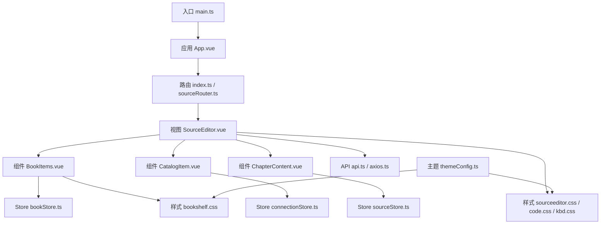
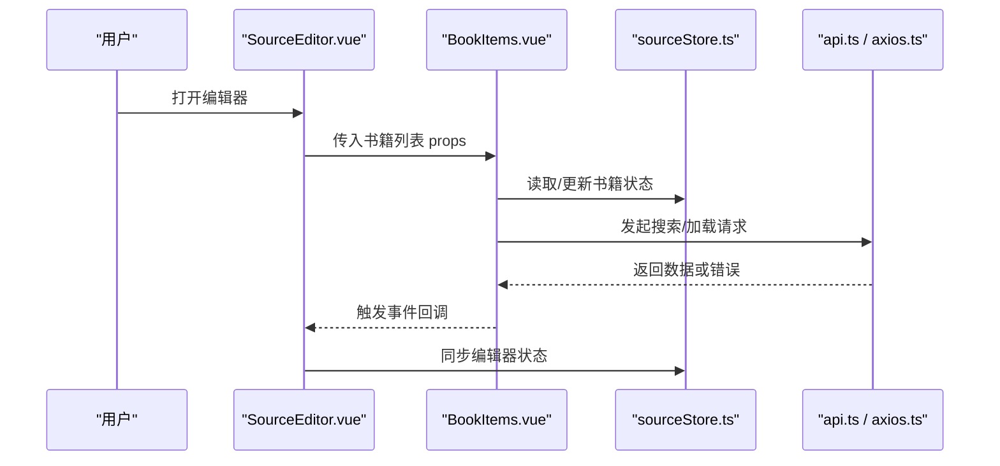
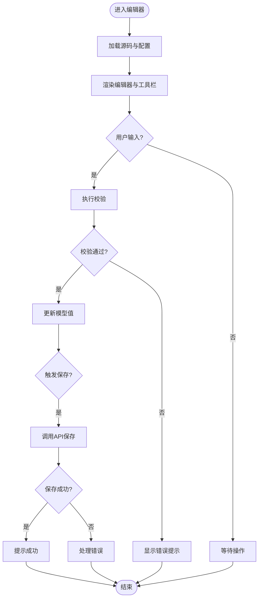
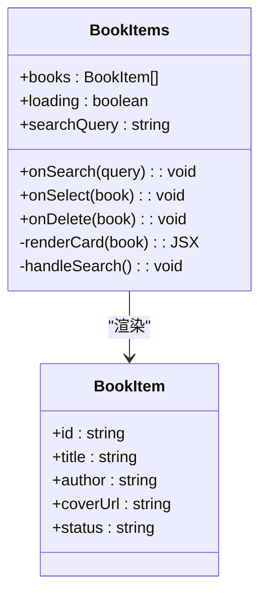
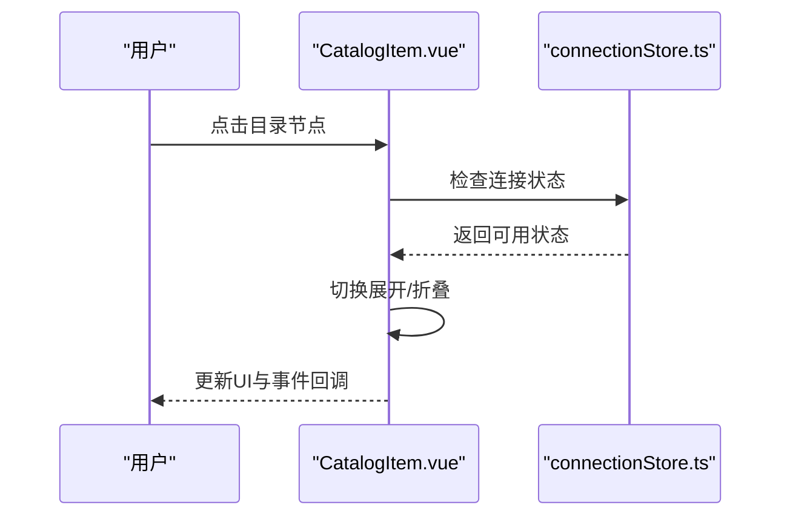
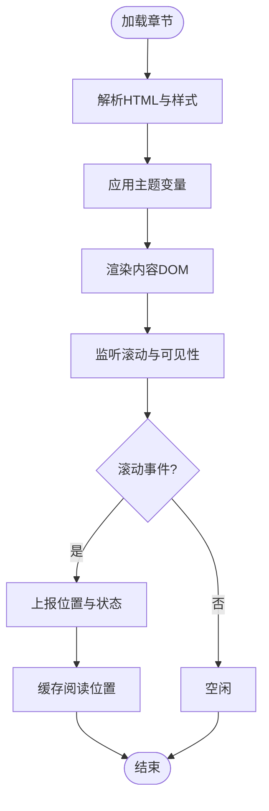
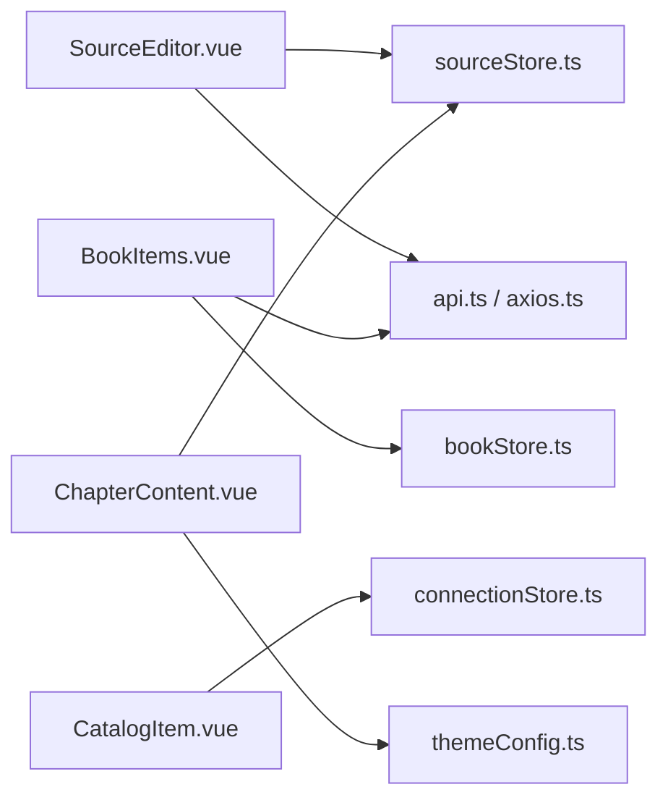

# 组件开发规范

<cite>
**本文引用的文件**   
- [SourceEditor.vue](file://modules/web/src/views/SourceEditor.vue)
- [BookItems.vue](file://modules/web/src/components/BookItems.vue)
- [CatalogItem.vue](file://modules/web/src/components/CatalogItem.vue)
- [ChapterContent.vue](file://modules/web/src/components/ChapterContent.vue)
- [sourceeditor.css](file://modules/web/src/assets/sourceeditor.css)
- [bookshelf.css](file://modules/web/src/assets/bookshelf.css)
- [code.css](file://modules/web/src/assets/code.css)
- [kbd.css](file://modules/web/src/assets/kbd.css)
- [themeConfig.ts](file://modules/web/src/config/themeConfig.ts)
- [sourceStore.ts](file://modules/web/src/store/sourceStore.ts)
- [bookStore.ts](file://modules/web/src/store/bookStore.ts)
- [connectionStore.ts](file://modules/web/src/store/connectionStore.ts)
- [index.ts](file://modules/web/src/router/index.ts)
- [sourceRouter.ts](file://modules/web/src/router/sourceRouter.ts)
- [api.ts](file://modules/web/src/api/api.ts)
- [axios.ts](file://modules/web/src/api/axios.ts)
- [main.ts](file://modules/web/src/main.ts)
- [App.vue](file://modules/web/src/App.vue)
- [package.json](file://modules/web/package.json)
- [vite.config.ts](file://modules/web/vite.config.ts)
</cite>

## 目录
1. [简介](#简介)
2. [项目结构](#项目结构)
3. [核心组件](#核心组件)
4. [架构总览](#架构总览)
5. [详细组件分析](#详细组件分析)
6. [依赖分析](#依赖分析)
7. [性能考虑](#性能考虑)
8. [故障排查指南](#故障排查指南)
9. [结论](#结论)
10. [附录](#附录)

## 简介
本规范面向Legado Web端界面组件开发，聚焦以下核心组件：SourceEditor源码编辑器、BookItems书籍列表、CatalogItem目录项、ChapterContent章节内容。文档从设计原则（单一职责、可复用性、可测试性）、Props接口与事件机制、插槽使用模式、样式管理策略（CSS模块化、主题变量、响应式）、最佳实践（性能优化、错误处理、无障碍）等方面展开，并提供使用示例与调试技巧，帮助开发者快速上手并高质量交付。

## 项目结构
Web端位于 modules/web 目录，采用Vue 3 + TypeScript + Vite 构建，组件按功能划分在 src/components 与 src/views 下，样式以CSS模块或独立CSS文件组织，状态通过Pinia Store管理，路由由Vue Router配置，API请求基于Axios封装。

图表来源
- [main.ts](file://modules/web/src/main.ts)
- [App.vue](file://modules/web/src/App.vue)
- [index.ts](file://modules/web/src/router/index.ts)
- [sourceRouter.ts](file://modules/web/src/router/sourceRouter.ts)
- [SourceEditor.vue](file://modules/web/src/views/SourceEditor.vue)
- [BookItems.vue](file://modules/web/src/components/BookItems.vue)
- [CatalogItem.vue](file://modules/web/src/components/CatalogItem.vue)
- [ChapterContent.vue](file://modules/web/src/components/ChapterContent.vue)
- [sourceeditor.css](file://modules/web/src/assets/sourceeditor.css)
- [bookshelf.css](file://modules/web/src/assets/bookshelf.css)
- [code.css](file://modules/web/src/assets/code.css)
- [kbd.css](file://modules/web/src/assets/kbd.css)
- [themeConfig.ts](file://modules/web/src/config/themeConfig.ts)
- [sourceStore.ts](file://modules/web/src/store/sourceStore.ts)
- [bookStore.ts](file://modules/web/src/store/bookStore.ts)
- [connectionStore.ts](file://modules/web/src/store/connectionStore.ts)
- [api.ts](file://modules/web/src/api/api.ts)
- [axios.ts](file://modules/web/src/api/axios.ts)

章节来源
- [package.json](file://modules/web/package.json)
- [vite.config.ts](file://modules/web/vite.config.ts)

## 核心组件
- SourceEditor 源码编辑器：提供规则/脚本编辑能力，支持语法高亮、快捷键、保存与校验、错误提示等。
- BookItems 书籍列表：展示书籍卡片网格，支持搜索、排序、分页与交互操作。
- CatalogItem 目录项：渲染目录节点，支持层级展开/折叠、选中态、跳转阅读。
- ChapterContent 章节内容：渲染章节正文，支持字体、行距、背景主题切换与滚动定位。

设计原则
- 单一职责：每个组件仅负责一个业务领域，如列表渲染、内容展示、编辑器行为。
- 可复用性：通过props定义输入、events定义输出、slots扩展局部UI，避免硬编码。
- 可测试性：纯函数化数据处理、明确边界条件、Mock API与Store以便单元测试。

章节来源
- [SourceEditor.vue](file://modules/web/src/views/SourceEditor.vue)
- [BookItems.vue](file://modules/web/src/components/BookItems.vue)
- [CatalogItem.vue](file://modules/web/src/components/CatalogItem.vue)
- [ChapterContent.vue](file://modules/web/src/components/ChapterContent.vue)

## 架构总览
Web端采用“视图-组件-状态-API”分层：
- 视图层：页面级容器，协调组件组合与路由导航。
- 组件层：UI与交互逻辑，通过props/events与父组件通信。
- 状态层：Pinia Store集中管理数据与副作用。
- 网络层：Axios封装统一请求、拦截器、错误处理。

图表来源
- [SourceEditor.vue](file://modules/web/src/views/SourceEditor.vue)
- [BookItems.vue](file://modules/web/src/components/BookItems.vue)
- [sourceStore.ts](file://modules/web/src/store/sourceStore.ts)
- [api.ts](file://modules/web/src/api/api.ts)
- [axios.ts](file://modules/web/src/api/axios.ts)

## 详细组件分析

### SourceEditor 源码编辑器
职责
- 规则/脚本的编辑、格式化、校验、保存。
- 快捷键绑定、撤销重做、错误提示。
- 与后端API交互，获取/提交源码。

Props接口建议
- modelValue: string | null 当前编辑内容
- language: string 语言类型（如javascript/json）
- readOnly: boolean 只读模式
- validate: (text) => ValidationResult 校验函数
- onSave: (text) => void 保存回调
- onError: (error) => void 错误回调

事件机制
- update:modelValue：双向绑定内容变更
- save：触发保存流程
- error：抛出校验或网络错误

插槽使用模式
- actions：自定义工具栏按钮
- error：自定义错误提示区域
- footer：显示统计信息或快捷操作

样式管理
- 使用 sourceeditor.css 与 code.css 进行模块化样式隔离
- 通过 themeConfig.ts 主题变量控制配色、字号、行高
- 响应式适配移动端键盘高度与屏幕宽度

性能优化
- 大文本分片渲染与虚拟滚动
- 防抖保存与增量校验
- 懒加载语法高亮资源

无障碍访问
- 为编辑器容器添加 role="textbox" 与 aria-label
- 错误提示使用 aria-live 通知
- 快捷键增加键盘导航提示

图表来源
- [SourceEditor.vue](file://modules/web/src/views/SourceEditor.vue)
- [sourceeditor.css](file://modules/web/src/assets/sourceeditor.css)
- [code.css](file://modules/web/src/assets/code.css)
- [themeConfig.ts](file://modules/web/src/config/themeConfig.ts)

章节来源
- [SourceEditor.vue](file://modules/web/src/views/SourceEditor.vue)
- [sourceeditor.css](file://modules/web/src/assets/sourceeditor.css)
- [code.css](file://modules/web/src/assets/code.css)
- [kbd.css](file://modules/web/src/assets/kbd.css)
- [themeConfig.ts](file://modules/web/src/config/themeConfig.ts)

### BookItems 书籍列表
职责
- 展示书籍卡片网格，支持搜索、排序、分页、收藏、删除等操作。
- 与bookStore交互，维护本地状态与缓存。

Props接口建议
- books: BookItem[] 书籍数据
- loading: boolean 加载状态
- searchQuery: string 搜索关键词
- onSearch: (query) => void 搜索回调
- onSelect: (book) => void 选择回调
- onDelete: (book) => void 删除回调

事件机制
- update:searchQuery：搜索词双向绑定
- select：选中书籍
- delete：删除书籍

插槽使用模式
- card：自定义书籍卡片布局
- empty：空状态占位
- header：顶部工具栏

样式管理
- 使用 bookshelf.css 管理网格布局与卡片样式
- 主题变量控制封面尺寸、阴影、边框圆角
- 响应式断点适配手机/平板/桌面

性能优化
- 列表虚拟化与按需渲染
- 图片懒加载与缩略图缓存
- 搜索防抖与去重

无障碍访问
- 列表项添加 tabindex 与 aria-selected
- 搜索框提供 aria-live 结果计数
- 键盘方向键导航与回车选择

图表来源
- [BookItems.vue](file://modules/web/src/components/BookItems.vue)
- [bookshelf.css](file://modules/web/src/assets/bookshelf.css)

章节来源
- [BookItems.vue](file://modules/web/src/components/BookItems.vue)
- [bookshelf.css](file://modules/web/src/assets/bookshelf.css)
- [bookStore.ts](file://modules/web/src/store/bookStore.ts)

### CatalogItem 目录项
职责
- 渲染目录树节点，支持层级展开/折叠、选中高亮、点击跳转。
- 与连接状态和阅读进度联动。

Props接口建议
- item: CatalogNode 目录节点
- level: number 层级深度
- expanded: boolean 是否展开
- selected: boolean 是否选中
- onToggle: () => void 切换展开
- onSelect: () => void 选择节点

事件机制
- toggle：切换展开/折叠
- select：选择节点并触发导航

插槽使用模式
- label：自定义节点标签
- action：右侧操作按钮

样式管理
- 缩进与层级线通过CSS变量控制
- 选中态与悬停态颜色由主题变量决定
- 响应式调整图标大小与间距

性能优化
- 惰性加载子节点
- 使用key稳定标识避免重复渲染
- 合并多次展开/折叠操作

无障碍访问
- 节点添加 role="treeitem" 与 aria-expanded
- 键盘上下移动与空格切换
- 屏幕阅读器朗读节点名称

图表来源
- [CatalogItem.vue](file://modules/web/src/components/CatalogItem.vue)
- [connectionStore.ts](file://modules/web/src/store/connectionStore.ts)

章节来源
- [CatalogItem.vue](file://modules/web/src/components/CatalogItem.vue)
- [connectionStore.ts](file://modules/web/src/store/connectionStore.ts)

### ChapterContent 章节内容
职责
- 渲染章节正文HTML，支持主题切换、字体设置、行距调整、滚动定位。
- 与sourceStore交互，管理阅读偏好与缓存。

Props接口建议
- content: string HTML内容
- theme: ThemeConfig 主题配置
- fontSize: number 字体大小
- lineHeight: number 行高倍数
- onScroll: (position) => void 滚动位置回调

事件机制
- scroll：滚动事件上报
- themeChange：主题切换回调

插槽使用模式
- toolbar：顶部工具栏
- bottom：底部页脚

样式管理
- 通过 themeConfig.ts 注入主题变量到CSS
- 使用CSS变量控制背景、前景、链接色
- 响应式排版适配不同屏幕

性能优化
- 长文分段渲染与IntersectionObserver懒加载
- 图片延迟加载与占位图
- 滚动节流与位置记忆

无障碍访问
- 内容区域添加 role="article" 与 aria-label
- 图片提供alt描述
- 支持系统缩放与对比度模式

图表来源
- [ChapterContent.vue](file://modules/web/src/components/ChapterContent.vue)
- [themeConfig.ts](file://modules/web/src/config/themeConfig.ts)

章节来源
- [ChapterContent.vue](file://modules/web/src/components/ChapterContent.vue)
- [themeConfig.ts](file://modules/web/src/config/themeConfig.ts)

## 依赖分析
组件间依赖关系清晰，主要通过Store与API解耦：
- SourceEditor 依赖 sourceStore 与 api
- BookItems 依赖 bookStore 与 api
- CatalogItem 依赖 connectionStore
- ChapterContent 依赖 sourceStore 与 themeConfig

图表来源
- [SourceEditor.vue](file://modules/web/src/views/SourceEditor.vue)
- [BookItems.vue](file://modules/web/src/components/BookItems.vue)
- [CatalogItem.vue](file://modules/web/src/components/CatalogItem.vue)
- [ChapterContent.vue](file://modules/web/src/components/ChapterContent.vue)
- [sourceStore.ts](file://modules/web/src/store/sourceStore.ts)
- [bookStore.ts](file://modules/web/src/store/bookStore.ts)
- [connectionStore.ts](file://modules/web/src/store/connectionStore.ts)
- [themeConfig.ts](file://modules/web/src/config/themeConfig.ts)
- [api.ts](file://modules/web/src/api/api.ts)
- [axios.ts](file://modules/web/src/api/axios.ts)

章节来源
- [sourceStore.ts](file://modules/web/src/store/sourceStore.ts)
- [bookStore.ts](file://modules/web/src/store/bookStore.ts)
- [connectionStore.ts](file://modules/web/src/store/connectionStore.ts)
- [api.ts](file://modules/web/src/api/api.ts)
- [axios.ts](file://modules/web/src/api/axios.ts)

## 性能考虑
- 列表虚拟化：对BookItems等大数据集使用虚拟滚动减少DOM节点数量。
- 懒加载：图片与代码高亮资源按需加载，首屏更快。
- 防抖与节流：搜索输入与滚动事件使用防抖/节流降低计算压力。
- 缓存策略：Store中缓存最近使用的数据与主题配置，减少重复请求。
- 内存管理：及时销毁监听器与定时器，避免内存泄漏。

## 故障排查指南
常见问题与解决思路
- 编辑器无法保存：检查API路径与权限，查看axios拦截器日志；确认validate函数未抛出异常。
- 列表不刷新：确认Store状态更新是否正确触发响应式更新；检查key是否唯一。
- 目录不展开：验证节点数据结构与level参数；检查expanded状态绑定。
- 主题不生效：确认CSS变量注入顺序与优先级；检查浏览器控制台样式覆盖。

调试技巧
- 使用Vue DevTools观察组件状态与事件流。
- 在API层添加请求/响应拦截日志。
- 对复杂逻辑抽取为纯函数并编写单元测试。

章节来源
- [axios.ts](file://modules/web/src/api/axios.ts)
- [sourceStore.ts](file://modules/web/src/store/sourceStore.ts)
- [bookStore.ts](file://modules/web/src/store/bookStore.ts)
- [connectionStore.ts](file://modules/web/src/store/connectionStore.ts)

## 结论
通过明确的组件职责、规范的Props/Events/Slots接口、模块化的样式管理与主题变量、以及完善的性能与无障碍支持，Legado Web端组件具备高内聚、低耦合、易扩展的特点。遵循本规范可显著提升开发效率与代码质量，保障用户体验与可维护性。

## 附录
- 组件使用示例
  - SourceEditor：传入modelValue与language，监听update:modelValue与save事件，使用actions插槽扩展工具栏。
  - BookItems：绑定books与searchQuery，处理select与delete事件，使用card插槽定制卡片。
  - CatalogItem：传入item与expanded，监听toggle与select事件，使用label插槽自定义显示。
  - ChapterContent：传入content与theme，监听scroll事件，使用toolbar插槽添加操作按钮。
- 调试技巧
  - 启用Vite调试模式，查看组件渲染耗时。
  - 使用浏览器性能面板分析长任务与重排重绘。
  - 对关键路径编写集成测试，模拟用户交互与API响应。