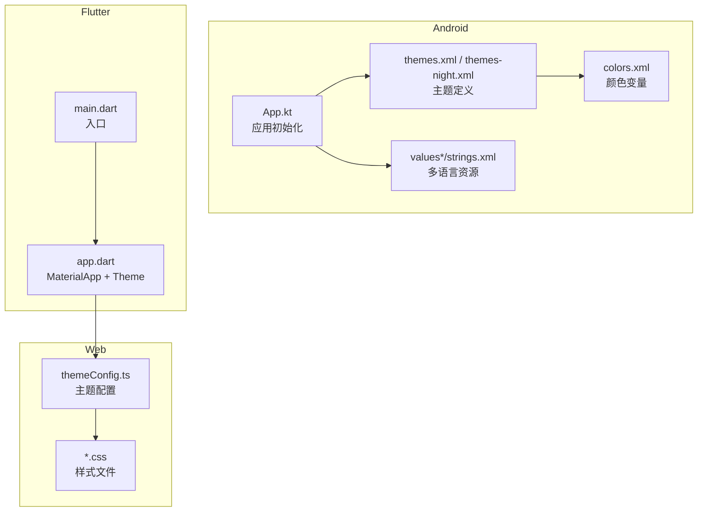
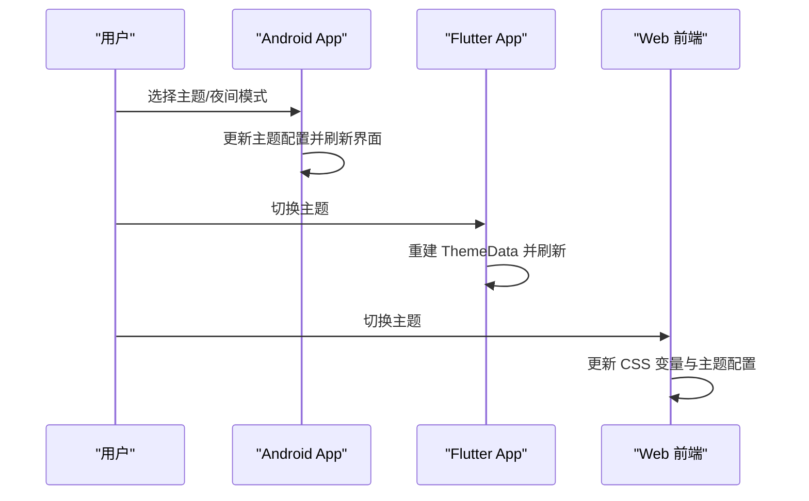
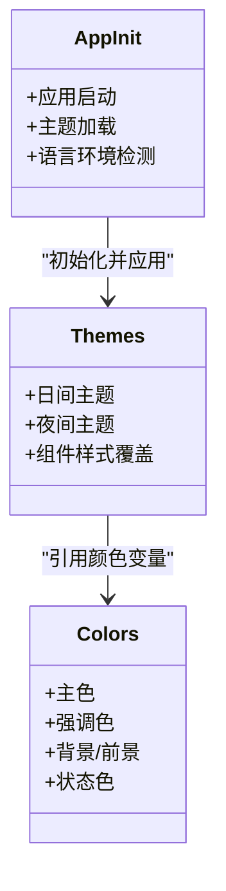
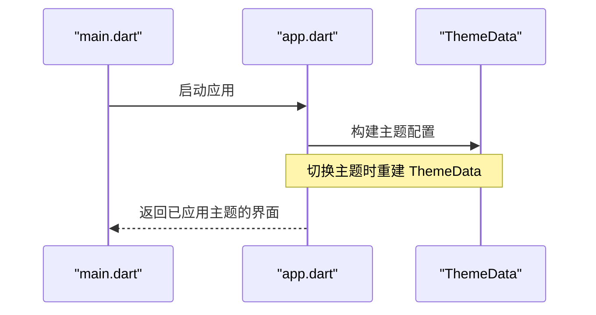
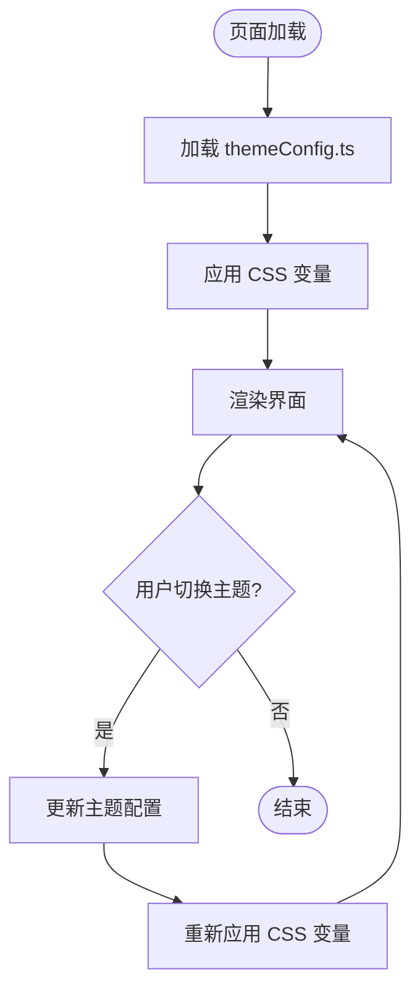
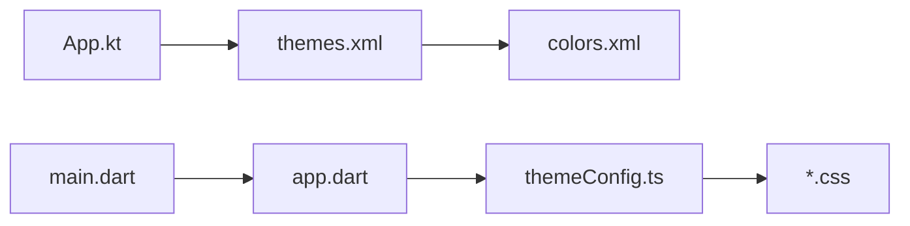

# 主题和样式

<cite>
**本文引用的文件**   
- [app/src/main/java/io/legado/app/App.kt](file://app/src/main/java/io/legado/app/App.kt)
- [app/src/main/res/values/themes.xml](file://app/src/main/res/values/themes.xml)
- [app/src/main/res/values-night/themes.xml](file://app/src/main/res/values-night/themes.xml)
- [app/src/main/res/values/colors.xml](file://app/src/main/res/values/colors.xml)
- [app/src/main/res/values/strings.xml](file://app/src/main/res/values/strings.xml)
- [app/src/main/res/values-zh/strings.xml](file://app/src/main/res/values-zh/strings.xml)
- [app/src/main/res/values-es-rES/strings.xml](file://app/src/main/res/values-es-rES/strings.xml)
- [app/src/main/res/values-ja-rJP/strings.xml](file://app/src/main/res/values-ja-rJP/strings.xml)
- [app/src/main/res/values-pt-rBR/strings.xml](file://app/src/main/res/values-pt-rBR/strings.xml)
- [app/src/main/res/values-vi/strings.xml](file://app/src/main/res/values-vi/strings.xml)
- [app/src/main/res/values-zh-rHK/strings.xml](file://app/src/main/res/values-zh-rHK/strings.xml)
- [app/src/main/res/values-zh-rTW/strings.xml](file://app/src/main/res/values-zh-rTW/strings.xml)
- [flutter_legado/lib/app.dart](file://flutter_legado/lib/app.dart)
- [flutter_legado/lib/src/main.dart](file://flutter_legado/lib/src/main.dart)
- [modules/web/src/config/themeConfig.ts](file://modules/web/src/config/themeConfig.ts)
- [modules/web/src/assets/bookshelf.css](file://modules/web/src/assets/bookshelf.css)
- [modules/web/src/assets/code.css](file://modules/web/src/assets/code.css)
- [modules/web/src/assets/kbd.css](file://modules/web/src/assets/kbd.css)
- [modules/web/src/assets/sourceeditor.css](file://modules/web/src/assets/sourceeditor.css)
</cite>

## 目录
1. [简介](#简介)
2. [项目结构](#项目结构)
3. [核心组件](#核心组件)
4. [架构总览](#架构总览)
5. [详细组件分析](#详细组件分析)
6. [依赖分析](#依赖分析)
7. [性能考虑](#性能考虑)
8. [故障排查指南](#故障排查指南)
9. [结论](#结论)
10. [附录](#附录)

## 简介
本文件系统化阐述 Legado 的主题与样式体系，覆盖 Android、Flutter、Web 三端的颜色体系、字体规范、间距标准、组件样式与动态换肤机制。同时说明多平台样式适配策略、国际化（多语言文本、日期时间格式、数字格式）以及无障碍访问支持（屏幕阅读器、键盘导航、高对比度模式）。文末提供主题开发指南与配置示例，帮助开发者快速创建自定义主题与样式组件。

## 项目结构
Legado 采用多端并行实现：Android 使用 Material Design 资源与主题；Flutter 通过 ThemeData 管理主题；Web 基于 CSS 变量与主题配置文件。三者共享设计语义（如主色、背景、文字层级），并通过运行时配置进行切换。

图表来源
- [app/src/main/java/io/legado/app/App.kt](file://app/src/main/java/io/legado/app/App.kt)
- [app/src/main/res/values/themes.xml](file://app/src/main/res/values/themes.xml)
- [app/src/main/res/values-night/themes.xml](file://app/src/main/res/values-night/themes.xml)
- [app/src/main/res/values/colors.xml](file://app/src/main/res/values/colors.xml)
- [flutter_legado/lib/src/main.dart](file://flutter_legado/lib/src/main.dart)
- [flutter_legado/lib/app.dart](file://flutter_legado/lib/app.dart)
- [modules/web/src/config/themeConfig.ts](file://modules/web/src/config/themeConfig.ts)
- [modules/web/src/assets/bookshelf.css](file://modules/web/src/assets/bookshelf.css)

章节来源
- [app/src/main/java/io/legado/app/App.kt](file://app/src/main/java/io/legado/app/App.kt)
- [app/src/main/res/values/themes.xml](file://app/src/main/res/values/themes.xml)
- [app/src/main/res/values-night/themes.xml](file://app/src/main/res/values-night/themes.xml)
- [app/src/main/res/values/colors.xml](file://app/src/main/res/values/colors.xml)
- [flutter_legado/lib/src/main.dart](file://flutter_legado/lib/src/main.dart)
- [flutter_legado/lib/app.dart](file://flutter_legado/lib/app.dart)
- [modules/web/src/config/themeConfig.ts](file://modules/web/src/config/themeConfig.ts)

## 核心组件
- 颜色体系
  - Android：在 colors.xml 中定义基础色板（主色、强调色、背景、前景、状态色等），由 themes.xml 引用并映射到 Material 属性。
  - Flutter：通过 ThemeData 的 colorScheme、brightness、textTheme 等字段统一控制。
  - Web：CSS 变量集中声明颜色，配合 themeConfig.ts 进行主题切换。
- 字体规范
  - Android：在主题或样式中设置 textAppearance，区分标题、正文、辅助文本字号与字重。
  - Flutter：ThemeData.textTheme 统一管理字体族、字号、字重、行高。
  - Web：CSS 全局字体栈与组件级字体覆盖。
- 间距标准
  - Android：以 dp 为单位，遵循 4dp/8dp 网格系统，按钮、卡片、列表项内边距保持一致。
  - Flutter：ThemeData.spacing 与组件默认 padding/margin 保持一致。
  - Web：CSS 变量定义 spacing-*，组件样式引用。
- 组件样式
  - Android：Material Components 控件样式通过主题属性覆盖（如 Button、Card、AppBar）。
  - Flutter：Material 组件通过 ThemeData 与 Widget 参数定制。
  - Web：各模块 CSS（bookshelf.css、code.css、kbd.css、sourceeditor.css）按功能域组织。

章节来源
- [app/src/main/res/values/colors.xml](file://app/src/main/res/values/colors.xml)
- [app/src/main/res/values/themes.xml](file://app/src/main/res/values/themes.xml)
- [app/src/main/res/values-night/themes.xml](file://app/src/main/res/values-night/themes.xml)
- [flutter_legado/lib/app.dart](file://flutter_legado/lib/app.dart)
- [modules/web/src/config/themeConfig.ts](file://modules/web/src/config/themeConfig.ts)
- [modules/web/src/assets/bookshelf.css](file://modules/web/src/assets/bookshelf.css)
- [modules/web/src/assets/code.css](file://modules/web/src/assets/code.css)
- [modules/web/src/assets/kbd.css](file://modules/web/src/assets/kbd.css)
- [modules/web/src/assets/sourceeditor.css](file://modules/web/src/assets/sourceeditor.css)

## 架构总览
主题系统在三个平台分别实现，但语义一致：颜色、字体、间距、组件样式由各自平台的主题层管理，运行时通过配置对象或资源切换。

图表来源
- [app/src/main/java/io/legado/app/App.kt](file://app/src/main/java/io/legado/app/App.kt)
- [flutter_legado/lib/app.dart](file://flutter_legado/lib/app.dart)
- [modules/web/src/config/themeConfig.ts](file://modules/web/src/config/themeConfig.ts)

## 详细组件分析

### Android 主题与样式
- 主题定义
  - themes.xml 与 themes-night.xml 分别定义日间与夜间主题，包含颜色、字体、组件样式等。
  - colors.xml 提供颜色变量，供主题与组件引用。
- 运行时切换
  - App.kt 负责应用初始化与主题加载，可在设置变更后重新应用主题。
- 国际化
  - values*/strings.xml 提供多语言文本，系统根据设备区域自动选择。

图表来源
- [app/src/main/res/values/themes.xml](file://app/src/main/res/values/themes.xml)
- [app/src/main/res/values-night/themes.xml](file://app/src/main/res/values-night/themes.xml)
- [app/src/main/res/values/colors.xml](file://app/src/main/res/values/colors.xml)
- [app/src/main/java/io/legado/app/App.kt](file://app/src/main/java/io/legado/app/App.kt)

章节来源
- [app/src/main/res/values/themes.xml](file://app/src/main/res/values/themes.xml)
- [app/src/main/res/values-night/themes.xml](file://app/src/main/res/values-night/themes.xml)
- [app/src/main/res/values/colors.xml](file://app/src/main/res/values/colors.xml)
- [app/src/main/java/io/legado/app/App.kt](file://app/src/main/java/io/legado/app/App.kt)

### Flutter 主题与样式
- 主题管理
  - app.dart 中通过 MaterialApp 与 ThemeData 定义主题，包括颜色、字体、亮度等。
  - main.dart 作为入口，初始化应用与主题上下文。
- 运行时切换
  - 通过 Provider/State 管理主题状态，切换时重建 ThemeData 并刷新 UI。

图表来源
- [flutter_legado/lib/src/main.dart](file://flutter_legado/lib/src/main.dart)
- [flutter_legado/lib/app.dart](file://flutter_legado/lib/app.dart)

章节来源
- [flutter_legado/lib/src/main.dart](file://flutter_legado/lib/src/main.dart)
- [flutter_legado/lib/app.dart](file://flutter_legado/lib/app.dart)

### Web 主题与样式
- 主题配置
  - themeConfig.ts 集中管理主题键值（颜色、字体、间距等），供组件与样式引用。
- 样式组织
  - bookshelf.css、code.css、kbd.css、sourceeditor.css 按功能域划分，便于维护与扩展。
- 运行时切换
  - 通过更新 CSS 变量或切换主题类名实现即时换肤。

图表来源
- [modules/web/src/config/themeConfig.ts](file://modules/web/src/config/themeConfig.ts)
- [modules/web/src/assets/bookshelf.css](file://modules/web/src/assets/bookshelf.css)
- [modules/web/src/assets/code.css](file://modules/web/src/assets/code.css)
- [modules/web/src/assets/kbd.css](file://modules/web/src/assets/kbd.css)
- [modules/web/src/assets/sourceeditor.css](file://modules/web/src/assets/sourceeditor.css)

章节来源
- [modules/web/src/config/themeConfig.ts](file://modules/web/src/config/themeConfig.ts)
- [modules/web/src/assets/bookshelf.css](file://modules/web/src/assets/bookshelf.css)
- [modules/web/src/assets/code.css](file://modules/web/src/assets/code.css)
- [modules/web/src/assets/kbd.css](file://modules/web/src/assets/kbd.css)
- [modules/web/src/assets/sourceeditor.css](file://modules/web/src/assets/sourceeditor.css)

### 国际化支持
- 多语言文本
  - Android：values*/strings.xml 提供多语言字符串，系统按区域自动选择。
  - Flutter：可通过 intl 插件与本地化文件管理文本。
  - Web：可结合 i18n 库与 JSON/YAML 资源文件。
- 日期时间与数字格式
  - Android：使用 DateFormat、NumberFormat 按 Locale 格式化。
  - Flutter：intl 包提供 locale-aware 格式化。
  - Web：Intl API 与第三方库（如 dayjs、numeral.js）支持本地化。

章节来源
- [app/src/main/res/values/strings.xml](file://app/src/main/res/values/strings.xml)
- [app/src/main/res/values-zh/strings.xml](file://app/src/main/res/values-zh/strings.xml)
- [app/src/main/res/values-es-rES/strings.xml](file://app/src/main/res/values-es-rES/strings.xml)
- [app/src/main/res/values-ja-rJP/strings.xml](file://app/src/main/res/values-ja-rJP/strings.xml)
- [app/src/main/res/values-pt-rBR/strings.xml](file://app/src/main/res/values-pt-rBR/strings.xml)
- [app/src/main/res/values-vi/strings.xml](file://app/src/main/res/values-vi/strings.xml)
- [app/src/main/res/values-zh-rHK/strings.xml](file://app/src/main/res/values-zh-rHK/strings.xml)
- [app/src/main/res/values-zh-rTW/strings.xml](file://app/src/main/res/values-zh-rTW/strings.xml)

### 无障碍访问支持
- 屏幕阅读器
  - Android：为关键控件添加 contentDescription，确保读屏可读。
  - Flutter：Semantics 树描述控件用途。
  - Web：ARIA 属性增强语义。
- 键盘导航
  - Android：Focusable 与焦点顺序合理设置。
  - Flutter：FocusNode 管理焦点。
  - Web：Tab 顺序与快捷键支持。
- 高对比度模式
  - Android：系统高对比度下保证文本与背景对比度达标。
  - Flutter：ThemeData.brightness 与颜色对比度检查。
  - Web：CSS 媒体查询 @media (prefers-contrast) 适配。

[本节为通用指导，不直接分析具体文件]

## 依赖分析
主题系统在各端内部耦合度低、对外接口清晰：Android 通过主题资源与代码初始化；Flutter 通过 ThemeData 暴露主题；Web 通过 CSS 变量与配置对象。跨端一致性由设计语义保障。

图表来源
- [app/src/main/java/io/legado/app/App.kt](file://app/src/main/java/io/legado/app/App.kt)
- [app/src/main/res/values/themes.xml](file://app/src/main/res/values/themes.xml)
- [app/src/main/res/values/colors.xml](file://app/src/main/res/values/colors.xml)
- [flutter_legado/lib/src/main.dart](file://flutter_legado/lib/src/main.dart)
- [flutter_legado/lib/app.dart](file://flutter_legado/lib/app.dart)
- [modules/web/src/config/themeConfig.ts](file://modules/web/src/config/themeConfig.ts)

章节来源
- [app/src/main/java/io/legado/app/App.kt](file://app/src/main/java/io/legado/app/App.kt)
- [app/src/main/res/values/themes.xml](file://app/src/main/res/values/themes.xml)
- [app/src/main/res/values/colors.xml](file://app/src/main/res/values/colors.xml)
- [flutter_legado/lib/src/main.dart](file://flutter_legado/lib/src/main.dart)
- [flutter_legado/lib/app.dart](file://flutter_legado/lib/app.dart)
- [modules/web/src/config/themeConfig.ts](file://modules/web/src/config/themeConfig.ts)

## 性能考虑
- Android
  - 避免频繁重建主题，批量更新后一次性应用。
  - 使用矢量图标与按需加载字体减少资源体积。
- Flutter
  - 主题切换时最小化重建范围，使用 const 构造提升性能。
  - 缓存常用 ThemeData 实例。
- Web
  - CSS 变量切换开销小，避免大量 DOM 操作。
  - 合并与压缩 CSS，按需加载样式。

[本节为通用指导，不直接分析具体文件]

## 故障排查指南
- 主题未生效
  - Android：确认 themes.xml 正确引用 colors.xml，App.kt 中主题加载逻辑无误。
  - Flutter：检查 ThemeData 构建是否被重复覆盖，确保状态更新触发重建。
  - Web：验证 themeConfig.ts 是否正确注入 CSS 变量，浏览器控制台无样式冲突。
- 国际化缺失
  - Android：确认对应语言的 strings.xml 存在且 key 一致。
  - Flutter/Web：检查本地化文件路径与加载顺序。
- 无障碍问题
  - Android：使用 Accessibility Scanner 检查内容描述与焦点顺序。
  - Flutter：使用 Semantics 调试工具。
  - Web：使用 Lighthouse 无障碍审计。

章节来源
- [app/src/main/java/io/legado/app/App.kt](file://app/src/main/java/io/legado/app/App.kt)
- [app/src/main/res/values/themes.xml](file://app/src/main/res/values/themes.xml)
- [app/src/main/res/values/colors.xml](file://app/src/main/res/values/colors.xml)
- [flutter_legado/lib/app.dart](file://flutter_legado/lib/app.dart)
- [modules/web/src/config/themeConfig.ts](file://modules/web/src/config/themeConfig.ts)

## 结论
Legado 的主题与样式体系在多端实现了统一的语义与灵活的运行时切换。Android 依托 Material Design 资源与主题，Flutter 通过 ThemeData 管理，Web 借助 CSS 变量与配置对象。国际化与无障碍支持贯穿各端，确保用户体验一致性与可访问性。建议遵循本文的设计规范与最佳实践，持续优化主题系统与样式组件的可维护性与性能。

[本节为总结性内容，不直接分析具体文件]

## 附录
- 自定义主题创建步骤
  - Android：新增 colors.xml 条目，在 themes.xml 中映射到属性，必要时创建 night 变体。
  - Flutter：扩展 ThemeData 的 colorScheme 与 textTheme，封装主题切换方法。
  - Web：在 themeConfig.ts 中添加新主题键，并在 CSS 中引用变量。
- 样式组件开发建议
  - 保持组件样式与主题解耦，优先使用主题变量。
  - 为关键交互提供焦点与提示，确保无障碍友好。
  - 编写单元测试或视觉回归测试，确保主题切换稳定性。

[本节为通用指导，不直接分析具体文件]