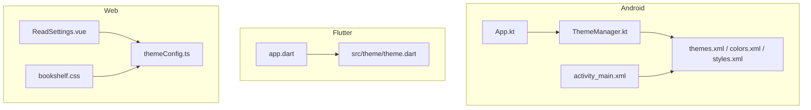
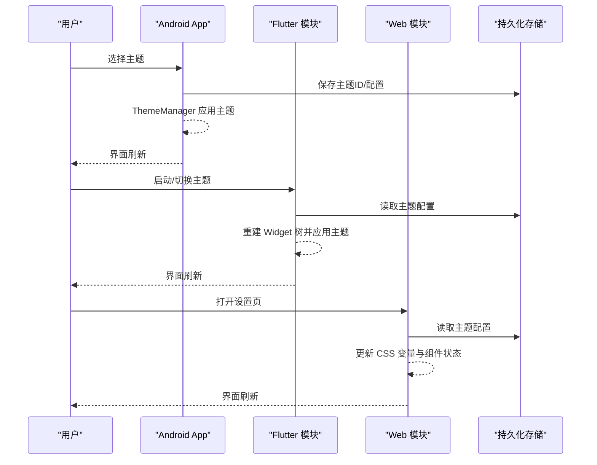
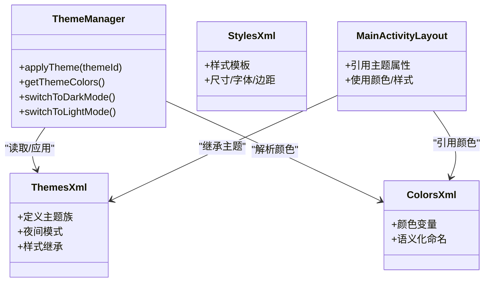
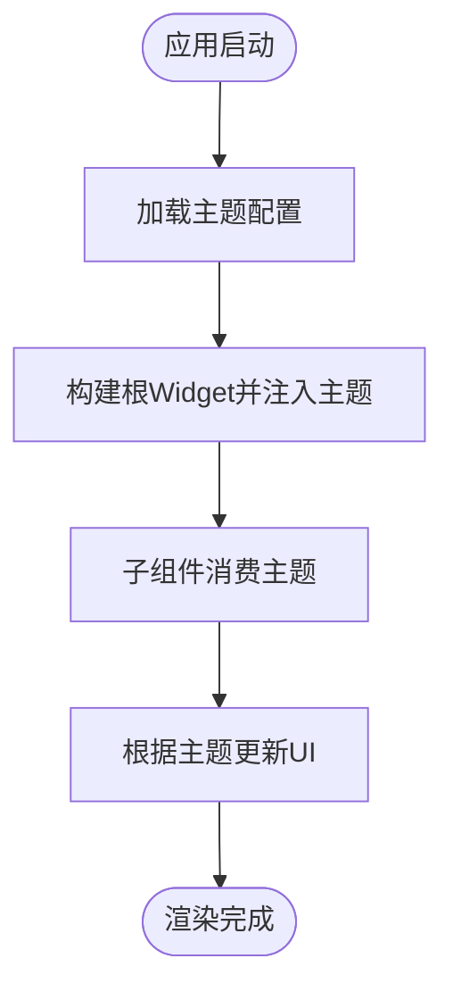
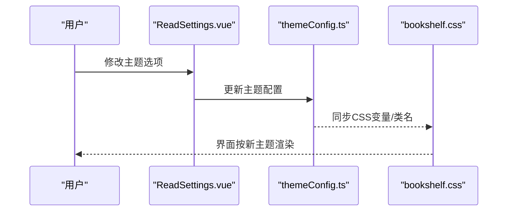
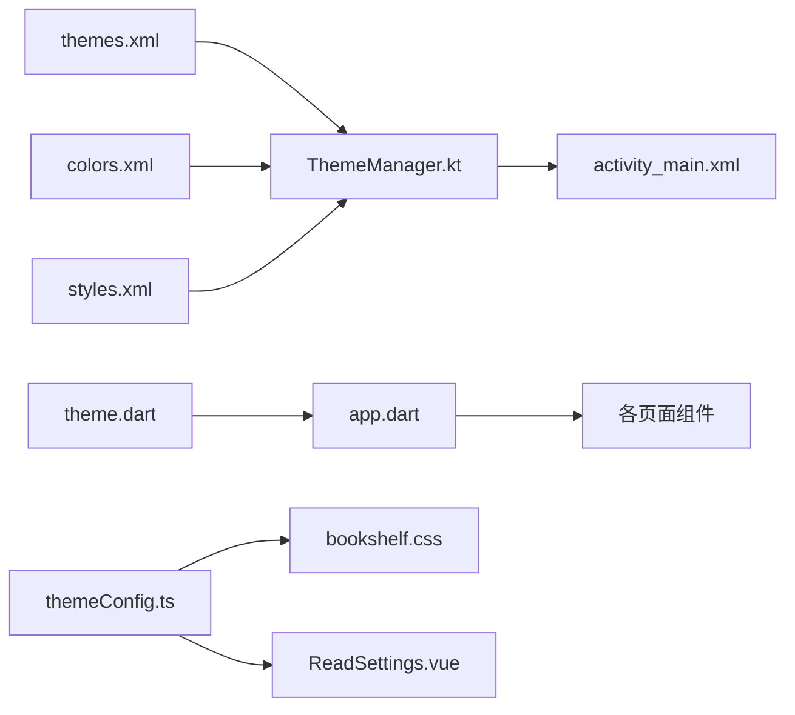
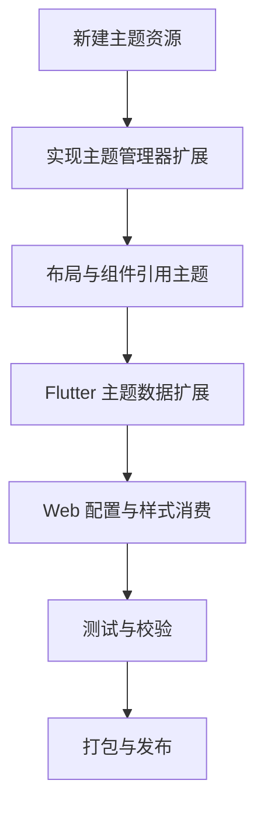

# 主题开发指南

<cite>
**本文引用的文件**   
- [app/src/main/java/io/legado/app/App.kt](file://app/src/main/java/io/legado/app/App.kt)
- [app/src/main/res/values/themes.xml](file://app/src/main/res/values/themes.xml)
- [app/src/main/res/values-night/themes.xml](file://app/src/main/res/values-night/themes.xml)
- [app/src/main/res/values/colors.xml](file://app/src/main/res/values/colors.xml)
- [app/src/main/res/values/styles.xml](file://app/src/main/res/values/styles.xml)
- [app/src/main/res/layout/activity_main.xml](file://app/src/main/res/layout/activity_main.xml)
- [flutter_legado/lib/app.dart](file://flutter_legado/lib/app.dart)
- [flutter_legado/lib/src/theme/theme.dart](file://flutter_legado/lib/src/theme/theme.dart)
- [modules/web/src/config/themeConfig.ts](file://modules/web/src/config/themeConfig.ts)
- [modules/web/src/assets/bookshelf.css](file://modules/web/src/assets/bookshelf.css)
- [modules/web/src/components/ReadSettings.vue](file://modules/web/src/components/ReadSettings.vue)
- [app/src/main/java/io/legado/app/ui/theme/ThemeManager.kt](file://app/src/main/java/io/legado/app/ui/theme/ThemeManager.kt)
- [app/src/main/java/io/legado/app/help/BottomBarSkinArchiveTest.kt](file://app/src/main/java/io/legado/app/help/BottomBarSkinArchiveTest.kt)
- [app/src/main/java/io/legado/app/help/BottomBarSkinFormatTest.kt](file://app/src/main/java/io/legado/app/help/BottomBarSkinFormatTest.kt)
</cite>

## 目录
1. [简介](#简介)
2. [项目结构](#项目结构)
3. [核心组件](#核心组件)
4. [架构总览](#架构总览)
5. [详细组件分析](#详细组件分析)
6. [依赖分析](#依赖分析)
7. [性能考虑](#性能考虑)
8. [故障排查指南](#故障排查指南)
9. [结论](#结论)
10. [附录](#附录)

## 简介
本指南面向希望在 Legado 中创建与扩展自定义主题的开发者，覆盖 Android、Flutter 与 Web 三端主题体系。内容包含：主题结构设计、颜色变量定义、样式模板编写、可复用样式组件设计、主题属性绑定与继承机制、设计规范遵循、主题测试方法（视觉回归、兼容性、性能）、发布流程（打包、版本管理、分发）以及调试技巧与完整示例工作流。

## 项目结构
Legado 采用多端并行架构：Android 原生使用资源系统与主题管理器；Flutter 通过主题配置对象驱动 UI；Web 侧基于 CSS 与 Vue 组件进行主题化。关键目录与职责如下：
- Android: res/values 下的 themes、colors、styles 等定义全局主题；App.kt 负责应用级初始化；ui/theme 提供运行时主题切换能力。
- Flutter: lib/src/theme 集中管理主题数据与构建逻辑；app.dart 作为入口装配主题。
- Web: modules/web 下 themeConfig.ts 定义主题配置，CSS 与 Vue 组件消费主题变量。

图表来源
- [app/src/main/java/io/legado/app/App.kt](file://app/src/main/java/io/legado/app/App.kt)
- [app/src/main/res/values/themes.xml](file://app/src/main/res/values/themes.xml)
- [app/src/main/res/values/colors.xml](file://app/src/main/res/values/colors.xml)
- [app/src/main/res/values/styles.xml](file://app/src/main/res/values/styles.xml)
- [app/src/main/res/layout/activity_main.xml](file://app/src/main/res/layout/activity_main.xml)
- [app/src/main/java/io/legado/app/ui/theme/ThemeManager.kt](file://app/src/main/java/io/legado/app/ui/theme/ThemeManager.kt)
- [flutter_legado/lib/app.dart](file://flutter_legado/lib/app.dart)
- [flutter_legado/lib/src/theme/theme.dart](file://flutter_legado/lib/src/theme/theme.dart)
- [modules/web/src/config/themeConfig.ts](file://modules/web/src/config/themeConfig.ts)
- [modules/web/src/assets/bookshelf.css](file://modules/web/src/assets/bookshelf.css)
- [modules/web/src/components/ReadSettings.vue](file://modules/web/src/components/ReadSettings.vue)

章节来源
- [app/src/main/java/io/legado/app/App.kt](file://app/src/main/java/io/legado/app/App.kt)
- [app/src/main/res/values/themes.xml](file://app/src/main/res/values/themes.xml)
- [app/src/main/res/values/colors.xml](file://app/src/main/res/values/colors.xml)
- [app/src/main/res/values/styles.xml](file://app/src/main/res/values/styles.xml)
- [app/src/main/res/layout/activity_main.xml](file://app/src/main/res/layout/activity_main.xml)
- [flutter_legado/lib/app.dart](file://flutter_legado/lib/app.dart)
- [flutter_legado/lib/src/theme/theme.dart](file://flutter_legado/lib/src/theme/theme.dart)
- [modules/web/src/config/themeConfig.ts](file://modules/web/src/config/themeConfig.ts)
- [modules/web/src/assets/bookshelf.css](file://modules/web/src/assets/bookshelf.css)
- [modules/web/src/components/ReadSettings.vue](file://modules/web/src/components/ReadSettings.vue)

## 核心组件
- 主题资源定义层
  - Android: themes.xml、colors.xml、styles.xml 定义主题族、颜色变量与样式模板。
  - Flutter: theme.dart 定义主题数据结构与默认值。
  - Web: themeConfig.ts 定义主题键值与默认色板。
- 主题运行时管理层
  - Android: ThemeManager.kt 负责加载、切换与应用主题到视图层。
  - Flutter: app.dart 将主题注入 Widget 树。
  - Web: ReadSettings.vue 与 bookshelf.css 消费主题配置。
- 主题测试与校验
  - BottomBarSkinArchiveTest.kt、BottomBarSkinFormatTest.kt 用于验证皮肤包结构与格式。

章节来源
- [app/src/main/res/values/themes.xml](file://app/src/main/res/values/themes.xml)
- [app/src/main/res/values/colors.xml](file://app/src/main/res/values/colors.xml)
- [app/src/main/res/values/styles.xml](file://app/src/main/res/values/styles.xml)
- [app/src/main/java/io/legado/app/ui/theme/ThemeManager.kt](file://app/src/main/java/io/legado/app/ui/theme/ThemeManager.kt)
- [flutter_legado/lib/src/theme/theme.dart](file://flutter_legado/lib/src/theme/theme.dart)
- [flutter_legado/lib/app.dart](file://flutter_legado/lib/app.dart)
- [modules/web/src/config/themeConfig.ts](file://modules/web/src/config/themeConfig.ts)
- [modules/web/src/assets/bookshelf.css](file://modules/web/src/assets/bookshelf.css)
- [modules/web/src/components/ReadSettings.vue](file://modules/web/src/components/ReadSettings.vue)
- [app/src/main/java/io/legado/app/help/BottomBarSkinArchiveTest.kt](file://app/src/main/java/io/legado/app/help/BottomBarSkinArchiveTest.kt)
- [app/src/main/java/io/legado/app/help/BottomBarSkinFormatTest.kt](file://app/src/main/java/io/legado/app/help/BottomBarSkinFormatTest.kt)

## 架构总览
主题系统由“定义层—运行层—消费层”三层构成，支持多端一致的主题体验与动态切换。

图表来源
- [app/src/main/java/io/legado/app/ui/theme/ThemeManager.kt](file://app/src/main/java/io/legado/app/ui/theme/ThemeManager.kt)
- [flutter_legado/lib/app.dart](file://flutter_legado/lib/app.dart)
- [flutter_legado/lib/src/theme/theme.dart](file://flutter_legado/lib/src/theme/theme.dart)
- [modules/web/src/config/themeConfig.ts](file://modules/web/src/config/themeConfig.ts)
- [modules/web/src/components/ReadSettings.vue](file://modules/web/src/components/ReadSettings.vue)

## 详细组件分析

### Android 主题系统
- 主题资源定义
  - themes.xml: 定义主题族、夜间模式、样式继承链。
  - colors.xml: 集中管理颜色变量，供控件引用。
  - styles.xml: 封装通用样式模板，减少重复声明。
- 运行时管理
  - ThemeManager.kt: 提供主题加载、切换、应用至当前 Activity/Fragment 的能力。
- 布局消费
  - activity_main.xml: 通过主题属性引用颜色与样式，确保主题生效。

图表来源
- [app/src/main/java/io/legado/app/ui/theme/ThemeManager.kt](file://app/src/main/java/io/legado/app/ui/theme/ThemeManager.kt)
- [app/src/main/res/values/themes.xml](file://app/src/main/res/values/themes.xml)
- [app/src/main/res/values/colors.xml](file://app/src/main/res/values/colors.xml)
- [app/src/main/res/values/styles.xml](file://app/src/main/res/values/styles.xml)
- [app/src/main/res/layout/activity_main.xml](file://app/src/main/res/layout/activity_main.xml)

章节来源
- [app/src/main/res/values/themes.xml](file://app/src/main/res/values/themes.xml)
- [app/src/main/res/values/colors.xml](file://app/src/main/res/values/colors.xml)
- [app/src/main/res/values/styles.xml](file://app/src/main/res/values/styles.xml)
- [app/src/main/res/layout/activity_main.xml](file://app/src/main/res/layout/activity_main.xml)
- [app/src/main/java/io/legado/app/ui/theme/ThemeManager.kt](file://app/src/main/java/io/legado/app/ui/theme/ThemeManager.kt)

### Flutter 主题系统
- 主题数据与构建
  - theme.dart: 定义主题数据结构、默认值与派生计算（如对比度、明暗适配）。
  - app.dart: 在应用根节点注入主题，使子树统一消费。
- 组件消费
  - 各页面通过主题对象获取颜色、字体、间距等，保证一致性。

图表来源
- [flutter_legado/lib/src/theme/theme.dart](file://flutter_legado/lib/src/theme/theme.dart)
- [flutter_legado/lib/app.dart](file://flutter_legado/lib/app.dart)

章节来源
- [flutter_legado/lib/src/theme/theme.dart](file://flutter_legado/lib/src/theme/theme.dart)
- [flutter_legado/lib/app.dart](file://flutter_legado/lib/app.dart)

### Web 主题系统
- 主题配置
  - themeConfig.ts: 定义主题键值、默认色板与扩展点。
- 样式与组件
  - bookshelf.css: 使用 CSS 变量或类名映射主题。
  - ReadSettings.vue: 提供主题设置交互，更新配置并触发重绘。

图表来源
- [modules/web/src/components/ReadSettings.vue](file://modules/web/src/components/ReadSettings.vue)
- [modules/web/src/config/themeConfig.ts](file://modules/web/src/config/themeConfig.ts)
- [modules/web/src/assets/bookshelf.css](file://modules/web/src/assets/bookshelf.css)

章节来源
- [modules/web/src/config/themeConfig.ts](file://modules/web/src/config/themeConfig.ts)
- [modules/web/src/assets/bookshelf.css](file://modules/web/src/assets/bookshelf.css)
- [modules/web/src/components/ReadSettings.vue](file://modules/web/src/components/ReadSettings.vue)

### 主题测试与校验
- 皮肤包结构与格式校验
  - BottomBarSkinArchiveTest.kt: 验证皮肤包的归档结构与必要字段。
  - BottomBarSkinFormatTest.kt: 校验皮肤文件格式与字段约束。
- 建议补充的测试类型
  - 视觉回归测试：截图比对不同主题下的关键页面。
  - 兼容性测试：覆盖不同 Android API、Flutter 平台与浏览器。
  - 性能测试：主题切换耗时、重绘次数与内存占用。

章节来源
- [app/src/main/java/io/legado/app/help/BottomBarSkinArchiveTest.kt](file://app/src/main/java/io/legado/app/help/BottomBarSkinArchiveTest.kt)
- [app/src/main/java/io/legado/app/help/BottomBarSkinFormatTest.kt](file://app/src/main/java/io/legado/app/help/BottomBarSkinFormatTest.kt)

## 依赖分析
主题系统的依赖关系清晰分层：Android 资源层被 ThemeManager 消费；Flutter 主题对象被应用根节点注入；Web 配置被组件与样式消费。

图表来源
- [app/src/main/res/values/themes.xml](file://app/src/main/res/values/themes.xml)
- [app/src/main/res/values/colors.xml](file://app/src/main/res/values/colors.xml)
- [app/src/main/res/values/styles.xml](file://app/src/main/res/values/styles.xml)
- [app/src/main/java/io/legado/app/ui/theme/ThemeManager.kt](file://app/src/main/java/io/legado/app/ui/theme/ThemeManager.kt)
- [app/src/main/res/layout/activity_main.xml](file://app/src/main/res/layout/activity_main.xml)
- [flutter_legado/lib/src/theme/theme.dart](file://flutter_legado/lib/src/theme/theme.dart)
- [flutter_legado/lib/app.dart](file://flutter_legado/lib/app.dart)
- [modules/web/src/config/themeConfig.ts](file://modules/web/src/config/themeConfig.ts)
- [modules/web/src/assets/bookshelf.css](file://modules/web/src/assets/bookshelf.css)
- [modules/web/src/components/ReadSettings.vue](file://modules/web/src/components/ReadSettings.vue)

章节来源
- [app/src/main/res/values/themes.xml](file://app/src/main/res/values/themes.xml)
- [app/src/main/res/values/colors.xml](file://app/src/main/res/values/colors.xml)
- [app/src/main/res/values/styles.xml](file://app/src/main/res/values/styles.xml)
- [app/src/main/java/io/legado/app/ui/theme/ThemeManager.kt](file://app/src/main/java/io/legado/app/ui/theme/ThemeManager.kt)
- [app/src/main/res/layout/activity_main.xml](file://app/src/main/res/layout/activity_main.xml)
- [flutter_legado/lib/src/theme/theme.dart](file://flutter_legado/lib/src/theme/theme.dart)
- [flutter_legado/lib/app.dart](file://flutter_legado/lib/app.dart)
- [modules/web/src/config/themeConfig.ts](file://modules/web/src/config/themeConfig.ts)
- [modules/web/src/assets/bookshelf.css](file://modules/web/src/assets/bookshelf.css)
- [modules/web/src/components/ReadSettings.vue](file://modules/web/src/components/ReadSettings.vue)

## 性能考虑
- Android
  - 避免在主题切换时执行重型操作，尽量使用资源替换与轻量重建。
  - 合理使用 styles.xml 复用样式，减少 XML 膨胀。
- Flutter
  - 主题变更应最小化重建范围，使用 Provider/ValueListenable 精确通知。
  - 避免在主题对象中进行复杂计算，必要时缓存派生值。
- Web
  - 优先使用 CSS 变量与类名切换，减少 JS 计算与 DOM 操作。
  - 对大图与字体等资源进行懒加载与压缩。

[本节为通用指导，不直接分析具体文件]

## 故障排查指南
- 主题未生效
  - 检查 Android 主题继承链与颜色引用是否正确。
  - 确认 Flutter 根节点已注入主题且子组件正确消费。
  - 验证 Web 配置是否被组件与样式正确读取。
- 夜间模式异常
  - 检查 values-night 资源是否存在与命名一致。
  - 确认 ThemeManager 的夜间切换逻辑调用位置。
- 皮肤包错误
  - 使用 BottomBarSkinArchiveTest.kt 与 BottomBarSkinFormatTest.kt 定位结构与格式问题。
- 性能问题
  - 使用 Android Profiler、Flutter DevTools 与浏览器 Performance 面板分析重绘与内存。

章节来源
- [app/src/main/res/values-night/themes.xml](file://app/src/main/res/values-night/themes.xml)
- [app/src/main/java/io/legado/app/ui/theme/ThemeManager.kt](file://app/src/main/java/io/legado/app/ui/theme/ThemeManager.kt)
- [app/src/main/java/io/legado/app/help/BottomBarSkinArchiveTest.kt](file://app/src/main/java/io/legado/app/help/BottomBarSkinArchiveTest.kt)
- [app/src/main/java/io/legado/app/help/BottomBarSkinFormatTest.kt](file://app/src/main/java/io/legado/app/help/BottomBarSkinFormatTest.kt)

## 结论
Legado 的主题系统在 Android、Flutter 与 Web 三端具备清晰的层次与一致的扩展方式。通过规范化的资源定义、运行时管理与组件消费，开发者可以高效地创建与维护自定义主题。结合完善的测试与调试手段，能够保障主题质量与用户体验。

[本节为总结性内容，不直接分析具体文件]

## 附录

### 自定义主题创建流程（端到端）
- 步骤概览
  - 定义主题资源：在 Android 的 themes.xml、colors.xml、styles.xml 中新增主题族与颜色变量。
  - 实现运行时管理：在 ThemeManager.kt 中增加主题加载与切换逻辑。
  - 组件消费：在布局与页面中引用主题属性与颜色。
  - Flutter 集成：在 theme.dart 中扩展主题数据结构，并在 app.dart 注入。
  - Web 集成：在 themeConfig.ts 中新增键值，CSS 与组件消费变量。
  - 测试与校验：补充视觉回归与兼容性测试用例。
  - 发布与分发：打包主题包、版本号管理、上传至分发渠道。

[本节为概念性流程图，不直接映射具体代码文件]

### 设计规范与命名约定
- 命名约定
  - 颜色变量：语义化命名（如 primary、background、textPrimary），避免硬编码。
  - 样式模板：按功能分组（如 card、button、input），保持单一职责。
  - 主题键：前后端保持一致（如 themeId、palette、typography）。
- 代码风格
  - Android: 遵循 Google Kotlin/Android 风格，XML 缩进与注释规范。
  - Flutter: 使用 Dart 官方风格与 linter。
  - Web: ESLint/Prettier 统一格式化。

[本节为通用规范说明，不直接分析具体文件]

### 主题测试方法与质量保证
- 视觉回归测试
  - 关键页面截图比对，阈值控制差异像素。
- 兼容性测试
  - 覆盖 Android 版本、Flutter 平台与主流浏览器。
- 性能测试
  - 主题切换耗时、重绘次数、内存峰值监控。

[本节为通用测试策略，不直接分析具体文件]

### 主题发布流程
- 打包
  - Android: 生成皮肤包或主题资源包，校验结构与格式。
  - Flutter: 编译主题模块并输出产物。
  - Web: 构建静态资源并部署 CDN。
- 版本管理
  - 语义化版本（主版本.次版本.修订号），记录变更日志。
- 分发渠道
  - 内部仓库、应用商店插件市场、社区发布站点。

[本节为通用发布策略，不直接分析具体文件]

### 主题调试技巧
- 样式调试工具
  - Android: Layout Inspector、Theme Inspector。
  - Flutter: DevTools、Inspector。
  - Web: Chrome DevTools、CSS Variables 面板。
- 性能分析
  - Android Profiler、Flutter Flame Graph、浏览器 Performance。
- 问题排查
  - 逐步缩小范围，使用最小复现案例定位问题。

[本节为通用调试建议，不直接分析具体文件]

### 完整开发示例与工作流
- 示例目标
  - 创建一个名为“晨曦”的新主题，包含浅色与深色两套配色，并在三端生效。
- 工作流
  - Android: 在 themes.xml 与 colors.xml 新增主题族与颜色；在 ThemeManager.kt 添加切换逻辑；在 activity_main.xml 引用主题。
  - Flutter: 在 theme.dart 扩展主题数据；在 app.dart 注入；页面组件消费主题。
  - Web: 在 themeConfig.ts 新增键值；在 bookshelf.css 使用变量；在 ReadSettings.vue 提供设置入口。
  - 测试: 补充视觉回归与兼容性用例；使用底部皮肤测试工具校验格式。
  - 发布: 打包主题包，提交版本与变更记录，上传至分发渠道。

[本节为示例性描述，不直接分析具体文件]