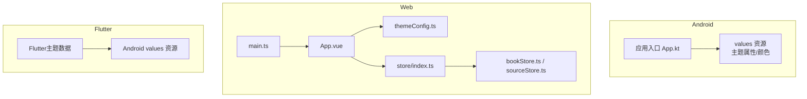
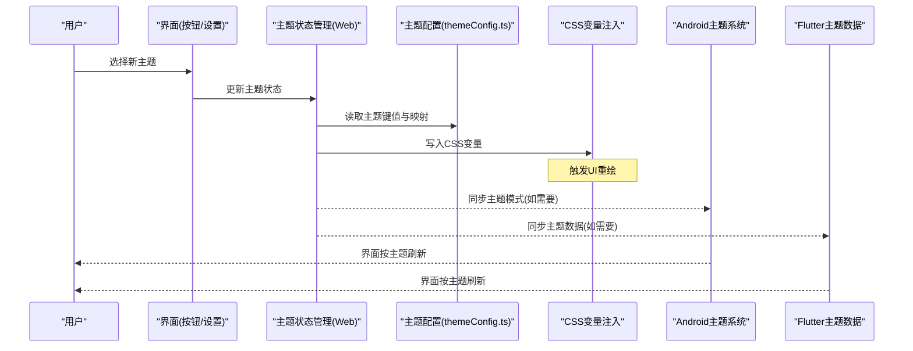
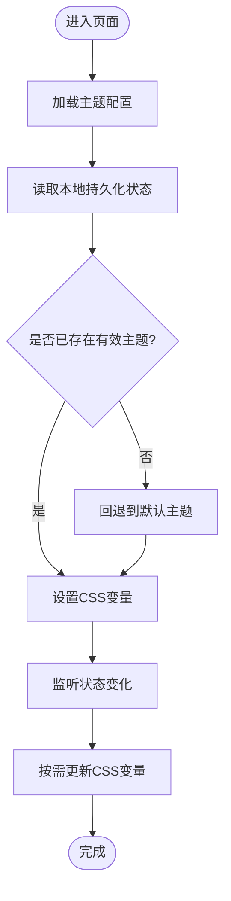
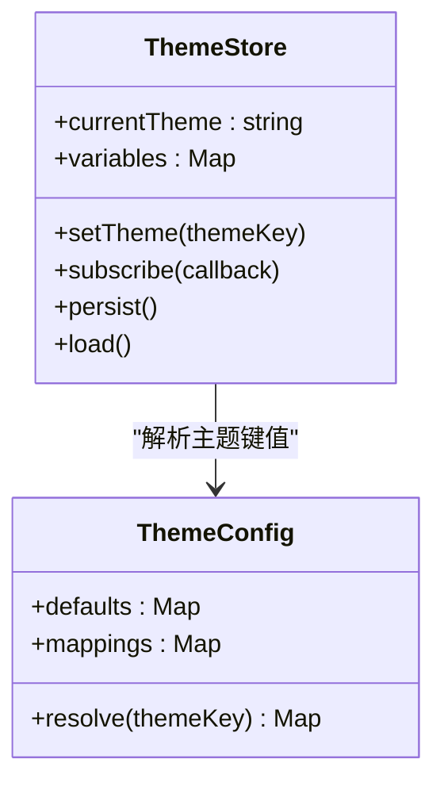
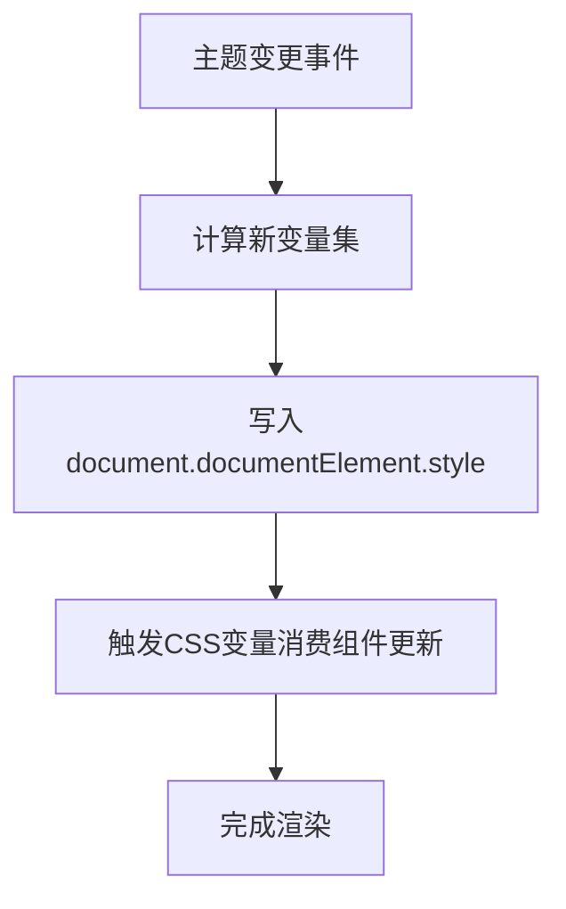
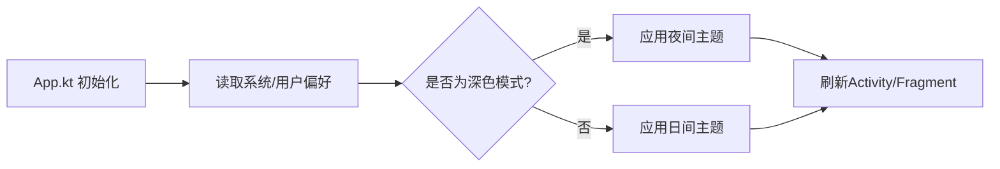
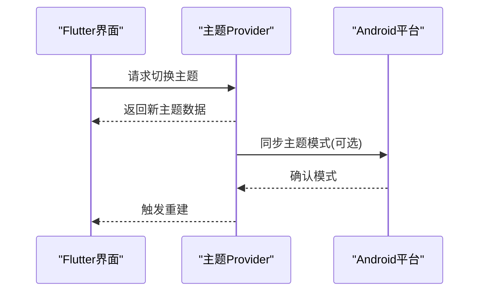
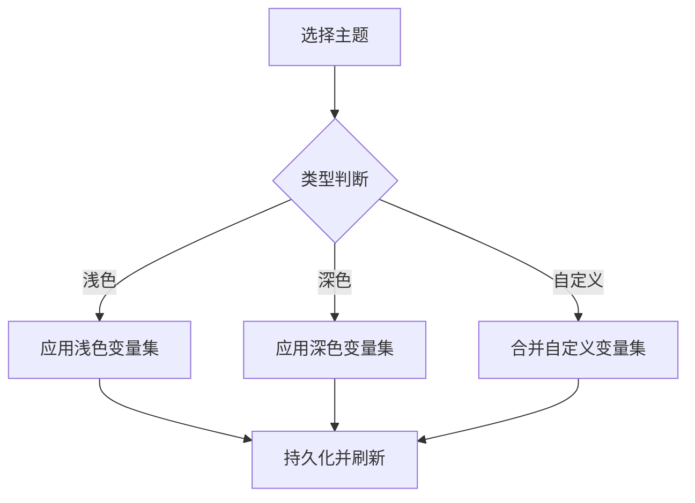
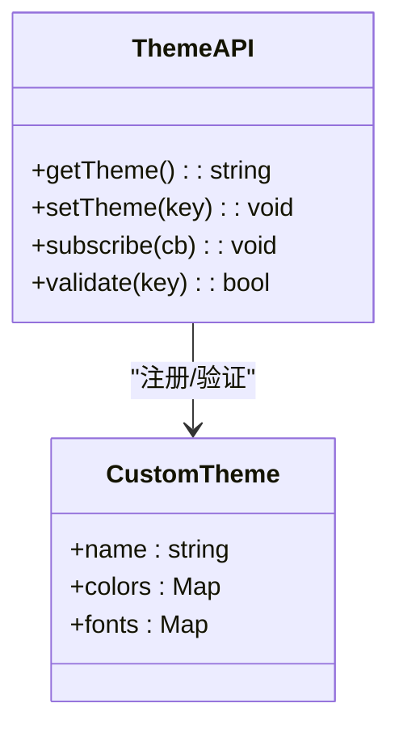
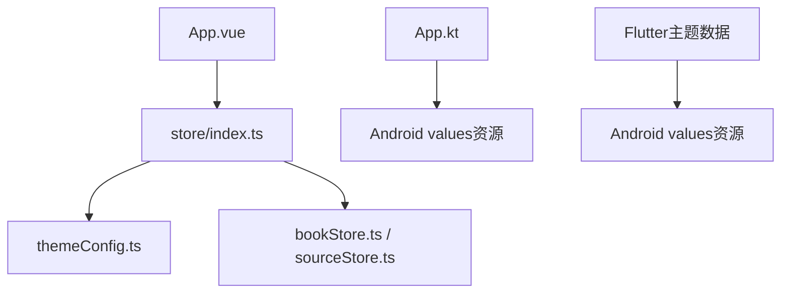

# 动态换肤

<cite>
**本文引用的文件**   
- [App.kt](file://app/src/main/java/io/legado/app/App.kt)
- [themeConfig.ts](file://modules/web/src/config/themeConfig.ts)
- [App.vue](file://modules/web/src/App.vue)
- [main.ts](file://modules/web/src/main.ts)
- [bookStore.ts](file://modules/web/src/store/bookStore.ts)
- [sourceStore.ts](file://modules/web/src/store/sourceStore.ts)
- [index.ts](file://modules/web/src/store/index.ts)
- [settings_test.dart](file://flutter_legado/test/widget/settings_test.dart)
- [Flutter主题相关资源目录](file://flutter_legado/android/app/src/main/res/values/)
- [Android主题属性目录](file://app/src/main/res/values/)
</cite>

## 目录
1. [简介](#简介)
2. [项目结构](#项目结构)
3. [核心组件](#核心组件)
4. [架构总览](#架构总览)
5. [详细组件分析](#详细组件分析)
6. [依赖关系分析](#依赖关系分析)
7. [性能考虑](#性能考虑)
8. [故障排查指南](#故障排查指南)
9. [结论](#结论)
10. [附录](#附录)

## 简介
本文件面向Legado项目的“动态换肤”能力，系统性说明主题切换机制、主题状态管理、数据持久化、变更监听、颜色变量体系、样式覆盖机制（CSS变量、Android主题属性、Flutter主题数据）、多主题支持（浅色/深色/自定义）以及主题开发接口与示例。文档兼顾技术深度与可读性，帮助开发者快速理解并扩展主题系统。

## 项目结构
本项目包含三条前端/渲染路径：
- Android原生层：通过values资源与夜间模式提供基础主题能力
- Web端：基于Vue + TypeScript，使用CSS变量与状态管理实现运行时主题切换
- Flutter端：通过主题数据与平台适配实现跨平台主题

图表来源
- [App.kt](file://app/src/main/java/io/legado/app/App.kt)
- [themeConfig.ts](file://modules/web/src/config/themeConfig.ts)
- [App.vue](file://modules/web/src/App.vue)
- [main.ts](file://modules/web/src/main.ts)
- [bookStore.ts](file://modules/web/src/store/bookStore.ts)
- [sourceStore.ts](file://modules/web/src/store/sourceStore.ts)
- [index.ts](file://modules/web/src/store/index.ts)

章节来源
- [App.kt](file://app/src/main/java/io/legado/app/App.kt)
- [themeConfig.ts](file://modules/web/src/config/themeConfig.ts)
- [App.vue](file://modules/web/src/App.vue)
- [main.ts](file://modules/web/src/main.ts)
- [bookStore.ts](file://modules/web/src/store/bookStore.ts)
- [sourceStore.ts](file://modules/web/src/store/sourceStore.ts)
- [index.ts](file://modules/web/src/store/index.ts)

## 核心组件
- 主题配置中心（Web）：集中定义主题键值、默认值、深浅色映射与运行时注入逻辑
- 状态管理（Web）：全局主题状态、订阅与持久化存储
- 样式注入（Web）：将主题变量写入CSS变量，驱动UI实时刷新
- Android主题适配：通过values资源与夜间模式切换主题
- Flutter主题数据：在Flutter侧维护主题对象，结合平台资源进行渲染

章节来源
- [themeConfig.ts](file://modules/web/src/config/themeConfig.ts)
- [index.ts](file://modules/web/src/store/index.ts)
- [bookStore.ts](file://modules/web/src/store/bookStore.ts)
- [sourceStore.ts](file://modules/web/src/store/sourceStore.ts)
- [App.kt](file://app/src/main/java/io/legado/app/App.kt)
- [Flutter主题相关资源目录](file://flutter_legado/android/app/src/main/res/values/)

## 架构总览
下图展示从用户操作到界面更新的完整链路，涵盖Web与Android两端的关键节点。

图表来源
- [themeConfig.ts](file://modules/web/src/config/themeConfig.ts)
- [index.ts](file://modules/web/src/store/index.ts)
- [App.kt](file://app/src/main/java/io/legado/app/App.kt)

## 详细组件分析

### Web端主题配置与注入
- 主题配置：集中定义主题键名、默认值、浅色/深色映射、扩展字段
- 状态管理：提供get/set方法、订阅通知、本地持久化
- 样式注入：将主题变量以CSS变量的形式注入根节点，驱动组件响应式更新

图表来源
- [themeConfig.ts](file://modules/web/src/config/themeConfig.ts)
- [index.ts](file://modules/web/src/store/index.ts)

章节来源
- [themeConfig.ts](file://modules/web/src/config/themeConfig.ts)
- [index.ts](file://modules/web/src/store/index.ts)

### Web端状态管理与持久化
- 全局主题状态：统一暴露主题键值与API
- 持久化策略：使用本地存储保存当前主题，保证重启后一致
- 变更监听：组件订阅状态变化，自动刷新UI

图表来源
- [index.ts](file://modules/web/src/store/index.ts)
- [themeConfig.ts](file://modules/web/src/config/themeConfig.ts)

章节来源
- [index.ts](file://modules/web/src/store/index.ts)
- [themeConfig.ts](file://modules/web/src/config/themeConfig.ts)

### Web端样式覆盖机制（CSS变量）
- 变量命名规范：统一的变量前缀与语义化命名
- 动态替换：运行时修改CSS变量，避免重新加载样式表
- 条件渲染：根据主题键值控制组件显示/隐藏或样式分支

图表来源
- [App.vue](file://modules/web/src/App.vue)
- [themeConfig.ts](file://modules/web/src/config/themeConfig.ts)

章节来源
- [App.vue](file://modules/web/src/App.vue)
- [themeConfig.ts](file://modules/web/src/config/themeConfig.ts)

### Android主题属性与夜间模式
- 主题属性：通过values资源定义颜色、样式等
- 夜间模式：利用values-night资源实现深浅色切换
- 应用入口：在应用启动时初始化主题模式

图表来源
- [App.kt](file://app/src/main/java/io/legado/app/App.kt)
- [Android主题属性目录](file://app/src/main/res/values/)

章节来源
- [App.kt](file://app/src/main/java/io/legado/app/App.kt)
- [Android主题属性目录](file://app/src/main/res/values/)

### Flutter主题数据与运行时修改
- 主题数据：在Flutter侧维护主题对象，包含颜色、字体、图标等
- 运行时修改：通过setState或Provider/Bloc等方式更新主题数据
- 平台资源：结合Android values资源进行一致性适配

图表来源
- [Flutter主题相关资源目录](file://flutter_legado/android/app/src/main/res/values/)
- [settings_test.dart](file://flutter_legado/test/widget/settings_test.dart)

章节来源
- [Flutter主题相关资源目录](file://flutter_legado/android/app/src/main/res/values/)
- [settings_test.dart](file://flutter_legado/test/widget/settings_test.dart)

### 多主题支持与切换逻辑
- 浅色模式：默认主题键值与日间资源
- 深色模式：夜间资源与对应变量映射
- 自定义主题：允许用户扩展主题键值与变量集合

图表来源
- [themeConfig.ts](file://modules/web/src/config/themeConfig.ts)
- [index.ts](file://modules/web/src/store/index.ts)

章节来源
- [themeConfig.ts](file://modules/web/src/config/themeConfig.ts)
- [index.ts](file://modules/web/src/store/index.ts)

### 主题开发接口与示例
- 主题API：提供获取/设置主题、订阅变更、校验主题键值等方法
- 自定义主题创建：定义新的主题键值与变量映射，确保与现有变量兼容
- 主题验证：对输入的主题键值进行合法性检查，防止无效配置导致渲染异常

图表来源
- [themeConfig.ts](file://modules/web/src/config/themeConfig.ts)
- [index.ts](file://modules/web/src/store/index.ts)

章节来源
- [themeConfig.ts](file://modules/web/src/config/themeConfig.ts)
- [index.ts](file://modules/web/src/store/index.ts)

## 依赖关系分析
- Web端：App.vue依赖store与themeConfig；store依赖本地存储与主题配置
- Android端：App.kt依赖values资源与系统主题能力
- Flutter端：主题数据依赖平台资源与状态管理库

图表来源
- [App.vue](file://modules/web/src/App.vue)
- [index.ts](file://modules/web/src/store/index.ts)
- [themeConfig.ts](file://modules/web/src/config/themeConfig.ts)
- [bookStore.ts](file://modules/web/src/store/bookStore.ts)
- [sourceStore.ts](file://modules/web/src/store/sourceStore.ts)
- [App.kt](file://app/src/main/java/io/legado/app/App.kt)
- [Flutter主题相关资源目录](file://flutter_legado/android/app/src/main/res/values/)

章节来源
- [App.vue](file://modules/web/src/App.vue)
- [index.ts](file://modules/web/src/store/index.ts)
- [themeConfig.ts](file://modules/web/src/config/themeConfig.ts)
- [bookStore.ts](file://modules/web/src/store/bookStore.ts)
- [sourceStore.ts](file://modules/web/src/store/sourceStore.ts)
- [App.kt](file://app/src/main/java/io/legado/app/App.kt)
- [Flutter主题相关资源目录](file://flutter_legado/android/app/src/main/res/values/)

## 性能考虑
- 最小化重绘：优先使用CSS变量而非频繁替换类名
- 批量更新：合并多次主题变更，减少渲染次数
- 懒加载：仅在需要时加载自定义主题资源
- 缓存策略：对常用主题变量进行内存缓存，避免重复计算

## 故障排查指南
- 主题未生效：检查CSS变量是否正确注入，确认组件是否消费变量
- 切换闪烁：确保状态更新与样式注入顺序正确，避免竞态条件
- 持久化失败：检查本地存储权限与序列化格式
- Android主题不匹配：核对values与values-night资源键名一致性
- Flutter主题不同步：确认Provider/Bloc状态更新与平台资源同步

章节来源
- [themeConfig.ts](file://modules/web/src/config/themeConfig.ts)
- [index.ts](file://modules/web/src/store/index.ts)
- [App.kt](file://app/src/main/java/io/legado/app/App.kt)
- [Flutter主题相关资源目录](file://flutter_legado/android/app/src/main/res/values/)

## 结论
Legado的动态换肤体系通过Web端的CSS变量与状态管理、Android端的values资源与夜间模式、Flutter端的主题数据三者协同，实现了跨平台的主题切换与持久化。开发者可基于统一的主题API扩展自定义主题，并通过变量映射与条件渲染满足多样化UI需求。

## 附录
- 主题配置示例：参考主题配置文件中的键值结构与映射规则
- 切换代码实现：参考状态管理模块的setTheme方法与订阅回调
- 最佳实践：保持变量命名一致、避免硬编码颜色、合理使用条件渲染