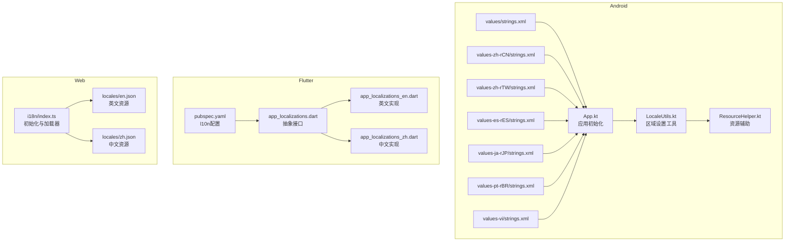
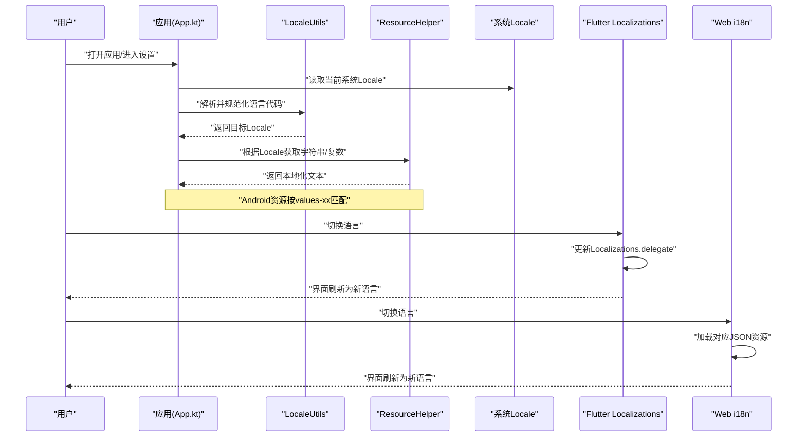
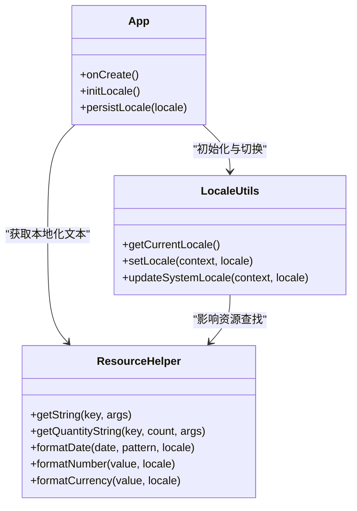
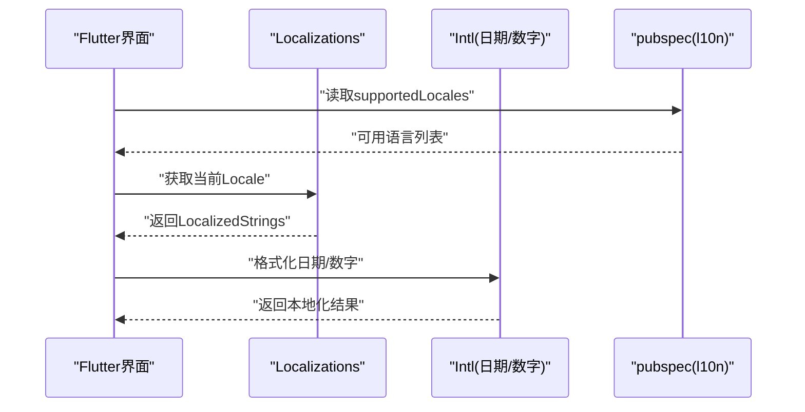
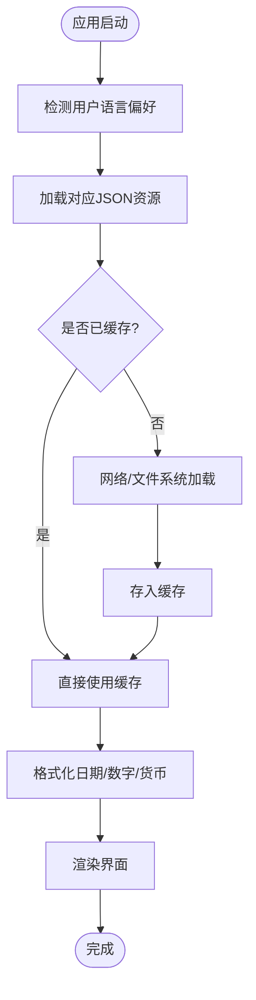
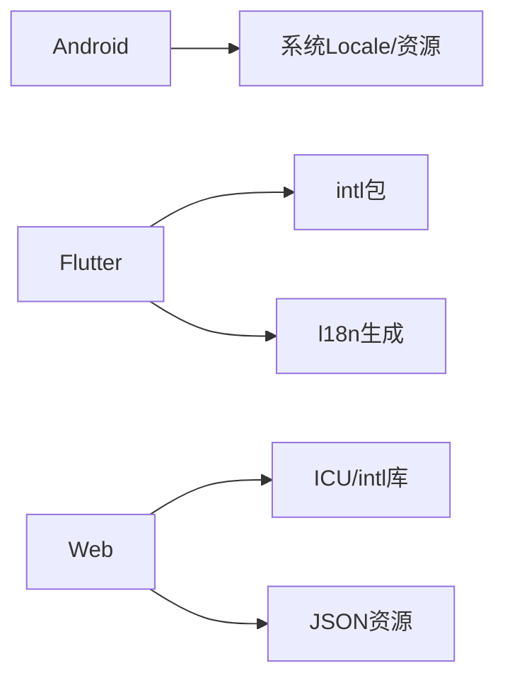

# 国际化支持

<cite>
**本文档引用的文件**   
- [app/src/main/res/values/strings.xml](file://app/src/main/res/values/strings.xml)
- [app/src/main/res/values-zh-rCN/strings.xml](file://app/src/main/res/values-zh-rCN/strings.xml)
- [app/src/main/res/values-zh-rTW/strings.xml](file://app/src/main/res/values-zh-rTW/strings.xml)
- [app/src/main/res/values-es-rES/strings.xml](file://app/src/main/res/values-es-rES/strings.xml)
- [app/src/main/res/values-ja-rJP/strings.xml](file://app/src/main/res/values-ja-rJP/strings.xml)
- [app/src/main/res/values-pt-rBR/strings.xml](file://app/src/main/res/values-pt-rBR/strings.xml)
- [app/src/main/res/values-vi/strings.xml](file://app/src/main/res/values-vi/strings.xml)
- [app/src/main/java/io/legado/app/App.kt](file://app/src/main/java/io/legado/app/App.kt)
- [app/src/main/java/io/legado/app/utils/LocaleUtils.kt](file://app/src/main/java/io/legado/app/utils/LocaleUtils.kt)
- [app/src/main/java/io/legado/app/help/ResourceHelper.kt](file://app/src/main/java/io/legado/app/help/ResourceHelper.kt)
- [app/src/test/java/io/legado/app/config/LocaleResourceConsistencyTest.kt](file://app/src/test/java/io/legado/app/config/LocaleResourceConsistencyTest.kt)
- [app/src/test/java/io/legado/app/config/PackagedLocalesTest.kt](file://app/src/test/java/io/legado/app/config/PackagedLocalesTest.kt)
- [flutter_legado/lib/src/l10n/app_localizations.dart](file://flutter_legado/lib/src/l10n/app_localizations.dart)
- [flutter_legado/lib/src/l10n/app_localizations_en.dart](file://flutter_legado/lib/src/l10n/app_localizations_en.dart)
- [flutter_legado/lib/src/l10n/app_localizations_zh.dart](file://flutter_legado/lib/src/l10n/app_localizations_zh.dart)
- [flutter_legado/pubspec.yaml](file://flutter_legado/pubspec.yaml)
- [modules/web/src/i18n/index.ts](file://modules/web/src/i18n/index.ts)
- [modules/web/src/i18n/locales/en.json](file://modules/web/src/i18n/locales/en.json)
- [modules/web/src/i18n/locales/zh.json](file://modules/web/src/i18n/locales/zh.json)
</cite>

## 目录
1. [简介](#简介)
2. [项目结构](#项目结构)
3. [核心组件](#核心组件)
4. [架构总览](#架构总览)
5. [详细组件分析](#详细组件分析)
6. [依赖分析](#依赖分析)
7. [性能考虑](#性能考虑)
8. [故障排查指南](#故障排查指南)
9. [结论](#结论)
10. [附录](#附录)

## 简介
本文件面向Legado项目的国际化（i18n）能力，覆盖Android原生、Flutter与Web三端的本地化实现。内容涵盖：
- 多语言文本管理：资源文件组织、语言包加载、动态切换
- 日期时间格式本地化：格式化、时区、日历系统
- 数字格式本地化：数字、货币、百分比等区域设置
- 文本方向支持：LTR/RTL布局适配
- 复数形式处理：不同语言的复数规则与数量词变化
- 开发工具链：翻译管理、字符串提取、格式校验
- 配置示例与测试方法

## 项目结构
本项目在三个平台分别实现了国际化：
- Android端使用Android资源体系（values-xx），通过Locale与Configuration进行语言选择与切换
- Flutter端使用arb与生成的Localizations类，提供类型安全的本地化访问
- Web端使用JSON资源与i18n库，运行时按需加载语言包

图表来源
- [app/src/main/res/values/strings.xml](file://app/src/main/res/values/strings.xml)
- [app/src/main/res/values-zh-rCN/strings.xml](file://app/src/main/res/values-zh-rCN/strings.xml)
- [app/src/main/res/values-zh-rTW/strings.xml](file://app/src/main/res/values-zh-rTW/strings.xml)
- [app/src/main/res/values-es-rES/strings.xml](file://app/src/main/res/values-es-rES/strings.xml)
- [app/src/main/res/values-ja-rJP/strings.xml](file://app/src/main/res/values-ja-rJP/strings.xml)
- [app/src/main/res/values-pt-rBR/strings.xml](file://app/src/main/res/values-pt-rBR/strings.xml)
- [app/src/main/res/values-vi/strings.xml](file://app/src/main/res/values-vi/strings.xml)
- [app/src/main/java/io/legado/app/App.kt](file://app/src/main/java/io/legado/app/App.kt)
- [app/src/main/java/io/legado/app/utils/LocaleUtils.kt](file://app/src/main/java/io/legado/app/utils/LocaleUtils.kt)
- [app/src/main/java/io/legado/app/help/ResourceHelper.kt](file://app/src/main/java/io/legado/app/help/ResourceHelper.kt)
- [flutter_legado/pubspec.yaml](file://flutter_legado/pubspec.yaml)
- [flutter_legado/lib/src/l10n/app_localizations.dart](file://flutter_legado/lib/src/l10n/app_localizations.dart)
- [flutter_legado/lib/src/l18n/app_localizations_en.dart](file://flutter_legado/lib/src/l10n/app_localizations_en.dart)
- [flutter_legado/lib/src/l10n/app_localizations_zh.dart](file://flutter_legado/lib/src/l10n/app_localizations_zh.dart)
- [modules/web/src/i18n/index.ts](file://modules/web/src/i18n/index.ts)
- [modules/web/src/i18n/locales/en.json](file://modules/web/src/i18n/locales/en.json)
- [modules/web/src/i18n/locales/zh.json](file://modules/web/src/i18n/locales/zh.json)

章节来源
- [app/src/main/java/io/legado/app/App.kt](file://app/src/main/java/io/legado/app/App.kt)
- [app/src/main/java/io/legado/app/utils/LocaleUtils.kt](file://app/src/main/java/io/legado/app/utils/LocaleUtils.kt)
- [app/src/main/java/io/legado/app/help/ResourceHelper.kt](file://app/src/main/java/io/legado/app/help/ResourceHelper.kt)
- [flutter_legado/pubspec.yaml](file://flutter_legado/pubspec.yaml)
- [flutter_legado/lib/src/l10n/app_localizations.dart](file://flutter_legado/lib/src/l10n/app_localizations.dart)
- [modules/web/src/i18n/index.ts](file://modules/web/src/i18n/index.ts)

## 核心组件
- Android资源与工具
  - 多语言资源目录：values、values-zh-rCN、values-zh-rTW、values-es-rES、values-ja-rJP、values-pt-rBR、values-vi
  - 应用初始化：负责设置默认Locale、持久化用户偏好
  - Locale工具：获取当前Locale、转换语言、更新系统配置
  - 资源辅助：统一字符串、复数、样式资源的获取入口
- Flutter本地化
  - arb资源与生成代码：app_localizations.dart为抽象层，具体语言由对应文件实现
  - pubspec中声明l10n配置，指定supportedLocales与arb路径
- Web国际化
  - i18n模块负责加载JSON资源、缓存语言包、提供统一的字符串与格式化API

章节来源
- [app/src/main/res/values/strings.xml](file://app/src/main/res/values/strings.xml)
- [app/src/main/res/values-zh-rCN/strings.xml](file://app/src/main/res/values-zh-rCN/strings.xml)
- [app/src/main/res/values-zh-rTW/strings.xml](file://app/src/main/res/values-zh-rTW/strings.xml)
- [app/src/main/res/values-es-rES/strings.xml](file://app/src/main/res/values-es-rES/strings.xml)
- [app/src/main/res/values-ja-rJP/strings.xml](file://app/src/main/res/values-ja-rJP/strings.xml)
- [app/src/main/res/values-pt-rBR/strings.xml](file://app/src/main/res/values-pt-rBR/strings.xml)
- [app/src/main/res/values-vi/strings.xml](file://app/src/main/res/values-vi/strings.xml)
- [app/src/main/java/io/legado/app/App.kt](file://app/src/main/java/io/legado/app/App.kt)
- [app/src/main/java/io/legado/app/utils/LocaleUtils.kt](file://app/src/main/java/io/legado/app/utils/LocaleUtils.kt)
- [app/src/main/java/io/legado/app/help/ResourceHelper.kt](file://app/src/main/java/io/legado/app/help/ResourceHelper.kt)
- [flutter_legado/lib/src/l10n/app_localizations.dart](file://flutter_legado/lib/src/l10n/app_localizations.dart)
- [flutter_legado/pubspec.yaml](file://flutter_legado/pubspec.yaml)
- [modules/web/src/i18n/index.ts](file://modules/web/src/i18n/index.ts)

## 架构总览
下图展示三端国际化数据流与关键交互点：Android通过系统Locale与资源管理器；Flutter通过Generated Localizations；Web通过JSON加载器。

图表来源
- [app/src/main/java/io/legado/app/App.kt](file://app/src/main/java/io/legado/app/App.kt)
- [app/src/main/java/io/legado/app/utils/LocaleUtils.kt](file://app/src/main/java/io/legado/app/utils/LocaleUtils.kt)
- [app/src/main/java/io/legado/app/help/ResourceHelper.kt](file://app/src/main/java/io/legado/app/help/ResourceHelper.kt)
- [flutter_legado/lib/src/l10n/app_localizations.dart](file://flutter_legado/lib/src/l10n/app_localizations.dart)
- [modules/web/src/i18n/index.ts](file://modules/web/src/i18n/index.ts)

## 详细组件分析

### Android本地化组件
- 资源组织
  - 默认资源：values/strings.xml
  - 地区变体：values-zh-rCN、values-zh-rTW、values-es-rES、values-ja-rJP、values-pt-rBR、values-vi
  - 命名规范：key一致，value按语言区分
- 语言包加载与动态切换
  - App.kt在启动阶段设置默认Locale并持久化
  - LocaleUtils提供获取当前Locale、转换语言、更新系统配置的方法
  - ResourceHelper封装getString、getQuantityString等方法，屏蔽底层差异
- 日期时间与数字本地化
  - 使用系统提供的DateFormat、NumberFormat、CurrencyFormat等，自动遵循当前Locale的格式规则
  - 时区与日历系统由系统Locale决定，必要时可显式传入TimeZone或Calendar实例
- LTR/RTL支持
  - 通过androidx.appcompat与Material主题中的layoutDirection属性控制
  - 对需要RTL的语言（如阿拉伯语、希伯来语）需准备相应布局与图标资源
- 复数形式
  - Android资源支持plurals标签，按语言复数规则显示不同文案
  - 调用时传入数量参数，框架自动选择正确的复数形式

图表来源
- [app/src/main/java/io/legado/app/App.kt](file://app/src/main/java/io/legado/app/App.kt)
- [app/src/main/java/io/legado/app/utils/LocaleUtils.kt](file://app/src/main/java/io/legado/app/utils/LocaleUtils.kt)
- [app/src/main/java/io/legado/app/help/ResourceHelper.kt](file://app/src/main/java/io/legado/app/help/ResourceHelper.kt)

章节来源
- [app/src/main/res/values/strings.xml](file://app/src/main/res/values/strings.xml)
- [app/src/main/res/values-zh-rCN/strings.xml](file://app/src/main/res/values-zh-rCN/strings.xml)
- [app/src/main/res/values-zh-rTW/strings.xml](file://app/src/main/res/values-zh-rTW/strings.xml)
- [app/src/main/res/values-es-rES/strings.xml](file://app/src/main/res/values-es-rES/strings.xml)
- [app/src/main/res/values-ja-rJP/strings.xml](file://app/src/main/res/values-ja-rJP/strings.xml)
- [app/src/main/res/values-pt-rBR/strings.xml](file://app/src/main/res/values-pt-rBR/strings.xml)
- [app/src/main/res/res/values-vi/strings.xml](file://app/src/main/res/values-vi/strings.xml)
- [app/src/main/java/io/legado/app/App.kt](file://app/src/main/java/io/legado/app/App.kt)
- [app/src/main/java/io/legado/app/utils/LocaleUtils.kt](file://app/src/main/java/io/legado/app/utils/LocaleUtils.kt)
- [app/src/main/java/io/legado/app/help/ResourceHelper.kt](file://app/src/main/java/io/legado/app/help/ResourceHelper.kt)

### Flutter本地化组件
- 资源与生成
  - 使用arb文件定义键值对，通过l18n工具生成app_localizations.dart及具体语言实现
  - pubspec.yaml中配置supportedLocales与arb路径，确保构建产物包含所需语言
- 运行时切换
  - 通过GlobalMaterialLocalizations与WidgetsBinding.instance.updateLocaleIfNecessary更新Locale
  - Localizations.of(context)获取当前语言上下文，调用对应字符串方法
- 日期与数字
  - 使用intl包提供的DateFormat与NumberFormat，传入Locale以适配不同地区格式
- LTR/RTL
  - MaterialApp的textDirection可由Localizations.localeOf(context).languageCode决定
- 复数形式
  - intl包支持MessageFormat与Pluralization，按语言规则渲染

图表来源
- [flutter_legado/lib/src/l10n/app_localizations.dart](file://flutter_legado/lib/src/l10n/app_localizations.dart)
- [flutter_legado/lib/src/l10n/app_localizations_en.dart](file://flutter_legado/lib/src/l10n/app_localizations_en.dart)
- [flutter_legado/lib/src/l10n/app_localizations_zh.dart](file://flutter_legado/lib/src/l10n/app_localizations_zh.dart)
- [flutter_legado/pubspec.yaml](file://flutter_legado/pubspec.yaml)

章节来源
- [flutter_legado/lib/src/l10n/app_localizations.dart](file://flutter_legado/lib/src/l10n/app_localizations.dart)
- [flutter_legado/lib/src/l10n/app_localizations_en.dart](file://flutter_legado/lib/src/l10n/app_localizations_en.dart)
- [flutter_legado/lib/src/l10n/app_localizations_zh.dart](file://flutter_legado/lib/src/l10n/app_localizations_zh.dart)
- [flutter_legado/pubspec.yaml](file://flutter_legado/pubspec.yaml)

### Web国际化组件
- 资源组织
  - JSON文件存放于locales目录，按语言分文件（en.json、zh.json）
- 加载与缓存
  - i18n模块在首次使用时加载对应语言包，后续缓存避免重复请求
- 格式化
  - 使用intl或类似库进行日期、数字、货币格式化，依据当前Locale
- LTR/RTL
  - 根据locale.languageCode设置document.dir或CSS变量，驱动布局方向
- 复数形式
  - 使用ICU MessageFormat或库内置复数规则

图表来源
- [modules/web/src/i18n/index.ts](file://modules/web/src/i18n/index.ts)
- [modules/web/src/i18n/locales/en.json](file://modules/web/src/i18n/locales/en.json)
- [modules/web/src/i18n/locales/zh.json](file://modules/web/src/i18n/locales/zh.json)

章节来源
- [modules/web/src/i18n/index.ts](file://modules/web/src/i18n/index.ts)
- [modules/web/src/i18n/locales/en.json](file://modules/web/src/i18n/locales/en.json)
- [modules/web/src/i18n/locales/zh.json](file://modules/web/src/i18n/locales/zh.json)

## 依赖分析
- Android
  - 依赖系统Locale与资源管理器，无第三方i18n库
  - 若使用Material/AndroidX，可能引入布局方向与主题相关依赖
- Flutter
  - 依赖intl与l18n工具链，生成代码与运行时格式化
- Web
  - 依赖intl或ICU兼容库进行格式化，JSON资源作为静态资产

图表来源
- [app/src/main/java/io/legado/app/App.kt](file://app/src/main/java/io/legado/app/App.kt)
- [flutter_legado/pubspec.yaml](file://flutter_legado/pubspec.yaml)
- [modules/web/src/i18n/index.ts](file://modules/web/src/i18n/index.ts)

章节来源
- [app/src/main/java/io/legado/app/App.kt](file://app/src/main/java/io/legado/app/App.kt)
- [flutter_legado/pubspec.yaml](file://flutter_legado/pubspec.yaml)
- [modules/web/src/i18n/index.ts](file://modules/web/src/i18n/index.ts)

## 性能考虑
- 资源体积
  - 仅打包必要语言，避免冗余资源增大APK/IPA/Web包体
- 加载时机
  - Android：启动时预加载常用语言，延迟加载冷门语言
  - Flutter：按需加载语言包，避免首屏阻塞
  - Web：懒加载语言包，结合CDN与缓存策略
- 格式化开销
  - 复用DateFormat/NumberFormat实例，减少对象创建
  - 批量格式化时缓存中间结果
- 布局重排
  - RTL切换时尽量减少不必要的重建，使用局部刷新

[本节为通用指导，不直接分析具体文件]

## 故障排查指南
- 常见问题
  - 字符串缺失：检查values-xx目录下是否存在对应key
  - 复数不正确：确认plurals定义与数量参数传递正确
  - 日期/货币格式异常：检查系统Locale与格式化参数
  - RTL布局错乱：确认布局文件与图标资源是否适配RTL
- 测试用例
  - Locale资源一致性校验：确保各语言文件key一致
  - 打包语言验证：确认最终产物包含预期语言包
- 调试建议
  - 打印当前Locale与资源查找路径
  - 使用模拟器切换系统语言验证界面行为

章节来源
- [app/src/test/java/io/legado/app/config/LocaleResourceConsistencyTest.kt](file://app/src/test/java/io/legado/app/config/LocaleResourceConsistencyTest.kt)
- [app/src/test/java/io/legado/app/config/PackagedLocalesTest.kt](file://app/src/test/java/io/legado/app/config/PackagedLocalesTest.kt)

## 结论
Legado在多端实现了完善的国际化支持：Android基于系统资源与Locale工具，Flutter通过l18n生成代码，Web采用JSON资源与格式化库。通过统一的工具与测试保障，确保了文本、日期、数字、方向与复数的本地化质量。建议在新增语言时同步完善资源、格式化与RTL适配，并通过自动化测试保证一致性。

[本节为总结性内容，不直接分析具体文件]

## 附录
- 配置示例
  - Android：在values-xx下添加strings.xml，保持key一致
  - Flutter：在pubspec.yaml中配置supportedLocales与arb路径
  - Web：在locales目录下新增语言JSON文件，并在i18n模块注册
- 多语言测试方法
  - 单元测试：校验资源一致性、语言包完整性
  - 集成测试：切换系统语言后验证界面与行为
  - 手动测试：覆盖常见场景（日期、货币、复数、RTL）

[本节为补充信息，不直接分析具体文件]