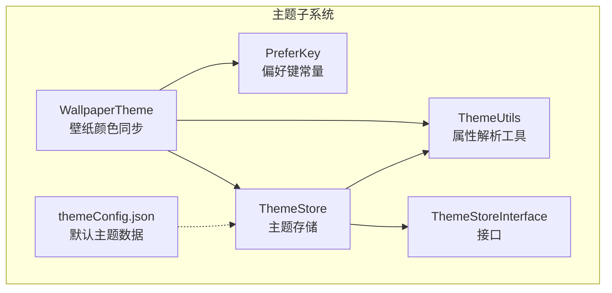
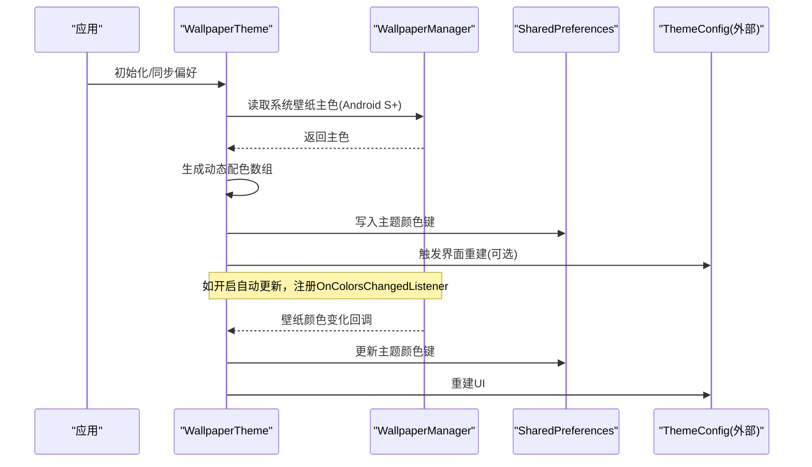
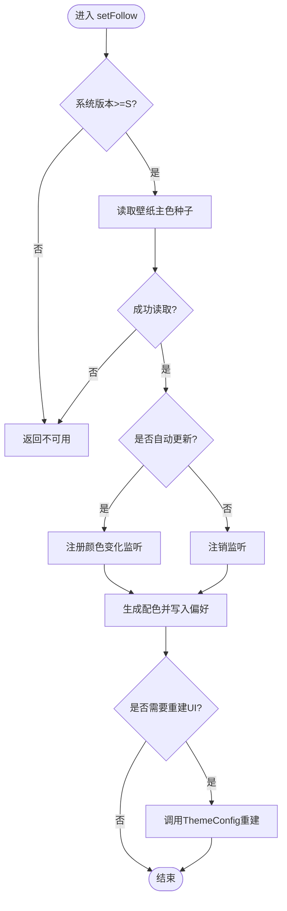
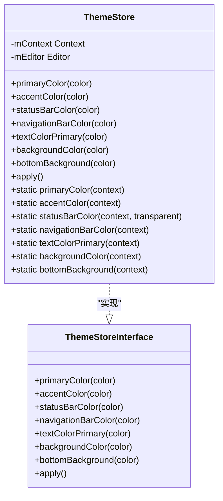
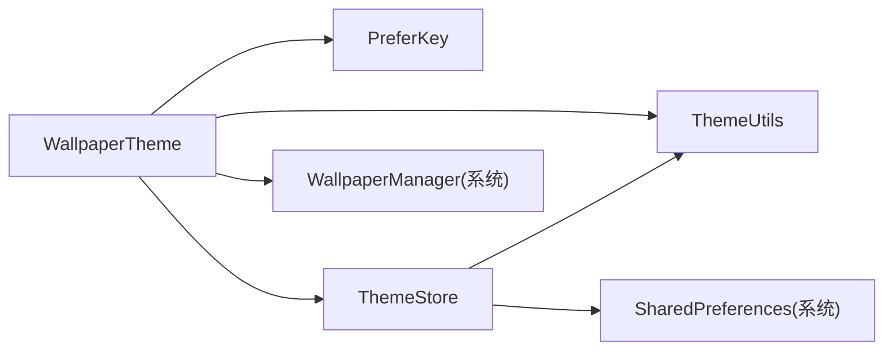

# 壁纸主题支持

<cite>
**本文引用的文件**
- [WallpaperTheme.kt](file://app/src/main/java/io/legado/app/lib/theme/WallpaperTheme.kt)
- [ThemeStore.kt](file://app/src/main/java/io/legado/app/lib/theme/ThemeStore.kt)
- [ThemeStoreInterface.kt](file://app/src/main/java/io/legado/app/lib/theme/ThemeStoreInterface.kt)
- [ThemeUtils.kt](file://app/src/main/java/io/legado/app/lib/theme/ThemeUtils.kt)
- [PreferKey.kt](file://app/src/main/java/io/legado/app/constant/PreferKey.kt)
- [themeConfig.json](file://app/src/main/assets/defaultData/themeConfig.json)
</cite>

## 目录
1. [简介](#简介)
2. [项目结构](#项目结构)
3. [核心组件](#核心组件)
4. [架构总览](#架构总览)
5. [详细组件分析](#详细组件分析)
6. [依赖关系分析](#依赖关系分析)
7. [性能考虑](#性能考虑)
8. [故障排查指南](#故障排查指南)
9. [结论](#结论)
10. [附录](#附录)

## 简介
本文件围绕 Legado 的“壁纸主题支持”能力进行系统化说明，重点阐述 Android 系统壁纸颜色同步（Android S+）的实现机制、与主题存储和配置的协作方式，以及默认主题数据的组织形式。文档面向开发者与高级用户，既提供高层概览，也给出代码级流程与关键路径定位，便于理解、扩展与维护。

## 项目结构
壁纸主题相关代码集中在 app 模块的主题库中，主要包含：
- 壁纸颜色同步与监听：WallpaperTheme
- 主题配置读写与持久化：ThemeStore、ThemeStoreInterface、ThemeUtils
- 偏好键定义：PreferKey
- 默认主题数据：themeConfig.json

图表来源
- [WallpaperTheme.kt:1-177](file://app/src/main/java/io/legado/app/lib/theme/WallpaperTheme.kt#L1-L177)
- [ThemeStore.kt:1-352](file://app/src/main/java/io/legado/app/lib/theme/ThemeStore.kt#L1-L352)
- [ThemeStoreInterface.kt:1-93](file://app/src/main/java/io/legado/app/lib/theme/ThemeStoreInterface.kt#L1-L93)
- [ThemeUtils.kt:1-44](file://app/src/main/java/io/legado/app/lib/theme/ThemeUtils.kt#L1-L44)
- [PreferKey.kt:200-236](file://app/src/main/java/io/legado/app/constant/PreferKey.kt#L200-L236)
- [themeConfig.json:1-34](file://app/src/main/assets/defaultData/themeConfig.json#L1-L34)

章节来源
- [WallpaperTheme.kt:1-177](file://app/src/main/java/io/legado/app/lib/theme/WallpaperTheme.kt#L1-L177)
- [ThemeStore.kt:1-352](file://app/src/main/java/io/legado/app/lib/theme/ThemeStore.kt#L1-L352)
- [ThemeStoreInterface.kt:1-93](file://app/src/main/java/io/legado/app/lib/theme/ThemeStoreInterface.kt#L1-L93)
- [ThemeUtils.kt:1-44](file://app/src/main/java/io/legado/app/lib/theme/ThemeUtils.kt#L1-L44)
- [PreferKey.kt:200-236](file://app/src/main/java/io/legado/app/constant/PreferKey.kt#L200-L236)
- [themeConfig.json:1-34](file://app/src/main/assets/defaultData/themeConfig.json#L1-L34)

## 核心组件
- WallpaperTheme：负责读取系统壁纸主色、生成动态配色数组、写入主题偏好并触发界面重建；在 Android S+ 上可注册壁纸颜色变化监听，实现自动跟随更新。
- ThemeStore：统一的主题颜色读写入口，封装 SharedPreferences 操作，提供多种便捷 API 与静态访问器。
- ThemeStoreInterface：ThemeStore 的接口定义，约束主题颜色与状态的可写项。
- ThemeUtils：从当前主题属性解析颜色、浮点值与 Drawable，避免重复获取与资源泄漏。
- PreferKey：集中管理所有偏好键名，包括壁纸跟随开关与自动更新开关等。
- themeConfig.json：内置多套默认主题（含明/暗），用于初始化或恢复默认样式。

章节来源
- [WallpaperTheme.kt:1-177](file://app/src/main/java/io/legado/app/lib/theme/WallpaperTheme.kt#L1-L177)
- [ThemeStore.kt:1-352](file://app/src/main/java/io/legado/app/lib/theme/ThemeStore.kt#L1-L352)
- [ThemeStoreInterface.kt:1-93](file://app/src/main/java/io/legado/app/lib/theme/ThemeStoreInterface.kt#L1-L93)
- [ThemeUtils.kt:1-44](file://app/src/main/java/io/legado/app/lib/theme/ThemeUtils.kt#L1-L44)
- [PreferKey.kt:200-236](file://app/src/main/java/io/legado/app/constant/PreferKey.kt#L200-L236)
- [themeConfig.json:1-34](file://app/src/main/assets/defaultData/themeConfig.json#L1-L34)

## 架构总览
壁纸主题支持的核心流程如下：
- 启动时根据偏好决定是否启用“跟随壁纸颜色”，若启用且支持系统版本则立即应用一次颜色。
- 当开启自动更新时，注册系统壁纸颜色变化监听；壁纸主色变化时重新计算并写入主题偏好，必要时重建活动以刷新 UI。
- 用户手动修改任意主题颜色时，自动关闭“跟随壁纸颜色”模式，避免冲突。

图表来源
- [WallpaperTheme.kt:42-80](file://app/src/main/java/io/legado/app/lib/theme/WallpaperTheme.kt#L42-L80)
- [WallpaperTheme.kt:107-113](file://app/src/main/java/io/legado/app/lib/theme/WallpaperTheme.kt#L107-L113)
- [WallpaperTheme.kt:115-134](file://app/src/main/java/io/legado/app/lib/theme/WallpaperTheme.kt#L115-L134)
- [WallpaperTheme.kt:137-157](file://app/src/main/java/io/legado/app/lib/theme/WallpaperTheme.kt#L137-L157)

## 详细组件分析

### WallpaperTheme：壁纸颜色同步与自动更新
- 功能要点
  - 版本检测：仅在 Android S+ 可用。
  - 跟随开关：setFollow 控制是否跟随壁纸颜色，支持自动更新开关。
  - 颜色生成：基于 HCT 与 MaterialDynamicColors/SchemeContent 生成日/夜两套配色。
  - 写入策略：对比现有偏好值，避免无意义写入；必要时重建活动以刷新 UI。
  - 监听管理：注册/注销 OnColorsChangedListener，处理系统壁纸颜色变化事件。
  - 冲突处理：当用户手动修改主题颜色时，自动关闭跟随模式。

图表来源
- [WallpaperTheme.kt:42-60](file://app/src/main/java/io/legado/app/lib/theme/WallpaperTheme.kt#L42-L60)
- [WallpaperTheme.kt:82-98](file://app/src/main/java/io/legado/app/lib/theme/WallpaperTheme.kt#L82-L98)
- [WallpaperTheme.kt:115-134](file://app/src/main/java/io/legado/app/lib/theme/WallpaperTheme.kt#L115-L134)
- [WallpaperTheme.kt:137-157](file://app/src/main/java/io/legado/app/lib/theme/WallpaperTheme.kt#L137-L157)

章节来源
- [WallpaperTheme.kt:1-177](file://app/src/main/java/io/legado/app/lib/theme/WallpaperTheme.kt#L1-L177)

### ThemeStore：主题颜色存储与访问
- 功能要点
  - 提供丰富的 setter/getter 方法，覆盖主色、强调色、状态栏/导航栏、文本色、背景等。
  - 支持从资源 ID 或主题属性构造颜色值。
  - apply() 统一标记变更时间戳与已配置标志，确保后续逻辑感知到主题更新。
  - 静态访问器提供便捷的全局读取，带默认回退值。

图表来源
- [ThemeStoreInterface.kt:1-93](file://app/src/main/java/io/legado/app/lib/theme/ThemeStoreInterface.kt#L1-L93)
- [ThemeStore.kt:1-352](file://app/src/main/java/io/legado/app/lib/theme/ThemeStore.kt#L1-L352)

章节来源
- [ThemeStore.kt:1-352](file://app/src/main/java/io/legado/app/lib/theme/ThemeStore.kt#L1-L352)
- [ThemeStoreInterface.kt:1-93](file://app/src/main/java/io/legado/app/lib/theme/ThemeStoreInterface.kt#L1-L93)

### ThemeUtils：主题属性解析工具
- 功能要点
  - resolveColor/resolveFloat/resolveDrawable 通过 obtainStyledAttributes 安全地解析主题属性，避免异常与资源泄漏。
  - 为 ThemeStore 与上层 UI 提供稳定的属性读取能力。

章节来源
- [ThemeUtils.kt:1-44](file://app/src/main/java/io/legado/app/lib/theme/ThemeUtils.kt#L1-L44)

### PreferKey：偏好键集中管理
- 功能要点
  - 集中定义壁纸跟随与自动更新的键名：wallpaperColorFollow、wallpaperColorAutoUpdate。
  - 同时维护明/暗主题的颜色键与背景图键，便于统一管理与迁移。

章节来源
- [PreferKey.kt:200-236](file://app/src/main/java/io/legado/app/constant/PreferKey.kt#L200-L236)

### themeConfig.json：默认主题数据
- 功能要点
  - 内置多套主题（默认、典雅蓝、黑白、A屏黑），区分明/暗模式。
  - 字段包括主题名称、是否夜间、主色、强调色、背景色、底部背景色等。
  - 可用于首次安装或恢复默认主题的初始化场景。

章节来源
- [themeConfig.json:1-34](file://app/src/main/assets/defaultData/themeConfig.json#L1-L34)

## 依赖关系分析
- 组件耦合
  - WallpaperTheme 依赖 PreferKey 读取/写入偏好，依赖 ThemeStore 与 ThemeUtils 完成颜色解析与应用。
  - ThemeStore 依赖 ThemeUtils 解析主题属性，并通过 SharedPreferences 持久化。
  - 壁纸颜色监听由系统 WallpaperManager 驱动，WallpaperTheme 负责生命周期管理。
- 外部依赖
  - Android S+ 的 WallpaperManager.OnColorsChangedListener 与 getWallpaperColors 能力。
  - Material Dynamic Colors/HCT 用于生成一致的日/夜配色方案。

图表来源
- [WallpaperTheme.kt:1-177](file://app/src/main/java/io/legado/app/lib/theme/WallpaperTheme.kt#L1-L177)
- [ThemeStore.kt:1-352](file://app/src/main/java/io/legado/app/lib/theme/ThemeStore.kt#L1-L352)
- [ThemeUtils.kt:1-44](file://app/src/main/java/io/legado/app/lib/theme/ThemeUtils.kt#L1-L44)
- [PreferKey.kt:200-236](file://app/src/main/java/io/legado/app/constant/PreferKey.kt#L200-L236)

章节来源
- [WallpaperTheme.kt:1-177](file://app/src/main/java/io/legado/app/lib/theme/WallpaperTheme.kt#L1-L177)
- [ThemeStore.kt:1-352](file://app/src/main/java/io/legado/app/lib/theme/ThemeStore.kt#L1-L352)
- [ThemeUtils.kt:1-44](file://app/src/main/java/io/legado/app/lib/theme/ThemeUtils.kt#L1-L44)
- [PreferKey.kt:200-236](file://app/src/main/java/io/legado/app/constant/PreferKey.kt#L200-L236)

## 性能考虑
- 避免无效写入：在应用颜色前比较现有偏好值，减少不必要的磁盘 I/O 与 UI 重建。
- 监听生命周期：仅在需要时注册系统壁纸颜色监听，并在退出或关闭跟随时及时注销，防止内存泄漏与后台唤醒。
- 主线程调度：使用主线程 Handler 投递系统回调，保证 UI 一致性。
- 动态配色计算：HCT 与 SchemeContent 的计算开销可控，但应避免频繁触发；建议在壁纸变化回调中合并处理。

[本节为通用指导，不直接分析具体文件]

## 故障排查指南
- 无法跟随壁纸颜色
  - 检查系统版本是否低于 Android S（API 31）。
  - 确认 wallpaperColorFollow 与 wallpaperColorAutoUpdate 偏好键设置是否正确。
  - 查看是否被用户手动修改过主题颜色导致自动关闭跟随。
- 壁纸颜色变化未生效
  - 确认 OnColorsChangedListener 已成功注册且 which 位掩码匹配 FLAG_SYSTEM。
  - 检查 colorsForSeed 生成的颜色数组是否与偏好键一一对应。
  - 观察是否需要重建活动以刷新 UI。
- 主题颜色未持久化
  - 检查 ThemeStore.apply() 是否被调用，确保 VALUES_CHANGED 与 IS_CONFIGURED_KEY 被写入。
  - 验证 SharedPreferences 权限与存储路径。

章节来源
- [WallpaperTheme.kt:107-113](file://app/src/main/java/io/legado/app/lib/theme/WallpaperTheme.kt#L107-L113)
- [WallpaperTheme.kt:137-157](file://app/src/main/java/io/legado/app/lib/theme/WallpaperTheme.kt#L137-L157)
- [ThemeStore.kt:166-171](file://app/src/main/java/io/legado/app/lib/theme/ThemeStore.kt#L166-L171)

## 结论
Legado 的壁纸主题支持以 WallpaperTheme 为核心，结合 ThemeStore 与 ThemeUtils 完成从系统壁纸颜色到应用主题的一致映射，并通过 PreferKey 统一管理偏好。该方案在 Android S+ 上具备自动跟随能力，兼顾用户体验与性能优化。默认主题数据 themeConfig.json 提供了开箱即用的主题集合，便于快速初始化与恢复。

[本节为总结性内容，不直接分析具体文件]

## 附录
- 关键路径参考
  - 壁纸颜色同步入口：[WallpaperTheme.setFollow:42-60](file://app/src/main/java/io/legado/app/lib/theme/WallpaperTheme.kt#L42-L60)
  - 壁纸颜色监听注册：[WallpaperTheme.registerListener:137-157](file://app/src/main/java/io/legado/app/lib/theme/WallpaperTheme.kt#L137-L157)
  - 动态配色生成：[WallpaperTheme.colorsForSeed:82-98](file://app/src/main/java/io/legado/app/lib/theme/WallpaperTheme.kt#L82-L98)
  - 主题写入与重建：[WallpaperTheme.applyColors:115-134](file://app/src/main/java/io/legado/app/lib/theme/WallpaperTheme.kt#L115-L134)
  - 主题存储接口与实现：[ThemeStoreInterface:1-93](file://app/src/main/java/io/legado/app/lib/theme/ThemeStoreInterface.kt#L1-L93), [ThemeStore:1-352](file://app/src/main/java/io/legado/app/lib/theme/ThemeStore.kt#L1-L352)
  - 偏好键定义：[PreferKey:200-236](file://app/src/main/java/io/legado/app/constant/PreferKey.kt#L200-L236)
  - 默认主题数据：[themeConfig.json:1-34](file://app/src/main/assets/defaultData/themeConfig.json#L1-L34)

[本节为索引信息，不直接分析具体文件]