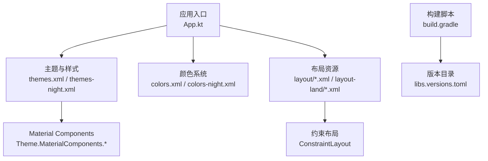
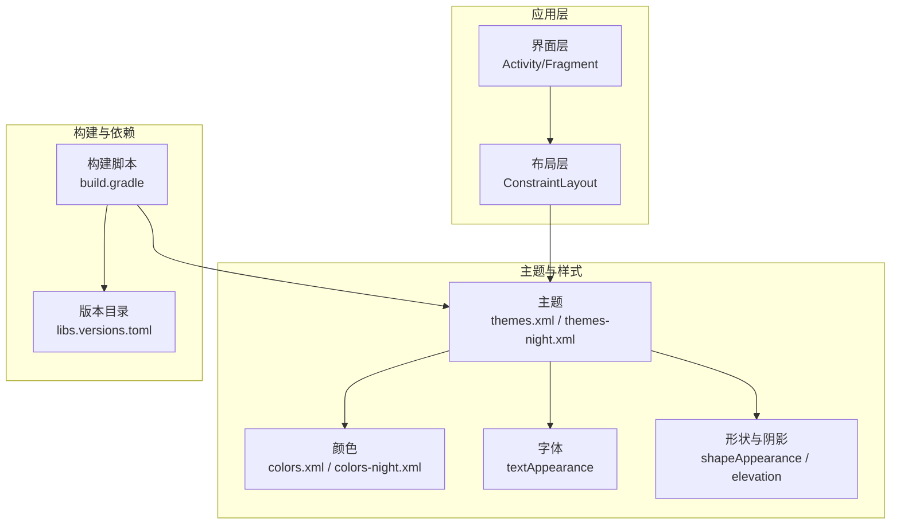
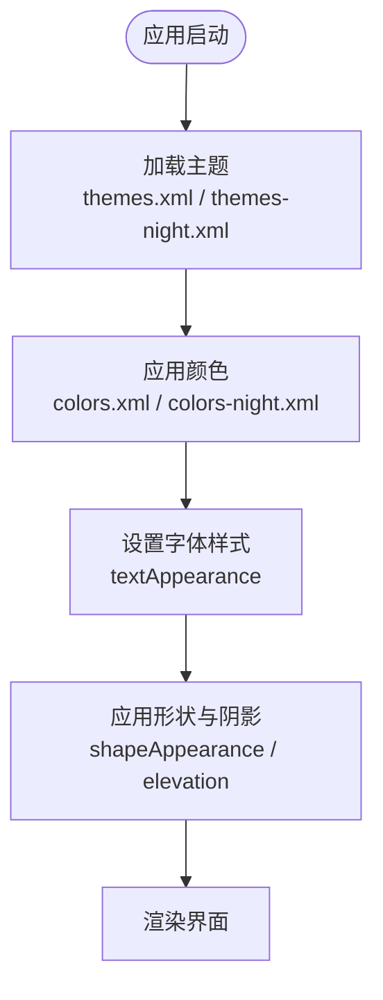
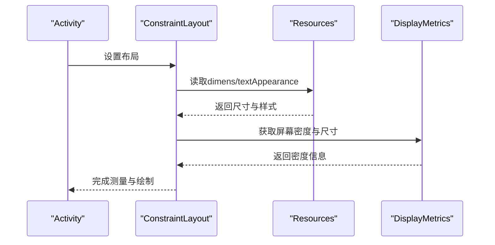
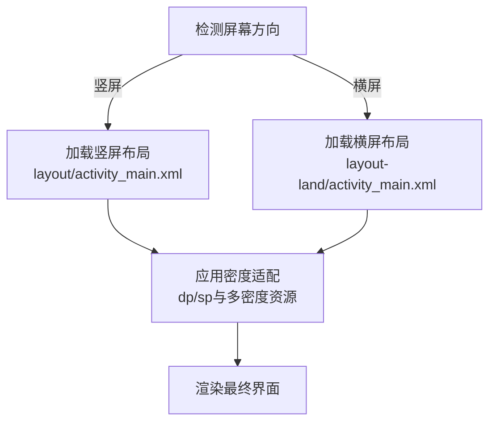
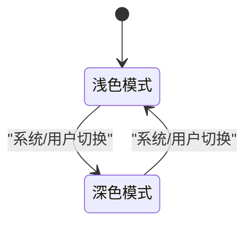
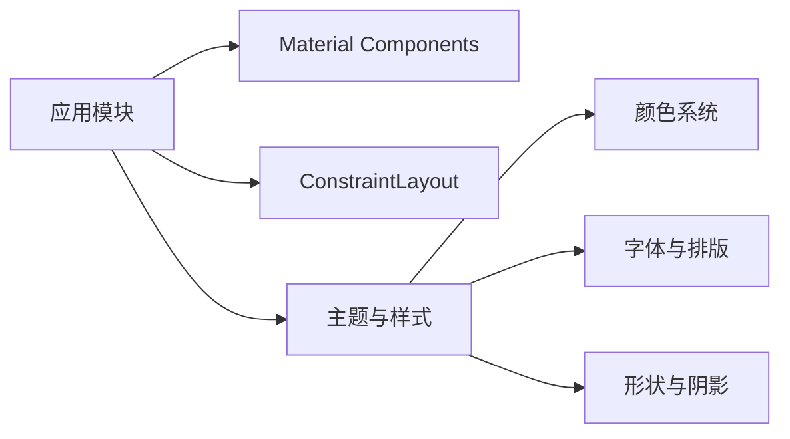

# Android Material Design实现

<cite>
**本文档引用的文件**   
- [app/src/main/res/values/themes.xml](file://app/src/main/res/values/themes.xml)
- [app/src/main/res/values-night/themes.xml](file://app/src/main/res/values-night/themes.xml)
- [app/src/main/res/values/colors.xml](file://app/src/main/res/values/colors.xml)
- [app/src/main/res/values-night/colors.xml](file://app/src/main/res/values-night/colors.xml)
- [app/src/main/res/values/strings.xml](file://app/src/main/res/values/strings.xml)
- [app/src/main/res/layout/activity_main.xml](file://app/src/main/res/layout/activity_main.xml)
- [app/src/main/res/layout-land/activity_main.xml](file://app/src/main/res/layout-land/activity_main.xml)
- [app/src/main/java/io/legado/app/App.kt](file://app/src/main/java/io/legado/app/App.kt)
- [app/build.gradle](file://app/build.gradle)
- [gradle/libs.versions.toml](file://gradle/libs.versions.toml)
</cite>

## 目录
1. [简介](#简介)
2. [项目结构](#项目结构)
3. [核心组件](#核心组件)
4. [架构总览](#架构总览)
5. [详细组件分析](#详细组件分析)
6. [依赖分析](#依赖分析)
7. [性能考虑](#性能考虑)
8. [故障排查指南](#故障排查指南)
9. [结论](#结论)
10. [附录](#附录)

## 简介
本文件面向Android端的Material Design实现，聚焦于Material Components的使用与最佳实践。内容涵盖主题配置、颜色系统、字体规范、阴影与圆角等设计元素；响应式布局（ConstraintLayout、百分比布局、动态尺寸适配）；横竖屏适配策略（layout-land、屏幕密度适配、不同屏幕尺寸的布局调整）；夜间模式（深色主题、颜色资源管理、自动切换机制）；以及组件使用与性能优化建议。文档以仓库中的实际资源与代码为依据，提供可追溯的章节来源与图示来源。

## 项目结构
Android模块的资源组织遵循标准Android工程结构：
- 主题与样式：values/themes.xml、values-night/themes.xml
- 颜色系统：values/colors.xml、values-night/colors.xml
- 字符串与本地化：values/strings.xml 及多语言目录
- 布局：res/layout（竖屏默认）、res/layout-land（横屏）
- 应用入口与初始化：App.kt
- 构建与依赖：app/build.gradle、gradle/libs.versions.toml

图表来源
- [app/src/main/java/io/legado/app/App.kt](file://app/src/main/java/io/legado/app/App.kt)
- [app/src/main/res/values/themes.xml](file://app/src/main/res/values/themes.xml)
- [app/src/main/res/values-night/themes.xml](file://app/src/main/res/values-night/themes.xml)
- [app/src/main/res/values/colors.xml](file://app/src/main/res/values/colors.xml)
- [app/src/main/res/values-night/colors.xml](file://app/src/main/res/values-night/colors.xml)
- [app/src/main/res/layout/activity_main.xml](file://app/src/main/res/layout/activity_main.xml)
- [app/src/main/res/layout-land/activity_main.xml](file://app/src/main/res/layout-land/activity_main.xml)
- [app/build.gradle](file://app/build.gradle)
- [gradle/libs.versions.toml](file://gradle/libs.versions.toml)

章节来源
- [app/src/main/res/values/themes.xml](file://app/src/main/res/values/themes.xml)
- [app/src/main/res/values-night/themes.xml](file://app/src/main/res/values-night/themes.xml)
- [app/src/main/res/values/colors.xml](file://app/src/main/res/values/colors.xml)
- [app/src/main/res/values-night/colors.xml](file://app/src/main/res/values-night/colors.xml)
- [app/src/main/res/layout/activity_main.xml](file://app/src/main/res/layout/activity_main.xml)
- [app/src/main/res/layout-land/activity_main.xml](file://app/src/main/res/layout-land/activity_main.xml)
- [app/src/main/java/io/legado/app/App.kt](file://app/src/main/java/io/legado/app/App.kt)
- [app/build.gradle](file://app/build.gradle)
- [gradle/libs.versions.toml](file://gradle/libs.versions.toml)

## 核心组件
- 主题与样式
  - 使用Material Components的主题基类，统一应用外观与行为。
  - 通过values与values-night两套主题分别定义浅色与深色风格。
- 颜色系统
  - 基于Material Color System，定义primary、secondary、surface、background、on*等语义化颜色。
  - 在night目录下提供深色变体，确保对比度与可读性。
- 字体规范
  - 使用Material Typography，通过textAppearance统一管理字号、字重、行高与间距。
- 阴影与圆角
  - 使用elevation与shapeAppearance组合实现卡片、按钮等元素的阴影与圆角效果。
- 响应式布局
  - 以ConstraintLayout为核心，结合Guideline、Barrier、Chain等工具提升布局弹性。
  - 使用百分比布局或ConstraintLayout的percent属性进行比例控制。
  - 通过dimens与TypedValue动态计算尺寸，适配不同屏幕密度与尺寸。
- 横竖屏适配
  - 使用layout-land提供横屏专用布局，避免复杂条件判断。
  - 针对平板与大屏设备，采用多分辨率资源与分屏支持。
- 夜间模式
  - 通过values-night资源自动切换深色主题。
  - 可在运行时根据用户偏好或系统设置切换主题。

章节来源
- [app/src/main/res/values/themes.xml](file://app/src/main/res/values/themes.xml)
- [app/src/main/res/values-night/themes.xml](file://app/src/main/res/values-night/themes.xml)
- [app/src/main/res/values/colors.xml](file://app/src/main/res/values/colors.xml)
- [app/src/main/res/values-night/colors.xml](file://app/src/main/res/values-night/colors.xml)
- [app/src/main/res/layout/activity_main.xml](file://app/src/main/res/layout/activity_main.xml)
- [app/src/main/res/layout-land/activity_main.xml](file://app/src/main/res/layout-land/activity_main.xml)
- [app/src/main/java/io/legado/app/App.kt](file://app/src/main/java/io/legado/app/App.kt)

## 架构总览
整体架构围绕“主题驱动 + 资源适配”展开：
- App入口负责应用级初始化与主题选择。
- 主题与颜色资源由values与values-night两套目录管理。
- 布局层以ConstraintLayout为主，配合layout-land实现横屏适配。
- 构建脚本与版本目录集中管理Material Components依赖。

图表来源
- [app/src/main/res/values/themes.xml](file://app/src/main/res/values/themes.xml)
- [app/src/main/res/values-night/themes.xml](file://app/src/main/res/values-night/themes.xml)
- [app/src/main/res/values/colors.xml](file://app/src/main/res/values/colors.xml)
- [app/src/main/res/values-night/colors.xml](file://app/src/main/res/values-night/colors.xml)
- [app/build.gradle](file://app/build.gradle)
- [gradle/libs.versions.toml](file://gradle/libs.versions.toml)

## 详细组件分析

### 主题与颜色系统
- 主题配置
  - 使用MaterialComponents主题作为基类，确保组件行为一致。
  - 通过自定义属性覆盖默认样式，如colorPrimary、colorSurface、colorOnSurface等。
- 颜色系统
  - 定义语义化颜色变量，避免硬编码色值。
  - 在night目录下提供深色映射，保证对比度与无障碍要求。
- 字体与排版
  - 使用textAppearance统一管理标题、正文、提示等层级。
  - 通过sp单位保障可访问性与缩放体验。
- 形状与阴影
  - 使用shapeAppearance指定圆角半径与边角样式。
  - 使用elevation控制阴影层级，保持视觉层次清晰。

图表来源
- [app/src/main/res/values/themes.xml](file://app/src/main/res/values/themes.xml)
- [app/src/main/res/values-night/themes.xml](file://app/src/main/res/values-night/themes.xml)
- [app/src/main/res/values/colors.xml](file://app/src/main/res/values/colors.xml)
- [app/src/main/res/values-night/colors.xml](file://app/src/main/res/values-night/colors.xml)

章节来源
- [app/src/main/res/values/themes.xml](file://app/src/main/res/values/themes.xml)
- [app/src/main/res/values-night/themes.xml](file://app/src/main/res/values-night/themes.xml)
- [app/src/main/res/values/colors.xml](file://app/src/main/res/values/colors.xml)
- [app/src/main/res/values-night/colors.xml](file://app/src/main/res/values-night/colors.xml)

### 响应式布局与动态尺寸适配
- ConstraintLayout使用
  - 通过链式约束、Guideline、Barrier、Group等工具构建灵活布局。
  - 使用wrap_content与match_constraint平衡自适应与稳定性。
- 百分比布局
  - 使用ConstraintLayout的percent属性或第三方库实现比例布局。
  - 在大屏设备上合理分配空间，避免过度拉伸。
- 动态尺寸适配
  - 使用Resources获取dimens，结合DisplayMetrics与TypedValue计算dp/sp。
  - 针对不同屏幕密度提供多套资源，确保一致性。

图表来源
- [app/src/main/res/layout/activity_main.xml](file://app/src/main/res/layout/activity_main.xml)
- [app/src/main/res/layout-land/activity_main.xml](file://app/src/main/res/layout-land/activity_main.xml)

章节来源
- [app/src/main/res/layout/activity_main.xml](file://app/src/main/res/layout/activity_main.xml)
- [app/src/main/res/layout-land/activity_main.xml](file://app/src/main/res/layout-land/activity_main.xml)

### 横竖屏适配策略
- layout-land目录
  - 为横屏提供独立布局，避免复杂的条件分支。
  - 针对大屏设备优化导航与信息展示方式。
- 屏幕密度适配
  - 使用dp/sp单位，避免px导致的显示不一致。
  - 提供多套drawable资源，适配不同密度。
- 不同屏幕尺寸的布局调整
  - 使用Qualifiers（如sw600dp、w720dp）区分平板与手机布局。
  - 利用ConstraintLayout的权重与链式约束实现弹性布局。

图表来源
- [app/src/main/res/layout/activity_main.xml](file://app/src/main/res/layout/activity_main.xml)
- [app/src/main/res/layout-land/activity_main.xml](file://app/src/main/res/layout-land/activity_main.xml)

章节来源
- [app/src/main/res/layout/activity_main.xml](file://app/src/main/res/layout/activity_main.xml)
- [app/src/main/res/layout-land/activity_main.xml](file://app/src/main/res/layout-land/activity_main.xml)

### 夜间模式的实现
- 深色主题配置
  - 在values-night下定义与浅色主题对应的颜色与样式。
  - 确保对比度符合无障碍标准。
- 颜色资源管理
  - 使用语义化颜色变量，避免直接引用具体色值。
  - 在night目录下提供深色映射，简化维护。
- 自动切换机制
  - 跟随系统设置自动切换，或在应用中提供手动切换选项。
  - 在运行时更新主题并刷新界面。

图表来源
- [app/src/main/res/values/themes.xml](file://app/src/main/res/values/themes.xml)
- [app/src/main/res/values-night/themes.xml](file://app/src/main/res/values-night/themes.xml)
- [app/src/main/res/values/colors.xml](file://app/src/main/res/values/colors.xml)
- [app/src/main/res/values-night/colors.xml](file://app/src/main/res/values-night/colors.xml)

章节来源
- [app/src/main/res/values/themes.xml](file://app/src/main/res/values/themes.xml)
- [app/src/main/res/values-night/themes.xml](file://app/src/main/res/values-night/themes.xml)
- [app/src/main/res/values/colors.xml](file://app/src/main/res/values/colors.xml)
- [app/src/main/res/values-night/colors.xml](file://app/src/main/res/values-night/colors.xml)

### Material Design组件最佳实践
- 使用Material Components原生控件，确保一致的交互与外观。
- 合理使用阴影与圆角，避免过度装饰影响性能。
- 文本层级与颜色对比度需符合无障碍标准。
- 在列表与网格中使用RecyclerView与GridLayoutManager，优化滚动性能。
- 动画与过渡尽量轻量，避免频繁重绘。

章节来源
- [app/src/main/res/values/themes.xml](file://app/src/main/res/values/themes.xml)
- [app/src/main/res/values-night/themes.xml](file://app/src/main/res/values-night/themes.xml)
- [app/src/main/res/values/colors.xml](file://app/src/main/res/values/colors.xml)
- [app/src/main/res/values-night/colors.xml](file://app/src/main/res/values-night/colors.xml)

## 依赖分析
- Material Components依赖
  - 通过build.gradle引入Material Components库。
  - 使用libs.versions.toml统一管理版本，便于升级与维护。
- 主题与样式依赖
  - 主题继承自MaterialComponents基类，确保组件行为一致。
- 布局依赖
  - ConstraintLayout作为主要布局容器，提升性能与灵活性。

图表来源
- [app/build.gradle](file://app/build.gradle)
- [gradle/libs.versions.toml](file://gradle/libs.versions.toml)
- [app/src/main/res/values/themes.xml](file://app/src/main/res/values/themes.xml)
- [app/src/main/res/values/colors.xml](file://app/src/main/res/values/colors.xml)

章节来源
- [app/build.gradle](file://app/build.gradle)
- [gradle/libs.versions.toml](file://gradle/libs.versions.toml)
- [app/src/main/res/values/themes.xml](file://app/src/main/res/values/themes.xml)
- [app/src/main/res/values/colors.xml](file://app/src/main/res/values/colors.xml)

## 性能考虑
- 布局优化
  - 优先使用ConstraintLayout减少嵌套层级。
  - 合理使用ViewStub与include按需加载。
- 资源管理
  - 使用矢量图与WebP格式减小资源体积。
  - 避免在主题中定义过多自定义属性。
- 渲染优化
  - 减少不必要的invalidate与requestLayout调用。
  - 使用RecyclerView的DiffUtil优化列表更新。
- 内存与CPU
  - 避免在UI线程执行耗时操作。
  - 合理使用缓存与预加载策略。

[本节为通用指导，不直接分析具体文件]

## 故障排查指南
- 主题未生效
  - 检查是否在Application或Activity中正确设置主题。
  - 确认values与values-night下的主题对应关系。
- 颜色异常
  - 检查colors.xml与colors-night.xml是否定义了所有必要变量。
  - 确认对on*颜色的对比度是否符合无障碍标准。
- 布局错乱
  - 检查ConstraintLayout的约束是否正确闭合。
  - 使用layout-land提供横屏专属布局，避免条件分支。
- 夜间模式切换失败
  - 确认系统或应用内切换逻辑是否正确触发。
  - 检查资源目录命名与主题继承关系。

章节来源
- [app/src/main/res/values/themes.xml](file://app/src/main/res/values/themes.xml)
- [app/src/main/res/values-night/themes.xml](file://app/src/main/res/values-night/themes.xml)
- [app/src/main/res/values/colors.xml](file://app/src/main/res/values/colors.xml)
- [app/src/main/res/values-night/colors.xml](file://app/src/main/res/values-night/colors.xml)
- [app/src/main/res/layout/activity_main.xml](file://app/src/main/res/layout/activity_main.xml)
- [app/src/main/res/layout-land/activity_main.xml](file://app/src/main/res/layout-land/activity_main.xml)

## 结论
本项目通过Material Components实现了统一的视觉与交互体验，主题与颜色系统在浅色与深色模式下保持一致性。ConstraintLayout与layout-land提供了灵活的响应式布局方案，适配多种屏幕尺寸与方向。夜间模式通过values-night资源自动切换，提升了用户体验。建议在后续迭代中继续优化布局嵌套与资源体积，进一步提升性能与可维护性。

[本节为总结性内容，不直接分析具体文件]

## 附录
- 常用Material Design资源路径
  - 主题：values/themes.xml、values-night/themes.xml
  - 颜色：values/colors.xml、values-night/colors.xml
  - 布局：res/layout、res/layout-land
- 构建与依赖管理
  - app/build.gradle
  - gradle/libs.versions.toml

[本节为参考信息，不直接分析具体文件]