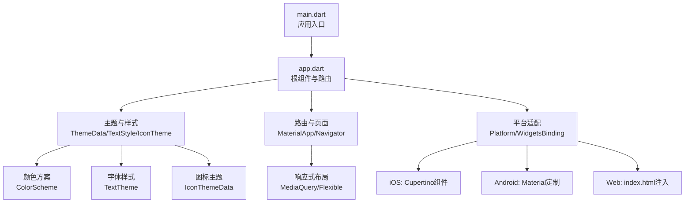
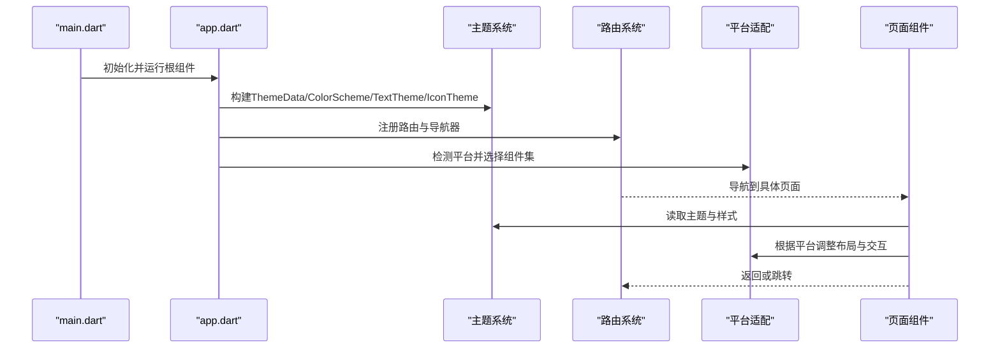
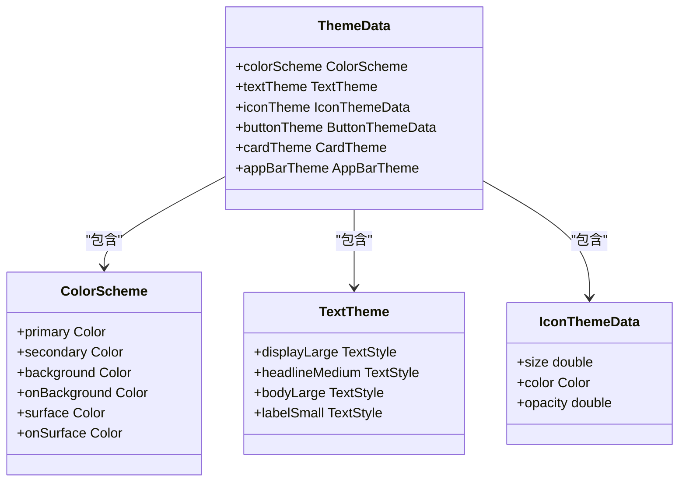
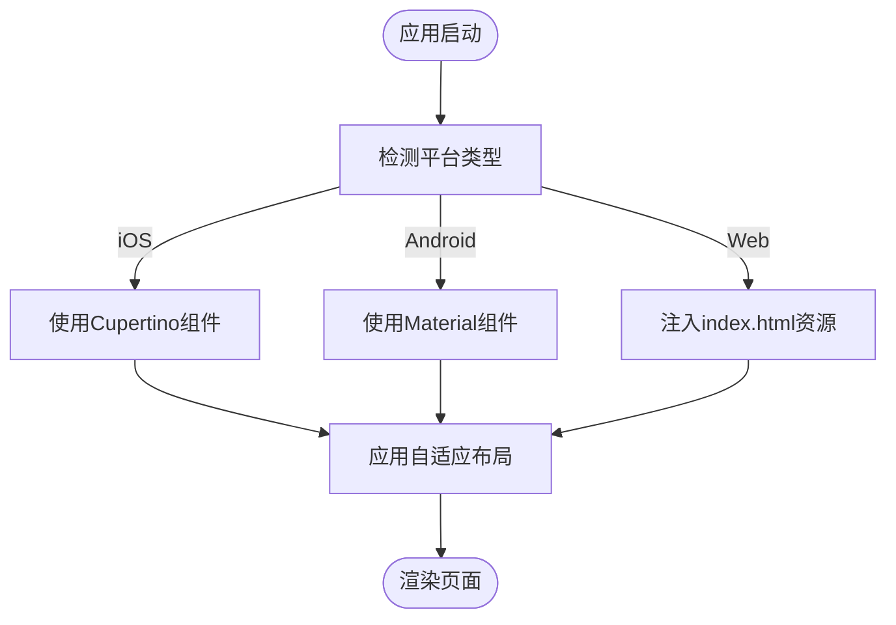
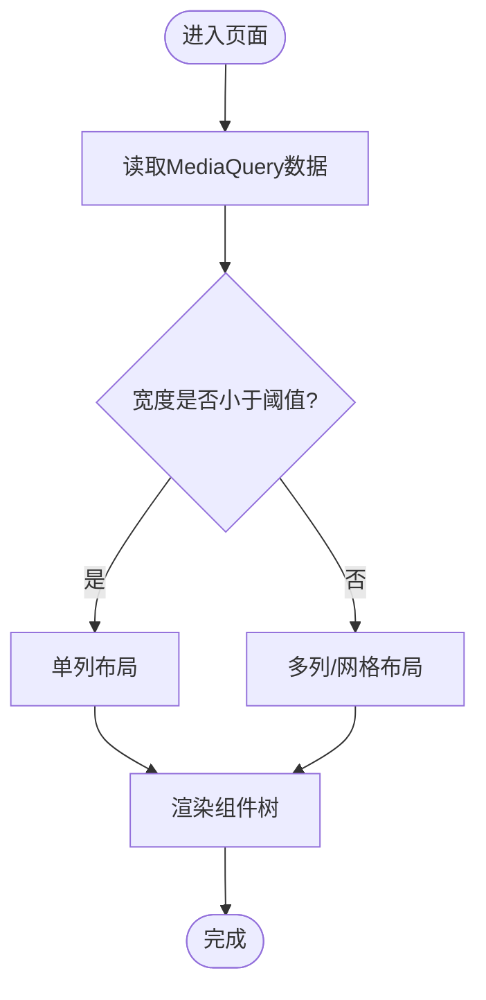
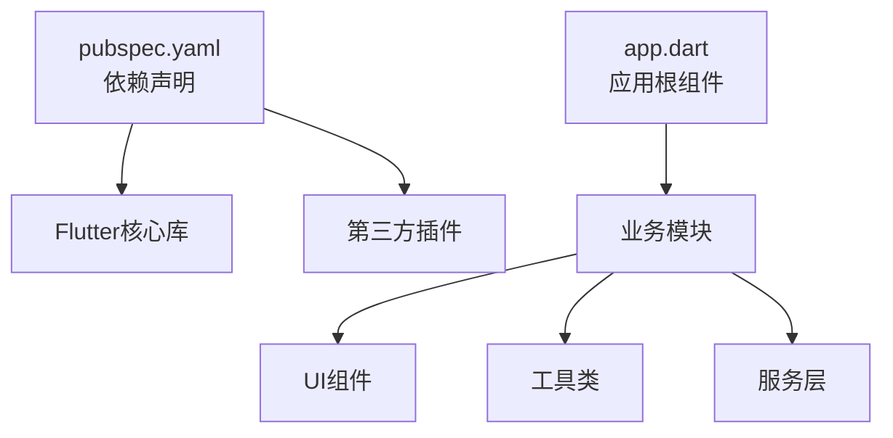

# Flutter Material Components应用

<cite>
**本文引用的文件**   
- [flutter_legado/lib/main.dart](file://flutter_legado/lib/main.dart)
- [flutter_legado/lib/app.dart](file://flutter_legado/lib/app.dart)
- [flutter_legado/pubspec.yaml](file://flutter_legado/pubspec.yaml)
- [flutter_legado/README.md](file://flutter_legado/README.md)
- [flutter_legado/web/index.html](file://flutter_legado/web/index.html)
- [flutter_legado/android/app/src/main/AndroidManifest.xml](file://flutter_legado/android/app/src/main/AndroidManifest.xml)
- [flutter_legado/ios/Runner/Info.plist](file://flutter_legado/ios/Runner/Info.plist)
</cite>

## 目录
1. [简介](#简介)
2. [项目结构](#项目结构)
3. [核心组件](#核心组件)
4. [架构总览](#架构总览)
5. [详细组件分析](#详细组件分析)
6. [依赖分析](#依赖分析)
7. [性能考虑](#性能考虑)
8. [故障排查指南](#故障排查指南)
9. [结论](#结论)
10. [附录](#附录)

## 简介
本文件面向Flutter Material Components应用的开发与维护，聚焦以下目标：
- 主题配置：ThemeData设置、颜色方案、字体样式、图标主题等。
- 跨平台UI一致性：iOS与Android视觉差异处理、平台特定组件选择、自适应布局策略。
- 平台优化：iOS使用Cupertino组件、Android定制Material组件、Web平台特殊处理。
- 响应式设计：MediaQuery使用、Flexible布局、自适应组件。
- 最佳实践与性能优化技巧。

本项目采用Flutter多端工程结构（android/ios/web/linux/macos/windows），在lib目录下组织Dart源码，通过pubspec管理依赖，并通过平台配置文件进行系统级适配。

## 项目结构
Flutter子工程位于flutter_legado目录，关键入口与配置如下：
- lib/main.dart：应用启动入口，负责初始化全局状态、路由、主题与平台适配。
- lib/app.dart：应用根组件，定义MaterialApp或跨平台根容器，挂载主题、路由与页面。
- pubspec.yaml：声明Flutter依赖、资源与平台特性开关。
- web/index.html：Web平台入口，可注入全局脚本与样式。
- android/app/src/main/AndroidManifest.xml：Android清单，控制权限、主题与启动Activity。
- ios/Runner/Info.plist：iOS配置，包含应用元信息与权限描述。

**图表来源** 
- [flutter_legado/lib/main.dart](file://flutter_legado/lib/main.dart)
- [flutter_legado/lib/app.dart](file://flutter_legado/lib/app.dart)
- [flutter_legado/web/index.html](file://flutter_legado/web/index.html)

**章节来源**
- [flutter_legado/lib/main.dart](file://flutter_legado/lib/main.dart)
- [flutter_legado/lib/app.dart](file://flutter_legado/lib/app.dart)
- [flutter_legado/pubspec.yaml](file://flutter_legado/pubspec.yaml)
- [flutter_legado/README.md](file://flutter_legado/README.md)

## 核心组件
- 应用入口与初始化：在main.dart中完成框架初始化、错误捕获、本地化与主题加载，确保后续页面渲染一致。
- 根组件与路由：在app.dart中构建MaterialApp或跨平台根容器，集中配置主题、路由、国际化与调试选项。
- 主题系统：通过ThemeData统一颜色、字体、图标与组件外观；结合ColorScheme与TextTheme实现明暗模式与品牌色。
- 平台适配：基于Platform判断与WidgetsBinding观察，动态切换Cupertino/Material组件或样式。
- 响应式布局：使用MediaQuery获取屏幕尺寸与密度，配合Flexible/Expanded/AspectRatio等组件实现自适应。

**章节来源**
- [flutter_legado/lib/main.dart](file://flutter_legado/lib/main.dart)
- [flutter_legado/lib/app.dart](file://flutter_legado/lib/app.dart)

## 架构总览
整体架构围绕“入口→根组件→主题/路由/平台适配→页面”展开，强调可维护性与跨平台一致性。

**图表来源** 
- [flutter_legado/lib/main.dart](file://flutter_legado/lib/main.dart)
- [flutter_legado/lib/app.dart](file://flutter_legado/lib/app.dart)

## 详细组件分析

### 主题系统（ThemeData）
- 颜色方案：通过ColorScheme定义主色、次色、背景与文本颜色，支持明暗模式切换与高对比度。
- 字体样式：使用TextTheme统一标题、正文、标签的字号、字重与行高，保证可读性。
- 图标主题：通过IconThemeData设置图标大小、颜色与不透明度，保持视觉一致性。
- 组件外观：覆盖Button、Card、AppBar等默认样式，形成品牌风格。

**图表来源** 
- [flutter_legado/lib/app.dart](file://flutter_legado/lib/app.dart)

**章节来源**
- [flutter_legado/lib/app.dart](file://flutter_legado/lib/app.dart)

### 平台适配与组件选择
- iOS：优先使用Cupertino组件以获得原生体验，如CupertinoNavigationBar、CupertinoAlertDialog。
- Android：使用Material组件并进行定制，如MaterialButton、Scaffold、BottomNavigationBar。
- Web：通过index.html注入全局脚本与样式，处理窗口尺寸变化与滚动行为。

**图表来源** 
- [flutter_legado/lib/app.dart](file://flutter_legado/lib/app.dart)
- [flutter_legado/web/index.html](file://flutter_legado/web/index.html)

**章节来源**
- [flutter_legado/lib/app.dart](file://flutter_legado/lib/app.dart)
- [flutter_legado/web/index.html](file://flutter_legado/web/index.html)

### 响应式设计（MediaQuery与Flexible）
- MediaQuery：获取屏幕宽度、高度、密度与方向，用于条件渲染与尺寸计算。
- Flexible/Expanded：在Row/Column中按比例分配空间，避免溢出。
- 自适应组件：根据断点切换布局（单列/双列/网格），提升小屏与大屏体验。

**图表来源** 
- [flutter_legado/lib/app.dart](file://flutter_legado/lib/app.dart)

**章节来源**
- [flutter_legado/lib/app.dart](file://flutter_legado/lib/app.dart)

### 平台特定优化
- iOS优化：使用CupertinoDialog、CupertinoSliverNavigationBar等组件，遵循人机界面指南。
- Android优化：定制Material主题，启用Ripple效果、阴影与导航栏沉浸模式。
- Web优化：在index.html中设置viewport与PWA相关属性，优化首屏加载与缓存。

**章节来源**
- [flutter_legado/web/index.html](file://flutter_legado/web/index.html)
- [flutter_legado/android/app/src/main/AndroidManifest.xml](file://flutter_legado/android/app/src/main/AndroidManifest.xml)
- [flutter_legado/ios/Runner/Info.plist](file://flutter_legado/ios/Runner/Info.plist)

## 依赖分析
- 外部依赖：通过pubspec.yaml声明Flutter插件与第三方库，如网络、存储、动画等。
- 内部模块：按功能划分lib/src目录，降低耦合度，便于测试与维护。
- 平台依赖：Android使用Gradle/Kotlin，iOS使用Xcode/Swift，Web使用Vite/TypeScript。

**图表来源** 
- [flutter_legado/pubspec.yaml](file://flutter_legado/pubspec.yaml)
- [flutter_legado/lib/app.dart](file://flutter_legado/lib/app.dart)

**章节来源**
- [flutter_legado/pubspec.yaml](file://flutter_legado/pubspec.yaml)
- [flutter_legado/lib/app.dart](file://flutter_legado/lib/app.dart)

## 性能考虑
- 主题构建：将ThemeData置于顶层，避免重复创建；使用const构造减少重建开销。
- 图片与资源：使用合适的分辨率与格式，启用懒加载与缓存。
- 列表渲染：使用ListView.builder与ItemExtent，避免长列表卡顿。
- 状态管理：合理使用Provider/Riverpod/Bloc，避免不必要的setState调用。
- Web优化：压缩资源、启用HTTP/2与缓存策略，减少首屏时间。

[本节为通用指导，无需引用具体文件]

## 故障排查指南
- 主题未生效：检查ThemeData是否正确传入MaterialApp，确认颜色与字体路径有效。
- 平台组件错乱：确认Platform判断逻辑与WidgetsBinding初始化顺序。
- 响应式布局异常：检查MediaQuery断点设置与Flexible约束是否冲突。
- Web显示问题：查看index.html的viewport与CSS注入，确认浏览器兼容性。

**章节来源**
- [flutter_legado/lib/app.dart](file://flutter_legado/lib/app.dart)
- [flutter_legado/web/index.html](file://flutter_legado/web/index.html)

## 结论
通过统一的ThemeData、平台特定的组件选择与响应式布局策略，Flutter Material Components应用可在iOS、Android与Web平台提供一致的视觉体验与良好的性能表现。建议持续优化主题构建、资源管理与状态更新，以提升用户体验与开发效率。

[本节为总结，无需引用具体文件]

## 附录
- 最佳实践：
  - 使用ColorScheme统一管理品牌色与明暗模式。
  - 通过TextTheme规范字体层级，确保可读性。
  - 在iOS上使用Cupertino组件，在Android上定制Material组件。
  - 使用MediaQuery与Flexible实现自适应布局。
  - 对Web平台进行资源压缩与缓存优化。

[本节为补充信息，无需引用具体文件]