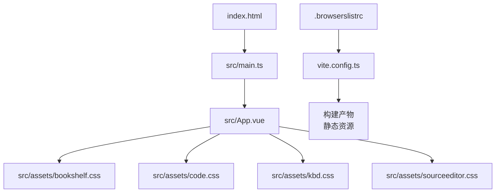
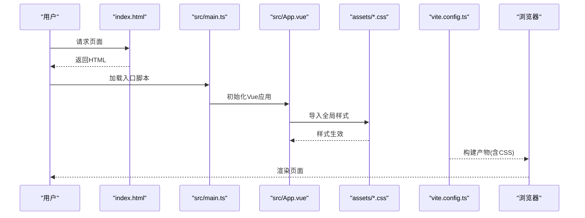
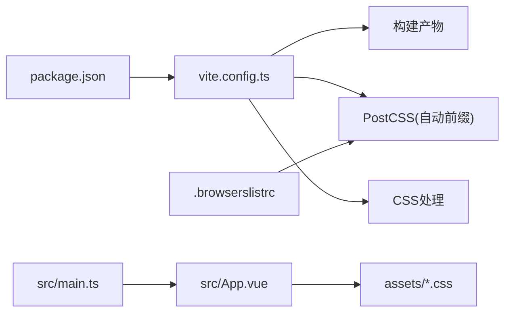

# Web CSS框架集成

<cite>
**本文引用的文件**   
- [modules/web/package.json](file://modules/web/package.json)
- [modules/web/vite.config.ts](file://modules/web/vite.config.ts)
- [modules/web/index.html](file://modules/web/index.html)
- [modules/web/src/main.ts](file://modules/web/src/main.ts)
- [modules/web/src/App.vue](file://modules/web/src/App.vue)
- [modules/web/src/assets/bookshelf.css](file://modules/web/src/assets/bookshelf.css)
- [modules/web/src/assets/code.css](file://modules/web/src/assets/code.css)
- [modules/web/src/assets/kbd.css](file://modules/web/src/assets/kbd.css)
- [modules/web/src/assets/sourceeditor.css](file://modules/web/src/assets/sourceeditor.css)
- [modules/web/src/config/themeConfig.ts](file://modules/web/src/config/themeConfig.ts)
- [modules/web/.browserslistrc](file://modules/web/.browserslistrc)
</cite>

## 目录
1. [简介](#简介)
2. [项目结构](#项目结构)
3. [核心组件](#核心组件)
4. [架构总览](#架构总览)
5. [详细组件分析](#详细组件分析)
6. [依赖分析](#依赖分析)
7. [性能考虑](#性能考虑)
8. [故障排查指南](#故障排查指南)
9. [结论](#结论)
10. [附录](#附录)

## 简介
本文件面向Legado项目的Web端（位于 modules/web）CSS框架集成与样式工程化实践，覆盖以下主题：
- CSS模块化实现：CSS Modules使用、SCSS预处理器配置、样式文件组织结构
- 响应式设计：媒体查询、Flexbox与Grid布局、移动端优先策略
- 浏览器兼容性：自动添加CSS前缀、Polyfill使用、降级方案
- 动画与过渡：关键帧动画、过渡属性、性能优化
- 主题系统：CSS变量、动态主题切换、多主题支持
- 最佳实践与调试技巧

本项目基于Vite + Vue 3构建，样式以原生CSS为主，并通过Vite插件链进行编译与兼容处理。

## 项目结构
Web子模块位于 modules/web，核心入口与样式相关文件如下：
- 构建与打包：vite.config.ts、package.json、index.html
- 应用入口：src/main.ts、src/App.vue
- 样式资源：src/assets/*.css（全局样式）、各页面/组件内联或导入的样式
- 主题配置：src/config/themeConfig.ts
- 浏览器目标：.browserslistrc

图表来源
- [modules/web/index.html:1-20](file://modules/web/index.html#L1-L20)
- [modules/web/src/main.ts:1-30](file://modules/web/src/main.ts#L1-L30)
- [modules/web/src/App.vue:1-40](file://modules/web/src/App.vue#L1-L40)
- [modules/web/vite.config.ts:1-60](file://modules/web/vite.config.ts#L1-L60)
- [modules/web/.browserslistrc:1-10](file://modules/web/.browserslistrc#L1-L10)

章节来源
- [modules/web/package.json:1-60](file://modules/web/package.json#L1-L60)
- [modules/web/vite.config.ts:1-60](file://modules/web/vite.config.ts#L1-L60)
- [modules/web/index.html:1-20](file://modules/web/index.html#L1-L20)
- [modules/web/src/main.ts:1-30](file://modules/web/src/main.ts#L1-L30)
- [modules/web/src/App.vue:1-40](file://modules/web/src/App.vue#L1-L40)

## 核心组件
- Vite构建管线：通过 vite.config.ts 组织插件、别名、输出目录等；默认启用CSS处理与按需压缩。
- 应用入口：main.ts 初始化Vue应用并挂载到 index.html；App.vue 作为根组件引入全局样式与业务组件。
- 样式资源：assets下的CSS文件提供基础样式与功能样式（如书架、代码高亮、键盘提示、源码编辑器）。
- 主题配置：themeConfig.ts 集中管理主题相关常量与切换逻辑，配合CSS变量实现动态换肤。
- 浏览器目标：.browserslistrc 定义目标浏览器范围，驱动PostCSS自动前缀与Polyfill注入。

章节来源
- [modules/web/vite.config.ts:1-60](file://modules/web/vite.config.ts#L1-L60)
- [modules/web/src/main.ts:1-30](file://modules/web/src/main.ts#L1-L30)
- [modules/web/src/App.vue:1-40](file://modules/web/src/App.vue#L1-L40)
- [modules/web/src/config/themeConfig.ts:1-40](file://modules/web/src/config/themeConfig.ts#L1-L40)
- [modules/web/.browserslistrc:1-10](file://modules/web/.browserslistrc#L1-L10)

## 架构总览
下图展示从HTML入口到样式资源的加载流程，以及Vite在构建时对CSS的处理链路。

图表来源
- [modules/web/index.html:1-20](file://modules/web/index.html#L1-L20)
- [modules/web/src/main.ts:1-30](file://modules/web/src/main.ts#L1-L30)
- [modules/web/src/App.vue:1-40](file://modules/web/src/App.vue#L1-L40)
- [modules/web/vite.config.ts:1-60](file://modules/web/vite.config.ts#L1-L60)

## 详细组件分析

### CSS模块化与预处理
- 现状：当前样式以原生CSS为主，未显式启用SCSS预处理器；Vite默认对.css进行解析与优化。
- 建议：如需启用SCSS，可在 vite.config.ts 中安装并配置 sass 插件，并在组件中使用 <style lang="scss">。
- CSS Modules：可通过Vite内置支持为CSS启用Modules模式，文件名采用 *.module.css，并在JS中以对象形式引用类名，避免命名冲突。

章节来源
- [modules/web/vite.config.ts:1-60](file://modules/web/vite.config.ts#L1-L60)
- [modules/web/src/assets/bookshelf.css:1-40](file://modules/web/src/assets/bookshelf.css#L1-L40)
- [modules/web/src/assets/code.css:1-40](file://modules/web/src/assets/code.css#L1-L40)
- [modules/web/src/assets/kbd.css:1-40](file://modules/web/src/assets/kbd.css#L1-L40)
- [modules/web/src/assets/sourceeditor.css:1-40](file://modules/web/src/assets/sourceeditor.css#L1-L40)

### 样式文件组织结构
- 全局样式：集中在 src/assets 下，按功能拆分（书架、代码、键盘提示、源码编辑器），便于复用与维护。
- 组件样式：建议在组件内使用 <style scoped> 隔离样式，避免污染全局。
- 主题样式：通过CSS变量统一管理颜色、字体、间距等，便于动态切换。

章节来源
- [modules/web/src/assets/bookshelf.css:1-40](file://modules/web/src/assets/bookshelf.css#L1-L40)
- [modules/web/src/assets/code.css:1-40](file://modules/web/src/assets/code.css#L1-L40)
- [modules/web/src/assets/kbd.css:1-40](file://modules/web/src/assets/kbd.css#L1-L40)
- [modules/web/src/assets/sourceeditor.css:1-40](file://modules/web/src/assets/sourceeditor.css#L1-L40)

### 响应式设计
- 媒体查询：在CSS中使用 @media 针对移动端、平板、桌面等不同断点调整布局。
- Flexbox与Grid：推荐使用Flexbox做一维布局，Grid做二维布局，提升可维护性与灵活性。
- 移动端优先：先写移动端样式，再通过媒体查询逐步增强大屏体验。

章节来源
- [modules/web/src/assets/bookshelf.css:1-40](file://modules/web/src/assets/bookshelf.css#L1-L40)
- [modules/web/src/assets/sourceeditor.css:1-40](file://modules/web/src/assets/sourceeditor.css#L1-L40)

### 浏览器兼容性
- 目标浏览器：通过 .browserslistrc 指定支持的浏览器版本，Vite/PostCSS据此自动添加必要的前缀。
- Polyfill：根据目标环境按需注入必要的Polyfill，避免全量引入导致体积膨胀。
- 降级方案：对不支持的特性提供回退样式或行为，确保基本可用。

章节来源
- [modules/web/.browserslistrc:1-10](file://modules/web/.browserslistrc#L1-L10)
- [modules/web/vite.config.ts:1-60](file://modules/web/vite.config.ts#L1-L60)

### 动画与过渡
- 关键帧动画：使用 @keyframes 定义复杂动画序列，结合 animation 属性控制播放。
- 过渡属性：使用 transition 实现状态切换时的平滑效果，注意选择合适的时间函数与时长。
- 性能优化：优先使用 transform 与 opacity 触发GPU加速，避免频繁重排重绘。

章节来源
- [modules/web/src/assets/code.css:1-40](file://modules/web/src/assets/code.css#L1-L40)
- [modules/web/src/assets/kbd.css:1-40](file://modules/web/src/assets/kbd.css#L1-L40)

### 主题系统
- CSS变量：在 :root 或组件级定义自定义属性，统一颜色、字号、间距等设计令牌。
- 动态切换：通过JavaScript修改CSS变量值或切换data-theme属性，实现运行时主题切换。
- 多主题支持：在 themeConfig.ts 中维护多套主题配置，按需提供切换接口。

章节来源
- [modules/web/src/config/themeConfig.ts:1-40](file://modules/web/src/config/themeConfig.ts#L1-L40)
- [modules/web/src/App.vue:1-40](file://modules/web/src/App.vue#L1-L40)

## 依赖分析
- 构建工具：Vite负责开发服务器、热更新与生产构建。
- 前端框架：Vue 3作为UI框架，配合单文件组件与组合式API。
- 样式处理：原生CSS由Vite内置处理，必要时可扩展SCSS、Less等预处理器。
- 兼容性：.browserslistrc驱动PostCSS自动前缀与Polyfill注入。

图表来源
- [modules/web/package.json:1-60](file://modules/web/package.json#L1-L60)
- [modules/web/vite.config.ts:1-60](file://modules/web/vite.config.ts#L1-L60)
- [modules/web/.browserslistrc:1-10](file://modules/web/.browserslistrc#L1-L10)
- [modules/web/src/main.ts:1-30](file://modules/web/src/main.ts#L1-L30)
- [modules/web/src/App.vue:1-40](file://modules/web/src/App.vue#L1-L40)

章节来源
- [modules/web/package.json:1-60](file://modules/web/package.json#L1-L60)
- [modules/web/vite.config.ts:1-60](file://modules/web/vite.config.ts#L1-L60)
- [modules/web/.browserslistrc:1-10](file://modules/web/.browserslistrc#L1-L10)

## 性能考虑
- 样式拆分：按功能拆分CSS文件，减少不必要的样式加载。
- 按需加载：组件样式使用scoped与懒加载，避免首屏阻塞。
- 动画优化：优先使用transform与opacity，避免触发重排重绘。
- 缓存策略：利用Vite的哈希文件名与浏览器缓存机制提升加载速度。
- 体积控制：移除未使用的样式，压缩CSS输出。

[本节为通用指导，不直接分析具体文件]

## 故障排查指南
- 样式未生效：检查CSS导入顺序与作用域，确认未被其他样式覆盖。
- 主题切换无效：验证CSS变量是否正确定义与更新，检查data-theme或class切换逻辑。
- 兼容性问题：核对.browserslistrc目标浏览器，确认PostCSS前缀是否生效。
- 动画卡顿：检查是否触发了重排重绘，尝试使用will-change或GPU加速属性。
- 构建失败：检查vite.config.ts插件配置与依赖版本，清理node_modules后重试。

章节来源
- [modules/web/vite.config.ts:1-60](file://modules/web/vite.config.ts#L1-L60)
- [modules/web/.browserslistrc:1-10](file://modules/web/.browserslistrc#L1-L10)
- [modules/web/src/config/themeConfig.ts:1-40](file://modules/web/src/config/themeConfig.ts#L1-L40)

## 结论
Legado的Web端样式体系以Vite为核心，结合原生CSS与Vue组件化开发，具备良好的可维护性与扩展性。通过合理组织样式文件、启用CSS Modules、配置SCSS预处理器、实施响应式设计、处理浏览器兼容性、优化动画性能以及构建完善的主题系统，可以显著提升用户体验与开发效率。建议持续遵循最佳实践，定期审查样式质量与性能指标。

[本节为总结性内容，不直接分析具体文件]

## 附录
- 推荐工具：Stylelint用于代码规范检查，Prettier用于格式化，PostCSS插件用于自动前缀与优化。
- 调试技巧：使用浏览器开发者工具的“元素”面板查看样式计算结果，“网络”面板分析资源加载，“性能”面板定位渲染瓶颈。
- 文档参考：MDN CSS文档、Vite官方文档、Vue SFC样式指南。

[本节为补充信息，不直接分析具体文件]