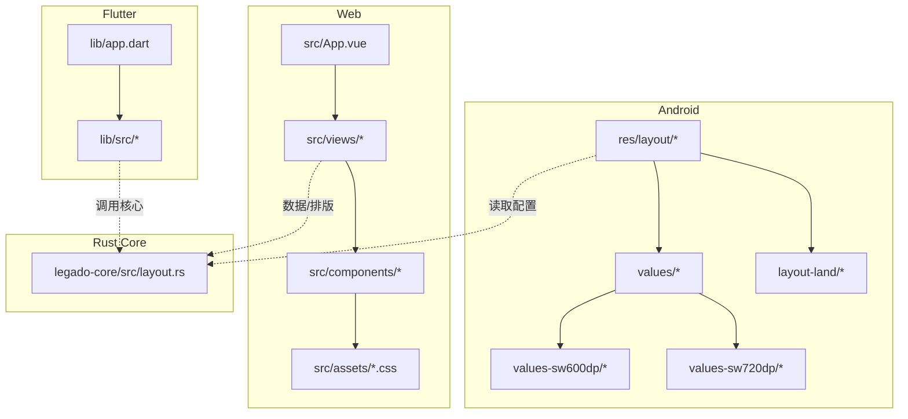
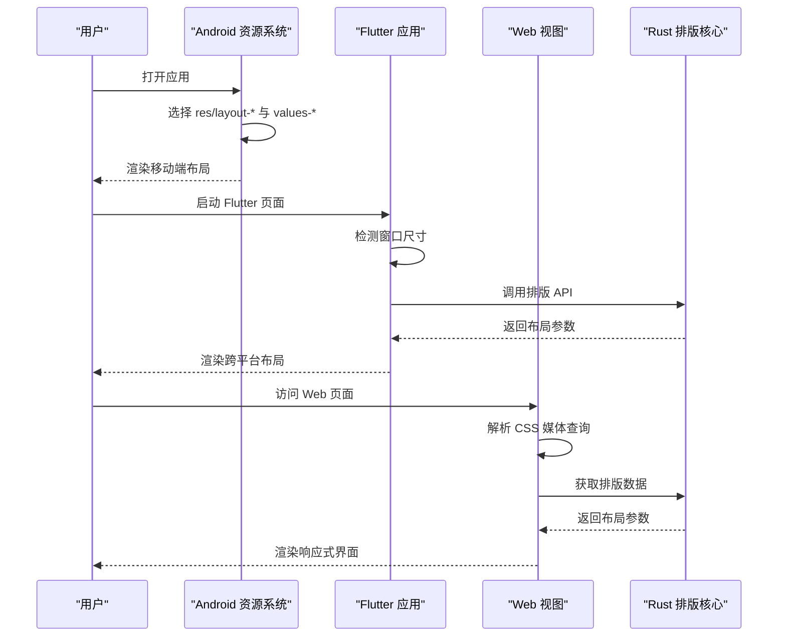
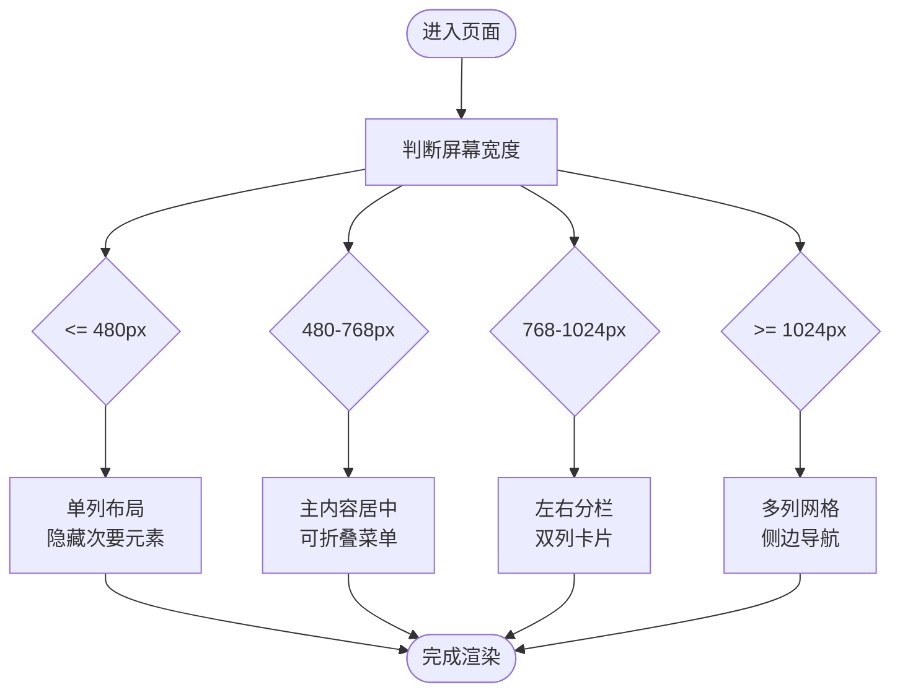
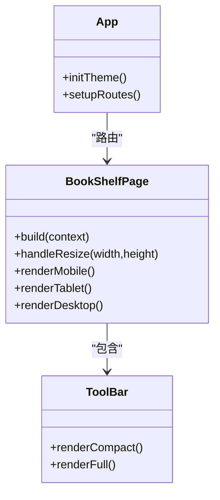
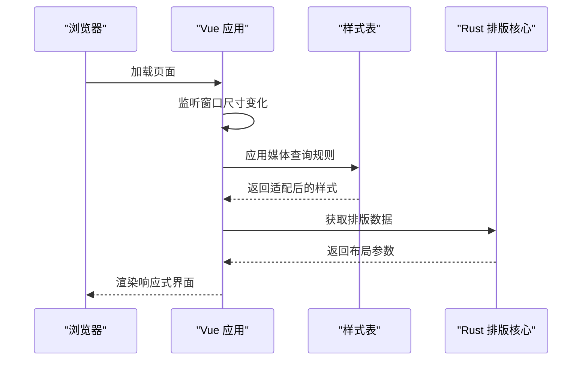
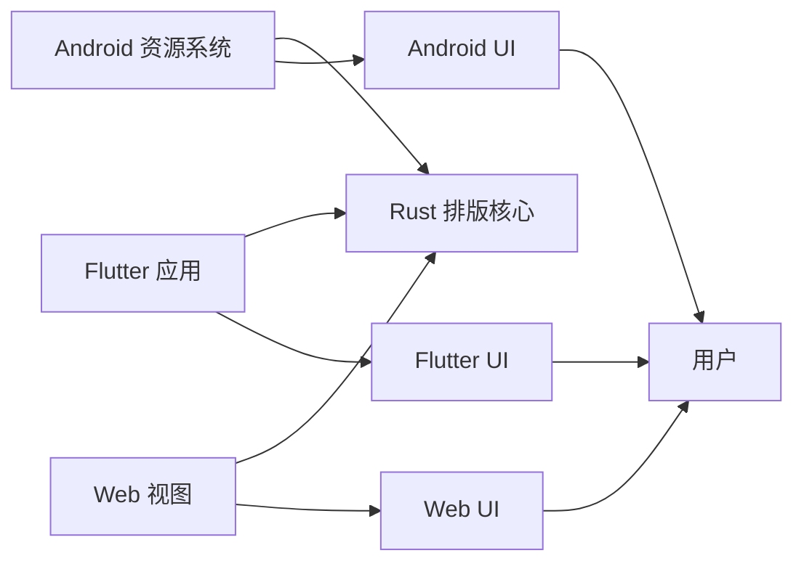

# 响应式布局策略

<cite>
**本文引用的文件**   
- [app/src/main/res/layout/](file://app/src/main/res/layout/)
- [app/src/main/res/values/](file://app/src/main/res/values/)
- [app/src/main/res/values-sw600dp/](file://app/src/main/res/values-sw600dp/)
- [app/src/main/res/values-sw720dp/](file://app/src/main/res/values-sw720dp/)
- [app/src/main/res/layout-land/](file://app/src/main/res/layout-land/)
- [flutter_legado/lib/app.dart](file://flutter_legado/lib/app.dart)
- [flutter_legado/lib/src/](file://flutter_legado/lib/src/)
- [modules/web/src/App.vue](file://modules/web/src/App.vue)
- [modules/web/src/views/BookShelf.vue](file://modules/web/src/views/BookShelf.vue)
- [modules/web/src/components/ToolBar.vue](file://modules/web/src/components/ToolBar.vue)
- [modules/web/src/assets/bookshelf.css](file://modules/web/src/assets/bookshelf.css)
- [rust/legado-core/src/layout.rs](file://rust/legado-core/src/layout.rs)
</cite>

## 目录
1. [简介](#简介)
2. [项目结构](#项目结构)
3. [核心组件](#核心组件)
4. [架构总览](#架构总览)
5. [详细组件分析](#详细组件分析)
6. [依赖分析](#依赖分析)
7. [性能考虑](#性能考虑)
8. [故障排查指南](#故障排查指南)
9. [结论](#结论)
10. [附录](#附录)

## 简介
本文件面向 Legado 多端（Android、Flutter、Web）的响应式布局策略，围绕以下目标展开：
- 针对不同屏幕尺寸（小屏手机 320–480px、普通手机 480–768px、平板 768–1024px、桌面 1024px+）给出适配方案与断点设计原则
- 阐述移动优先、渐进增强、弹性网格系统的设计方法
- 说明内容重排与重组技术（条件渲染、组件替换、布局重构）
- 提供触摸交互优化建议（触摸目标大小、手势识别、滑动操作适配）
- 给出跨设备测试方法与调试技巧（模拟器、真机、性能分析工具）

## 项目结构
Legado 采用多端并行实现：
- Android 原生层使用资源限定符进行布局与样式适配
- Flutter 层通过 Dart/Widget 构建跨平台 UI，并可根据窗口尺寸动态调整布局
- Web 层基于 Vue 组件与 CSS 媒体查询实现响应式界面
- Rust 核心库提供排版与布局相关能力，供上层调用

图表来源
- [app/src/main/res/layout/](file://app/src/main/res/layout/)
- [app/src/main/res/values/](file://app/src/main/res/values/)
- [app/src/main/res/values-sw600dp/](file://app/src/main/res/values-sw600dp/)
- [app/src/main/res/values-sw720dp/](file://app/src/main/res/values-sw720dp/)
- [app/src/main/res/layout-land/](file://app/src/main/res/layout-land/)
- [flutter_legado/lib/app.dart](file://flutter_legado/lib/app.dart)
- [flutter_legado/lib/src/](file://flutter_legado/lib/src/)
- [modules/web/src/App.vue](file://modules/web/src/App.vue)
- [modules/web/src/views/BookShelf.vue](file://modules/web/src/views/BookShelf.vue)
- [modules/web/src/components/ToolBar.vue](file://modules/web/src/components/ToolBar.vue)
- [modules/web/src/assets/bookshelf.css](file://modules/web/src/assets/bookshelf.css)
- [rust/legado-core/src/layout.rs](file://rust/legado-core/src/layout.rs)

章节来源
- [app/src/main/res/layout/](file://app/src/main/res/layout/)
- [app/src/main/res/values/](file://app/src/main/res/values/)
- [app/src/main/res/values-sw600dp/](file://app/src/main/res/values-sw600dp/)
- [app/src/main/res/values-sw720dp/](file://app/src/main/res/values-sw720dp/)
- [app/src/main/res/layout-land/](file://app/src/main/res/layout-land/)
- [flutter_legado/lib/app.dart](file://flutter_legado/lib/app.dart)
- [flutter_legado/lib/src/](file://flutter_legado/lib/src/)
- [modules/web/src/App.vue](file://modules/web/src/App.vue)
- [modules/web/src/views/BookShelf.vue](file://modules/web/src/views/BookShelf.vue)
- [modules/web/src/components/ToolBar.vue](file://modules/web/src/components/ToolBar.vue)
- [modules/web/src/assets/bookshelf.css](file://modules/web/src/assets/bookshelf.css)
- [rust/legado-core/src/layout.rs](file://rust/legado-core/src/layout.rs)

## 核心组件
- Android 资源限定符体系：通过 values-sw600dp、values-sw720dp 等维度限定不同宽度区间；layout-land 提供横屏布局；默认 layout 作为移动优先基线
- Flutter 应用入口与页面：在 app.dart 中初始化主题与路由，并在各页面根据窗口尺寸切换布局
- Web 视图与组件：App.vue 组织页面路由，BookShelf.vue 展示书架列表，ToolBar.vue 提供顶部工具栏；CSS 文件集中管理样式与媒体查询
- Rust 排版核心：layout.rs 暴露排版与布局计算能力，供上层 UI 层复用

章节来源
- [app/src/main/res/values/](file://app/src/main/res/values/)
- [app/src/main/res/values-sw600dp/](file://app/src/main/res/values-sw600dp/)
- [app/src/main/res/values-sw720dp/](file://app/src/main/res/values-sw720dp/)
- [app/src/main/res/layout-land/](file://app/src/main/res/layout-land/)
- [flutter_legado/lib/app.dart](file://flutter_legado/lib/app.dart)
- [modules/web/src/App.vue](file://modules/web/src/App.vue)
- [modules/web/src/views/BookShelf.vue](file://modules/web/src/views/BookShelf.vue)
- [modules/web/src/components/ToolBar.vue](file://modules/web/src/components/ToolBar.vue)
- [rust/legado-core/src/layout.rs](file://rust/legado-core/src/layout.rs)

## 架构总览
下图展示了三端如何协同工作，以及断点与布局策略在各层的体现。

图表来源
- [app/src/main/res/layout/](file://app/src/main/res/layout/)
- [app/src/main/res/values/](file://app/src/main/res/values/)
- [flutter_legado/lib/app.dart](file://flutter_legado/lib/app.dart)
- [modules/web/src/App.vue](file://modules/web/src/App.vue)
- [rust/legado-core/src/layout.rs](file://rust/legado-core/src/layout.rs)

## 详细组件分析

### Android 资源限定符与断点策略
- 断点设计原则
  - 移动优先：以默认 layout 与 values 为最小宽度基线，逐步增强到 sw600dp、sw720dp
  - 渐进增强：在小屏上保持简洁导航与单列布局；在平板与桌面端增加侧边栏、双列或多列网格
  - 弹性网格：使用百分比宽度与约束布局，避免固定像素导致溢出或留白
- 布局调整方案
  - 小屏手机（320–480px）：单列列表、底部导航、隐藏次要信息
  - 普通手机（480–768px）：主内容区居中、可折叠菜单、增大触摸目标
  - 平板（768–1024px）：左右分栏、双列卡片、常驻侧边栏
  - 桌面（1024px+）：多列网格、侧边导航、悬浮工具栏
- 横屏适配：layout-land 提供横屏专用布局，避免纵向拥挤

图表来源
- [app/src/main/res/layout/](file://app/src/main/res/layout/)
- [app/src/main/res/values-sw600dp/](file://app/src/main/res/values-sw600dp/)
- [app/src/main/res/values-sw720dp/](file://app/src/main/res/values-sw720dp/)
- [app/src/main/res/layout-land/](file://app/src/main/res/layout-land/)

章节来源
- [app/src/main/res/layout/](file://app/src/main/res/layout/)
- [app/src/main/res/values/](file://app/src/main/res/values/)
- [app/src/main/res/values-sw600dp/](file://app/src/main/res/values-sw600dp/)
- [app/src/main/res/values-sw720dp/](file://app/src/main/res/values-sw720dp/)
- [app/src/main/res/layout-land/](file://app/src/main/res/layout-land/)

### Flutter 响应式布局与组件替换
- 窗口尺寸检测：在页面内监听窗口变化，动态切换布局模式
- 组件替换：小屏显示简化版组件，大屏显示完整版组件
- 弹性布局：使用 Row、Column、Expanded、Flexible 等控件实现自适应排列
- 渐进增强：基础功能在所有尺寸可用，高级功能在大屏启用

图表来源
- [flutter_legado/lib/app.dart](file://flutter_legado/lib/app.dart)
- [flutter_legado/lib/src/](file://flutter_legado/lib/src/)

章节来源
- [flutter_legado/lib/app.dart](file://flutter_legado/lib/app.dart)
- [flutter_legado/lib/src/](file://flutter_legado/lib/src/)

### Web 响应式设计与媒体查询
- 媒体查询断点：在 CSS 中定义 320px、480px、768px、1024px 等断点
- 条件渲染：Vue 组件根据窗口尺寸切换显示内容
- 组件替换：小屏显示精简组件，大屏显示完整组件
- 弹性网格：使用 CSS Grid/Flexbox 实现自适应布局

图表来源
- [modules/web/src/App.vue](file://modules/web/src/App.vue)
- [modules/web/src/views/BookShelf.vue](file://modules/web/src/views/BookShelf.vue)
- [modules/web/src/components/ToolBar.vue](file://modules/web/src/components/ToolBar.vue)
- [modules/web/src/assets/bookshelf.css](file://modules/web/src/assets/bookshelf.css)
- [rust/legado-core/src/layout.rs](file://rust/legado-core/src/layout.rs)

章节来源
- [modules/web/src/App.vue](file://modules/web/src/App.vue)
- [modules/web/src/views/BookShelf.vue](file://modules/web/src/views/BookShelf.vue)
- [modules/web/src/components/ToolBar.vue](file://modules/web/src/components/ToolBar.vue)
- [modules/web/src/assets/bookshelf.css](file://modules/web/src/assets/bookshelf.css)
- [rust/legado-core/src/layout.rs](file://rust/legado-core/src/layout.rs)

### 触摸交互优化
- 触摸目标大小：确保按钮和链接至少 48x48dp，提升点击准确率
- 手势识别：支持滑动、长按、双击等手势，提供视觉反馈
- 滑动操作适配：在不同设备上调整滑动阈值和灵敏度
- 滚动优化：使用惯性滚动和边界回弹，提升流畅度

章节来源
- [app/src/main/res/layout/](file://app/src/main/res/layout/)
- [flutter_legado/lib/src/](file://flutter_legado/lib/src/)
- [modules/web/src/components/ToolBar.vue](file://modules/web/src/components/ToolBar.vue)

## 依赖分析
各层之间的依赖关系如下：
- Android 层依赖资源限定符和系统 API
- Flutter 层依赖窗口尺寸检测和核心排版库
- Web 层依赖 CSS 媒体查询和 Vue 响应式系统
- Rust 核心层提供统一的排版算法

图表来源
- [app/src/main/res/layout/](file://app/src/main/res/layout/)
- [flutter_legado/lib/app.dart](file://flutter_legado/lib/app.dart)
- [modules/web/src/App.vue](file://modules/web/src/App.vue)
- [rust/legado-core/src/layout.rs](file://rust/legado-core/src/layout.rs)

章节来源
- [app/src/main/res/layout/](file://app/src/main/res/layout/)
- [flutter_legado/lib/app.dart](file://flutter_legado/lib/app.dart)
- [modules/web/src/App.vue](file://modules/web/src/App.vue)
- [rust/legado-core/src/layout.rs](file://rust/legado-core/src/layout.rs)

## 性能考虑
- 减少不必要的重绘：在布局变化时使用局部更新而非全局刷新
- 懒加载组件：仅在需要时加载重型组件，降低初始渲染时间
- 图片优化：根据屏幕密度加载合适分辨率的图片
- 内存管理：及时释放不再使用的布局和组件实例
- 网络请求优化：合并请求和使用缓存机制

## 故障排查指南
- 布局错位问题：检查媒体查询断点和资源限定符是否正确配置
- 触摸不灵敏：确认触摸目标大小是否符合规范
- 性能卡顿：使用性能分析工具定位瓶颈，优化渲染路径
- 跨设备不一致：在不同设备和模拟器上全面测试
- 内存泄漏：监控内存使用情况，及时清理资源

## 结论
Legado 通过多端协作实现了完善的响应式布局策略。Android 使用资源限定符，Flutter 基于窗口尺寸检测，Web 采用媒体查询，三者共同依赖 Rust 核心排版库。通过移动优先、渐进增强和弹性网格系统，确保了在各种设备上的良好用户体验。持续的性能优化和全面的测试是保证质量的关键。

## 附录
- 最佳实践清单
  - 始终从移动优先开始设计
  - 使用相对单位而非绝对像素
  - 定期在不同设备上测试布局
  - 保持触摸目标的最小尺寸
  - 利用开发者工具进行性能分析
- 常用工具推荐
  - Android Studio 布局编辑器
  - Flutter DevTools
  - Chrome DevTools
  - 性能分析工具（Profiler、Memory Analyzer）