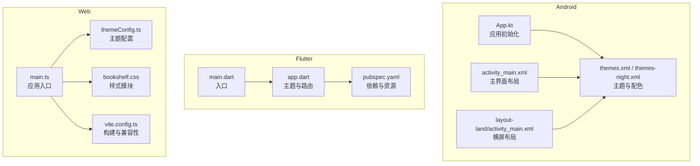
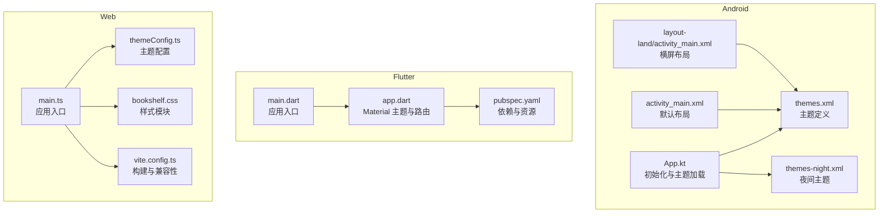
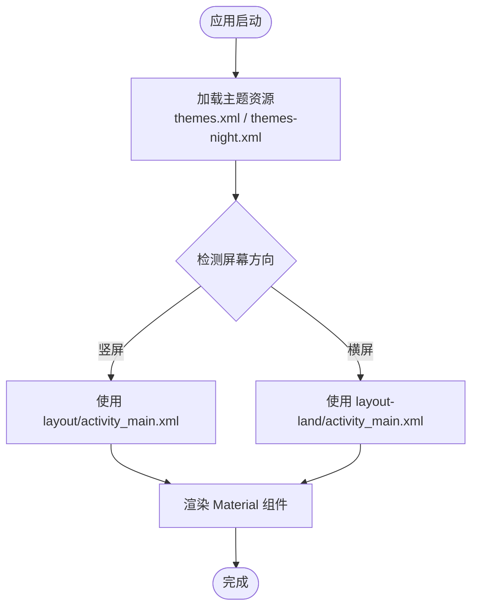
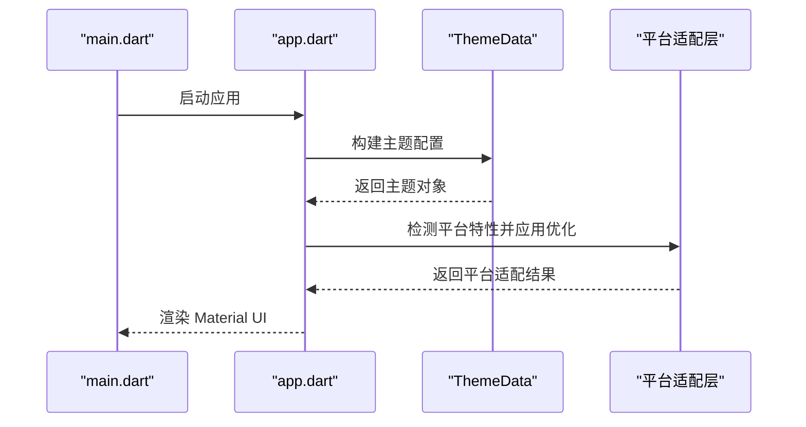
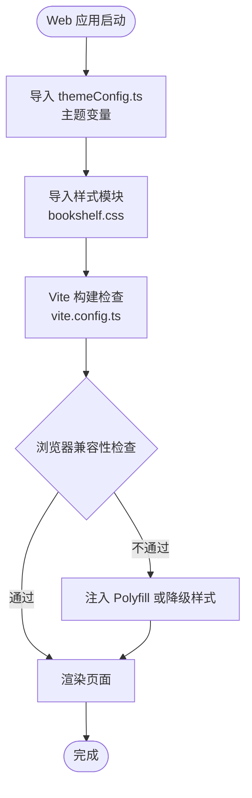
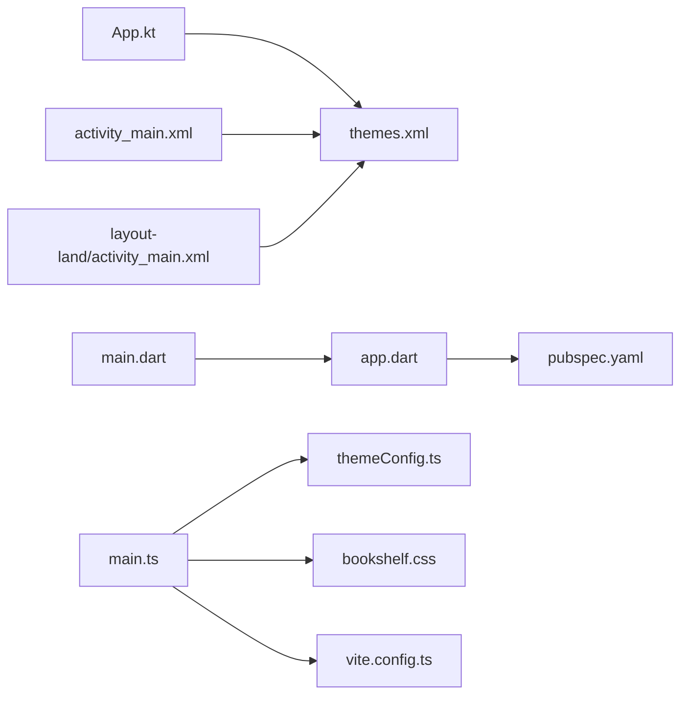

# 多平台样式适配

<cite>
**本文引用的文件**   
- [app/src/main/java/io/legado/app/App.kt](file://app/src/main/java/io/legado/app/App.kt)
- [app/src/main/res/values/themes.xml](file://app/src/main/res/values/themes.xml)
- [app/src/main/res/values-night/themes.xml](file://app/src/main/res/values-night/themes.xml)
- [app/src/main/res/layout/activity_main.xml](file://app/src/main/res/layout/activity_main.xml)
- [app/src/main/res/layout-land/activity_main.xml](file://app/src/main/res/layout-land/activity_main.xml)
- [flutter_legado/lib/app.dart](file://flutter_legado/lib/app.dart)
- [flutter_legado/lib/main.dart](file://flutter_legado/lib/main.dart)
- [flutter_legado/pubspec.yaml](file://flutter_legado/pubspec.yaml)
- [modules/web/src/main.ts](file://modules/web/src/main.ts)
- [modules/web/src/config/themeConfig.ts](file://modules/web/src/config/themeConfig.ts)
- [modules/web/src/assets/bookshelf.css](file://modules/web/src/assets/bookshelf.css)
- [modules/web/vite.config.ts](file://modules/web/vite.config.ts)
</cite>

## 目录
1. [简介](#简介)
2. [项目结构](#项目结构)
3. [核心组件](#核心组件)
4. [架构总览](#架构总览)
5. [详细组件分析](#详细组件分析)
6. [依赖分析](#依赖分析)
7. [性能考虑](#性能考虑)
8. [故障排查指南](#故障排查指南)
9. [结论](#结论)
10. [附录](#附录)

## 简介
本文件面向“Legado”多端项目的样式与主题适配，聚焦以下目标：
- Android Material Design 实现：Material Components、响应式布局、横竖屏适配。
- Flutter Material Components 应用：主题配置、跨平台 UI 一致性、平台特定优化。
- Web CSS 框架集成：CSS 模块化、响应式设计、浏览器兼容性处理。
- 不同屏幕尺寸适配策略：小屏手机、平板、桌面端的布局调整。
- 平台特定的样式差异处理：iOS 与 Android 视觉差异、Web 浏览器兼容性问题。
- 跨平台样式开发最佳实践与性能优化建议。

## 项目结构
本项目由三大前端子系统构成：
- Android（原生）：基于 Kotlin + XML 资源，使用 Material Components 构建界面。
- Flutter（跨平台）：基于 Dart + Flutter SDK，使用 Material 组件库统一风格。
- Web（浏览器）：基于 TypeScript + Vite + Vue，采用模块化 CSS 与响应式方案。

图表来源
- [app/src/main/java/io/legado/app/App.kt](file://app/src/main/java/io/legado/app/App.kt)
- [app/src/main/res/values/themes.xml](file://app/src/main/res/values/themes.xml)
- [app/src/main/res/values-night/themes.xml](file://app/src/main/res/values-night/themes.xml)
- [app/src/main/res/layout/activity_main.xml](file://app/src/main/res/layout/activity_main.xml)
- [app/src/main/res/layout-land/activity_main.xml](file://app/src/main/res/layout-land/activity_main.xml)
- [flutter_legado/lib/main.dart](file://flutter_legado/lib/main.dart)
- [flutter_legado/lib/app.dart](file://flutter_legado/lib/app.dart)
- [flutter_legado/pubspec.yaml](file://flutter_legado/pubspec.yaml)
- [modules/web/src/main.ts](file://modules/web/src/main.ts)
- [modules/web/src/config/themeConfig.ts](file://modules/web/src/config/themeConfig.ts)
- [modules/web/src/assets/bookshelf.css](file://modules/web/src/assets/bookshelf.css)
- [modules/web/vite.config.ts](file://modules/web/vite.config.ts)

章节来源
- [app/src/main/java/io/legado/app/App.kt](file://app/src/main/java/io/legado/app/App.kt)
- [app/src/main/res/values/themes.xml](file://app/src/main/res/values/themes.xml)
- [app/src/main/res/values-night/themes.xml](file://app/src/main/res/values-night/themes.xml)
- [app/src/main/res/layout/activity_main.xml](file://app/src/main/res/layout/activity_main.xml)
- [app/src/main/res/layout-land/activity_main.xml](file://app/src/main/res/layout-land/activity_main.xml)
- [flutter_legado/lib/main.dart](file://flutter_legado/lib/main.dart)
- [flutter_legado/lib/app.dart](file://flutter_legado/lib/app.dart)
- [flutter_legado/pubspec.yaml](file://flutter_legado/pubspec.yaml)
- [modules/web/src/main.ts](file://modules/web/src/main.ts)
- [modules/web/src/config/themeConfig.ts](file://modules/web/src/config/themeConfig.ts)
- [modules/web/src/assets/bookshelf.css](file://modules/web/src/assets/bookshelf.css)
- [modules/web/vite.config.ts](file://modules/web/vite.config.ts)

## 核心组件
- Android 主题与资源
  - 通过主题文件定义颜色、字体、控件样式；夜间模式通过 values-night 目录切换。
  - 布局文件按屏幕方向拆分，提供 layout 与 layout-land 两套资源。
- Flutter 主题与入口
  - main.dart 启动应用，app.dart 集中配置 Material 主题、路由与全局设置。
  - pubspec.yaml 管理依赖与静态资源，确保跨平台一致。
- Web 主题与样式
  - themeConfig.ts 集中管理主题变量与暗色模式。
  - bookshelf.css 等样式文件以模块化方式组织，配合 Vite 构建与浏览器兼容性配置。

章节来源
- [app/src/main/res/values/themes.xml](file://app/src/main/res/values/themes.xml)
- [app/src/main/res/values-night/themes.xml](file://app/src/main/res/values-night/themes.xml)
- [app/src/main/res/layout/activity_main.xml](file://app/src/main/res/layout/activity_main.xml)
- [app/src/main/res/layout-land/activity_main.xml](file://app/src/main/res/layout-land/activity_main.xml)
- [flutter_legado/lib/main.dart](file://flutter_legado/lib/main.dart)
- [flutter_legado/lib/app.dart](file://flutter_legado/lib/app.dart)
- [flutter_legado/pubspec.yaml](file://flutter_legado/pubspec.yaml)
- [modules/web/src/config/themeConfig.ts](file://modules/web/src/config/themeConfig.ts)
- [modules/web/src/assets/bookshelf.css](file://modules/web/src/assets/bookshelf.css)

## 架构总览
下图展示三个平台的样式与主题在各自工程中的职责边界与交互关系。

图表来源
- [app/src/main/java/io/legado/app/App.kt](file://app/src/main/java/io/legado/app/App.kt)
- [app/src/main/res/values/themes.xml](file://app/src/main/res/values/themes.xml)
- [app/src/main/res/values-night/themes.xml](file://app/src/main/res/values-night/themes.xml)
- [app/src/main/res/layout/activity_main.xml](file://app/src/main/res/layout/activity_main.xml)
- [app/src/main/res/layout-land/activity_main.xml](file://app/src/main/res/layout-land/activity_main.xml)
- [flutter_legado/lib/main.dart](file://flutter_legado/lib/main.dart)
- [flutter_legado/lib/app.dart](file://flutter_legado/lib/app.dart)
- [flutter_legado/pubspec.yaml](file://flutter_legado/pubspec.yaml)
- [modules/web/src/main.ts](file://modules/web/src/main.ts)
- [modules/web/src/config/themeConfig.ts](file://modules/web/src/config/themeConfig.ts)
- [modules/web/src/assets/bookshelf.css](file://modules/web/src/assets/bookshelf.css)
- [modules/web/vite.config.ts](file://modules/web/vite.config.ts)

## 详细组件分析

### Android Material Design 实现
- 主题与颜色
  - 通过 themes.xml 定义主色、强调色、背景色、文本色等，供 Material Components 使用。
  - 通过 themes-night.xml 提供夜间模式，系统自动根据设备设置切换。
- 响应式布局
  - 使用 ConstraintLayout、RecyclerView、CoordinatorLayout 等构建弹性布局。
  - 通过 layout 与 layout-land 目录分别提供竖屏与横屏布局，避免复杂条件判断。
- 横竖屏适配
  - 横屏布局重新组织内容区域与导航栏位置，保证信息密度与操作效率。
  - 针对大屏设备可引入分栏或抽屉式导航，提升可用性。

图表来源
- [app/src/main/res/values/themes.xml](file://app/src/main/res/values/themes.xml)
- [app/src/main/res/values-night/themes.xml](file://app/src/main/res/values-night/themes.xml)
- [app/src/main/res/layout/activity_main.xml](file://app/src/main/res/layout/activity_main.xml)
- [app/src/main/res/layout-land/activity_main.xml](file://app/src/main/res/layout-land/activity_main.xml)

章节来源
- [app/src/main/res/values/themes.xml](file://app/src/main/res/values/themes.xml)
- [app/src/main/res/values-night/themes.xml](file://app/src/main/res/values-night/themes.xml)
- [app/src/main/res/layout/activity_main.xml](file://app/src/main/res/layout/activity_main.xml)
- [app/src/main/res/layout-land/activity_main.xml](file://app/src/main/res/layout-land/activity_main.xml)

### Flutter Material Components 应用
- 主题配置
  - 在 app.dart 中集中配置 ThemeData，包括颜色、字体、按钮样式、卡片样式等，确保跨平台一致性。
  - 支持动态主题切换与暗色模式，结合系统设置或用户偏好。
- 跨平台 UI 一致性
  - 使用 Material 组件库统一 iOS、Android、Web、桌面端的视觉风格。
  - 通过 pubspec.yaml 管理依赖与静态资源，保证构建产物一致。
- 平台特定优化
  - 针对 iOS 与 Android 的输入框、滚动行为、状态栏等进行差异化处理。
  - 对 Web 与桌面端进行窗口大小与鼠标交互优化。

图表来源
- [flutter_legado/lib/main.dart](file://flutter_legado/lib/main.dart)
- [flutter_legado/lib/app.dart](file://flutter_legado/lib/app.dart)
- [flutter_legado/pubspec.yaml](file://flutter_legado/pubspec.yaml)

章节来源
- [flutter_legado/lib/main.dart](file://flutter_legado/lib/main.dart)
- [flutter_legado/lib/app.dart](file://flutter_legado/lib/app.dart)
- [flutter_legado/pubspec.yaml](file://flutter_legado/pubspec.yaml)

### Web CSS 框架集成
- CSS 模块化
  - 将样式拆分为多个 .css 文件，如 bookshelf.css，便于维护与复用。
  - 通过 import 或构建工具按需加载，减少首屏体积。
- 响应式设计
  - 使用媒体查询与弹性布局适配不同屏幕尺寸。
  - 针对移动端与桌面端分别优化排版与交互。
- 浏览器兼容性处理
  - 通过 vite.config.ts 配置目标浏览器与 polyfill。
  - 使用 Browserslist 与 PostCSS 插件确保兼容性。

图表来源
- [modules/web/src/main.ts](file://modules/web/src/main.ts)
- [modules/web/src/config/themeConfig.ts](file://modules/web/src/config/themeConfig.ts)
- [modules/web/src/assets/bookshelf.css](file://modules/web/src/assets/bookshelf.css)
- [modules/web/vite.config.ts](file://modules/web/vite.config.ts)

章节来源
- [modules/web/src/main.ts](file://modules/web/src/main.ts)
- [modules/web/src/config/themeConfig.ts](file://modules/web/src/config/themeConfig.ts)
- [modules/web/src/assets/bookshelf.css](file://modules/web/src/assets/bookshelf.css)
- [modules/web/vite.config.ts](file://modules/web/vite.config.ts)

### 不同屏幕尺寸的适配策略
- 小屏手机
  - 单列布局，优先显示关键信息，隐藏次要内容。
  - 增大触控区域，提升操作体验。
- 平板
  - 双列或三列布局，合理利用横向空间。
  - 引入侧边栏或抽屉导航，提高信息密度。
- 桌面端
  - 多面板布局，支持拖拽与快捷键。
  - 优化滚动与分页，提升长列表浏览效率。

[本节为通用指导，无需引用具体文件]

### 平台特定的样式差异处理
- iOS 与 Android 视觉差异
  - 输入框、按钮、导航栏在不同平台有细微差异，需通过主题与组件库统一。
  - 状态栏、键盘弹出行为需分别处理。
- Web 浏览器兼容性问题
  - 不同内核对 CSS 属性支持不一致，需通过前缀与降级方案解决。
  - 移动端 Safari 与 Chrome 的滚动与触摸事件存在差异，需针对性优化。

[本节为通用指导，无需引用具体文件]

## 依赖分析
- Android
  - 主题与布局资源相互依赖，夜间模式通过资源目录自动切换。
  - Material Components 依赖主题定义的颜色与样式。
- Flutter
  - main.dart 与 app.dart 形成入口与配置的依赖链。
  - pubspec.yaml 管理第三方依赖与静态资源。
- Web
  - main.ts 依赖 themeConfig.ts 与样式模块。
  - vite.config.ts 影响构建流程与兼容性处理。

图表来源
- [app/src/main/java/io/legado/app/App.kt](file://app/src/main/java/io/legado/app/App.kt)
- [app/src/main/res/values/themes.xml](file://app/src/main/res/values/themes.xml)
- [app/src/main/res/layout/activity_main.xml](file://app/src/main/res/layout/activity_main.xml)
- [app/src/main/res/layout-land/activity_main.xml](file://app/src/main/res/layout-land/activity_main.xml)
- [flutter_legado/lib/main.dart](file://flutter_legado/lib/main.dart)
- [flutter_legado/lib/app.dart](file://flutter_legado/lib/app.dart)
- [flutter_legado/pubspec.yaml](file://flutter_legado/pubspec.yaml)
- [modules/web/src/main.ts](file://modules/web/src/main.ts)
- [modules/web/src/config/themeConfig.ts](file://modules/web/src/config/themeConfig.ts)
- [modules/web/src/assets/bookshelf.css](file://modules/web/src/assets/bookshelf.css)
- [modules/web/vite.config.ts](file://modules/web/vite.config.ts)

章节来源
- [app/src/main/java/io/legado/app/App.kt](file://app/src/main/java/io/legado/app/App.kt)
- [app/src/main/res/values/themes.xml](file://app/src/main/res/values/themes.xml)
- [app/src/main/res/layout/activity_main.xml](file://app/src/main/res/layout/activity_main.xml)
- [app/src/main/res/layout-land/activity_main.xml](file://app/src/main/res/layout-land/activity_main.xml)
- [flutter_legado/lib/main.dart](file://flutter_legado/lib/main.dart)
- [flutter_legado/lib/app.dart](file://flutter_legado/lib/app.dart)
- [flutter_legado/pubspec.yaml](file://flutter_legado/pubspec.yaml)
- [modules/web/src/main.ts](file://modules/web/src/main.ts)
- [modules/web/src/config/themeConfig.ts](file://modules/web/src/config/themeConfig.ts)
- [modules/web/src/assets/bookshelf.css](file://modules/web/src/assets/bookshelf.css)
- [modules/web/vite.config.ts](file://modules/web/vite.config.ts)

## 性能考虑
- Android
  - 使用 ViewBinding 或 Jetpack Compose 减少布局层级。
  - 图片资源按密度提供，避免内存浪费。
- Flutter
  - 使用 const 构造与不可变数据提升渲染性能。
  - 避免不必要的 rebuild，合理使用 Provider 或 Riverpod。
- Web
  - 代码分割与懒加载，减少首屏体积。
  - 使用 CSS 压缩与 Tree Shaking，移除未使用样式。

[本节为通用指导，无需引用具体文件]

## 故障排查指南
- Android 主题未生效
  - 检查 themes.xml 是否正确引用，夜间模式资源是否齐全。
  - 确认 Activity 的主题设置与 Application 主题一致。
- Flutter 主题不一致
  - 检查 app.dart 中 ThemeData 的配置是否覆盖所有组件。
  - 确认平台特定样式未被硬编码覆盖。
- Web 样式错乱
  - 检查 vite.config.ts 的兼容性配置是否正确。
  - 确认 CSS 模块导入顺序与命名冲突。

章节来源
- [app/src/main/res/values/themes.xml](file://app/src/main/res/values/themes.xml)
- [app/src/main/res/values-night/themes.xml](file://app/src/main/res/values-night/themes.xml)
- [flutter_legado/lib/app.dart](file://flutter_legado/lib/app.dart)
- [modules/web/vite.config.ts](file://modules/web/vite.config.ts)

## 结论
本项目通过 Android Material Design、Flutter Material Components 与 Web CSS 模块化，实现了跨平台一致的样式与主题体系。通过响应式布局与平台特定优化，确保了在不同设备与浏览器上的良好体验。遵循本文的最佳实践与性能建议，可进一步提升开发效率与用户体验。

[本节为总结性内容，无需引用具体文件]

## 附录
- 推荐工具
  - Android：Android Studio 布局预览器、Theme Editor。
  - Flutter：Flutter DevTools、Inspector。
  - Web：Chrome DevTools、PostCSS 插件。
- 参考资源
  - Material Design 官方文档。
  - Flutter 主题与响应式布局指南。
  - Vite 构建与兼容性配置文档。

[本节为补充信息，无需引用具体文件]