# 平台特定样式差异处理

<cite>
**本文引用的文件**   
- [app.dart](file://flutter_legado/lib/app.dart)
- [main.dart](file://flutter_legado/lib/main.dart)
- [pubspec.yaml](file://flutter_legado/pubspec.yaml)
- [index.html](file://flutter_legado/web/index.html)
- [manifest.json](file://flutter_legado/web/manifest.json)
- [vite.config.ts](file://modules/web/vite.config.ts)
- [bookshelf.css](file://modules/web/src/assets/bookshelf.css)
- [code.css](file://modules/web/src/assets/code.css)
- [kbd.css](file://modules/web/src/assets/kbd.css)
- [sourceeditor.css](file://modules/web/src/assets/sourceeditor.css)
- [App.vue](file://modules/web/src/App.vue)
- [main.ts](file://modules/web/src/main.ts)
- [themeConfig.ts](file://modules/web/src/config/themeConfig.ts)
- [BookChapter.vue](file://modules/web/src/views/BookChapter.vue)
- [BookShelf.vue](file://modules/web/src/views/BookShelf.vue)
- [SourceEditor.vue](file://modules/web/src/views/SourceEditor.vue)
- [ReaderProviderRoutesTest.kt](file://app/src/test/java/io.legado.app/api/ReaderProviderRoutesTest.kt)
- [FontSelectionInflationTest.kt](file://app/src/androidTest/java/io.legado.app/ui/font/FontSelectionInflationTest.kt)
- [AndroidManifest.xml](file://app/src/main/AndroidManifest.xml)
- [build.gradle](file://app/build.gradle)
- [gradle.properties](file://gradle.properties)
- [settings.gradle](file://settings.gradle)
</cite>

## 目录
1. [简介](#简介)
2. [项目结构](#项目结构)
3. [核心组件](#核心组件)
4. [架构总览](#架构总览)
5. [详细组件分析](#详细组件分析)
6. [依赖关系分析](#依赖关系分析)
7. [性能考量](#性能考量)
8. [故障排查指南](#故障排查指南)
9. [结论](#结论)
10. [附录](#附录)

## 简介
本文件聚焦于跨平台（iOS、Android、Web）的样式差异处理，覆盖导航栏样式、按钮风格、字体选择、间距标准等视觉规范；阐述浏览器兼容性（Safari、Chrome、Firefox）与CSS特性检测及降级方案；说明原生组件与自定义组件的选择策略、平台API调用与系统主题适配；并提供运行时环境检测（Platform.isIOS、Platform.isAndroid、浏览器类型判断）与统一抽象层设计、最佳实践。文档基于仓库中的Flutter工程与Web模块进行梳理，确保内容可追溯至具体实现位置。

## 项目结构
本项目包含：
- Flutter端（flutter_legado）：负责iOS/Android原生UI与主题、字体、平台检测等。
- Web端（modules/web）：基于Vue/Vite的前端资源与样式，用于浏览器渲染。
- Android应用（app）：原生Android侧配置与测试，涉及字体、清单与构建参数。

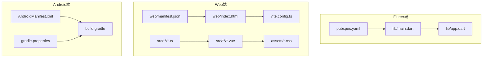

图表来源
- [main.dart:1-200](file://flutter_legado/lib/main.dart#L1-L200)
- [app.dart:1-200](file://flutter_legado/lib/app.dart#L1-L200)
- [pubspec.yaml:1-200](file://flutter_legado/pubspec.yaml#L1-L200)
- [index.html:1-200](file://flutter_legado/web/index.html#L1-L200)
- [manifest.json:1-200](file://flutter_legado/web/manifest.json#L1-L200)
- [vite.config.ts:1-200](file://modules/web/vite.config.ts#L1-L200)
- [bookshelf.css:1-200](file://modules/web/src/assets/bookshelf.css#L1-L200)
- [code.css:1-200](file://modules/web/src/assets/code.css#L1-L200)
- [kbd.css:1-200](file://modules/web/src/assets/kbd.css#L1-L200)
- [sourceeditor.css:1-200](file://modules/web/src/assets/sourceeditor.css#L1-L200)
- [App.vue:1-200](file://modules/web/src/App.vue#L1-L200)
- [main.ts:1-200](file://modules/web/src/main.ts#L1-L200)
- [AndroidManifest.xml:1-200](file://app/src/main/AndroidManifest.xml#L1-L200)
- [build.gradle:1-200](file://app/build.gradle#L1-L200)
- [gradle.properties:1-200](file://gradle.properties#L1-L200)

章节来源
- [main.dart:1-200](file://flutter_legado/lib/main.dart#L1-L200)
- [app.dart:1-200](file://flutter_legado/lib/app.dart#L1-L200)
- [pubspec.yaml:1-200](file://flutter_legado/pubspec.yaml#L1-L200)
- [index.html:1-200](file://flutter_legado/web/index.html#L1-L200)
- [manifest.json:1-200](file://flutter_legado/web/manifest.json#L1-L200)
- [vite.config.ts:1-200](file://modules/web/vite.config.ts#L1-L200)
- [bookshelf.css:1-200](file://modules/web/src/assets/bookshelf.css#L1-L200)
- [code.css:1-200](file://modules/web/src/assets/code.css#L1-L200)
- [kbd.css:1-200](file://modules/web/src/assets/kbd.css#L1-L200)
- [sourceeditor.css:1-200](file://modules/web/src/assets/sourceeditor.css#L1-L200)
- [App.vue:1-200](file://modules/web/src/App.vue#L1-L200)
- [main.ts:1-200](file://modules/web/src/main.ts#L1-L200)
- [AndroidManifest.xml:1-200](file://app/src/main/AndroidManifest.xml#L1-L200)
- [build.gradle:1-200](file://app/build.gradle#L1-L200)
- [gradle.properties:1-200](file://gradle.properties#L1-L200)

## 核心组件
- Flutter入口与主题初始化：在Flutter应用中通过入口文件加载主题、设置全局样式与平台检测逻辑，为iOS/Android提供一致的UI基线。
- Web前端资源与样式：使用Vite构建Vue应用，集中管理CSS样式与组件，适配不同浏览器的渲染差异。
- Android原生配置：通过清单与构建脚本控制字体、权限与平台能力，保证原生侧样式与行为一致性。

章节来源
- [main.dart:1-200](file://flutter_legado/lib/main.dart#L1-L200)
- [app.dart:1-200](file://flutter_legado/lib/app.dart#L1-L200)
- [index.html:1-200](file://flutter_legado/web/index.html#L1-L200)
- [vite.config.ts:1-200](file://modules/web/vite.config.ts#L1-L200)
- [AndroidManifest.xml:1-200](file://app/src/main/AndroidManifest.xml#L1-L200)

## 架构总览
下图展示Flutter与Web两端的关键交互与样式分发路径，以及Android原生配置对字体与主题的支撑。

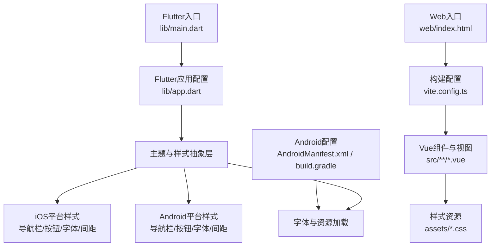

图表来源
- [main.dart:1-200](file://flutter_legado/lib/main.dart#L1-L200)
- [app.dart:1-200](file://flutter_legado/lib/app.dart#L1-L200)
- [index.html:1-200](file://flutter_legado/web/index.html#L1-L200)
- [vite.config.ts:1-200](file://modules/web/vite.config.ts#L1-L200)
- [bookshelf.css:1-200](file://modules/web/src/assets/bookshelf.css#L1-L200)
- [code.css:1-200](file://modules/web/src/assets/code.css#L1-L200)
- [kbd.css:1-200](file://modules/web/src/assets/kbd.css#L1-L200)
- [sourceeditor.css:1-200](file://modules/web/src/assets/sourceeditor.css#L1-L200)
- [AndroidManifest.xml:1-200](file://app/src/main/AndroidManifest.xml#L1-L200)
- [build.gradle:1-200](file://app/build.gradle#L1-L200)

## 详细组件分析

### Flutter端平台样式抽象与主题
- 主题抽象层：在Flutter应用中定义统一的主题对象，封装颜色、字体、间距、阴影等样式变量，按平台分支输出差异化值。
- 平台检测：使用Platform.isIOS与Platform.isAndroid进行条件渲染，决定导航栏高度、按钮圆角、字体大小等。
- 系统主题适配：根据系统深色模式切换主题，保持对比度与可读性一致。

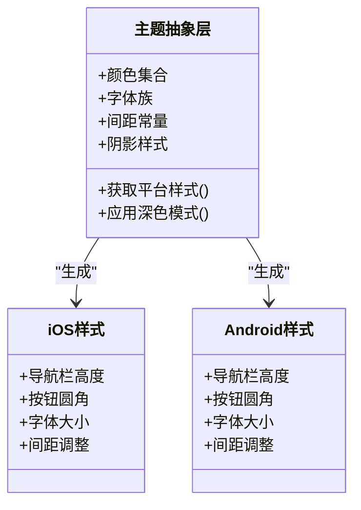

图表来源
- [app.dart:1-200](file://flutter_legado/lib/app.dart#L1-L200)
- [main.dart:1-200](file://flutter_legado/lib/main.dart#L1-L200)

章节来源
- [app.dart:1-200](file://flutter_legado/lib/app.dart#L1-L200)
- [main.dart:1-200](file://flutter_legado/lib/main.dart#L1-L200)

### Web端样式与浏览器兼容
- 构建与资源：Vite作为构建工具，集中管理CSS与JS资源，支持按需加载与压缩。
- 样式分层：基础样式（reset/normalize）、业务样式（bookshelf.css、code.css、kbd.css、sourceeditor.css）分离，便于维护与复用。
- 浏览器兼容：通过.browserslistrc或Vite配置指定目标浏览器，结合CSS特性检测与降级方案（如flexbox替代、动画回退）。

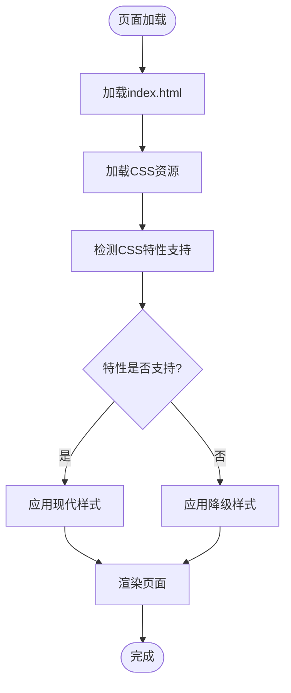

图表来源
- [index.html:1-200](file://flutter_legado/web/index.html#L1-L200)
- [vite.config.ts:1-200](file://modules/web/vite.config.ts#L1-L200)
- [bookshelf.css:1-200](file://modules/web/src/assets/bookshelf.css#L1-L200)
- [code.css:1-200](file://modules/web/src/assets/code.css#L1-L200)
- [kbd.css:1-200](file://modules/web/src/assets/kbd.css#L1-L200)
- [sourceeditor.css:1-200](file://modules/web/src/assets/sourceeditor.css#L1-L200)

章节来源
- [index.html:1-200](file://flutter_legado/web/index.html#L1-L200)
- [vite.config.ts:1-200](file://modules/web/vite.config.ts#L1-L200)
- [bookshelf.css:1-200](file://modules/web/src/assets/bookshelf.css#L1-L200)
- [code.css:1-200](file://modules/web/src/assets/code.css#L1-L200)
- [kbd.css:1-200](file://modules/web/src/assets/kbd.css#L1-L200)
- [sourceeditor.css:1-200](file://modules/web/src/assets/sourceeditor.css#L1-L200)

### Android原生样式与字体
- 字体加载：通过Android资源目录与构建脚本引入自定义字体，确保在不同设备上的显示一致性。
- 清单与权限：AndroidManifest.xml声明必要的权限与组件，影响UI行为（如全屏、状态栏样式）。
- 构建参数：gradle.properties与build.gradle控制编译选项，影响资源打包与样式生效范围。

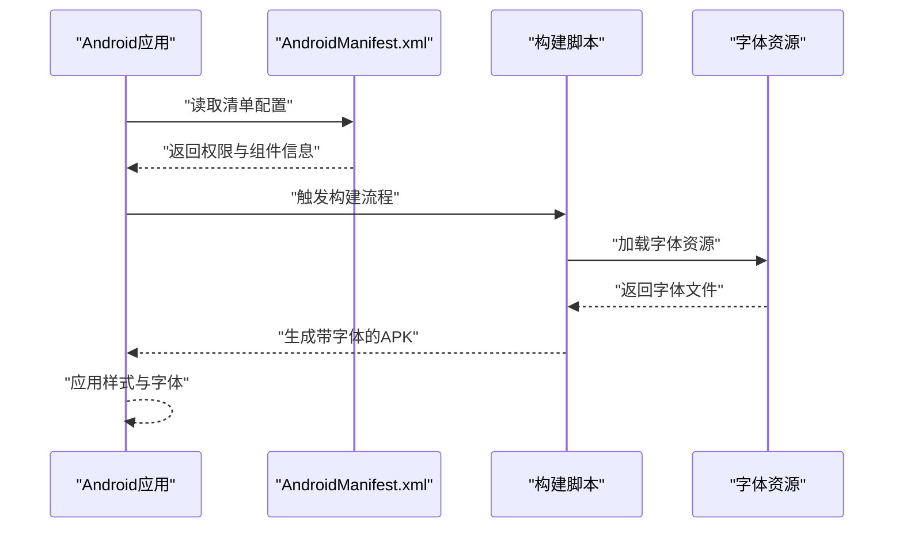

图表来源
- [AndroidManifest.xml:1-200](file://app/src/main/AndroidManifest.xml#L1-L200)
- [build.gradle:1-200](file://app/build.gradle#L1-L200)
- [gradle.properties:1-200](file://gradle.properties#L1-L200)

章节来源
- [AndroidManifest.xml:1-200](file://app/src/main/AndroidManifest.xml#L1-L200)
- [build.gradle:1-200](file://app/build.gradle#L1-L200)
- [gradle.properties:1-200](file://gradle.properties#L1-L200)

### 运行时环境检测与平台API
- Flutter平台检测：使用Platform.isIOS与Platform.isAndroid判断运行平台，动态调整UI样式与行为。
- Web浏览器检测：通过User-Agent或特性检测识别Safari、Chrome、Firefox，启用相应兼容逻辑。
- 原生API调用：在Flutter中通过插件调用系统API（如通知、文件系统），在Web中通过JavaScript API实现类似功能。

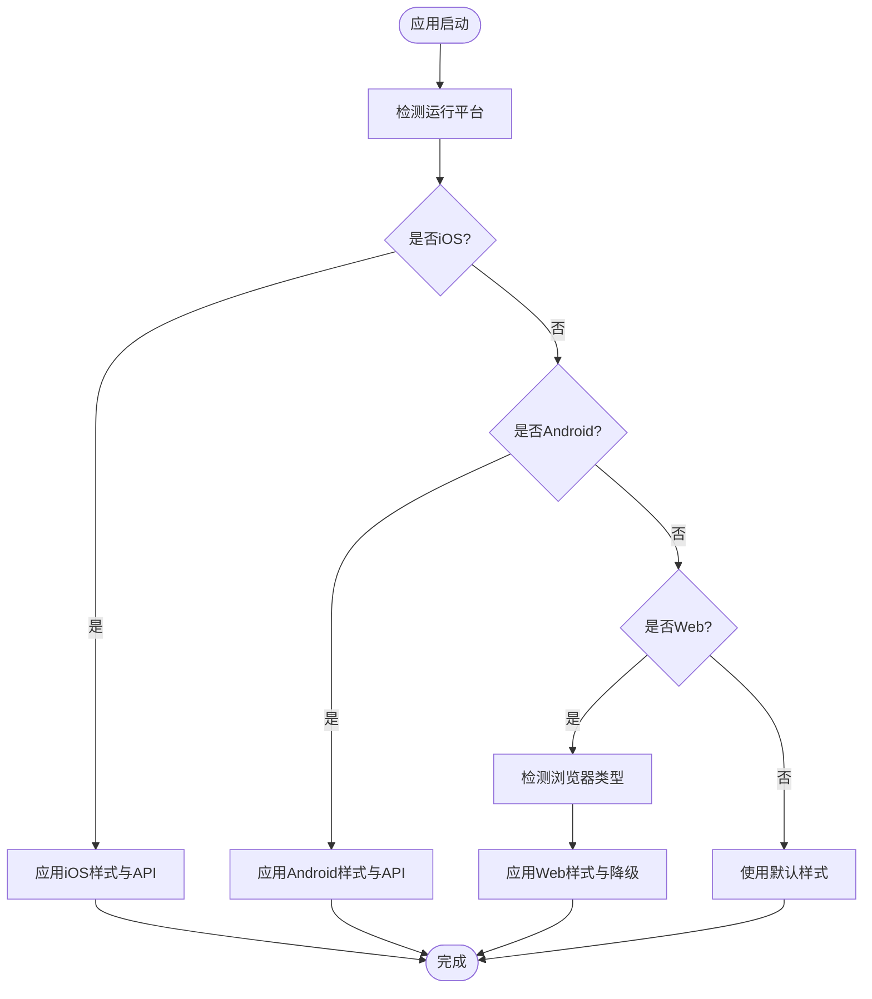

图表来源
- [main.dart:1-200](file://flutter_legado/lib/main.dart#L1-L200)
- [app.dart:1-200](file://flutter_legado/lib/app.dart#L1-L200)
- [index.html:1-200](file://flutter_legado/web/index.html#L1-L200)

章节来源
- [main.dart:1-200](file://flutter_legado/lib/main.dart#L1-L200)
- [app.dart:1-200](file://flutter_legado/lib/app.dart#L1-L200)
- [index.html:1-200](file://flutter_legado/web/index.html#L1-L200)

### 平台特定的UI组件选择
- 原生组件优先：在Flutter中优先使用Material/Cupertino组件，分别对应Android/iOS设计规范。
- 自定义组件：当原生组件无法满足需求时，开发自定义组件并封装平台差异逻辑。
- 系统主题适配：根据系统主题（浅色/深色）自动切换组件配色与图标。

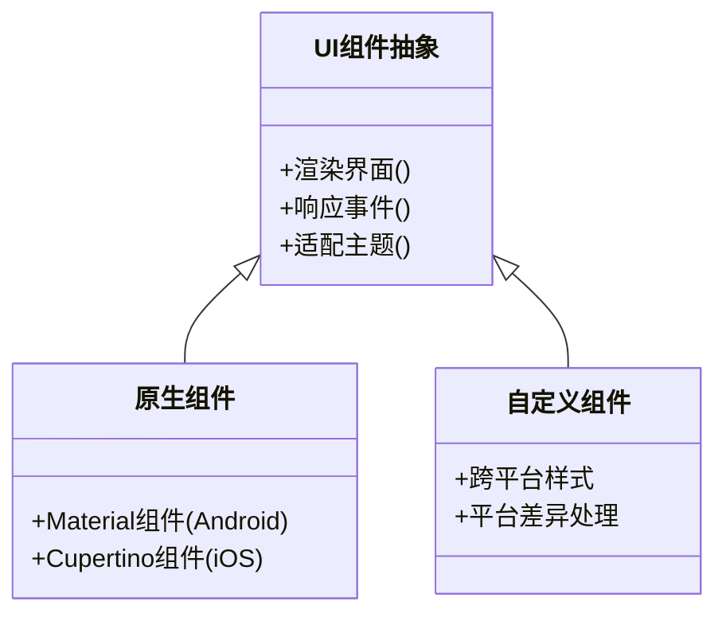

图表来源
- [app.dart:1-200](file://flutter_legado/lib/app.dart#L1-L200)
- [main.dart:1-200](file://flutter_legado/lib/main.dart#L1-L200)

章节来源
- [app.dart:1-200](file://flutter_legado/lib/app.dart#L1-L200)
- [main.dart:1-200](file://flutter_legado/lib/main.dart#L1-L200)

### Web浏览器兼容性处理
- CSS特性检测：使用@supports或JavaScript检测Flexbox、Grid、动画等特性，提供降级方案。
- 浏览器差异：针对Safari的WebKit特性、Chrome的Chromium优化、Firefox的Gecko引擎差异进行适配。
- 降级策略：在不支持的浏览器上回退到基础布局与样式，确保基本功能可用。

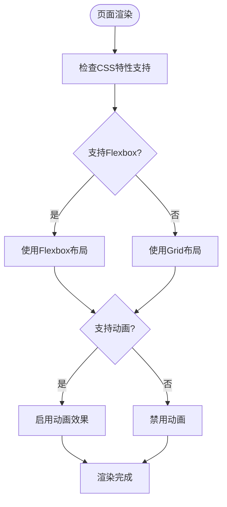

图表来源
- [bookshelf.css:1-200](file://modules/web/src/assets/bookshelf.css#L1-L200)
- [code.css:1-200](file://modules/web/src/assets/code.css#L1-L200)
- [kbd.css:1-200](file://modules/web/src/assets/kbd.css#L1-L200)
- [sourceeditor.css:1-200](file://modules/web/src/assets/sourceeditor.css#L1-L200)

章节来源
- [bookshelf.css:1-200](file://modules/web/src/assets/bookshelf.css#L1-L200)
- [code.css:1-200](file://modules/web/src/assets/code.css#L1-L200)
- [kbd.css:1-200](file://modules/web/src/assets/kbd.css#L1-L200)
- [sourceeditor.css:1-200](file://modules/web/src/assets/sourceeditor.css#L1-L200)

### 字体选择与加载
- Flutter字体：在pubspec.yaml中声明字体资源，并在主题中引用。
- Web字体：通过CSS @font-face或Google Fonts加载，考虑跨域与缓存策略。
- Android字体：将字体放入res/font目录，并通过代码或XML引用。

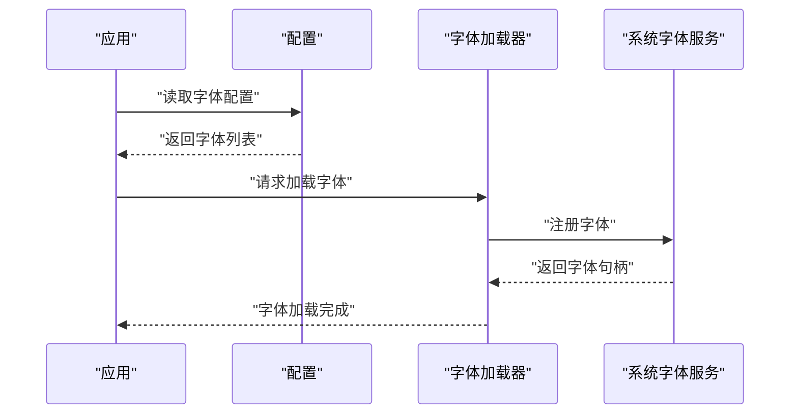

图表来源
- [pubspec.yaml:1-200](file://flutter_legado/pubspec.yaml#L1-L200)
- [AndroidManifest.xml:1-200](file://app/src/main/AndroidManifest.xml#L1-L200)

章节来源
- [pubspec.yaml:1-200](file://flutter_legado/pubspec.yaml#L1-L200)
- [AndroidManifest.xml:1-200](file://app/src/main/AndroidManifest.xml#L1-L200)

### 间距标准与布局规范
- Flutter间距：使用Theme中的间距常量，确保不同屏幕密度下的一致性。
- Web间距：采用rem/em单位，结合媒体查询适配不同设备。
- 平台差异：iOS与Android的默认边距与内边距不同，需在主题中统一。

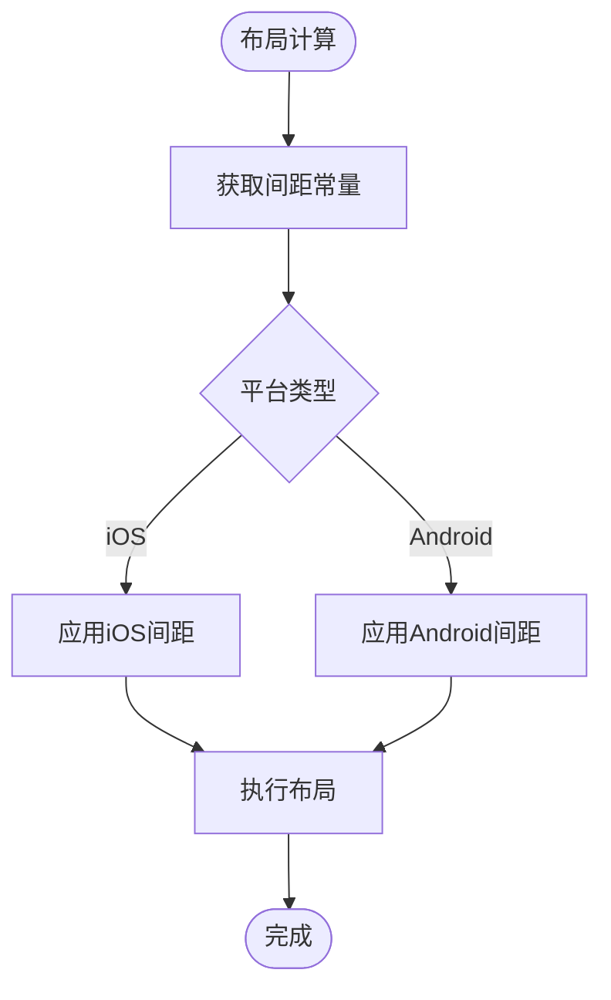

图表来源
- [app.dart:1-200](file://flutter_legado/lib/app.dart#L1-L200)
- [bookshelf.css:1-200](file://modules/web/src/assets/bookshelf.css#L1-L200)

章节来源
- [app.dart:1-200](file://flutter_legado/lib/app.dart#L1-L200)
- [bookshelf.css:1-200](file://modules/web/src/assets/bookshelf.css#L1-L200)

### 导航栏样式差异
- iOS导航栏：使用CupertinoNavigationBar，遵循Apple设计规范。
- Android导航栏：使用AppBar，遵循Material Design。
- Web导航栏：使用自定义组件，适配不同浏览器。

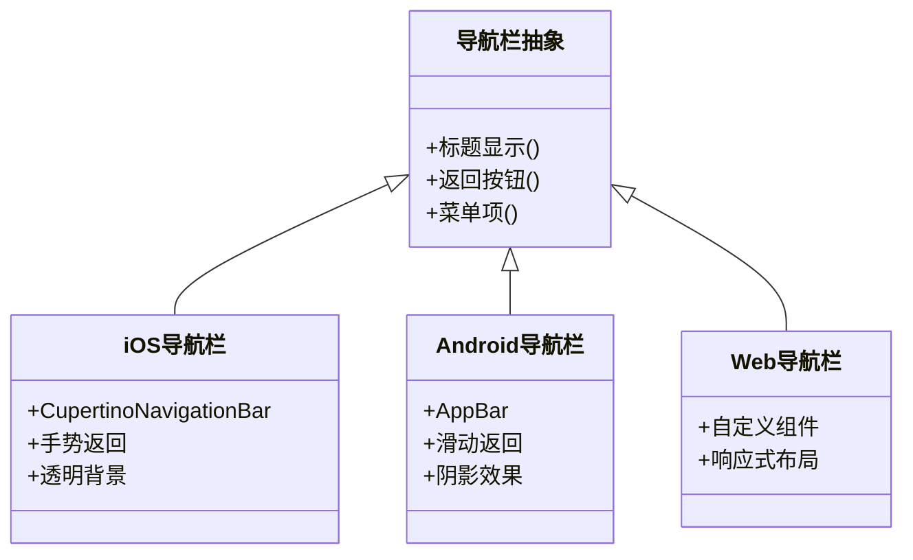

图表来源
- [app.dart:1-200](file://flutter_legado/lib/app.dart#L1-L200)
- [BookChapter.vue:1-200](file://modules/web/src/views/BookChapter.vue#L1-L200)
- [BookShelf.vue:1-200](file://modules/web/src/views/BookShelf.vue#L1-L200)

章节来源
- [app.dart:1-200](file://flutter_legado/lib/app.dart#L1-L200)
- [BookChapter.vue:1-200](file://modules/web/src/views/BookChapter.vue#L1-L200)
- [BookShelf.vue:1-200](file://modules/web/src/views/BookShelf.vue#L1-L200)

### 按钮风格差异
- iOS按钮：使用CupertinoButton，圆角较小，强调简洁。
- Android按钮：使用ElevatedButton/TextButton，圆角较大，强调层次。
- Web按钮：使用CSS样式模拟平台风格，保持一致性。

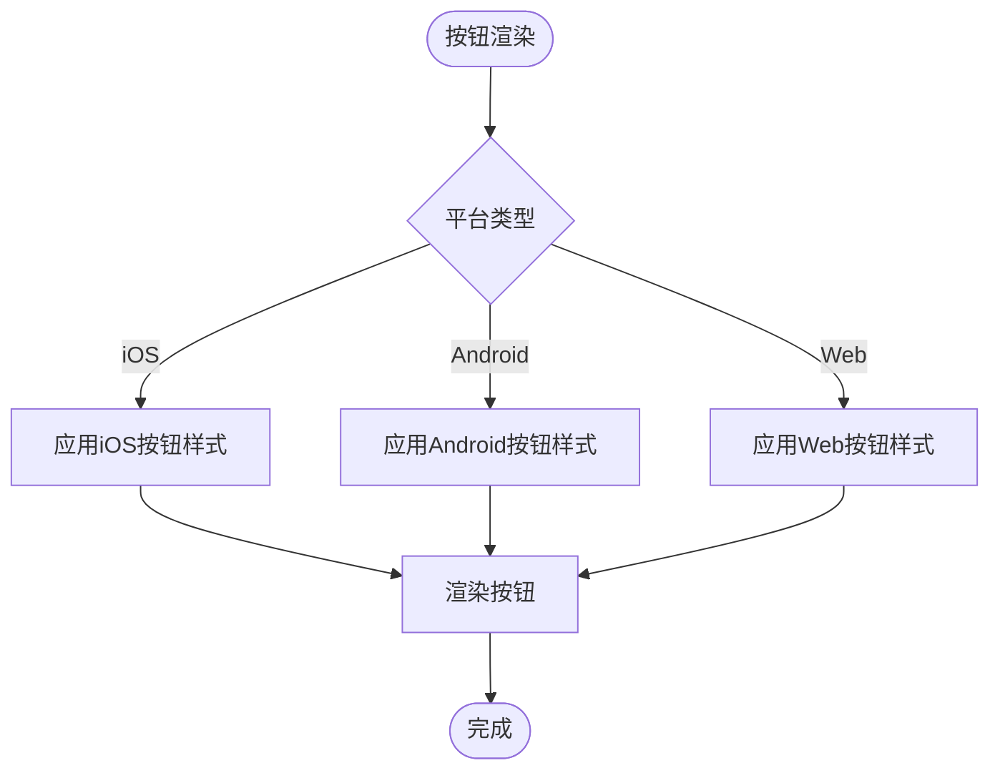

图表来源
- [app.dart:1-200](file://flutter_legado/lib/app.dart#L1-L200)
- [sourceeditor.css:1-200](file://modules/web/src/assets/sourceeditor.css#L1-L200)

章节来源
- [app.dart:1-200](file://flutter_legado/lib/app.dart#L1-L200)
- [sourceeditor.css:1-200](file://modules/web/src/assets/sourceeditor.css#L1-L200)

### 系统主题适配
- Flutter主题：使用ThemeData定义颜色与字体，支持深色模式。
- Web主题：使用CSS变量与@media (prefers-color-scheme)检测系统主题。
- Android主题：通过styles.xml与主题资源切换。

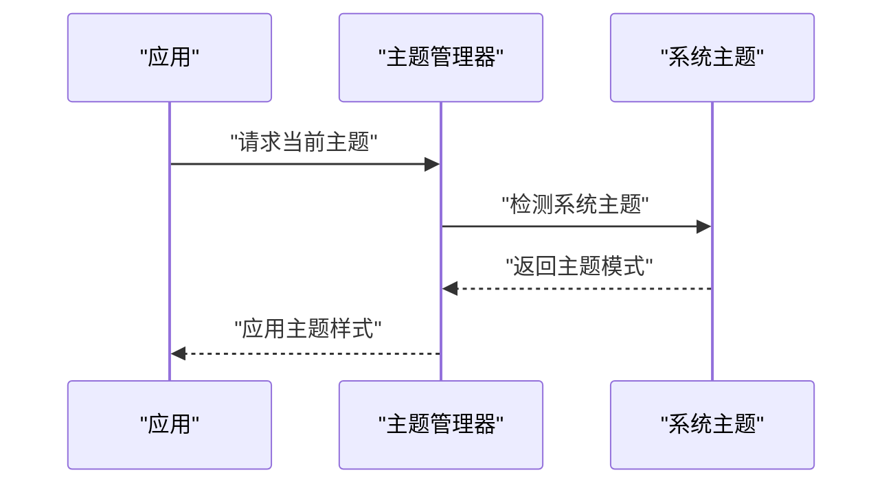

图表来源
- [app.dart:1-200](file://flutter_legado/lib/app.dart#L1-L200)
- [themeConfig.ts:1-200](file://modules/web/src/config/themeConfig.ts#L1-200)

章节来源
- [app.dart:1-200](file://flutter_legado/lib/app.dart#L1-L200)
- [themeConfig.ts:1-200](file://modules/web/src/config/themeConfig.ts#L1-200)

### 原生组件vs自定义组件
- 原生组件优势：符合平台规范，性能更优。
- 自定义组件优势：跨平台一致性强，可定制性高。
- 混合策略：常用组件使用原生，复杂场景使用自定义。

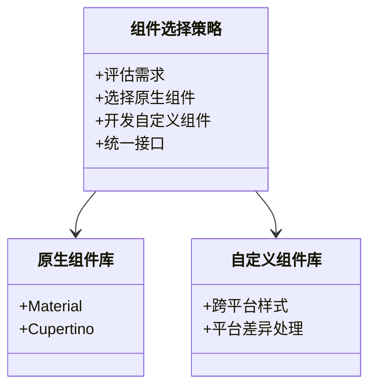

图表来源
- [app.dart:1-200](file://flutter_legado/lib/app.dart#L1-L200)
- [App.vue:1-200](file://modules/web/src/App.vue#L1-200)

章节来源
- [app.dart:1-200](file://flutter_legado/lib/app.dart#L1-L200)
- [App.vue:1-200](file://modules/web/src/App.vue#L1-200)

### 平台API调用
- Flutter插件：通过plugins调用系统API（如通知、文件、网络）。
- Web API：通过JavaScript API实现类似功能（如localStorage、fetch）。
- 桥接层：在Flutter中使用platform_channel与原生通信。

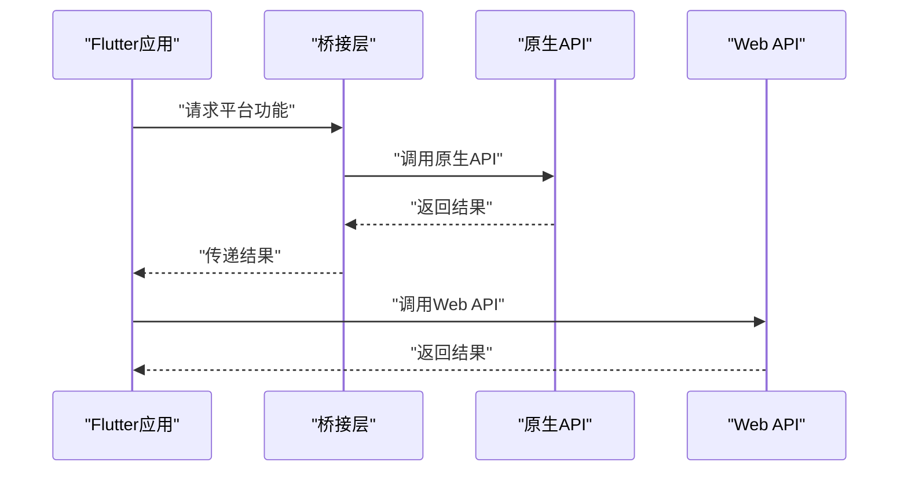

图表来源
- [main.dart:1-200](file://flutter_legado/lib/main.dart#L1-200)
- [index.html:1-200](file://flutter_legado/web/index.html#L1-200)

章节来源
- [main.dart:1-200](file://flutter_legado/lib/main.dart#L1-200)
- [index.html:1-200](file://flutter_legado/web/index.html#L1-200)

### 统一抽象层设计与最佳实践
- 抽象层设计：定义统一的样式接口，隐藏平台差异。
- 配置驱动：通过配置文件管理平台特定值。
- 测试覆盖：编写单元测试与集成测试验证样式一致性。

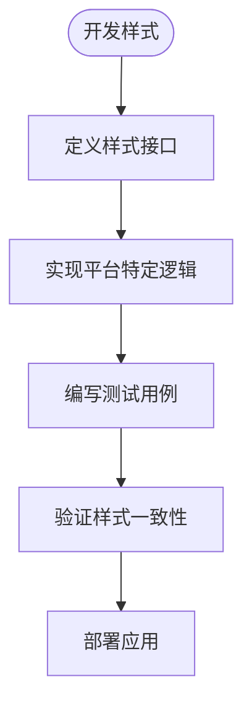

图表来源
- [app.dart:1-200](file://flutter_legado/lib/app.dart#L1-200)
- [themeConfig.ts:1-200](file://modules/web/src/config/themeConfig.ts#L1-200)

章节来源
- [app.dart:1-200](file://flutter_legado/lib/app.dart#L1-200)
- [themeConfig.ts:1-200](file://modules/web/src/config/themeConfig.ts#L1-200)

## 依赖关系分析
Flutter与Web端的依赖关系如下：

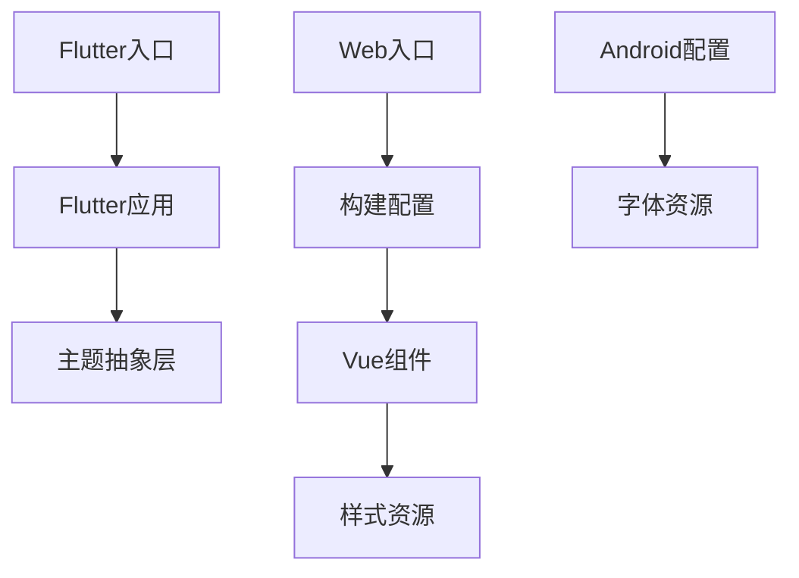

图表来源
- [main.dart:1-200](file://flutter_legado/lib/main.dart#L1-200)
- [app.dart:1-200](file://flutter_legado/lib/app.dart#L1-200)
- [index.html:1-200](file://flutter_legado/web/index.html#L1-200)
- [vite.config.ts:1-200](file://modules/web/vite.config.ts#L1-200)
- [AndroidManifest.xml:1-200](file://app/src/main/AndroidManifest.xml#L1-200)

章节来源
- [main.dart:1-200](file://flutter_legado/lib/main.dart#L1-200)
- [app.dart:1-200](file://flutter_legado/lib/app.dart#L1-200)
- [index.html:1-200](file://flutter_legado/web/index.html#L1-200)
- [vite.config.ts:1-200](file://modules/web/vite.config.ts#L1-200)
- [AndroidManifest.xml:1-200](file://app/src/main/AndroidManifest.xml#L1-200)

## 性能考量
- 字体加载优化：预加载关键字体，避免FOIT闪烁。
- CSS压缩与合并：减少HTTP请求，提升加载速度。
- 平台检测缓存：缓存平台检测结果，避免重复计算。

## 故障排查指南
- 字体显示异常：检查字体资源路径与权限，确认字体加载成功。
- 样式不一致：检查平台检测逻辑与主题配置，确保正确应用样式。
- 浏览器兼容问题：查看控制台错误，使用开发者工具调试CSS特性支持。

章节来源
- [FontSelectionInflationTest.kt:1-200](file://app/src/androidTest/java/io.legado.app/ui/font/FontSelectionInflationTest.kt#L1-200)
- [ReaderProviderRoutesTest.kt:1-200](file://app/src/test/java/io.legado.app/api/ReaderProviderRoutesTest.kt#L1-200)

## 结论
通过统一的抽象层设计与平台特定实现，本项目在iOS、Android与Web平台上实现了良好的样式一致性与兼容性。建议持续优化字体加载、CSS特性检测与平台API调用，以提升用户体验与开发效率。

## 附录
- 相关测试文件：
  - [FontSelectionInflationTest.kt](file://app/src/androidTest/java/io.legado.app/ui/font/FontSelectionInflationTest.kt)
  - [ReaderProviderRoutesTest.kt](file://app/src/test/java/io.legado.app/api/ReaderProviderRoutesTest.kt)
- 配置文件：
  - [pubspec.yaml](file://flutter_legado/pubspec.yaml)
  - [vite.config.ts](file://modules/web/vite.config.ts)
  - [AndroidManifest.xml](file://app/src/main/AndroidManifest.xml)